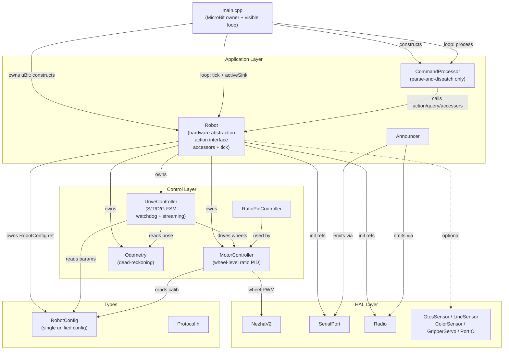
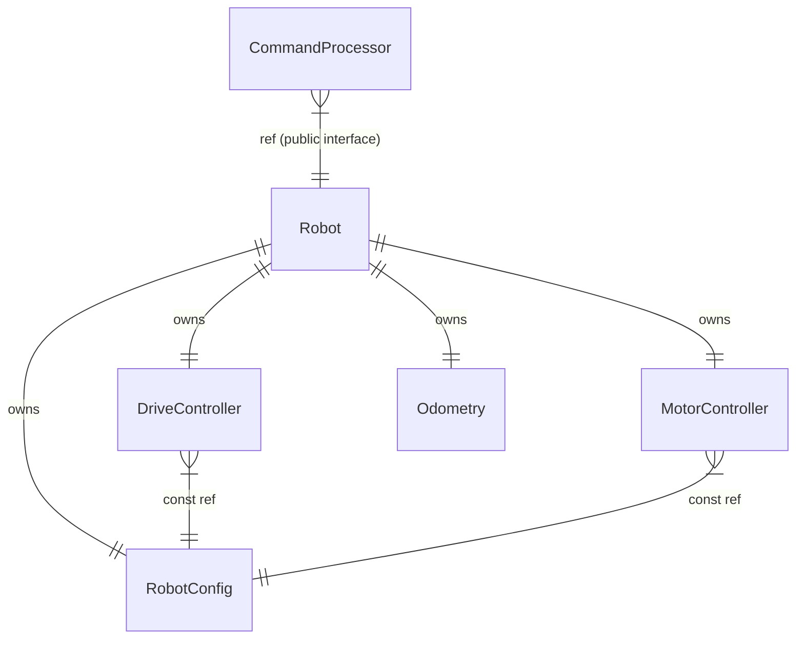

<!-- CLASI: Before changing code or making plans, review the SE process in CLAUDE.md -->

# Architecture Update — Sprint 007: Firmware Architecture Foundation

## What Changed

This sprint restructures the application layer and updates the types and control layers to establish a clean ownership model before any feature sprints build on the firmware.

### Sprint Changes Summary

| Area | Before | After |
|---|---|---|
| `MicroBit` ownership | First member of `Robot` | File-scope static in `main.cpp`; `Robot` takes peripheral refs |
| Main loop | Hidden inside `Robot::run()` | Visible in `main.cpp`; `Robot::run()` removed |
| Reply-sink routing | `cmd.tick()` hardwired to serial sink | `activeSink` tracked per-command-source; completions route to originating channel |
| Config | `CalibParams` + `CommandProcessor::Params` (duplicated `mmPerDegL/R`, `trackwidthMm`) | Single `RobotConfig` owned by `Robot`; all subsystems hold a `RobotConfig&` |
| Drive state | Owned by `CommandProcessor` (`_mode`, `_tEndMs`, `_dEnc*`, `_gPhase`, `_gArc*`, `_encTickCount`, `_prevOdoEnc*`, `_lastSMs`) | Owned by new `DriveController` in `source/control/` |
| `CommandProcessor` | Stores 8 hardware pointers + 2 config structs + all drive/gripper/odo state + `tick()` | Holds only `Robot& _robot`; `process(line, sink)` only |
| `Robot` public interface | None (opaque); `CommandProcessor` reaches into subsystems directly | Public action methods, query methods, component accessors, `tick(now_ms, sink)` |

---

## Why

The current structure has four compounding problems that block safe feature growth:

1. **Wrong ownership**: `MicroBit` inside `Robot` means any code needing `uBit` pulls in the entire subsystem graph. The idiomatic CODAL pattern is a file-scope singleton.
2. **Hidden loop**: `Robot::run()` makes the tick cadence and sink routing invisible; the reply-sink bug (`T+DONE` going to serial when the command came via radio) cannot be fixed without exposing the loop.
3. **God component**: `CommandProcessor` does parsing, drive state machines, watchdog, odometry integration, streaming, gripper state, and sensor I/O. It changes for every unrelated reason.
4. **Config divergence**: Two structs share `mmPerDegL/R` and `trackwidthMm`; a K-command update touches only one copy, causing silently wrong encoder math or arc geometry downstream.

---

## Module Descriptions

### `main.cpp` (revised)

**Purpose**: Owns the hardware singleton and the main loop.
**Boundary**: Loop orchestration only; no domain logic. Does not include sensor or control headers directly.
**Use cases served**: SUC-002, SUC-004

After the sprint:
- Declares `MicroBit uBit;` as file-scope static; calls `uBit.init()`.
- Constructs `Robot robot(uBit)` and `CommandProcessor cmd(robot)`.
- Runs `while(true)`: drain serial with serial sink; drain radio with radio sink; call `robot.tick(uBit.systemTime(), activeSink)`.
- Tracks `activeSink` — set to whichever sink dispatched the most recent command.
- Calls `announcer.handle(buf, sink)` before `cmd.process` on each line.

### `Robot` (`source/robot/Robot.{h,cpp}`) (revised)

**Purpose**: Abstraction around the micro:bit hardware; owns subsystems and exposes a clean action/query/accessor interface.
**Boundary**: Owns all subsystem instances as static members (no heap). Does not contain the main loop. Does not own `MicroBit`. Does not parse commands.
**Use cases served**: SUC-002, SUC-003, SUC-004, SUC-005

Constructor takes `MicroBit&` (discrete peripheral references: `uBit.i2c`, `uBit.serial`, `uBit.radio`, `uBit.io`). Owns `RobotConfig`, `DriveController`, `MotorController`, `Odometry`, sensors.

Public interface added this sprint:

```
// Action methods (called by CommandProcessor)
void stop();
void streamDrive(int32_t leftMms, int32_t rightMms);
void timedDrive(int32_t leftMms, int32_t rightMms, uint32_t ms);
void distanceDrive(int32_t leftMms, int32_t rightMms, int32_t mm);
void goTo(float x, float y, float speedMms);
void setGripperAngle(int32_t deg);
void zeroEncoders();
void setPose(int32_t x_mm, int32_t y_mm, int32_t h_cdeg);
void zeroOdometry();
// plus thin delegates for OTOS and port I/O

// Query methods — return plain structs, not formatted strings
struct EncoderReading { int32_t leftMm; int32_t rightMm; };
EncoderReading getEncoders() const;

struct Pose { int32_t x_mm; int32_t y_mm; int32_t h_cdeg; };
Pose getPose() const;

// Component accessors — for K*/O* config setters in CommandProcessor
RobotConfig&     config();
MotorController& motor();
DriveController& driveController();
Odometry&        odometry();
OtosSensor*      otos();         // nullable
LineSensor*      lineSensor();   // nullable
ColorSensor*     colorSensor();  // nullable
GripperServo*    gripper();      // nullable
PortIO&          portIO();

// Tick — no while loop inside
void tick(uint32_t now_ms, ReplyFn fn, void* ctx);
```

`Robot::run()` is removed.

### `DriveController` (`source/control/DriveController.{h,cpp}`) (new)

**Purpose**: Owns and advances the S/T/D/G drive state machines, S-mode watchdog, and encoder streaming counter.
**Boundary**: Calls `MotorController` for wheel control and reads `Odometry` for pose. Does not own sensors. Does not parse commands. Emits completion and telemetry strings through the injected `ReplyFn`.
**Use cases served**: SUC-003, SUC-004

State migrated from `CommandProcessor`:
- `DriveMode _mode`
- `uint32_t _lastSMs` (S-watchdog timestamp)
- `uint32_t _tEndMs` (T deadline)
- `int32_t _dEncStartL, _dEncStartR, _dTargetMm` (D distance)
- `GPhase _gPhase`, `_gTargetX/Y`, `_gSpeed`, `_gArcLeftMm/RightMm/StartL/R` (G two-phase)
- `int32_t _encTickCount` (streaming interval counter)
- `int32_t _prevOdoEncL, _prevOdoEncR` (odometry delta)

Public interface:
```
DriveController(MotorController& mc, Odometry& odo, const RobotConfig& cfg);
void beginStream(float leftMms, float rightMms, uint32_t now_ms);
void beginTimed(float leftMms, float rightMms, uint32_t durationMs, uint32_t now_ms);
void beginDistance(float leftMms, float rightMms, int32_t targetMm);
void beginGoTo(float x, float y, float speedMms, uint32_t now_ms);
void stop(uint32_t now_ms, ReplyFn fn, void* ctx);
void tick(uint32_t now_ms, uint32_t dt_ms, ReplyFn fn, void* ctx);
DriveMode mode() const;
```

`computeArc()` moves here as a private static (pure geometry, no state).

### `RobotConfig` (`source/types/Config.h`) (replaces `CalibParams` + `CommandProcessor::Params`)

**Purpose**: Single plain-old-data config struct for all runtime-tunable parameters; owned by `Robot`, passed by const reference to subsystems.
**Boundary**: No logic, no dependencies. Pure data with a factory function.
**Use cases served**: SUC-001, SUC-006

Fields — union of `CalibParams` + `CommandProcessor::Params` with duplicates collapsed:
- `float mmPerDegL, mmPerDegR` (single copy; was duplicated)
- `float trackwidthMm` (single copy; was duplicated)
- `float kFF, kScaleLF, kScaleLB, kScaleRF, kScaleRB`
- `float kAdjThreshold, kAdjGain`
- `float ratioPidKp, ratioPidKi, ratioPidKd, ratioPidMax`
- `float turnThresholdMm, doneTolMm`
- `float distScale, turnScale`
- `int32_t minSpeedMms, tickMs, sTimeoutMs, encReportEvery`

`CalibParams` struct and `defaultCalibParams()` are deleted. `CommandProcessor::Params` struct is deleted. `defaultRobotConfig()` is the new factory function.

`MotorController` ctor changes from `const CalibParams&` to `const RobotConfig&`.

### `CommandProcessor` (`source/app/CommandProcessor.{h,cpp}`) (thinned)

**Purpose**: Pure wire-protocol parser and dispatcher. Tokenizes command lines and calls `Robot` public methods or component setters.
**Boundary**: Single member `Robot& _robot`. No hardware pointers. No drive state. No config copy. No `tick()`. No `init()`.
**Use cases served**: SUC-005

After the sprint:
```cpp
class CommandProcessor {
public:
    explicit CommandProcessor(Robot& robot);
    void process(const char* line, ReplyFn fn, void* ctx);
private:
    Robot& _robot;
    static int parseSignedArgs(const char* s, int32_t* out, int maxArgs);
    static int clampInt(int v, int lo, int hi);
    static int clampMinSpeed(int mms, int minSpeedMms);
};
```

K*/O* setters write through `_robot.config()`, `_robot.motor()`, etc. Query commands call `_robot.getEncoders()`, `_robot.getPose()`, etc. and format results into wire strings (wire format is unchanged this sprint).

### `Announcer` (`source/app/Announcer.{h,cpp}`) (unchanged behavior)

No behavioral changes. Constructor already takes `MicroBit&`; it will now receive it from `main.cpp` instead of from `Robot`. Interface is unchanged.

---

## Impact on Existing Components

| Component | Change |
|---|---|
| `MotorController` | `const CalibParams&` → `const RobotConfig&`; interface otherwise unchanged |
| `Odometry` | No struct change; caller (`DriveController`) passes `config.trackwidthMm`; `update()` signature unchanged |
| `NezhaV2` | No change; called by `MotorController` as before |
| HAL layer | No change |
| Navigation layer | No change; not activated in this sprint |
| `Protocol.h` | No change; wire strings are preserved as-is |

---

## Component Diagram



---

## Entity Relationship — Config Ownership



---

## Migration Concerns

- **Incremental buildability**: Each ticket (phase) leaves the firmware in a buildable, deployable state. `mbdeploy deploy --build` is run after each ticket and the smoke sequence is verified on the stand.
- **`CalibParams` removal in Ticket 001**: Every type that holds `const CalibParams&` (`MotorController`) must be updated atomically in the same change. A partial migration where both structs exist simultaneously is acceptable as a compilation unit (they can coexist during the ticket), but the old struct must be deleted at the end of Ticket 001.
- **`MicroBit` move order guarantee**: `uBit.init()` must be called in `main()` before `Robot` is constructed. This preserves the init-order guarantee currently provided by member-declaration order inside `Robot`. `Robot`'s constructor body may call peripheral `begin()` methods as before.
- **`Robot::run()` removal in Ticket 004**: The loop in `main.cpp` replicates the existing serial/radio/tick structure exactly. The only semantic change is that `activeSink` is threaded through to `robot.tick()`. The existing radio ring-buffer (`4-slot`) requires no changes.
- **Wire string compatibility**: All command responses (ENC+…, SO…, T+DONE, SAFETY_STOP, etc.) are produced with identical strings after the refactor. The parser formats them as before; only the internal dispatch path changes.

---

## Design Rationale

### Decision: Move MicroBit to main.cpp rather than keeping it in Robot
**Context**: CODAL requires `MicroBit` to be constructed before any code that calls `uBit.i2c` etc. Currently guaranteed by member-declaration order inside `Robot`.
**Alternatives considered**: Keep `MicroBit` in `Robot` with a static accessor; introduce a global `uBit` pointer.
**Why this choice**: File-scope `MicroBit uBit` in `main.cpp` is the idiomatic CODAL pattern. It makes hardware dependencies explicit (callers receive `uBit.i2c` by reference). It removes `Robot`'s obligation to manage CODAL initialization. Construction order is still guaranteed (static init runs before `main()` body; `Robot` is constructed after `uBit.init()` returns in `main()`).
**Consequences**: `Robot`'s constructor signature changes; `Announcer` receives `MicroBit&` from `main.cpp`.

### Decision: DriveController in control layer, not nested inside Robot
**Context**: Drive state machines use `MotorController` and `Odometry`, both already in the control layer. Robot's role is hardware abstraction; the drive FSM is business logic on top of wheel control.
**Alternatives considered**: Nested class inside Robot; private methods on Robot; free functions with state structs.
**Why this choice**: Placing `DriveController` in `source/control/` keeps the control layer self-contained and aligns with existing layer conventions. `Robot` delegates to it via a single owned instance, keeping `Robot`'s public interface clean without exposing state machine internals.
**Consequences**: `DriveController` depends on `MotorController` and `Odometry` — no upward dependency introduced; both already in control layer.

### Decision: RobotConfig passed by const reference, not pointer; no null-cal paths
**Context**: `CommandProcessor` currently guards against `_cal == nullptr` because `setCalib()` was optional. This produced dead code paths and silent defaults.
**Alternatives considered**: Keep nullable pointer with runtime checks; use a thread-local default.
**Why this choice**: `RobotConfig` is owned by `Robot`, constructed before anything else, and never null. Passing by const reference enforces this at the type level, eliminates defensive null checks, and makes the single-source-of-truth contract visible at every call site.
**Consequences**: `MotorController(NezhaV2&, const RobotConfig&)` — ctor signature changes in Ticket 001.

---

## Open Questions

None. All design decisions are locked by the approved issue (`firmware-architecture-refactor.md`). The stakeholder decisions (DriveController for S/T/D/G; MotorController stays wheel-level PID; single RobotConfig; sequence before protocol-v2) are recorded in the issue and preserved here.
