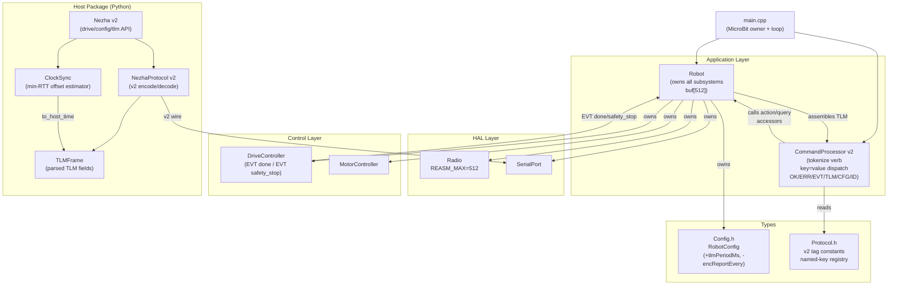

<!-- CLASI: Before changing code or making plans, review the SE process in CLAUDE.md -->

# Architecture Update — Sprint 009: Protocol v2 and Host Controller Migration

## What Changed

### Firmware — Buffer Ceiling Raise

`Radio::REASM_MAX` and `Robot::_buf` are raised from 256 to 512 bytes.
The TX fragmentation path in `Radio::send()` already handles messages longer than
one frame, so this is a pure constant change. `MICROBIT_RADIO_MAX_PACKET_SIZE=250`
in `codal.json` is confirmed (already set; the relay's 247-byte MTU drives framing,
not this constant).

### Firmware — CommandProcessor v2 (Protocol.h + CommandProcessor)

`CommandProcessor::process()` is fully rewritten for proto=2. The key structural
changes:

| Before (v1) | After (v2) |
|---|---|
| Whole line upper-cased before dispatch | Only the verb token is upper-cased; remaining tokens preserve case |
| Sign-prefix packed args (`+200-150`) | Space-separated positional args + `key=value` tokens |
| 24× one-key `K*` per-constant commands | `SET key=val…` / `GET [key…]` named-registry over existing `RobotConfig` |
| Scattered `ACK:`/`ERR:`/`LOG:`/`+DONE` | Unified `OK`/`ERR`/`EVT`/`TLM`/`CFG`/`ID` response taxonomy |
| No `#id` correlation | Optional trailing `#<id>` echoed in every response for that command |
| `G` overloaded (go-to vs gripper) | `G` = go-to only; `GRIP` = gripper |
| `EZ`+`SZ` separate zeroing commands | `ZERO enc\|pose\|enc pose` umbrella |
| No `PING`/`ECHO`/`ID`/`VER`/`HELP` | All five added |
| Scattered `ENC`/`CS`/`LS`/`SO` streaming | Single `TLM` frame + `STREAM`/`SNAP` |

`Protocol.h` is updated with v2 tag constants (`"OK"`, `"ERR"`, `"EVT"`, `"TLM"`,
`"CFG"`, `"ID"`) and a registry of named config keys mapping to `RobotConfig`
fields. No new struct is introduced; the named-key registry is a static table
inside the translation unit — no heap, no dynamic lookup.

### Firmware — Telemetry Refactor (Robot::tick + DriveController)

`DriveController::tick()` previously emitted `ENC…`, `CS…`, `LS…` as separate
lines via the streaming callback. In v2 these are consolidated: `Robot::tick()`
assembles a single `TLM t=… …` line from all available sensors, stamping `t=` at
the sensor-sample instant (before the `snprintf`). The streaming period is
controlled by the `STREAM <ms>` command (stored in `RobotConfig::tlmPeriodMs`).
`SNAP` triggers a one-shot frame on the next tick.

`DriveController`'s per-sensor stream enable flags (`encReportEvery`, etc.) are
removed. The single `tlmPeriodMs` (0 = off) replaces them.

### Firmware — Announcer Removed

`Announcer` is removed. Its `DEVICE:<type>:<name>` startup message and `HELLO`
intercept are replaced by the `ID` command. This removes a class, one include,
and the `HELLO` special-case from `CommandProcessor`.

### Host — `robot_radio/` Package (Python)

The `robot_radio` package is copied from the scratch location into this repo at
`host/robot_radio/`. A `host/pyproject.toml` (or similar) makes it installable.
The protocol layer is updated for v2:

- `NezhaProtocol` (formerly `protocol.py`) is rewritten to emit and parse v2
  wire messages: `S <l> <r>`, `T <l> <r> <ms>`, `D <l> <r> <mm>`,
  `G <x> <y> <speed>`, `STOP`, `GRIP [deg]`, `ZERO [fields]`, `SET key=val…`,
  `GET [keys]`, `PING`, `ECHO`, `ID`, `VER`, `HELP`, `STREAM <ms>`, `SNAP`.
- Response parsers match `OK`/`ERR`/`EVT`/`TLM`/`CFG`/`ID` tag prefixes.
- `TLMFrame` dataclass carries all `TLM` fields including `t` (robot ms);
  consumers use the clock-sync module to translate to host time.
- The sign-prefix helpers (`_sign()`) and all v1 parse regexes are deleted.

### Host — Clock-Sync Module (`host/robot_radio/robot/clock_sync.py`)

A new `ClockSync` class implements the host-side NTP-style offset estimator
described in the issue:

- `record_ping(t0, t1, t_robot)` — stores one sample.
- `best_offset()` — returns the offset from the minimum-RTT sample.
- `to_host_time(t_robot_ms)` — translates a robot timestamp to host time.
- `stale()` — true if the last ping burst was more than 60 s ago.

Robot clock is never set from the host. The module is pure Python with no
external dependencies.

---

## Why

The legacy 19-char MakeCode packed protocol (`S+200-150`, `KCP+20`, 24
one-liner `K*` responses) was designed for a radio limit that no longer
applies. RAW250 mode (transport done in Sprint 007) allows up to 247-byte
payloads per fragment and reassembles across fragments. This sprint exploits
that capacity to give the protocol human-readable, debuggable, extensible
vocabulary.

The host-controller package must speak the same protocol as the firmware.
Migrating it here ensures both sides evolve together rather than diverging
across two repositories.

---

## Impact on Existing Components

| Component | Change |
|---|---|
| `CommandProcessor` | Full rewrite of `process()`; `parseSignedArgs()` removed; new `parseTokens()` + `parseKV()` static helpers added |
| `Protocol.h` | All v1 constants replaced with v2 tags and named-key registry |
| `Robot.h` / `Robot.cpp` | `_buf[256]` → `_buf[512]`; `sensorReport` callback replaced by unified TLM assembly; `Announcer` member removed |
| `Radio.h` | `REASM_MAX 256` → `REASM_MAX 512` |
| `Config.h` (`RobotConfig`) | `encReportEvery` removed; `tlmPeriodMs` + `tlmSnapPending` added; `tlmFields` bitmask (optional subset) added |
| `Announcer` | Removed entirely (class file deleted) |
| `DriveController` | Per-sensor stream flags and `sensorReport` callback removed; `EVT done` / `EVT safety_stop` use the new response taxonomy |
| `main.cpp` | `Announcer` construction removed |
| `host/robot_radio/` | New directory (package copy); `protocol.py` and `nezha.py` rewritten for v2 |
| `host/robot_radio/robot/clock_sync.py` | New file |

**No changes to**: Motor, MotorController, RatioPidController, Odometry,
DriveController drive-state machines, OtosSensor, LineSensor, ColorSensor,
Servo, PortIO, SerialPort, Radio (framing logic), navigation layer. These are
untouched — sprint 009 is vocabulary only (plus the buffer constant).

---

## Migration Concerns

**Hard break — no backward compatibility.** Any host speaking v1 will receive
`ERR` responses or no response to its legacy commands. This is intentional and
locked with the stakeholder. There is no dual-parse mode.

**Deployment sequencing.** Flash new firmware and deploy updated host package
atomically. The relay is transparent and requires no change.

**`codal.json` check.** `MICROBIT_RADIO_MAX_PACKET_SIZE=250` must be present.
This was set in Sprint 007; confirm it is not accidentally reverted.

---

## Component / Module Diagram



---

## Dependency Graph — Named-Key Registry

The `SET`/`GET` registry is a static table in `CommandProcessor.cpp`.
It maps string keys to `RobotConfig` field offsets/types. No new module;
no cross-layer dependency. `CommandProcessor` already holds `Robot&` and
calls `_robot.config()` — the registry merely formalizes what the old
`K*` switch already did.

```
CommandProcessor → RobotConfig (via Robot::config()) — unchanged dependency direction
```

---

## Design Rationale

### Decision: Hard break, no dual-parse mode
**Context**: The legacy sign-prefix packed format and v2 `key=value` format are
syntactically incompatible. Maintaining both requires branching on the first
character of every line.
**Alternatives**: (a) dual-parse behind a `proto=` negotiation header;
(b) version flag in `codal.json`.
**Why this choice**: The stakeholder locked hard break. Dual-parse doubles the
parser surface and adds a negotiation handshake with no benefit during active
development flux. Clean slate is cheaper now.
**Consequences**: Flash + host deploy must be atomic; no gradual rollout.

### Decision: Named-key registry as a static table in CommandProcessor.cpp
**Context**: `GET` must dump ~24 params in one response; `SET` must validate key
names and write through to `RobotConfig`.
**Alternatives**: (a) macro-generated struct reflection; (b) separate `Registry`
class; (c) continue the per-key switch but with v2 names.
**Why this choice**: A static `{key, type, offset}` table is ~30 lines, requires
no heap, and is cohesive with the parser. A separate `Registry` class adds a
module for one responsibility that already belongs to `CommandProcessor`.
**Consequences**: Adding a new config param requires one table row + one
`RobotConfig` field. No runtime overhead.

### Decision: Single TLM frame assembled in Robot::tick()
**Context**: Previously `DriveController::tick()` emitted sensor lines via a
callback. This scattered the framing logic across two classes.
**Alternatives**: (a) keep per-sensor callbacks, aggregate in the caller;
(b) move all sensor reads into `CommandProcessor`.
**Why this choice**: `Robot::tick()` already reads sensor state for its own
bookkeeping. Assembling TLM there keeps framing in one place and ensures the
sample timestamp (`t=`) is captured at read time, not at string-format time.
`CommandProcessor` remains a pure parser — it does not touch sensor state.
**Consequences**: `DriveController` loses the streaming callback (simplified);
`Robot::tick()` gains one `snprintf` path guarded by `tlmPeriodMs > 0`.

### Decision: ClockSync as a standalone host-side module
**Context**: The robot clock is monotonic and must not be set from the host.
Timestamp translation is purely a host concern.
**Alternatives**: (a) inline offset computation in `NezhaProtocol`; (b) add
`SETTIME` firmware command.
**Why this choice**: `SETTIME` would require firmware changes and would corrupt
odometry `dt` on a clock jump. A standalone `ClockSync` module is testable in
isolation, has a single responsibility, and requires zero firmware changes beyond
the existing `PING t=` response.
**Consequences**: Hosts that do not call `ping_burst()` will have `offset=0`
(robot ms used as-is). The module is optional infrastructure, not a hard
dependency of `NezhaProtocol`.

---

## Open Questions

1. **OTOS/port carry-over naming.** The issue says "OTOS/port commands carry
   over with the same word + `key=value` treatment." The exact v2 command names
   for `OI`, `OZ`, `OR`, `OP`, `OV`, `OL`, `OA`, `OO`, `PA`, `P` are not
   specified in the issue. Sprint 009 ticket 005 (motion/misc) should define
   these, or scope them to the spec-doc ticket and carry them into Sprint 010.
   **Recommendation**: Retain existing verb names (they are already readable
   English abbreviations) and add `key=value` reply format; document in spec.

2. **`TLM vel=` field.** The issue shows `vel=200,0,15` but the firmware
   currently has no per-tick velocity estimate (velocity is read from the Nezha
   chip in Sprint 008 via `readSpeed`). If Sprint 008 is not yet merged, the
   `vel=` field should be omitted from the TLM frame until the velocity signal
   is available. Mark the `vel=` field as conditional on `_velocityAvailable`.

3. **`STREAM fields=` subset bitmask.** The issue mentions `STREAM fields=enc,pose,line`
   as a subset subscription. The implementation complexity is low but the field
   naming must be locked before coding. Ticket 004 should define the canonical
   field names (`enc`, `pose`, `vel`, `line`, `color`) and the parser for the
   `fields=` token.

4. **Host package location and installability.** The issue says "copy
   `robot_radio` into this repo." The target path `host/robot_radio/` is
   proposed here; a `host/pyproject.toml` is implied. Confirm with stakeholder
   whether `mbdeploy` (the existing Python toolchain) should wrap the host
   package or whether it is a standalone install.
