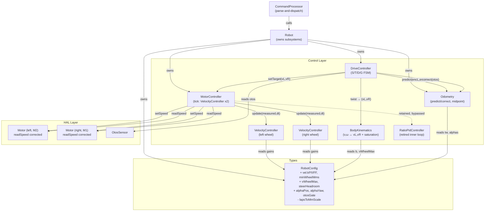

<!-- CLASI: Before changing code or making plans, review the SE process in CLAUDE.md -->

# Architecture Update — Sprint 010: Kinematics: Velocity Control and Pose Estimation

## What Changed

### Control Layer — New Modules

**`BodyKinematics`** (new, `source/control/BodyKinematics.h/.cpp`)
A pure-math module with no state. Provides:
- Inverse map `(v, ω) → (vL, vR)` using `vL = v - ω*(b/2)`, `vR = v + ω*(b/2)`.
- Forward map `(vL, vR) → (v, ω)`.
- Saturation scaler: when `max(|vL|, |vR|) > vWheelMax`, computes
  `s = vWheelMax / max(|vL|, |vR|)` and scales both equally. Incorporates
  `steerHeadroom` as a configurable ceiling reduction.
- Takes `b` and `vWheelMax` from `RobotConfig` at call time; no stored state.

**`VelocityController`** (new, `source/control/VelocityController.h/.cpp`)
Per-wheel PI + feed-forward velocity controller. Provides:
- `setSetpoint(float mms)` — update wheel speed target.
- `update(float measured, float dt_s) → float pwmPct` — compute PWM% output.
- PI structure: `pwm = kFF*|sp| + kP*err + I`; integrator clamped to `iMax`.
- Anti-windup: integrator frozen when output is rail-limited (±100 PWM%).
- Low-speed deadband: integrator not accumulated below `minWheelMms`.
- Two instances held by `MotorController` (one per wheel).

### Control Layer — Modified Modules

**`MotorController`** (modified, `source/control/MotorController.*`)
- `tick()` replaces the cumulative ratio PID inner loop with two
  `VelocityController::update()` calls.
- `RatioPidController` is no longer invoked for normal drive (retired from the
  inner loop; class retained for now to avoid breaking compile, but gains
  zeroed or bypassed).
- `kFF`, `kScaleLF/LB/RF/RB`, `kAdjThreshold`, `kAdjGain`, and `_cmdRatio`
  ratio-PID fields remain in the struct for backward compatibility but are
  ignored by the new tick path.

**`Odometry`** (modified, `source/control/Odometry.*`)
- Adds internal `_prevEncL`, `_prevEncR` (mm) fields — encoder snapshot owned
  here, not by `DriveController`.
- New `predict(float encLMm, float encRMm, float trackwidthMm)` method:
  computes deltas from stored previous positions, applies midpoint integration.
- New `correct(float x_otos, float y_otos, float θ_otos_rad, float alphaPos,
  float alphaYaw, float otosGate)` method: outlier-gates then complementary-
  blends the OTOS measurement.
- `update(dL, dR, tw)` retained (or replaced by `predict`) — implementation
  detail for the programmer; the key is that midpoint heading is used.
- Heading wrap uses `atan2f(sinf(θ), cosf(θ))` or equivalent to stay in
  `(-π, π]` after each tick.

**`DriveController`** (modified, `source/control/DriveController.*`)
- Removes `_prevOdoEncL`, `_prevOdoEncR` fields; passes raw encoder positions
  to `Odometry::predict()` each tick instead of computing deltas itself.
- Calls `Odometry::correct()` on each slow-cadence tick when an OTOS sample
  is fresh.

### HAL Layer — Modified Module

**`Motor::readSpeed`** (modified, `source/hal/Motor.cpp`)
- Corrected conversion: `mm/s = (raw / 10.0f) * mmPerDeg * sign`.
- Deletes `lapsToMmScale` usage; no longer calls `floorf(raw/3.6f)*0.01f`.
- `fwdSign` is already applied via `_lastDir`; sign propagation unchanged.

### Types — Modified

**`RobotConfig`** (modified, `source/types/Config.h`)

Fields deleted:
- `lapsToMmScale` — replaced by the corrected `readSpeed` formula using
  `mmPerDeg`.

Fields added (all with `defaultRobotConfig()` values):
- `vel.kP` — velocity loop proportional gain (default 0.3)
- `vel.kI` — velocity loop integral gain (default 0.05)
- `vel.kFF` — velocity loop feed-forward coefficient (default 0.15)
- `minWheelMms` — deadband: integrator frozen below this speed (default 20.0 mm/s)
- `vWheelMax` — wheel speed ceiling for saturation scaling (default 400.0 mm/s)
- `steerHeadroom` — headroom below ceiling reserved for steering (default 20.0 mm/s)
- `alphaPos` — OTOS position blend gain (default 0.15)
- `alphaYaw` — OTOS heading blend gain (default 0.10)
- `otosGate` — outlier rejection threshold in mm (default 50.0)

Note: `RobotConfig` may represent nested names (`vel.kP`) as flat fields
(`velKp`) since C++ struct members cannot contain dots. The SET/GET key
string uses the dotted form.

### Application Layer — Modified Module

**`CommandProcessor`** (modified, `source/app/CommandProcessor.cpp`)
- Adds `kRegistry[]` entries for all new velocity and fusion config keys.
- Removes `kRegistry[]` entry for `lapsToMmScale`.
- Adds `GET VEL` command (or `vel=` in TLM): returns per-wheel mm/s and
  source flag (chip / encoder fallback) from `MotorController`.

---

## Why

The cumulative-distance ratio PID inner loop (`RatioPidController`) is a
distance-equalization heuristic, not a velocity controller. It cannot hold a
commanded wheel speed; it only equalize accumulated travel. This makes it
unsuitable as the Layer-1 controller beneath body kinematics (Layer 2) and the
go-to pose controller (Sprint 011, Layer 3). The velocity PID replaces it with
a proper feedback loop on measured wheel speed.

Body kinematics (`BodyKinematics`) centralizes the only place in the codebase
that knows how `(v, ω)` maps to `(vL, vR)`. Without this, every command type
that wants to command a body twist duplicates the formula (and the saturation
logic), diverging over time.

Saturation scaling preserves arc geometry under load — the existing ratio PID
attempted the same goal via cross-coupling corrections that are reactive and
chattery; the forward scaling is deterministic and geometry-preserving.

`Motor::readSpeed` fix is required before the velocity PID can use chip
velocity as its feedback signal. The old `lapsToMmScale` path produces values
~11× too high (the `lapsToMmScale` default of 1980 is the circumference in mm,
applied on top of the incorrect laps→degrees factor).

Midpoint odometry eliminates a systematic heading bias that grows with arc
length. The `DriveController` currently holds the previous-encoder snapshot
(`_prevOdoEncL/R`) because `Odometry` receives pre-computed deltas. Moving
this ownership into `Odometry` (via `predict()`) gives `Odometry` full control
over its integration cadence without requiring the caller to track state.

OTOS complementary fusion reduces long-term drift by folding in the slow
optical-flow sensor without creating jumps. The outlier gate prevents a
misbehaving OTOS sample from corrupting the pose. The predict/correct
interface matches the structure of a Kalman filter, allowing an EKF to replace
the fixed-α blend later without changing any layer above `Odometry`.

---

## Component Diagram



---

## Entity-Relationship: RobotConfig Fields

```
RobotConfig
├── (existing) mmPerDegL, mmPerDegR, trackwidthMm, kFF, kScale*, kAdj*, ...
├── (NEW) velKp, velKi, velKff       — VelocityController gains
├── (NEW) minWheelMms                — deadband
├── (NEW) vWheelMax, steerHeadroom   — saturation ceiling
├── (NEW) alphaPos, alphaYaw, otosGate — OTOS fusion
└── (DELETED) lapsToMmScale
```

---

## Impact on Existing Components

| Component | Impact |
|---|---|
| `MotorController` | tick() rewritten; VelocityController replaces ratio PID inner loop |
| `DriveController` | Removes `_prevOdoEncL/R`; calls `Odometry::predict/correct` |
| `Odometry` | Gains `predict()`/`correct()` methods and prev-encoder state |
| `Motor` | `readSpeed` formula corrected; no lapsToMmScale |
| `RobotConfig` | New fields added; `lapsToMmScale` deleted |
| `CommandProcessor` | New SET/GET registry entries; GET VEL command |
| `RatioPidController` | Class retained; no longer active in normal drive |
| Nav layer (`PurePursuitFollower`, `StanleyFollower`) | No interface change; they call `MotorController::setTarget(vL,vR)` already |
| Sprint 011 go-to | Blocked on this sprint; consumes `BodyKinematics` + corrected pose |

---

## Migration Concerns

1. **`lapsToMmScale` deletion** — any host-side scripts using `SET lapsToMmScale`
   will receive `ERR unknown key`. Sprint 009 introduced the registry; the key
   never appeared in a released firmware version visible to end users.
2. **`MotorController` gains** — the ratio PID gains (`ratioPidKp`, etc.) remain
   in `RobotConfig` for compile-time compatibility but are no longer active. A
   follow-on cleanup sprint can remove them after validation.
3. **`Odometry::update()` signature** — if any callers other than
   `DriveController` call `update(dL, dR, tw)` directly, those call sites must
   be updated to `predict(encL, encR, tw)`. Audit: only `DriveController` calls
   it today.

---

## Design Rationale

### VelocityController as a Separate Class

**Decision**: Implement per-wheel velocity control as a dedicated
`VelocityController` class, not as modified logic inside `MotorController`.

**Context**: `MotorController` currently does both "decide what PWM to set" and
"talk to the Motor HAL." Adding velocity PID gains inline would make the class
do three things (kinematics, control, I/O).

**Alternatives considered**: (a) Extend `MotorController.tick()` in place with
velocity PID state; (b) Replace `MotorController` entirely.

**Why this choice**: Separate class passes the cohesion test (one sentence: "a
`VelocityController` tracks one wheel's speed setpoint and returns PWM%").
`MotorController` then orchestrates two `VelocityController` instances —
still a single concern (drive two wheels). This also makes unit-testing the PID
logic possible without mocking hardware.

**Consequences**: One new `.h/.cpp` file pair; `MotorController` holds two
instances.

### `Odometry::predict/correct` Interface

**Decision**: Add `predict()` and `correct()` methods to `Odometry` rather than
adding a new `PoseEstimator` wrapper class.

**Context**: A `PoseEstimator` wrapper would introduce an additional abstraction
layer between `DriveController` and `Odometry`. The existing `PoseProvider`
interface in the nav layer already provides the upward-facing pose abstraction.

**Alternatives considered**: New `PoseEstimator` class owning `Odometry` as a
member.

**Why this choice**: `Odometry` is already the pose state owner. Adding methods
to it is the minimal change that achieves the predict/correct structure without
new ownership or lifetime complexity. The `PoseProvider` interface above the
control layer remains the EKF insertion point — the programmer does not need to
redesign that seam.

**Consequences**: `Odometry` class grows two methods and internal prev-encoder
state. It remains cohesive (one sentence: "`Odometry` maintains the
authoritative pose and integrates sensor updates").

### BodyKinematics as a Stateless Module

**Decision**: Implement `BodyKinematics` as stateless functions (free functions
or a zero-state class), not as a stateful controller.

**Context**: The inverse/forward kinematics and saturation scaler have no
history dependency — each call is a pure function of its inputs.

**Why this choice**: Stateless means trivially testable and reusable. There is
no initialization or reset concern. Passing `b` and `vWheelMax` by value (from
`RobotConfig`) keeps the interface honest about dependencies.

---

## Open Questions

1. **`vel.*` field naming in `RobotConfig`**: C++ struct members cannot contain
   dots. The programmer must choose flat names (e.g. `velKp`) while the SET/GET
   key string uses `vel.kP`. Document the mapping explicitly in a comment in
   `Config.h`.

2. **Disposition of `RatioPidController`**: This sprint bypasses the class but
   does not delete it, to avoid breaking the compile if any other path
   references it. The next cleanup sprint should remove it. Note this as a
   deferred item.

3. **`readSpeed` unit factor bench confirmation**: The issue text notes "bench-
   confirm the x1-vs-/10 factor" as a required step. The architecture assumes
   `/10` (tenths of degrees, matching the 0x46 angle register). If bench shows
   the raw value is already whole degrees (x1), the formula is
   `raw * mmPerDeg * sign` (no division). The ticket AC must include this
   branch.

4. **OTOS cadence**: The "slow cadence" OTOS correction is referenced in sprint
   007 scheduler design. Sprint 010 must confirm the fast/slow tick structure
   is in place in `DriveController::tick()` and wire the OTOS correct call into
   the right cadence slot. If the multi-rate scheduler is not yet fully
   operational, the correction can be gated on OTOS poll readiness instead.
