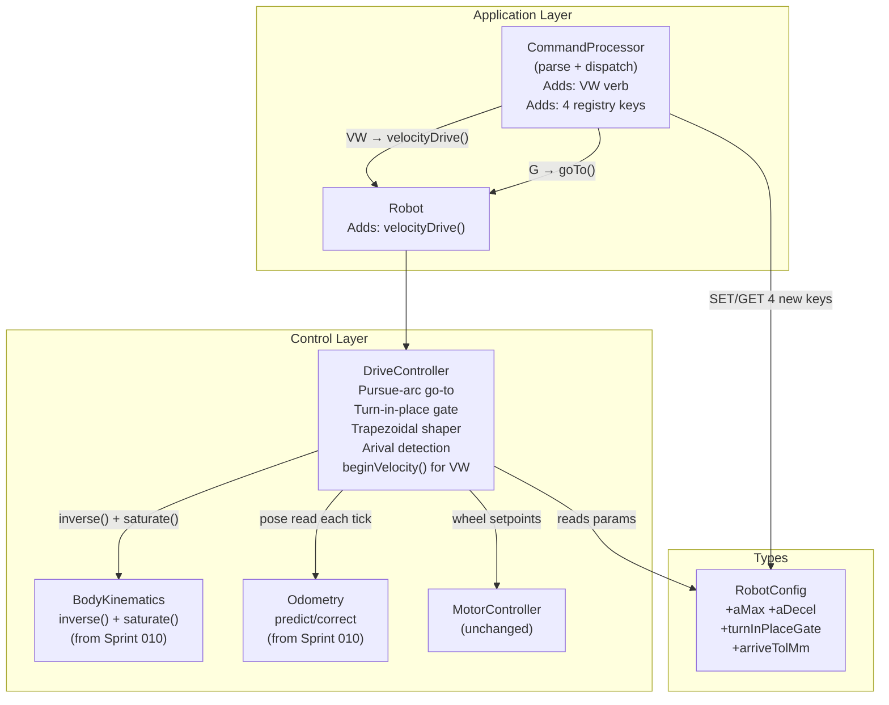

<!-- CLASI: Before changing code or making plans, review the SE process in CLAUDE.md -->

# Architecture Update — Sprint 011: Kinematics: Pose Control (Go-To)

## What Changed

### DriveController — pursuit-arc go-to (replaces one-shot arc)

The existing `GO_TO` state machine in `DriveController` (PRE_ROTATE / ARC
phases backed by `computeArc()`) is replaced with a **receding-horizon
pursuit-arc controller** running every tick:

- **Phase enum simplification**: `GPhase` now has `IDLE`, `PRE_ROTATE`,
  `PURSUE` (renamed from `ARC`). The old `ARC` phase computed wheel-distance
  targets once at entry and tracked encoder progress. The new `PURSUE` phase
  has no pre-committed distances; it recomputes curvature every tick from the
  current fused pose.

- **Steering law (§1.5)**: Each tick in `PURSUE`, the goal is transformed into
  robot frame using the current odometry pose:
  ```
  dx = gx·cos(θ) + gy·sin(θ)   (forward component)
  dy = -gx·sin(θ) + gy·cos(θ)  (lateral component)
  κ  = 2·dy / (dx² + dy²)
  ω  = v · κ
  ```
  `(v, ω)` is mapped to `(vL, vR)` via `BodyKinematics::inverse()` and then
  `BodyKinematics::saturate()`.

- **Trapezoidal shaper (§1.6)**: A single `float _vRamped` field replaces the
  fixed arc-distance targets. Each tick:
  ```
  _vRamped += aMax · dt             // ramp up (clamp to _gSpeed)
  v_cap     = sqrt(2 · aDecel · d_remaining)
  v         = min(_vRamped, v_cap, _gSpeed)
  ```
  `d_remaining = sqrt(dx² + dy²)` in robot frame. One `sqrtf` call per tick.

- **Turn-in-place gate (§1.5 critique)**: `beginGoTo()` checks
  `fabsf(atan2f(ty, tx)) > cfg.turnInPlaceGate`. When true, enters `PRE_ROTATE`
  — rotates in-place at `_gSpeed` until the bearing falls below the gate, then
  transitions to `PURSUE`. The gate threshold is in radians, stored in
  `RobotConfig::turnInPlaceGate` (default `π/4` ≈ 0.785 rad = 45°).

- **Arrival detection**: `PURSUE` checks `d_remaining < cfg.arriveTolMm` each
  tick. On arrival: `fullStop()` then `emitEvt("EVT done G")` with the
  captured `_corrId`.

- **`computeArc()` removal**: The private static `computeArc()` helper is
  deleted. All steering is now through the pursuit law plus
  `BodyKinematics::inverse()`.

- **New state fields** (replace `_gArcLeftMm/_gArcRightMm/_gArcStartL/_gArcStartR`):
  - `float _vRamped` — current ramped speed, carries across ticks
  - `float _gTargetXWorld`, `_gTargetYWorld` — goal in world frame (constant
    throughout the maneuver; the robot-frame transform updates every tick)

### DriveController — VW velocity-primitive command

A new drive entry point `beginVelocity(float v_mms, float omega_rads, …)`
handles the `VW` verb, mapping directly to body-twist and entering
`STREAMING` mode (reuses existing watchdog logic). The `BodyKinematics::inverse()`
call translates `(v, ω)` to `(vL, vR)`; `saturate()` is applied before
`MotorController`.

No new `DriveMode` enum value is needed: `VW` is semantically identical to
the streaming watchdog (`S` mode) — a keepalive body-twist command.
`beginVelocity()` delegates to the same `STREAMING` path that `beginStream()`
uses, but accepts `(v, ω)` instead of `(vL, vR)` directly.

### RobotConfig — four new fields

| C++ field | SET/GET key | Type | Default | Meaning |
|-----------|-------------|------|---------|---------|
| `aMax` | `aMax` | float | `300.0` | Acceleration limit, mm/s² |
| `aDecel` | `aDecel` | float | `250.0` | Deceleration limit for v_cap, mm/s² |
| `turnInPlaceGate` | `turnGate` | float-as-int° | `45` | Bearing threshold above which PRE_ROTATE fires, degrees on wire, radians in config |
| `arriveTolMm` | `arriveTol` | float-as-int | `5` | Arrival tolerance, mm |

The existing `turnThresholdMm` and `doneTolMm` fields (legacy names from the
one-shot arc era) are superseded by `turnInPlaceGate` and `arriveTolMm`. The
old fields remain in the struct for this sprint to avoid a breaking rename
of previously-registered SET/GET keys (`turnThr`, `doneTol`); both old and
new fields are registered and functional. A future sprint can deprecate the
old pair.

### CommandProcessor — VW verb + new registry entries

- **`VW` verb** added to `process()`:
  ```
  VW <v> <omega_mdeg_s> [#id]
  → OK vw v=<v> omega=<omega> [#id]
  ```
  `omega` is on the wire in mrad/s (integer); converted to rad/s by dividing
  by 1000. Range: `v` ∈ [−1000, 1000] mm/s; `omega` ∈ [−3142, 3142] mrad/s
  (≈ ±π rad/s). `VW` calls `_robot.velocityDrive(v, omega_rads, fn, ctx)`.

- **Four new registry entries** in `kRegistry[]`:
  `CFG_F("aMax", aMax)`, `CFG_F("aDecel", aDecel)`,
  `CFG_FI("turnGate", turnInPlaceGate)`, `CFG_FI("arriveTol", arriveTolMm)`.

- **HELP** response updated to include `VW`.

### Robot — new public method

`Robot::velocityDrive(float v_mms, float omega_rads, ReplyFn, void*, const char*)` —
calls `DriveController::beginVelocity()`. Mirrors the existing pattern for
`streamDrive`, `timedDrive`, `goTo`.

---

## Why

Sprint 010 delivered the velocity-control inner loop (`VelocityController`) and
fused odometry (`Odometry::predict/correct`). Sprint 011 closes the kinematics
arc by building Layers 3–4: the receding-horizon pursuit controller that steers
off the live fused pose.

The one-shot arc (`computeArc` + encoder-distance tracking) is replaced because:
1. It does not re-steer as the pose updates — a single integration error
   locks the robot onto the wrong arc.
2. It has no accel/decel profile: the robot starts and stops at full speed.
3. It lives in the wrong layer (encoder arithmetic in DriveController instead
   of pose arithmetic).

The `VW` command provides the `(v, ω)` primitive called out in §1.4 and §2.5
of the kinematics model, completing the command surface.

---

## Impact on Existing Components

| Component | Impact |
|-----------|--------|
| `DriveController` | `GPhase::ARC` → `GPhase::PURSUE`; `computeArc()` deleted; new fields `_vRamped`, `_gTargetXWorld/Y`; new entry point `beginVelocity()`. |
| `RobotConfig` / `Config.h` | Four new fields added; two old fields (`turnThresholdMm`, `doneTolMm`) retained. |
| `CommandProcessor` | New `VW` verb; four new `kRegistry[]` entries; `HELP` updated. |
| `Robot` | New `velocityDrive()` public method. |
| `BodyKinematics` | Used in the pursuit loop (already present from Sprint 010); no interface change. |
| `Odometry` | Read every tick in `PURSUE` for the robot-frame transform; no interface change. |
| `MotorController` | No change — wheel setpoints still arrive via existing `startDrive/setTarget` path. |
| Navigation layer | Unaffected. `PathFollower` / `PoseProvider` are unused in this sprint. |

---

## Migration Concerns

- The new `PURSUE` phase replaces `ARC` in the running state machine. Any
  in-flight `G` command during a firmware update restarts cleanly on next boot
  (no persistent state; `DriveMode` is in RAM). No migration needed.
- The old SET/GET keys `turnThr` and `doneTol` remain registered and usable.
  Existing scripts do not break. New keys `turnGate` and `arriveTol` are
  additive.
- `computeArc()` is a private static helper — its removal has no external
  callers.

---

## Component Diagram



---

## Design Rationale

**Why world-frame goal storage, not robot-frame?**
The robot-frame representation of the goal changes every tick as the robot moves.
Storing the goal in world frame and re-projecting into robot frame each tick is
the correct receding-horizon design: a single float pair carries the immutable
target; the projection is a two-multiply rotate.

**Why `VW` reuses the STREAMING watchdog path?**
`VW` and `S` are semantically identical: both are keepalive body-twist commands
that watchdog-stop when the stream goes silent. The only difference is the input
representation (`(v, ω)` vs `(vL, vR)`). Reusing `STREAMING` mode avoids a
new `DriveMode` enum value and keeps the watchdog logic in one place.

**Why retain the old `turnThresholdMm` / `doneTolMm` fields?**
Removing them would break existing calibration scripts that use `SET turnThr`
and `SET doneTol`. The rename cost is low; the breakage cost is high. The new
names (`turnGate`, `arriveTol`) are cleaner and semantically precise; the old
names can be deprecated in a follow-up sprint once the host-side tooling is
updated.

**Why mrad/s for the `VW` omega wire format?**
The protocol uses integer tokens throughout. Radians don't have clean integer
representations useful for typical robot yaw rates (~0.1–3 rad/s). Milli-radians
give three decimal places of precision with integer wire encoding (e.g., 500 mrad/s
= comfortable curve; 3142 mrad/s ≈ π rad/s = fast spin). Centidegrees/s is an
alternative but inconsistent with the SI-unit design of the body-twist layer.

---

## Open Questions

1. **`VW` omega wire unit**: mrad/s (proposed) vs cdeg/s vs a float token.
   mrad/s is proposed here; stakeholder should confirm before implementation.
2. **`turnInPlaceGate` wire format**: the gate is stored in radians internally
   but the proposal exposes it on the wire as integer degrees (`CFG_FI`).
   Confirm this is the preferred unit for `SET/GET`.
3. **Old key deprecation timeline**: `turnThr`/`doneTol` vs `turnGate`/`arriveTol`
   — should both co-exist indefinitely, or is there a sprint to retire the old names?
