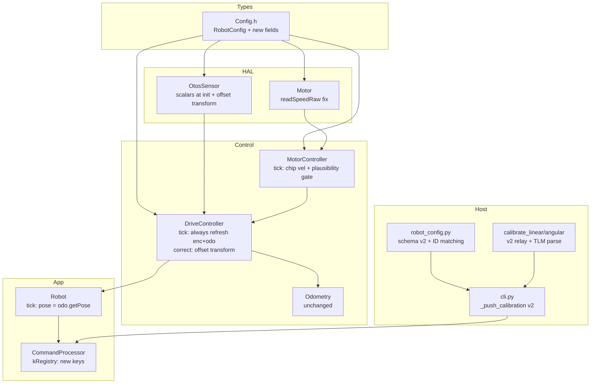
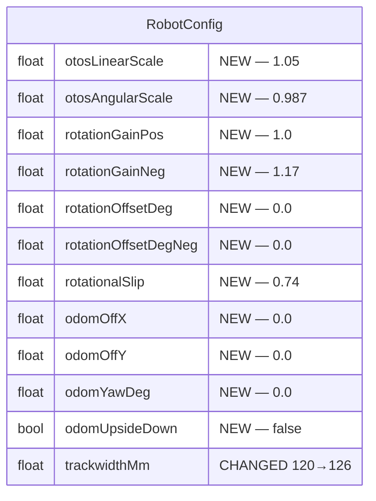

# Architecture Update — Sprint 012: Sensor/OTOS Fixes, Calibration and Per-Robot Config

## What Changed

### Firmware

**1. RobotConfig (source/types/Config.h)**

New fields added to `RobotConfig`:

| Field | Type | Description | Default |
|-------|------|-------------|---------|
| `otosLinearScale` | float | OTOS linear calibration multiplier (e.g. 1.05) | 1.05 |
| `otosAngularScale` | float | OTOS angular calibration multiplier (e.g. 0.987) | 0.987 |
| `rotationGainPos` | float | Per-direction turn gain for CCW (positive) turns | 1.0 |
| `rotationGainNeg` | float | Per-direction turn gain for CW (negative) turns | 1.17 |
| `rotationOffsetDeg` | float | Turn offset for CCW, degrees | 0.0 |
| `rotationOffsetDegNeg` | float | Turn offset for CW, degrees | 0.0 |
| `rotationalSlip` | float | Body-rotation efficiency (arc / no-slip estimate) | 0.74 |
| `odomOffX` | float | OTOS mounting offset from robot center, X (mm) | 0.0 |
| `odomOffY` | float | OTOS mounting offset from robot center, Y (mm) | 0.0 |
| `odomYawDeg` | float | OTOS mounting yaw offset (degrees) | 0.0 |
| `odomUpsideDown` | bool | OTOS mounted upside-down (Z-axis flipped) | false |

`defaultRobotConfig()` updated:
- `trackwidthMm`: 120 → **126**
- `otosLinearScale`: (new) 1.05
- `otosAngularScale`: (new) 0.987
- `rotationGainPos`: (new) 1.0
- `rotationGainNeg`: (new) 1.17

Fields unchanged: `mmPerDegL` (0.487), `mmPerDegR` (0.481).

**2. kRegistry[] (source/app/CommandProcessor.cpp)**

New SET/GET entries for all new Config fields:

| Key | Field | Wire type |
|-----|-------|-----------|
| `otosLinSc` | `otosLinearScale` | CFG_F |
| `otosAngSc` | `otosAngularScale` | CFG_F |
| `rotGainPos` | `rotationGainPos` | CFG_F |
| `rotGainNeg` | `rotationGainNeg` | CFG_F |
| `rotOffPos` | `rotationOffsetDeg` | CFG_F |
| `rotOffNeg` | `rotationOffsetDegNeg` | CFG_F |
| `rotSlip` | `rotationalSlip` | CFG_F |
| `odomOffX` | `odomOffX` | CFG_F |
| `odomOffY` | `odomOffY` | CFG_F |
| `odomYaw` | `odomYawDeg` | CFG_F |

GET dump buffer remains 512 bytes; new entries add approximately 80-100 bytes to
a full dump — must fit within the 512 limit (verify at implementation).

**3. OtosSensor init (source/hal/OtosSensor.cpp + source/robot/Robot.cpp)**

`OtosSensor::init()` gains an optional config parameter (or Robot.cpp calls
`setLinearScalar`/`setAngularScalar` immediately after `init()`). The float
scale is converted to int8 via:

```
scalar = clamp(round((scale - 1.0) / 0.001), -127, 127)
```

This means: `otosLinearScale=1.05` → scalar=+50; `otosAngularScale=0.987` →
scalar=-13. These scalars are written to OTOS registers at boot before any
tracking begins.

`OL`/`OA` runtime commands continue to override the boot-time scalar directly.

**4. TLM pose = fused odometry (source/robot/Robot.cpp tick())**

The pose block (lines ~175-186) currently reads raw OTOS LSB when
`_otosPresent`. Changed to always read from `_odo.getPose()` regardless of OTOS
presence. The fused odometry is already maintained in mm by
`DriveController::correct()`.

`OP` command retains `otos->getPositionRaw()` (LSB) as the raw OTOS cross-check.

**5. Chip velocity read context (source/hal/Motor.cpp + source/control/MotorController.cpp)**

Current symptom: `readSpeedRaw()` returns a stuck ~30-33 mm/s regardless of
actual speed. Root cause: tight-loop I2C interleaving on the Nezha (0x10) —
`MotorController::tick()` hammers the bus every 20 ms with multiple 0x46 enc
reads, 0x47 speed reads, and 0x60 writes, so 0x47 is read in a bad window
before the chip's speed estimate settles.

Fix approach: adjust the read timing/order/settle window in `Motor::readSpeedRaw()`
and/or `MotorController::tick()` so the chip reads match the vendor MakeCode
`nezhaV2.readSpeed(M1)` behavior (start → pause 500 ms → readSpeed returns good
values in isolation). The vendor program is the reference oracle.

The plausibility gate in `MotorController::tick()` is kept and improved to
reject BOTH too-high AND too-low chip readings (not just too-high):

```
// Current (only rejects too-high):
if (chipOkL && fabsf(encVelL) > 0.0f && fabsf(chipVelL) > 2.0f * fabsf(encVelL))

// Updated (also rejects stuck/near-zero when wheel is clearly moving):
if (chipOkL && (fabsf(chipVelL) > 2.0f * fabsf(encVelL) ||
                (fabsf(encVelL) > minWheelMms && fabsf(chipVelL) < 0.5f * fabsf(encVelL))))
```

`getActualVelocity()` and `getVelocitySourceFlags()` API unchanged.

**6. Encoder + odometry refresh every tick (source/control/DriveController.cpp)**

The `if (_mode != DriveMode::IDLE)` guard around `_mc.tick()`,
`getEncoderPositions()`, and `_odo.predict()` is removed. These three
operations run every tick regardless of mode. Motor setpoint commands
inside `MotorController::tick()` remain gated to non-idle (when `_tgtLMms == 0
&& _tgtRMms == 0`, motors are stopped and velocity PID is bypassed).

OTOS `correct()` already runs at idle; this change makes the encoder/odometry
side match.

**7. OTOS mounting offset (source/control/DriveController.cpp, source/hal/OtosSensor.cpp)**

When OTOS correction is applied in `DriveController::correct()`, an offset+yaw
transform is applied to convert from OTOS chip frame to robot center frame:

```
x_robot = cos(odomYawRad) * x_chip - sin(odomYawRad) * y_chip + odomOffX
y_robot = sin(odomYawRad) * x_chip + cos(odomYawRad) * y_chip + odomOffY
```

If `odomUpsideDown`, x_chip is negated before the rotation. For nezha bots the
offsets are expected to be ~0; the transform is a no-op at defaults.

The `OO`-equivalent SET path uses the `odomOffX`/`odomOffY`/`odomYaw`/
`odomUpsideDown` registry keys already registered in kRegistry above.

---

### Host

**8. Per-robot config schema + data dir (host/robot_radio/config/, data/robots/)**

`robot_config.py` already has the `RobotConfig` Pydantic model with `CalibrationConfig`
(otos scales, rotation gain/offset, rotational slip). Sprint 012 extends it:
- Ensure `rotation_gain_neg`, `rotation_offset_deg_neg` are present in `CalibrationConfig`.
- Add `schema_version: 2` support (old v1 files continue to load).
- Add robot matching by v2 ID response: `connection.device_announcement_name` matches
  the `name=` field from `ID model=Nezha2 name=<name> ...`.
- Create `data/robots/tovez.json` (or the active robot's name) seeded from known-good values:
  trackwidth 126, otos_linear_scale 1.05, otos_angular_scale 0.987, mmPerDegL 0.487,
  mmPerDegR 0.481, rotation_gain_neg 1.17, rotational_slip 0.74.
- Create `data/robots/active_robot.json` as a pointer to the active robot file.
- Create `data/robots/robot_config.schema.json` ported from the prior system.

**9. Connect-time calibration push (host/robot_radio/io/cli.py)**

`_push_calibration()` is completely rewritten. Dead pre-v2 verbs removed.
New verb sequence:

```
SET ml=<mm_per_deg_L>    # replaces KML
SET mr=<mm_per_deg_R>    # replaces KMR
SET tw=<trackwidth_mm>   # new
OI                       # OTOS init (unchanged)
OL <linear_scalar>       # unchanged (int8)
OA <angular_scalar>      # unchanged (int8)
# OO mounting offset → SET odomOffX/odomOffY/odomYaw if nonzero
# OK (IMU bias) → removed (no v2 equivalent; OTOS handles via init)
```

Each SET is sent with ack-gated blocking (relay drops back-to-back writes without ack).
The `show calibration` CLI command is updated to print v2 verbs only.

**10. Calibration scripts (host/robot_radio/io/calibrate.py, host/)**

New or rewritten scripts ported from the prior system:
- `host/calibrate_linear.py` — drive measured distances, compute `otos_linear_scale`
  and verify `mmPerDeg` using OTOS as ground truth.
- `host/calibrate_angular.py` — spin measured angles, compute `otos_angular_scale`
  and per-direction turn gain using OTOS/camera as ground truth.

Both scripts:
- Run over the v2 relay (not direct serial to robot).
- Parse TLM `pose=` (now in mm, after T03 fix) instead of the dead `SO` stream.
- Write back computed values to `data/robots/<robot>.json`.

`sensors/odom_tracker.py::parse_so()` is superseded; new `parse_tlm()` helper
parses v2 `TLM` lines. The OdomTracker class is left in place for backward compat
but is not used by new calibration scripts.

`sensors/calibration.py` docstring is updated to reference v2 TLM.

---

## Why

Every fix in this sprint addresses a confirmed bug or missing integration:
- Pose LSB bug (T03): raw OTOS was reported instead of fused odometry, making
  go-to operate on 5x-scaled values.
- OTOS scalars unset at boot (T02): OTOS tracked with uncorrected scale drift;
  OL/OA had to be sent manually each session.
- Velocity stuck (T04): PID received a near-constant ~30 mm/s regardless of
  actual speed, causing erratic straight-line behavior.
- Idle staleness (T05): SNAP/TLM at rest showed stale encoder/pose from the
  last active tick.
- Wrong defaults (T06): trackwidth 120 instead of 126 produces ~5% straight-line
  error on every distance command.
- Dead host verbs (T09/T10): the host calibration push would fail silently
  because KML/KMR/OO/OK are not recognized by the v2 firmware.

---

## Component Diagram



## Entity Changes (RobotConfig struct additions only)



---

## Impact on Existing Components

| Component | Impact |
|-----------|--------|
| `RobotConfig` / `Config.h` | New fields; struct size increases by ~52 bytes (10 floats + 1 bool). RAM impact must be confirmed at first build. |
| `defaultRobotConfig()` | trackwidth 120→126 breaks tests hard-coding 120 (T06 updates them). |
| `CommandProcessor` / kRegistry | New keys added; full GET dump size increases ~80-100 bytes (verify fits in 512). |
| `OtosSensor::init()` | Gains config reference; callers in Robot.cpp updated. |
| `Robot::tick()` pose block | Always reads `_odo.getPose()`; removes OTOS-present branch. |
| `Motor::readSpeedRaw()` | Read timing/order changed; behavior change is the fix. |
| `MotorController::tick()` | Plausibility gate expanded (both too-high and too-low). |
| `DriveController::tick()` | IDLE guard removed from mc/enc/odo update path. |
| `DriveController::correct()` | Offset+yaw transform added (no-op at defaults). |
| `cli.py _push_calibration()` | Complete rewrite; dead verbs removed. |
| `odom_tracker.py parse_so` | Superseded by TLM parse; file retained for backward compat. |
| `test_odometry_midpoint.py` | Likely hard-codes trackwidth 120; updated in T06. |
| `test_otos_fusion.py` | Hard-codes trackwidth or pose scale; updated in T03/T06. |

---

## Migration Concerns

- **trackwidth 120→126**: tests that hard-code 120 must be updated in T06 before
  those tests are run on the new firmware.
- **pose= units**: any host code parsing `pose=` as LSB will break after T03.
  The calibration scripts are the primary consumer; T10 updates them. No other
  host code currently parses pose.
- **Dead host verbs**: `_push_calibration()` is a complete replacement, not an
  incremental change. Old pre-v2 sessions will no longer work (intentional).
- **Build hygiene**: all firmware tickets require `--clean` to avoid stale
  incremental objects producing false bench results.
- **Robot enum**: reflash targets robot enum 2 (not relay enum 1). T11 reminds
  the stakeholder of this.

---

## Design Rationale

### R1 — Chip velocity as primary, encoder-delta as fallback

**Decision**: Chip register 0x47 is primary; encoder-delta is fallback behind a
two-sided plausibility gate.

**Context**: The chip velocity is stuck at ~30 mm/s in our implementation despite
working correctly in vendor MakeCode (`nezhaV2.readSpeed(M1)` returns good values
in isolation: start → pause 500 ms → readSpeed).

**Alternatives considered**:
- Demote chip, use encoder-delta only: loses the chip's speed smoothing and
  makes the fallback architecture dead code. Rejected because the chip works.
- Remove fallback: leaves no protection against I2C failure. Rejected.

**Why this choice**: The root cause is I2C interleaving in our tight loop; fixing
the read context restores a working chip path. Encoder-delta remains as a
principled fallback for genuine I2C failures.

**Consequences**: T04 requires hardware debugging with the vendor program as
oracle. If the read context fix does not fully resolve the issue within T04
scope, the fallback remains and the sprint proceeds — the open question is noted.

### R2 — TLM pose always = fused odometry

**Decision**: `pose=` in TLM always reports the fused odometry (mm, mm,
centidegrees) regardless of OTOS presence. `OP` retains raw OTOS LSB.

**Context**: The current code reports raw OTOS LSB when OTOS is present,
producing ~5x wrong values (OTOS LSB is ~0.305 mm each; 1000 mm = ~3279 LSB).

**Alternatives considered**:
- Add a flag bit to select raw vs. fused: adds complexity; the fused value is
  always what the student/go-to needs. `OP` already provides raw.

**Why this choice**: Students should always see the robot's best pose estimate
in TLM. Raw cross-check is available via `OP`.

### R3 — OTOS scalars set from RobotConfig at boot

**Decision**: `Robot.cpp` calls `setLinearScalar`/`setAngularScalar` immediately
after `_otos.init()` using values computed from `otosLinearScale`/`otosAngularScale`.

**Context**: Scalars currently must be sent via `OL`/`OA` each session.

**Why this choice**: Known-good scalars should be baked into the default config
so the robot is accurate from boot, matching the prior system's behavior.
`OL`/`OA` continue to override at runtime for in-session tuning.

---

## Open Questions / Risks

1. **RAM**: 10 new float fields + 1 bool = ~41 bytes added to RobotConfig on
   the stack/BSS. CODAL heap ceiling is tight. **Must confirm the build succeeds
   without heap overflow at first clean build in T01.**

2. **T04 hardware oracle**: The specific I2C interleaving fix requires live
   hardware experimentation. The vendor program (vendor/pxt-nezha2/main.ts
   readSpeed) is the oracle. If the fix does not produce a clean chip signal
   within T04 scope, encoder-delta fallback remains and the issue is escalated.

3. **Per-direction turn gain composition with go-to**: The per-direction gain is
   a new feature on a OTOS-corrected turn path. The gain/offset parameters
   apply to the pre-rotate phase of go-to. Verify they compose correctly and
   do not produce oscillation or overshoot on the OTOS feedback loop.

4. **GET dump buffer**: The new kRegistry keys add ~80-100 bytes to a full GET
   dump. Verify the 512-byte buffer is not exceeded in T01.

5. **OTOS mounting offset defaults**: nezha bots are expected to have ~0 offsets.
   Confirm this is true for the active robot before T07; if offsets are nonzero,
   measure and record in the robot JSON.

6. **Host calibration scripts**: these require the robot to be live on the bench
   (relay connected). They cannot be unit-tested offline. T10 acceptance criteria
   are partially deferred to T11 stakeholder verification.

7. **kUnitFactor (Motor.cpp readSpeed)**: the existing comment notes a
   bench-confirm is required — is 0x47 raw in tenths-of-degrees/s or
   whole-degrees/s? T04 resolves this by hardware observation against the vendor
   oracle.
