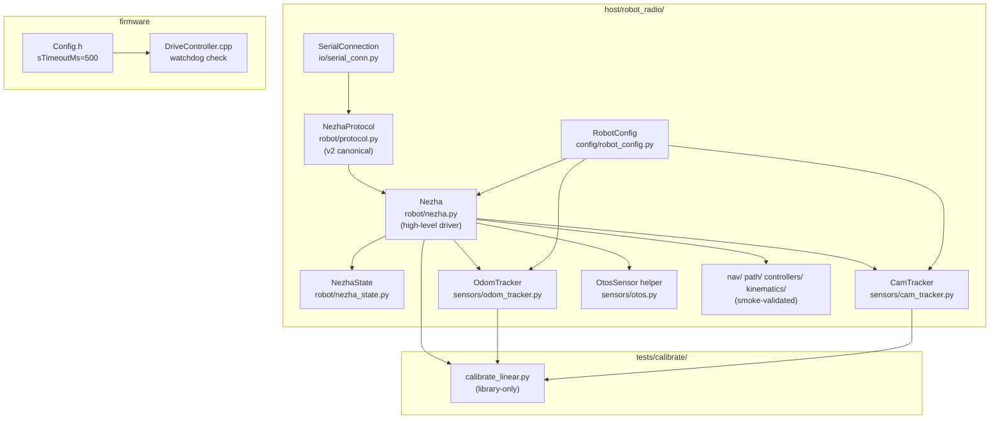
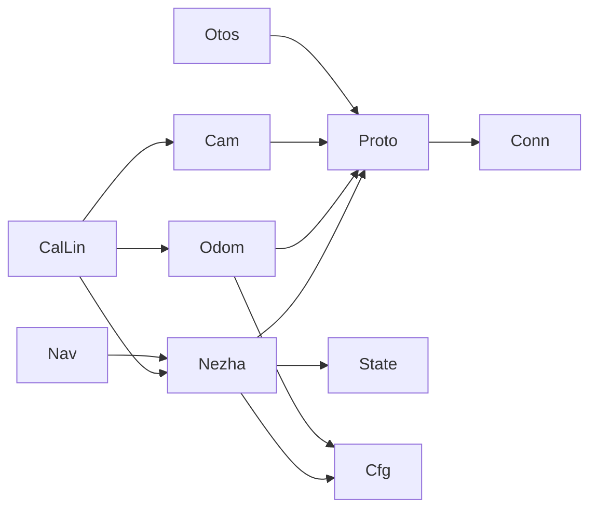

# Architecture Update — Sprint 013: robot_radio Library: v2 Port and Smooth Driving

## What Changed

### Sprint Changes Summary

This sprint completes the v1→v2 migration of the `robot_radio` host library and raises the firmware streaming watchdog. No new firmware features are introduced; the only firmware change is `sTimeoutMs` 200 → 500.

On the host side, the sprint merges two partial states:
- The prior-repo library architecture (rich nav/path/controllers/kinematics stack) already present in `host/robot_radio/`.
- The correct, tested v2 `NezhaProtocol` + pydantic config + 44 tests already in this repo.

The result is a single canonical library at `host/robot_radio/` that fully speaks v2 and is covered by an expanded test suite.

---

### 1. Module Inventory (host/robot_radio/)

All modules below are in `host/robot_radio/`. Modules marked **EXISTING** were already present and correct in v2; they are not rewritten, only verified. Modules marked **ADAPT** require changes. Modules marked **SMOKE** are structurally present but require only import verification and basic unit tests this sprint; deep v2 validation is deferred.

| Module | Status | What Changes |
|---|---|---|
| `robot/protocol.py` (`NezhaProtocol`) | **EXISTING — CANONICAL** | Already the v2 reference; extended with ping/id/ver if missing; tests extended. |
| `robot/nezha.py` (`Nezha`) | **ADAPT** | Rewritten for v2: blocking `T`/`D` via `wait_for_evt_done`, `stream_drive` keepalive, TLM/EVT consumption, `speed_for_distance` hop on `D`. |
| `robot/nezha_state.py` | **ADAPT** | State populated from v2 `TLMFrame` (enc, pose, vel, line, color). |
| `robot/robot.py` | **ADAPT** | Thin wrapper over `Nezha`; confirm public surface is v2-clean. |
| `robot/nezha_kinematic.py` | **SMOKE** | Kinematic math; no wire calls. Import + basic unit test. |
| `robot/clock_sync.py` | **EXISTING** | No change. |
| `io/serial_conn.py` (`SerialConnection`) | **EXISTING** | v2 relay handshake already correct. |
| `io/cli.py` (`rogo`) | **ADAPT** | Import compat with new `Nezha` API. |
| `io/calibrate.py` | **EXISTING** | Already rewired to v2 in sprint 012. No structural change this sprint. |
| `sensors/odom_tracker.py` | **ADAPT** | Use v2 `parse_tlm`; verify mm units; wire to `RobotConfig`. |
| `sensors/cam_tracker.py` | **ADAPT** | Confirm tag-100 filtering; use v2 TLM pose units (mm). |
| `sensors/otos.py` | **ADAPT** | Confirm OTOS helper methods map to v2 verbs (`OP`, `OZ`, `OR`, `OI`, `OL`, `OA`, `OV`). |
| `sensors/color.py` | **SMOKE** | No wire changes; import + basic test. |
| `sensors/motion_monitor.py` | **SMOKE** | No wire changes; import + basic test. |
| `sensors/calibration.py` | **EXISTING** | Docstring already updated in sprint 012. |
| `sensors/odometry.py` | **SMOKE** | Pure math; import + basic test. |
| `nav/` (navigator, pose, pose_align, nav_params) | **SMOKE** | Sits above wire; import + basic test. |
| `path/` (arc, bezier, builder, catmull_rom, obstacle, patterns, sampled_path, path_helper) | **SMOKE** | Pure path math; import + basic test. |
| `controllers/` (base, ltv, pid, pure_pursuit, stanley) | **SMOKE** | Pure control math; import + basic test. |
| `kinematics/differential_drive.py` | **SMOKE** | Pure kinematics; import + basic test. |
| `config/robot_config.py` (`RobotConfig`) | **EXISTING** | Already the source of truth; no structural change. |

---

### 2. NezhaProtocol (robot/protocol.py) — v2 Canonical

`NezhaProtocol` is the **only code that touches the serial port**. All higher-level objects receive a `NezhaProtocol` instance and delegate all wire operations to it.

**Already correct (no rewrite needed):**

| Method | v2 wire | Notes |
|---|---|---|
| `drive(l, r)` | `S l r\n` | Space-delimited |
| `vw(v, omega)` | `VW v omega\n` | |
| `timed(l, r, ms)` | `T l r ms\n` | |
| `distance(l, r, mm)` | `D l r mm\n` | |
| `go_to(x, y, spd)` | `G x y spd\n` | |
| `stream_drive(l, r)` | `S l r\n` (+ resend) | Resend at ≤30 % of `sTimeoutMs` |
| `wait_for_evt_done(verb)` | waits for `EVT done <verb>` | Raises on `EVT safety_stop` |
| `set_param(k, v)` / `get_param(*keys)` | `SET k=v\n` / `GET k…\n` | CFG response parsed via `parse_cfg` |
| OTOS: `otos_init`, `otos_reset`, `otos_zero`, `otos_pose`, `otos_raw`, `otos_set_linear_scalar`, `otos_set_angular_scalar` | `OI`, `OR`, `OZ`, `OP`, `OL n`, `OA n`, `OV` | |
| `zero_enc` / `zero_pose` | `ZERO enc\n` / `ZERO pose\n` | v1 `EZ`/`SZ` replaced |
| `stop()` | `STOP\n` | |
| `grip(val)` / `port(p, v)` / `port_a(p, v)` | `GRIP v\n` / `P p v\n` / `PA p v\n` | |
| `snap()` | `SNAP\n` | |
| `ping()` / `get_id()` / `get_ver()` | `PING\n` / `ID\n` / `VER\n` | Mandatory preflight |
| `parse_response(line)` | → `ParsedResponse` | Module-level parse |
| `parse_tlm(line)` | → `TLMFrame` | Module-level parse |
| `parse_cfg(line)` | → `dict[str,str]` | Module-level parse |

**Absent v1 verbs (must not appear in protocol.py):**

`EZ`, `ENC`, `SO`, `SZ`, `SSE`, `SSO`, `SSL`, `SSC`, `TN`, `ROT`, `OO`, `SI`, `K+SS`, `K+TW`, `OK` (v1 OTOS complete ack), `ACK:OL`, `TN+DONE`

---

### 3. Nezha High-Level Driver (robot/nezha.py)

`Nezha` owns the high-level robot API. It holds a `NezhaProtocol` instance and consumes `TLMFrame` / `EVT` lines from it to maintain live state in `NezhaState`.

**Public surface (preserved):**

| Method | Behavior in v2 |
|---|---|
| `connect()` | Runs liveness preflight (`PING`/`ID`); raises on failure |
| `speed(l, r)` | → `protocol.drive(l, r)` |
| `stop()` | → `protocol.stop()` |
| `speed_for_time(spd, ms)` | → `protocol.timed(l, r, ms)` + `wait_for_evt_done("T")` |
| `speed_for_distance(spd, mm)` | Hop loop: `protocol.distance(l, r, mm_hop)` + `wait_for_evt_done("D")`; repeat until total reached |
| `go_to(x, y, spd)` | → `protocol.go_to(x, y, spd)` + `wait_for_evt_done("G")` |
| `drive(...)` generator | Yields `TLMFrame` tuples during streaming; sends keepalive |
| `stream_drive(l, r)` | Sends `S l r`; schedules keepalive at ≤30 % watchdog |
| OTOS helpers | `otos_init`, `otos_zero`, `otos_raw_pose`, `set_otos_scalars` → protocol calls |
| Port helper | `set_port(p, v)` → `protocol.port(p, v)` |
| State properties | `.encoders`, `.otos_pose`, `.heading_rad`, `.line_sensor`, `.color` — updated from TLM |

**Heading**: stored in radians at the `Nezha` layer; centidegrees in TLM are converted on receipt.

**speed_for_distance hop strategy**: Each hop issues `D l r hop_mm` and waits for `EVT done D`. The hop size and remaining distance arithmetic are unchanged from the prior implementation; only the v1 `D±l±r±mm` encoding is replaced with v2 `D l r mm`.

---

### 4. NezhaState (robot/nezha_state.py)

Updated to consume `TLMFrame` fields directly:

| State field | Source in v2 TLM |
|---|---|
| `encoders` | `TLMFrame.enc` (left_mm, right_mm) |
| `otos_pose` | `TLMFrame.pose` (x_mm, y_mm, heading_cdeg) |
| `velocity` | `TLMFrame.vel` (vL_mmps, vR_mmps) |
| `line_sensor` | `TLMFrame.line` |
| `color` | `TLMFrame.color` |

---

### 5. Sensors

**OdomTracker** (`sensors/odom_tracker.py`): The `parse_so()` path is superseded. The tracker now consumes `TLMFrame.pose` directly (mm). Wired to `RobotConfig` for trackwidth and per-wheel mm-per-deg values.

**CamTracker** (`sensors/cam_tracker.py`): Accepts AprilTag observations; filters to tag ID 100. Pose units in mm (cm→mm conversion confirmed ×10 from prior calibration). Existing v2 implementation verified; tag ID constant confirmed.

**OtosSensor helper** (`sensors/otos.py`): Confirm all method calls use v2 verbs only. `OP` returns raw INT16 LSB (0.305176 mm/LSB); `TLM pose=` is the fused odometry path.

---

### 6. Firmware: sTimeoutMs 200 → 500

Scope: `source/types/Config.h` only. The field name is `sTimeoutMs`; the default is raised from `200` to `500`.

`source/control/DriveController.cpp` watchdog check must read `_config.sTimeoutMs` (not a hardcoded literal). This is verified as part of the ticket.

**Effect**: The `S`/`VW` streaming keepalive watchdog gives the RADIORELAY 500 ms to deliver each command refresh. `stream_drive` resends at ≤150 ms (30 % of 500 ms), giving 3.3× margin.

Requires a **clean firmware build** (`mbdeploy build --clean`) followed by mass-storage reflash before bench verification.

---

### 7. Calibration Script (tests/calibrate/calibrate_linear.py)

The script is rebased to use only library abstractions:

- `Nezha` for connection and drive.
- `protocol.port(4, ...)` for laser activation.
- `OdomTracker` / `CamTracker` for sensor readout via TLM.
- `protocol.set_param("ml", ...)`, `protocol.set_param("mr", ...)`, `protocol.otos_set_linear_scalar(...)` for pushing updated values.
- `RobotConfig` + `data/robots/tovez.json` write for persistence.

`tests/calibrate/calib_common.py` is deleted. It contained the only remaining raw-serial code in the calibration path.

---

## Why

- **Herky-jerky driving**: `sTimeoutMs = 200` is too short for RADIORELAY latency. Blocking `T`/`D` moves have no watchdog and are inherently smooth; they must be the preferred pattern for calibration and bench moves.
- **Fragmented library**: Hand-rolled serial code in `calib_common.py` duplicated protocol logic outside the tested library boundary, creating a maintenance and correctness risk.
- **v1 remnants**: Several modules still used v1 encodings or expected v1 response patterns. The existing repo already has a correct v2 `NezhaProtocol`; the sprint unifies everything behind it.
- **Nav/path coverage**: The prior library's nav/path/controllers stack is architecturally sound and sits cleanly above the wire layer. Bringing it under test (even at smoke level) completes the library surface.

---

## Component Diagram

## Dependency Diagram

---

## Impact on Existing Components

| Component | Impact |
|---|---|
| `robot/protocol.py` | No structural change; tests extended. Verify ping/id/ver helpers present. |
| `robot/nezha.py` | Rewritten for v2: blocking T/D + wait_for_evt_done; stream_drive keepalive; TLM consumption. Existing callers must update if they relied on v1 method signatures. |
| `robot/nezha_state.py` | Updated to consume `TLMFrame` directly instead of per-stream v1 messages. |
| `sensors/odom_tracker.py` | `parse_so()` path removed; TLM-only. |
| `sensors/cam_tracker.py` | Tag-100 filtering confirmed; cm→mm conversion verified. |
| `io/cli.py` | Import compat check; no structural change expected. |
| `io/calibrate.py` | No change (already v2 from sprint 012). |
| `tests/calibrate/calib_common.py` | Deleted. |
| `tests/calibrate/calibrate_linear.py` | Rebased on library; all raw serial removed. |
| `source/types/Config.h` | `sTimeoutMs` 200 → 500. |
| `host/tests/` | 44 existing tests must remain green; new tests added for Nezha drive, keepalive, calibration math. |
| `nav/`, `path/`, `controllers/`, `kinematics/` | No changes; smoke-validated only. |

---

## Migration Concerns

- **Nezha method signatures**: Any script or test that calls `Nezha` with v1-style arguments (sign-prefix integers, `±` notation) must be updated. The calibration script is the primary consumer and is fully rebased in T007.
- **parse_so() removal**: Any code calling `OdomTracker.parse_so()` must switch to `parse_tlm()`. No known callers outside the calibration path (which is replaced).
- **calib_common.py deletion**: `tests/calibrate/calib_common.py` is deleted in T007. Any script importing it will break; `calibrate_linear.py` is the only known importer.
- **Firmware reflash**: `sTimeoutMs` change requires a clean build + reflash. Old firmware binaries are not affected; only the robot needs to be re-flashed. Use `mbdeploy build --clean` then mass-storage flash.
- **Deep nav/path validation**: Nav/path/controllers are smoke-only this sprint. Deep integration with the new `Nezha` API (e.g., `PurePursuitController` calling `stream_drive`) is deferred to a follow-up sprint.

---

## Design Rationale

### R1 — Harvest v2 protocol from existing implementation, do not re-derive

**Decision**: `host/robot_radio/robot/protocol.py` (already in this repo) is the canonical v2 implementation. The prior-library protocol file is replaced by it.

**Context**: The prior lib's `protocol.py` speaks v1. This repo already has a correct, tested v2 `NezhaProtocol` with 44 passing tests. Re-deriving v2 from firmware HELP would risk introducing regressions in tested behavior.

**Why this choice**: Harvesting the existing implementation preserves test coverage and avoids re-deriving wire protocol from scratch. The existing tests are the regression net.

**Consequences**: The prior lib's `protocol.py` is overwritten; any v1 calling code in the prior lib's modules must be updated (tickets T002/T003/T004 cover this).

---

### R2 — Blocking T/D as the canonical drive primitive

**Decision**: `speed_for_time` and `speed_for_distance` use blocking `T`/`D` commands (`wait_for_evt_done`). Streaming `S`/`VW` is reserved for continuous/teleop use via `stream_drive`.

**Context**: The herky-jerky behavior comes from `S` commands losing keepalive over the laggy RADIORELAY. Blocking `T`/`D` have no streaming watchdog; the firmware runs the move to completion and emits `EVT done`.

**Alternatives considered**: Keep all driving on `S` + watchdog and just raise the timeout. Rejected: `S`-based timed/distance drives require the host to guess the move duration and keep streaming; `T`/`D` are the correct firmware primitives for those use cases.

**Consequences**: `speed_for_distance` hop strategy must handle `wait_for_evt_done` for each hop. `stream_drive` requires explicit keepalive management (implemented at 30 % of watchdog).

---

### R3 — Single SerialConnection owner

**Decision**: `NezhaProtocol` is the sole owner of `SerialConnection`. No other module holds a reference to or calls methods on the serial connection.

**Context**: Both the prior library and this repo enforce this pattern. Shared mutable serial state is a classic concurrency and ordering hazard.

**Why this choice**: Single ownership makes the serial state predictable, testable via mock injection, and eliminates race conditions in read/write interleaving.

**Consequences**: Library is explicitly single-threaded. Callers must not share a `Nezha` or `NezhaProtocol` instance across threads without external locking (which is not provided).

---

### R4 — pydantic RobotConfig as the single config source of truth

**Decision**: `host/robot_radio/config/robot_config.py` and `data/robots/tovez.json` are the authoritative configuration. Any config structure in the prior library's `config/` directory is superseded.

**Context**: Sprint 012 already established this contract with `schema_version: 2`, ID matching, and the `CalibrationConfig` block. The prior library had its own config module.

**Consequences**: Any prior-lib code that read from a local config dict must be pointed at `RobotConfig` instead. Expected impact: `Nezha` init, `OdomTracker`, `CamTracker`.

---

## Open Questions / Risks

1. **nav/path deep validation**: The nav/path/controllers stack sits above `Nezha`. Its smoke tests verify import and basic construction but do not exercise path execution against the v2 `Nezha` API. A follow-up sprint is required if path execution is needed.

2. **rogo CLI compatibility**: `io/cli.py` uses `Nezha` internally. The import-compat check in T001 should confirm CLI commands still map correctly. If the `Nezha` method signature changes break the CLI, T003 scope must expand to include a CLI fix.

3. **calibrate_angular.py**: Not rebased in this sprint (scope constraint). It still contains raw serial imports. This is a known gap; a follow-up issue should be filed.

4. **Firmware watchdog value**: 500 ms is a working estimate based on observed RADIORELAY latency. If bench testing reveals latency spikes > 150 ms (i.e., > 30 % of 500 ms), the keepalive interval may need to be halved or `sTimeoutMs` raised further.

5. **T/D move with EVT done timeout**: `wait_for_evt_done` needs a timeout guard for the case where the robot never sends `EVT done` (e.g., stuck in obstacle). The timeout value should be configurable; a sensible default is `move_distance_mm / min_speed_mmps + margin`. Verify this is handled in the existing implementation.
