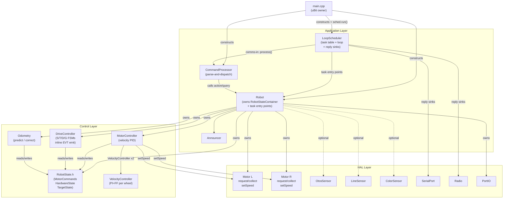
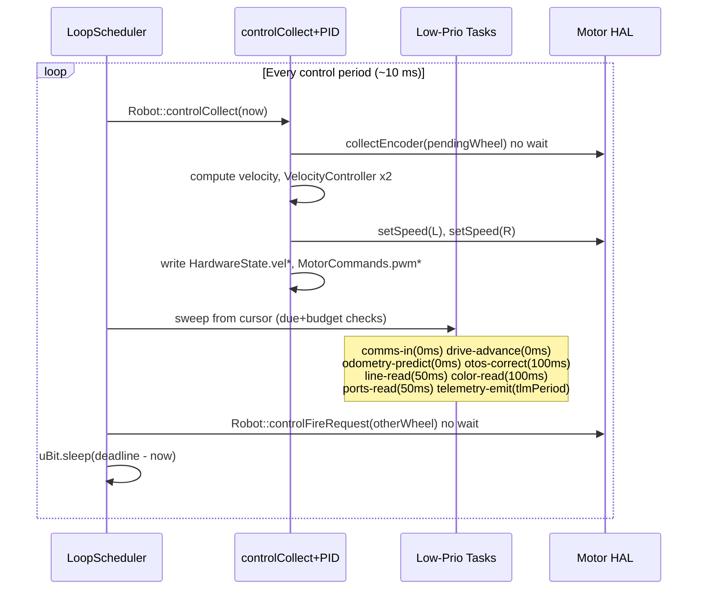

<!-- CLASI: Before changing code or making plans, review the SE process in CLAUDE.md -->

# Architecture Update — Sprint 014: Single Cooperative Main Loop

## What Changed

The firmware's two-fiber execution model (a dedicated control fiber +
a comms/telemetry fiber) is replaced by a **single cooperative main loop**
driven by a new `LoopScheduler` class. Three authoritative state structs
(`MotorCommands`, `HardwareState`, `TargetState`) are introduced in a new
`source/control/RobotState.h` and become the single source of truth for robot
state, replacing the private caches scattered across `MotorController`,
`Odometry`, and `DriveController`.

The `Motor` HAL's blocking `readEncoderRaw()` is split into two non-blocking
methods (`requestEncoder` / `collectEncoder`) that eliminate the ~8 ms
busy-wait per encoder read. The EVT ring buffer in `DriveController` is removed;
drive completions are emitted inline via a reply-sink captured in `TargetState`.

`main.cpp` shrinks to construction + `sched.run()`. `Robot` drops
`controlTick`/`telemetryTick` and gains granular task entry points called
directly by `LoopScheduler`.

---

## Why

The two-fiber model imposed two mechanisms that exist solely to make
multi-fiber operation safe:

1. **Busy-wait I2C** in `Motor::readEncoderRaw()` — chosen so the CODAL
   scheduler cannot dispatch the comms fiber to issue a competing I2C write
   mid-transaction. At 4 ms before + 4 ms after the `0x46` write per wheel
   (×2 wheels), this consumes ~16 ms per control tick, capping the effective
   control rate at ~40 Hz despite a 10 ms configured period.

2. **EVT ring buffer** in `DriveController` — a lock-free queue to cross the
   fiber boundary between the control fiber (detects completions) and the comms
   fiber (emits them over serial/radio).

With a single cooperative loop, neither mechanism is necessary. The loop's
idle sleep supplies the vendor's required I2C settling delay for free (one full
control period ≥ 10 ms >> the 4 ms the chip needs), and all tasks run on the
same thread so completions can be emitted directly.

---

## Impact on Existing Components

| Component | Change |
|---|---|
| `source/control/RobotState.h` | **New** — defines `ValueSet`, `MotorCommands`, `HardwareState`, `TargetState`, `RobotStateContainer`, and `defaultInputs()`. |
| `source/control/LoopScheduler.{h,cpp}` | **New** — owns `Task` table, round-robin cursor, loop algorithm, reply-sink adapters. |
| `source/hal/Motor.{h,cpp}` | **Modified** — `readEncoderRaw` split into `requestEncoder(wheel)` + `collectEncoder(wheel)`; both busy-wait loops deleted. |
| `source/control/MotorController.{h,cpp}` | **Modified** — encoder/velocity cache fields move to `HardwareState`; gains a control-task entry point that reads/writes the structs. The control-task's own previous-encoder snapshot stays as a member (intermediate compute state). |
| `source/control/Odometry.{h,cpp}` | **Modified** — `predict`/`correct` read encoder positions from `HardwareState` and write `poseX/poseY/poseHrad` back into `HardwareState`. |
| `source/control/DriveController.{h,cpp}` | **Modified** — EVT ring removed; completions emitted inline via `TargetState.replyFn`. OTOS correct lifted into its own task entry point. |
| `source/robot/Robot.{h,cpp}` | **Modified** — owns `RobotStateContainer`; `controlTick`/`telemetryTick` replaced by granular task entry-point methods. |
| `source/app/CommandProcessor.cpp` | **Modified** — adds `CFG_I` entries: `lag.otos`, `lag.line`, `lag.color`, `lag.ports`. |
| `source/types/Config.h` | **Modified** — adds `uint32_t lagOtosMs, lagLineMs, lagColorMs, lagPortsMs` with defaults (100, 50, 100, 50 ms). |
| `source/main.cpp` | **Modified** — removes `controlFiberFn`, `gRobot`, `create_fiber`, both `uBit.sleep` loops; adds `LoopScheduler` construction + `sched.run()`. |
| `source/control/VelocityController.{h,cpp}` | **Unchanged** — pure PI+FF math; no state migration needed. |
| Navigation layer (`source/nav/`) | **Unchanged** — not called from the loop directly in this sprint. |

---

## Migration Concerns

No data migration required (embedded firmware; no persistent store). The
protocol wire format is unchanged — all command verbs, response prefixes, and
field semantics are preserved. The pytest suite exercises the protocol layer
and serves as the regression gate.

The `readEncoderRaw()` method is private to `Motor`; its removal and
replacement by `requestEncoder`/`collectEncoder` is internal to the HAL layer
and does not break the `MotorController` or `Odometry` interfaces above it.

`controlTick` and `telemetryTick` on `Robot` are removed; `main.cpp`
currently calls both. `LoopScheduler` replaces both call sites. No external
callers exist outside `main.cpp`.

---

## Module Definitions

### `RobotState` (data module — `source/control/RobotState.h`)

**Purpose**: Defines the three authoritative state structs that replace all
per-subsystem private caches of robot state.

**Boundary**: Pure data; no logic, no CODAL dependencies. Any module may
include this header. The owning instance (`RobotStateContainer`) lives in
`Robot`. `defaultInputs()` seeds per-set `lagMs` defaults.

**Use cases served**: SUC-003 (authoritative state), SUC-001 (control task
reads/writes structs), SUC-004 (task lag via `ValueSet`), SUC-006 (lag fields).

### `LoopScheduler` (`source/control/LoopScheduler.{h,cpp}`)

**Purpose**: Runs the single cooperative main loop — fires the control task
every iteration, sweeps low-priority tasks within the remaining budget window,
fires the next encoder request, then sleeps until the deadline.

**Boundary**: Owns the `Task` table, round-robin cursor, and both reply-sink
adapters (`serialReply`/`radioReply`). Depends on `Robot`, `CommandProcessor`,
and `MicroBit`. Does not own hardware directly. All I/O is delegated to `Robot`
task entry points or `CommandProcessor::process`.

**Use cases served**: SUC-001 (control rate), SUC-002 (split-phase I2C ordering),
SUC-004 (round-robin budget gate).

### `Motor` (HAL — `source/hal/Motor.{h,cpp}`)

**Purpose**: I2C driver for one Nezha V2 motor channel.

**Change**: `readEncoderRaw()` (private) split into `requestEncoder()` (public,
8-byte write, no wait) and `collectEncoder()` (public, 4-byte read, no wait).
The two 4 ms busy-wait loops are deleted. `readEncoderMmF` and `readEncoder`
are rerouted to use `collectEncoder` internally, or are replaced by the control
task calling `collectEncoder` directly and converting to mm.

**Use cases served**: SUC-002 (non-blocking I2C).

### `MotorController` (control — `source/control/MotorController.{h,cpp}`)

**Purpose**: Orchestrates per-wheel velocity PID — reads setpoints from
`MotorCommands`, reads measured velocity from `HardwareState`, runs both
`VelocityController` instances, writes PWM back to `MotorCommands` and pushes
to `Motor::setSpeed`.

**Change**: Private fields `_encLMm`, `_encRMm`, `_actualVelL`, `_actualVelR`,
`_usingChipVelL`, `_usingChipVelR` removed; replaced by reads/writes to
`HardwareState`. The control-task previous-encoder snapshot (`_prevEncL/R`)
remains as a member because it is intermediate compute state needed to
differentiate velocity, not robot state.

**Use cases served**: SUC-003 (authoritative state), SUC-001 (velocity PID).

### `Odometry` (control — `source/control/Odometry.{h,cpp}`)

**Purpose**: Differential-drive dead-reckoning — `predict()` integrates encoder
deltas into pose; `correct()` applies OTOS complementary fusion.

**Change**: `predict()` reads encoder positions from `HardwareState.enc*` and
writes `HardwareState.poseX/poseY/poseHrad`. `correct()` reads the OTOS values
from `HardwareState.otos*` and writes pose back. Odometry keeps its own
`_prevEncL/_prevEncR` snapshot (it runs at a different cadence than the control
task via the odometry-predict task).

**Use cases served**: SUC-003 (authoritative pose), SUC-004 (odometry-predict
and otos-correct as separate tasks with independent periods).

### `DriveController` (control — `source/control/DriveController.{h,cpp}`)

**Purpose**: Owns and advances the S/T/D/G drive state machines; emits drive
completions via the captured reply sink in `TargetState`.

**Change**: EVT ring buffer members and methods (`_evtQueue`, `_evtHead`,
`_evtTail`, `enqueueEvt`, `drainEvents`) removed. `controlTick` split into
two task entry points: `driveAdvance(now_ms)` (runs every loop iteration,
`periodMs=0`) and `otosCorrect(now_ms)` (called only from the otos-correct task
when OTOS is present). Reads `HardwareState`/`TargetState`; writes
`MotorCommands.tgt*Mms`; calls `TargetState.replyFn` directly on completion.

**Use cases served**: SUC-005 (inline EVT), SUC-004 (otos-correct task).

### `Robot` (application — `source/robot/Robot.{h,cpp}`)

**Purpose**: Hardware abstraction layer; owns all subsystem instances and the
`RobotStateContainer`; exposes granular task entry-point methods.

**Change**: `controlTick`/`telemetryTick` replaced by individual methods that
each correspond to one task in `LoopScheduler`'s table:
`controlCollect(now_ms)`, `controlFireRequest()`, `commsIn()`,
`driveAdvance(now_ms)`, `odometryPredict()`, `otosCorrect(now_ms)`,
`lineRead()`, `colorRead()`, `portsRead()`, `telemetryEmit(now_ms, fn, ctx)`.

**Use cases served**: SUC-001, SUC-003, SUC-004, SUC-005, SUC-006, SUC-007.

---

## Component Diagram



---

## Loop Execution Sequence



---

## Dependency Direction

```
LoopScheduler → Robot → [MotorController, DriveController, Odometry]
                              ↓                    ↓
                         VelocityController    RobotState.h (data only)
                              ↓
                         Motor HAL
```

All dependencies flow downward. `RobotState.h` is a pure data header with no
dependencies; it is included by any layer that needs it. No circular
dependencies exist in this design.

---

## Design Rationale

### Decision: Single loop over retained two-fiber model

**Context**: The two-fiber model was introduced in Sprint 013 to achieve I2C
atomicity for the encoder reads without disrupting comms. The busy-wait was the
mechanism; the EVT ring was the communication bridge.

**Alternatives considered**:
- Keep two fibers, remove busy-waits using CODAL mutexes — still has fiber
  context-switch overhead; mutex contention risk on the I2C bus.
- Keep two fibers, add a third I2C-bus-owner fiber — complexity grows; three
  fibers on a cooperative scheduler with shared I2C is fragile.

**Why this choice**: With one loop, I2C atomicity is structural — the ordering
rule (collect at top → sensor I2C in middle → request at bottom) guarantees no
other I2C occurs inside the motor's request→collect window. No mutex, no ring
buffer, no fiber switch overhead.

**Consequences**: All blocking calls (`uBit.sleep`) are replaced by a single
sleep at the end of each iteration. The CODAL radio event handler no longer
runs "between ticks via fiber yield"; instead the comms-in task drains the
radio ring buffer explicitly every iteration. The Radio HAL's 4-slot ring buffer
absorbs burst packets between iterations.

### Decision: Alternating-wheel encoder requests

**Context**: The Nezha V2 chip buffers only one outstanding request. Two
encoder reads per tick (one per wheel) at 4+4 ms each consumed ~16 ms per
control tick.

**Alternatives considered**:
- Read both wheels every tick with split-phase — two outstanding requests on
  the same chip address; vendor docs do not support simultaneous requests.
- Read one fixed wheel every tick — the other wheel's PID degrades permanently.

**Why this choice**: Alternating (one wheel per iteration) gives each wheel a
~20 ms sample period with zero blocking. The PID uses zero-order-hold on the
wheel whose measurement didn't refresh. Per-wheel rate ≈ 50 Hz (better than
the prior ~40 Hz serialized rate).

**Consequences**: The control-task object tracks `pendingWheel` (alternates
L/R). The collect step must handle the first-ever iteration (no pending
request): guard with a `pendingWheel == NONE` check and skip collect.

### Decision: Lag values live in `RobotConfig`, not embedded in `HardwareState.ValueSet`

**Context**: The issue spec places `lagMs` inside `ValueSet` within
`HardwareState`. The `CFG_I` registry in `CommandProcessor` uses
`offsetof(RobotConfig, field)` to map SET/GET keys to config fields.

**Resolution**: Lag defaults and runtime values live as flat `uint32_t` fields
in `RobotConfig` (`lagOtosMs`, `lagLineMs`, `lagColorMs`, `lagPortsMs`). Task
`due()` functions read these from `RobotConfig`. `ValueSet` in `HardwareState`
retains `lastUpdMs` and `valid` for staleness tracking; `lagMs` is not stored
redundantly in the struct.

**Consequences**: Adding a new sensor lag requires a `RobotConfig` field, a
`CFG_I` entry, and a `due()` function update. The existing `CFG_I` registration
pattern is unchanged.

---

## Open Questions

1. **I2C tolerance of other-address traffic during motor's pending-read window.**
   The ordering rule prevents same-chip (0x10) collisions by construction. The
   OTOS (0x17), line (0x1A), and color (0x39/0x43) sensors are different
   addresses. Whether the Nezha V2 chip cares about other-address I2C activity
   during its request→collect window is not documented. The ordering rule
   sidesteps this, but bench confirmation is required (stress test with sensor
   tasks running in the middle window; observe encoder integrity).

2. **Zero-order-hold adequacy at 20 ms per-wheel sample period.** At 200 mm/s,
   20 ms gives 4 mm per sample — the same quantization the Sprint 013 float-
   encoder fix addressed. The PID's zero-order-hold should be adequate, but
   should be confirmed at high speeds (≥ 300 mm/s) on the bench.

3. **`moveToAngle()` busy-wait.** `Motor::moveToAngle()` retains a 4 ms
   busy-wait per vendor requirement. This method is not called in the normal
   drive loop, so it does not affect control cadence. No action required this
   sprint; flag for future if ever wired in.

4. **Navigation layer task integration.** `PurePursuitFollower` and
   `StanleyFollower` are not in the task table for this sprint. A future sprint
   adding path-following will need a budget estimate and a `lagMs` entry.
