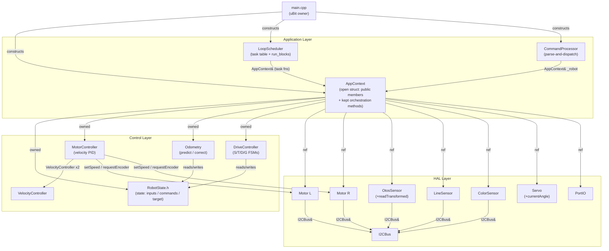

<!-- CLASI: Before changing code or making plans, review the SE process in CLAUDE.md -->

# Architecture Update — Sprint 016: Robot Facade to AppContext Struct

## Sprint Context

This is a **pure structural refactor** with no behavior change. The goal is to
replace the `Robot` facade class with an open `struct AppContext` so callers
reach subsystems directly. This is the first of three sequenced sprints
(016 → 017 → 018); sprints 017 and 018 add motion-control features and are
deliberately out of scope here.

---

## What Changed

### Step 1: HAL Additions (pure additions; no callers modified)

**`OtosSensor` gains `readTransformed(const RobotConfig&) const`**

The raw-read → LSB→mm/rad conversion → upside-down flip → mounting-offset
rotation block currently inlined in `Robot::otosCorrect` is extracted into a
new `OtosSensor` method. This is the natural owner: it is device-specific
arithmetic that belongs in the device class.

Signature:
```cpp
struct OtosPose { float x, y, h; };  // in source/hal/OtosSensor.h
OtosPose readTransformed(const RobotConfig& cfg) const;
```

The constants (`kPosMmPerLsb = 0.305f`, `kHdgRadPerLsb = 0.00549f * π/180`)
move into this method's body (they are OTOS hardware constants, not config).
The flip (`cfg.odomUpsideDown`) and mounting rotation (`cfg.odomYawDeg`) use
`cfg` passed as a parameter.

**`Servo` gains angle tracking**

`setAngle(uint8_t degrees)` is modified to record the clamped value in a new
`int16_t _currentAngle` member field. A new `int16_t currentAngle() const`
accessor is added. The `bool _gripperPresent` (hard-coded `true` in `Robot`)
is not added to `Servo`; presence is determined by `robot.gripper.is_initialized()`
(the `Sensor` base-class flag) at call sites. However, `Servo` does not
currently inherit from `Sensor`. The approach is simpler: `Servo::setAngle`
always executes (presence check remains at call site), and `currentAngle()`
returns the last clamped value set (defaulting to 0).

### Step 2: `AppContext` struct (`source/robot/AppContext.h` / `AppContext.cpp`)

New files replacing `Robot.h` / `Robot.cpp`. The class name `Robot` disappears
from the codebase.

**Member declaration order (load-bearing — must match initializer-list order):**

```cpp
struct AppContext {
    // ---- Owned value members (must be initialized first) ----
    RobotConfig         config;           // owned copy; SET commands mutate this
    RobotStateContainer state;            // = defaultInputs(config)
    MotorController     motorController;  // (motorL, motorR, config)
    Odometry            odometry;         // default ctor
    DriveController     driveController;  // (motorController, odometry, config)

    // ---- Device references (bound in constructor, not owned) ----
    Motor&      motorL;
    Motor&      motorR;
    OtosSensor& otos;
    LineSensor& line;
    ColorSensor color_sensor;  // note: field name avoids clash with type
    Servo&      gripper;
    PortIO&     portio;

    // ---- Constructor ----
    AppContext(Motor& mL, Motor& mR, OtosSensor& o, LineSensor& l,
               ColorSensor& c, Servo& g, PortIO& p,
               const RobotConfig& cfg);

    // ---- Kept orchestration methods ----
    void controlCollectSplitPhase(uint32_t now_ms, int pendingWheel);
    void otosCorrect(uint32_t now_ms);
    void lineRead();
    void colorRead();
    void portsRead();
    void distanceDrive(int32_t l, int32_t r, int32_t targetMm,
                       ReplyFn fn, void* ctx, const char* corr_id);
    int  buildTlmFrame(char* buf, int len);
    void telemetryEmit(uint32_t now_ms, ReplyFn fn, void* ctx);
    uint32_t systemTime() const;

    // ---- Gating state that pairs with the kept methods ----
    uint32_t _lastTlmMs    = 0;
    uint32_t _lastActiveMs = 0;
    uint32_t _lastControlMs = 0;
    bool     _prevDriving   = false;
};
```

**Note on member naming:** The field `color_sensor` avoids the collision between
the type `ColorSensor` and a field named `color`. Similarly `line` is fine
since `LineSensor` is the type. In practice the names should match the issue
spec exactly: `motorL`, `motorR`, `otos`, `line`, `color`, `gripper`, `portio`.
If the compiler flags `color` as a keyword collision, rename to `colorSensor`.

**Constructor body** performs the two binds that `Robot`'s constructor does
today:
```cpp
driveController.setHardwareState(&state.inputs);
motorController.setCommandsRef(&state.commands);
```

**Dropped from the struct compared to `Robot`:**
- `Communicator& _comm` — zero callers; `comm` stays a `main()` static.
- `bool _gripperPresent` — hard-coded `true`; replaced by `gripper` always
  being present (the `begin()` gate remains in `main()`).
- `uint32_t _lastOtosMs` / `kOtosSlowMs` — the `run_blocks` loop gates OTOS
  via `cfg.lagOtosMs`; no second gate needed.
- `controlCollect` (synchronous stub, zero callers in production path).
- `noteActivity` (zero callers).
- `setPose` / `getPose` — verified no callers remain after the grep (Ticket 001
  confirms with `grep -r setPose source/`).

**Kept orchestration methods rationale** — each touches multiple subsystems or
state that no single subsystem owns:

| Method | Why kept |
|--------|----------|
| `controlCollectSplitPhase` | Reads both motors, writes `state.inputs`, calls `_mc.controlTick`; spans motorL/R + MotorController + HardwareState |
| `otosCorrect` | Reads OTOS device, writes `state.inputs.otos*`, calls `odometry.correct`; spans OtosSensor + HardwareState + Odometry |
| `lineRead` / `colorRead` / `portsRead` | Write to `state.inputs.*VS`; single subsystem but writing to the shared state struct |
| `distanceDrive` | Calls `driveController.beginDistance` + zeroes `state.inputs.encLMm/R` (the encoder-reset workaround) |
| `buildTlmFrame` | Reads `state.inputs`, `config`, `driveController.mode()`; pure assembly logic |
| `telemetryEmit` | Uses `_lastTlmMs`, `_lastActiveMs`, `config.tlmPeriodMs`; gating state is private to AppContext |
| `systemTime` | Thin wrapper for `system_timer_current_time()` |

**INLINE-DELETE methods** — callers hit subsystems directly:

| Old `Robot` method | New call site |
|-------------------|--------------|
| `stop()` | `robot.driveController.stop(now_ms, noop, nullptr)` |
| `streamDrive(l,r,fn,ctx)` | `robot.driveController.beginStream(...)` |
| `velocityDrive(v,ω,fn,ctx,id)` | `robot.driveController.beginVelocity(...)` |
| `timedDrive(l,r,ms,fn,ctx,id)` | `robot.driveController.beginTimed(...)` |
| `goTo(x,y,s,fn,ctx,id)` | `robot.driveController.beginGoTo(...)` |
| `odometryPredict()` | `robot.odometry.predict(robot.state.inputs, robot.config.trackwidthMm)` |
| `driveAdvance(now)` | `robot.driveController.driveAdvance(robot.state.inputs, robot.state.commands, robot.state.target, now)` |
| `controlFireRequest(w)` | `robot.motorL.requestEncoder()` / `robot.motorR.requestEncoder()` |
| `zeroEncoders()` | `robot.motorController.resetEncoderAccumulators()` |
| `zeroOdometry()` | `robot.odometry.zero(robot.state.inputs)` |
| `getEncoders() const` | `robot.motorController.getEncoderPositions(l, r)` |
| `getPose() const` | `Odometry::getPose(robot.state.inputs, x, y, h)` |
| `setGripperAngle(deg)` | `robot.gripper.setAngle(clamped)` |
| `gripperAngle() const` | `robot.gripper.currentAngle()` |
| `config()` | `robot.config` (direct member) |
| `motor()` | `robot.motorController` (direct member) |
| `driveController()` | `robot.driveController` (direct member) |
| `odometry()` | `robot.odometry` (direct member) |
| `state() const` | `robot.state` (direct member) |
| `stateMut()` | `robot.state` (direct member) |
| `portIO()` | `robot.portio` (direct member) |
| `otos()` (nullable ptr) | `robot.otos.is_initialized()` check at call site |
| `lineSensor()` (nullable ptr) | `robot.line.is_initialized()` check at call site |
| `colorSensor()` (nullable ptr) | `robot.color.is_initialized()` check at call site |
| `servo()` (nullable ptr) | `robot.gripper` always available; presence via `is_initialized()` |

**DELETE outright (dead code):**
- `controlCollect` — synchronous stub; `controlCollectSplitPhase` is the
  production path; zero callers once `LoopScheduler` migration completes.
- `noteActivity` — zero callers in `source/`. (Verify with grep before deleting.)
- `setPose` / `getPose` — zero callers after migration; verify with grep.
- `_lastOtosMs` / `kOtosSlowMs` — cadence gate superseded by `run_blocks`
  signed-delta check on `lastOtos`.
- `EncoderReading` struct — replaced by direct `getEncoderPositions(l, r)` call.
- `Robot::Pose` struct — callers use `Odometry::getPose(inputs, x, y, h)` directly.

### Step 3: `main.cpp` changes

The construction sequence remains strictly ordered as today. Only the type of
`robot` changes:

```cpp
static AppContext robot(motorL, motorR, otos, line, color, gripper, portio, cfg);
```

`Communicator comm` remains a `main()` static passed to `LoopScheduler` and
`CommandProcessor` as before. The post-wiring calls (`setI2CBus`, `setEvtSink`,
`setScheduler`) remain unchanged except that `robot.motor()` becomes
`robot.motorController` direct member access.

### Step 4: `LoopScheduler` migration (~18 sites)

**Header** (`LoopScheduler.h`): `class Robot;` forward decl → `struct AppContext;`;
`Robot& _robot` → `AppContext& _robot`; `Robot& robot()` → `AppContext& robot()`.

**Source** (`LoopScheduler.cpp`): The eight task `run*` functions that delegate
to `sched.robot().*` are updated in place. The inline substitutions:

| Old call | New call |
|----------|----------|
| `sched.robot().driveAdvance(now)` | `robot.driveController.driveAdvance(robot.state.inputs, robot.state.commands, robot.state.target, now)` |
| `sched.robot().odometryPredict()` | `robot.odometry.predict(robot.state.inputs, robot.config.trackwidthMm)` |
| `sched.robot().otosCorrect(now)` | `robot.otosCorrect(now)` (kept method) |
| `sched.robot().lineRead()` | `robot.lineRead()` (kept method) |
| `sched.robot().colorRead()` | `robot.colorRead()` (kept method) |
| `sched.robot().portsRead()` | `robot.portsRead()` (kept method) |
| `sched.robot().telemetryEmit(now, fn, ctx)` | `robot.telemetryEmit(now, fn, ctx)` (kept method) |
| `_robot.config()` | `_robot.config` |
| `_robot.controlCollectSplitPhase(now, wheel)` | `_robot.controlCollectSplitPhase(now, wheel)` (unchanged) |

The `run_blocks` method also calls `_robot.*` and needs the same
substitutions. The config period sync (`_table[3..7].periodMs = cfg.lag*Ms`)
changes from `_robot.config()` to `_robot.config`.

### Step 5: `WedgeTest` migration (~5 sites)

**Header** (`WedgeTest.h`): `class Robot;` → `struct AppContext;`;
parameter `Robot* robot = nullptr` → `AppContext* robot = nullptr`.

**Source** (`WedgeTest.cpp`): `#include "Robot.h"` → `#include "AppContext.h"`.
Inside `runWedgeTest`, the `useReal` path uses:
- `robot->motorController` instead of `robot->motor()`
- `robot->motorController.getEncoderPositions(l, r)` instead of any
  `getEncoders()` call (verify exact call sites in the source before coding)

### Step 6: `CommandProcessor` migration (~55–60 sites)

**Header** (`CommandProcessor.h`): `class Robot;` → `struct AppContext;`;
`Robot& _robot` → `AppContext& _robot`; constructor signature accordingly.

**Source** (`CommandProcessor.cpp`): `#include "Robot.h"` → `#include "AppContext.h"`.
Verb-by-verb substitutions:

| Verb | Key change |
|------|-----------|
| `PING` | `_robot.systemTime()` — unchanged (kept method) |
| `ID` (caps= block) | `_robot.otos()` → `_robot.otos.is_initialized()`; same for line/color; `_robot.servo()` → `robot.gripper.is_initialized()` (or always include if `begin()` called) |
| `GET VEL` | `_robot.state().inputs.*` → `_robot.state.inputs.*` |
| `GET` / `SET` | `_robot.config()` → `_robot.config`; `_robot.motor()` → `_robot.motorController` |
| `STREAM` / `SNAP` | `_robot.config().tlm*` → `_robot.config.tlm*`; `_robot.buildTlmFrame(...)` unchanged |
| `DBG I2C` | `_robot.motor().stuckCount*` → `_robot.motorController.stuckCount*`; `_robot.motor().resetStuckCounters()` → `_robot.motorController.resetStuckCounters()` |
| `S` | `_robot.streamDrive(l, r, fn, ctx)` → `_robot.driveController.beginStream((float)l, (float)r, _robot.systemTime(), _robot.state.target, fn, ctx)` |
| `T` | `_robot.timedDrive(...)` → `_robot.driveController.beginTimed(...)` |
| `D` | `_robot.distanceDrive(...)` → `_robot.distanceDrive(...)` (kept method — the encoder-reset workaround stays) |
| `G` | `_robot.goTo(...)` → `_robot.driveController.beginGoTo(...)` |
| `VW` | `_robot.velocityDrive(...)` → `_robot.driveController.beginVelocity(...)` |
| `STOP` | `_robot.stop()` → `_robot.driveController.stop(now, noop, nullptr)` where `now = _robot.systemTime()` |
| `GRIP` set | `_robot.setGripperAngle(deg)` → `_robot.gripper.setAngle((uint8_t)clamped_deg)` |
| `GRIP` query | `_robot.gripperAngle()` → `_robot.gripper.currentAngle()` |
| `ZERO enc` | `_robot.zeroEncoders()` → `_robot.motorController.resetEncoderAccumulators()` |
| `ZERO pose` | `_robot.zeroOdometry()` → `_robot.odometry.zero(_robot.state.inputs)` |
| `OI`/`OZ`/`OR`/`OP`/`OV`/`OL`/`OA` | `_robot.otos()` → `_robot.otos.is_initialized() ? &_robot.otos : nullptr`; then call method on the sensor directly |
| `P` / `PA` | `_robot.portIO().*` → `_robot.portio.*` |

**Note on OTOS verb pattern**: The existing code does:
```cpp
OtosSensor* otos = _robot.otos();
if (!otos) { replyErr(...); return; }
otos->init();
```
After migration this becomes:
```cpp
if (!_robot.otos.is_initialized()) { replyErr(...); return; }
_robot.otos.init();
```
This is the `is_initialized()` rewrite referenced in the issue and acceptance
criteria.

### Step 7: Delete `Robot.h` / `Robot.cpp` and dead code

Once nothing in the tree includes `Robot.h` or references `Robot`, the files
are deleted. The `EncoderReading` struct defined in `Robot.h` disappears; all
remaining callers use `motorController.getEncoderPositions(l, r)` directly.
The `Robot::Pose` struct disappears; callers use `Odometry::getPose(inputs, ...)`.

---

## Why

`Robot`'s ~38 methods are ~43% pure passthroughs (e.g. `stop` is one line
calling `_dc.stop(...)`) and ~28% trivial getters. There is exactly one robot
in the system — the singleton assumption is embedded in every caller — so the
encapsulation provides no safety and forces all callers through delegation.

Removing the facade:
- Eliminates ~20 forwarding methods (~50 lines of boilerplate).
- Lets callers express the exact subsystem being used (`robot.driveController.beginStream`
  vs. `robot.streamDrive`), making dependencies explicit at the call site.
- Reduces the surface area for "god component" growth: new drive modes in 017/018
  can be added directly to `DriveController` without adding another forwarding
  method to `Robot`.
- Enables the 017/018 motion-control sprints to be written once against the
  final `robot.driveController.beginX()` structure.

---

## Impact on Existing Components

| Component | Change | Impact |
|-----------|--------|--------|
| `source/robot/Robot.h` + `.cpp` | **Deleted** | All callers updated before deletion |
| `source/robot/AppContext.h` + `.cpp` | **New** (replaces Robot) | The AppContext struct |
| `source/hal/OtosSensor.h` + `.cpp` | **Modified** — adds `readTransformed` + `OtosPose` | No behavior change to callers; existing `getPositionRaw` still present |
| `source/hal/Servo.h` + `.cpp` | **Modified** — `setAngle` records clamped value; adds `currentAngle()` | `CommandProcessor` switches from `Robot::gripperAngle()` to `Servo::currentAngle()` |
| `source/main.cpp` | **Modified** — `static Robot robot(...)` → `static AppContext robot(...)` | One-line type change + updated post-wiring direct member access |
| `source/control/LoopScheduler.h` + `.cpp` | **Modified** — type swap + inline deletions in task fns | ~18 sites; no logic change |
| `source/app/WedgeTest.h` + `.cpp` | **Modified** — type swap | ~5 sites |
| `source/app/CommandProcessor.h` + `.cpp` | **Modified** — type swap + verb-by-verb inline deletions | ~55–60 sites; no logic change |
| `source/control/MotorController` | **Unchanged** | Direct member access path from AppContext |
| `source/control/DriveController` | **Unchanged** | Direct member access path from AppContext |
| `source/control/Odometry` | **Unchanged** | Direct member access path from AppContext |
| `source/control/RobotState.h` | **Unchanged** | `state` becomes a direct AppContext member |

---

## Component Diagram



---

## Migration Concerns

**No behavior change.** This refactor preserves all method bodies verbatim.
The encoder-reset workaround (zeroing `state.inputs.encLMm/R` after
`beginDistance`) is preserved in `AppContext::distanceDrive`. The outlier filter
and retry loop in `controlCollectSplitPhase` are copied unchanged.

**Init order is load-bearing.** `AppContext` member declaration order must
satisfy C++ init order rules:
1. `config` (no deps)
2. `state` (constructed from `config` via `defaultInputs`)
3. `motorController` (takes `motorL`, `motorR`, `config` refs — but `motorL`/`motorR`
   are reference members bound in the initializer-list, so they are already
   bound before `motorController` constructs because ref members in a struct
   are listed first in declaration order only if so declared. **Action**: in the
   initializer list, `motorL(mL), motorR(mR)` must appear before `motorController(motorL, motorR, config)`. This is fine because C++ initializes members in
   declaration order — the declaration order must list `motorL`, `motorR`
   **before** `motorController`.)
4. `odometry` (default ctor)
5. `driveController` (takes `motorController`, `odometry`, `config`)

Correct declaration order in the struct body:
```
RobotConfig config;
RobotStateContainer state;
Motor& motorL;  Motor& motorR;         // refs initialized from ctor args
OtosSensor& otos; LineSensor& line;    // ref members
ColorSensor& color; Servo& gripper; PortIO& portio;
MotorController motorController;       // takes motorL, motorR, config refs
Odometry odometry;
DriveController driveController;       // takes motorController, odometry, config
```
With this order, the initializer list `motorL(mL), motorR(mR), ..., motorController(motorL, motorR, config), ...` is safe.

**Communicator dropped from struct.** `robot.comm()` has zero callers. `comm`
stays a `main()` static passed directly to `LoopScheduler` (already the case
for the serial/radio reply sinks). `CommandProcessor` does not hold `Communicator`.
No caller is affected.

**`_gripperPresent` dropped.** The current code hard-codes `_gripperPresent = true`
in the `Robot` constructor. After migration, `robot.gripper` is a direct
reference and `gripper.is_initialized()` reflects whether `gripper.begin()` was
called in `main()`. Since no `begin()` exists on `Servo` today, the `ID caps=`
block must hard-include `gripper` (or we add `Servo::begin()` trivially). The
issue spec removes the gripper null check entirely — the servo is always on P1.
The `ID` command `caps=` block: include `gripper` unconditionally, or gate on a
simple `Servo::isPresent()` trivial method. Recommended: keep the existing
behavior (always `caps=...,gripper,...`) by including it unconditionally, since
no scenario in this project excludes the gripper.

---

## Design Rationale

### Decision: AppContext is a struct with public members, not a class

**Context**: `Robot` is a class with private members and public accessor
methods. Every accessor is a single-line function returning a reference to the
private member.

**Alternatives considered**:
1. Keep class, make all members public — same end state but leaves the class
   keyword and implies invariants exist.
2. Replace with free functions operating on a global `AppContext*` — implicit
   coupling, harder to test.
3. Struct with public members (chosen).

**Why this choice**: `struct` signals "data holder with no invariants to
protect." The single-instance assumption (one robot) is already embedded in
every caller; the struct makes it explicit. Accessor methods that do nothing
but return `_member` are deleted, reducing maintenance surface.

**Consequences**: All subsystem members are public. This is intentional: the
subsystems have their own invariants (e.g. `DriveController` internal state),
which they protect. `AppContext` owns the wiring and lifecycle, not the
invariants.

### Decision: distanceDrive kept as an AppContext member function

**Context**: The issue spec marks `distanceDrive` as KEEP because it contains
the encoder-reset workaround (zeroing `state.inputs.encLMm/R` after
`driveController.beginDistance`). This is cross-cutting logic that pairs the
drive start with a state mutation on `HardwareState`.

**Alternatives considered**:
1. Move the zero into `DriveController::beginDistance` — but `DriveController`
   does not own `HardwareState`; injecting the dependency breaks its boundary.
2. Call `robot.distanceDrive(...)` from `CommandProcessor` (chosen) — the logic
   stays in `AppContext` where both the drive and the state are accessible.

**Why this choice**: The workaround is documented as a bug-fix for the
outlier-filter interaction. Keeping it as an `AppContext` method localizes the
workaround and makes it easy to remove cleanly when the underlying issue is
fixed.

### Decision: `Communicator` dropped from AppContext

**Context**: `Robot._comm` is exposed via `robot.comm()`. Zero callers in
`CommandProcessor` or `LoopScheduler` use it — both hold their own
`Communicator&`. The only reference is the accessor method itself.

**Why this choice**: Dead weight. Dropping it reduces `AppContext`'s dependency
fan-in by one and removes a confusing "which path does the reply go" ambiguity.

### Decision: Servo angle tracking added to Servo, not AppContext

**Context**: `Robot._currentGripperAngle` and `Robot.setGripperAngle` together
track the gripper state. Moving this to `Servo` removes it from the application
layer entirely.

**Why this choice**: The angle is a property of the servo hardware, not of the
application context. `Servo::setAngle` already has the clamped value in hand;
recording it there is zero overhead and the natural place.

---

## Open Questions

1. **`color` member name collision**: C++ will not complain about a member field
   named `color` (it is not a reserved keyword), but some compilers issue
   pedantic warnings if it shadows a macro. The implementation ticket should
   verify and use `colorSensor` if needed. The issue spec uses `color` — follow
   it unless the build flags it.

2. **`Servo::is_initialized()`**: `Servo` does not currently inherit from
   `Sensor`. The `ID caps= gripper` logic today uses `robot.servo()` returning
   non-null (hard-coded `_gripperPresent = true`). After migration the simplest
   path is to include `gripper` unconditionally in caps (the servo is always
   present on P1). If a future sprint needs runtime presence detection, add
   `Servo::begin()` returning bool then. Ticket 005 should decide and document.

3. **`setPose` and `getPose` callers**: The issue spec marks these DELETE with
   the note "verify with grep." Ticket 001 (HAL additions) should run
   `grep -r setPose source/` and `grep -r getPose source/` before deleting.
   If callers exist they need migration; if not, delete is safe.

4. **`noteActivity` callers**: Same pattern. Ticket 001 should
   `grep -r noteActivity source/` and confirm zero callers before the method
   is omitted from `AppContext`.
