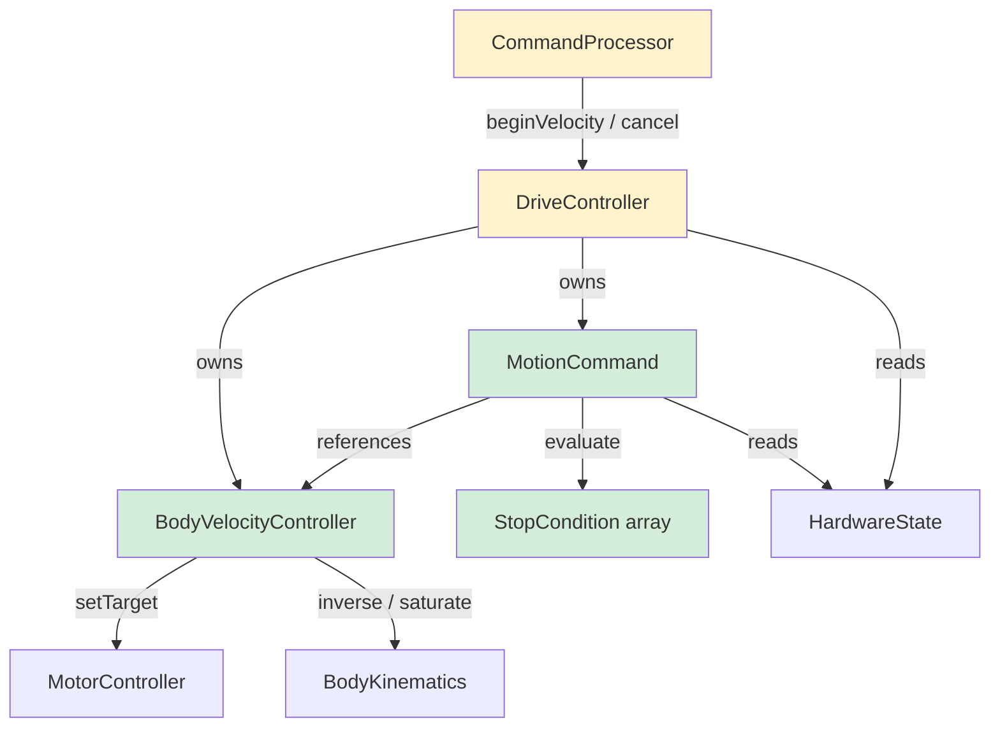
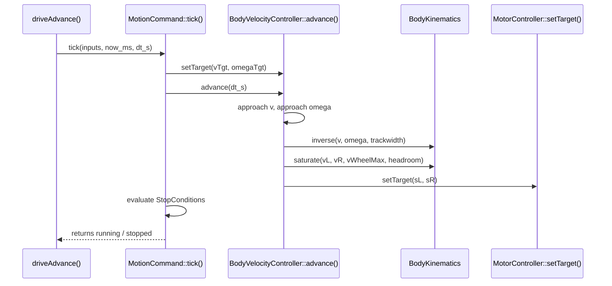
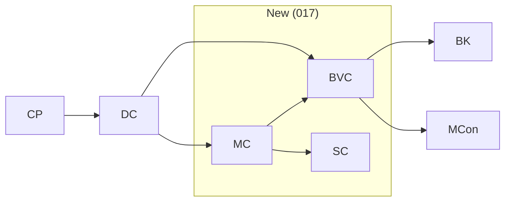

<!-- CLASI: Architecture update for sprint 017 -->

# Architecture Update — Sprint 017: Body velocity control and MotionCommand core

## What Changed

Three new classes added to `source/control/`:

1. **`BodyVelocityController`** — body-level `(v, ω)` motion profiler that ramps toward
   a commanded twist under configurable limits and pushes wheel setpoints each tick.
2. **`StopCondition`** — POD tagged struct; a fixed array of these attached to each
   `MotionCommand` provides composable, OR-across-array command termination.
3. **`MotionCommand`** — the active-command object: carries a target twist, stop
   conditions, reply sink, and a reference to the controller; lifecycle is configure →
   start → tick → terminate.

`DriveController` gains ownership of one `BodyVelocityController` and one `MotionCommand`
instance. The VW verb is migrated from the raw STREAMING path onto a MotionCommand. A new
`X` cancel verb is added. `Config.h` gains five new limit fields; `CommandProcessor`
gains five new `kRegistry[]` entries. The host `protocol.py` gains a `cancel()` wrapper.

No existing command paths (S, T, D, G) are migrated in this sprint.

## Why

The existing motion layer commands raw per-wheel speeds instantly — no acceleration limit,
so chassis jerks from rest. Termination logic is an ad-hoc if-chain per DriveMode with no
way to compose conditions or add sensor-triggered stops. This sprint installs the shared
profiler and command abstraction that subsequent sprints (018) will migrate the remaining
commands onto.

## Impact on Existing Components

| Component | Change |
|---|---|
| `DriveController.h/.cpp` | Add `_bvc` (`BodyVelocityController`) and `_activeCmd` (`MotionCommand`) members; add `cancel()` method; `beginVelocity` now configures `_activeCmd` instead of delegating to `beginStream`; `driveAdvance` calls `_activeCmd.tick()` when active |
| `Config.h` | Five new fields (`vBodyMax`, `yawRateMax`, `yawAccMax`, `jMax`, `yawJerkMax`) + defaults |
| `CommandProcessor.cpp` | Five new `kRegistry[]` entries; new `X` verb handler; `STOP` handler updated to call `cancel()` |
| `host/robot_radio/robot/protocol.py` | New `cancel()` method |
| **No change** | `MotorController`, `BodyKinematics`, `Odometry`, `AppContext`, `S`/`T`/`D`/`G` handlers |

## Migration Concerns

The VW STREAMING watchdog (`_lastSMs` + `sTimeoutMs` if-branch in `driveAdvance`) is
replaced by a TIME stop condition on the MotionCommand. The `_lastSMs` field and the
STREAMING watchdog branch remain for the `S` command; VW no longer sets
`_mode = STREAMING`. The STREAMING watchdog branch must be guarded to fire only when
`_mode == STREAMING` (i.e. the S command), not when a MotionCommand is active. This is
achieved naturally because `beginVelocity` no longer calls `beginStream`.

No heap is introduced: both `_bvc` and `_activeCmd` are value members of
`DriveController`; `StopCondition[kMaxStopConds]` is a fixed-size array inside
`MotionCommand`.

---

## Subsystem Definitions

### BodyVelocityController

**Purpose:** Ramp the live body twist `(v, ω)` toward a commanded target under
configurable acceleration and rate limits, then translate to wheel setpoints each tick.

**Boundary (inside):** trapezoid profiler state (`_v`, `_omega`, `_vTgt`, `_omegaTgt`),
the `approach()` helper, deg→rad conversion of `yawRateMax`/`yawAccMax` at the use site.

**Boundary (outside):** S-curve integration (provisioned via `jMax`/`yawJerkMax` fields,
active when `> 0` — deferred); `MotorController` PID gains; `DriveController` tick
scheduling.

**Use cases:** SUC-001, SUC-002, SUC-006

**Files:** `source/control/BodyVelocityController.h`, `source/control/BodyVelocityController.cpp`

---

### StopCondition

**Purpose:** Evaluate one configurable termination condition each tick against
`HardwareState` and a captured baseline; return true when the condition is satisfied.

**Boundary (inside):** KIND enum, scalar params `a`/`b`/`ax`/`sensor`/`cmp`, `evaluate()`.

**Boundary (outside):** Allocation (fixed array in `MotionCommand`); command lifecycle
(owned by `MotionCommand`); EVT emission (done by `MotionCommand`).

**Use cases:** SUC-002, SUC-003, SUC-004

**Files:** `source/control/StopCondition.h`, `source/control/StopCondition.cpp`

---

### MotionCommand

**Purpose:** Active-command object; encapsulates a target twist, stop conditions, reply
sink, and a reference to the velocity controller; drives the configure → start → tick →
terminate lifecycle.

**Boundary (inside):** `MotionBaseline` snapshot, SOFT/HARD teardown logic, EVT emission,
`kMaxStopConds = 4` fixed array.

**Boundary (outside):** Profiling (delegated to `BodyVelocityController`); wheel output
(delegated through BVC → MotorController); scheduling (ticked by
`DriveController::driveAdvance`).

**Use cases:** SUC-004, SUC-006

**Files:** `source/control/MotionCommand.h`, `source/control/MotionCommand.cpp`

---

## Diagrams

### Component diagram



_Green = new this sprint. Yellow = modified._

### Per-tick data flow (ordering invariant)



**Ordering invariant:** `profile → inverse → saturate → setTarget` — identical to the
ordering already used by the G-mode PURSUE path. `advance()` must NOT be called from
both `MotionCommand::tick()` and any other path, or the ramp double-counts.

### Dependency graph



No cycles. Fan-out from `DC` is 2 new + 2 existing (BK, MCon) = 4. Within budget.

---

## Field Layouts

### BodyVelocityController (header sketch)

```cpp
class BodyVelocityController {
public:
    BodyVelocityController(MotorController& mc, const RobotConfig& cfg);

    void  setTarget(float v_mms, float omega_rads);
    bool  advance(float dt_s);      // true while still ramping
    void  reset();                  // zero profile + seed to (0,0); no brake
    void  seedCurrent(float v_mms, float omega_rads);

    float currentV()     const;
    float currentOmega() const;
    float targetV()      const;
    float targetOmega()  const;
    bool  atTarget()     const;     // |v-vTgt|<eps && |omega-omegaTgt|<eps

private:
    MotorController&    _mc;
    const RobotConfig&  _cfg;
    float  _v;          // live body forward speed, mm/s
    float  _omega;      // live yaw rate, rad/s
    float  _vTgt;       // commanded forward speed, mm/s
    float  _omegaTgt;   // commanded yaw rate, rad/s
};
```

Per-tick math (trapezoid; jerk path active only when `jMax > 0`):

```
dv_max   = (vTgt >= v ? cfg.aMax : cfg.aDecel) * dt_s
v        = approach(v, clamp(vTgt, -cfg.vBodyMax, +cfg.vBodyMax), dv_max)

yawRateMax_rad  = cfg.yawRateMax * (pi/180)
yawAccMax_rad   = cfg.yawAccMax  * (pi/180)
domega_max = yawAccMax_rad * dt_s
omega = approach(omega, clamp(omegaTgt, -yawRateMax_rad, +yawRateMax_rad), domega_max)

BodyKinematics::inverse(v, omega, cfg.trackwidthMm, vL, vR)
BodyKinematics::saturate(vL, vR, cfg.vWheelMax, cfg.steerHeadroom, sL, sR)
_mc.setTarget(sL, sR)
```

`approach(cur, tgt, step)` = `cur + clamp(tgt - cur, -step, +step)`.

**PID-dt clock:** `advance(dt_s)` is called with `dt_s` from `driveAdvance`'s measured
elapsed time. BVC is advanced exactly once per `driveAdvance` tick — through
`MotionCommand::tick`. It must not be advanced from any other caller.

---

### StopCondition (header sketch)

```cpp
struct MotionBaseline {
    uint32_t t0Ms;
    float    enc0Mm;        // (encLMm + encRMm) * 0.5 at start
    float    heading0Rad;   // pose heading at start (rad)
    float    pose0X;
    float    pose0Y;
};

struct StopCondition {
    enum class Kind : uint8_t { NONE, TIME, DISTANCE, HEADING, POSITION, SENSOR };
    enum class Cmp  : uint8_t { GE, LE };

    Kind    kind   = Kind::NONE;
    float   a      = 0;    // primary param (see table)
    float   b      = 0;    // secondary param
    float   ax     = 0;    // POSITION: target x, mm
    uint8_t sensor = 0;    // SENSOR: channel selector
    Cmp     cmp    = Cmp::GE;

    bool evaluate(const HardwareState& s, uint32_t now_ms,
                  const MotionBaseline& base) const;
};
```

| Kind | `a` | `b` | `ax` | Fires when |
|---|---|---|---|---|
| TIME | threshold ms | — | — | `now_ms - t0 >= a` |
| DISTANCE | threshold mm | — | — | `|(encL+encR)/2 - enc0| >= a` (raw) |
| HEADING | target rad (delta) | eps rad | — | `|wrap(heading - heading0 - a)| < b` |
| POSITION | target y mm | radius mm | target x mm | `dist((poseX,poseY),(ax,a)) < b` |
| SENSOR | threshold | — | — | channel GE/LE threshold |

**Distance check uses raw encoder sum** (`s.encLMm + s.encRMm`), not filtered, matching
the D-command finding (filtered value can stall under outlier filtering).

---

### MotionCommand (header sketch)

```cpp
class MotionCommand {
public:
    static constexpr uint8_t kMaxStopConds = 4;
    enum class StopStyle : uint8_t { SOFT, HARD };

    void configure(float v_mms, float omega_rads, BodyVelocityController* bvc);
    bool addStop(const StopCondition& c);   // false if full; assert in debug builds
    void setReplySink(ReplyFn fn, void* ctx, const char* corrId);
    void setStopStyle(StopStyle s);         // default SOFT
    void armTime(uint32_t now_ms);          // re-arm the first TIME condition baseline

    void start(const HardwareState& inputs, uint32_t now_ms);
    void setTarget(float v_mms, float omega_rads);  // live update + re-arm keepalive

    bool tick(const HardwareState& inputs, uint32_t now_ms, float dt_s);

    void cancel(StopStyle s = StopStyle::HARD);
    bool active() const;

private:
    BodyVelocityController* _bvc         = nullptr;
    float       _vTgt                    = 0;
    float       _omegaTgt                = 0;
    StopCondition _stops[kMaxStopConds]  = {};
    uint8_t     _nStops                  = 0;
    MotionBaseline _baseline             = {};
    ReplyFn     _replyFn                 = nullptr;
    void*       _replyCtx                = nullptr;
    char        _corrId[16]              = {};
    StopStyle   _stopStyle               = StopStyle::SOFT;
    bool        _active                  = false;
    bool        _stopping                = false;
    uint32_t    _softDeadlineMs          = 0;
    static constexpr uint32_t kSoftDeadlineMs = 3000;
};
```

**SOFT-stop sub-phase:** when a stop fires with SOFT style, `_stopping = true`, target
`(0,0)` is sent to BVC, and `_softDeadlineMs = now_ms + kSoftDeadlineMs`. Each tick while
stopping: if `bvc->atTarget()` or `now_ms >= _softDeadlineMs`, emit `EVT done` and
go IDLE. HARD-stop: call `bvc->reset()` + (for cancel) `mc.stop()`, emit `EVT cancelled`,
go IDLE immediately.

---

### Config.h additions

Five new fields appended to `RobotConfig` (near the existing `aMax`/`aDecel`):

```cpp
float vBodyMax;       // body forward speed ceiling, mm/s        (default 400.0)
float yawRateMax;     // yaw rate ceiling, deg/s                 (default 180.0)
float yawAccMax;      // yaw acceleration limit, deg/s²          (default 720.0)
float jMax;           // linear jerk limit, mm/s³  (0=trapezoid) (default 0.0)
float yawJerkMax;     // yaw jerk limit, deg/s³    (0=trapezoid) (default 0.0)
```

`kRegistry[]` additions (five `CFG_F` entries after the existing `aDecel`/`aMax` rows):

```cpp
CFG_F("vBodyMax",    vBodyMax),
CFG_F("yawRateMax",  yawRateMax),
CFG_F("yawAccMax",   yawAccMax),
CFG_F("jMax",        jMax),
CFG_F("yawJerkMax",  yawJerkMax),
```

Defaults chosen so that the linear channel behaviour equals today's: `aMax`/`aDecel`
already 300/250 mm/s². `vBodyMax` 400 matches existing `vWheelMax` 400. Yaw rate 180 deg/s
≈ π rad/s. S-curve off (`jMax = 0`, `yawJerkMax = 0`).

---

### DriveController changes

New private members (value, not pointer — no heap):
```cpp
BodyVelocityController _bvc;       // constructed on _mc + _cfg
MotionCommand          _activeCmd;
```

Member order is load-bearing: `_bvc` must be declared before `_activeCmd` so `_bvc` is
constructed first (DriveController's constructor initialiser list passes `&_bvc` to
`_activeCmd.configure`).

New public method:
```cpp
void cancel(uint32_t now_ms, ReplyFn fn, void* ctx);
```

`beginVelocity` change summary: configures `_activeCmd` (not `beginStream`), adds TIME
stop condition with `a = (float)_cfg.sTimeoutMs`, starts it, sets `_mode` to a non-
STREAMING tag so the STREAMING watchdog branch does not fire.

`driveAdvance` change: at the top, if `_activeCmd.active()`, compute `dt_s`, call
`_activeCmd.tick(inputs, now_ms, dt_s)`, return if still active; on termination set
`_mode = IDLE`. The old if-chain (STREAMING/TIMED/DISTANCE/GO_TO branches) runs only when
`!_activeCmd.active()`.

---

## Design Rationale

### Decision: BodyVelocityController owned by DriveController, referenced by MotionCommand

**Context:** The profiler needs to persist across MotionCommand reconfiguration. MotionCommand
is reconfigured per-command (single owned instance, `start` re-uses storage).

**Alternatives:** (a) BVC inside MotionCommand — resettable, but lifetime is unclear when
MotionCommand is reconfigured. (b) BVC in MotorController — violates layer boundary.

**Why this choice:** DriveController is the coordinating layer that owns all drive state.
The reference from MotionCommand to BVC is stable for the robot's lifetime.

**Consequences:** `_bvc` must be declared before `_activeCmd` in DriveController.

---

### Decision: StopCondition as POD tagged struct (no virtual dispatch)

**Context:** Embedded target; no heap allocator. Up to 4 composable conditions per command.

**Alternative:** Virtual base class hierarchy — requires heap or custom slab.

**Why this choice:** POD struct + Kind switch. Six cases; acceptable. Zero dynamic
allocation. `kMaxStopConds = 4` is explicit and assertable.

**Consequences:** Adding a new Kind requires editing `StopCondition.h` and `evaluate()`.

---

### Decision: VW keepalive re-arms via setTarget on active MotionCommand

**Context:** VW is a streaming command; each incoming packet is both a new setpoint and a
keepalive. Under the old design, `_lastSMs` was bumped by `beginStream`.

**Why this choice:** `MotionCommand::setTarget` re-arms the TIME stop condition baseline
(`t0` reset to `now_ms`) and updates `_vTgt`/`_omegaTgt`. CommandProcessor VW handler
checks if a VW MotionCommand is already active and calls `setTarget` instead of
`beginVelocity` from scratch. This avoids resetting the profiler on every re-send.

**Consequences:** CommandProcessor must distinguish "new VW" from "keepalive VW". A simple
check: if `_activeCmd.active()` and current mode is VW, call `setTarget`; otherwise call
`beginVelocity`.

---

## Open Questions

1. **DriveMode tag for VW.** After `beginVelocity` no longer sets `_mode = STREAMING`,
   TLM `mode` field changes for VW. Should a new `DriveMode::VELOCITY` enum value be
   added, or should VW continue to report as `STREAMING`? Host scripts that check the
   mode field need consideration.

2. **EVT name for VW keepalive loss.** Currently `EVT safety_stop`. With MotionCommand,
   TIME condition fires and emits `EVT done`. Should the EVT preserve the `safety_stop`
   name for host compatibility, or is a name change acceptable?

3. **POSITION param packing readability.** `a` = target y, `ax` = target x, `b` = radius
   is non-obvious. Consider a union or named float[4] block. No functional impact.
