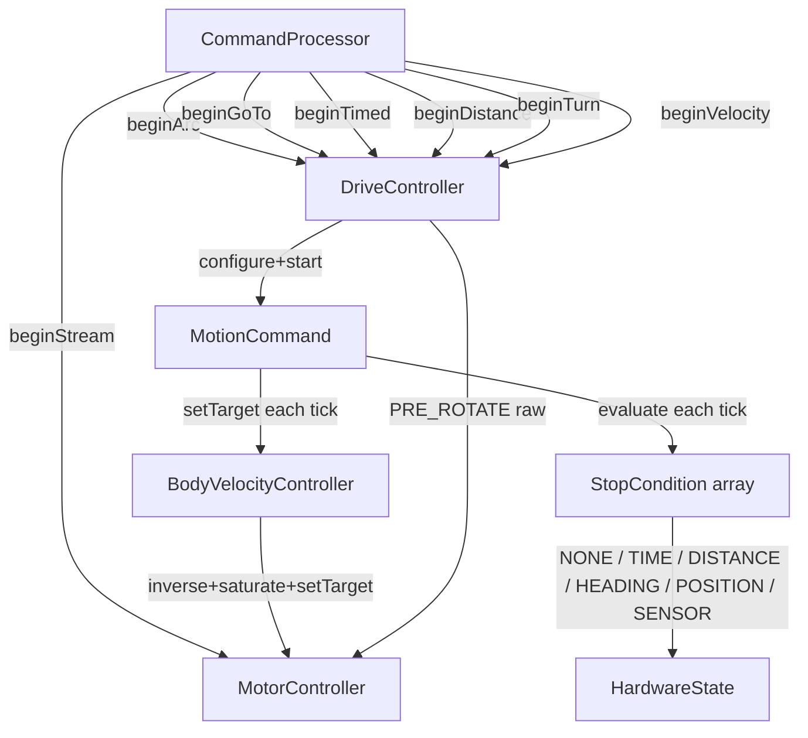

<!-- CLASI: Before changing code or making plans, review the SE process in CLAUDE.md -->

# Architecture Update — Sprint 018: Motion command migration

## What Changed

Sprint 018 completes the migration of all bespoke motion-command paths onto the
`MotionCommand` + `BodyVelocityController` + `StopCondition` engine built in 017. No
new infrastructure classes are added; the changes are:

1. **R (arc) command** — new firmware verb; thin `ω = v·κ` adapter on the existing
   `(v, ω)` controller; new `arc()` host wrapper.
2. **G migration** — inline `_vRamped` trapezoid replaced by a per-tick pursuit hook
   inside a `POSITION`-stop MotionCommand. `_vRamped` member removed.
3. **T migration** — bespoke `_tEndMs` branch replaced by `TIME(ms)` stop condition;
   `(L, R)` converted to `(v, ω)` at begin.
4. **D migration** — bespoke encoder-delta branch replaced by `DISTANCE(mm)` stop
   condition; terminal decel cap added; encoder-reset workaround preserved.
5. **TURN verb** — new command: `(v=0, ±yawRate)` + `HEADING(θ, eps)` stop.
6. **sensor= modifier** — optional extra token on T, D, TURN that appends a `SENSOR`
   stop condition alongside the primary stop.
7. **S-curve activation** — `BodyVelocityController::advance()` gains the
   jerk-limited branch; activated when `jMax > 0`, degenerates to trapezoid otherwise.
8. **`driveAdvance` cleanup** — per-mode if-chain reduced to: STREAMING watchdog (S
   only) + MotionCommand tick (all others). T/D/G termination logic removed.
9. **`DriveController` cleanup** — `_vRamped`, `_tEndMs`, `_dEncStartL/R`,
   `_dTargetMm`, `_dTimeoutMs` members removed after their commands migrate.

`S` (`beginStream`) is byte-for-byte unchanged throughout.

---

## Why

After 017, three commands (G, T, D) still terminate via hand-written per-mode branches
in `driveAdvance`, and none ramp their motion profile. The `_vRamped` state in
`DriveController` is duplicated infrastructure that the 017 controller replaces.
Two new capabilities (arc, turn-to-heading) and sensor-triggered stop have no clean
insertion point in the old architecture; they map naturally onto `MotionCommand`.
Completing the migration deletes dead branches and makes `driveAdvance` a uniform
one-call tick loop.

---

## Command → MotionCommand Mapping

| Verb | At begin: twist | Stop condition(s) | Style | Notes |
|---|---|---|---|---|
| **VW** `v ω` | `(v, ω)` | `TIME(sTimeoutMs)` re-armed | SOFT | Already migrated in 017. |
| **R** `speed radius` | `(speed, speed/radius)` | none (open-ended) | SOFT | `radius=0` ⇒ `ω=0` (straight). Optional safety TIME can be added via `sensor=` or future extension. |
| **T** `L R ms` | `forward(L,R) → (v,ω)` | `TIME(ms)` + optional SENSOR | SOFT | `(L,R)` adapter at begin; EVT done T preserved. |
| **D** `L R mm` | `forward(L,R) → (v,ω)` | `DISTANCE(mm)` + optional SENSOR | SOFT | Terminal decel cap; encoder-reset workaround; EVT done D preserved. |
| **G** `x y speed` | pursuit hook per tick | `POSITION(x,y,arriveTol)` | SOFT | PRE_ROTATE stays raw turn-in-place; EVT done G preserved. |
| **TURN** `heading_cdeg` | `(0, ±yawRateMax)` | `HEADING(θ,eps)` + optional SENSOR | SOFT | Sign from shortest-path; EVT done TURN. |
| **S** | raw per-wheel | none | — | Unchanged; `beginStream` → `MotorController::setTarget` directly. |
| **X / STOP** | — | — | HARD | `DriveController::cancel()` unchanged. |

---

## Subsystem Definitions

### R (Arc) Adapter

**Purpose:** Accept `(speed, radius)` from the wire and compute `(speed, speed/radius)` as
the MotionCommand twist; no other logic.

**Boundary (inside):** Wire parsing; κ computation (`radius = 0 ⇒ κ = 0`); sign
convention (positive radius ⇒ positive ω ⇒ CCW/left); `beginArc()` method on
`DriveController`.

**Boundary (outside):** Profiling (BVC), saturation (BodyKinematics), EVT emission
(MotionCommand). No state beyond the single `_activeCmd`.

**Use cases:** SUC-001

**Files added/modified:**
- `source/app/CommandProcessor.cpp` — R verb handler + HELP entry
- `source/control/DriveController.h/.cpp` — `beginArc()` entry point
- `host/robot_radio/robot/protocol.py` — `arc()` wrapper

**Sign convention (pinned):** Positive radius ⇒ CCW turn (left arc). `ω = speed / radius`.
For positive `speed` and positive `radius`: `vL = speed - ω·(b/2) < vR`. This matches
`BodyKinematics::inverse` which uses CCW-positive ω. Test: `arc(300, 200)` ⇒ `vL < vR`.

---

### G Pursuit Hook

**Purpose:** Each tick in PURSUE phase, recompute `(v, ω)` from current pose and call
`MotionCommand::setTarget`; clamp `v` with the terminal decel cap before the call.

**Boundary (inside):** The per-tick bearing and κ computation (same math as old
PURSUE branch, minus `_vRamped`); the decel cap `v_cap = √(2·aDecel·d_remaining)`;
the call to `_activeCmd.setTarget(v_clamped, omega)`.

**Boundary (outside):** PRE_ROTATE (still raw `startDriveClean` + per-tick bearing
check, unchanged); MotionCommand lifecycle (configure/addStop/start at begin);
BVC profiling (the controller ramps `v_clamped` toward target under `aMax`).

**Use cases:** SUC-002

**Files modified:**
- `source/control/DriveController.h` — remove `_vRamped`; `beginGoTo` reconfigured
- `source/control/DriveController.cpp` — `beginGoTo` configures MotionCommand with
  POSITION stop; PURSUE tick body becomes `setTarget` call; `_vRamped` references removed

**Note on PRE_ROTATE:** PRE_ROTATE continues as a raw `startDriveClean` + per-tick
bearing check in `driveAdvance`. It does NOT use MotionCommand. Rationale: PRE_ROTATE
is already a working per-direction feedforward turn (with `rotationGainPos/Neg`), it is
not a precision motion, and migrating it would require knowing when PRE_ROTATE is done
from within MotionCommand — which would require a new stop condition kind or a callback.
The coupling is not worth the complexity. PURSUE → MotionCommand; PRE_ROTATE stays raw.

---

### T Migration

**Purpose:** Replace the bespoke `_tEndMs` deadline branch with a MotionCommand
having a `TIME(ms)` stop condition; convert `(L, R)` to `(v, ω)` at begin.

**Boundary (inside):** `beginTimed` reconfigured to call `forward(L, R) → (v, ω)`,
then `configure/addStop(TIME)/start`; the `_tEndMs` member removed.

**Boundary (outside):** EVT done T wire format unchanged; host scripts unchanged.

**Use cases:** SUC-003

**Files modified:**
- `source/control/DriveController.h` — remove `_tEndMs`
- `source/control/DriveController.cpp` — `beginTimed` rewrite; T branch removed from
  `driveAdvance`

---

### D Migration

**Purpose:** Replace bespoke encoder-delta branch with a MotionCommand having a
`DISTANCE(mm)` stop condition; add terminal decel cap as a per-tick hook (same
pattern as G pursuit); preserve encoder-reset workaround.

**Boundary (inside):** `beginDistance` reconfigured to call `forward(L, R) → (v, ω)`,
reset encoders, then `configure/addStop(DISTANCE)/start`; per-tick decel hook calls
`_activeCmd.setTarget(v_cap, omega)` where `v_cap = √(2·aDecel·d_remaining)`.

The terminal decel cap for D is implemented as a per-tick hook analogous to the G
pursuit hook. `DriveController::driveAdvance` must have a way to apply this hook when
the active command is in DISTANCE mode. Implementation approach: store the distance
target and initial `(v, ω)` in DriveController members (replacing the removed `_dTargetMm`
equivalents with a single float set); the tick body calls `_activeCmd.setTarget(v_cap, omega)`.

**Boundary (outside):** Raw encoder sum from `mc.getEncoderPositions()` is still used
for the decel cap computation — the filtered `encLMm` is not used for distance tracking
(same decision as pre-018). `DISTANCE` stop condition uses `(encLMm + encRMm)/2` from
`HardwareState` which is the running accumulator (not filtered in the same way). The
encoder-reset workaround (`resetEncoderAccumulators` before begin) remains.

**D-timeout heuristic:** Retained as a safety-net TIME condition added alongside the
DISTANCE stop. The heuristic formula `2× nominal + 2 s` is unchanged. With profiled
ramp-up, the robot covers slightly less distance in the first ~200 ms than before,
meaning it takes marginally longer to reach the target — the 2× factor absorbs this
comfortably.

**Use cases:** SUC-004

**Files modified:**
- `source/control/DriveController.h` — remove `_dEncStartL/R`, `_dTargetMm`, `_dTimeoutMs`;
  add `_dDistTarget`, `_dOmega` for the per-tick decel cap hook
- `source/control/DriveController.cpp` — `beginDistance` rewrite; D branch removed from
  `driveAdvance`; per-tick decel hook added

---

### TURN Verb

**Purpose:** New command: rotate to an absolute heading using `HEADING` stop condition.

**Boundary (inside):** Wire parsing of `heading_cdeg` (integer centidegrees) → radians;
shortest-path sign selection for ω; `beginTurn()` on `DriveController`; `HEADING(θ, eps)`
stop; `EVT done TURN`.

**Boundary (outside):** Profiling (BVC handles ω ramp under yawAccMax); eps default
from config (e.g. 0.05 rad ≈ 3°) or wire-parameterised.

**Wire format:** `TURN <heading_cdeg>` (integer centidegrees, same unit as TLM pose
heading field). Optional `eps=<cdeg>` keyword argument for tighter tolerance.

**Use cases:** SUC-005

**Files added/modified:**
- `source/app/CommandProcessor.cpp` — TURN handler + HELP entry
- `source/control/DriveController.h/.cpp` — `beginTurn()` entry point
- `host/robot_radio/robot/protocol.py` — `turn()` wrapper

---

### sensor= Modifier

**Purpose:** An optional extra token on T, D, and TURN wire commands that appends a
`SENSOR` stop condition alongside the primary stop. Chosen over a dedicated verb because
the "drive until sensor" use case is always a secondary constraint on an existing drive —
not a standalone motion primitive.

**Wire format:** `T <l> <r> <ms> sensor=<ch>:<op>:<thr>`
where:
- `ch` ∈ `line0`, `line1`, `line2`, `line3`, `colorR`, `colorG`, `colorB`, `colorC`
  (matches the channel index table in `StopCondition.cpp::getSensorValue`)
- `op` ∈ `ge` (≥), `le` (≤)
- `thr` — integer threshold (raw sensor units)

Example: `T 200 200 5000 sensor=line0:ge:512` drives forward for up to 5 s, stopping
early if `line[0] ≥ 512`.

**Design rationale:**
- A dedicated `sensor=` keyword token (not a positional arg) avoids breaking existing
  T/D wire format for callers that do not use it.
- Modifier-on-verb is simpler than a new verb because it keeps the command ↔ EVT name
  correspondence clean: the EVT still says `done T` (not `done SENSOR_T`).
- `kMaxStopConds = 4` is ample for the primary stop + safety TIME (D) + one sensor
  condition. No overflow risk.
- SENSOR channels limited to the 12 already defined in `StopCondition.cpp`; any unknown
  channel name → `ERR badarg`.

**Use cases:** SUC-006

**Files modified:**
- `source/app/CommandProcessor.cpp` — `sensor=` token parsing in T, D, TURN handlers
- `host/robot_radio/robot/protocol.py` — `drive_until_sensor()` wrapper + updated
  `timed()`, `distance()`, `turn()` signatures to accept optional sensor args

---

### S-Curve Activation

**Purpose:** When `jMax > 0`, `BodyVelocityController::advance()` slews the linear
acceleration toward the demanded step under a jerk bound instead of stepping it
instantly; likewise `yawJerkMax > 0` applies to the yaw channel. At `jMax = 0` the
code path degenerates to the existing trapezoid.

**Implementation approach:** Add `_aLive` (current acceleration) member to BVC; on each
tick, if `jMax > 0`, slew `_aLive` toward `sign(vTgt - v) * aMax` by at most
`jMax * dt_s`; integrate `v += _aLive * dt_s`. At `jMax = 0`, `_aLive` snaps to
`± aMax` each tick (recovering the trapezoid). Equivalent for yaw channel.

**Boundary (inside):** `_aLive`, `_omegaALive` state; jerk-limit slew in `advance()`.

**Boundary (outside):** No change to `MotionCommand`, `StopCondition`, `DriveController`,
config registry (fields already exist from 017).

**Use cases:** SUC-007

**Files modified:**
- `source/control/BodyVelocityController.h` — add `_aLive`, `_omegaALive` members
- `source/control/BodyVelocityController.cpp` — S-curve branch in `advance()`

---

## Architecture Diagram

**Key edges:**
- `beginStream` (S command) bypasses MotionCommand entirely — direct path to MotorController.
- `PRE_ROTATE` in G is the only remaining raw path inside DriveController; it does not
  use MotionCommand.
- After 018, `driveAdvance` contains: STREAMING watchdog (S only) + `_activeCmd.tick()` +
  PRE_ROTATE/PURSUE G state machine tick. The T and D per-mode branches are deleted.

---

## Impact on Existing Components

| Component | Change |
|---|---|
| `DriveController.h` | Remove `_vRamped`, `_tEndMs`, `_dEncStartL/R`, `_dTargetMm`, `_dTimeoutMs`; add `beginArc()`, `beginTurn()`; add `_dDistTarget`, `_dOmega` for D decel hook |
| `DriveController.cpp` | Rewrite `beginTimed`, `beginDistance`, `beginGoTo` (PURSUE body); remove T/D branches from `driveAdvance`; add PURSUE per-tick `setTarget` + D decel hook; add `beginArc`, `beginTurn` |
| `CommandProcessor.cpp` | Add R, TURN verb handlers; sensor= modifier parsing in T/D/TURN; HELP updated |
| `BodyVelocityController.h/.cpp` | Add `_aLive`, `_omegaALive`; S-curve branch in `advance()` |
| `host/robot_radio/robot/protocol.py` | Add `arc()`, `turn()`, `drive_until_sensor()`; update `timed()`, `distance()`, `turn()` for optional sensor args |
| `tests/dev/test_motion_verbs_v2.py` | New tests for R, TURN, sensor= |
| `tests/dev/test_body_velocity_controller.py` | New test for S-curve activation |
| **No change** | `StopCondition.{h,cpp}`, `MotionCommand.{h,cpp}`, `BodyKinematics`, `Odometry`, `AppContext`, `S` verb handler |

---

## Migration Concerns

### EVT wire contracts

Every migrated command emits the same EVT as before:
- T → `EVT done T` (with corrId if supplied)
- D → `EVT done D`
- G → `EVT done G`
- New: TURN → `EVT done TURN`
- R → `EVT done` (no suffix, or `EVT done R`; see Open Questions)

Tickets must grep the host test suite for these EVT strings before touching any
emission path, exactly as done in 017-004.

### S-command isolation

`beginStream` must not be touched. `driveAdvance`'s STREAMING watchdog branch is
guarded by `_mode == DriveMode::STREAMING` and fires only for S; the MotionCommand
early-return at the top of `driveAdvance` prevents the watchdog from running for any
MotionCommand-based verb.

### D terminal decel cap

The decel cap `v_cap = √(2·aDecel·d_remaining)` requires knowing `d_remaining` at each
tick. This needs raw encoder positions read inside `driveAdvance`, not via `HardwareState`
(which carries the filtered value). The ticket must use `mc.getEncoderPositions()` as
before. Alternatively: `HardwareState` enc fields are cumulative (not filtered per tick);
the DISTANCE stop condition in `evaluate()` also uses `(encLMm + encRMm) * 0.5`. These
are the same running accumulators. The decel cap can use the same formula:
`d_remaining = distTarget - |enc_avg - enc0|`; `enc_avg` from `HardwareState` is
acceptable for the decel cap (it only needs to be approximate for the decel shape).
This avoids a second `getEncoderPositions()` call.

### No heap

All new members (`_dDistTarget`, `_dOmega`, `_aLive`, `_omegaALive`) are plain floats.
`kMaxStopConds = 4` is not increased. No dynamic allocation anywhere.

### `test_pursuit_arc_steering.py` regression

This test validates the G pursuit geometry and must stay green after `_vRamped` removal.
The test does not test the ramp; it tests bearing-to-wheel math. The BVC ramps V toward
the pursuit target `v`; the test should be unaffected. Ticket 018-003 must run this test.

---

## Design Rationale

### Why `sensor=` modifier rather than a new verb

A dedicated `SENSOR_T`, `SENSOR_D` family of verbs would duplicate the wire format and
EVT naming for every drive verb. A modifier token appended to the existing verb keeps the
EVT name correct (`done T`, `done D`), is backward compatible (token absent ⇒ unchanged
behaviour), and maps directly onto `addStop()` with a SENSOR condition alongside the
primary stop. The modifier approach also lets one command carry multiple stop conditions
(primary + time safety + sensor) without protocol redesign.

### Why PRE_ROTATE stays raw

PRE_ROTATE terminates on a bearing gate, not on a measurable completion signal that
maps cleanly onto any existing `StopCondition` kind. Migrating it would require either a
new `Kind::BEARING_GATE` condition or a callback hook into MotionCommand — both adding
complexity without user-visible benefit. The raw PRE_ROTATE path is small, well-tested,
and does not interfere with the MotionCommand early-return (it sets `_mode = GO_TO` and
runs in the else-branch of `_activeCmd.active()`).

### Why D-timeout is retained as a TIME condition (not removed)

The timeout is a safety net against mechanical jam or encoder failure. It is already
expressed as a `TIME` condition in the MotionCommand model — appending it alongside
the `DISTANCE` stop adds zero structural complexity. Removing it would make D silently
hang under failure. Keep it.

### Why arc is open-ended (no default TIME stop)

An arc command with a required duration would force the host to always know the arc
duration in advance. Open-ended lets the host stream arc keepalives (like VW) or stop
via X. If a safety timeout is needed, the host can send a timed arc via the `sensor=`
extension or an explicit X after a measured interval. This is consistent with VW semantics
(the host owns the keepalive loop).

---

## Open Questions

1. **R EVT on soft-stop:** Should `R 0 <r>` (speed=0) emit `EVT done` or `EVT done R`?
   The issue says "soft-stop", but does not name the EVT tag for R. Recommend `EVT done R`
   for consistency with T/D/G/TURN; host code should be updated to expect it. **Decision
   needed from stakeholder before implementing R EVT emission.**

2. **TURN `eps` default:** What heading tolerance is acceptable for `TURN`? The HEADING
   stop condition has `b = eps`. A value of 0.052 rad (3°) is suggested; for
   rotation-calibration use it may need to be tighter (0.017 rad = 1°). Recommend making
   it a wire parameter (`TURN <heading_cdeg> eps=<cdeg>`) with a config-key default.
   **Decision: wire-parameterisable with config default, or fixed per the stakeholder.**

3. **sensor= channel naming on D:** The D command already has three positional args
   (`l r mm`); the `sensor=` token is the 4th token (positional). No ambiguity since it
   contains `=`. Confirm that `CommandProcessor::parseKV()` will pick it up when mixed
   with positional args. Reading the code: `parseKV` scans `tokens[1..n]` for `=`
   tokens; positional args are left in `tokens[]`. This works correctly — confirm in test.
