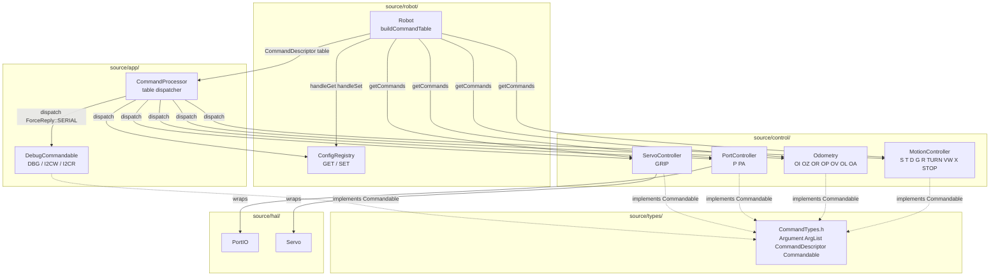
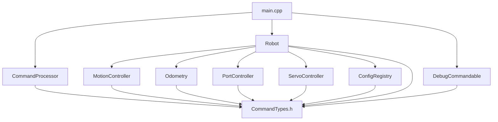

# Architecture Update — Sprint 019: CommandProcessor Composable Refactor

## What Changed

Sprint 019 replaces the 1742-line monolithic `CommandProcessor::process()` switch
statement with a registration-based dispatch table. The changes are:

1. **`CommandTypes.h`** — new type layer. Tagged-union `Argument`, `ArgList`,
   `ParseResult`, `CommandDescriptor`, `Commandable` interface, and `makeCmd` helper.
   All C++11-compatible; no heap allocation.

2. **`ConfigRegistry.h/.cpp`** — extracted from `CommandProcessor.cpp`. Owns
   `kRegistry[]`, `handleGet`, `handleSet`, and the `CfgCtx` context struct.
   Severs the config registry dependency on `CommandProcessor.cpp`.

3. **`CommandProcessor` dual-mode constructor** — new `(const CommandDescriptor*, int)`
   constructor added alongside the existing `Robot&` constructor. `process()` routes
   to the table dispatcher when `_cmds != nullptr`; falls back to the old switch when
   `_cmds == nullptr`. `setSerialReply(fn, ctx)` added for `ForceReply::SERIAL`.

4. **`DriveController` renamed to `MotionController`** — class name, file names, and
   all include sites updated. No behavior change. `Robot` member renamed
   `driveController` to `motionController`.

5. **`PortController`** — new class (`source/control/PortController.h/.cpp`) wrapping
   `PortIO&`; inherits `Commandable`; owns P and PA commands.

6. **`ServoController`** — new class (`source/control/ServoController.h/.cpp`) wrapping
   `Servo&`; inherits `Commandable`; owns GRIP command.

7. **`DebugCommandable`** — new class (`source/app/DebugCommandable.h/.cpp`) owning all
   DBG subcommands (LOOP, LOOP RESET, I2C, I2CLOG, IRQGUARD, WEDGE) and I2CW, I2CR.
   All use `ForceReply::SERIAL`.

8. **`MotionController::getCommands()`** — implements S, T, D, G, R, TURN, VW, X, STOP.
   Captures `ReplyFn`/`ctx` into `begin*()` calls as before; EVT completions unchanged.

9. **`Odometry::getCommands()`** — implements OI, OZ, OR, OP, OV, OL, OA.

10. **`Robot::buildCommandTable()`** — aggregates all `Commandable` subsystems and adds
    system commands (PING, ID, HELLO, VER, ECHO, HELP, SNAP, ZERO, GET, SET, STREAM, RF).

11. **Cutover** — `main.cpp` constructs `CommandProcessor(cmds, count)`.
    Old `CommandProcessor(Robot&)` constructor and entire switch statement deleted.
    `CommandProcessor.cpp` reduced to < 200 lines.

---

## Why

After 18 sprints, `CommandProcessor.cpp` has grown to 1742 lines with all command
logic in a single translation unit. Adding commands for new subsystems requires editing
the central dispatcher regardless of which subsystem the command belongs to. The
registration pattern decouples ownership: each subsystem declares exactly the commands
it handles, and the dispatcher is a data-driven table scan. The sprint does not change
any wire protocol or behavior — it is a pure structural refactor.

---

## Dispatch Algorithm

Prefix matching uses a longest-prefix linear scan. "DBG LOOP RESET" (3 tokens) beats
"DBG LOOP" (2 tokens) beats "DBG" (1 token). Each DBG subcommand is a first-class
entry — no sub-router.

```cpp
const CommandDescriptor* best = nullptr; int bestScore = 0;
for (int i = 0; i < _cmdCount; ++i) {
    int score = prefixMatchLen(_cmds[i].prefix, tokens, ntok);
    if (score > bestScore) { best = &_cmds[i]; bestScore = score; }
}
```

`prefixMatchLen` compares space-delimited tokens in the descriptor prefix against the
incoming token array; returns the number of tokens matched, or 0 on mismatch.

For `ForceReply::SERIAL` commands, the dispatcher substitutes `_serialFn`/`_serialCtx`
before calling the handler.

On parse failure (`parseFn` returns `ok = false`), the dispatcher calls
`replyErr(errFmt, err.detail, corrId, ...)` and does NOT invoke the handler.

---

## Module Definitions

### `CommandTypes.h` (`source/types/`)

**Purpose:** Define all command dispatch types shared across subsystems.

**Boundary (inside):** `ArgType`, `Argument`, `ArgList`, `ParseResult` (tagged union),
`ParseError`, `ParseFn`, `HandlerFn`, `ForceReply`, `CommandDescriptor`, `Commandable`,
`makeCmd`.

**Boundary (outside):** No dependency on any subsystem. Depends only on `stdint.h` and
`Protocol.h` (for `ReplyFn` and `KVPair`).

**Use cases:** SUC-001, SUC-002

---

### `ConfigRegistry` (`source/robot/`)

**Purpose:** Own the GET/SET config key-offset table and its handlers.

**Boundary (inside):** `kRegistry[]` (static array of `ConfigEntry`), `handleGet`,
`handleSet`, `CfgCtx {RobotConfig*, MotorController*}`.

**Boundary (outside):** Does not include `CommandProcessor.h`. Exposes two
`HandlerFn`-compatible functions plus the registry count for `Robot::buildCommandTable()`.

**Use cases:** SUC-005

---

### `CommandProcessor` (`source/app/`)

**Purpose:** Thin table-driven dispatcher over a `CommandDescriptor[]` array.

**Boundary (inside):** `process()` tokenization, prefix matching, parse dispatch,
`ForceReply::SERIAL` substitution. Static helpers `parseTokens`, `parseKV`, `replyOK`,
`replyErr`, `replyEvt` (unchanged). Dual-mode during migration; old switch deleted at
cutover.

**Boundary (outside):** Does not include subsystem headers after cutover. The table is
built externally by `Robot::buildCommandTable()` and passed in at construction.

**Use cases:** SUC-002, SUC-004

---

### `MotionController` (renamed from `DriveController`, `source/control/`)

**Purpose:** Own and advance the S/T/D/G/R/TURN/VW drive state machines; expose them
as `Commandable`.

**Boundary (inside):** All motion `begin*()` entry points; `driveAdvance()`; EVT
completion emission; `getCommands()` returning descriptors for S, T, D, G, R, TURN,
VW, X, STOP; `MotionCtx {MotionController*, Robot*}` static context struct.

**Boundary (outside):** No change to `MotorController`, `Odometry`, `MotionCommand`,
`BodyVelocityController`, or EVT wire format.

**Use cases:** SUC-001, SUC-007

---

### `PortController` (`source/control/`)

**Purpose:** Wrap `PortIO&` and expose the P and PA commands as `Commandable`.

**Boundary (inside):** P (single port write) and PA (all-ports write) handlers; parse
functions; `PortController*` as its own handler context.

**Boundary (outside):** Does not reach into other subsystems. `PortIO` HAL access only.

**Use cases:** SUC-001

---

### `ServoController` (`source/control/`)

**Purpose:** Wrap `Servo&` and expose the GRIP command as `Commandable`.

**Boundary (inside):** GRIP handler; parse function; `ServoController*` as its own
handler context.

**Boundary (outside):** Does not reach into other subsystems. `Servo` HAL access only.

**Use cases:** SUC-001

---

### `DebugCommandable` (`source/app/`)

**Purpose:** Own all diagnostic commands (DBG subcommands, I2CW, I2CR), all with
`ForceReply::SERIAL`.

**Boundary (inside):** DBG LOOP, DBG LOOP RESET, DBG I2C, DBG I2CLOG, DBG IRQGUARD,
DBG WEDGE handlers; I2CW and I2CR handlers; `DbgCtx {LoopScheduler*, I2CBus*, Robot*}`.

**Boundary (outside):** Reads `LoopScheduler` and `I2CBus` via context pointer; does
not own the serial reply function pointer (that lives in `CommandProcessor`).

**Use cases:** SUC-006

---

### `Odometry` (modified, `source/control/`)

**Purpose:** Dead-reckoning tracker; adds `getCommands()` for OI/OZ/OR/OP/OV/OL/OA.

**Boundary (inside):** All existing predict/correct/setPose API unchanged. New:
`getCommands()` returning seven descriptors; `OdomCtx {Odometry*, OtosSensor*}`.

**Boundary (outside):** No new dependencies; `OtosSensor` is accessible via `Robot`
at wiring time.

**Use cases:** SUC-001

---

### `Robot` (modified, `source/robot/`)

**Purpose:** Wire all subsystems; aggregate `Commandable` descriptors into the dispatch
table.

**Boundary (inside):** `buildCommandTable(CommandDescriptor* buf, int max) -> int`
collects descriptors from all `Commandable` members plus system-level commands.
`driveController` member renamed to `motionController`. New value members:
`portController`, `servoController`.

**Boundary (outside):** Does not depend on `CommandProcessor.h`; the table is passed to
`CommandProcessor` by `main.cpp`.

**Use cases:** SUC-001, SUC-003

---

## Architecture Diagrams

### Component Diagram (Post-Cutover)



### Dependency Graph



No cycles. Dependency direction flows from `main.cpp` through App/Robot into Control
and then into Types, consistent with the existing layered architecture.

---

## Impact on Existing Components

| Component | Change |
|---|---|
| `source/types/CommandTypes.h` | New file — all dispatch types |
| `source/robot/ConfigRegistry.h/.cpp` | New files — extracted from `CommandProcessor.cpp` |
| `source/control/DriveController.h/.cpp` | Renamed to `MotionController.h/.cpp`; inherits `Commandable`; adds `getCommands()` |
| `source/control/PortController.h/.cpp` | New files — P, PA |
| `source/control/ServoController.h/.cpp` | New files — GRIP |
| `source/app/DebugCommandable.h/.cpp` | New files — DBG, I2CW, I2CR |
| `source/control/Odometry.h/.cpp` | Inherits `Commandable`; adds `getCommands()` |
| `source/robot/Robot.h/.cpp` | `driveController` renamed to `motionController`; add `portController`, `servoController`; add `buildCommandTable()` |
| `source/app/CommandProcessor.h` | New constructor; `_cmds`, `_cmdCount`, `_serialFn`, `_serialCtx` members; `setSerialReply()`; old `Robot&` constructor kept during migration |
| `source/app/CommandProcessor.cpp` | Add `dispatchTable()` path; old switch behind `_cmds == nullptr`; delete switch at cutover |
| `source/main.cpp` | Add `DebugCommandable dbgCmd`; call `buildCommandTable`; use new constructor |

---

## Migration Concerns

### Staged migration preserves all commands

Old switch path is gated by `_cmds == nullptr`. At each migration step, only the
migrated subsystem's commands move to the new path. All others continue through the
old switch. Every intermediate build is a valid, fully-functioning firmware.

### EVT async completions (highest risk)

The `begin*()` entry point signatures on `MotionController` are unchanged. The table
handler for each motion command must capture `replyFn`, `replyCtx`, and `corrId`
from the `HandlerFn` parameters and pass them to the `begin*()` call identically to
the old switch branch. T008 requires live bench verification of EVT `done D`, `done T`,
`done G`, `done R`, `done TURN` after migration.

### `Robot` member declaration order

`portController` and `servoController` must be declared after `gripper` and `portio`
references in `Robot.h` (C++ members initialize in declaration order). `motionController`
replaces `driveController` in the same declaration position.

### Memory budget

- `CommandDescriptor`: 24 bytes x ~42 = 1008 bytes (static BSS)
- Context structs: ~12 bytes x 7 = 84 bytes (static BSS)
- `ArgList` on `process()` stack: 10 x 40 bytes = 400 bytes (stack)
- Total: ~1092 bytes. Fits within nRF52's 128 KB RAM.

### `ForceReply::SERIAL` wiring

`setSerialReply(fn, ctx)` must be called on `CommandProcessor` before the first
command is dispatched. This is set up in `main.cpp`. If `_serialFn == nullptr` and
a `SERIAL`-forced command arrives, the dispatcher falls back to the originating reply
channel with `ERR not available` (same behavior as the old `setI2CBus`-not-set path).

---

## Design Rationale

### Argument as tagged union, not std::variant

`std::variant` requires C++17. `std::function` requires heap allocation. The C++11
constraint (`-std=c++11 -fno-exceptions -fno-rtti` from `target-locked.json`) rules
both out. The tagged union struct (`ArgType` enum + `union int32_t/float + char[32]`)
is 40 bytes, entirely stack-allocated, and deterministic.

**Alternatives considered:**
- `std::variant<int32_t, float, const char*>` — requires C++17; rejected.
- `std::function<void(...)>` — heap allocation; rejected.
- Raw `void*` argument passing — loses type safety at every handler boundary; rejected.
- `const char**` token array passed directly to handlers — requires each handler to
  re-parse and duplicates error handling; rejected.

**Consequences:** Every parse function fills `ArgList`. Handlers read
`args.args[i].ival` / `.fval` / `.sval` by index — no named parameters. Acceptable
given small arg counts (4 or fewer per command).

### Longest-prefix linear scan, not hash table or trie

~42 commands x 24 bytes = 1008 bytes table; linear scan costs ~2 µs on nRF52 at
64 MHz — negligible against the 20 ms cooperative loop period. A hash table adds
~200 bytes of bucket array and a hash function. A trie requires dynamic allocation
or a large static node pool. Linear scan wins on simplicity and determinism.

**Consequences:** Duplicate prefixes resolve by last-match (iteration order). Ticket
authoring must ensure no two descriptors share the same prefix string.

### `ackFmt` omitted from `CommandDescriptor`

Each handler formats its own ACK body using local `snprintf` format strings. Storing
`ackFmt` in the descriptor would require the dispatcher to know the argument layout of
every command — coupling the dispatcher to handler internals. Handlers own their own
ACK format. The dispatcher only uses `errFmt` (for parse failures).

### `DebugCommandable` as a separate class

DBG commands span `LoopScheduler`, `I2CBus`, and `Robot`. Attaching them to any one
subsystem would create a multi-dependency god-component. A dedicated `DebugCommandable`
owns only the diagnostic surface; its context struct holds pointers to the systems it reads.

---

## Open Questions

1. **`DBG WEDGE` scope:** `WedgeTest.h` is currently in `source/app/`. Confirm it is
   accessible from `source/app/DebugCommandable.cpp` — it should be a local include
   since both are in `source/app/`.

2. **System command handler context:** PING, ID, HELLO, VER, ECHO, HELP, SNAP, ZERO,
   STREAM, RF need various subsystem references. Recommend `Robot*` as `handlerCtx`
   for system commands (broad but avoids per-command context structs for one-off verbs).
   SNAP and STREAM need `buildTlmFrame`/`telemetryEmit` which live on `Robot`.

3. **`ZERO` command scope:** ZERO calls `odometry.zero()` and resets encoder
   accumulators in `state.inputs`. `Robot*` as context is sufficient since both
   `odometry` and `state` are `Robot` members.
