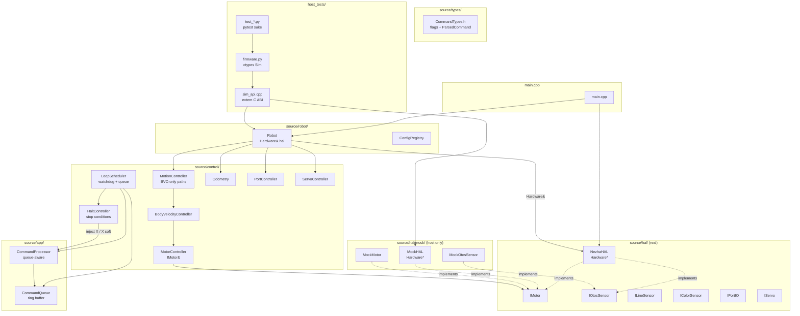
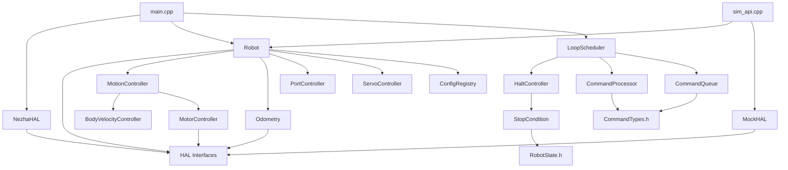
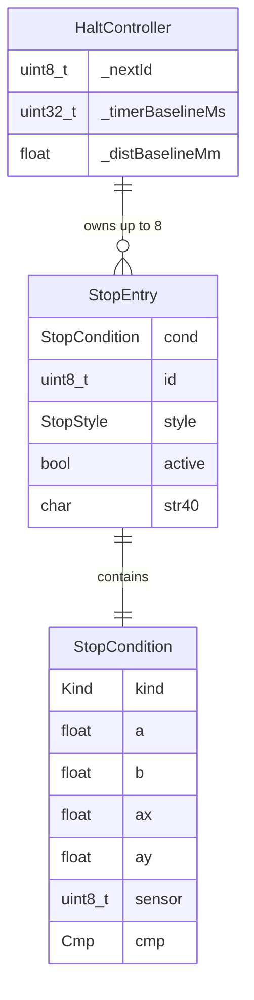

# Architecture Update — Sprint 020: HAL Abstraction, Motion Overhaul, and Command Queue

## What Changed

Sprint 020 introduces three independent but sequentially dependent layers of change:

**Phase A — HAL interface layer**

1. **HAL interfaces** (`source/hal/`): six pure-virtual interfaces (`IMotor`, `ILineSensor`,
   `IColorSensor`, `IOtosSensor`, `IPortIO`, `IServo`) and one abstract factory (`Hardware`).
   Each interface carries exactly the methods already present on its concrete class —
   zero new behavior.

2. **NezhaHAL** (`source/hal/NezhaHAL.h/.cpp`): concrete `Hardware` subclass that owns
   all seven device objects as value members (no heap). Wraps existing `Motor`, `OtosSensor`,
   etc. Replaces the seven static device statics previously declared in `main.cpp`.

3. **Interface inheritance on concrete classes**: `Motor : public IMotor`,
   `OtosSensor : public IOtosSensor`, etc. Behavior is unchanged; only the vtable slot
   is added.

4. **MotorController** and **Odometry** updated: `Motor&` → `IMotor&`;
   `OtosSensor*` → `IOtosSensor*`.

5. **Robot constructor** changed from 7 device refs to `Hardware& hal`. Members
   `motorL`, `motorR`, `otos`, `line`, `colorSensor`, `gripper`, `portio` change from
   concrete references to interface references, initialized from `hal.motorL()` etc.

6. **main.cpp**: single `NezhaHAL hardware(...)` replaces seven device statics.

**Phase A — MockHAL and host build**

7. **MockHAL** (`source/hal/mock/`): six mock device classes plus `MockHAL` aggregate.
   MockMotor integrates command speed into encoder mm on each `tick(dt_ms)`. MockOtosSensor
   returns injected or zero pose. Other mocks cycle through preset value schedules.

8. **Host CMake target** (`host_tests/CMakeLists.txt`): compiles the control and app
   layers (CommandProcessor, MotorController, MotionController, BodyVelocityController,
   Odometry, Robot, and all MockHAL classes) as a shared library (`libfirmware_host`)
   for native execution. Guards CODAL-only code via `HOST_BUILD=1`.

9. **sim_api.cpp** (`host_tests/sim_api.cpp`): `extern "C"` wrapper providing a stable
   C ABI over an opaque simulation handle for Python ctypes consumption.

10. **Python test harness** (`host_tests/firmware.py`, `host_tests/conftest.py`,
    `host_tests/test_*.py`): ctypes loader, `Sim` class, pytest fixtures, and layered
    tests covering MockHAL physics, MotorController PID, motion state machines, and
    command parsing.

**Phase B — Motion system overhaul**

11. **BVC unification**: `beginStream` (S command) and G PRE_ROTATE are converted to
    use BVC (`bvc.seedCurrent + bvc.setTarget`) instead of calling
    `MotorController::setTarget` directly. After this change, all motion commands
    reach the motor exclusively through BVC.

12. **`_VW` raw command**: new wire verb. Calls `bvc.seedCurrent(v, omega)` then
    `bvc.setTarget(v, omega)`. No ramp. Useful for host-managed trajectories.

13. **VW keepalive removed**: the embedded `TIME` stop condition and keepalive re-arm
    logic are deleted from VW's handler. VW runs indefinitely until superseded, X'd,
    or the system watchdog fires.

14. **System watchdog** (`_watchdogMs` on `LoopScheduler`): a single timestamp reset
    on every inbound radio/serial command in `runCommsIn()`. On timeout: emit
    `EVT safety_stop`, inject `X` command. Replaces `_lastSMs` in MotionController and
    VW's keepalive TIME stop. One watchdog for all motion modes.

15. **`+` keepalive command**: resets system watchdog; replies `OK keepalive`. No
    motion side-effect.

16. **`X soft` variant**: sets BVC target to (0, 0), ramps down, emits `EVT done`.
    Hard `X` retains existing immediate-stop behavior.

17. **HaltController** (`source/control/HaltController.h/.cpp`): new class owning a
    fixed array of up to 8 `StopEntry` structs with auto-incrementing IDs. Evaluates
    registered stop conditions each tick and injects `X` or `X soft` via
    `cmd.process()`. Sits at the same level as MotionController inside LoopScheduler.

18. **StopCondition** extended: new `Kind::COLOR` and `Kind::LINE_ANY` entries. New
    `float ay` field added for COLOR HSV distance. New factory helpers `makeColorStop`,
    `makeLineAnyStop`. `evaluate()` updated for new kinds.

19. **HALT command family**: new wire verbs `HALT TIME`, `HALT DIST`, `HALT POS`,
    `HALT COLOR`, `HALT LINE`, `HALT CLEAR`, `HALT INFO`, `HALT LIST`. Each registers
    a condition in HaltController and returns `OK HALT id=<n>`.

20. **ZERO T / ZERO D**: independent baseline resets extending the existing `ZERO`
    command. `ZERO T` resets `_timerBaselineMs` in HaltController; `ZERO D` resets
    `_distBaselineMm`.

**Phase C — Command flags, queue, and test loop**

21. **`CMD_ACCESS_HARDWARE` flag** on `CommandDescriptor`: new `uint8_t flags` field
    in the struct; `makeCmd()` gains a defaulted last parameter. All existing callers
    compile unchanged (field defaults to 0).

22. **Flag annotation**: all ~75 `makeCmd()` calls annotated with correct flag value.
    S/T/D/G/R/TURN are NOT flagged (they become VW converters). VW/`_VW`/X/STOP and
    all device-touching commands are flagged ACCESS_HARDWARE.

23. **`ParsedCommand` struct** in `CommandTypes.h`: holds descriptor pointer, ArgList,
    ReplyFn, replyCtx, and corrId. Stack-sized, no heap.

24. **`CommandQueue`** (`source/app/CommandQueue.h`): fixed-capacity ring buffer
    (capacity 16), no heap, no STL. `push_back`, `push_front`, `pop_front`.

25. **CommandProcessor queue integration**: new `CommandQueue* _queue` member. When
    set, `process()` enqueues instead of dispatching immediately. New `dequeueOne()`
    dispatches one item from the queue.

26. **S/T/D/G/R/TURN → VW converters**: these handlers no longer call MotionController
    begin methods directly. Instead they compute (v, ω) + stop params and call
    `queue.push_front(vwCmd)`. VW's handler reads the stop params and calls the
    appropriate MotionController method.

27. **OP refactor**: `handleOP` reads from `state.inputs.otosX/Y/H` instead of calling
    the OTOS device. `OP` becomes non-ACCESS_HARDWARE.

28. **`LoopScheduler::run_test()`**: new method. Serial-only loop. On each queued
    command: if flagged ACCESS_HARDWARE, emits `DBG skip <prefix>` and discards; else
    dispatches normally. S/T/D/G/R/TURN are dispatched (not skipped); their push_front
    VW command is then dequeued and skipped.

---

## Why

**HAL abstraction**: The firmware's controllers depend directly on concrete device
classes, making offline testing impossible. Every verification requires flashing
hardware. Inserting a thin interface layer severs CODAL coupling from control logic
without changing any runtime behavior.

**MockHAL + host build**: With the HAL in place, the control layer (MotorController,
MotionController, CommandProcessor) can be compiled for native execution using MockHAL
instead of real devices. This enables fast PID tuning, state machine verification, and
command parsing tests without a robot.

**BVC unification**: S mode and G PRE_ROTATE bypass BVC and write directly to
MotorController. This creates two parallel code paths with inconsistent ramp/decel
behavior. After unification, all motion has the same profiled entry point, simplifying
future motion work.

**Single system watchdog**: The current firmware has two separate keepalive mechanisms
— `_lastSMs` in MotionController for S mode, and a TIME stop condition embedded in VW
with keepalive re-arm logic. Having two watchdogs means edge cases (switching between
modes) can leave one active and one dormant. A single `_watchdogMs` on LoopScheduler
covers all modes uniformly.

**HaltController**: Stop conditions are currently bound to MotionCommand at motion-start
time and cannot be registered, queried, or cleared independently. HaltController
introduces named, queryable, multi-type stop conditions that fire at any time during
motion, independent of how the motion was started.

**Command flags + queue**: Without metadata distinguishing hardware-touching commands,
a test loop cannot safely skip motor writes. The `ACCESS_HARDWARE` flag enables
`run_test()` to dispatch the full command parse and translation chain while suppressing
actual device writes — making S→VW translation visible in serial output without
running motors.

---

## Module Definitions

### `IMotor`, `ILineSensor`, `IColorSensor`, `IOtosSensor`, `IPortIO`, `IServo` (`source/hal/`)

**Purpose:** Define the device contract that controllers depend on.

**Boundary (inside):** Pure-virtual method declarations mirroring existing concrete
class APIs. No implementation.

**Boundary (outside):** No dependency on CODAL, MicroBit, or any concrete class.
Depend only on `stdint.h` and `Config.h` (for `RobotConfig`).

**Use cases:** SUC-001, SUC-002, SUC-003

---

### `Hardware` (`source/hal/Hardware.h`)

**Purpose:** Abstract factory/registry returning interface references for each device.

**Boundary (inside):** Pure-virtual accessors: `motorL()`, `motorR()`, `lineSensor()`,
`colorSensor()`, `otos()`, `portIO()`, `gripper()`, `begin()`, `tick(now_ms)`.

**Boundary (outside):** Returns `I<Name>&` references only. No knowledge of concrete
classes, CODAL, or host environment.

**Use cases:** SUC-001, SUC-002

---

### `NezhaHAL` (`source/hal/NezhaHAL.h/.cpp`)

**Purpose:** Real hardware implementation of `Hardware` that owns concrete device objects.

**Boundary (inside):** Owns `I2CBus`, `Motor` (×2), `OtosSensor`, `LineSensor`,
`ColorSensor`, `Servo`, `PortIO` as value members (no heap). `begin()` calls
`otos.begin()`, `line.begin()`, `color.begin()`. `tick()` is a no-op.
Exposes `I2CBus& bus()` for `setI2CBus` binding.

**Boundary (outside):** Depends on CODAL (`MicroBitI2C`, `MicroBitIO`). Must not be
included in the host CMake build (guarded by `HOST_BUILD`).

**Use cases:** SUC-001

---

### `MockHAL` and mock devices (`source/hal/mock/`)

**Purpose:** Simulation hardware implementation of `Hardware` with physics integration.

**Boundary (inside):** `MockMotor` integrates command speed into encoder mm on
`tick(dt_ms)`. `MockOtosSensor` returns zero pose or injected pose.
`MockLineSensor`/`MockColorSensor` cycle preset value schedules. `MockPortIO` stores
digital/analog state. `MockServo` records last angle. `MockHAL` owns all mock devices;
`tick(now_ms)` computes dt from last-tick timestamp and advances each device.

**Boundary (outside):** No CODAL dependency. Depends only on HAL interfaces and
`stdint.h`. Included only in host CMake build and tests.

**Use cases:** SUC-002, SUC-003, SUC-004

---

### `Host CMake build` (`host_tests/CMakeLists.txt`, `host_tests/sim_api.cpp`)

**Purpose:** Compile the control and app layers as a shared library for native test execution.

**Boundary (inside):** Includes CommandProcessor, MotorController, MotionController,
BodyVelocityController, Odometry, Robot, and all MockHAL classes. Excludes
NezhaHAL and DebugCommandable (CODAL-dependent). `sim_api.cpp` provides the `extern "C"`
simulation API (lifecycle, tick, command, state reads/writes).

**Boundary (outside):** The shared library ABI is the only interface. No C++ symbol
leakage. Python test harness loads via ctypes.

**Use cases:** SUC-003, SUC-004

---

### `Python test harness` (`host_tests/firmware.py`, `host_tests/test_*.py`)

**Purpose:** Layered pytest suite exercising MockHAL physics, controller behavior, and command parsing.

**Boundary (inside):** `firmware.py` — ctypes loader and `Sim` context manager class.
`conftest.py` — auto-build fixture and `sim` fixture. Four test files covering MockHAL,
MotorController, MotionController, and CommandProcessor.

**Boundary (outside):** Communicates only via the `sim_*` C ABI. Does not import any
C++ headers or firmware Python modules.

**Use cases:** SUC-004

---

### `HaltController` (`source/control/HaltController.h/.cpp`)

**Purpose:** Own and evaluate user-registered named stop conditions; inject stop actions via LoopScheduler.

**Boundary (inside):** Fixed array of up to 8 `StopEntry` structs
(`{StopCondition cond, uint8_t id, StopStyle style, bool active, char str[40]}`).
Auto-incrementing ID counter (wraps at 255). Owns `_timerBaselineMs` (set by `ZERO T`)
and `_distBaselineMm` (set by `ZERO D`). `add()`, `remove()`, `clear()`, `info()`,
`list()` for HALT command family. `evaluate(inputs, now_ms)` returns `HaltAction::NONE`,
`HaltAction::HARD`, or `HaltAction::SOFT`. Emits `EVT halt id=<n>` before injecting stop.

**Boundary (outside):** Does not call MotionController directly. Evaluates condition
state from `HardwareState`. Receives `CommandProcessor*` (or equivalent inject callback)
from LoopScheduler at construction. Does not own motor resources.

**Use cases:** SUC-009, SUC-010, SUC-011

---

### `StopCondition` (extended, `source/control/`)

**Purpose:** POD tagged struct for a single termination condition; extended with COLOR and LINE_ANY kinds.

**Boundary (inside):** New `Kind::COLOR` (fires when color sensor reading is within HSV
distance of target; uses new `float ay` field for hue distance component). New
`Kind::LINE_ANY` (fires when any of line[0..3] satisfies the comparison; short-circuit
OR evaluation). New factory helpers `makeColorStop` and `makeLineAnyStop`. Updated
`evaluate()`.

**Boundary (outside):** No new dependencies. `float ay` field added to existing struct
(grows by 4 bytes; struct is 28 bytes after change). Existing StopCondition callers are
unaffected (new field defaults to 0.0f).

**Use cases:** SUC-009, SUC-010, SUC-011

---

### `MotionController` (extended, `source/control/`)

**Purpose:** Own and advance S/T/D/G drive state machines; now exclusively via BVC.

**Boundary (inside):** `beginStream` converts (vL, vR) to (v, ω) and calls
`bvc.seedCurrent + bvc.setTarget`. `beginVelocity` removes embedded keepalive TIME stop.
G PRE_ROTATE path replaced with `bvc.seedCurrent(0, omega) + bvc.setTarget(0, omega)`.
New `beginRawVelocity` (for `_VW`): calls `seedCurrent + setTarget` without ramp.
`softStop()` method for `X soft`: sets BVC target to (0,0). `_lastSMs` removed.

**Boundary (outside):** BVC (`BodyVelocityController`) is the only path to MotorController.
No direct `MotorController::setTarget` calls from MotionController after this sprint.

**Use cases:** SUC-005, SUC-006, SUC-007, SUC-008

---

### `LoopScheduler` (extended, `source/control/`)

**Purpose:** Single cooperative main loop; gains system watchdog, HaltController integration, CommandQueue ownership, and run_test().

**Boundary (inside):** `_watchdogMs` timestamp reset on every inbound command in
`runCommsIn()`. Watchdog check as first task each tick: inject `cmd.process("X", ...)` on
timeout; emit `EVT safety_stop`. `HaltController haltController` member; `evaluate()`
called second each tick; inject `X` or `X soft` on halt action. Owns `CommandQueue _queue`;
sets queue on `CommandProcessor` at boot. `dequeueOne()` called each tick.
`run_test()` method: serial-only loop, skips ACCESS_HARDWARE commands, reports `DBG skip`.

**Boundary (outside):** Does not reach into MotorController or BodyVelocityController
directly. Injects stops via `CommandProcessor::process()`.

**Use cases:** SUC-005, SUC-006, SUC-009, SUC-010, SUC-012

---

### `CommandTypes.h` (extended, `source/types/`)

**Purpose:** Add flags field and ParsedCommand struct to support queue-based dispatch.

**Boundary (inside):** New `uint8_t flags` field in `CommandDescriptor` (struct grows
from 24 to 28 bytes due to alignment). New constants `CMD_NONE = 0` and
`CMD_ACCESS_HARDWARE = 1`. `makeCmd()` gains `flags = CMD_NONE` as last defaulted
parameter. New `ParsedCommand` struct: holds descriptor pointer, ArgList, ReplyFn,
replyCtx, corrId char[8].

**Boundary (outside):** All existing `makeCmd()` calls compile unchanged (new param
defaults). No new includes.

**Use cases:** SUC-012, SUC-013

---

### `CommandQueue` (`source/app/CommandQueue.h`)

**Purpose:** Fixed-capacity ring buffer for parsed commands; no heap, no STL.

**Boundary (inside):** `ParsedCommand _buf[16]`; `int _head`, `_count`. `push_back`,
`push_front`, `pop_front`, `empty()`, `size()`. `push_front` makes space at head by
decrementing `_head` modulo capacity. Returns false when full.

**Boundary (outside):** Depends only on `CommandTypes.h`. No dynamic allocation.

**Use cases:** SUC-012, SUC-013

---

### `CommandProcessor` (extended, `source/app/`)

**Purpose:** Thin table-driven dispatcher; extended with queue-based enqueue/dequeue.

**Boundary (inside):** New `CommandQueue* _queue` member (nullptr by default). When
set, `process()` parses and calls `_queue->push_back()` instead of dispatching
immediately. New `bool dequeueOne(CommandQueue& q)`: dispatches one item from q,
returns false if empty.

**Boundary (outside):** Queue ownership stays with LoopScheduler. CommandProcessor
never owns the queue (holds only a pointer set at boot).

**Use cases:** SUC-012, SUC-013

---

## Architecture Diagrams

### Component Diagram (Post-Sprint-020)



### Dependency Graph



No cycles. Dependency direction flows from `main.cpp` through App/Robot into Control,
then into HAL interfaces, consistent with the existing layered architecture.

### Entity-Relationship: HaltController StopEntry



---

## Impact on Existing Components

| Component | Change |
|-----------|--------|
| `source/hal/IMotor.h` (new) | Pure-virtual motor interface |
| `source/hal/ILineSensor.h` (new) | Pure-virtual line sensor interface |
| `source/hal/IColorSensor.h` (new) | Pure-virtual color sensor interface |
| `source/hal/IOtosSensor.h` (new) | Pure-virtual OTOS interface |
| `source/hal/IPortIO.h` (new) | Pure-virtual port I/O interface |
| `source/hal/IServo.h` (new) | Pure-virtual servo interface |
| `source/hal/Hardware.h` (new) | Abstract HAL factory |
| `source/hal/NezhaHAL.h/.cpp` (new) | Real hardware wrapper |
| `source/hal/mock/MockMotor.h/.cpp` (new) | Encoder-integrating mock motor |
| `source/hal/mock/MockOtosSensor.h/.cpp` (new) | Zero-pose mock OTOS |
| `source/hal/mock/MockLineSensor.h/.cpp` (new) | Schedule-cycling mock line sensor |
| `source/hal/mock/MockColorSensor.h/.cpp` (new) | Schedule-cycling mock color sensor |
| `source/hal/mock/MockPortIO.h/.cpp` (new) | State-storing mock port I/O |
| `source/hal/mock/MockServo.h/.cpp` (new) | Angle-recording mock servo |
| `source/hal/mock/MockHAL.h/.cpp` (new) | MockHAL aggregate |
| `source/hal/Motor.h` | Add `: public IMotor` |
| `source/hal/OtosSensor.h` | Add `: public IOtosSensor` |
| `source/hal/LineSensor.h` | Add `: public ILineSensor` |
| `source/hal/ColorSensor.h` | Add `: public IColorSensor` |
| `source/hal/PortIO.h` | Add `: public IPortIO` |
| `source/hal/Servo.h` | Add `: public IServo` |
| `source/control/MotorController.h/.cpp` | `Motor&` → `IMotor&` |
| `source/control/Odometry.h/.cpp` | `OtosSensor*` → `IOtosSensor*`; `getCommands()` OP handler reads cached state |
| `source/control/MotionController.h/.cpp` | S/PRE_ROTATE → BVC; remove `_lastSMs`; add `beginRawVelocity`; add `softStop()` |
| `source/control/MotionCommand.h/.cpp` | Remove `armTime`, `setDoneEvt`, VW keepalive TIME stop |
| `source/control/BodyVelocityController.h/.cpp` | `seedCurrent()` method already present (018); verify or add if missing |
| `source/control/StopCondition.h/.cpp` | Add `Kind::COLOR`, `Kind::LINE_ANY`; add `float ay` field |
| `source/control/HaltController.h/.cpp` (new) | Named stop condition registry |
| `source/control/LoopScheduler.h/.cpp` | Add `_watchdogMs`; add `HaltController`; add `CommandQueue`; add `run_test()` |
| `source/robot/Robot.h/.cpp` | Constructor: `Hardware& hal`; members → interface refs; add `HaltController` |
| `source/app/CommandProcessor.h/.cpp` | Add `CommandQueue*`; add `dequeueOne()`; update `process()` |
| `source/app/CommandQueue.h` (new) | Fixed-capacity ring buffer |
| `source/types/CommandTypes.h` | Add `flags` field; `CMD_NONE`/`CMD_ACCESS_HARDWARE`; `ParsedCommand` struct; update `makeCmd()` |
| `source/main.cpp` | Replace 7 statics with `NezhaHAL`; update Robot constructor call |
| `host_tests/CMakeLists.txt` (new) | Host build target |
| `host_tests/sim_api.cpp` (new) | `extern "C"` simulation wrapper |
| `host_tests/firmware.py` (new) | Python ctypes loader + Sim class |
| `host_tests/conftest.py` (new) | pytest fixtures |
| `host_tests/test_mock_hal.py` (new) | MockHAL physics tests |
| `host_tests/test_motor_controller.py` (new) | PID tests |
| `host_tests/test_motion_controller.py` (new) | Motion state machine tests |
| `host_tests/test_command_processor.py` (new) | Command routing tests |
| All `makeCmd()` call sites (~75) | Add `flags` parameter |

---

## Migration Concerns

### Robot constructor change is API-only

The constructor signature changes from 7 device refs to `Hardware& hal`. All seven
device references are still reachable via `hal.motorL()` etc. in the initializer list.
Internal calls to `_motorL.setSpeed(...)` etc. are unchanged. The change is
zero-behavior; the intermediate builds (interfaces + inheritance before NezhaHAL) do
not break any existing code path.

### C++11 / vtable RAM overhead

Each interface adds one vtable pointer to each concrete object (4 bytes on ARM Cortex-M4).
Six interfaces × two vtables each (real + mock) = 12 vtable entries. nRF52 has 128 KB
RAM; current usage is ~98%. Vtable storage is in flash (read-only), not RAM. The
vtable pointer per object goes in BSS (4 bytes per instance). Seven device objects × 4
bytes = 28 bytes additional BSS. Acceptable.

### MockHAL encoder math uses float; no heap

`MockMotor::tick()` uses a float accumulator and `gaussian_noise` omitted (or a simple
deterministic noise term) to avoid requiring `<cstdlib>` random functions. The physics
model uses the formula: `encoderMm += (cmdSpeed / 100.0f) * kNominalMaxMms * offsetFactor * dt_ms / 1000.0f`.
All mock objects are value members of `MockHAL`; no heap allocation.

### S → BVC conversion requires BodyKinematics::forward()

`beginStream` will call `BodyKinematics::forward(vL, vR, trackwidth)` to convert the
incoming (L, R) wheel speeds to (v, ω) body twist before calling `seedCurrent +
setTarget`. `BodyKinematics::forward()` already exists; verify its signature is
accessible from `MotionController.cpp`.

### VW keepalive removal changes wire semantics

Previously VW embedded a TIME stop with keepalive re-arm. After removal, VW runs
indefinitely until superseded or watchdog fires. Host scripts that send keepalive VW
commands periodically (e.g., every 500 ms) continue to work: each VW resets the system
watchdog and sets a new target. Host scripts that relied on the embedded TIME stop to
auto-terminate VW will not receive an `EVT done`; they must use `X` or the HALT family
instead.

### HALT vs STOP naming

The existing `STOP` command (decelerated motor stop) is kept unchanged. `HALT` is the
new prefix for user-registered named stop conditions. These are distinct wire verbs.
No backward-compatibility concern.

### MotionCommand stop array coexists with HaltController

HaltController is a separate evaluator. `MotionCommand`'s internal stop array (used by
T, D, G, TURN) is not removed. Both evaluate conditions; both can inject stops via
LoopScheduler. HaltController fires first in the tick ordering (after watchdog, before
MotionCommand tick). If HaltController fires, it injects `X` or `X soft` via
`cmd.process()`; this terminates the active MotionCommand as a side effect.

### CommandDescriptor grows by 4 bytes (alignment)

`CommandDescriptor` gains a `uint8_t flags` field. With natural alignment padding, the
struct grows from 24 to 28 bytes. At ~75 commands, this adds ~300 bytes of static BSS.
The Sprint 019 architecture note estimated 1008 bytes at 24 bytes/entry; this becomes
~2100 bytes. Still well within the 128 KB RAM budget; no dynamic allocation.

### S/T/D/G/R/TURN become VW converters — EVT names unchanged

After the Phase C refactor, S/T/D/G/R/TURN handlers push a VW `ParsedCommand` via
`push_front`. VW's handler reads the stop params and calls the appropriate MotionController
begin method. The EVT names (`EVT done T`, `EVT done D`, etc.) are emitted by
MotionCommand at completion, not by the converter — EVT names are unchanged.

### HOST_BUILD guard for CODAL-only code

`NezhaHAL`, `DebugCommandable` (I2CBus diagnostics), and `LoopScheduler` (uses
`uBit.sleep`) are CODAL-dependent. The host CMake target excludes these files and
defines `HOST_BUILD=1`. Any other CODAL-touching code path must be guarded:

```cpp
#ifndef HOST_BUILD
    uBit.sleep(10);
#endif
```

Programmer tickets must audit all included source files for unexplored CODAL includes.

---

## Design Rationale

### Why extend `CommandDescriptor` with `uint8_t flags` rather than a separate table

A parallel lookup table (e.g., `const uint8_t kCmdFlags[]` by index) requires keeping
it in sync with the descriptor array across all `Commandable` subclasses. Embedding the
flag in the descriptor struct keeps the annotation co-located with the command definition.
Consequences: struct grows by 4 bytes (alignment); all `makeCmd()` callers must be
updated; new parameter is defaulted to maintain backward compatibility.

### Why CommandQueue uses `push_front` for VW insertion from converters

S/T/D/G/R/TURN handlers push VW to the front of the queue so VW is dispatched next,
before any other commands in the queue. This ensures the motion command is translated
and processed in the same dequeue cycle as the originating command — correct ordering
when multiple commands arrive in one serial burst.

### Why HaltController is a separate class rather than extending MotionCommand

MotionCommand's stop array is per-motion (reset at begin) and tightly coupled to the
profiler lifecycle. HaltController's conditions persist across motion commands, are
user-named, and can fire independently of how motion was started. Embedding them in
MotionCommand would require complex lifetime management and coupling to the profiler's
start/stop events. A separate HaltController at LoopScheduler level is a clean boundary.

### Why VW keepalive is moved to system watchdog rather than kept as-is

Two keepalive mechanisms (S-mode `_lastSMs` and VW embedded TIME stop) mean a host
developer must understand which mechanism is active for which command. The system
watchdog is mode-agnostic: any inbound command (including `+`) resets it. This
simplifies host development and removes a class of bugs where mode switching left a
stale keepalive timer running.

### Why MockMotor uses float accumulator, not integer mm

Motor encoder precision in the real hardware is ~1 mm/tick. The mock physics integrates
fractional mm per ms interval. Using float avoids quantization artifacts in the
sub-millisecond regime (relevant for PID tests running 24 ms ticks). The integer
`collectEncoder()` return type is preserved by casting at read time.

---

## Open Questions

1. **`run_test()` entry point**: The plan states `run_test()` is entered by swapping it
   into `main.cpp` directly (no runtime toggle). This means a separate firmware build is
   needed for test mode. Is a conditional compile (`-DTEST_LOOP=1`) acceptable, or should
   it be entered via a serial command in a future sprint?

2. **MockHAL noise model**: The issue describes Gaussian noise for MockMotor. Gaussian
   noise requires `rand()` / `randf()`. For deterministic tests, noise should be
   disabled or seeded. The sim_api should expose `sim_set_motor_noise(void*, float noiseMms)`
   to let tests disable noise. Decision: add this to sim_api in ticket 020-004.

3. **HaltController evaluate() tick ordering vs MotionCommand tick()**: If HaltController
   fires in the same tick that MotionCommand::tick() also fires, both will inject a stop.
   HaltController injects via `cmd.process("X", ...)` which terminates the MotionCommand;
   MotionCommand::tick() then runs on the next iteration and finds no active command.
   This is correct behavior — confirm the tick ordering in LoopScheduler::run_blocks().

4. **`OP` cached state source**: The issue says `handleOP` reads from
   `_odomCtx.odo`'s owning Robot's `state.inputs.otosX/Y/H`. Confirm that `OdomCtx`
   holds a `Robot*` (it currently holds `Odometry*` and `OtosSensor*` per sprint 019).
   If not, `OdomCtx` must be extended with `Robot*` or restructured so cached OTOS
   values are reachable.

5. **CommandDescriptor size budget**: Growing from 24 to 28 bytes at ~75 commands adds
   300 bytes to static BSS (~2100 bytes total for the table). Confirm with a build
   that the BSS section still fits in nRF52's 128 KB RAM at the current usage level
   (reported 98% in sprint instructions — this may be flash, not RAM; clarify).
