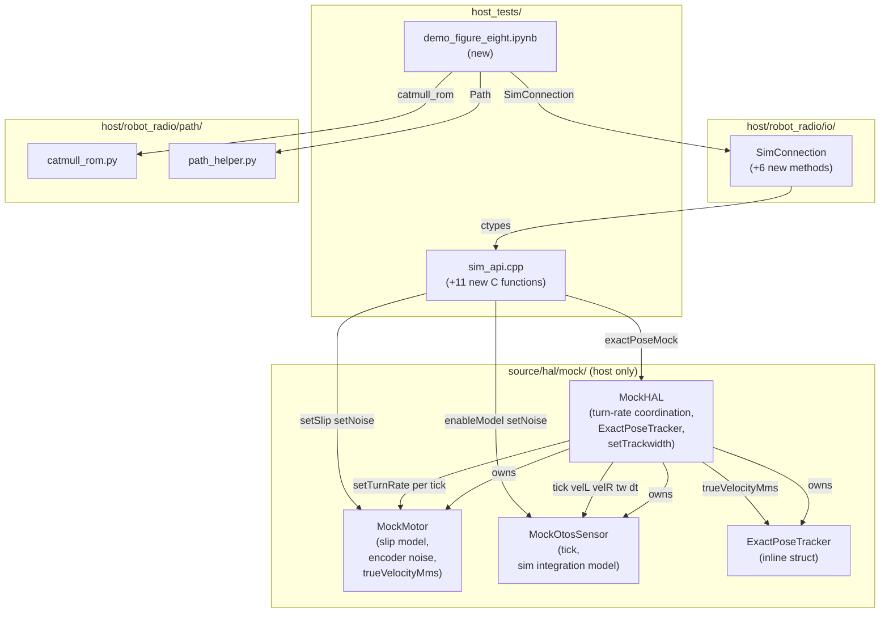
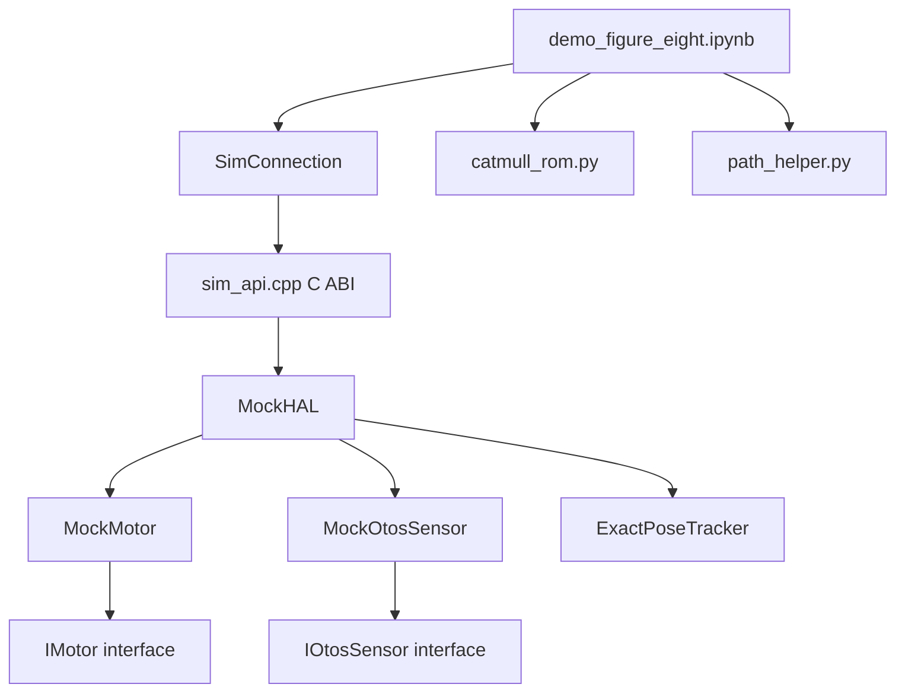
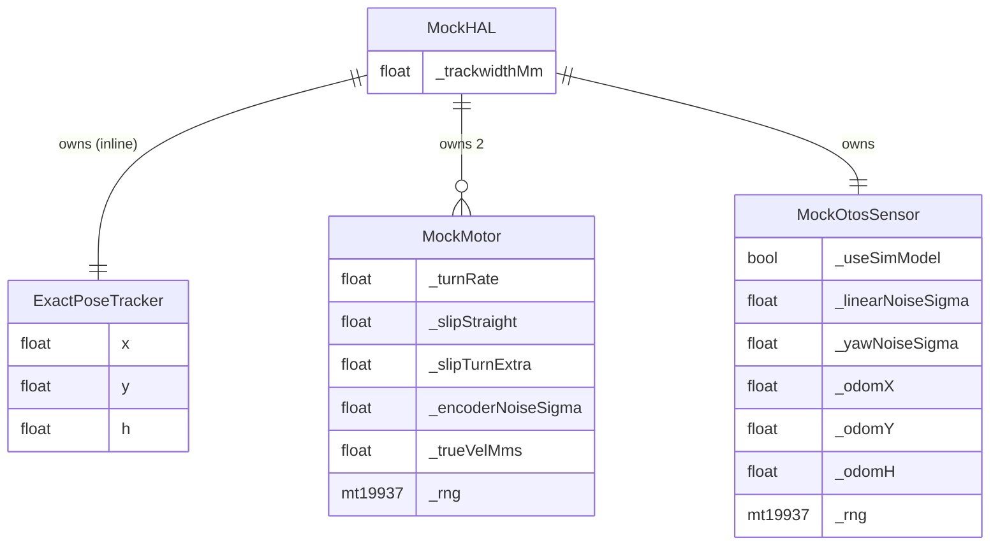

# Architecture Update — Sprint 021: Mock Hardware Noise Model and Figure-Eight Demo

## What Changed

Sprint 021 adds a realistic error model to the host-side mock hardware layer and
delivers a figure-eight demonstration notebook that exercises three sensor-fusion
regimes against that error model.

**Part A — C++ mock hardware noise model**

1. **`MockMotor`** (`source/hal/mock/MockMotor.h/.cpp`) — gains slip and Gaussian
   encoder noise. New private fields: `_turnRate`, `_slipStraight`, `_slipTurnExtra`,
   `_encoderNoiseSigma`, `_trueVelMms`, and a per-object `std::mt19937` RNG seeded at
   a fixed constant. New methods: `setSlip()`, `setEncoderNoise()`, `setTurnRate()`,
   `trueVelocityMms()`. The no-op `setNoiseMms()` stub is removed. `tick()` stores the
   pre-slip velocity in `_trueVelMms`, applies the slip fraction, draws Gaussian noise,
   and accumulates into `_encoderMm`. The `kNominalMaxMms` constant and all existing
   `IMotor` interface methods are unchanged.

2. **`MockHAL`** (`source/hal/mock/MockHAL.h/.cpp`) — gains an inline `ExactPoseTracker`
   struct and a `_trackwidthMm` field. `ExactPoseTracker` holds `{float x, y, h}` and
   implements `update(velLMms, velRMms, trackwidthMm, dt_ms)` using midpoint kinematics
   identical to `Odometry::predict`. `tick(now_ms)` is extended to: (a) compute turn rate
   from current motor commands, (b) feed turn rate to each motor before `motor.tick()`,
   (c) update `_exactPose` from `trueVelocityMms()`, and (d) call `_otos.tick()`.
   New accessors: `exactPoseMock()`, `setTrackwidth()`.

3. **`MockOtosSensor`** (`source/hal/mock/MockOtosSensor.h/.cpp`) — gains a sim
   integration model. New private fields: `_useSimModel`, `_linearNoiseSigma`,
   `_yawNoiseSigma`, `_odomX/Y/H`, and a per-object `std::mt19937` RNG. New methods:
   `enableSimModel()`, `setLinearNoise()`, `setYawNoise()`, and `tick(velL, velR, tw,
   dt_ms)`. When `_useSimModel` is enabled, `readTransformed()` returns the accumulated
   noisy pose `_odomX/Y/H`. The existing `setInjectedPose()` path is unchanged and
   controls behaviour when the model is off.

4. **`sim_api.cpp`** (`host_tests/sim_api.cpp`) — eleven new `extern "C"` functions:
   `sim_get_exact_pose_x/y/h`, `sim_set_motor_slip`, `sim_set_encoder_noise`,
   `sim_enable_otos_model`, `sim_set_otos_linear_noise`, `sim_set_otos_yaw_noise`,
   `sim_get_otos_x/y/h`. The `SimHandle` constructor gains a call to
   `hal.setTrackwidth(cfg.trackwidthMm)` after `cfg` is built.

5. **`sim_conn.py`** (`host/robot_radio/io/sim_conn.py`) — six new methods on
   `SimConnection`: `get_exact_pose()`, `set_slip()`, `set_encoder_noise()`,
   `enable_otos_model()`, `set_otos_noise()`, `get_otos_pose()`. `_setup_types()` is
   extended to register the new C function signatures. `_snapshot()` is extended with
   `exact_pose_x/y/h` and `otos_x/y/h` fields.

**Part B — Demo notebook**

6. **`demo_figure_eight.ipynb`** (`host_tests/demo_figure_eight.ipynb`) — new notebook
   with seven cells. Cells 1-3 build the library, generate the path, and define helpers.
   Cells 4-6 run three experiments (dead reckoning, OTOS + camera, EKF fusion). Cell 7
   produces the comparison plot with RMS cross-track error.

---

## Why

The existing `MockMotor.tick()` integrates commanded speed into encoder mm with no noise
or slip. This means the simulated encoder dead-reckoning always matches the reference
path exactly. There is nothing for a Kalman filter to improve, making the sim useless for
sensor-fusion development. Adding encoder slip and Gaussian noise produces realistic
dead-reckoning drift (~1% per metre). Adding an OTOS drift model gives a second noisy
sensor that drifts independently. The `ExactPoseTracker` inside `MockHAL` provides a
noiseless oracle ("the camera"), enabling the three-way comparison that is the point of
the notebook demo.

---

## Module Definitions

### `MockMotor` (modified, `source/hal/mock/`)

**Purpose:** Simulate a motor with slip and Gaussian encoder noise for sensor-fusion
testing.

**Boundary (inside):** Slip model fields (`_turnRate`, `_slipStraight`, `_slipTurnExtra`),
Gaussian noise field (`_encoderNoiseSigma`), pre-slip velocity accessor
(`trueVelocityMms()`), per-object `std::mt19937` RNG. Extended `tick()` applies slip
before accumulating encoder. All existing `IMotor` interface methods unchanged.

**Boundary (outside):** Turn rate is set by `MockHAL` before `tick()` — MockMotor does
not cross-reference the other motor. No dependency on `<random>` outside `HOST_BUILD`
compilation units.

**Use cases:** SUC-001, SUC-002

---

### `ExactPoseTracker` (new inline struct, `source/hal/mock/MockHAL.h`)

**Purpose:** Accumulate the oracle ground-truth pose from pre-slip motor velocities.

**Boundary (inside):** Fields `{float x, y, h}`. `reset()`. `update(velLMms, velRMms,
trackwidthMm, dt_ms)` using midpoint integration identical to `Odometry::predict`.

**Boundary (outside):** Reads only `trueVelocityMms()` from MockMotor (pre-slip, no
noise). No dependency on any control-layer class.

**Use cases:** SUC-002

---

### `MockHAL` (modified, `source/hal/mock/`)

**Purpose:** Coordinate turn-rate computation, motor ticking, oracle pose accumulation,
and OTOS model ticking within the hardware simulation layer.

**Boundary (inside):** New fields `_exactPose` (ExactPoseTracker), `_trackwidthMm`.
Extended `tick()`: computes turn rate from cmd speeds, feeds `setTurnRate()` to each
motor, calls `motor.tick()`, updates `_exactPose`, calls `_otos.tick()`.
New accessors: `exactPoseMock()`, `setTrackwidth()`.

**Boundary (outside):** Does not reach into any control-layer class. Exposes the oracle
pose only through `exactPoseMock()`; the sim_api reads it through that accessor.

**Use cases:** SUC-001, SUC-002, SUC-003

---

### `MockOtosSensor` (modified, `source/hal/mock/`)

**Purpose:** Simulate an OTOS sensor with independent noisy integration, switchable from
injection mode to sim-driven mode.

**Boundary (inside):** Sim model flag (`_useSimModel`), noise fields
(`_linearNoiseSigma`, `_yawNoiseSigma`), accumulated pose (`_odomX/Y/H`), per-object
RNG. `tick()` integrates from true velocities with Gaussian noise. `readTransformed()`
returns `_odomX/Y/H` when sim model is on, injected pose otherwise.
`setInjectedPose()` also resets `_odomX/Y/H` so external resets still work.

**Boundary (outside):** Receives `(velL, velR, trackwidth, dt_ms)` from MockHAL — no
direct dependency on MockMotor. No `IMotor` include.

**Use cases:** SUC-003

---

### `sim_api.cpp` (modified, `host_tests/`)

**Purpose:** Expose noise model controls and oracle pose reads through the stable C ABI.

**Boundary (inside):** Eleven new `extern "C"` functions (exact pose read x3, motor slip
set, encoder noise set, OTOS model enable, OTOS noise set x2, OTOS pose read x3).
`SimHandle` constructor extended: `hal.setTrackwidth(cfg.trackwidthMm)`.

**Boundary (outside):** All new functions access MockHAL through `SimHandle::hal`.
No new C++ headers needed beyond those already included in sprint 020.

**Use cases:** SUC-001, SUC-002, SUC-003

---

### `SimConnection` (modified, `host/robot_radio/io/sim_conn.py`)

**Purpose:** Provide Python-level access to noise controls and oracle pose reads, matching
the existing SerialConnection-compatible interface pattern.

**Boundary (inside):** Six new methods: `get_exact_pose()`, `set_slip()`,
`set_encoder_noise()`, `enable_otos_model()`, `set_otos_noise()`, `get_otos_pose()`.
Extended `_setup_types()` and `_snapshot()`.

**Boundary (outside):** Communicates only through the C ABI. No import of C++ headers or
firmware internals.

**Use cases:** SUC-001, SUC-002, SUC-003, SUC-004, SUC-005

---

### `demo_figure_eight.ipynb` (new, `host_tests/`)

**Purpose:** Demonstrate Pure Pursuit path-following on a figure-eight and compare three
position-estimation regimes in the noise-enabled sim.

**Boundary (inside):** Seven cells:
- Cell 1: Build + imports. `make_sim()` helper configures slip, encoder noise, OTOS model.
- Cell 2: Catmull-rom figure-eight path through 9 control points; path plot.
- Cell 3: `pure_pursuit_vw(path, pos, yaw, lookahead, base_speed)` returning
  `(v_mms, omega_mrads)`. `EKF` class: `predict(v, omega, dt)`, `update(z, R)`.
- Cell 4: Experiment 1 — dead reckoning. Estimate from `get_state()["pose_x/y/h"]`;
  truth from `get_exact_pose()`.
- Cell 5: Experiment 2 — OTOS + delayed camera. Estimate from `get_otos_pose()`;
  camera fix every 30 cycles with 5-cycle delay via `set_otos_pose()`.
- Cell 6: Experiment 3 — EKF fusion. Predict from VW; update from OTOS; delayed camera
  update.
- Cell 7: Comparison plot — all three trajectories vs reference; RMS cross-track error
  table.

**Boundary (outside):** Uses `catmull_rom` from `host/robot_radio/path/catmull_rom.py`
and `Path` from `host/robot_radio/path/path_helper.py`. Does not modify any existing
module. Pure Pursuit is reimplemented inline (~10 lines) to output `(v_mms, omega_mrads)`
rather than reusing the existing `PurePursuitTracker` (which outputs normalized wheel
speeds).

**Use cases:** SUC-004, SUC-005

---

## Architecture Diagrams

### Component Diagram (Sprint 021 additions)

### Dependency Graph (new and modified nodes only)

No cycles. Dependency direction: notebook → Python bindings → C ABI → mock hardware →
HAL interfaces. No production firmware files are in the dependency graph.

### Entity-Relationship: noise model fields

---

## Impact on Existing Components

| Component | Change |
|-----------|--------|
| `source/hal/mock/MockMotor.h` | Add slip/noise fields, `setSlip()`, `setEncoderNoise()`, `setTurnRate()`, `trueVelocityMms()`, `_rng`; remove `setNoiseMms()` stub |
| `source/hal/mock/MockMotor.cpp` | Extended `tick()` with slip + Gaussian noise via `std::mt19937` + `std::normal_distribution<float>` |
| `source/hal/mock/MockHAL.h` | Add `ExactPoseTracker` struct definition; add `_exactPose`, `_trackwidthMm` fields; add `exactPoseMock()`, `setTrackwidth()` |
| `source/hal/mock/MockHAL.cpp` | Extended `tick()`: turn-rate computation, `setTurnRate()` calls, exact-pose update, OTOS `tick()` call |
| `source/hal/mock/MockOtosSensor.h` | Add `tick()`, `enableSimModel()`, `setLinearNoise()`, `setYawNoise()`, `_useSimModel`, `_odomX/Y/H`, `_rng`, noise fields |
| `source/hal/mock/MockOtosSensor.cpp` | Implement noisy `tick()`; update `readTransformed()` to branch on `_useSimModel`; update `setInjectedPose()` to reset `_odomX/Y/H` |
| `host_tests/sim_api.cpp` | Add 11 new `extern "C"` functions; extend `SimHandle` constructor with `setTrackwidth` call |
| `host/robot_radio/io/sim_conn.py` | Add 6 new methods; extend `_setup_types()` and `_snapshot()` |
| `host_tests/demo_figure_eight.ipynb` | New file — 7 cells |

Zero changes to real firmware files. `NezhaHAL`, `Robot`, `MotionController`,
`CommandProcessor` and all production source files are untouched.

---

## Migration Concerns

### `<random>` is host-only

`std::mt19937` and `std::normal_distribution<float>` are C++11 standard library
features not available on the nRF52 embedded toolchain. Both MockMotor and
MockOtosSensor include `<random>` only inside `HOST_BUILD`-guarded translation units.
The header declarations of the RNG members must also be guarded. The recommended approach:
include `<random>` only in the `.cpp` files (already `HOST_BUILD`-only) and declare the
RNG member in the header as `uint32_t _rngState[2]` with a `#ifdef HOST_BUILD`
reinterpretation, or simply wrap the member declaration with `#ifdef HOST_BUILD`.

### `setNoiseMms()` stub removal

The existing `MockMotor` has `void setNoiseMms(float) {}` as a no-op stub. Grep shows
no callers in the codebase. The programmer must confirm with a clean build that removing
it causes no compile errors before deleting it from the header.

### `SimHandle` constructor order

`hal.setTrackwidth(cfg.trackwidthMm)` must be called after both `hal` and `cfg` are
initialised. `SimHandle` member initialisation order is `hal`, then `cfg`, then `robot`.
The call must be placed in the `SimHandle` constructor body (not the initialiser list).

### MockOtosSensor `setInjectedPose` reset semantics

After this sprint, `setInjectedPose()` also resets `_odomX/Y/H`. The existing
`sim_set_otos_pose` C function (which calls `setInjectedPose`) can therefore be used to
reset the OTOS accumulator mid-sim — a useful property for Experiment 2 camera fixes.
Existing tests with the sim model disabled are unaffected (reset has no observable
effect when `_useSimModel` is false).

### `_snapshot()` extension

The `_snapshot()` dict gains six new keys (`exact_pose_x/y/h`, `otos_x/y/h`). The
`state_df()` DataFrame gains six new columns. No existing caller accesses these keys,
so backward compatibility is preserved.

---

## Design Rationale

### Decision: noise lives in C++, not Python

**Context:** The notebook needs to observe realistic sensor errors from the same code
paths the firmware uses.

**Alternatives considered:**
- Python noise wrappers post-processing `get_state()` returns — trivial to implement
  but incorrect: the firmware's Odometry already ran on clean encoder values; adding
  noise in Python afterwards does not affect the firmware's dead-reckoning.
- C++ noise in MockMotor/MockOtosSensor — noise enters through the same `collectEncoder`
  and `readTransformed` paths as real hardware noise.

**Why this choice:** Correctness. Sensor-fusion algorithms run inside firmware logic;
they can only be properly evaluated when noise enters the same code paths.

**Consequences:** C++ changes are more involved than Python wrappers. Host-only build
guards must be respected. Reward: notebook experiments are physically meaningful.

### Decision: ExactPoseTracker as an inline struct in MockHAL.h

**Context:** An oracle pose accumulator needs to live somewhere in the sim layer.

**Alternatives considered:**
- Separate `ExactPoseTracker.h/.cpp` — adds two files for a 15-line struct.
- Field on `sim_api.cpp` — leaks physics into the C ABI layer.
- Inline struct in `MockHAL.h` — keeps the struct co-located with the only class that
  updates it.

**Why this choice:** Cohesion. `ExactPoseTracker` only has meaning in the context of
`MockHAL::tick()`. Inlining it avoids an unnecessary compilation unit.

**Consequences:** The struct is not reusable outside `MockHAL`, which is acceptable for
a test-only utility.

### Decision: Pure Pursuit reimplemented inline in the notebook

**Context:** `host/robot_radio/controllers/` contains `PurePursuitTracker` but it
outputs normalised wheel speeds, not body-twist (v_mms, omega_mrads).

**Alternatives considered:**
- Wrap `PurePursuitTracker` and convert output — adds conversion logic that obscures
  the geometry from a pedagogical standpoint.
- Refactor `PurePursuitTracker` to output VW — out of sprint scope; modifies existing
  production code.
- Inline ~10-line reimplementation in Cell 3 — self-contained, educational.

**Why this choice:** The notebook is a teaching artifact. The inline implementation
shows the geometry directly. No existing code is modified.

**Consequences:** Two Pure Pursuit implementations exist. The notebook version is not
reusable; if VW-output Pure Pursuit is needed in production, a future sprint should
refactor `PurePursuitTracker`.

---

## Open Questions

1. **`<random>` header guard placement:** Whether to use `#ifdef HOST_BUILD` around the
   RNG member in the header, or use a `uint32_t[2]` opaque storage trick. The programmer
   should document the chosen approach in the implementation.

2. **Fixed RNG seed vs configurable seed:** A fixed constant seed is specified for
   reproducibility. A future sprint could add `sim_set_rng_seed()` if stochastic testing
   across multiple runs is needed.

3. **`readTransformed()` const constraint:** `IOtosSensor::readTransformed()` is declared
   `const`. MockOtosSensor's `_odomX/Y/H` accumulator must be updated by `tick()` (called
   before `readTransformed()`). Since `tick()` is non-const and called from MockHAL
   before reads, no `mutable` is needed — confirm this call order in the implementation.

4. **EKF implementation scope:** The EKF in Cell 3 is a pure-Python 3-state EKF with
   linear observation model. No non-linear extensions (UKF) are required for this sprint.
