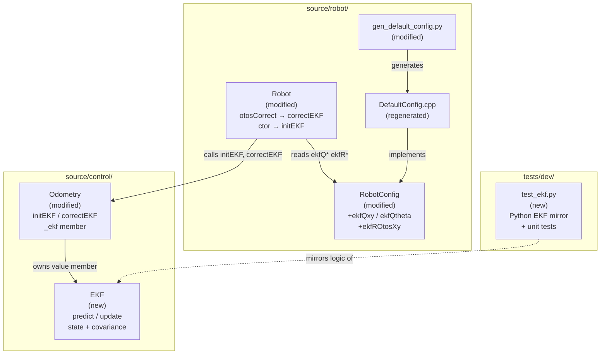
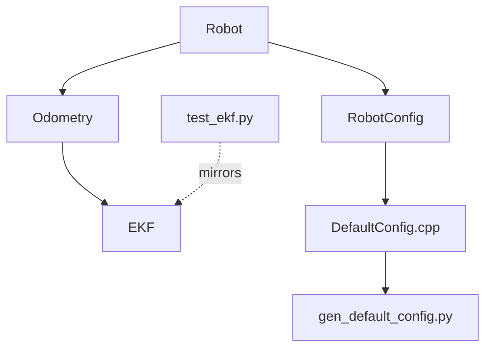
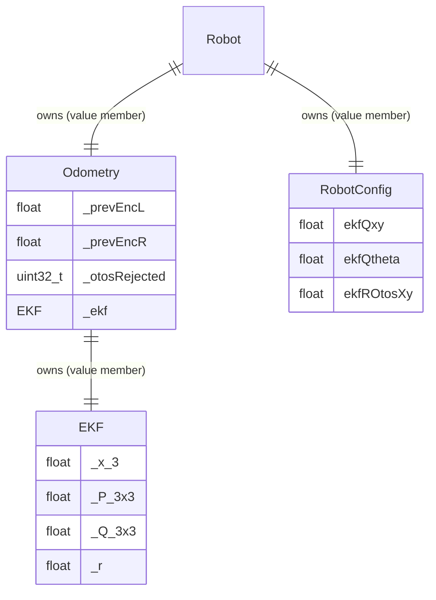

# Architecture Update — Sprint 022: EKF Pose Fusion in Firmware

## What Changed

Sprint 022 replaces the fixed-alpha complementary filter in the firmware pose
estimator with a 3-state Extended Kalman Filter. The change is localised to the
`source/control/` layer and the config pipeline.

1. **`EKF`** (new class, `source/control/EKF.h/.cpp`) — self-contained 3-state
   EKF: `x = [x_mm, y_mm, theta_rad]`. State vector `_x[3]`, covariance
   `_P[3][3]`, diagonal process noise `_Q[3][3]`, scalar OTOS measurement noise
   `_r`. Public methods: `init()`, `setPose()`, `predict()`, `update()`, `x()`,
   `y()`, `theta()`. All matrix operations unrolled as plain float arithmetic.
   `wrapPi` via `atan2f(sinf, cosf)`. No heap allocation, no external math
   library.

2. **`Odometry`** (modified, `source/control/Odometry.h/.cpp`) — gains an `EKF`
   value member `_ekf`. New methods: `initEKF(q_xy, q_theta, r_otos_xy)` (calls
   `_ekf.init()`), and `correctEKF(HardwareState&, x_otos, y_otos)` (calls
   `_ekf.update()`, writes state back to `HardwareState`). The existing
   `predict()` gains two lines after the midpoint integration: a call to
   `_ekf.predict()` and a write-back of EKF state to `s.poseX/Y/Hrad`.
   `setPose()` and `zero()` each gain an `_ekf.setPose()` call so the EKF
   tracks any pose reset. The existing `correct()` method is unchanged.

3. **`RobotConfig`** (modified, `source/types/Config.h`) — three new float
   fields after `otosGate`: `ekfQxy` (process noise, position mm²),
   `ekfQtheta` (process noise, heading rad²), `ekfROtosXy` (OTOS measurement
   noise, mm²).

4. **`gen_default_config.py`** (modified, `scripts/`) — EKF defaults added to
   the generated `.cpp` template: `ekfQxy = 2.0f`, `ekfQtheta = 0.005f`,
   `ekfROtosXy = 50.0f`. `DefaultConfig.cpp` is regenerated.

5. **`Robot`** (modified, `source/robot/Robot.cpp`) — `otosCorrect()` switches
   from `odometry.correct(…, alphaPos, alphaYaw, otosGate)` to
   `odometry.correctEKF(state.inputs, p.x, p.y)`. The constructor gains a call
   to `odometry.initEKF(config.ekfQxy, config.ekfQtheta, config.ekfROtosXy)`.

6. **`tests/dev/test_ekf.py`** (new, `tests/dev/`) — pure-Python mirror of the
   EKF class, with unit tests for predict mechanics, update mechanics,
   convergence, covariance growth/shrinkage, heading wrap, and `setPose` reset.
   Follows the pattern of `test_otos_fusion.py`.

---

## Why

The complementary filter uses a fixed blend gain (`alphaPos = 0.15`) regardless
of how much dead-reckoning error has accumulated since the last OTOS fix. The
EKF replaces this with an automatically scaled Kalman gain: when accumulated
error is high (P is large) the gain is larger; when P is small (recent fix) the
gain is smaller. The sprint 021 demo notebook established that a Python EKF
achieves ~19 mm RMS cross-track error vs ~32 mm for the complementary filter on
the same figure-eight path. Sprint 022 delivers that improvement inside the
firmware so the robot benefits from it during real driving without a host-side
EKF.

---

## Module Definitions

### `EKF` (new, `source/control/`)

**Purpose:** Implement a 3-state Extended Kalman Filter for differential-drive
pose estimation.

**Boundary (inside):** State vector `_x[3]`, covariance `_P[3][3]`, process
noise `_Q[3][3]`, OTOS noise scalar `_r`. All matrix operations unrolled as
float arithmetic. `predict()` applies the arc-segment Jacobian. `update()`
inverts the 2x2 innovation covariance analytically and computes the 3x2 Kalman
gain.

**Boundary (outside):** Takes dimensionless float inputs (`dCenter` in mm,
`dTheta` in rad, `x_otos/y_otos` in mm). Returns state via `x()`, `y()`,
`theta()` accessors. No HAL dependency, no I/O, no dynamic allocation.

**Use cases:** SUC-001, SUC-002, SUC-003

---

### `Odometry` (modified, `source/control/`)

**Purpose:** Differential-drive dead-reckoning pose tracker; now owns and drives
the EKF as its correction backend.

**Boundary (inside):** Gains `EKF _ekf` value member. Gains `initEKF()` (wires
noise params to EKF) and `correctEKF()` (EKF update + HardwareState write-back).
`predict()` extended: calls `_ekf.predict()` and writes EKF state back. All
existing methods (`correct()`, `getPose()`, `setPose()`, `zero()`, `update()`)
preserved; `setPose()`/`zero()` additionally call `_ekf.setPose()`.

**Boundary (outside):** `EKF` is a value member (no pointer, no heap). `Robot`
is the only caller of `initEKF()` and `correctEKF()`. Commandable interface
(OI/OZ/OR/OP/OV/OL/OA) is unchanged.

**Use cases:** SUC-001, SUC-002, SUC-003

---

### `RobotConfig` (modified, `source/types/`)

**Purpose:** Carry EKF noise tuning parameters from `DefaultConfig.cpp` (or
SET-command overrides) to `Robot::Robot()`.

**Boundary (inside):** Three new float fields: `ekfQxy`, `ekfQtheta`,
`ekfROtosXy`. No other change to struct layout.

**Boundary (outside):** `defaultRobotConfig()` supplies defaults; `Robot` reads
them in the constructor. SET command registry is not extended in this sprint.

**Use cases:** SUC-003

---

### `Robot` (modified, `source/robot/`)

**Purpose:** Wire EKF initialisation and switch the OTOS correction path from
complementary filter to EKF.

**Boundary (inside):** Constructor gains `odometry.initEKF(...)` call.
`otosCorrect()` replaces `odometry.correct()` with `odometry.correctEKF()`.
No other Robot methods change.

**Boundary (outside):** `alphaPos`, `alphaYaw`, `otosGate` remain in
`RobotConfig` for backward compatibility (used by `correct()` in existing tests);
they are simply not called in the new OTOS correction path.

**Use cases:** SUC-002, SUC-003

---

## Architecture Diagrams

### Component Diagram (Sprint 022 additions and modifications)

### Dependency Graph

No cycles. Dependency direction: `Robot` → `Odometry` → `EKF` (pure math leaf).
`RobotConfig` → `DefaultConfig.cpp` is a data flow, not a code dependency. No
production firmware component gains a new dependency on the test layer.

### Entity-Relationship: EKF state ownership

---

## Impact on Existing Components

| Component | Change |
|-----------|--------|
| `source/control/EKF.h` | New file |
| `source/control/EKF.cpp` | New file |
| `source/control/Odometry.h` | Add `#include "EKF.h"`, `EKF _ekf` member, `initEKF()`, `correctEKF()` declarations |
| `source/control/Odometry.cpp` | Extend `predict()` with EKF call and write-back; add `initEKF()`, `correctEKF()`; extend `setPose()` and `zero()` with `_ekf.setPose()` |
| `source/types/Config.h` | Add `ekfQxy`, `ekfQtheta`, `ekfROtosXy` to `RobotConfig` |
| `scripts/gen_default_config.py` | Add three EKF fields to generated template |
| `source/robot/DefaultConfig.cpp` | Regenerated — gains three EKF field assignments |
| `source/robot/Robot.cpp` | `otosCorrect()`: replace `odometry.correct()` with `odometry.correctEKF()`; constructor gains `odometry.initEKF()` call |
| `tests/dev/test_ekf.py` | New file |

Unchanged: `Robot.h`, `MotorController`, `MotionController`, `CommandProcessor`,
all HAL files, all mock hardware files, `NezhaHAL`, demo notebook. The legacy
`Odometry::correct()` method is preserved.

---

## Migration Concerns

### EKF value member and Odometry constructor

`EKF _ekf` is a plain value member of `Odometry`. The `EKF` class needs a
default constructor that puts the filter in a zeroed-but-not-initialised state.
`initEKF()` must be called before `predict()` or `update()` are used. The
`Robot` constructor is the correct place for `initEKF()` because `RobotConfig`
is available there. Unit tests that construct `Odometry` directly must also call
`initEKF()` (or bypass `correctEKF()` entirely, since existing tests only
exercise `correct()`).

### Predict write-back ordering

The new lines in `predict()` call `_ekf.predict(dCenter, dTheta, theta_before)`
where `theta_before = s.poseHrad - dTheta`. The subtraction must happen
**before** the existing midpoint integration writes `s.poseHrad`. The issue spec
clarifies this: `theta_before` is the pre-step heading, recovered as
`s.poseHrad - dTheta` after the integration. Programmers must verify the
ordering of lines in the modified `predict()` body.

### alphaPos/alphaYaw/otosGate remain in RobotConfig

These three fields stay in `RobotConfig` because `Odometry::correct()` is still
compiled and tested. They simply become unused in the live firmware path. A
follow-on sprint can remove them when `correct()` is retired.

### DefaultConfig.cpp is auto-generated

The programmer must run `python3 scripts/gen_default_config.py` after modifying
the script to regenerate `source/robot/DefaultConfig.cpp`. The file header warns
against hand-editing. This is a required step in T002; T003 and T004 depend on
the new fields being present.

### 2x2 matrix inversion

The update step inverts the 2x2 innovation covariance S analytically:
`det = S[0][0]*S[1][1] - S[0][1]*S[1][0]`. For the diagonal R and diagonal P
case, S is diagonal (`S[0][1] = S[1][0] = 0`), so det = S[0][0]*S[1][1] and
the inversion is trivially a reciprocal. The programmer should implement the
full analytic formula nonetheless (not just the diagonal shortcut) so it remains
correct if P becomes non-diagonal after non-axis-aligned motion.

---

## Design Rationale

### Decision: EKF as a value member of Odometry, not a separate subsystem

**Context:** The EKF runs at exactly the same cadence and with exactly the same
inputs as `Odometry::predict()` and `Odometry::correct()`.

**Alternatives considered:**
- Separate `EKFController` subsystem owned by `Robot` alongside `Odometry` —
  creates unnecessary coupling: EKF needs encoder deltas that are computed inside
  `Odometry::predict()`.
- Pointer member (heap allocated) — unnecessary on an embedded target with fixed
  data layout; adds an allocation failure mode.

**Why this choice:** Cohesion. The EKF and the odometry predict step change for
the same reasons (motion model changes). Encapsulating the EKF inside `Odometry`
keeps the predict/update cycle in one place and avoids exposing `dCenter/dTheta`
through a wider interface.

**Consequences:** Unit tests that construct `Odometry` directly must call
`initEKF()`; this is a small but explicit requirement documented in ticket
acceptance criteria.

### Decision: Heading not fused in the EKF update step

**Context:** The demo notebook proves ~19 mm RMS cross-track error using only
position observations. Fusing heading adds a scalar update (H becomes [0,0,1],
S is scalar) but was deliberately excluded from the sprint 021 EKF to keep the
experiment comparable.

**Alternatives considered:**
- Fuse heading in this sprint — straightforward math, but deviates from the
  validated demo configuration.
- Defer to follow-on — keeps this sprint exactly matching the demo EKF.

**Why this choice:** The demo is the source of truth for expected performance.
The firmware EKF should match the demo EKF before any extensions are added.

**Consequences:** `otosH` is stored in `state.inputs.otosH` for telemetry but
is not used by the EKF. A follow-on sprint adds it.

### Decision: All matrix operations unrolled, no external library

**Context:** The nRF52 embedded toolchain has no standard linear-algebra
library. The EKF is 3-state; all matrices are 3x3 or 3x2 at most.

**Alternatives considered:**
- Embed a small C matrix library — additional dependency, compile-time risk.
- Unrolled float arithmetic — readable for 3x3, zero dependencies.

**Why this choice:** The unrolled approach is verifiable by inspection against
the paper formulas and produces no code-size surprise. The alternative library
approach is warranted only at 5+ states.

**Consequences:** `EKF.cpp` contains explicit index arithmetic. Any state size
increase would require a full rewrite.

---

## Open Questions

1. **EKF default ctor vs `init()`:** Should `EKF::EKF()` zero the state and
   covariance, or leave them uninitialised until `init()` is called? The spec
   separates `init()` from the constructor. The programmer should decide and
   document which state is valid before `init()` is called (probably zero for
   safety on embedded targets).

2. **`theta_before` in predict:** The spec passes `theta_before = s.poseHrad -
   dTheta`. This works because `s.poseHrad` has already been updated by the
   existing midpoint integration by the time the EKF call is added. The
   programmer must verify line ordering in the modified `predict()` to ensure
   `theta_before` is computed correctly.

3. **initEKF call site:** The spec describes calling `odometry.initEKF()` from
   the `Robot` constructor. If `Robot::begin()` exists (it doesn't in the
   current source), the call could go there instead. With the current struct
   design, the constructor is the right place.
