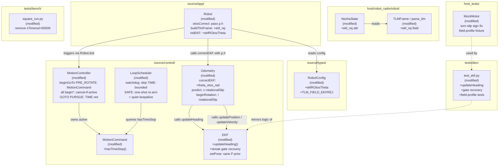
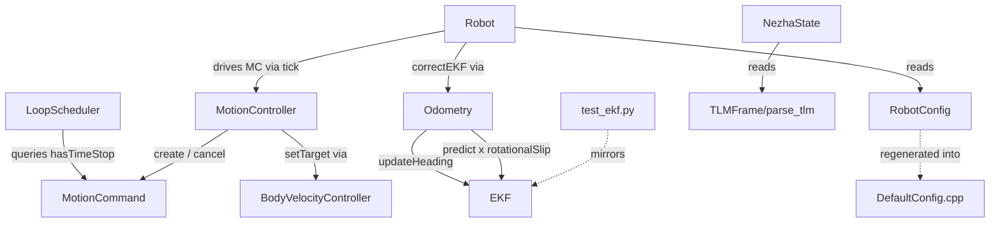
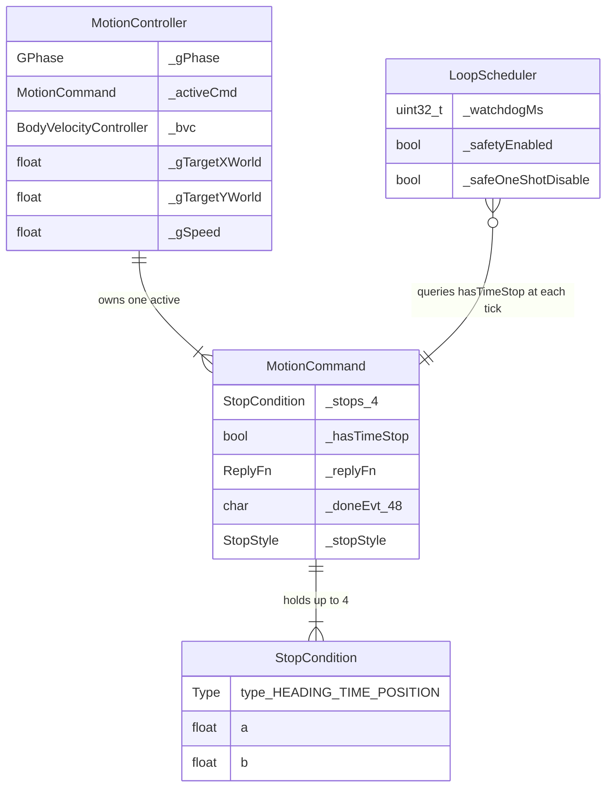

<!-- CLASI: Before changing code or making plans, review the SE process in CLAUDE.md -->

# Architecture Update — Sprint 024: Field-Safety and Heading-Truth Motion Fixes (P0)

## What Changed

Sprint 024 addresses the four interacting defects confirmed in the 2026-06-11
sim-to-real review that cause unbounded spins and inaccurate navigation on the
real playfield. The changes fall into two independent chains that are sequenced
within each chain.

**Motion-bounding chain (D5 → D7 → D4):**

1. `MotionController` — PRE_ROTATE phase of `beginGoTo()` is replaced with a
   proper supervised `MotionCommand` (HEADING + TIME stops). The instant full-speed
   BVC seeding is removed; the BVC ramps under `yawAccMax`. An overall TIME net is
   added to the PURSUE phase. This is the primary wild-spin fix (D5).

2. `MotionController` — `beginGoTo()` PRE_ROTATE, `beginTurn()`, `beginVelocity()`,
   and `beginArc()` all gain an explicit cancel-if-active guard: if a prior command
   is active when one of these entry points is called, `_activeCmd.cancel(HARD)` is
   called first so the cancellation is observable on the wire (D7).

3. `LoopScheduler` + `MotionCommand` — the watchdog gains a TIME-stop exemption:
   `MotionCommand::hasTimeStop()` is added; the watchdog skips keepalive-checking for
   commands that carry at least one TIME stop. `SAFE off` becomes a one-shot action:
   safety auto-re-arms when any new motion command begins, with `EVT safety re-armed`
   emitted. The `+` keepalive reply is suppressed (quiet). The `sTimeout=60000`
   override is removed from `tests/bench/square_run.py` and all test fixtures (D4).

**EKF heading-fusion chain (D1 → D3 → D2):**

4. `EKF` — new `updateHeading(float theta_meas, float r_theta)` method: scalar
   update, H = [0,0,1,0,0], wrap-safe innovation, χ²(1) gate at 3.84. `setPose()`
   is changed to set a sane diagonal prior (≈100 mm², 100 mm², (5°)², velocity
   variances preserved) instead of zeroing P. `RobotConfig` gains `ekfROtosTheta`.
   `Odometry::correctEKF()` gains a `theta_otos_rad` parameter and calls
   `updateHeading` between the position and velocity updates. `Robot::otosCorrect()`
   passes `p.h` through to `correctEKF()`. The Python EKF mirror (`tests/dev/test_ekf.py`)
   must be extended to match (D1).

5. `EKF` — consecutive-rejection counters are added to `updatePosition` and
   `updateHeading`. After N=10 consecutive rejections, the effective R is inflated
   (R×10) for one update and the streak resets, converting "permanently lost" to
   "recovers within ~1 s". `ekf_rej` (cumulative count) is added to the TLM frame
   and parsed in the Python protocol layer (D3).

6. `Odometry` — `predict()` applies `cfg.rotationalSlip` to raw encoder dθ, clamped
   to [0.5, 1.0] with 0/unset treated as 1.0. `beginRotation()` (RT) divides the
   wheel-arc target by `rotationalSlip`. `MockMotor`'s turn-slip sign is corrected
   so the "field profile" sim fixture reproduces encoder over-report (scrub). Dead
   `turnScale`/`distScale` fields are resolved (wired or removed) (D2).

---

## Why

The four defects are the confirmed root causes of field failures documented in the
2026-06-11 sim-to-real review and the wild-spin forensics report:

- **D5** is the direct cause of unbounded spins: no stop conditions on PRE_ROTATE.
- **D7** compounds D5: a stale prior MotionCommand can fire the wrong EVT label.
- **D4** demoted the watchdog from motion supervisor to dead-process detector; the
  keepalive daemon now bypasses the only remaining motion bound when D5/D7 are
  not fixed.
- **D1** is the cause of "gets turned around and drives into the boards": heading is
  pure encoder integration, never corrected by the OTOS heading it reads every 100 ms.
- **D3** turns D1's drift into permanent OTOS blackout once the gate threshold is
  crossed.
- **D2** causes every in-place turn to physically under-rotate ~26% relative to the
  commanded angle; the calibrated `rotationalSlip = 0.74` is defined but dead.

The sequencing constraint (D5→D7→D4) is critical: D4's keepalive-exemption is only
safe once every motion phase is self-bounded. Relaxing the watchdog before D5/D7 land
would leave the unbounded PRE_ROTATE spin with zero backstop even with safety
nominally ON.

---

## Module Definitions

### `MotionController` (modified, `source/control/MotionController.cpp/.h`)

**Purpose:** Advance motion-phase state machines with explicit stop conditions on
every phase.

**Boundary (inside):** `beginGoTo()` PRE_ROTATE branch: replace raw BVC seed with
`_activeCmd.configure(0.0f, omega, &_bvc)`, add `makeHeadingStop(bearing_delta,
gateRad)` and `makeTimeStop(2×nominal + 2000 ms)`, set reply-sink and done EVT, and
call `_activeCmd.start()`. Remove `_bvc.seedCurrent(0.0f, omega)` and
`_bvc.setTarget(0.0f, omega)`. PURSUE branch: `addStop(makeTimeStop(2 × (distance /
speed) × 1000 + 4000 ms))`. Entry points `beginGoTo()`, `beginTurn()`,
`beginVelocity()`, `beginArc()`: add `if (_activeCmd.active()) _activeCmd.cancel(HARD)`
before `configure()`.

**Boundary (outside):** `Robot` calls `beginGoTo()`, `beginTurn()`, etc. via the
same public interface unchanged. No new public methods. `MotionCommand`,
`StopCondition`, and `BodyVelocityController` interfaces are unchanged except for
the cancel path already present.

**Use cases:** SUC-001, SUC-002

---

### `MotionCommand` (modified, `source/control/MotionCommand.h/.cpp`)

**Purpose:** Carry stop conditions and report whether a TIME net is present so
the watchdog can distinguish bounded from open-ended commands.

**Boundary (inside):** Add `hasTimeStop() const → bool` — returns true if any stop
in `_stops[]` has type `TIME`. Single new accessor; all existing methods unchanged.

**Boundary (outside):** `LoopScheduler` calls `_activeCmd.hasTimeStop()` to decide
whether to arm the keepalive watchdog for the active command. `MotionController` uses
the existing `cancel()`, `configure()`, `addStop()` interface unchanged.

**Use cases:** SUC-001, SUC-002, SUC-003

---

### `LoopScheduler` (modified, `source/control/LoopScheduler.cpp`)

**Purpose:** Distinguish link-loss detection (open-ended streaming) from
motion-supervision (self-terminating commands).

**Boundary (inside):** Watchdog arm condition: skip keepalive check when
`_activeCmd.hasTimeStop()` is true. `SAFE off` semantics: set a "one-shot disable"
flag; when a new motion command begins, re-arm `safetyEnabled = true` and emit
`EVT safety re-armed`. Suppress `OK keepalive` reply from `handleKeepalive`.

**Boundary (outside):** The watchdog still fires `EVT safety_stop` for S/VW/R
open-ended commands on host silence. No change to the fire path itself. `sTimeoutMs`
default (500 ms) is unchanged. The `sTimeout=60000` override is removed from host
code and test fixtures (not a firmware change).

**Use cases:** SUC-003

---

### `EKF` (modified, `source/control/EKF.h/.cpp`)

**Purpose:** Fuse OTOS heading into the 5-state EKF so heading is closed-loop; add
gate-recovery to prevent permanent divergence.

**Boundary (inside):** New method `updateHeading(float theta_meas, float r_theta)`:
scalar update, H = [0,0,1,0,0], wrap-safe innovation `y = wrapPi(theta_meas -
_x[2])`, χ²(1) gate at 3.84. Per-method consecutive-rejection streak counters
(`_rejPos_streak`, `_rejHead_streak`); after 10 consecutive rejections, R is scaled
×10 for that update and the streak resets. Cumulative `_rejected` counter continues
for TLM. `setPose()`: set diagonal P prior (100 mm², 100 mm², (5°)² in rad²,
velocity variances) instead of zeroing P. `RobotConfig` gains `ekfROtosTheta` float
field.

**Boundary (outside):** `updatePosition()` and `updateVelocity()` signatures
unchanged. `Odometry` calls the new `updateHeading()`. No HAL dependency; no I/O;
no dynamic allocation.

**Use cases:** SUC-002, SUC-004

---

### `Odometry` (modified, `source/control/Odometry.h/.cpp`)

**Purpose:** Pass OTOS heading to the EKF; apply rotational-slip correction to the
encoder dθ prediction; compensate RT wheel-arc target for slip.

**Boundary (inside):** `correctEKF()` gains `float theta_otos_rad` parameter; calls
`_ekf.updateHeading(theta_otos_rad, cfg.ekfROtosTheta)` between `updatePosition` and
`updateVelocity`. `predict()`: `dTheta = ((dR - dL) / trackwidthMm) *
clamp(cfg.rotationalSlip, 0.5f, 1.0f)` where 0/unset → 1.0. `beginRotation()` (RT)
target arc divided by `clamp(cfg.rotationalSlip, 0.5f, 1.0f)`.

**Boundary (outside):** `Robot::otosCorrect()` passes `p.h` (already in hand) as
the new argument. `initEKF()` passes `cfg.ekfROtosTheta` alongside existing noise
params. No other callers of `correctEKF()` or `beginRotation()`.

**Use cases:** SUC-002, SUC-004, SUC-005

---

### `Robot` (modified, `source/robot/Robot.cpp`)

**Purpose:** Wire the OTOS heading read-through to EKF correction and the `ekf_rej`
TLM field.

**Boundary (inside):** `otosCorrect()`: pass `p.h` (already stored in
`state.inputs.otosH`) as the new `theta_otos_rad` argument to
`odometry.correctEKF()`. `buildTlmFrame()`: append `ekf_rej=<n>` when
`TLM_FIELD_EKFREJ` is set in `config.tlmFields`. `STREAM fields=` parser: recognise
`ekf_rej` token. Constructor `initEKF()` call: pass `cfg.ekfROtosTheta`.

**Boundary (outside):** No new public methods on `Robot`. `CommandProcessor` and all
callers unchanged.

**Use cases:** SUC-002, SUC-003, SUC-004

---

### `RobotConfig` (modified, `source/types/Config.h`)

**Purpose:** Carry the new `ekfROtosTheta` noise parameter and `ekf_rej` TLM bitmask.

**Boundary (inside):** One new float field `ekfROtosTheta` after existing EKF noise
fields. New bitmask `TLM_FIELD_EKFREJ = (1u << 6)`. Registered in
`ConfigRegistry.cpp` as SET-accessible. Added to `tovez.json`; `DefaultConfig.cpp`
regenerated via `gen_default_config.py`.

**Boundary (outside):** All existing fields and factory unchanged. Default value
≈ 0.01 rad² ≈ (5.7°)².

**Use cases:** SUC-002, SUC-004

---

### `MockMotor` + sim field-profile fixture (modified, `host_tests/`)

**Purpose:** Make the sim "field profile" reproduce the field failure direction
(encoder over-report on turns).

**Boundary (inside):** `MockMotor` turn-slip sign corrected so encoder velocity >
body rotation (scrub model). Field-profile fixture sets `slipTurnExtra ≈ 0.26` and
`fuseOtos = true`; all new motion-control regression tests run in both exact and
field profiles.

**Boundary (outside):** Existing exact-profile tests (default slip=0) are unaffected.
Field-profile fixture is additive.

**Use cases:** SUC-001, SUC-002, SUC-003, SUC-004, SUC-005

---

### `protocol.py` + `NezhaState` (modified, `host/robot_radio/robot/`)

**Purpose:** Parse `ekf_rej=<n>` from the TLM stream so host code can observe
filter divergence.

**Boundary (inside):** `TLMFrame` gains `ekf_rej: int | None = None`. `parse_tlm()`
adds an `ekf_rej` key-value case. `NezhaState` exposes `ekf_rej` attribute.

**Boundary (outside):** All existing `TLMFrame` fields and parse behavior unchanged.

**Use cases:** SUC-004

---

### `tests/dev/test_ekf.py` (modified)

**Purpose:** Keep the Python EKF mirror in lockstep with firmware EKF after D1/D3
changes.

**Boundary (inside):** Add `updateHeading(theta_meas, r_theta)` to the Python EKF
class with wrap-safe innovation and χ²(1) gate. Add consecutive-rejection counters
and R-inflation recovery logic. Add `setPose` sane-prior behaviour. New test classes:
`TestUpdateHeading`, `TestHeadingGateRecovery`, `TestSetPosePrior`. Field-profile
test fixture added to `TestSquareFigureEight`.

**Boundary (outside):** Existing test classes unchanged.

**Use cases:** SUC-002, SUC-004

---

## Architecture Diagrams

### Component Diagram (Sprint 024 changes)

### Dependency Graph (sprint-024 additions, no new cycles)

No cycles introduced. Dependency direction is preserved:
`Robot` (app) → `MotionController` (control) → `MotionCommand` (control, data).
`LoopScheduler` → `MotionCommand` is a lateral query within the control layer through
a shared reference; it introduces no new circular dependency.
`EKF` remains a pure-math leaf with no external dependencies.

### Entity-Relationship: PRE_ROTATE supervision model

---

## Impact on Existing Components

| Component | Change |
|-----------|--------|
| `source/control/MotionController.cpp` | PRE_ROTATE: supervised MotionCommand + cancel-if-active; PURSUE: TIME net; `beginTurn`/`Velocity`/`Arc`: cancel-if-active |
| `source/control/MotionCommand.h/.cpp` | Add `hasTimeStop() const → bool` |
| `source/control/LoopScheduler.cpp` | Watchdog: skip when `hasTimeStop()` true; SAFE one-shot; `+` quiet reply |
| `source/control/EKF.h/.cpp` | Add `updateHeading()`; streak gate-recovery counters; `setPose` sane P-prior |
| `source/control/Odometry.h/.cpp` | `correctEKF()` gains `theta_otos_rad`; `predict()` applies `rotationalSlip`; `beginRotation()` divides wheel-arc by `rotationalSlip` |
| `source/robot/Robot.cpp` | `otosCorrect()`: pass `p.h`; `buildTlmFrame()`: `ekf_rej`; `initEKF()`: `ekfROtosTheta` |
| `source/types/Config.h` | Add `ekfROtosTheta`; add `TLM_FIELD_EKFREJ` |
| `source/robot/ConfigRegistry.cpp` | Register `ekfROtosTheta` as SET-accessible |
| `data/robots/tovez.json` | Add `ekfROtosTheta`; verify `rotationalSlip = 0.74` |
| `source/robot/DefaultConfig.cpp` | Regenerated by `scripts/gen_default_config.py` |
| `host/robot_radio/robot/protocol.py` | Add `ekf_rej` to `TLMFrame`; extend `parse_tlm()` |
| `host/robot_radio/robot/nezha_state.py` | Add `ekf_rej` attribute |
| `tests/dev/test_ekf.py` | Add `updateHeading`, gate-recovery, P-prior tests; field-profile fixture |
| `host_tests/` (MockMotor) | Fix turn-slip sign; add field-profile fixture |
| `tests/bench/square_run.py` | Remove `sTimeout=60000` override |
| `tests/dev/safe_cmd_bench.py` | Update to SAFE one-shot semantics |

Unchanged: `DriveController` (refactored away in prior sprint), `MotorController`,
`RatioPidController`, `PathFollower`, `PoseProvider`, all HAL files, `OtosSensor`
(no code change in this sprint), `CommandProcessor`, `Announcer`, `main.cpp`,
sprint-023 host-side `RobotState`/`TLMFrame`/`NezhaState` additions (new field is
additive), all existing test files not listed above.

---

## Migration Concerns

### `correctEKF()` signature change

`Odometry::correctEKF()` gains `theta_otos_rad`. The only caller is
`Robot::otosCorrect()`, which already holds `p.h`. The host-test sim path does not
call `correctEKF()` directly. Risk: low.

### `EKF::setPose()` P-prior change

The current zero-P behaviour has been in production since sprint 014. Switching to a
sane prior will make the gate transiently broader after a `SI` pose injection, then
tighten as OTOS updates arrive. This is the correct behaviour; existing tests that
assert on P must be updated. The Python EKF mirror must match.

### `predict()` gains `rotationalSlip` term

With OTOS heading fused, the prediction bias matters less, but the prior must still
be reasonable for good covariance estimates. Existing exact-profile tests (default
slip=0) are unaffected because `clamp(0.0, 0.5, 1.0) → 0.5` — wait, the spec says
"treat 0/unset as 1.0" — so the clamp logic is: `val <= 0 ? 1.0 : clamp(val, 0.5,
1.0)`. Programmer must implement exactly this so old configs with `rotationalSlip = 0`
(or absent from JSON) do not suddenly apply a 0.5× factor. This is a migration risk
worth calling out explicitly.

### `MockMotor` turn-slip sign change

The corrected sign changes what the field-profile sim reproduces. Exact-profile tests
(slip=0) are unaffected. New field-profile tests will initially fail until D1/D2
fixes are in place — this is expected and desired.

### `hasTimeStop()` in `MotionCommand`

Additive read-only accessor. No side effects. All existing command flows unchanged.

### `sTimeout=60000` removal from bench script

Host-side change only. Firmware default (500 ms) takes effect. With D5/D7 TIME nets,
self-terminating commands are already exempt from the watchdog anyway. The keepalive
daemon must remain running for open-ended streaming segments.

---

## Design Rationale

### Decision: MotionCommand for PRE_ROTATE (not a raw timer or sub-phase FSM)

**Context:** PRE_ROTATE previously had no stop structure. Options were (a) add a raw
`_preRotateTimeoutMs` field checked in `driveAdvance`, (b) introduce a PRE_ROTATE
sub-phase FSM with its own timer, or (c) reuse the existing `MotionCommand`.

**Alternatives considered:** (a) simplest but duplicates stop-check logic outside
the one-path evaluator; (b) adds FSM state without benefit.

**Why this choice:** Every other bounded phase already uses `MotionCommand`. Reusing
it keeps a single stop-evaluation path, gives PRE_ROTATE the same HEADING + TIME
duality as `beginTurn`, and makes the two structurally identical — easy to audit.

**Consequences:** `driveAdvance()`'s top branch (ticks active command) now covers
PRE_ROTATE exactly as it covers TURN. The PRE_ROTATE→PURSUE transition becomes the
existing "command done → reconfigure" pattern.

### Decision: SAFE one-shot re-arm on new command

**Context:** `SAFE off` was historically used because self-terminating commands died
at the watchdog. With D4's TIME-stop exemption, `SAFE off` is no longer needed for
normal operation, but permanently banning it breaks intentional manual-drive streaming.

**Alternatives considered:** Hard-ban `SAFE off` entirely; keep legacy permanent semantics.

**Why this choice:** One-shot semantics preserve streaming use while guaranteeing the
next motion command re-arms protection. `EVT safety re-armed` makes the transition
observable for test assertions.

**Consequences:** `tests/dev/safe_cmd_bench.py` must be updated. Any test that issues
`SAFE off` then a motion command will see the re-arm EVT and must handle it.

### Decision: Consecutive-rejection R-inflation (not P-inflation, not unconditional accept)

**Context:** Gate recovery from "locked-out" state. Options: (a) inflate P after N
rejections (persistent covariance widening), (b) inflate R×10 for one update
(temporary gate widening), (c) accept unconditionally once.

**Alternatives considered:** (a) P-inflation persists and can allow noisy updates;
(c) can slam a large correction into the filter.

**Why this choice:** R×10 inflation for one update is a minimal, reversible perturbation.
It widens the effective gate for one step, allows partial convergence, then returns to
normal gating. Streak counters are per-update-type so position divergence cannot trigger
premature heading re-acquisition.

**Consequences:** After ~10 OTOS cycles (approximately 1 s at 100 ms cadence), one
"soft accept" occurs. If OTOS heading is still clean during position divergence,
heading fusion continues throughout, providing partial correction even before position
recovery.

### Decision: Rotational-slip in predict(), not in HEADING stop arithmetic

**Context:** With OTOS heading fused, the HEADING stop fires on fused `poseHrad` which
is largely driven by OTOS truth. Applying slip in the stop arithmetic would double-
correct when fusion is active.

**Why this choice:** Slip belongs in the measurement that slips — the encoder dθ
propagation in `predict()`. This improves the EKF prior and reduces correction
magnitude; it does not interfere with the fused heading that governs TURN stops.
`beginRotation()` (RT) stops on encoder arc directly so it separately needs the slip
compensation in its wheel-arc target.

**Consequences:** TURN accuracy is primarily delivered by D1. D2's isolated effect
is visible in RT accuracy and dead-reckoning quality between OTOS corrections.

---

## Open Questions

1. **`ekfROtosTheta` initial value:** 0.01 rad² ≈ (5.7°)² is a reasonable start
   based on OTOS heading spec (~1° RMS). If OTOS heading is noisier on carpet,
   0.04 rad² may be needed. Programmer should verify against field-profile sim.

2. **PRE_ROTATE TIME net nominal calculation:** formula requires `omega > 0`. The
   existing omega clamp guard must be confirmed to run before the TIME net calculation.

3. **`wrapPi` utility:** the inline `atan2f(sinf, cosf)` pattern used in `beginTurn`
   vs. `wrap_angle()` in `StopCondition.cpp`. Programmer must choose one and ensure
   the Python mirror matches.

4. **`turnScale` / `distScale` resolution:** wired or removed? Removal is preferred
   (cleaner). Team-lead should confirm before execution begins.

5. **`+` quiet keepalive layer:** firmware (`handleKeepalive` emits nothing) vs. host
   parser (filter `OK keepalive` lines). Firmware is cleaner but is a wire-protocol
   change. Confirm ownership before ticket execution.
