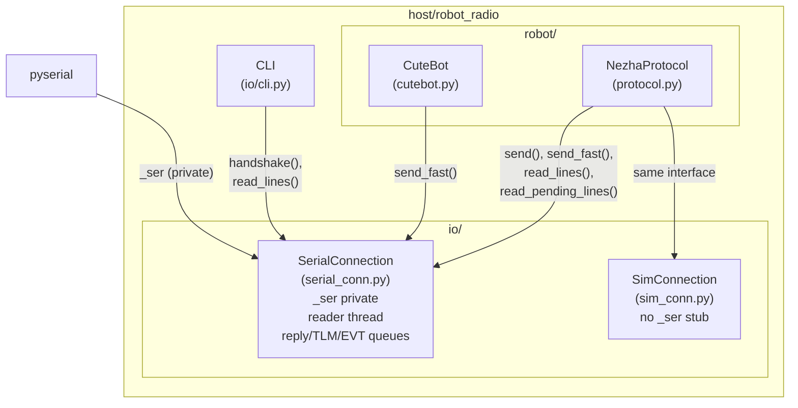
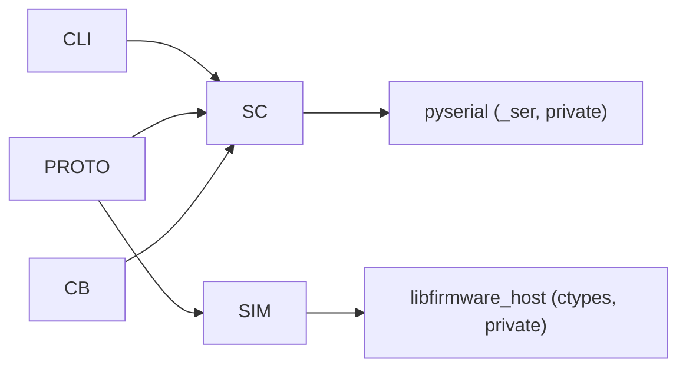
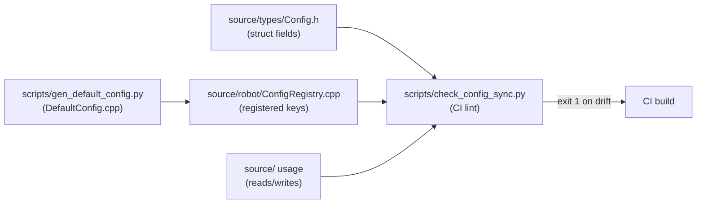

<!-- CLASI: Before changing code or making plans, review the SE process in CLAUDE.md -->

# Architecture Update -- Sprint 025: Trustworthy host I/O

## What Changed

### Step 1: Understand the Problem

Three independent host-side structural problems corrupt all observability:

1. **Buffer clearing (d11a)** — `SerialConnection.send()` calls
   `self._ser.reset_input_buffer()` before every write. Every SET/GET/SNAP
   that uses `send()` discards all buffered-but-unread bytes: in-flight TLM
   frames, async EVT done lines, EVT safety_stop events. This is the primary
   cause of "the stream keeps dying" and of `wait_for_evt_done()` blocking
   forever.

2. **Leaky transport boundary (a5)** — Four call sites bypass `SerialConnection`
   and reach the pyserial object directly:
   - `robot/protocol.py:269` — `ser = self._conn._ser` for a non-blocking
     drain (`in_waiting` peek + bulk `read`).
   - `io/cli.py:287–289` — raw `reset_input_buffer()` / `write(b"HELLO\n")` /
     `flush()` to probe the relay.
   - `robot/cutebot.py:93–94` — raw `_ser.write()` / `flush()` for
     `_send_and_wait_enc`.
   - `io/sim_conn.py:69` — `_ser = None` stub only because `protocol.py`
     reaches for `_conn._ser`.

   Even after d11a's reader thread lands, any of these reach-arounds
   reintroduces the same class of bug by bypassing the single reader.

3. **Config registry drift (a8)** — `Config.h` and `ConfigRegistry.cpp` are
   out of sync in both directions with no mechanical check:
   - Unregistered struct fields (`safetyEnabled`, `tlmFields`,
     `tlmSnapPending`) — exist in the struct but are unreachable via GET/SET.
   - Registered-but-unused keys (`turnScale`, `distScale`) — SET "works" but
     changes nothing.

### Step 2: Identify Responsibilities

This sprint introduces or changes three distinct responsibilities:

- **Stream demultiplexing** — a single background thread owns the serial read
  loop and routes lines to keyed queues (reply, TLM, EVT). Nothing else reads
  from the serial port.
- **Transport API surface** — `SerialConnection` exposes named methods for
  every operation callers actually need; `_ser` becomes truly private.
- **Config sync enforcement** — a CI script that cross-checks struct fields,
  registry entries, and firmware usage; resolves current offenders.

These responsibilities change independently and for different reasons, so they
are addressed in three tickets sequenced by dependency.

### Step 3: Define Subsystems and Modules

**`io/serial_conn.py` — SerialConnection (modified)**

Purpose: owns the physical serial port and all I/O on it.
Boundary: inside — `_ser`, read thread, write lock, send/receive queues;
outside — every caller above `io/` sees only named methods.
Use cases served: SUC-001 (stream demux), SUC-002 (transport seal).

New internal structure after d11a:

```
SerialConnection
  _ser              : serial.Serial        (private)
  _write_lock       : RLock                (private)
  _reader_thread    : Thread               (private)
  _reply_queues     : dict[corr_id, Queue] (private)
  _tlm_queue        : Queue                (private)
  _evt_queue        : Queue                (private)

  connect()         → dict            (unchanged public API)
  disconnect()      → dict            (unchanged public API)
  send()            → dict            (read from _reply_queues, not port)
  send_fast()       → None            (unchanged)
  read_lines()      → list[str]       (drain _tlm_queue + _evt_queue)
  read_pending_lines() → list[str]    (new: non-blocking drain, replaces _ser peek)
  handshake(line)   → None            (new: send a raw line without relay prefix)
  start_keepalive() → None            (unchanged)
  stop_keepalive()  → None            (unchanged)
```

The reader thread:
- Reads one line at a time from `_ser`.
- Classifies each line: `OK`/`ERR`/`CFG` with a corr-id → reply queue;
  `TLM` → `_tlm_queue`; `EVT` → `_evt_queue`; keepalive acks → dropped.
- `send()` blocks on the appropriate `_reply_queues[corr_id]` entry instead
  of calling `read_lines()` after writing.
- `read_lines()` drains `_tlm_queue` and `_evt_queue` without touching `_ser`.

**`io/sim_conn.py` — SimConnection (modified)**

Purpose: SerialConnection-compatible sim backend; no change to sim logic.
Boundary: inside — ctypes sim handle; outside — identical public API to
SerialConnection.
Change: remove the `_ser = None` stub (no longer needed once
`read_pending_lines()` exists as a named method).
Use cases served: SUC-002.

**`robot/protocol.py`, `io/cli.py`, `robot/cutebot.py` (modified)**

Each call site that currently reaches `_conn._ser` is converted to a named
`SerialConnection` method:

| File | Current reach | Replacement method |
|---|---|---|
| `protocol.py:269` | `_conn._ser.in_waiting` + bulk read | `_conn.read_pending_lines()` |
| `cli.py:287–289` | `reset_input_buffer()` + `write(b"HELLO\n")` + `flush()` | `_conn.handshake(b"HELLO\n")` |
| `cutebot.py:93–94` | `_conn._ser.write()` + `flush()` | `_conn.send_fast()` (already exists) |

**`scripts/check_config_sync.py` (new)**

Purpose: cross-checks three sets and reports drift between them.
Boundary: inside — parses `Config.h` (struct fields), `ConfigRegistry.cpp`
(registered keys), and `source/**` outside DefaultConfig/ConfigRegistry
(usage references); outside — exits non-zero on unresolved mismatch.
Use cases served: SUC-003.

### Step 4: Produce Diagrams

**Component diagram — after sprint 025**



**Dependency graph — io/ boundary**



No cycles. Dependency direction: callers (CLI, PROTO, CB) depend on the
interface (`SerialConnection` / `SimConnection`); concrete serial and sim
implementations depend only on their private transport libs.

**Config sync data flow**



### Step 5: Complete the Document

## Why

Every subsequent sprint's verification runs through the host I/O layer. Fixes
to firmware behavior, sim fidelity, and calibration are only trustworthy if
the host can receive every byte the firmware emits.

- `reset_input_buffer()` in `send()` was a first-order cause of silent data
  loss on every command burst during a drive. Replacing it with a reader
  thread means reply, TLM, and EVT lines are all preserved and routed to the
  right consumer regardless of what the main thread is doing.
- Sealing `_ser` removes four bypass points that would reintroduce the same
  class of bug even after the reader thread lands.
- The config lint closes the category of drift that caused D2
  (`rotationalSlip` calibrated but unread for months) and that A7 depends on.

## Impact on Existing Components

**SerialConnection** — internal rewrite of the read path; public method
signatures are unchanged except for two additions (`read_pending_lines()`,
`handshake()`). Callers that use only `send()`, `send_fast()`, `read_lines()`,
`connect()`, `disconnect()` see no change.

**_poll_ready** — currently calls `_ser.reset_input_buffer()` at the top of
each attempt loop (before the reader thread starts). This remains valid: the
reader thread is not running yet during the connection poll, so the direct
`_ser` access in `_poll_ready` is the only remaining intentional internal use.
The keepalive loop's `_ser.write()` is also a legitimate internal use inside
`SerialConnection` and is unaffected.

**NezhaProtocol.read_pending_lines()** — currently directly peeks
`_conn._ser.in_waiting`; replaced by `_conn.read_pending_lines()`. The
semantics (non-blocking drain) are identical.

**cli.py detect_device** — HELLO probe converted from raw `_ser` writes to
`conn.handshake(b"HELLO\n")`. Behavioral contract is unchanged; the method
clears nothing from the buffer.

**cutebot.py _send_and_wait_enc** — converted from raw `_ser.write()` to
`conn.send_fast()`. Behavioral contract is unchanged.

**SimConnection** — `_ser = None` stub removed; `read_pending_lines()` added
to match the SerialConnection interface (can return an empty list, as sim has
no in_waiting concept).

**CI** — one new grep check (a5) and one new Python lint step (a8) added to
the workflow. Both are host-only and fast.

**Firmware** — no changes.

## Migration Concerns

None. All changes are host-side Python. No protocol format changes, no
firmware changes, no data migration. The public API surface of
`SerialConnection` grows by two methods; no existing call is removed. Tests
that mock `SerialConnection` may need to add stubs for `read_pending_lines()`
and `handshake()` if they call code that now uses those methods.

### Step 6: Design Rationale

**Decision: single reader thread, queue-based demux**

Context: the stream is multi-type (reply, TLM, EVT) and is consumed by
multiple logical consumers (send() callers waiting for OK, wait_for_evt_done()
polling for EVT, bench tools draining TLM). The previous design had one input
buffer and multiple ad-hoc readers competing for it.

Alternatives considered:
- Callback-based dispatch on the reader thread. Rejected: requires callers to
  register callbacks before sending, which complicates send() and is
  harder to test.
- Separate threads per line type. Rejected: three threads sharing one serial
  port creates synchronization complexity with no benefit.
- Keep the single-buffer design but add coordination locks. Rejected: still
  loses data if reset_input_buffer() is called anywhere in the critical window.

Why queues: callers block on their queue entry; the reader thread is the sole
owner of `_ser.readline()`. This is a clean producer/consumer split — the
reader is never interrupted, callers never race.

Consequences: `send()` must include a corr-id in every command so the reader
can route the reply to the right queue. The firmware already supports `#<id>`
correlation; this sprint wires it up on the host side.

**Decision: handshake() instead of exposing reset_input_buffer()**

Context: cli.py's HELLO probe needs to flush stale bytes before sending HELLO
to the relay. After the reader thread starts, there is no safe way to call
reset_input_buffer() — it would discard bytes already consumed by the thread
or cause a race on _ser.

Why: once the reader thread is running, the input buffer should never be
cleared externally. The cli.py probe runs before the reader thread starts
(during device detection, before connect() returns). A `handshake(line)`
method that sends a raw line (no relay prefix) and returns immediately gives
the CLI what it needs without exposing the buffer-reset footgun.

### Step 7: Open Questions

1. **Corr-id assignment** — The current `send()` does not systematically
   assign corr-ids to commands. The reader thread needs a corr-id to route
   replies. The simplest approach is to assign a monotonically increasing id
   in `send()` and strip it from the wire when the reply arrives. Confirm
   with team-lead whether this is the intended approach or whether a single
   "pending reply" queue (with a mutex) is preferred for the first pass.

2. **TLM queue depth** — Bench tools consume TLM by calling `read_lines()`
   in a loop. If the reader thread fills the TLM queue faster than the
   consumer drains it (high stream rate + slow consumer), frames may be
   dropped at the queue boundary rather than the serial buffer. Suggest a
   bounded queue with a configurable depth (default 256 frames). Confirm
   acceptable drop policy: silently drop oldest vs. block vs. warn.

3. **handshake() clearing semantics** — The cli.py HELLO probe currently
   calls `reset_input_buffer()` before writing. After the reader thread
   design lands, the connection handshake runs before the reader starts, so
   `_poll_ready` can still call `reset_input_buffer()` internally. Confirm
   whether `handshake()` should also flush (pre-reader-start context only) or
   simply write the raw line.
