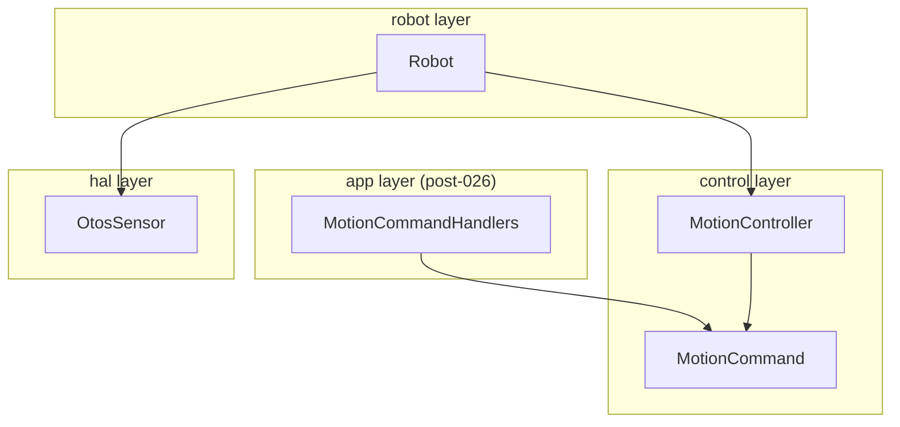

<!-- CLASI: Before changing code or making plans, review the SE process in CLAUDE.md -->

# Architecture Update — Sprint 027: Behavioral fixes on the single path

## What Changed

Sprint 027 makes three coordinated behavioral fixes to the firmware motion
pipeline and one firmware sensor fix, backed by a test-infrastructure update
and two host-side safety improvements. All changes plan against the
post-026 structure: `MotionCommandHandlers` (app layer), cleaned-up
`MotionController` (control layer, ≤ 900 lines, no protocol headers), and
the queue-wired sim running `LoopScheduler::tickOnce()`.

### 1. D6: `handleVW` no-stop-params guard (`MotionCommandHandlers`)

`handleVW`'s open-ended (no stop params) branch in
`source/app/MotionCommandHandlers.cpp` (post-026) currently calls
`activeCmd().setTarget(v, ω)` on any active MotionCommand. A `VW 0 0` or
`S 0 0` keepalive arriving during a TURN overwrites the TURN's ω and silently
corrupts heading.

**Change:** A `MotionCommand::Origin` enum is added to `MotionCommand`
(`source/control/MotionCommand.h`), set at `configure()` time (or via a
`setOrigin()` call from each `begin*()` entry point). The values are:
`VW, TURN, G, T, D, R, RT`. In `handleVW`'s no-stop-params branch (in
`MotionCommandHandlers`, post-026): only call `setTarget` when
`activeCmd().origin() == Origin::VW`. For any other origin: reset the
watchdog, reply `OK vw busy=<origin_name>`, do NOT call `setTarget`.

**Host-side:** `protocol.py` docstrings for `vw()` and `drive()` are updated
to remove the recommendation to send `VW`/`S` as keepalives for non-VW
commands; `+` is the correct keepalive for everything except active VW
sessions.

**Note on 026 churn:** In sprint 026, `handleVW` moves from
`source/control/MotionController.cpp` to `source/app/MotionCommandHandlers.cpp`.
The D6 fix touches the new location. If 026 has not landed, this ticket edits
`MotionController.cpp` instead. Flag for revalidation when 026 merges.

### 2. D8: Pursuit-law hardening (`MotionController`)

In `MotionController::driveAdvance()` → PURSUE per-tick hook
(`source/control/MotionController.cpp`, ~line 758):

**Curvature clamp:** Replace the unbounded `kappa = 2·dy/d²` with:
```
float kappaMax = 2.0f / fmaxf(d_remaining, 2.0f * cfg.arriveTolMm);
float kappa    = (d2 > 0.1f) ? fmaxf(-kappaMax, fminf(kappaMax, 2.0f*dy/d2)) : 0.0f;
```
This prevents ω from saturating the wheels into a tight orbit as d → 0.

**Re-gate counter:** Add a `uint8_t _pursueBacktrackTicks` field to
`MotionController`. Each PURSUE tick: if `fabsf(bearing) > π/2` increment
the counter; else clear it. When the counter reaches 3, cancel the PURSUE
MotionCommand and call the PRE_ROTATE setup path (the same code run at
`beginGoTo` time, inlined or refactored into a helper
`_startPreRotate(bearing, speed, now_ms, target)`). This re-uses the
supervised PRE_ROTATE MotionCommand from sprint 024, so the re-gate spin is
bounded by its TIME net.

**`arriveTolMm` widening:** `tovez.json` field `arriveTolMm` changed from
5 mm to 25 mm. `gen_default_config.py` is re-run to regenerate
`DefaultConfig.cpp`. No code change — the constant flows from config.

**Constants in `tovez.json`:** `arriveTolMm = 25.0` (was 5.0). The
deceleration cap formula `v_cap = sqrt(2 * aDecel * d_remaining)` already
ensures the robot ramps down to stop before the arrival disc; widening the
disc makes it reachable on carpet.

### 3. D9: OTOS validity gating (`OtosSensor`, `Robot::otosCorrect`)

**`OtosSensor` STATUS register read** (`source/hal/OtosSensor.h/.cpp`):

Add `REG_STATUS = 0x1F` to the register map (already noted in the header
comment). Add a public method:
```cpp
bool readStatus(uint8_t& statusOut) const;
```
that reads the single byte at `0x1F` and returns `true` on I2C success.
The status byte bit field (SparkFun OTOS): bits [1:0] = optical tracking
warn/fatal, bits [3:2] = IMU warn/fatal. Any non-zero value is treated as
invalid for this sprint (conservative; can be refined to bit-level later).

**`readXYH` I2C failure propagation** (`OtosSensor`): `readXYH` currently
leaves `x, y, h` at their previous values on I2C read failure with no error
signal. Change its signature to return `bool` (true = success). Update
`readTransformed` and `readVelocityTransformed` to check the return and
return a sentinel struct with a `valid = false` member, or propagate the
failure to the caller. The simplest path that avoids changing `IOtosSensor`'s
virtual interface: keep the existing return types but add an `_lastReadOk`
private bool on `OtosSensor` that `readXYH` sets, and expose it via
`bool lastReadOk() const`.

**`Robot::otosCorrect()` validity gating** (`source/robot/Robot.cpp`):

Before consuming `p` and `vel`, call `otos.readStatus(status)` and
`otos.lastReadOk()`. If status is non-zero or the I2C read failed, set
`state.inputs.otos.valid = false` and `return` without calling
`odometry.correctEKF`. Also clear `state.inputs.otosX/Y/H` to the last
known-good values (do not overwrite with potentially zero garbage).

**`EVT otos lost` emission** (`Robot::otosCorrect()`): Add a
`uint32_t _otosInvalidStartMs` and a `bool _otosLostEmitted` field to
`Robot`. When `otos.valid == false` and a MotionCommand is active, start
timing. After 500 ms continuous invalidity, emit `EVT otos lost\n` once
per activation cycle (reset `_otosLostEmitted` when OTOS becomes valid
again). The emission path reuses the existing `emitEvt` mechanism —
`LoopScheduler` currently calls `robot.otosCorrect()` at the slow OTOS
cadence; this is where the emission happens.

**Mounting-offset transform fix** (`OtosSensor::readTransformed`):
The current code subtracts `cfg.odomOffX` / `cfg.odomOffY` as
world-frame constants:
```cpp
// current (wrong for non-zero offsets):
xWorld -= cfg.odomOffX;
yWorld -= cfg.odomOffY;
```
The correct lever-arm transform rotates the body-frame offset by the current
heading before subtracting:
```cpp
float hRad = /* current heading from pose */;
xWorld -= cfg.odomOffX * cosf(hRad) - cfg.odomOffY * sinf(hRad);
yWorld -= cfg.odomOffX * sinf(hRad) + cfg.odomOffY * cosf(hRad);
```
Since `odomOffX = odomOffY = 0` in `tovez.json`, this change is dormant
for field use but eliminates a latent bug. The heading is not available
inside `OtosSensor::readTransformed` without a parameter; the fix is:
add a `float headingRad` parameter to `readTransformed` and
`readVelocityTransformed`, passed from `Robot::otosCorrect()` which already
holds `state.inputs.poseHrad`. The `IOtosSensor` virtual interface gains
the parameter; `MockOtosSensor` in `host_tests/` is updated to match
(the heading is ignored in the mock since offsets are zero in tests).

### 4. Field-profile CI gate (test infrastructure)

**Field profile parametrize** (`host_tests/conftest.py`):

Add a `sim_profiles` pytest fixture that yields two `Sim` instances, one
with default settings (exact profile) and one with `set_field_profile()`
applied (field profile). Motion-control test files that opt in to dual
profiling add `@pytest.mark.parametrize("sim", ["exact", "field"],
indirect=True)` or use a `parametrize_profiles` conftest helper. The
existing per-test `sim.set_field_profile()` calls (in `test_goto_bounds.py`,
`test_cancel_on_begin.py`) remain valid; they are the field-profile subset.
The dual-profile gate applies to `test_motion_controller.py`,
`test_goto_bounds.py`, and `test_cancel_on_begin.py` at minimum.

**Four incident scenario regression tests** (new file
`host_tests/test_incident_scenarios.py`):

| Test name | Scenario | Profile | Expected state before fix | After fix |
|---|---|---|---|---|
| `test_scenario_g_into_boards` | §4.1: G to a target with heading lie + wide arrival tolerance | field | pursuit orbits > 3 rev or TIME fires | converges ≤ 1.5 rev |
| `test_scenario_spin_on_placement` | §4.2: OTOS invalid mid-PRE_ROTATE, heading frozen | field | spins until TIME net (D5 bounds it) with garbage EKF input | D9 skips fusion; heading not poisoned |
| `test_scenario_turn_under_rotate` | §4.3: TURN with slip, no heading fusion | field | completes at ~67° physical | OTOS heading fusion corrects to ≥ 85° |
| `test_scenario_keepalive_kills_turn` | §4.4: TURN + mid-flight VW keepalive | queue-wired | TURN completes at wrong heading (TIME net) | TURN completes at commanded heading |

Tests `test_scenario_turn_under_rotate` and `test_scenario_g_into_boards`
exercise pre-existing sprint-024 fixes and should pass against current code;
they are regression guards. Tests `test_scenario_spin_on_placement` (D9)
and `test_scenario_keepalive_kills_turn` (D6) should fail before the sprint
fixes land and pass after; mark them `@pytest.mark.xfail(strict=True)` until
the fix ticket lands, then remove the mark.

**D6 xfail from 026-003** (`test_d6_cannot_stomp_turn`): This test is
promoted from `xfail` to passing in the ticket that implements the D6 fix.

### 5. Hardware smoke ritual (`tests/bench/smoke_ritual.py`)

New Python script in `tests/bench/`. Structure:

```
smoke_ritual.py
  preflight: liveness + SAFE query
  check_1: SAFE state = on
  check_2: TURN 9000 x4 → heading closure ≤ 10°
  check_3: G square (4 legs, 300 mm) → return-to-start error < 50 mm
  check_4: lift test → EVT otos lost received, no spin on placement
  check_5: TLM seq gap rate < 2% during motion
  → append results to docs/knowledge/field-log.md (date + SHA)
```

check_4 requires D9 (EVT otos lost) to have landed; smoke_ritual.py is
written and run as part of the same ticket that delivers D9.
check_5 uses TLM `seq` number if available; stubs gracefully if not (sprint
028 adds firmware seq numbers — for now, drop-rate is measured by counting
missed STREAM frames over a timed window).

### 6. Bench runaway safety wrapper (`tests/bench/bench_safety.py`)

New module `tests/bench/bench_safety.py` providing a `BenchRun` context
manager that wraps any bench drive program. Responsibilities:
- Wall-clock cap (default 60 s; opt-in longer with `max_seconds=N`).
- Runaway detection: full-tilt PWM with encoder delta < threshold for N
  consecutive TLM frames; or no-progress toward target (caller provides a
  `progress_fn`).
- Always-X: `finally` block sends `X` + `STREAM 0`.
- Preflight liveness: calls `ping_robot()` (or SNAP) before motion; raises
  `RobotSilentError` if no reply.
- Exit hook for `signal.SIGINT` (Ctrl-C) to trigger the `X` path.

All programs under `tests/bench/` and `tests/dev/` that drive the robot are
updated to use `BenchRun`.

### 7. SNAP TLM discrepancy investigation (field-024, open lead A)

The SNAP path and STREAM path share `buildTlmFrame()` but SNAP frames in the
field-024 log showed `enc=0`/`mode=IDLE` while the robot was spinning. The
investigation reads the SNAP handler and `buildTlmFrame()` to determine
whether the frame is built with the right state snapshot at SNAP time. If the
cause is a one-line bug (stale state reference, wrong field read), fix it
here. If it requires D10 firmware restructuring (seq numbers, idle rate), file
a 028 cross-reference and document the finding in the field-024 issue.

---

## Why

### D6 — silent navigation corruption

A `VW` keepalive mid-TURN overwrites the TURN's ω (line 1821 in current
`MotionController.cpp`). The HEADING stop can no longer fire; the TIME net
fires 2×nominal+2 s later and emits `EVT done TURN` at the wrong heading.
Scenario 4.4 from the sim2real review documents this as "agent doing it right"
but still getting a corrupt pose. The fix is structural: track command origin,
only re-target when the active command IS an open-ended VW session.

### D8 — orbit and board collisions

Unbounded `κ = 2·dy/d²` near the target and a 5 mm arrival disc that is
unreachable on carpet caused the "stops and pivots / hunting" transcripts and
is the direct mechanism of scenario 4.1 (G-into-boards). The curvature clamp,
re-gate, and tolerance widening together make G convergent under field conditions.

### D9 — spin on placement

The OTOS velocity update (v=0, ω=0) when the sensor is invalid sits inside
the χ² gate and actively drags fused velocity to zero, fighting the BVC.
During PRE_ROTATE the heading estimate diverges; the gate never closes; the
spin is bounded by the TIME net (sprint 024, D5) but that takes 2×nominal+2 s
of uncontrolled rotation. Skipping the EKF update when the STATUS register
says invalid prevents the heading poison at the source.

### Field-profile CI — "passes in sim" must mean something

The OTOS fusion is OFF by default and `MockMotor` slip is 0, so the exact
profile validates a system that does not exist on the field. Any fix verified
only in the exact profile is incomplete. Making the four incident scenarios
named regression tests in the field profile closes the "you didn't test it on
real code" gap.

### Smoke ritual + runaway wrapper — field regressions are caught immediately

Without a scripted post-flash check, the same failures recurred across
firmware flashes. The ritual catches the known failure modes in 5 minutes.
The runaway wrapper addresses the field-024 finding directly: the bench
program that declared "reached" and exited without sending X will be replaced
by programs wrapped in `BenchRun`.

---

## Module Definitions

### `MotionCommand` (modified, `source/control/MotionCommand.h/.cpp`)

**Purpose:** Track the origin of each motion command so the `handleVW` guard
can distinguish a VW session from a structured command.

**Boundary (inside):** New `enum class Origin { VW, TURN, G, T, D, R, RT }`
added to the class. New `setOrigin(Origin)` / `origin()` accessors. Each
`begin*()` call site in `MotionController` calls `_activeCmd.setOrigin(...)`.
`configure()` can set a default of `Origin::VW`; `begin*()` callers override.

**Boundary (outside):** `MotionCommandHandlers.cpp` (post-026) reads
`origin()` in `handleVW`'s no-stop-params branch. No other callers need
changes.

**Use cases:** SUC-003

---

### `MotionCommandHandlers` (modified, `source/app/MotionCommandHandlers.cpp`)

**Purpose:** Guard the `handleVW` no-stop-params branch against stomping
non-VW active commands.

**Boundary (inside):** In the no-stop-params branch, replace the
unconditional `activeCmd().setTarget(v, ω)` with a check:
`if activeCmd().origin() == Origin::VW → setTarget; else → watchdog-reset +
reply busy`. Reply format: `OK vw busy=<origin_name>` where `origin_name` is
a short ASCII string (`TURN`, `G`, `T`, `D`, `R`, `RT`).

**Boundary (outside):** `protocol.py` docstring is updated (host-side only;
no wire-protocol version change).

**Note on 026 churn:** If 026 has not merged, this change lands in
`source/control/MotionController.cpp` at the same line (1819–1821 in the
current file). The programmer must check which file is the active target and
flag it.

**Use cases:** SUC-003

---

### `MotionController` (modified, `source/control/MotionController.cpp`)

**Purpose:** Add pursuit-law curvature clamp, re-gate logic, and per-begin
origin tagging; remain protocol-free (post-026).

**Boundary (inside):**
- PURSUE per-tick hook (~line 758): curvature clamp formula; `_pursueBacktrackTicks`
  counter; re-gate path calling a new helper `_startPursue()` or reusing
  inline logic to reconfigure the PRE_ROTATE MotionCommand.
- Each `beginTurn`, `beginGoTo`, `beginTimed`, `beginDistance`, `beginRotation`,
  `beginVelocity`, `beginArc` calls `_activeCmd.setOrigin(Origin::X)`.
- New field: `uint8_t _pursueBacktrackTicks`.

**Boundary (outside):** No interface change; `begin*()` signatures unchanged.
The `arriveTolMm` value change flows from config (no code change here).

**Use cases:** SUC-002, SUC-005

---

### `OtosSensor` (modified, `source/hal/OtosSensor.h/.cpp`)

**Purpose:** Report sensor validity so `otosCorrect` can gate EKF updates.

**Boundary (inside):**
- New constant `REG_STATUS = 0x1F`.
- New public method `bool readStatus(uint8_t& out) const` — reads 0x1F via
  `readReg8`, returns true on I2C success.
- New private bool `_lastReadOk` set by `readXYH`; exposed via
  `bool lastReadOk() const`.
- `readTransformed` and `readVelocityTransformed` gain a `float headingRad`
  parameter for the lever-arm offset fix; default value `0.0f` keeps existing
  call sites (other than `Robot::otosCorrect`) working without changes.
- `IOtosSensor` virtual interface updated to match the new signatures.
  `MockOtosSensor` (or the sim's OTOS model in `sim_api.cpp`) is updated to
  accept the `headingRad` parameter and ignore it.

**Boundary (outside):** `Robot::otosCorrect()` passes `state.inputs.poseHrad`
as the heading argument.

**Use cases:** SUC-004, SUC-006

---

### `Robot` (modified, `source/robot/Robot.cpp`)

**Purpose:** Gate OTOS EKF fusion on sensor validity; emit `EVT otos lost`.

**Boundary (inside):**
- `otosCorrect()`: call `otos.readStatus()` and `otos.lastReadOk()` before
  calling `odometry.correctEKF()`; on invalid, set
  `state.inputs.otos.valid = false` and skip correction.
- New fields: `uint32_t _otosInvalidStartMs`, `bool _otosLostEmitted`.
- `EVT otos lost` emission after 500 ms of continuous invalidity during active
  motion; one-shot per invalidity cycle (reset when OTOS becomes valid again).
- Pass `state.inputs.poseHrad` to `otos.readTransformed()` for the lever-arm fix.

**Boundary (outside):** `LoopScheduler::tickOnce()` calls `robot.otosCorrect()`
at the slow OTOS cadence — unchanged. The new validity state is surfaced in
`state.inputs.otos.valid` which is already in `HardwareState`.

**Use cases:** SUC-004, SUC-006

---

### `tovez.json` + `DefaultConfig` (modified)

**Purpose:** Store `arriveTolMm = 25.0` so D8's tolerance widening is
config-driven.

**Boundary (inside):** `arriveTolMm` in `data/robots/tovez.json` changed from
5 to 25. `scripts/gen_default_config.py` re-run → `source/robot/DefaultConfig.cpp`
regenerated.

**Boundary (outside):** `MotionController::beginGoTo()` already reads
`_cfg.arriveTolMm`; no code change.

**Use cases:** SUC-002

---

### `test_incident_scenarios.py` (new, `host_tests/`)

**Purpose:** Named regression tests for the four §4 incident scenarios; fail
before the Dx fixes land, pass after.

**Boundary (inside):** Four test functions in the field profile. Two are
immediately passing (regressions for 024 fixes); two start as `xfail` and are
promoted when D6 and D9 land.

**Boundary (outside):** Uses the existing `sim` fixture from `conftest.py`.
Relies on `set_field_profile()` from `firmware.py`. Does not require any new
sim C-ABI; the OTOS-invalid scenario injects stale OTOS pose (same pattern as
`test_goto_bounds.py`'s frozen-heading test).

**Use cases:** SUC-001, SUC-002, SUC-003, SUC-004, SUC-005

---

### `conftest.py` (modified, `host_tests/conftest.py`)

**Purpose:** Make the dual-profile gate opt-in per test file without breaking
existing single-profile tests.

**Boundary (inside):** Add a `profile` parametrize marker or a
`sim_field_profile` fixture that wraps the default `sim` fixture and calls
`set_field_profile()` after creation. Tests that need both profiles add
`@pytest.mark.parametrize("sim", [exact_sim, field_sim], indirect=True)` or
import a `dual_profile_ids` helper. The existing `sim` fixture is unchanged;
opt-in is explicit per file.

**Use cases:** SUC-001

---

### `bench_safety.py` (new, `tests/bench/bench_safety.py`)

**Purpose:** Prevent bench programs from leaving the robot in an unsafe state
on any exit path.

**Boundary (inside):** `BenchRun` context manager. `preflight()` static
helper. `detect_runaway()` internal poll. `send_stop()` sends `X` + `STREAM 0`.
`signal.signal(SIGINT, ...)` handler registered on context entry.

**Boundary (outside):** All `tests/bench/` and `tests/dev/` drive programs
use `with BenchRun(robot, max_seconds=N) as bench:`. No firmware changes.

**Use cases:** SUC-007, SUC-008

---

### `smoke_ritual.py` (new, `tests/bench/smoke_ritual.py`)

**Purpose:** Scripted 5-minute hardware verification gate run before and after
every firmware flash.

**Boundary (inside):** Sequential checks: SAFE query, TURN×4, G square,
lift test, TLM drop rate. Logs to `docs/knowledge/field-log.md`. Uses
`BenchRun` internally. Reads git SHA via `subprocess.run(["git", "rev-parse",
"--short", "HEAD"])`.

**Boundary (outside):** Standalone script; no library exports. Depends on
`bench_safety.py` and the existing `rogo`/`protocol.py` robot API.

**Use cases:** SUC-006

---

## Architecture Diagrams

### Component Diagram (Sprint 027 changes, post-026 structure)

```mermaid
graph TD
    subgraph fw_app["source/app/ (post-026)"]
        MCH["MotionCommandHandlers\n(modified)\nhandleVW: checks Origin\nreply busy if not VW"]
    end
    subgraph fw_control["source/control/"]
        MC["MotionController\n(modified)\n+_pursueBacktrackTicks\nPURSUE: curvature clamp\nPURSUE: re-gate logic\nbegin*: setOrigin(X)"]
        MCmd["MotionCommand\n(modified)\n+Origin enum\n+setOrigin() / origin()"]
    end
    subgraph fw_hal["source/hal/"]
        OTOS["OtosSensor\n(modified)\n+readStatus()\n+lastReadOk()\n+REG_STATUS=0x1F\nreadTransformed(hdg)\nlever-arm fix"]
    end
    subgraph fw_robot["source/robot/"]
        Robot["Robot\n(modified)\notosCorrect:\n  readStatus gate\n  skip correctEKF if invalid\n  EVT otos lost @500ms\n+_otosInvalidStartMs\n+_otosLostEmitted"]
        DefaultConfig["DefaultConfig\n(regenerated)\narriveTolMm=25"]
    end
    subgraph host_tests["host_tests/"]
        Scenarios["test_incident_scenarios.py\n(new)\n4 scenario tests\n(2 xfail→pass)"]
        Conftest["conftest.py\n(modified)\nopt-in dual-profile fixture"]
        D6Gate["test_vw_converters.py\n(modified)\ntest_d6_cannot_stomp_turn\nxfail → passing"]
    end
    subgraph bench["tests/bench/"]
        Safety["bench_safety.py\n(new)\nBenchRun ctx mgr\npreflight, runaway-detect\nalways-X on exit"]
        Ritual["smoke_ritual.py\n(new)\n5-check hardware gate\nlogs to field-log.md"]
    end
    subgraph host["host/robot_radio/robot/"]
        Protocol["protocol.py\n(modified)\ndocstring fix:\nVW/S not for non-VW cmds"]
    end

    MCH -->|reads origin()| MCmd
    MC -->|setOrigin| MCmd
    MC -->|PURSUE hook| MC
    Robot -->|readStatus / lastReadOk| OTOS
    Robot -->|readTransformed(poseHrad)| OTOS
    Robot -->|correctEKF only if valid| Robot
    Scenarios -->|uses| Conftest
    D6Gate -->|now passing| MCH
    Ritual -->|uses| Safety
```

### Dependency Graph (sprint-027, behavioral layer)



No cycles. The Origin enum is owned by `MotionCommand` (control layer) and
read by `MotionCommandHandlers` (app layer) — the existing app → control
dependency direction.

---

## Impact on Existing Components

| Component | Change |
|-----------|--------|
| `source/control/MotionCommand.h/.cpp` | New `Origin` enum + accessors |
| `source/app/MotionCommandHandlers.cpp` (post-026) | `handleVW` no-stop-params guard; uses `Origin` |
| `source/control/MotionController.cpp` (pre-026 fallback) | Same guard in the current location if 026 not landed |
| `source/control/MotionController.cpp` | PURSUE curvature clamp + re-gate counter; `begin*` origin tagging |
| `source/hal/OtosSensor.h/.cpp` | `readStatus()`, `lastReadOk()`, `headingRad` parameter |
| `source/hal/IOtosSensor.h` | Virtual interface updated for new signatures |
| `source/robot/Robot.cpp` | `otosCorrect` validity gate + EVT otos lost |
| `data/robots/tovez.json` | `arriveTolMm = 25.0` |
| `source/robot/DefaultConfig.cpp` | Regenerated (not hand-edited) |
| `host_tests/conftest.py` | Opt-in dual-profile fixture |
| `host_tests/test_incident_scenarios.py` | New — four scenario tests |
| `host_tests/test_vw_converters.py` | `test_d6_cannot_stomp_turn` promoted from xfail to passing |
| `host/robot_radio/robot/protocol.py` | Docstring update only |
| `tests/bench/bench_safety.py` | New — `BenchRun` context manager |
| `tests/bench/smoke_ritual.py` | New — hardware smoke ritual |
| `docs/knowledge/field-log.md` | First entry written by smoke ritual |

Unchanged: `BodyVelocityController`, `Odometry`, `EKF`, `LoopScheduler`,
`CommandProcessor`, `CommandQueue`, `HaltController`, all existing
`host_tests/*.py` tests (no interface changes to sim C-ABI), `main.cpp`,
`sim_api.cpp` (except `MockOtosSensor` parameter addition, which is
backwards-compatible with a default heading=0).

---

## Migration Concerns

### `IOtosSensor` virtual interface change

Adding `float headingRad = 0.0f` as a defaulted parameter to
`readTransformed` and `readVelocityTransformed` is backward-compatible at the
call site (existing callers without the argument use 0.0). The `MockOtosSensor`
in `sim_api.cpp` must override the updated virtual; the override can ignore
`headingRad` since offsets are zero in all test configurations. Risk: low.

### `MotionCommand::Origin` — pre-026 vs. post-026 file location

The D6 fix in `handleVW` lives in `MotionCommandHandlers.cpp` post-026 and
in `MotionController.cpp` pre-026. Sprint 027 tickets should note which file
they target based on whether 026 has landed, and the programmer must check.
This is the primary 026-churn exposure for this sprint.

### `arriveTolMm` value change

Changing from 5 mm to 25 mm widens the arrival disc and may cause some
existing sim tests that rely on the exact 5 mm tolerance to see `EVT done G`
earlier. Tests in `test_goto_bounds.py` and `test_motion_controller.py`
should be reviewed; any test asserting a precise position at stop may need
its tolerance assertions updated. Risk: low — the stop condition only fires
when the robot is within the disc, so earlier-firing is the correct behavior
for field use.

### `bench_safety.py` adoption in existing bench programs

Existing scripts in `tests/bench/` and `tests/dev/` that call robot drive
functions directly must be wrapped in `BenchRun`. This is a refactor of
existing scripts, not a new dependency. Risk: low; the wrapper is additive.

### Clean build requirement

This sprint changes `OtosSensor.h` (adds method), `MotionCommand.h` (adds
enum), and `IOtosSensor.h` (virtual interface). Stale incremental builds will
not pick up header changes. All bench verification must be preceded by a
`--clean` build (documented in project memory `clean-build-before-bench`).

---

## Design Rationale

### Decision: `Origin` enum on `MotionCommand`, not a flag in `handleVW`

**Context:** The D6 guard needs to distinguish a VW session from a structured
command. Option A: track origin on `MotionCommand`. Option B: add a `bool
isVwSession` to `TargetState`. Option C: check whether the active command has
a HEADING or POSITION stop (implies it is not a raw VW session).

**Why Option A:** Option B leaks command-type semantics into `TargetState`
which is a mechanical state carrier. Option C is fragile — future commands
could be VW-like but with stops. Option A places the semantic tag where
the information originates (the `begin*()` call) and reads it where it is
needed (`handleVW`). Clear ownership, no cross-module inference.

**Consequences:** `MotionCommand` gains 4 bytes; all `begin*()` call sites
gain one `setOrigin()` call. Low churn.

### Decision: `_pursueBacktrackTicks` counter in `MotionController`, not a stop condition

**Context:** Re-gating from PURSUE to PRE_ROTATE when the target is behind
could be implemented as a new stop condition type (`BearingStop`) or as inline
logic in the PURSUE tick.

**Why inline:** A new stop condition would need to trigger a PRE_ROTATE
reconfigure rather than just stopping — it is not a terminal stop but a
transition. Stop conditions are terminal (they call `complete()`). The
re-gate is a within-G state transition, which already has precedent (the
PRE_ROTATE → PURSUE transition in `driveAdvance`). Keeping it inline in
`driveAdvance` mirrors the existing pattern without introducing a new
stop-condition type with non-terminal semantics.

**Consequences:** `MotionController` gains one counter field and one
conditional block in `driveAdvance`.

### Decision: `readStatus()` as a separate I2C call, not bundled with `readXYH`

**Context:** The STATUS register could be read in the same burst as position
data, or as a separate call before each `readTransformed`.

**Why separate:** The STATUS register is a single byte at 0x1F; the position
registers start at 0x20 (adjacent, but the status read is a separate I2C
transaction anyway since we need the result before deciding whether to proceed).
A bundled burst read that starts at 0x1F would need to skip one byte then
read six — non-standard multi-register layout. A separate `readReg8(0x1F)`
is two I2C transactions per `otosCorrect()` tick (100 ms cadence) — negligible
overhead. The STATUS check also needs to happen for the `EVT otos lost` logic
independent of position data.

**Consequences:** One extra I2C read per 100 ms OTOS cadence cycle.

### Decision: `arriveTolMm = 25 mm` as a config value, not computed

**Context:** The deceleration cap already ensures the BVC ramps down before
the stop fires. The question is what tolerance is achievable on carpet.

**Why 25 mm:** The improvement plan (P1.4) recommends 20–25 mm as
"realistic on carpet." 25 mm is the conservative end; it can be tightened
via config as hardware calibration improves. Keeping it in `tovez.json`
ensures it is not hard-coded and can be tuned per robot.

### Decision: `EVT otos lost` emitted in `Robot::otosCorrect()`, not in `MotionController`

**Context:** The invalidity detection sits in `otosCorrect()` (Robot layer).
`MotionController` could poll `state.inputs.otos.valid` and emit the EVT.

**Why in Robot:** `otosCorrect()` is the only place that reads STATUS and
sets `valid`. Emitting from Robot keeps the sensor-layer logic co-located.
`MotionController` should not need to know about sensor validity state — its
stop conditions already handle the mechanical consequences (D5 TIME net for
the spin). The EVT is informational, not a stop signal.

---

## Open Questions

1. **026 not yet landed:** The D6 fix targets `MotionCommandHandlers.cpp`
   (post-026 app layer). If sprint 026 has not merged when this sprint
   executes, the programmer must target `MotionController.cpp` at lines
   1819–1821 instead. The ticket must flag this explicitly and include a
   revalidation note for after 026 merges.

2. **SNAP TLM discrepancy (field-024 lead A):** The `enc=0`/`mode=IDLE`
   SNAP frame while spinning may require reading `buildTlmFrame()` carefully
   with and without active motion. If the fix requires D10 firmware changes
   (seq numbers, frame-building), it must be deferred to sprint 028. The
   programmer should investigate in the D9/field-024 ticket and make the
   call.

3. **`EVT otos lost` reply channel:** `Robot::otosCorrect()` does not have a
   `replyFn` / `corrId` context — it is called from `LoopScheduler::tickOnce()`
   without a command context. The EVT must be emitted to the last-active reply
   channel. The existing `emitEvt()` in `MotionController` uses
   `target.replyFn`; `Robot::otosCorrect()` may need to call through
   `MotionController` (e.g., `motionController.emitToActiveChannel(...)`) or
   emit directly via the `CommandProcessor`. Programmer to determine the
   lowest-churn path that does not create a new dependency from `Robot` on
   `CommandProcessor`.

4. **CI profile parametrize scope:** The dual-profile gate should apply to
   `test_motion_controller.py`, `test_goto_bounds.py`, and
   `test_cancel_on_begin.py` at minimum. Extending to all motion-control tests
   may increase CI time significantly. Programmer should run both profiles for
   the directly-affected tests and measure CI time before applying to all.

5. **`docs/knowledge/field-log.md` existence:** The file may not yet exist.
   `smoke_ritual.py` should create it if absent (with a header) before
   appending.
