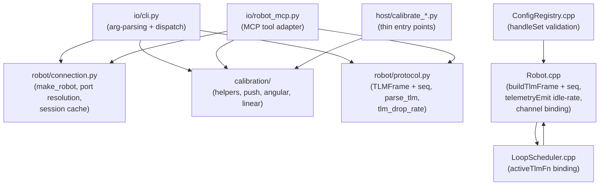
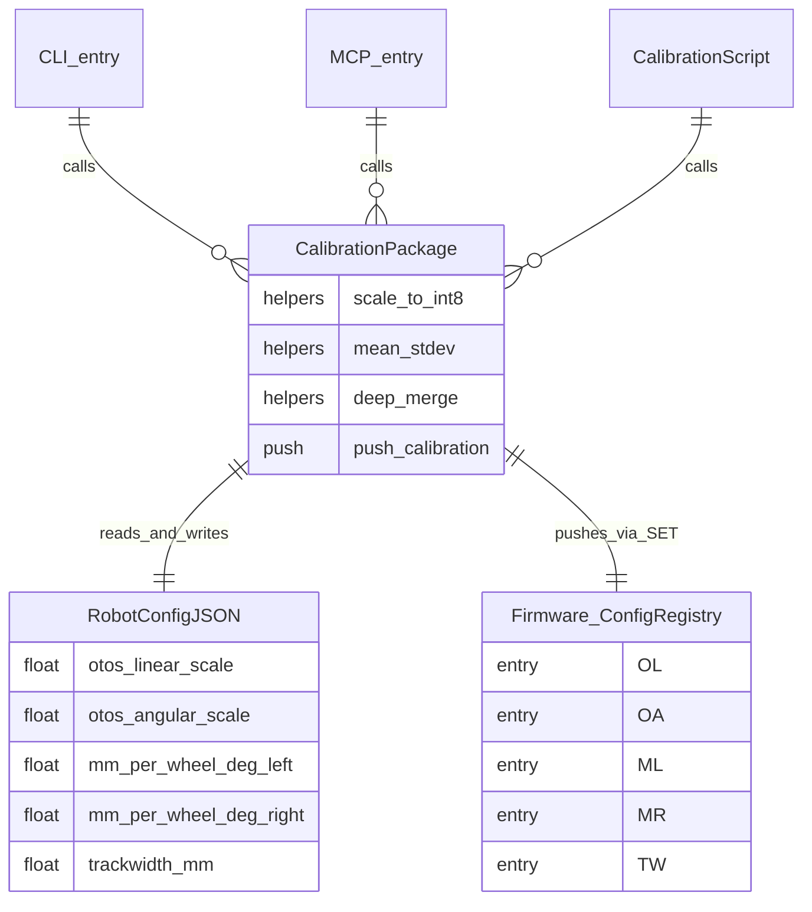

<!-- CLASI: Before changing code or making plans, review the SE process in CLAUDE.md -->

# Architecture Update — Sprint 028: Calibration and host consolidation

## What Changed

### 1. New module: `robot_radio/calibration/`

A new package consolidates all calibration logic that previously existed in
four independent locations:

| Old location | Lines | Role |
|---|---|---|
| `host/calibrate_angular.py` | 718 | standalone Angular entry point |
| `host/calibrate_linear.py` | 555 | standalone Linear entry point |
| `host/calibrate_verify.py` | — | verify helper |
| `host/robot_radio/io/calibrate.py` | 1101 | `rogo calibrate` sub-commands |

Literal duplicates removed: `_deep_merge` (3 copies), `scale_to_int8` /
`_scale_to_int8` (3 copies; also in cli.py), `mean_stdev` / `_mean_stdev`
(2 copies), `_save_config` / `_resolve_save_path` (2 copies).

The new package structure:

```
robot_radio/calibration/
    __init__.py
    helpers.py        — scale_to_int8, mean_stdev, deep_merge, save_config
    push.py           — push_calibration(conn, config) → dict
    angular.py        — calibrate_turns() — core interactive turns logic
    linear.py         — calibrate_distance() — core interactive distance logic
```

Top-level scripts (`host/calibrate_angular.py`, `host/calibrate_linear.py`,
`host/calibrate_verify.py`) are reduced to thin entry points that import from
the package and call `calibrate_turns()` / `calibrate_distance()`.

`host/robot_radio/io/calibrate.py` is reduced to `rogo calibrate` subcommand
wiring that delegates to `robot_radio/calibration/angular.py` and
`robot_radio/calibration/linear.py`.

### 2. New module: `robot_radio/robot/connection.py`

Extracted from `io/cli.py`:

- `make_robot(port, mode, verbose, args)` — port resolution, HELLO handshake,
  mode detection, robot-object construction (Nezha/Cutebot dispatch), session
  cache read/write. Returns `(robot, conn, result)`.
- `get_port(args)` — port precedence logic (--port flag > session cache >
  auto-detect).
- Session cache helpers (`read_session_cache`, `write_session_cache`) moved
  here from cli.py.

Both `io/cli.py` and `io/robot_mcp.py` import and call `make_robot()` instead
of duplicating the handshake logic.

### 3. Modified: `io/cli.py` and `io/robot_mcp.py`

- `cli.py`: `_make_robot`, `_get_port`, `_push_calibration`, `_scale_to_int8`,
  session cache helpers, and `_deep_merge` are removed and replaced with calls
  to `robot_radio.calibration.push` and `robot_radio.robot.connection`.
  `cli.py` scope is now: arg-parsing + printing + command dispatch.
- `robot_mcp.py`: `_connect()` calls `make_robot()` from
  `robot_radio.robot.connection` instead of constructing `SerialConnection`
  directly. Calibration push via the shared `push_calibration()`.

### 4. Modified: `source/robot/Robot.cpp` — D10 firmware telemetry

Four changes in `buildTlmFrame` / `telemetryEmit` / `handleStream`:

**a. Sequence number**: `buildTlmFrame` emits `seq=<n>` (uint16, wrapping) as
the first field after `t=` and `mode=`. Counter is `_tlmSeq` on `Robot`,
incremented on every call to `buildTlmFrame` (both STREAM and SNAP paths share
the same counter so the host can detect drops either way).

**b. Low idle rate**: `telemetryEmit` no longer goes silent when idle. When
`stopped == true` (i.e. idle > 400 ms grace), emit continues at
`max(tlmPeriodMs, 500)` ms instead of returning. The comment "SNAP handles the
synchronous request path" is updated to reflect the new low-rate idle behavior.

**c. Channel binding**: `activeTlmFn` in `LoopScheduler` is updated only when
a `STREAM` command arrives (in `handleStream`, which sets a new
`_tlmBoundFn` + `_tlmBoundCtx` on `Robot`). Commands arriving on other channels
(radio, second serial) no longer update `activeTlmFn`. Binding persists until
the next STREAM command.

**d. Clamp relocation**: The `if (config.tlmPeriodMs < 20) config.tlmPeriodMs = 20`
write is removed from `telemetryEmit` and moved into `handleStream` (applies
before writing `config.tlmPeriodMs`). `telemetryEmit` no longer mutates config.

### 5. Modified: `host/robot_radio/robot/protocol.py` — TLMFrame.seq

`TLMFrame` gains a `seq: int | None = None` field. `parse_tlm()` populates it
when the `seq=` key is present. A helper function `tlm_drop_rate(frames)` is
added to `protocol.py` (or a companion `robot_radio/sensors/tlm_health.py`):
given a list of `TLMFrame` objects, returns the fraction of expected sequence
numbers that were not received.

### 6. Modified: `source/robot/ConfigRegistry.cpp` — SET validation

`handleSet` is updated to:

- Use `strtof` / `strtol` with end-pointer validation instead of `atof` /
  `atoi`; non-numeric or trailing-garbage input is rejected per-key with
  ERR badval.
- Build a candidate `RobotConfig` copy and validate it before committing:
  - Per-field ranges (e.g. `tw > 0`, `ctrlPeriod > 0`,
    `rotationalSlip ∈ [0.5, 1]`, `vWheelMax > steerHeadroom`).
  - Cross-field invariants checked after all key writes to the candidate.
- Apply atomically: only if the whole candidate passes do we copy it to the
  live `cfg`.
- On validation failure: reply `ERR badval <key>=<value> reason=<msg>`.
  The live config is unchanged.

---

## Module Diagram



---

## Entity-Relationship: Calibration data flow



---

## Why

**Calibration (a7):** Four independent implementations of the same math with
three copies of `_deep_merge` and three copies of `scale_to_int8` created a
maintenance hazard and produced false confidence: calibration outputs were stored
but not verified to reach firmware. One package with one implementation of each
helper removes the ambiguity and lets the a8 lint (sprint 025) enforce
completeness going forward.

**CLI/MCP extraction (a6, partial):** `cli.py` and `robot_mcp.py` diverged
because library logic was trapped in `cli.py`. The agent uses `robot_mcp.py`;
the human uses `cli.py`. Any `make_robot` or `push_calibration` difference
between the two is a direct "works for the human, fails for the agent" bug.
Extracting just these two concerns (construction + calibration push) is the
minimum that eliminates the live drift without touching controller logic
(A1 territory).

**D10 firmware telemetry:** The host cannot measure TLM drop rate without seq
numbers. The idle-silence behavior makes stream health diagnostics unreliable
(the host cannot distinguish "robot went idle" from "serial dropped"). The
channel-binding fix stops a radio command from silently redirecting the serial
stream. The clamp-in-telemetryEmit bug is a config mutation hidden in an emit
path — easy to miss and to re-introduce.

**SET validation (set-config-validation):** `atof`/`atoi` with no range checks
let malformed or out-of-range `SET` break the live control model silently. The
agent uses `SET` heavily for tuning. Atomic validation is the minimum fix.

---

## Impact on Existing Components

| Component | Impact |
|---|---|
| `host/calibrate_angular.py` | Reduced to ~20-line entry point; no logic |
| `host/calibrate_linear.py` | Reduced to ~20-line entry point; no logic |
| `host/robot_radio/io/calibrate.py` | Reduced; delegates to calibration package |
| `host/robot_radio/io/cli.py` | Drops ~200 lines of construction + push logic |
| `host/robot_radio/io/robot_mcp.py` | `_connect()` calls `make_robot()` |
| `host/robot_radio/robot/protocol.py` | `TLMFrame` gains `seq` field; non-breaking |
| `source/robot/Robot.cpp` | `buildTlmFrame` emits `seq`; `telemetryEmit` idle rate change; channel binding |
| `source/control/LoopScheduler.cpp` | `activeTlmFn` updated only on STREAM; otherwise kept |
| `source/robot/ConfigRegistry.cpp` | `handleSet` validation; behavior change on bad input |
| `docs/protocol-v2.md` | Document `seq=<n>`, idle rate, channel binding |

The `TLMFrame.seq` addition is backward-compatible: old firmware that does not
emit `seq=` leaves the field `None`. The host drop-rate check only fires when
`seq` is present.

The `handleSet` validation change is a behavior change: previously invalid
`SET tw=0` silently corrupted the config; now it returns ERR. Any test or
bench script that relies on silent acceptance of invalid values will need
updating.

---

## Migration Concerns

- The calibration package reorganization is purely internal to the host
  package. No protocol changes, no firmware changes, no data file format
  changes. Top-level script paths (`host/calibrate_angular.py`, etc.) are
  preserved as thin wrappers so existing usage is unchanged.
- `robot_radio/robot/connection.py` is new. Both `cli.py` and `robot_mcp.py`
  will import from it. The session cache file location and format are
  unchanged; only the code that reads/writes it moves.
- Firmware D10 changes require a reflash. The `seq=` field is additive;
  hosts running old software against new firmware will simply see an ignored
  field. Hosts running new software against old firmware will see `seq=None`
  and skip drop-rate measurement.
- `handleSet` behavior change: `SET` with malformed or range-violating values
  now returns ERR instead of silently corrupting config. This is intentional.

---

## Design Rationale

### Decision: Extract `make_robot` to `robot/connection.py`, not to `io/shared.py`

**Context:** The extraction needs a home. `io/` already contains CLI and MCP
front-end code; putting shared infrastructure there creates another mixed-layer
module. `robot/` is the natural home for connection construction because it owns
the `QBotPro`/`Nezha` objects.

**Alternatives considered:**
- `io/shared.py` — flat; puts library in the same layer as the front-ends.
- `config/connection.py` — config package is about config data, not transport.
- Keep in `cli.py` and import into `robot_mcp.py` — creates a dependency
  from an MCP module on a CLI module.

**Why this choice:** `robot/connection.py` places connection construction in the
robot layer, which already contains `Nezha`, `NezhaProtocol`, and `protocol.py`.
The front-end modules (CLI, MCP) depend on the robot layer; the robot layer does
not depend on the front-ends.

**Consequences:** `cli.py` and `robot_mcp.py` gain an import from
`robot_radio.robot.connection`. Both already import from `robot_radio.robot`.

### Decision: Keep calibration package under `robot_radio/`, not top-level

**Context:** Three calibration scripts live at `host/` (top-level). They could
absorb the shared helpers inline, but then each script remains a 400-700 line
file that can't share math with the `rogo calibrate` subcommands.

**Alternatives considered:**
- Merge everything into `host/robot_radio/io/calibrate.py` — already 1101 lines;
  adding to it makes the problem worse.
- Leave top-level scripts as-is and only fix `io/calibrate.py` — doesn't
  eliminate the duplicated `scale_to_int8` in cli.py.

**Why this choice:** `robot_radio/calibration/` places calibration math where
it can be imported by both the `rogo calibrate` subcommands and the top-level
scripts. Top-level scripts become thin entry points that don't contain math.

### Decision: Scope A6 to construction + push only; defer CLI controller loops

**Context:** Full A6 completion (controllers, TLM snapshot parsing) requires
the A1 navigation-ownership decision (sprint 029). Moving controller loops out
of `cli.py` before that decision is made risks consolidating onto the wrong
target.

**Why this choice:** The CLI/MCP drift that causes agent failures is in
`make_robot` and `push_calibration`, not in the controller loops. Those loops
also happen to be the items A1 will delete or relocate. Touching them now would
create a future merge conflict.

**Consequences:** `cli.py` will still contain controller loops after this sprint.
The line count reduction from removing construction + push is ~200 lines, bringing
cli.py to ~2000. Full A6 completion (cli.py < 800 lines) is sprint 029 work.

---

## Open Questions

1. **a8 lint prerequisite (sprint 025, ticket 003):** The a8 lint enforces
   `registered-not-used` at CI. Sprint 025 is still in `planning-docs` status
   (all three tickets open). Sprint 028 must land after sprint 025 closes — or
   sprint 028 must ship its own check that the newly consolidated calibration
   keys are all consumed. The recommended approach: if 025-003 is not yet
   executed, sprint 028 ticket 028-002 includes a manual verification step
   (run `scripts/check_config_sync.py` after consolidation) and notes the CI
   gate dependency. **Flag for revalidation once sprint 025 closes.**

2. **field-024 SNAP/STREAM discrepancy (sprint 027, ticket 006):** Sprint 027
   ticket 006 has an explicit fork: if the SNAP fix is a one-liner, fix in 027;
   if it requires D10 (seq numbers, frame mux), defer to 028. Since 027 is also
   still in `planning-docs`, sprint 028 ticket 028-004 (D10 firmware) includes
   an acceptance criterion that closes the field-024 SNAP/STREAM discrepancy
   if 027-006 deferred it. If 027-006 fixed it, the criterion is satisfied by
   verification only. **Flag for revalidation once sprint 027 closes.**

3. **`push_calibration` protocol:** The MCP path calls
   `_robot._proto.push_calibration(_config)` (on `NezhaProtocol`). The CLI path
   calls `_push_calibration(conn)` which does its own config resolution and SET
   calls directly on `conn`. These need a common interface. The recommended
   approach is to have `robot_radio/calibration/push.py` call
   `_proto.push_calibration(config)` when a `Nezha` is available, and fall back
   to raw SET calls on `conn` when only a `SerialConnection` is passed. This
   needs confirmation before implementation begins.

4. **`set-config-validation` scope:** The issue identifies `tw > 0`,
   `ctrlPeriod > 0`, `vWheelMax > steerHeadroom`, and `rotationalSlip ∈ [0.5, 1]`
   as the minimum invariant set. Cross-field invariant order-of-check must be
   specified (what to check if multiple fields are set simultaneously and each
   alone is valid but together they violate an invariant). Recommend: validate
   the full candidate config after all writes, using a
   `RobotConfig::validate() const` method returning an error string.
