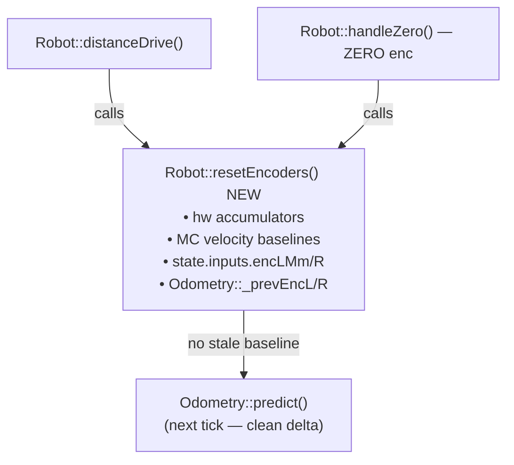
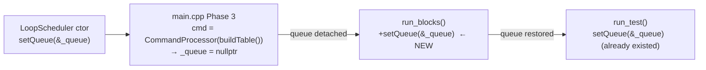
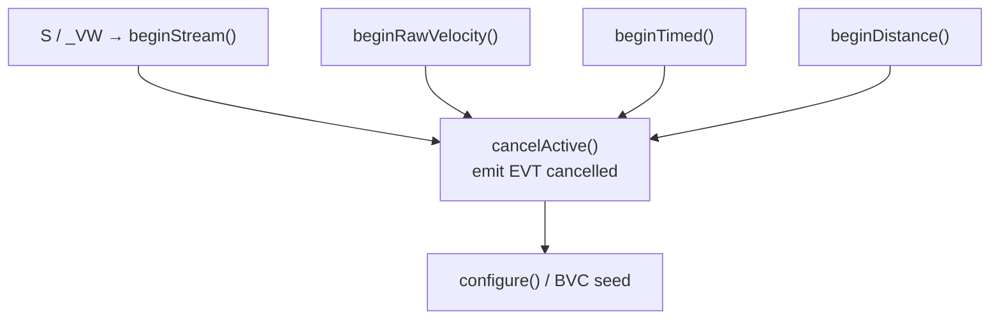

<!-- CLASI: Before changing code or making plans, review the SE process in CLAUDE.md -->

# Architecture Update — Sprint 030: Firmware correctness fixes (Fable round-2 N1-N16)

## Step 1: Problem Statement

The round-2 Fable code review identified 16 correctness findings (N1–N16) in the
firmware. Five are High or Med-High severity: encoder reset desynchronizes the EKF
pose, the queue path is silently detached in firmware-only (not sim), a TLM null
function pointer can HardFault the robot, `S` mid-motion leaves a zombie stop
condition, and `beginTimed`/`beginDistance` swallow the cancelled event. The
remaining findings are Medium and Low: config validation gaps, silent queue overflow,
stale sensor TLM, OTOS one-tick-late gate, HALT boot-epoch baseline, and a cluster
of spurious events / dead code / sizing issues.

This sprint applies surgical fixes to all 16 findings. No new modules are introduced;
no interfaces change at the public API level. The changes land entirely in `source/`
and `host_tests/`/`host/tests/`.

---

## Step 2: Responsibilities Changed

| Responsibility | Current owner | Change |
|---|---|---|
| Atomic encoder reset | `Robot::distanceDrive` + `MotionController::beginDistance` (split, inconsistent) | Consolidated into a single `Robot::resetEncoders()` called from both sites |
| Queue wiring after Phase 3 reassignment | `LoopScheduler::run_test()` only | `run_blocks()` also re-wires (one line, mirrors run_test) |
| TLM emission guard | None (null fn-ptr unguarded; ctx taken from last command) | Guard in `telemetryEmit()`; use bound ctx, not active ctx |
| begin*() cancel-if-active contract | `beginVelocity`, `beginArc`, `beginTurn`, `beginRotation`, `beginGoTo` (5 of 7 entry points) | All 7 entry points uniform: `beginStream`, `beginRawVelocity`, `beginTimed`, `beginDistance` gain the cancel-if-active prefix |
| Config validation coverage | `validateConfig()` checks 4 fields | Extended to cover rate/accel/timeout family |
| Queue enqueue failure reporting | Silent drop | Reply `ERR full`/`ERR busy`; converter suppresses OK on pushVW failure |
| Sensor freshness in TLM | `valid` bit only (sticky) | `now - lastUpdMs <= 2*lagMs` freshness gate added |
| OTOS fusion gate timing | One tick stale | `readTransformed` returns success flag; skip fusion on same-tick failure |
| HALT baseline | Boot epoch (0) | Baselined at `add()` time; `remove()` frees slot |
| PURSUE re-gate event | Emits `EVT cancelled` for G's corrId (spurious) | `cancelQuiet()` / clear sink before internal cancel |
| GET serial chunking | Single 600-800 byte line, truncated | Chunked into ≤200-byte CFG lines (bench-confirmed) |
| Dead code | `RatioPidController`, `PID_BYPASS`, `Odometry::update()`, `DriveMode::TIMED` | Removed |
| corrId field width | 8 bytes in `ParsedCommand` vs 16 in others | Widened to 16 uniformly |
| EKF process noise | Full Q per call regardless of dt | Q scaled by dt_s (or predict gated to controlPeriod) |
| Queue-path sensor-stop validation | Silent skip on parse failure | Validated in converter before replying OK |

---

## Step 3: Module Map

These are the firmware modules touched by this sprint. No new modules are created.

**`source/robot/Robot.cpp` / `Robot.h`**
- `resetEncoders()` — new method: atomically resets hardware accumulators,
  MotorController baselines, `state.inputs.encLMm/R`, and `Odometry::_prevEncL/R`.
- `telemetryEmit()` — gains null-fn guard; uses `_tlmBoundCtx`/`_tlmBoundFn`
  (not `ts.activeCtx`).
- `lineRead()`/`colorRead()` — TLM gate uses freshness, not the sticky `valid` bit.
- `otosCorrect()` — skips fusion when `readTransformed` reports same-tick failure.
- Boundary: no change to Robot's public interface beyond `resetEncoders()`.

**`source/control/MotionController.cpp` / `MotionController.h`**
- `beginStream()`, `beginRawVelocity()`, `beginTimed()`, `beginDistance()` — each
  gains the three-line cancel-if-active prefix (cancel `_activeCmd` and emit EVT
  cancelled) before proceeding.
- `beginDistance()` calls `Robot::resetEncoders()` instead of the old split reset.
- PURSUE re-gate uses `cancelQuiet()` (or clears sink before cancel) so no spurious
  `EVT cancelled` is emitted for the G's corrId.
- Boundary: no change to callers; begin*() signatures unchanged.

**`source/app/LoopScheduler.cpp` / `LoopTickOnce.cpp`**
- `run_blocks()` — adds `_cmd.setQueue(&_queue)` at top (one line, mirrors
  `run_test()`).
- `LoopTickOnce.cpp` — the `setQueue(nullptr)/restore` dance in the watchdog path is
  unchanged in logic; now consistent because `run_blocks` armed the queue first.
- Boundary: `run_test()` unchanged; sim path is unaffected.

**`source/config/ConfigRegistry.cpp`**
- `validateConfig()` — adds `> 0` checks for `aMax`, `aDecel`, `vBodyMax`,
  `yawRateMax`, `yawAccMax`; adds floor check for `sTimeoutMs`; reconciles `rotSlip=0`
  "unset" semantics.
- Boundary: only the validation side; config registry structure unchanged.

**`source/app/CommandProcessor.cpp`** / **`source/app/MotionCommandHandlers.cpp`**
- `dispatchTable()` — checks `push_back()` return; replies `ERR full`/`ERR busy`.
- All converter `pushVW()` sites — check return; suppress early OK or emit follow-up
  ERR on failure.
- Queue-path sensor-stop validation — validate `sensor=` token in converter before
  replying OK; match the direct-path ERR+cancel behaviour.
- `ParsedCommand::corrId` widened from 8 to 16 bytes.
- Boundary: wire protocol unchanged; ERR responses are new on previously-silent paths.

**`source/halt/HaltController.cpp` / `HaltController.h`**
- `add()` — baselines TIME/DIST entries at call time (`now`/current distance).
- `remove()` — frees the slot so the table can be reused.
- Boundary: `add()`/`remove()` signatures unchanged.

**`source/odometry/Odometry.cpp`** / **`source/ekf/EKF.cpp`**
- `EKF::predict()` — scale Q by `dt_s` (or gate to `controlPeriodMs`).
- `Odometry::setPose()` — snapshots current encoder inputs into `_prevEncL/R`
  (d12 #4; no-op if encoders are already zero).
- `Odometry::update()` — removed (no callers).
- Boundary: `predict()` signature unchanged; Q scaling is internal.

**`source/sensors/OtosSensor.cpp`**
- `readTransformed()` / `readVelocityTransformed()` — return success flag; caller
  (`Robot::otosCorrect()`) skips fusion on false.
- Boundary: callers updated in Robot.cpp; no other callers.

**`source/motor/MotorController.cpp`**
- `RatioPidController` construction, reset, SET wiring, and `PID_BYPASS` removed.
- Boundary: `pid.*` SET keys will return unknown-key ERR after removal.

**`source/robot/Robot.cpp` (GET chunking)**
- `handleGet()` or the `CFG` dump path — chunks output into ≤200-byte serial writes.
- Only active when bench confirms >255-byte truncation (N12 is bench-gated).

---

## Step 4: Diagrams

### Control-flow: encoder reset (N1 fix)

### Queue wiring: N2 fix

### begin*() cancel-if-active matrix (N4 + N5)

---

## Step 5: Document Sections

### What Changed

1. **`Robot::resetEncoders()`** (new) — single atomic encoder reset called from
   `distanceDrive()` and `handleZero`. Eliminates the D-command pose jump and the
   `ZERO enc` frozen-encoder window (N1, d12 #4).

2. **`run_blocks()` queue re-wire** — one line re-wires `_cmd.setQueue(&_queue)` at
   the top of `run_blocks()`. Firmware now runs the queue path from first boot,
   matching the sim. Eliminates the history-dependent mode flip (N2).

3. **`telemetryEmit()` guard** — null check on `_tlmBoundFn`; TLM emitted with bound
   ctx, not `ts.activeCtx`. Eliminates HardFault from `SET tlmPeriod` without STREAM
   and the fn/ctx mismatch in mixed serial+radio setups (N3).

4. **Uniform cancel-if-active** — `beginStream()`, `beginRawVelocity()`,
   `beginTimed()`, `beginDistance()` each gain the cancel-if-active prefix. Eliminates
   zombie stop conditions and missing `EVT cancelled` events (N4, N5).

5. **`validateConfig()` extensions** — rate/accel/timeout family now validated.
   Prevents runaway from negative `aDecel`, stall from zero `aMax`, X-storm from zero
   `sTimeoutMs` (N6).

6. **Queue enqueue error reporting** — `push_back()` / `pushVW()` failures now reply
   `ERR full`/`ERR busy`. Converters suppress early OK until VW enqueue succeeds (N7).

7. **Sensor freshness gate in TLM** — `now - lastUpdMs <= 2*lagMs` guards line/color
   and raw `otos=` TLM fields. `readTransformed` returns success flag; fusion skipped
   on same-tick failure (N8, N9).

8. **HALT baseline at registration** — `add()` captures `now`/distance so TIME/DIST
   entries are relative to registration, not boot. `remove()` frees the slot (N10).

9. **PURSUE quiet cancel** — `cancelQuiet()` (or sink-clear before cancel) prevents
   spurious `EVT cancelled` for the G's corrId on internal re-gates (N11).

10. **GET chunking** (bench-gated) — `CFG` dump split into ≤200-byte serial lines if
    bench confirms >255-byte truncation (N12).

11. **Dead code removal** — `RatioPidController`, `PID_BYPASS`, `Odometry::update()`,
    `DriveMode::TIMED` removed (N13).

12. **`corrId` width uniformity** — `ParsedCommand::corrId` widened to 16 bytes,
    matching `MotionCommand` and `TargetState` (N14).

13. **EKF Q scaled by dt** — `EKF::predict()` scales Q by `dt_s`, making process noise
    independent of loop rate (N15, d12 #1).

14. **Queue-path sensor-stop validation** — `sensor=` token validated in the converter
    before replying OK; parse failure returns ERR+cancel, matching the direct path (N16).

### Why

All changes trace to the round-2 Fable correctness review. The High/Med-High findings
(N1–N5) address active field risks: D-command pose corruption degrades every queued
multi-segment run; the queue detach means the sim and hardware have been running
different dispatch paths since sprint 026; the null TLM function pointer is a
boot-time HardFault waiting for a `SET tlmPeriod` call. N4 and N5 complete the
cancel-if-active contract that was applied to five of seven begin*() entry points in
previous sprints. The remaining findings prevent silent data loss, unexpected
motion termination, and estimator drift.

### Impact on Existing Components

- `pid.*` SET keys will return unknown-key ERR after `RatioPidController` removal
  (N13). Any host script using `SET pid.*` must be updated.
- `DriveMode::TIMED` removal: TLM `mode=` can never read `T`; host parsers that
  special-case `mode=T` can drop that branch.
- `corrId` widened to 16: no wire change (the string token is unchanged); only the
  in-memory `ParsedCommand` struct grows by 8 bytes — negligible RAM impact.
- `beginStream()` now emits `EVT cancelled` when it preempts an active command.
  Host-side code that sends `S` to a fresh robot (no active command) is unaffected.
- `validateConfig()` extensions: existing scripts that relied on setting `aDecel` to
  a negative value (undocumented foot-gun) will now get ERR. No known such scripts.

### Migration Concerns

None for the firmware runtime. The `pid.*` SET key removal is a breaking change for
any host calibration script that tunes `RatioPidController` — none are known to exist
since the controller was never run. The corrId width change is internal-only.

---

## Step 6: Design Rationale

### Decision: single `Robot::resetEncoders()` rather than patching each call site

**Context**: N1 was flagged in round 1 as a "minimal correction"; only the `setPose`
third landed. Two call sites (`distanceDrive`, `handleZero`) independently reset
subsets of the encoder state.

**Alternatives**: Patch each call site independently. Rejected: the partial-fix
pattern is exactly how round 1 left N1 unresolved; a single atomic method makes the
invariant explicit and eliminates future partial-reset bugs.

**Consequences**: `Robot.h` gains one public method. MotorController, Odometry, and
HardwareState are reset in a single call; callers need no knowledge of the reset
ordering.

### Decision: fix N2 with one line in `run_blocks()` (mirror `run_test()`)

**Context**: The alternative is to give `CommandProcessor` an assignment operator that
preserves `_queue` wiring. That changes the class contract.

**Chosen**: The one-line re-wire at the top of `run_blocks()` is the smallest correct
fix; the comment in `run_test()` already names this as the pattern.

### Decision: `SET tlmPeriod` without STREAM should suppress TLM (not ERR)

**Context**: Two options — (a) guard the null fn in `telemetryEmit()` and silently
suppress, (b) reject `SET tlmPeriod` if no STREAM is bound. Option (a) matches the
existing header comment ("nullptr means TLM is suppressed"). Option (b) is a
wire-breaking change.

**Chosen**: Option (a) — guard the null fn, suppress TLM silently. The fn/ctx mismatch
(the second sub-issue of N3) is fixed separately by using `_tlmBoundCtx` in the emit
call.

### Decision: N12 (GET chunking) is bench-gated

**Context**: The truncation is theoretically certain from the buffer math, but the
actual behavior on hardware has not been observed. Chunking changes the wire protocol
for GET responses.

**Chosen**: Implement the chunking in this sprint; the acceptance gate requires bench
confirmation that the full config is received without truncation. If bench confirms
the original behavior was already correct (e.g., ASYNC happens to drain before the
next line), the chunking is still a net improvement.

---

## Step 7: Open Questions

**OQ-1 (Low)**: `RatioPidController` removal drops `pid.*` SET keys. Confirm no host
script (calibration, test) uses these before the dead-code ticket executes.

**OQ-2 (Low)**: `cancelQuiet()` for N11 — is a new `MotionCommand::cancelQuiet()`
method the right abstraction, or is it cleaner to clear the sink before calling the
existing `cancel()`? Either works; the programmer should pick whichever is lower
churn.

---

## Sprint Changes Summary

| Module | Change | Finding |
|--------|--------|---------|
| `source/robot/Robot.cpp` | `resetEncoders()` new method; TLM null guard + bound ctx; freshness gate; OTOS same-tick skip | N1, N3, N8, N9 |
| `source/robot/Robot.h` | Declare `resetEncoders()`; update `_tlmBoundCtx` usage | N1, N3 |
| `source/control/MotionController.cpp` | cancel-if-active prefix on 4 begin*(); quiet cancel in PURSUE re-gate; `resetEncoders()` call in `beginDistance()` | N1, N4, N5, N11 |
| `source/app/LoopScheduler.cpp` | `run_blocks()` re-wires queue | N2 |
| `source/config/ConfigRegistry.cpp` | `validateConfig()` additions | N6 |
| `source/app/CommandProcessor.cpp` | ERR on push_back failure | N7 |
| `source/app/MotionCommandHandlers.cpp` | ERR on pushVW failure; sensor-stop validation | N7, N16 |
| `source/app/CommandTypes.h` | `ParsedCommand::corrId` widened to 16 | N14 |
| `source/halt/HaltController.cpp` | Baseline at add(); remove() frees slot | N10 |
| `source/odometry/Odometry.cpp` | `update()` removed; `setPose()` snapshots encoders | N1, N13 |
| `source/ekf/EKF.cpp` | Q scaled by dt_s | N15 |
| `source/sensors/OtosSensor.cpp` | `readTransformed()` returns success flag | N9 |
| `source/motor/MotorController.cpp` | `RatioPidController`, `PID_BYPASS` removed | N13 |
| `host_tests/` / `host/tests/` | Regression tests for N1–N4, N6–N10, N14–N16 residual-risk cases | All |
