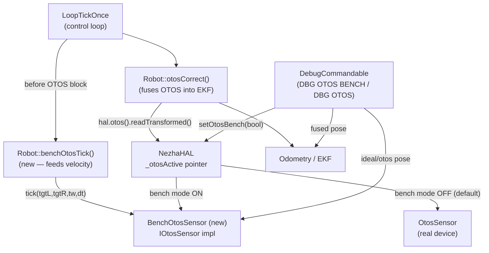
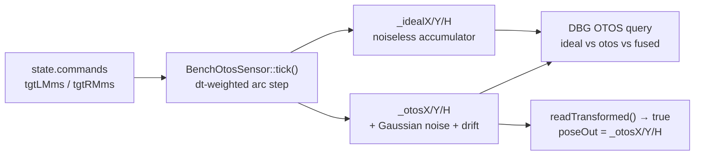

<!-- CLASI: Before changing code or making plans, review the SE process in CLAUDE.md -->

# Architecture Update — Sprint 031: Bench OTOS debug sensor

## Step 1: Problem Statement

When the robot sits on a stand with wheels free-spinning, the real SparkFun
OTOS optical sensor sees no floor motion and reports a frozen pose. This
prevents the full firmware stack from being validated on the bench: the EKF
has no OTOS input to fuse, distance-based stop conditions may never fire, and
the developer cannot see how the estimator behaves during a drive.

This sprint adds `BenchOtosSensor`, a debug `IOtosSensor` implementation that
runs on hardware and synthesizes pose by integrating the commanded wheel
velocity each control tick. It is swappable live via `DBG OTOS BENCH 0|1`, is
always-valid (never returns false from `readTransformed`), and adds a `DBG OTOS`
query for comparing ideal vs errored vs EKF-fused pose. No production code path
is changed; the real `OtosSensor` remains wired in `NezhaHAL` as the default.

---

## Step 2: Responsibilities

| Responsibility | Owner |
|---|---|
| Synthesize pose by integrating commanded velocity | `BenchOtosSensor` (new) |
| Maintain noiseless ideal accumulator for query | `BenchOtosSensor` (new) |
| Apply Gaussian noise + yaw drift to produce errored pose | `BenchOtosSensor` (new) |
| Feed commanded velocity into BenchOtosSensor each control tick | `Robot::benchOtosTick()` (new method) |
| Live swap of the active OTOS pointer | `NezhaHAL` active-pointer pattern (new) |
| DBG OTOS BENCH toggle + noise/drift tuning | `DebugCommandable` (extended) |
| DBG OTOS query (ideal/otos/fused) | `DebugCommandable` (extended) |
| Host-sim unit test: integrator correctness | `host_tests/` (new test) |

---

## Step 3: Module Map

**`source/hal/BenchOtosSensor.h` / `BenchOtosSensor.cpp`** (new)

Purpose: Synthesize OTOS pose from commanded wheel velocity for bench testing.

Boundary (inside): dual accumulators (ideal noiseless + errored), Gaussian
noise + slow yaw drift error model, `microbit_random`-based PRNG with
`HOST_BUILD` deterministic fallback, always-true `readTransformed` /
`readVelocityTransformed`, NOOP stubs for calibration methods.

Boundary (outside): does not touch the I2C bus; does not know about NezhaHAL
or Robot; receives velocity as explicit arguments to `tick()`.

Use cases: SUC-001, SUC-002, SUC-004.

**`source/hal/NezhaHAL.h` / `NezhaHAL.cpp`** (modified)

Adds `_benchOtos` (owned `BenchOtosSensor`), `_otosActive` pointer (initially
`&_otos`), `setOtosBench(bool)` method, and `benchOtos()` accessor. The
`otos()` override returns `*_otosActive`, so the swap is transparent to Robot.

Use cases: SUC-001.

**`source/robot/Robot.h` / `Robot.cpp`** (modified)

Adds `benchOtosTick(uint32_t now_ms)` — reads `state.commands.tgtLMms` and
`tgtRMms`, calls `_benchOtos->tick(tgtL, tgtR, config.trackwidthMm, dt_ms)`.
Called from `LoopTickOnce.cpp` before the OTOS block when bench mode is
active. Also adds `isBenchOtosActive()` accessor (reads `NezhaHAL` pointer,
or always false in MockHAL builds) used by `DebugCommandable`.

Use cases: SUC-002.

**`source/control/LoopTickOnce.cpp`** (modified)

Inserts a single call to `robot.benchOtosTick(now)` immediately before the
OTOS block. When bench mode is off, `benchOtosTick` is a no-op (the
BenchOtosSensor's tick is skipped). No new conditional branch in
`loopTickOnce` itself — the no-op lives inside `benchOtosTick`.

Use cases: SUC-002.

**`source/app/DebugCommandable.h` / `DebugCommandable.cpp`** (modified)

Adds two command handlers:

- `DBG OTOS BENCH [0|1] [noiseXY=<f>] [noiseH=<f>] [drift=<f>]` —
  toggle bench mode; optionally set noise/drift params. Calls
  `NezhaHAL::setOtosBench()` via `DbgCtx.robot`.
- `DBG OTOS` — query: emits `ideal=x,y,h otos=x,y,h fused=x,y,h`.
  Reads ideal and errored poses from `BenchOtosSensor` and fused pose
  from `robot.state.inputs.otosX/Y/H`.

Use cases: SUC-001, SUC-003.

**`host_tests/test_bench_otos.cpp`** (new)

HOST_BUILD unit test: constructs `BenchOtosSensor` with zero noise, drives
the integrator for N ticks with fixed tgtL/tgtR, asserts accumulated pose
matches the analytic arc formula within tolerance. Second test case enables
noise and asserts statistical band.

Use cases: SUC-004.

---

## Step 4: Diagrams

### Component diagram

### BenchOtosSensor internal state

---

## Step 5: Document Sections

### What Changed

1. **`BenchOtosSensor`** (new class) — `IOtosSensor` implementation that
   integrates commanded wheel velocity into dual accumulators (ideal and
   errored). Uses `microbit_random` for PRNG on device; `HOST_BUILD` uses a
   deterministic seed for reproducible tests. Always returns `true` from
   `readTransformed` / `readVelocityTransformed`.

2. **`NezhaHAL` active-pointer swap** — `_otosActive` pointer starts at
   `&_otos` (real sensor). `setOtosBench(true/false)` switches to/from
   `&_benchOtos`. `otos()` returns `*_otosActive`. The swap is volatile
   (boot default off); no persistent configuration.

3. **`Robot::benchOtosTick()`** (new method) — reads `state.commands.tgtLMms`
   / `tgtRMms` and the elapsed dt, calls `_benchOtos->tick()`. Called from
   `LoopTickOnce` before the OTOS block. No-op when bench mode is off (tick
   is called but `BenchOtosSensor` does nothing when disabled).

4. **`LoopTickOnce.cpp`** — single call to `robot.benchOtosTick(now)` inserted
   immediately before the OTOS block. One line; no new conditional logic in
   `loopTickOnce` itself.

5. **`DebugCommandable`** — two new commands: `DBG OTOS BENCH` (toggle +
   noise tuning) and `DBG OTOS` (query ideal/otos/fused). Modeled on the
   existing `DBG WEDGE` handler pattern.

6. **`host_tests/test_bench_otos.cpp`** (new) — integrator correctness unit
   test. Zero-noise oracle check + noise-band check.

### Why

The real OTOS sees no floor motion when the robot is on a stand. The EKF
cannot be validated on the bench without a synthetic OTOS input. This feature
lets the developer run the full firmware stack (drive commands, distance stops,
EKF fusion, TLM) on the bench, using commanded velocity as the ground truth
for the synthesized sensor.

### Impact on Existing Components

- `NezhaHAL::otos()` now returns `*_otosActive` instead of `_otos` directly.
  Behavior is identical when bench mode is off (the pointer points to `_otos`).
- `Robot` gains `benchOtosTick()` and `isBenchOtosActive()`. No change to
  existing methods.
- `LoopTickOnce.cpp` gains one call before the OTOS block; the call is a
  no-op when bench mode is off.
- `MockHAL` is unchanged. `BenchOtosSensor` lives under `source/hal/`, not
  `source/hal/mock/`, so it is compiled in both device and host builds.
- `IOtosSensor` interface is unchanged. No callers updated.

### Migration Concerns

None. The bench mode defaults to off. Existing firmware behavior is identical
until `DBG OTOS BENCH 1` is issued.

---

## Step 6: Design Rationale

### Decision: BenchOtosSensor lives in `source/hal/`, not `source/hal/mock/`

**Context**: `source/hal/mock/` is excluded from the device build. The bench
sensor must compile and run on hardware (that is its entire purpose).

**Chosen**: `source/hal/BenchOtosSensor.{h,cpp}`. Compiled in all builds.
`HOST_BUILD` guards only the PRNG choice (`microbit_random` vs deterministic
seed).

**Consequences**: The file is present in the device firmware image even when
bench mode is never used. RAM impact is two `OtosPose`-sized accumulators
(6 floats, 24 bytes) plus noise params (3 floats) — negligible.

### Decision: Active-pointer swap in NezhaHAL, not in Robot

**Context**: Robot holds an `IOtosSensor&` reference bound at construction
and cannot be reseated. The swap must happen at the HAL level.

**Chosen**: `NezhaHAL` owns both sensor objects and `_otosActive`. `otos()`
returns `*_otosActive`. Swap is one pointer assignment.

**Consequences**: `isBenchOtosActive()` in Robot must reach into NezhaHAL.
The cleanest approach is a non-virtual `Hardware::benchOtosPtr()` returning
`nullptr` by default; `NezhaHAL` overrides to return `&_benchOtos`. Programmer
chooses the exact mechanism; either a virtual or a downcast is acceptable.

### Decision: Truth source = commanded velocity, not encoder feedback

**Context**: The issue explicitly chose commanded velocity. Encoders on a
free-spinning stand are unreliable (load-free, may glitch). Commanded velocity
is the control intent and is always available.

**Chosen**: `state.commands.tgtLMms` / `tgtRMms` — the target velocities set
by `MotorController` each control tick.

**Consequences**: The synthesized pose represents what the robot would do if
it perfectly tracked commands. This is ideal for testing EKF behavior; it does
not expose velocity-tracking error.

### Decision: PRNG = `microbit_random` on device, deterministic on host

**Context**: `std::mt19937` / `std::normal_distribution` are not available on
CODAL/ARM bare-metal. The issue confirms `microbit_random`.

**Chosen**: `#ifdef HOST_BUILD` selects a deterministic seed (Box-Muller with
a fixed LCG) so unit tests are reproducible.

**Consequences**: Noise behavior differs slightly between device and host, but
the statistical properties (Gaussian, tunable sigma) are equivalent.

---

## Step 7: Open Questions

**OQ-1 (Low)**: `isBenchOtosActive()` accessor in Robot: virtual override vs
downcast. Programmer picks whichever is lower churn.

**OQ-2 (Low)**: `DBG OTOS` query when bench mode is off — report all three
fields with zeroed ideal/otos, or just fused? Reporting all three in all
cases is simpler and consistent; programmer decides.

---

## Sprint Changes Summary

| Module | Change | Use Cases |
|--------|--------|-----------|
| `source/hal/BenchOtosSensor.h` (new) | IOtosSensor for bench — dual accumulators, noise model | SUC-001..004 |
| `source/hal/BenchOtosSensor.cpp` (new) | tick(), readTransformed(), readVelocityTransformed(), stubs | SUC-001..004 |
| `source/hal/NezhaHAL.h` | `_benchOtos`, `_otosActive`, `setOtosBench()`, `benchOtos()` | SUC-001 |
| `source/hal/NezhaHAL.cpp` | otos() returns *_otosActive; setOtosBench() swaps | SUC-001 |
| `source/robot/Robot.h` | `benchOtosTick()`, `isBenchOtosActive()` | SUC-002 |
| `source/robot/Robot.cpp` | benchOtosTick() implementation | SUC-002 |
| `source/control/LoopTickOnce.cpp` | Call benchOtosTick(now) before OTOS block | SUC-002 |
| `source/app/DebugCommandable.h` | Declare DBG OTOS BENCH + DBG OTOS handlers | SUC-001, SUC-003 |
| `source/app/DebugCommandable.cpp` | Implement DBG OTOS BENCH + DBG OTOS handlers | SUC-001, SUC-003 |
| `host_tests/test_bench_otos.cpp` (new) | Integrator correctness unit test | SUC-004 |
