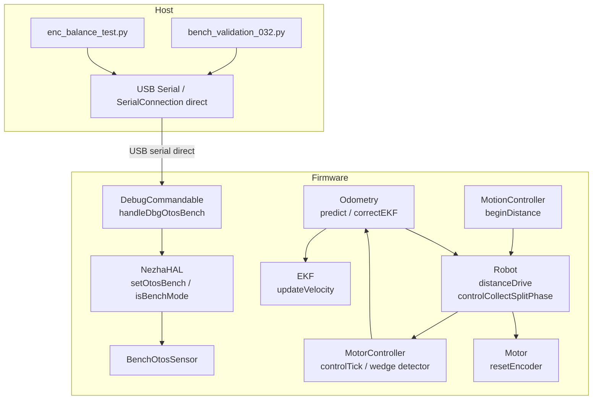

# Architecture Update -- Sprint 033: Bench-found firmware fixes (032 diagnosis)

## What Changed

Five focused surgical changes across four firmware subsystems and one host-side bench harness:

### 1. Bench harness transport (host — `tests/bench/`)

`bench_validation_032.py` and `enc_balance_test.py` currently open the relay's serial port
and enter its `!GO` data-plane. They are rewritten to open the **robot's USB serial port
directly** (`mode="direct"` — no relay, no `!GO`). No firmware change. This eliminates the
relay as a confound for all DBG command reply paths.

### 2. DBG OTOS BENCH enable fix (firmware — `source/app/DebugCommandable.cpp`)

`handleDbgOtosBench` parses `enable = atoi(tokens[0])` and calls `nh->setOtosBench(enable != 0)`.
The bug is in the parse→swap→readback chain: the handler does not correctly flip `_otosActive`
in `NezhaHAL`. The fix investigates and corrects the token/arg plumbing, the `setOtosBench`
pointer assignment, and the `isBenchMode()` pointer comparison. A host-reachable seam (sim test
or mock) is added so the enable/disable round-trip cannot silently regress.

No interface change to `NezhaHAL`; `setOtosBench(bool)` and `isBenchMode()` contracts unchanged.

### 3. EKF encoder-velocity un-gating (firmware — `source/control/Odometry.cpp`)

`Odometry::correctEKF()` currently calls both `_ekf.updateVelocity(otos_v...)` and
`_ekf.updateVelocity(enc_v...)`. Both are only reached through `Robot::otosCorrect()`, which
early-returns when the OTOS validity gates fail. When OTOS is invalid (bench stand, real-world
dropout), encoder velocity never fuses and `state.inputs.fusedV/fusedOmega` stay at 0.

Fix: add an unconditional `_ekf.updateVelocity(enc_v, enc_omega, _rEncV, _rEncV)` call in
`Odometry::predict()` (or in a separate ungated path), so encoder velocity is fused every tick
regardless of OTOS health. OTOS pose/heading/velocity correction stays fully behind the existing
gates in `correctEKF()`.

Coupling with ticket 5: the `enc_omega` observation must be gated on both encoders being
healthy (see wedge-defense changes below). Tickets 3 and 5 must be reviewed together for this
coupling point.

### 4. D distance baseline race fix (firmware — `source/control/MotionController.cpp`, `source/robot/Robot.cpp`)

`MotionController::beginDistance()` calls `_activeCmd.start(inputs, now_ms)` which snapshots
`base.enc0Mm = (encLMm + encRMm)/2` from `state.inputs` — but `state.inputs.encLMm/R` are
zeroed only after `beginDistance()` returns, in `Robot::distanceDrive()`. The baseline captures
the previous command's encoder average.

Fix: move the `state.inputs` encoder zeroing (`resetEncoders()`) to occur **before**
`_activeCmd.start()` inside `beginDistance()`, so the baseline always sees 0. Update the
now-incorrect comment at `MotionController.cpp:382-386`.

### 5. Encoder wedge detector/odometry hardening (firmware — multiple files)

Five hardening items, all surgical; no new modules:

**(a) ZERO enc readback verification** (`source/hal/Motor.cpp::resetEncoder()`): after
`_encOffset += readEncoderAtomic()`, read back the result and require |value| ≈ 0; retry the
offset snapshot on failure. Consider median-of-3 for the snapshot read.

**(b) Outlier-filter hold instrumentation** (`source/robot/Robot.cpp::controlCollectSplitPhase()`):
count consecutive rejected reads per wheel; emit an EVT (or include the streak in TLM) when the
streak exceeds a few ticks. A silent permanent hold is currently invisible.

**(c) Raw read in wedge EVT** (`source/control/MotorController.cpp::controlTick()`): include the
raw encoder read in the `EVT enc_wedged` payload alongside the filtered value. raw frozen too →
likely real wedge/stall; raw moving while filtered frozen → filter-hold cause. Makes the EVT
self-disambiguating.

**(d) Arming grace at drive start** (`source/control/MotorController.cpp`): require the wheel to
have moved at least once since command start (or scale the threshold with commanded speed) before
the wedge latch can arm. Prevents spin-up lag on a drained battery from firing it.

**(e) Odometry wedge defense** (`source/control/Odometry.cpp` + `source/control/MotorController.h`):
expose per-wheel wedge state from `MotorController` (e.g. `bool wheelWedged(Side)` from the stuck
counters/latches). While a wheel is flagged: stop integrating the differential into `dTheta` in
`Odometry::predict()`; also suppress the `enc_omega` observation in the un-gated velocity update
added in change 3.

---

## Why

All five changes stem from bugs found during the sprint 032 hardware bench validation
(`docs/code_review/bench-032-diagnosis.md`):

- The bench harness transport mismatch (finding 2) made every DBG reply invisible, causing the
  bench mode to never engage and preventing the intended validation.
- The DBG OTOS BENCH bug (Part B of `fr-bench-dbg-otos-no-reply.md`) means bench mode still
  doesn't engage even over the correct transport — confirmed: replies `bench=0` every time.
- EKF encoder-velocity being OTOS-gated (finding 3) means `twist=` is permanently 0 on any
  run where OTOS is invalid — including any real-world OTOS dropout, not just the bench stand.
- The D distance baseline race (new finding from the 032 TLM log) caused sqD2 and sqD4 to
  complete with zero motion; the alternating failure pattern is fully explained by the ordering bug.
- The encoder wedge detector conflates three causes (hardware wedge, stall, filter-hold) and
  the odometry has no defense against a wedged wheel injecting phantom dTheta.

---

## Impact on Existing Components

| Component | Change | Impact |
|---|---|---|
| `tests/bench/bench_validation_032.py` | Replace relay/`!GO` with direct serial | Bench harness only; no firmware impact |
| `tests/bench/enc_balance_test.py` | Replace relay/`!GO` with direct serial | Bench harness only |
| `DebugCommandable.cpp::handleDbgOtosBench` | Fix token→setOtosBench→isBenchMode round-trip | DBG OTOS BENCH command; no interface change |
| `Odometry::predict()` | Add unconditional enc-velocity updateVelocity call | `fusedV/fusedOmega` now non-zero when OTOS invalid; callers relying on them being 0 when OTOS absent may be affected |
| `MotionController::beginDistance()` | Move encoder input zeroing before `start()` | Fixes D after TURN; no effect when ZERO enc precedes every D |
| `Motor::resetEncoder()` | Median-of-3 + readback verify | Slightly slower reset (3 atomic reads); negligible at reset frequency |
| `Robot::controlCollectSplitPhase()` | Outlier-filter reject-streak counter | New TLM/EVT field added |
| `MotorController::controlTick()` | Raw read in wedge EVT; arming grace | EVT payload wider; minor logic change to latch arming |
| `Odometry::predict()` + `MotorController.h` | Wedge-state exposure + dTheta suppression | Odometry heading stable when one encoder is wedged |

The change to `fusedV/fusedOmega` (change 3) is the only semantically visible runtime
behavioral change: these fields will be non-zero during driving even when OTOS is absent.
Any host-side code or test that asserts `fusedV == 0` must be updated.

---

## Migration Concerns

None requiring deployment sequencing. All changes are backward-compatible at the protocol
level: TLM field names and command syntax are unchanged. The EVT `enc_wedged` gains a new
`raw=` field in its payload — parsers that split on whitespace will see an extra token; parsers
that match exact strings are unaffected.

The sim harness `host_tests/` may have assertions on `fusedV/fusedOmega` that will need
updating once enc-velocity fusion runs unconditionally.

---

## Component Diagram

---

## Design Rationale

**Why add enc-velocity fusion to predict() rather than a separate call site?**
`predict()` already computes `enc_v` and `enc_omega` from `dL/dR`; adding the
`updateVelocity` call there keeps all encoder-derived fusion in one place, avoids a second
computation of the same values, and maintains the existing separation between predict (always
runs) and correctEKF (OTOS-gated). The coupling to the wedge gate (item e) is handled by
passing a `wedgedL/wedgedR` flag from MotorController rather than duplicating the wedge logic.

**Why not fix the ForceReply routing to make DBG replies visible over radio?**
DBG commands reply on serial by design (DebugCommandable.h:23-24). Routing them over radio
would risk exceeding payload limits (the OTOS pose line is ~150 chars). The correct fix is
the one the stakeholder directed: use the serial port for bench work.

**Why median-of-3 for the ZERO enc snapshot?**
The chip occasionally returns ~149 mm garbage reads on a single atomic read (Robot.cpp:123-125).
Three reads and a median eliminates single-read garbage without requiring I2C retries at the
Motor level, keeping the reset fast and the fix local.

---

## Open Questions

None blocking implementation. The physical wedge investigation (battery droop vs. chip fault)
is explicitly out of scope for this sprint; items (a-e) in change 5 harden the firmware
regardless of the physical root cause.
