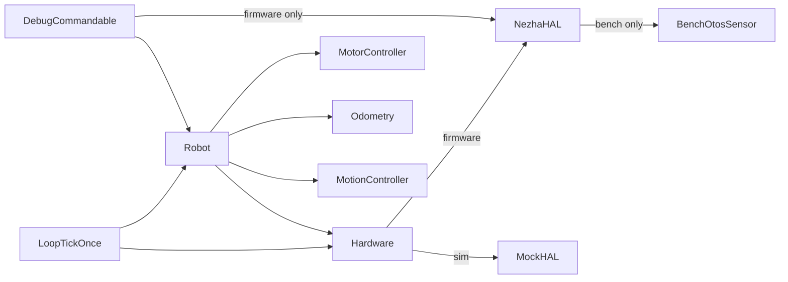

<!-- CLASI: Before changing code or making plans, review the SE process in CLAUDE.md -->

# Architecture Update -- Sprint 034: Push actuator state through Hardware::tick; remove bench-mode leakage from robot core

## What Changed

### 1. Hardware interface: new debug-build tick overload

`Hardware::tick(uint32_t now_ms)` (existing, pure-virtual) remains. A second pure-virtual is added behind a compile guard:

```
#ifdef BENCH_BUILD
    virtual void tick(uint32_t now_ms, const MotorCommands& cmds) = 0;
#endif
```

This is **variation point 1** (hardware creation remains variation point 1a; the `hal.tick` call form is variation point 1b — see below). The overload is declared only in debug/bench/sim builds; it is not part of the production binary.

`NezhaHAL::tick(uint32_t now_ms, const MotorCommands& cmds)` — implements the overload. When bench mode is active (`_otosActive == &_benchOtos`), integrates `_benchOtos.tick(cmds.tgtLMms, cmds.tgtRMms, trackwidthMm, dt_ms)`. No-op when bench mode is off. All dt logic (signed delta, first-call zero) moves from `Robot::benchOtosTick` into this method.

`MockHAL::tick(uint32_t now_ms, const MotorCommands& cmds)` — replaces the current `MockHAL::tick(uint32_t now_ms)` as the plant-integration entry point for sim builds. Receives `cmds` for completeness (implementations may use `cmds.tgtLMms/R` or their existing PWM-response model — implementation choice; either satisfies the interface).

### 2. LoopTickOnce: one build-define switch (variation point 2)

`source/control/LoopTickOnce.cpp` replaces:
```cpp
robot.benchOtosTick(now);    // bench-only Robot method
```
with:
```cpp
#if defined(BENCH_BUILD) && !defined(HOST_BUILD)
    robot.hal.tick(now, robot.state.commands);
#endif
```

The `!defined(HOST_BUILD)` guard is load-bearing. In the firmware bench-debug build, this call is the only site that feeds commanded velocity to `NezhaHAL`'s bench sensor — it must fire from inside `loopTickOnce` (same position as the old `benchOtosTick`) to maintain the ordering invariant: integrate commanded velocities BEFORE `otosCorrect` reads from the bench sensor.

In the sim (HOST_BUILD), `sim_api.cpp` already calls `hal.tick(t, cmds)` immediately before `controlCollectSplitPhase` — BEFORE `loopTickOnce` runs. Moving the sim's `hal.tick` call inside `loopTickOnce` would produce a double-tick per iteration AND break the ordering between `hal.tick` (advance plant) and `controlCollectSplitPhase` (read encoders). So the sim's `hal.tick` stays in `sim_api.cpp`, upgraded from `hal.tick(t)` to `hal.tick(t, robot.state.commands)`, and `loopTickOnce` does not call it again.

This is **the only remaining variation point in the loop body**. Production omits the call entirely (NezhaHAL::tick(now) is already called by the loop schedule, and is a no-op for the bench sensor); bench-debug calls it; sim calls it from sim_api.

### 3. Robot: bench-mode methods deleted

Deleted from `Robot.h` / `Robot.cpp`:
- `Robot::benchOtosTick(uint32_t now_ms)` — method removed entirely.
- `Robot::setBenchOtosEnabled(bool on)` — kept (called by `handleDbgOtosBench`); behavior unchanged. No `#ifndef HOST_BUILD` guard needed: the method calls `hal.setOtosBench(on)` through the `NezhaHAL` accessor (see DebugCommandable section below).
- `Robot::isBenchOtosActive() const` — kept for `handleDbgOtosBench` reply; delegates to `hal` accessor.
- `Robot::_lastBenchTickMs` — private member deleted (dt computation moves to `NezhaHAL::tick`).
- `Robot::_simBenchOtosActive` — deleted (HOST_BUILD sim-observable flag, no longer needed since MockHAL does not use it).
- All `#ifndef HOST_BUILD` / `#include "NezhaHAL.h"` lines in `Robot.cpp` — removed.

After this sprint, `Robot.cpp` has no include of `NezhaHAL.h` and no preprocessor guards for this feature.

### 4. DebugCommandable: downcast localized, not eliminated

`DebugCommandable` is a firmware-only component (excluded from host builds by existing guards). It may hold a `NezhaHAL*` directly. The handlers `handleDbgOtosBench` and `handleDbgOtos` are reworked:

- The `NezhaHAL*` is obtained once at handler registration time (or held as a `DbgCtx` field), not cast from `Robot::hal` on every call.
- The `#ifndef HOST_BUILD` guards inside the handler bodies are eliminated; instead, the handlers themselves are only registered and compiled in non-HOST builds.
- `handleDbgOtos` is reworked to emit integer-formatted pose fields (F1 fix, see section 5).

### 5. DBG OTOS: integer formatting (F1 fix)

The `handleDbgOtos` reply format changes from `%f` to scaled integers, matching the SNAP convention:

| Field | Old format | New format | Unit |
|---|---|---|---|
| x, y (position) | `%.1f` mm | `%d` | mm (round to nearest) |
| h (heading) | `%.4f` rad | `%d` | cdeg (centidegrees = rad * 18000/pi) |
| err fields | same as above | same integer units | mm / cdeg |

Example new reply line:
```
ideal=0,0,0 otos=2,-1,45 fused=150,20,1745 err=-2,1,-45
```

The format change is hardware-only observable (the host sim's libc has full `%f`). A host-testable unit assertion checks that the integer formatting path produces non-empty, in-range output for a known pose.

### 6. sim_api.cpp: direct HAL calls upgraded and bench poke removed

`sim_api.cpp:183` and `sim_api.cpp:492` currently call `s->hal.tick(t)` immediately before `controlCollectSplitPhase`. These calls must remain in that position to preserve the ordering invariant (plant advances → encoder reads). They are UPGRADED from `s->hal.tick(t)` to `s->hal.tick(t, s->robot.state.commands)` — the only change is adding the `cmds` argument, which `MockHAL` may or may not use (its plant model already scavenges motor command state internally via `cmdSpeed()`; the `cmds` arg is available if a future implementation wants it).

`sim_api.cpp:685` (the `sim_bench_otos_tick` standalone function and associated `SimHandle::benchOtos` member) is removed. It was a workaround for the missing command-state input channel. Any host tests that called `sim_bench_otos_tick` directly are updated to use the normal drive-then-tick flow instead.

`SimHandle` loses its standalone `BenchOtosSensor benchOtos` member. The bench sensor concept is firmware-only (NezhaHAL-owned). In sim, `MockHAL::tick(now, cmds)` integrates the full plant — no separate bench sensor object needed.

### 7. Production build exclusion

`BenchOtosSensor.cpp` is excluded from the production build via an `#ifndef BENCH_BUILD` guard at the top of the file (alternatively, a CMakeLists.txt filter — same effect). The `DBG OTOS` and `DBG OTOS BENCH` command registrations in `DebugCommandable::getCommands()` are wrapped in the same guard so the handlers do not appear in the production command table.

---

## Module Diagram

```mermaid
graph TD
    subgraph "production (no BENCH_BUILD)"
        LP[LoopTickOnce] -->|tick(now)| HW[Hardware interface]
        HW -->|implements| NH[NezhaHAL\n- tick(now): no-op]
        LP --> ROB[Robot\n- no benchOtosTick\n- no isBenchOtosActive]
    end

    subgraph "bench/sim debug (BENCH_BUILD)"
        LP2[LoopTickOnce] -->|tick(now, cmds)| HW2[Hardware interface]
        HW2 -->|firmware| NH2[NezhaHAL\n- tick(now,cmds): drives _benchOtos]
        HW2 -->|sim| MH[MockHAL\n- tick(now,cmds): plant step]
        NH2 --> BO[BenchOtosSensor]
        LP2 --> ROB2[Robot\n- same source as production]
        DBG[DebugCommandable\n- holds NezhaHAL*\n- DBG OTOS handlers] --> NH2
        DBG --> ROB2
    end
```

---

## Dependency Graph



No cycles. Dependency direction: `LoopTickOnce` → `Robot`/`Hardware` → subsystems. `DebugCommandable` is firmware-only and depends on `NezhaHAL` (the concrete type) only in its own translation unit, isolated from the rest of the core.

---

## Why

The sprint 031 Bench-OTOS implementation chose the fastest path to a working feature: `Robot::benchOtosTick` downcasts `hal` to `NezhaHAL*` guarded by `#ifndef HOST_BUILD`. This violated the invariant that `Robot.cpp` should be agnostic to which HAL is in use. The violation is observable: `Robot.cpp` includes `NezhaHAL.h` (a CODAL-dependent header), carries build guards, and names a concrete class that has nothing to do with robot logic. The synthetic plant's real input channel — `Hardware::tick` — already existed and was already a no-op. Routing the command state through it closes the loop cleanly: the firmware loop already passes `now_ms` to the tick; adding `cmds` is a single parameter.

The F1 integer-format fix (DBG OTOS) is bundled here because `handleDbgOtos` is being reworked anyway to remove the `hal` downcast, and the cost of fixing the float-print bug in the same handler edit is negligible. Deferring it would require a third touch of the same function in the next sprint.

---

## Impact on Existing Components

| Component | Impact |
|---|---|
| `Robot.h/.cpp` | Three methods + one private member deleted; `#ifndef HOST_BUILD` blocks for this feature removed; `#include "NezhaHAL.h"` removed from `.cpp`. `setBenchOtosEnabled` and `isBenchOtosActive` kept but lose their `#ifndef HOST_BUILD` guards (they delegate to the HAL interface). |
| `Hardware.h` | New `tick(now, cmds)` pure-virtual added under `#ifdef BENCH_BUILD`. |
| `NezhaHAL.h/.cpp` | New `tick(now, cmds)` override; dt logic from `benchOtosTick` moves here. `benchOtosPtr()` and `setOtosBench()` accessors remain. |
| `MockHAL.h/.cpp` | `tick(now)` gains the `cmds` overload (or replaces plain `tick(now)` in BENCH_BUILD). |
| `LoopTickOnce.cpp` | `robot.benchOtosTick(now)` replaced by `#if defined(BENCH_BUILD) && !defined(HOST_BUILD)` guarded `hal.tick(now, cmds)`. No call in production; no call in HOST_BUILD (sim handles it in sim_api). |
| `DebugCommandable.cpp` | `handleDbgOtosBench` / `handleDbgOtos` lose inline `#ifndef HOST_BUILD` guards; NezhaHAL pointer obtained at construction/registration rather than per-call cast from `robot.hal`; `handleDbgOtos` format strings updated (F1). |
| `sim_api.cpp` | Two direct `hal.tick(t)` calls upgraded to `hal.tick(t, robot.state.commands)`; `sim_bench_otos_tick` and related standalone bench-poke functions removed; `SimHandle::benchOtos` member removed. |

---

## Migration Concerns

All changes are internal — no wire protocol, config schema, or host-library changes. The `DBG OTOS` reply format changes from floats to integers; any test that pattern-matches the float format must be updated to expect integers. No stored config, no persisted state, no migration needed at runtime.

---

## Design Rationale

### Decision: `tick(now, cmds)` overload vs. a separate `plantTick(cmds)` method

**Context:** The synthetic plant needs both time and commanded velocity each tick. Two options: add a distinct `plantTick` method, or overload `tick`.

**Alternatives considered:**
- `plantTick(cmds)` alongside `tick(now)`: requires two virtual calls per loop iteration in bench builds; the plant and the tick are causally coupled, so splitting them creates an ordering dependency that callers must manage.
- Overload `tick(now, cmds)` behind a build guard: single call site, single ordering point, aligns with the existing `tick(now)` contract. Callers in production are unaffected (they call the `tick(now)` overload; the `cmds` overload does not exist in that build).

**Why this choice:** One call site, no extra ordering dependency, minimal diff.

**Consequences:** The build guard on `Hardware.h` is load-bearing; forgetting it in a new HAL subclass gives a compile error (pure-virtual not implemented) rather than a silent no-op.

### Decision: DebugCommandable keeps NezhaHAL* rather than going through a new Hardware interface method

**Context:** `handleDbgOtos` needs `bench->idealX()` etc., which are concrete `BenchOtosSensor` accessors not on `IOtosSensor`.

**Alternatives considered:**
- Add `idealX/Y/H()` to `IOtosSensor`: pollutes the production sensor interface with bench-only accessors; violates ISP.
- Add `getBenchOtosIdeal()` to `Hardware`: adds bench-only accessors to the production interface; same problem.
- Have `DebugCommandable` hold `NezhaHAL*` directly: `DebugCommandable` is already excluded from host builds (CODAL-dependent); the concrete knowledge is contained to one translation unit that already depends on the concrete hardware.

**Why this choice:** The isolation is already guaranteed by the host-build exclusion. The concrete reference is confined to `DebugCommandable.cpp` rather than spreading through the interface hierarchy.

**Consequences:** `DebugCommandable` is permanently firmware-only. Any future sim-side debug tooling must use a different path. Acceptable: the DBG commands are a hardware diagnostic tool, not a sim tool.

### Decision: integer formatting for DBG OTOS (mm + cdeg)

**Context:** CODAL/newlib-nano has no float printf; all other robot replies use integer scaling.

**Why this choice:** Consistent with SNAP (`pose=x_mm,y_mm,h_cdeg`); no link-size cost; no precision loss for the bench use case (1mm / 0.01° resolution is more than sufficient).

---

## Open Questions

None. The design is fully specified by the source issue. Implementation choices for `MockHAL::tick(now, cmds)` (whether to use `cmds.tgtLMms/R` or the existing PWM-response model) are left to the implementer as noted in Changes item 5 of the issue.
