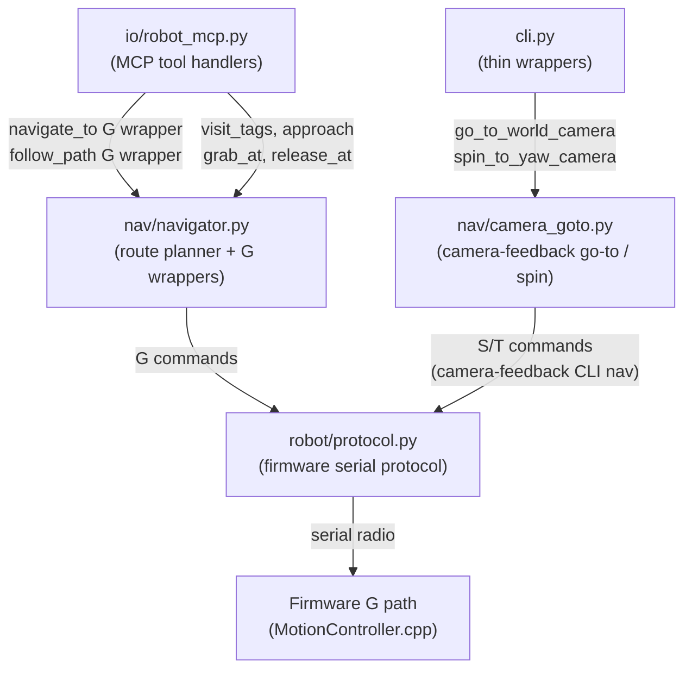

<!-- CLASI: Before changing code or making plans, review the SE process in CLAUDE.md -->

# Architecture Update — Sprint 035

## What Changed

Five host-side artifacts change in this sprint:

1. **`nav/camera_goto.py` (new)** — The inline camera-feedback controller that
   was embedded in `cli.py` (`cmd_goto`, `_daemon_spin_to_yaw`,
   `_crawl_drive_distance`) moves into this new module. Control logic is
   unchanged; only the location moves. `_spin_to_world_yaw` is deleted (confirmed
   dead code, OQ-5 in design doc).

2. **`nav/navigator.py` (demoted to route planner)** — The dual-PID steering
   loop (`navigate`, `ChaseController`), path-following loop (`follow_path`,
   `follow_pose_path`, `_run_controller`), and in-place spin helper
   (`_spin_to_heading`) are deleted. Route-planning methods (`visit_tags`,
   `approach`, `grab_at`, `release_at`, `read_pose`) and camera/playfield
   plumbing (`_get_playfield`, `reset_camera`, `status`) are retained.
   `navigate` and `follow_path` are reimplemented as thin wrappers that issue
   firmware G commands and wait for `EVT done G`.

3. **`controllers/pure_pursuit.py`, `stanley.py`, `ltv.py` (deleted)** — These
   have zero callers outside the navigator steering loop. `pid.py` is retained
   (used by speed-loop primitives outside the steering path).

4. **`robot_mcp.py` (updated)** — `navigate_to` and `follow_path` tool handlers
   are reimplemented to call the new G-command wrapper methods on `Navigator`.
   `follow_pose_path` tool handler is removed (no clean G-command equivalent;
   agents should use `navigate_to` with a sync-pose call). Tool names and
   signatures for `navigate_to` and `follow_path` do not change.

5. **`docs/architecture.md` (updated)** — A "Navigation Architecture / Pose
   Authority" section is added describing the consolidated ownership model.
   The `consolidate-architecture` skill is run to produce a new baseline.

## Why

Three independent go-to-point implementations (G1 firmware, G2 navigator,
G3 CLI inline) and four pose estimators coexisted with no defined authority.
Every navigation bug required hunting in three stacks; calibration gains had to
be maintained three times. Firmware sprints 024–027 proved the G1 path
field-worthy. This sprint executes the consolidation those sprints were
sequenced to enable.

The firmware EKF (P1) is the correct long-term owner of short-horizon motion:
- 10 ms control loop vs. 30 ms for the host.
- Hardware safety watchdog; the host loop has none.
- All sprint 024–027 fixes (PRE_ROTATE timeout, uint32 signed delta, PURSUE
  TIME backstop, arrive-tolerance tuning) live in G1.
- Gains calibrated once (firmware / robot JSON).

Authoritative design doc: `docs/decisions/029-pose-authority.md`.

## Impact on Existing Components

| Component | Before | After |
|-----------|--------|-------|
| `cli.py` | ~290 lines of inline nav control loops | Thin dispatch wrappers; imports from `nav/camera_goto.py` |
| `nav/camera_goto.py` | Does not exist | New module; owns camera-feedback go-to and spin-to-yaw logic |
| `nav/navigator.py` | 1349-line hybrid steering + route planner | ~400-line route planner; `navigate`/`follow_path` are G-command wrappers |
| `controllers/pure_pursuit.py` | 216 lines | Deleted |
| `controllers/stanley.py` | 198 lines | Deleted |
| `controllers/ltv.py` | 293 lines | Deleted |
| `controllers/pid.py` | 54 lines | Retained |
| `robot_mcp.py` `navigate_to` | Calls `_navigator.navigate` (host PID loop) | Calls G-command wrapper on navigator |
| `robot_mcp.py` `follow_path` | Calls `_navigator.follow_path` (host PID loop) | Calls G-command wrapper on navigator |
| `robot_mcp.py` `follow_pose_path` | Calls `_navigator.follow_pose_path` | Removed |
| `host_tests/test_imports_smoke.py` | Imports `PurePursuitTracker`, `StanleyController` | Those import lines removed |

## Module Diagram

Note: `nav/camera_goto.py` retains camera-feedback S/T loops because the CLI
`rogo goto` use case requires real-time camera correction. The host steering loop
is removed only from the navigator / MCP path. The CLI camera-goto module is a
separate, narrow concern with no route-planning responsibility.

## Migration Concerns

- **`follow_pose_path` removal**: Any MCP client that called this tool must
  migrate to `navigate_to` with a `sync_pose` call before each waypoint. The
  design doc (Section 6) identifies no external callers outside `robot_mcp.py`.
- **`visit_tags` / `grab_at` internal call sites**: Both methods call
  `self.navigate()` internally. After deletion these must call the new
  `_navigate_g()` stub. The a1b ticket covers this.
- **Test cleanup**: `host_tests/test_imports_smoke.py` lines importing
  `PurePursuitTracker` and `StanleyController` must be removed or replaced.
- **No firmware changes**: This sprint is entirely host-side Python.

## Design Rationale

### Decision: Reimplement `navigate_to` / `follow_path` as G-command wrappers rather than removing the MCP tools (OQ-1)

- **Context**: Agents rely on these MCP tools.
- **Alternatives**: (a) Remove entirely — breaks agents. (b) Reimplement as
  G-command wrappers (chosen). (c) Retain host PID loop — defeats consolidation.
- **Why this choice**: Signatures unchanged; firmware G path is more precise
  (10 ms, hardware watchdog). Agents observe improved behaviour, not a break.
- **Consequences**: `follow_pose_path` has no clean G-command equivalent and is
  removed. Agents using it must migrate to `navigate_to`.

### Decision: Retain `nav/camera_goto.py` as a separate module (not folded into navigator.py)

- **Context**: The CLI camera-feedback controller is independent of the ownership
  decision and independent of the navigator class.
- **Why**: Separation of concerns — CLI navigation (narrow camera-feedback
  point-to-point) is not route planning (G-command sequencing). Keeps
  `navigator.py` a pure route planner.
- **Consequences**: Two host-side navigation modules exist (`camera_goto` for CLI
  point-to-point, `navigator` for MCP multi-waypoint routing). This is intentional
  and described in the design doc (Section 7).

### Decision: Delete `_spin_to_world_yaw` in ticket 001 (a1a) (OQ-5 resolved)

- **Context**: OQ-5 is confirmed: `_spin_to_world_yaw` is dead code. Its
  dependency (local homography in `robot_radio.io.calibrate`) was removed
  2026-05-29.
- **Why**: Delete dead code as early as possible. Belongs in a1a because it is
  removed from `cli.py` during the fold-in pass.

## Open Questions

All six OQs from `docs/decisions/029-pose-authority.md` are resolved in the
design doc itself. No new open questions arise from the architecture change.

**Stakeholder gate (OQ-6)**: The design doc marks this gate unconfirmed.
Ticket 002 (a1b) is explicitly blocked until the stakeholder confirms that
sprints 026–027 field-proven the firmware G path on the bench. This is
recorded in the a1b ticket acceptance criteria as a hard prerequisite.
