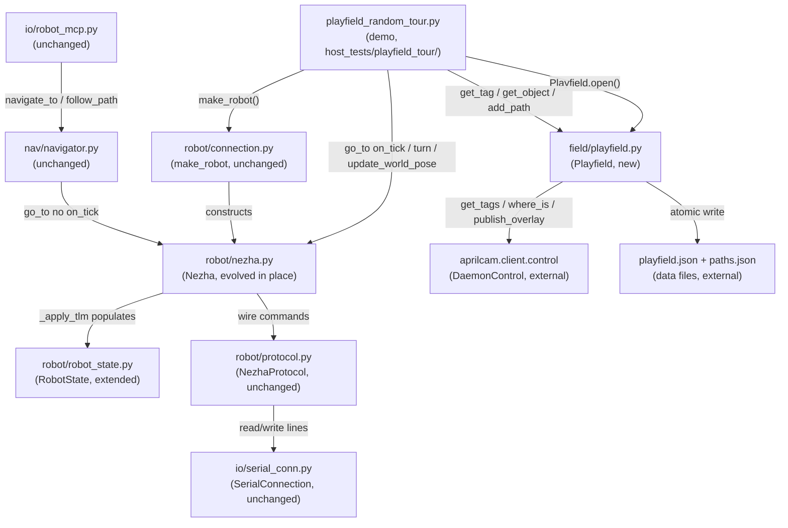
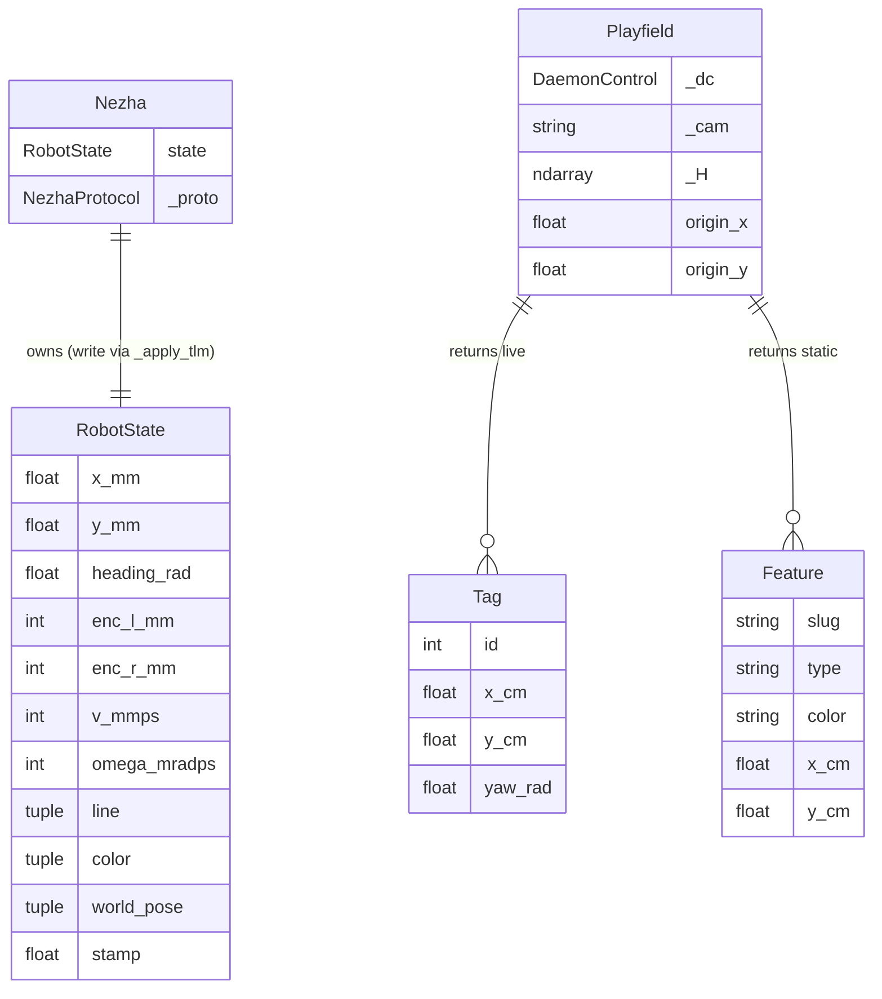
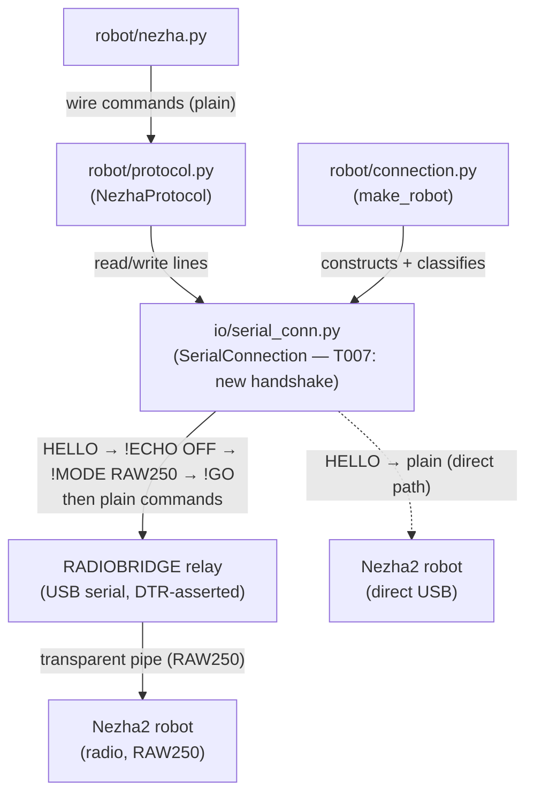

<!-- CLASI: Before changing code or making plans, review the SE process in CLAUDE.md -->

# Architecture Update — Sprint 036

## What Changed

Four host-side artifacts change and one new subpackage is created:

1. **`host/robot_radio/robot/nezha.py` (evolved in place)** — `Nezha` gains a
   single queryable `state: RobotState` field populated by the existing `_apply_tlm`
   hook; a callback-driven `go_to` / `turn` pair via a shared `_run_until_done`
   private loop; a `vw()` body-velocity generator; a `refresh()` one-shot SNAP
   wrapper; and an `update_world_pose()` convenience. All existing public signatures
   retain their current types and defaults. `on_tick=None` on `go_to`/`turn`
   preserves the old blocking behaviour for Navigator/CLI/MCP callers.

2. **`host/robot_radio/robot/robot_state.py` (extended)** — The existing frozen
   `RobotState` dataclass is extended to carry the full TLM payload: `pose` (x_mm,
   y_mm, heading_rad), `encoders` (l, r mm), `twist` (v_mmps, omega_mradps),
   `line`, `color`, `world_pose` (nullable, set via `update_world_pose`), and
   `stamp`. The `Pose` dependency from `nav.pose` is retained for the `pose` field.

3. **`host/robot_radio/robot/robot.py` (minor update)** — The `Robot` ABC gains a
   `turn` stub with a `None` callback default, and `go_to` gains `on_tick`/
   `timeout_s` optional params, so `Cutebot` still satisfies the ABC with no
   behavioural change.

4. **`host/robot_radio/field/` (new subpackage)** — `__init__.py` + `playfield.py`.
   `Playfield` wraps `aprilcam.client.control.DaemonControl`. Exports: `Tag`
   dataclass `(id, x_cm, y_cm, yaw_rad)`, `Feature` dataclass `(slug, type, color,
   x_cm, y_cm)`, `Playfield` class. Namespaced under `field/` to avoid collision
   with `aprilcam.Playfield`.

5. **`host/robot_radio/__init__.py` / `robot/__init__.py` (updated exports)** —
   `Playfield`, `Tag`, `Feature`, and the evolved `RobotState` type are exposed at
   the package level.

## Why

The host module currently provides no single queryable robot state: callers inspect
`robot.encoders`, `robot.otos_pose`, `robot.line_sensor`, `robot.color` as
separate attributes with no coherent snapshot. There is no callback model for
G/turn — the only path is blocking `wait_for_evt_done`. There is no VW generator.
And there is no abstraction for camera/playfield operations — the demo talks to the
daemon and serial port directly, duplicating knowledge of the relay protocol, the
coordinate transform, and the paths.json schema.

These gaps force every caller to re-implement its own TLM parsing, keepalive
management, and coordinate transforms. The sprint closes those gaps by evolving the
existing abstraction boundaries rather than adding a new layer.

Four decisions are locked by the stakeholder (issue doc:
`.clasi/issues/plan-stateful-robot-object-playfield-object-for-the-host-module.md`):

- Evolve `Nezha` in place (not a new facade) to preserve all existing callers.
- `Playfield` wraps `DaemonControl` (not the high-level `aprilcam.Playfield`) to
  keep daemon live-view and path-drawing without exclusive camera ownership.
- State updates on drive ticks only; idle refresh via one-shot SNAP. No background
  thread.
- Scope is the two classes + unit tests + one ported demo. Navigator/odometry
  untouched.

## Impact on Existing Components

| Component | Before | After |
|-----------|--------|-------|
| `robot/nezha.py` | Separate attrs `encoders/otos_pose/line_sensor/color`; blocking `go_to` only; no `turn` | Adds `state: RobotState`, `refresh()`, `update_world_pose()`, `go_to(on_tick=)`, `turn(on_tick=)`, `vw()` generator; old attrs become thin properties |
| `robot/robot_state.py` | Frozen `RobotState(pose,v,omega,accel,stamp)` | Extends to include `encoders`, `twist`, `line`, `color`, `world_pose` |
| `robot/robot.py` | ABC lacks `turn`, no `on_tick` on `go_to` | `turn` stub added; `go_to` gains `on_tick=None`, `timeout_s=15.0` defaults |
| `field/` | Does not exist | New subpackage: `Playfield`, `Tag`, `Feature` |
| `robot/__init__.py` / `__init__.py` | No `Playfield`, no updated `RobotState` | Exports new public types |
| `host_tests/playfield_tour/playfield_random_tour.py` | Raw `serial.Serial` + `DaemonControl` directly; ad-hoc `!GO` / `send()` | Rewritten using `make_robot()` + `Playfield`; relay plumbing removed |
| `nav/navigator.py`, `odometry.py`, CLI tools | — | Unchanged |
| `test_nezha_drive.py`, `test_protocol_v2.py` | Existing tests | Must stay green (regression guard) |

## Module Diagram

## Entity-Relationship Diagram (host state model)

## Migration Concerns

- **Back-compat properties**: `robot.encoders`, `robot.otos_pose`, `robot.line_sensor`,
  `robot.color` become properties over `state`. Existing attribute-read callers
  (Navigator, tests) are unaffected; the values and types are identical.
- **`RobotState` field additions**: The frozen dataclass gains new fields. Any
  caller that constructs `RobotState` directly (if any) will need the new required
  fields. Audit shows no caller constructs it externally — `_apply_tlm` is the
  sole constructor path.
- **`Robot` ABC `go_to` signature change**: `on_tick` and `timeout_s` are added as
  keyword-only params with defaults. `Cutebot` inherits the default no-op
  implementation; no override needed.
- **`turn` ABC addition**: `Cutebot` does not currently implement `turn`. The ABC
  stub is added with a `NotImplementedError` default so `Cutebot` does not need to
  change unless `turn` is called on it.
- **No firmware changes**.
- **No database or persistent-state migration**.

## Design Rationale

### Decision: Evolve Nezha in place rather than adding a new facade

- **Context**: Navigator, CLI, MCP tools, and all host tests call `Nezha` directly
  and rely on its current public signatures.
- **Alternatives**: (a) New `StatefulNezha(Nezha)` subclass — risks import churn,
  two classes to maintain. (b) New standalone facade — all callers must migrate.
  (c) Evolve in place (chosen).
- **Why this choice**: `on_tick=None` default preserves the old blocking path with
  zero caller changes. Back-compat properties over `state` preserve attribute reads.
  One class, one source of truth.
- **Consequences**: `Nezha` grows in surface area but stays within cohesion bounds —
  everything added is still "drive a serial robot and expose its state."

### Decision: Playfield wraps DaemonControl, not aprilcam.Playfield

- **Context**: `aprilcam.Playfield` takes exclusive camera ownership, preventing
  the daemon's live view and path-drawing from running concurrently.
- **Alternatives**: (a) Use `aprilcam.Playfield` — forfeits live view. (b) Wrap
  `DaemonControl` directly (chosen).
- **Why this choice**: The demo already uses `DaemonControl` successfully. The
  exact primitives needed (`get_tags`, `where_is`, `publish_overlay`) are all
  available there.
- **Consequences**: `Playfield` must replicate the pixel-world transform from
  `display.py:411-447`. This is a single 10-line function verified by a dedicated
  unit test.

### Decision: State updates on drive ticks only; idle refresh via one-shot SNAP

- **Context**: A background telemetry thread would race with command sends and
  complicate lock management.
- **Why this choice**: Matches the existing `stream_drive` / `_apply_tlm` pattern.
  `refresh()` covers the idle case. No threading added.
- **Consequences**: `robot.state` is stale when idle until `refresh()` is called.
  Documented and intentional.

### Decision: Pixel-world transform replicates display.py, not H directly

- **Context**: Homography H maps pixel ↔ raw corner-origin cm. Tag world coords
  are A1-centred, y-up. Naively applying H gives the wrong result.
- **Why this choice**: The authoritative transform is verified in
  `aprilcam/ui/display.py:411-447`. The unit test asserts the y-flip and origin
  offset so any future drift is caught immediately.
- **Consequences**: `numpy` required for the 3×3 matrix multiply. Already a
  transitive dependency via `aprilcam`.

## Open Questions

None. All design decisions were locked with the stakeholder in
`.clasi/issues/plan-stateful-robot-object-playfield-object-for-the-host-module.md`.

---

## Addendum — Ticket 007: SerialConnection relay handshake (post-execution bench finding)

Added after tickets 001–006 completed and the live bench revealed that `make_robot()`
cannot reach the robot through the current relay firmware.

### What changes (T007 scope only)

**`host/robot_radio/io/serial_conn.py`** — The connect / handshake path is rewritten:

- DTR is now **asserted on open** (pyserial default). The previous `dtr=False` kwarg
  is removed. DTR-on-open resets the relay and triggers its `DEVICE:` banner.
- A new private `_banner_classify(timeout_s)` helper sends `HELLO` repeatedly and
  reads lines until `DEVICE:<ROLE>:...` arrives. ROLE determines the connection mode:
  `RADIOBRIDGE` → relay path; `NEZHA2` → direct path.
- **Relay path** (replacing the obsolete `>`-prefix mode): after classify, issues
  `!ECHO OFF`, `!MODE RAW250`, then `!GO`. The relay responds with
  `# entering data plane`; subsequent traffic is a transparent byte pipe.
- **Post-`!GO` read loop**: lines beginning with `#` are relay status/comment lines
  and are silently ignored (not treated as protocol errors).
- **Direct path**: unchanged — plain commands, no `!GO`.

**`host/robot_radio/robot/connection.py`** — Updated only if `make_robot()`'s mode
switch relied on the old protocol; derive mode from the classify result instead.

### Why

The relay firmware was updated to `RADIOBRIDGE` / "gozop" after the original
`SerialConnection` was written. The old firmware spoke `>`-prefix commands and
tolerated `dtr=False`; the new firmware requires DTR-asserted open + the
`HELLO → !ECHO OFF → !MODE RAW250 → !GO` handshake. The change is internal to
`SerialConnection`; the public API (`make_robot()`, `SerialConnection.__init__`)
is unchanged.

### Impact on existing architecture

| Component | Before (T001–T006) | After (T007) |
|-----------|-------------------|--------------|
| `io/serial_conn.py` — open | `dtr=False` forced | DTR asserted (pyserial default) |
| `io/serial_conn.py` — connect | Sends `>PING` (old `>`-prefix relay protocol) | `HELLO`-repeat classify → `!ECHO OFF` → `!MODE RAW250` → `!GO` (new data-plane) |
| `io/serial_conn.py` — read loop | No `#`-line handling | `#` lines (relay status) silently skipped |
| Post-connect command encoding | `>`-prefix on relay path | Plain (no prefix) on both paths after handshake |
| `robot/connection.py` | Hard-coded relay/direct switch | Relies on classify result from `SerialConnection` (if applicable) |

The module diagram is otherwise unchanged. `SerialConnection` is the sole component
that changes; `Nezha`, `NezhaProtocol`, `Playfield`, and all callers are unaffected.

### Comms-layer diagram (updated for T007)

### Telemetry note (follow-up, not in T007 scope)

After `!GO` the relay is a transparent byte pipe. Async `STREAM` frames (used by
`go_to(on_tick=...)`) may be dropped at the bridge; `SNAP` (request/reply, used by
`refresh()`) is reliable. If streamed telemetry loss proves significant for the
`on_tick` callback loop, a follow-up sprint should add SNAP-based tick polling as an
alternative to STREAM inside `_run_until_done`.
