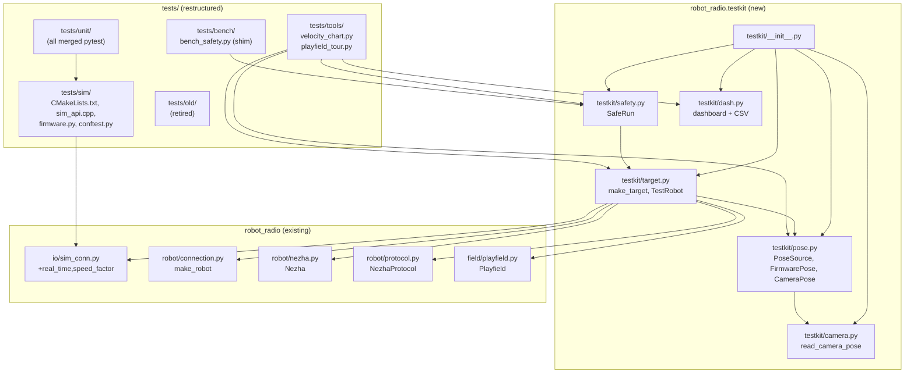

<!-- CLASI: Before changing code or making plans, review the SE process in CLAUDE.md -->

# Architecture Update — Sprint 037: Consolidate tests into one tree; target-switchable tools (sim/bench/production)

## What Changed

### New: `robot_radio.testkit` subpackage

New directory `host/robot_radio/testkit/` containing six modules:

| Module | Purpose |
|--------|---------|
| `__init__.py` | Re-exports public API: `make_target`, `TestRobot`, `PoseSource`, `FirmwarePose`, `CameraPose`, `SafeRun`, `read_camera_pose` |
| `target.py` | `TestRobot` dataclass + `make_target` factory — the single entry point for constructing a target-appropriate `Nezha` |
| `pose.py` | `PoseSource` protocol, `FirmwarePose`, `CameraPose` — uniform pose-read interface across targets |
| `safety.py` | `SafeRun` — generalized `BenchRun`: liveness preflight, SIGINT→STOP, wall-clock cap, runaway detection; sim-aware (no-op preflight on sim target) |
| `camera.py` | `read_camera_pose(playfield, tag_id, n, timeout)` — circular-mean averaging extracted from three duplicated sites |
| `dash.py` | Live matplotlib multi-panel dashboard + CSV logging, extracted from `velocity_chart.py` |

`target.py` depends on: `robot_radio.robot.nezha.Nezha`, `robot_radio.robot.protocol.NezhaProtocol`, `robot_radio.io.sim_conn.SimConnection`, `robot_radio.robot.connection.make_robot`, `robot_radio.field.playfield.Playfield`. Camera and daemon imports are lazy (guarded inside `make_target` when `camera=` is passed) so `import robot_radio` continues to work without a live daemon.

### Modified: `SimConnection` — `real_time` pacing flag

`host/robot_radio/io/sim_conn.py` gains two new constructor parameters:
- `real_time: bool = False` — when `True`, sleep `tick_step_ms / 1000 / speed_factor` after each sim tick, pacing to wall-clock.
- `speed_factor: float = 1.0` — divides the sleep interval to run faster or slower than real time.

The `_advance` inner loop gains an `import time; time.sleep(...)` call conditioned on `self._real_time`. Default is `False`, so CI and all existing sim tests are unaffected.

`host_tests/firmware.py` (moving to `tests/sim/firmware.py`) gains a matching `real_time: bool = False` parameter to `Sim.tick_for`.

### Modified: `sim_conn.py` — dlopen path update

`_DEFAULT_LIB` changes from `../../../host_tests/build/` to `../../../tests/sim/build/` (resolving relative to `host/robot_radio/io/`).

### New: `tests/tools/velocity_chart.py`

Ported from `tests/bench/velocity_chart.py`. Adds `--target {sim,bench,production}` and `--real-time/--full-speed` flags. Dashboard logic delegates to `testkit.dash`. Driving delegates to `testkit.target.make_target`. Old `tests/bench/velocity_chart.py` is retired to `tests/old/`.

### New: `tests/tools/playfield_tour.py`

Unified tour tool. Adds `--target`, `--pose {firmware,camera}`, `--real-time/--full-speed`. One control loop modeled on `playfield_tour_drive.py`'s `drive_leg` pattern, driving through `Nezha.go_to(on_tick=cb)` and reading pose through `PoseSource`. Waypoints load from `data/aprilcam/playfield.json`. Retired: `tour_goto.py`, `playfield_tour_drive.py`, `playfield_tour_camera.py`, `playfield_random_tour.py`, `camera_drive.py`.

### Directory restructure: `tests/` becomes the single test tree

| From | To | Notes |
|------|----|-------|
| `host_tests/CMakeLists.txt` | `tests/sim/CMakeLists.txt` | REPO_ROOT `../` → `../..` |
| `host_tests/sim_api.cpp` | `tests/sim/sim_api.cpp` | No content change |
| `host_tests/firmware.py` | `tests/sim/firmware.py` | Add `real_time` param to `Sim.tick_for` |
| `host_tests/conftest.py` | `tests/sim/conftest.py` | `_HOST_TESTS`/`_BUILD_DIR` paths → `tests/sim`; add `sys.path` for `from firmware import Sim` and `from robot_radio.testkit import ...` |
| `host_tests/unit/` | `tests/unit/` (merged) | All maintained sim pytest |
| `tests/dev/test_*.py` | `tests/unit/` (merged) | All maintained firmware-logic pytest |
| `host/tests/` | `tests/unit/` (merged) | All maintained robot_radio library pytest |
| `tests/bench/velocity_chart.py` | `tests/old/` | Superseded by `tests/tools/velocity_chart.py` |
| `tests/playfield_tour/tour_goto.py` | `tests/old/` | Superseded by `tests/tools/playfield_tour.py` |
| `host_tests/playfield_tour/playfield_tour_drive.py` etc. | `tests/old/` | Superseded |
| `tests/dev/` non-`test_*.py` scripts | `tests/old/` | One-offs / probes |
| `host_tests/dev/*.ipynb` | `tests/old/` | Demo notebooks |
| `host_tests/CLAUDE.md` | removed | |
| `tests/CLAUDE.md` | updated | Documents new tree layout |

### Modified: root `pyproject.toml`

`[tool.pytest.ini_options]`: `testpaths = ["tests"]`; `norecursedirs` updated to include `tests/old`, `tests/sim/build`, `tests/bench`, `tests/calibrate`, `tests/tools`; drop `host/tests` and `host_tests` references.

### Modified: `build.py`

`build_host_sim()`: `cmake -S host_tests -B host_tests/build` → `cmake -S tests/sim -B tests/sim/build`; summary path updated to match.

### Retained: `tests/bench/bench_safety.py`

Kept as a thin re-export shim: `from robot_radio.testkit.safety import SafeRun as BenchRun`. Existing bench scripts that `from bench_safety import BenchRun` continue to work.

---

## Why

Three test roots (`tests/`, `host_tests/`, `host/tests/`) force constant guessing about where a test lives and what backend it targets. Discovering the test for a feature requires checking three trees; adding a new test requires choosing the "right" root without clear rules; CI must configure three separate pytest discovery passes.

The enabling insight (verified in sprint 036): `SimConnection` is already a drop-in for `SerialConnection`, so a simple connection factory (`make_target`) unifies all three targets behind one `Nezha` API. The target switch is a construction-time concern, not a runtime branch in test logic. `DBG OTOS BENCH 1` works identically on `MockHAL` (sim) and `NezhaHAL` (bench), so sim-OTOS is not a special case.

The `real_time` flag addresses the gap between CI (needs fast ticks) and interactive tool use (needs lifelike timing). Adding it to `SimConnection` rather than callers keeps the policy in one place.

---

## Impact on Existing Components

| Component | Before | After |
|-----------|--------|-------|
| `host/robot_radio/io/sim_conn.py` | dlopen at `host_tests/build/`; no real_time flag | dlopen at `tests/sim/build/`; `real_time`, `speed_factor` params added |
| `tests/sim/CMakeLists.txt` | Was `host_tests/CMakeLists.txt`; REPO_ROOT = `../` | Moved; REPO_ROOT = `../..` |
| `build.py` `build_host_sim()` | Builds to `host_tests/build/` | Builds to `tests/sim/build/` |
| Root `pyproject.toml` | `testpaths` includes `host_tests`, `host/tests` | `testpaths = ["tests"]` only |
| `tests/bench/bench_safety.py` | `BenchRun` class defined here | Re-export shim; `BenchRun = SafeRun` |
| `host_tests/unit/` (sim pytest) | Separate from `tests/dev/test_*.py` | All merged into `tests/unit/` |
| `host/tests/` (library pytest) | Third separate root | Merged into `tests/unit/` |
| `robot_radio.testkit` | Does not exist | New subpackage |
| `tests/tools/` | Does not exist | New directory with `velocity_chart.py`, `playfield_tour.py` |
| `tests/old/` | Does not exist | New directory for retired one-offs |

---

## Module Dependency Diagram

---

## Migration Concerns

1. **Atomic path update risk**: `pyproject.toml`, `build.py`, `tests/sim/conftest.py`, `tests/sim/CMakeLists.txt`, and `sim_conn.py` must all be updated in a single commit — the suite will fail partially if any one of these is stale. The ticket that does the directory move is explicitly gated on the full suite passing after all five are updated.

2. **`from firmware import Sim` preservation**: This import is widespread in sim tests. It is preserved via `tests/sim/conftest.py` adding `tests/sim/` to `sys.path` — no per-test-file edits. The conftest approach is the same as the current `host_tests/conftest.py` pattern.

3. **`tests/bench/bench_safety.py` shim**: Existing bench scripts that import `BenchRun` from `bench_safety` continue to work. The shim is a one-liner re-export; no callers need to change.

4. **`host/tests/` removal**: The `host/tests/` pytest are merged into `tests/unit/`. The `host/pyproject.toml` or equivalent must have its pytest `testpaths` reference removed or updated; root `pyproject.toml` takes over discovery.

5. **Camera/daemon lazy imports**: `testkit/camera.py` and the `CameraPose` path in `testkit/pose.py` import `aprilcam` / the daemon client lazily. `import robot_radio` or `from robot_radio.testkit import make_target` must not fail in environments without a live camera daemon.

---

## Design Rationale

### Decision: `make_target` as a connection factory in `testkit`, not a CLI argument parser

- **Context**: Each tool needs a connected `Nezha` + pose source + safety wrapper. If target wiring lives in each tool, it is duplicated.
- **Alternatives**: (a) Per-tool argparse + wiring (status quo). (b) A shared `make_target` factory in `testkit` (chosen). (c) A subclass per target.
- **Why**: A factory keeps target-specific decisions (SimConnection vs SerialConnection, sim-OTOS default, pose source selection) in one place. Tools become thin drivers. The `TestRobot` dataclass is the narrow interface between factory and tool.
- **Consequences**: Any tool that calls `make_target` is inherently target-agnostic. Adding a fourth target requires changing only `make_target`.

### Decision: `real_time` flag on `SimConnection`, not on the tool loop

- **Context**: Pacing can be done by the tool (sleep in the tool loop) or by the connection (sleep inside `_advance`).
- **Why**: `SimConnection._advance` is the single tick-advance path; sleeping there is the only place that covers all callers (tools, unit tests, `NezhaProtocol.wait_for_evt_done`). A tool-level sleep would not pace the `read_lines` calls inside `wait_for_evt_done`.
- **Consequences**: `real_time=True` slows down any code that calls `_advance`, including `wait_for_evt_done`. This is the intended behavior for interactive tool use.

### Decision: Merge all pytest into `tests/unit/`, not separate subdirectories per origin

- **Context**: Three origins (library, firmware-logic, firmware-sim) could each get a subdirectory.
- **Why**: pytest discovery is simpler with one flat `tests/unit/` tree. Test files are named descriptively (e.g. `test_sim_*.py`, `test_velocity_controller.py`). The conftest fixture that loads the sim lib applies to all tests in `tests/` via normal conftest scope.
- **Consequences**: The conftest at `tests/sim/conftest.py` provides the `sim` fixture; tests that do not use the `sim` fixture skip the build check. This matches current behavior.

### Decision: Retire superseded scripts to `tests/old/` rather than deleting them

- **Context**: `tests/dev/` one-offs and demo notebooks contain hard-won debugging procedures.
- **Why**: Moving to `tests/old/` preserves the scripts for reference without cluttering the active tree. The `tests/old/` directory is excluded from pytest collection.
- **Consequences**: `tests/old/` accumulates over time; a future sweep can delete confirmed-dead scripts.

---

## Open Questions

None. All design decisions are resolved by the locked-decisions in the issue document and the grounding verification documented in the sprint prompt.
