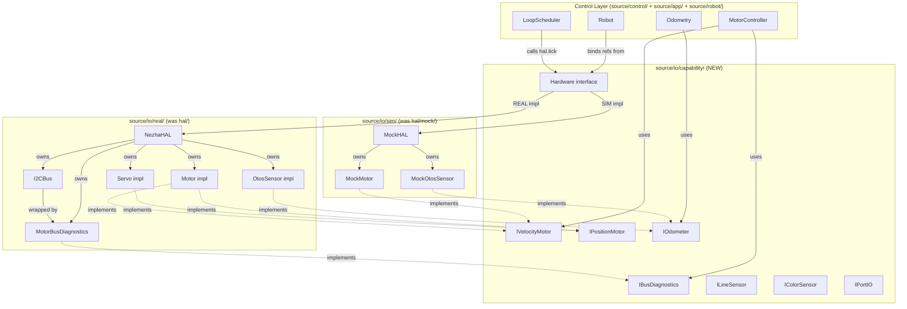
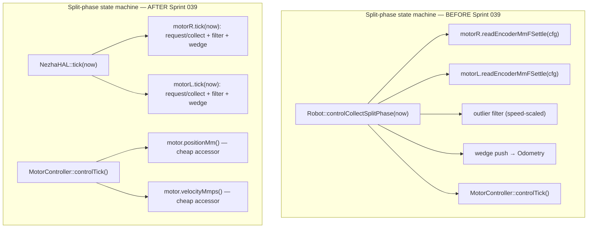

<!-- CLASI: Before changing code or making plans, review the SE process in CLAUDE.md -->

# Architecture Update — Sprint 039: Phase A — Capability-typed device layer

## What Changed

### 1. New `source/io/capability/` directory — seven capability interface headers

Seven pure-virtual interface headers are created under `source/io/capability/`. Each
defines a capability (what a device does) rather than a device (what a device is):

| Header | Interface | Replaces | Action |
|--------|-----------|----------|--------|
| `IVelocityMotor.h` | `IVelocityMotor` | `IMotor` (drive-wheel subset) | split from IMotor |
| `IPositionMotor.h` | `IPositionMotor` | `IMotor` (position subset) + `IServo` | split + fold |
| `IOdometer.h` | `IOdometer` | `IOtosSensor` | rename + seal |
| `IBusDiagnostics.h` | `IBusDiagnostics` | n/a (new) | new — seals I2CBus leak |
| `ILineSensor.h` | `ILineSensor` | `ILineSensor` | keep (moved) |
| `IColorSensor.h` | `IColorSensor` | `IColorSensor` | keep (moved) |
| `IPortIO.h` | `IPortIO` | `IPortIO` | keep (moved) |

**Interface method taxonomy:**
- `IVelocityMotor`: `setOutput(int8_t pct)`, `positionMm()`, `velocityMmps()`, `resetPosition()`, `setNeutralMode()`, `begin()`, `tick(uint32_t now_ms)`.
  Secondary-capability discovery: `virtual IPositionMotor* asPositionMotor() { return nullptr; }`.
- `IPositionMotor`: `setAngleDeg(uint16_t deg, uint8_t mode)`, `currentAngleDeg()`.
- `IOdometer`: all prior `IOtosSensor` methods but with `RobotConfig&` removed from
  public read signatures; uses `Pose2D` / `BodyTwist` / `BodyAccel` value types.
  `OtosSensor` gains a constructor-injected `const RobotConfig&` member.
- `IBusDiagnostics`: `errorCount()`, `reentryViolations()`, `lastError()`.

All signatures use `int8_t`, `float`, `uint16_t`, `bool`, `uint32_t`, or the new SI
value structs: `Pose2D { float x, y, h; }`, `BodyTwist { float v_mmps, omega_rads; }`,
`BodyAccel { float ax_mmps2, ay_mmps2; }`. No `MicroBit.h`, `I2CBus`, or `RobotConfig&`
in any capability-header signature.

### 2. Alias shims — incremental transition without caller changes

The old `source/hal/I*.h` headers are updated to become alias shims:

```cpp
// source/hal/IMotor.h — becomes a shim (deleted in Phase F)
#include "io/capability/IVelocityMotor.h"
using IMotor = IVelocityMotor;

// source/hal/IServo.h — becomes a shim
#include "io/capability/IPositionMotor.h"
using IServo = IPositionMotor;

// source/hal/IOtosSensor.h — becomes a shim
#include "io/capability/IOdometer.h"
using IOtosSensor = IOdometer;
using OtosPose     = Pose2D;
using OtosVelocity = BodyTwist;
using OtosAccel    = BodyAccel;
```

All existing callers (`Robot`, `MotorController`, `Odometry`, `MockMotor`, `MockOtosSensor`,
`sim_api.cpp`, all 73 sim tests) continue to compile without modification.

### 3. IBusDiagnostics + MotorBusDiagnostics — sealing the I2CBus leak

A new `MotorBusDiagnostics` adapter implements `IBusDiagnostics`:

```
source/io/capability/IBusDiagnostics.h     — pure-virtual interface
source/io/real/MotorBusDiagnostics.h/.cpp  — adapter: wraps I2CBus& (addr 0x10)
```

`NezhaHAL` owns `MotorBusDiagnostics _busDiag` as a value member (bound to `_bus`).
`NezhaHAL` exposes `IBusDiagnostics& busDiagnostics()` so `main.cpp` can bind it.

`MotorController` is updated:
- `setI2CBus(I2CBus* bus)` → `setBusDiagnostics(IBusDiagnostics* diag)`.
- `_i2cBus` member removed; `_busDiag` replaces it.
- `MotorController.h` drops `#include "MicroBit.h"` and the `I2CBus` forward declaration.
- `MotorController.cpp` drops `#include "I2CBus.h"` (diagnostics reached via the interface).

`DebugCommandable.cpp` currently includes `I2CBus.h` inside `#ifndef HOST_BUILD`. That
guard remains; no change needed for DebugCommandable at this step — it accesses `I2CBus`
via the `NezhaHAL*` already held (firmware-only path, below the IO boundary).

The vendor-confinement baseline entries for `MotorController.h` and `MotorController.cpp`
are removed from `tests/_infra/vendor_baseline.txt`.

### 4. Split-phase state machine moves from Robot into Motor impl

Today `Robot::controlCollectSplitPhase` owns:
1. The encoder read sequence (read both, right first).
2. The speed-scaled outlier filter.
3. The wedge-detect push into `Odometry`.

After this sprint, `Motor` owns all three, driven by `IVelocityMotor::tick(now_ms)`:

```
Motor::tick(now_ms)
  ├── issue requestEncoder() (0x46 write) on even call
  ├── on next call: collectEncoder() → apply outlier filter → store _lastPositionMm
  ├── differentiate _lastPositionMm over _lastTimestampMs → store _lastVelocityMmps
  └── advance wedge detector; expose wedgeActive() flag
```

`NezhaHAL::tick(now_ms)` calls `_motorL.tick(now_ms)` then `_motorR.tick(now_ms)`.
The cooperative-loop idle period (≥ 10 ms) provides the inter-phase settling time the
hardware requires between requestEncoder and collectEncoder — this is unchanged.

`MotorController::controlTick()` replaces `readEncoderMmFSettle(cfg)` calls with
`positionMm()` and `velocityMmps()` accessor calls. It still calls `setSpeed()` (→
`setOutput()`).

`Robot::controlCollectSplitPhase` is removed. Its three call sites are updated:
- `LoopScheduler::run_blocks()` — the encoder read happened BEFORE `loopTickOnce`; now
  `hal.tick(now_ms)` (which calls `Motor::tick`) handles this; the explicit
  `controlCollectSplitPhase` call is removed. `hal.tick(now_ms)` is now called once
  before `loopTickOnce` (the second `hal.tick(now_ms, cmds)` inside `loopTickOnce` is
  the actuator-state tick and remains).
- `sim_api.cpp` (two sites) — same: `hal.tick(now_ms)` before `loopTickOnce`.
- `WedgeTest.cpp` — calls `controlCollectSplitPhase` directly; replaced with
  `hal.tick(now_ms)` + reading motor state.

The `MockMotor` in `source/hal/mock/` gains `tick(now_ms)` / `positionMm()` /
`velocityMmps()` implementations; its existing encoder-integration logic is unchanged
in semantics. `MockHAL::tick(now_ms)` calls each mock motor's `tick()`.

**Timing invariant preserved:** I2C bytes on the wire are identical. The split-phase
timing (request in one loop iteration, collect in the next) is preserved — `Motor::tick`
alternates request/collect across consecutive calls, with the loop idle providing the
settle window. The golden-TLM canary guards byte-exact behavior.

### 5. IMotor → IVelocityMotor + IPositionMotor split; IServo fold

`Motor` implements both `IVelocityMotor` and `IPositionMotor`:

```cpp
class Motor : public IVelocityMotor {
public:
    IPositionMotor* asPositionMotor() override { return &_posImpl; }
    ...
private:
    MotorPositionImpl _posImpl;  // thin inner impl for moveToAngle / timedMove
};
```

`Servo` implements `IPositionMotor` only (no `IVelocityMotor`):

```cpp
class Servo : public IPositionMotor {
public:
    void setAngleDeg(uint16_t deg, uint8_t mode) override;
    uint16_t currentAngleDeg() const override;
};
```

`Hardware::gripper()` returns `IPositionMotor&` (was `IServo&`).
`ServoController` stores `IPositionMotor&` (was `IServo&`) — the methods it calls
(`setAngleDeg`, `currentAngleDeg`) are the same semantics.

`MockServo` implements `IPositionMotor`.
`MockMotor` implements `IVelocityMotor` (and optionally `IPositionMotor` via `asPositionMotor()` returning `nullptr` by default).

### 6. IOtosSensor → IOdometer; Pose2D / BodyTwist; RobotConfig& sealed

`IOdometer` (at `source/io/capability/IOdometer.h`) replaces `IOtosSensor`.

**Value types** (defined in `IOdometer.h`, replacing the old structs in `IOtosSensor.h`):
```cpp
struct Pose2D    { float x, y, h; };          // mm, mm, rad
struct BodyTwist { float v_mmps, omega_rads; }; // mm/s, rad/s
struct BodyAccel { float ax_mmps2, ay_mmps2; }; // mm/s²
```

**Signature changes** (the RobotConfig seal):
- `readTransformed(const RobotConfig& cfg, OtosPose& out, float headingRad)` →
  `readTransformed(Pose2D& out, float headingRad = 0.0f)` (no cfg parameter).
- `readVelocityTransformed(cfg, out, headingRad)` → `readVelocityTransformed(BodyTwist&, float)`.
- `readAccelTransformed(cfg)` → `readAccelTransformed()`.
- `setWorldPose(cfg, x, y, h)` → `setWorldPose(float x_mm, float y_mm, float h_rad)`.

`OtosSensor` implementation: gains `const RobotConfig& _cfg` as a constructor-injected
member (passed at `NezhaHAL` construction time). All internal calls to `cfg` fields use
`_cfg`. No functional change — `RobotConfig` is now an impl concern, not an interface one.

The raw-register methods (`getPositionRaw`, `setPositionRaw`, `getLinearScalar`, etc.)
and calibration methods (`calibrateImu`, `resetTracking`, `init`) stay on `IOdometer`
because the OTOS command handlers (`OI/OZ/OR` etc.) need them through the interface
pointer. These methods carry no `RobotConfig&` parameter — they are already correct.

`MockOtosSensor` is updated to implement `IOdometer` with the new signatures.

### 7. hal/ → io/ directory move; ROBOT_RUN_MODE CMake variable

**Directory layout after Sprint 039:**

```
source/
  io/
    capability/   IVelocityMotor.h  IPositionMotor.h  IOdometer.h
                  IBusDiagnostics.h  ILineSensor.h  IColorSensor.h  IPortIO.h
    real/         Motor.cpp  Motor.h  OtosSensor.cpp  OtosSensor.h
                  NezhaHAL.cpp  NezhaHAL.h  I2CBus.cpp  I2CBus.h
                  LineSensor.cpp  LineSensor.h  ColorSensor.cpp  ColorSensor.h
                  Servo.cpp  Servo.h  PortIO.cpp  PortIO.h
                  BenchOtosSensor.cpp  BenchOtosSensor.h
                  MotorBusDiagnostics.cpp  MotorBusDiagnostics.h
                  Communicator.cpp  Communicator.h  SerialPort.*  Radio.*  RadioChannel.*
    sim/          MockHAL.cpp  MockHAL.h  MockMotor.*  MockOtosSensor.*
                  MockLineSensor.*  MockColorSensor.*  MockServo.*  MockPortIO.*
                  (additional Phase B files scaffolded empty)
    Hardware.h    (at io/ root)
    ReplayHAL.cpp (stub — RobotMode::REPLAY)
  hal/            (does not exist after T5)
```

During the transition (tickets T1–T4), `source/hal/` still exists with alias shims.
The directory rename (`hal/` → `io/`) happens in T5.

**CMake `ROBOT_RUN_MODE`:**

The sim `CMakeLists.txt` currently uses:
```cmake
file(GLOB MOCK_SOURCES "${REPO_ROOT}/source/hal/mock/*.cpp")
list(FILTER APP_SOURCES EXCLUDE REGEX ".*/WedgeTest\\.cpp$")
list(FILTER CONTROL_SOURCES EXCLUDE REGEX ".*/LoopScheduler\\.cpp$")
```

After T5, the sim `CMakeLists.txt` uses:
```cmake
set(ROBOT_RUN_MODE "SIM" CACHE STRING "Build target: REAL | SIM | REPLAY")
file(GLOB SIM_SOURCES "${REPO_ROOT}/source/io/sim/*.cpp")
# REAL sources excluded (NezhaHAL, I2CBus, Motor.cpp etc.) — not globbed
```

`build.py` passes `-DROBOT_RUN_MODE=REAL` to the firmware CMake and continues to call
`cmake -S tests/_infra/sim -B tests/_infra/sim/build -DROBOT_RUN_MODE=SIM`.
`PRODUCTION_BUILD` and `BENCH_OTOS_ENABLED` remain orthogonal flags.

**Vendor-confinement gate:** The scope comment in `test_vendor_confinement.py` is
updated from "above `source/hal/`" to "above `source/io/`". The baseline file
`tests/_infra/vendor_baseline.txt` shrinks as leaks are sealed.

---

## Why

The Phase 0 canaries establish the safety net. Phase A is the first real source change:
it introduces the capability-typed device seam that all subsequent phases depend on
(§1 of the migration issue). The changes in this sprint are strictly structural:

- **Capability naming** makes the device layer describe behaviour, not hardware: any
  implementation (real, sim, bench, future) that satisfies a capability can be swapped
  in. The control layer never sees a vendor type.
- **Sealing `MotorController.h`** is necessary before Phase B: `MockHAL` is included
  in the host build, and a `MicroBit.h` in `MotorController.h` forces a HOST_BUILD
  guard across the entire control layer — eliminating it cleans up the build model.
- **Moving the split-phase state machine into Motor** is the prerequisite for Phase B's
  `SimMotor` (which will implement `IVelocityMotor` with a `PhysicsWorld` instead of
  I2C). A split-phase method on the abstract interface would force every sim impl to
  stub request/collect. Moving it into the impl removes the protocol detail from the
  interface.
- **`hal/` → `io/` + `ROBOT_RUN_MODE`** replaces a fragile glob-then-filter pattern
  with an explicit, self-documenting build variable, matching the §5 directory spec.

---

## Impact on Existing Components

| Component | Before | After |
|-----------|--------|-------|
| `MotorController.h` | `#include "MicroBit.h"` (guarded); `I2CBus*`; `setI2CBus(I2CBus*)` | No MicroBit include; `IBusDiagnostics*`; `setBusDiagnostics(IBusDiagnostics*)` |
| `MotorController.cpp` | `#include "I2CBus.h"` | No I2CBus include; uses `IBusDiagnostics*` |
| `Robot::controlCollectSplitPhase` | Owned encoder read + outlier filter + wedge push | Removed; logic lives in `Motor::tick()` |
| `Robot` (constructor, state) | Binds `motorL`, `motorR` as `IMotor&` | Binds as `IVelocityMotor&`; alias keeps existing code compiling |
| `Hardware::motorL/R()` | Returns `IMotor&` | Returns `IVelocityMotor&` (alias makes this transparent) |
| `Hardware::gripper()` | Returns `IServo&` | Returns `IPositionMotor&` |
| `Hardware::otos()` | Returns `IOtosSensor&` | Returns `IOdometer&` |
| `NezhaHAL` | Owns `I2CBus _bus`; `bus()` exposed to main.cpp | Adds `MotorBusDiagnostics _busDiag`; `busDiagnostics()` exposed to main.cpp; `bus()` remains for DebugCommandable |
| `LoopScheduler::run_blocks()` | Calls `robot.controlCollectSplitPhase(now, 0)` | Calls `robot.hal.tick(now_ms)` (or equivalent) before `loopTickOnce` |
| `sim_api.cpp` (two sites) | Calls `robot.controlCollectSplitPhase(t, 0)` | Calls `hal.tick(t)` before `loopTickOnce` |
| `WedgeTest.cpp` | Calls `robot->controlCollectSplitPhase(now, 0)` | Calls `hal.tick(now)` (or equivalent) |
| `Motor` impl | `IMotor` subclass; no `tick()` | `IVelocityMotor` subclass; gains `tick(now_ms)`, `positionMm()`, `velocityMmps()`; split-phase state owned here |
| `MockMotor` | `IMotor` subclass; encoder state via `collectEncoder()` | `IVelocityMotor` subclass; gains `tick()`, `positionMm()`, `velocityMmps()` |
| `Servo` | `IServo` subclass | `IPositionMotor` subclass |
| `MockServo` | `IServo` subclass | `IPositionMotor` subclass |
| `OtosSensor` | `IOtosSensor`; `readTransformed(cfg, out, heading)` | `IOdometer`; `readTransformed(out, heading)` (cfg stored as member) |
| `MockOtosSensor` | `IOtosSensor`; same signature | `IOdometer`; new signature |
| `BenchOtosSensor` | `IOtosSensor` | `IOdometer`; signature updated |
| `source/hal/*.h` (shims) | Canonical interface definitions | Alias-only shims (deleted in Phase F) |
| `tests/_infra/vendor_baseline.txt` | Includes `MotorController.h`, `MotorController.cpp` I2CBus/MicroBit entries | Shrinks; `MotorController.*` entries removed |
| `tests/_infra/sim/CMakeLists.txt` | `list(FILTER MOCK_SOURCES EXCLUDE REGEX hal/mock)` | `ROBOT_RUN_MODE=SIM`; globs `io/sim/`; old filter removed |
| `main.cpp` | `motorController.setI2CBus(&hardware.bus())` | `motorController.setBusDiagnostics(&hardware.busDiagnostics())` |

---

## Component/Module Diagram





---

## Migration Concerns

1. **Incremental green-between-tickets.** Each ticket (T1–T5) must leave both the host
   build and the simulation tier green. Alias shims carry callers across the rename
   boundary without modification.

2. **Split-phase timing.** Moving request/collect into `Motor::tick` is safe only if
   the cooperative loop continues to call `hal.tick(now)` once per iteration
   **before** `loopTickOnce`. The existing call ordering in `LoopScheduler::run_blocks`
   already calls `controlCollectSplitPhase` before `loopTickOnce`; replacing it with
   `hal.tick(now)` preserves the ordering. `sim_api.cpp` has two call sites; both must
   be updated atomically with the Motor impl change.

3. **`WedgeTest.cpp` is CODAL-only.** `WedgeTest.cpp` calls
   `robot->controlCollectSplitPhase(now, 0)`. After T3, this call site must be updated
   to `robot->hal.tick(now)` (or equivalent). Since `WedgeTest.cpp` is excluded from
   the host build, this is a firmware-only change that cannot be verified by the sim
   suite — it must be verified by careful textual review plus `build.py` if the ARM
   toolchain is available.

4. **Golden-TLM canary.** The golden-TLM test is byte-exact. If any motor-state
   accessor value changes by even one tick due to a timing-phase shift in the
   split-phase state machine, the canary fails. The rule: move bodies VERBATIM; change
   no numerics. The outlier filter threshold constants and the wedge counter threshold
   must be bit-for-bit identical post-move.

5. **`OtosSensor` constructor signature.** Adding `const RobotConfig& cfg` to the
   `OtosSensor` constructor means `NezhaHAL` (which constructs `OtosSensor`) must pass
   `cfg` at construction time. `NezhaHAL` already receives `cfg` at construction; this
   is a straightforward member addition.

6. **`BenchOtosSensor` signature update.** `BenchOtosSensor` implements `IOtosSensor`
   (→ `IOdometer`). Its `readTransformed` signature must be updated to match. Since
   `BenchOtosSensor` is compiled in both HOST_BUILD and BENCH_OTOS_ENABLED builds, both
   paths must be updated atomically.

7. **Host-build-only verification.** The programmer can compile-verify the host build
   at every ticket step. The firmware (CODAL/ARM) build requires the ARM toolchain
   (`python3 build.py`). If the toolchain is absent, CODAL-only files (`Motor.cpp`'s
   I2C calls, `NezhaHAL.cpp`, `WedgeTest.cpp`, `LoopScheduler.cpp`) must be reviewed
   carefully for consistency. These files are noted per-ticket as "ARM-verify" items.

---

## Design Rationale

### Decision: `tick(now_ms)` on `IVelocityMotor` rather than a separate `ITickable` interface

- **Context**: The split-phase state machine runs once per cooperative-loop iteration.
  It could live in a separate `ITickable` interface, or be folded into `IVelocityMotor`.
- **Alternatives**: (a) Separate `ITickable` with `tick(now_ms)`. (b) `tick` on
  `IVelocityMotor` (chosen). (c) Leave split-phase in `Hardware::tick` at the HAL level,
  with `Motor` providing only a stateless request + collect pair.
- **Why**: `IVelocityMotor::tick` keeps the method at the same abstraction level as
  the other drive-wheel operations (`setOutput`, `positionMm`). It avoids a second
  interface hierarchy with no other members. Alternative (c) keeps the protocol detail
  visible at the HAL level and does not simplify the Motor impl.
- **Consequences**: Sim motor implementations (`MockMotor`, later `SimMotor`) must also
  implement `tick(now_ms)` — but their implementation is trivial (integrate velocity
  into position using `dt`).

### Decision: RTTI-free secondary-capability discovery via `asPositionMotor()`

- **Context**: `Motor` supports both `IVelocityMotor` and `IPositionMotor`. The control
  layer needs to query whether a given `IVelocityMotor` also supports position control.
- **Alternatives**: (a) `dynamic_cast<IPositionMotor*>(&motor)` — requires RTTI
  (`-frtti`); firmware is likely compiled with `-fno-rtti`. (b) A boolean flag
  `supportsPositionControl()`. (c) Virtual accessor `asPositionMotor()` returns
  `IPositionMotor*` (chosen).
- **Why**: Accessor pattern is established FRC Elite practice (issue §1). It is
  RTTI-free, explicit, and zero-cost (one vtable slot). The boolean-flag alternative
  requires a cast anyway. Pattern is already documented in the migration issue.
- **Consequences**: Every `IVelocityMotor` impl must override `asPositionMotor()` or
  accept the `nullptr` default. `MockMotor` returns `nullptr` by default — correct
  for the drive-wheel simulation.

### Decision: `RobotConfig&` removed from `IOdometer` public signatures; stored in impl

- **Context**: `IOtosSensor::readTransformed(cfg, out)` passes a `RobotConfig&` so the
  impl can apply LSB scaling and mount-transform. This leaks a calibration-data type
  through the interface.
- **Alternatives**: (a) Keep `RobotConfig&` in the signature. (b) Pass the
  pre-computed scalars at construction time. (c) Store `RobotConfig&` as an impl member
  (chosen).
- **Why**: The migration issue locks this decision (§1 "RobotConfig& stays as an impl
  member"). Constructor injection is simpler than decomposing the config into scalars
  (which would require changing how `OtosSensor` is constructed and potentially
  invalidate the golden-TLM canary).
- **Consequences**: `OtosSensor(I2CBus&, const RobotConfig&)` — `NezhaHAL` already has
  `cfg` at construction time. `MockOtosSensor` / `BenchOtosSensor` must also accept
  the ref; they can ignore it internally (they already have their own mock state).

### Decision: `MotorBusDiagnostics` adapter as a separate class owned by NezhaHAL

- **Context**: `MotorController` currently stores a raw `I2CBus*` to read error
  counters when emitting `EVT enc_wedged`. The goal is to remove `I2CBus` from
  `MotorController`.
- **Alternatives**: (a) Inline `errorCount` fields on `MotorController` (breaks the
  actual real-time values). (b) Pass counts as parameters to `controlTick`. (c)
  Adapter implementing `IBusDiagnostics` (chosen).
- **Why**: Adapter pattern decouples the controller from the bus type. The adapter is
  one header + a few forwarding methods. Any future bus type (SPI, CAN) that exposes
  the same `IBusDiagnostics` interface works without touching `MotorController`.
- **Consequences**: `NezhaHAL` owns the adapter; `main.cpp` binds it. The `HOST_BUILD`
  `MockHAL` supplies a null `IBusDiagnostics*` or a stub (zeroes); `MotorController`
  already handles null `_i2cBus` gracefully (stats show zeros), so the same pattern
  applies to `_busDiag`.

---

## Open Questions

1. **WedgeTest ARM verification.** `WedgeTest.cpp` is CODAL-only and calls
   `robot->controlCollectSplitPhase`. After T3, it must call `robot->hal.tick(now)` or
   equivalent. If the programmer does not have the ARM toolchain, the change can only
   be verified by textual inspection. **Decision needed:** Is ARM-toolchain verification
   required as a gate before T3 merges, or is textual review + the sim suite green
   sufficient for a structural-only call-site rename?

2. **`MockMotor` tick-dt accuracy.** `MockMotor` currently integrates velocity into
   position via the `_encoderMm` field set by `sim_api.cpp` calling `hal.tick(t, cmds)`.
   After the split-phase move, `MockMotor::tick(now_ms)` must do the integration itself
   (using the elapsed `dt`). If the existing integration in `sim_api.cpp` and
   `MockHAL::tick(now_ms, cmds)` is kept as the integration path, `MockMotor::tick(now_ms)`
   only needs to advance the accessor values (no double-integration). **Clarification
   needed:** Should `MockMotor::tick` integrate from velocity, or simply promote the
   last-set `_encoderMm` into `positionMm()`? The safer answer (avoiding double-
   integration) is: keep `MockHAL::tick(now_ms, cmds)` as the only integration site;
   `MockMotor::tick(now_ms)` is a no-op or copies `_encoderMm` → `_lastPositionMm`.

3. **`readEncoderMmFAtomic` / `readEncoderMmFSettle` retention.** These two methods
   exist on the current `IMotor` interface and are used by `startDriveClean` / `stop`
   in `MotorController` for position snapshots outside the control tick. After the
   interface split, they are not on `IVelocityMotor` (they leak the "two timing
   variants" protocol detail). Do they move to `IPositionMotor`, or remain only on the
   `Motor` concrete impl (accessed via `asPositionMotor()` cast), or stay as additional
   methods on `IVelocityMotor`?
   **Recommendation:** Keep `readEncoderMmFAtomic` as a concrete-Motor-only method for
   now (called via `static_cast<Motor*>(&motorL)` in the one `startDriveClean` site
   that needs an atomic snapshot), or expose it on `IVelocityMotor` as a default-no-op
   with the Motor override. The latter is cleaner and avoids a downcast. Phase F can
   revisit. Flag for programmer decision.
