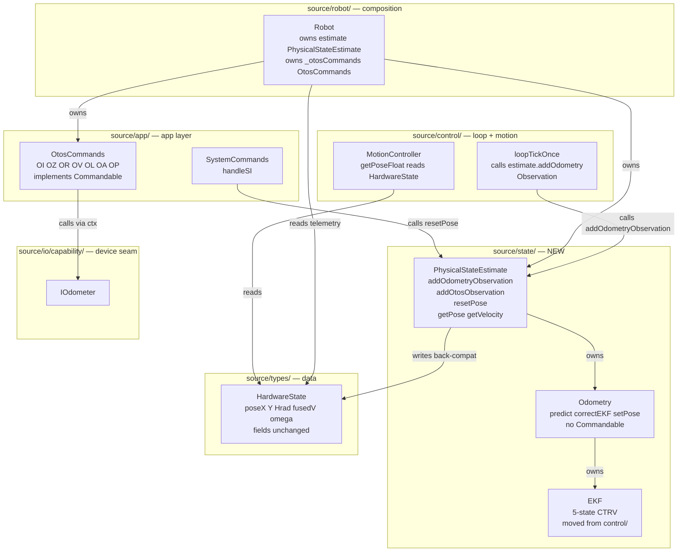
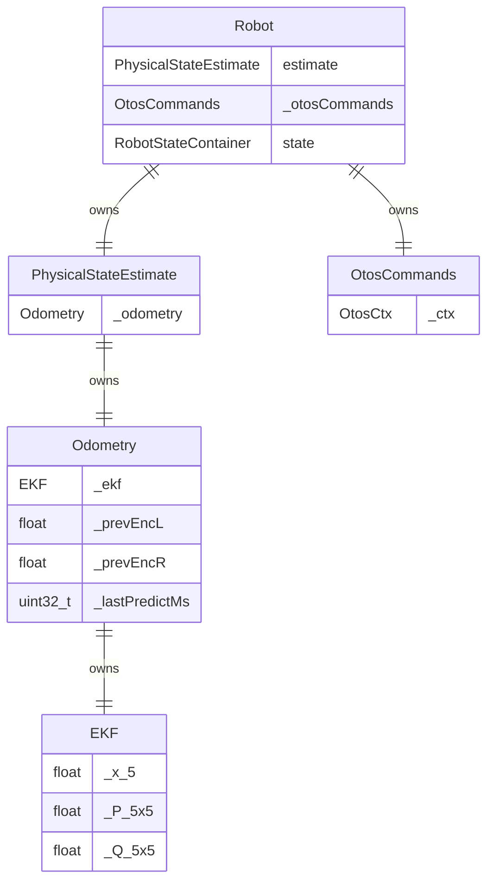

<!-- CLASI: Before changing code or making plans, review the SE process in CLAUDE.md -->

# Architecture Update — Sprint 041: Phase C — PhysicalStateEstimate seam

## Sprint Changes

### Summary

Phase C introduces the **`PhysicalStateEstimate`** class — Seam 2 of the FRC Elite
Architecture adaptation — by consolidating `Odometry` and `EKF` into one named belief
object. The move is composition-first: bodies are verbatim copies; no numerics change.

Four concrete changes:

1. **`source/state/PhysicalStateEstimate.{h,cpp}`** — new belief object wrapping
   `Odometry` by composition; exposes observations-in / belief-out API.
2. **`source/state/EKF.{h,cpp}`** — `EKF` moved from `source/control/` to
   `source/state/`; body verbatim.
3. **`source/app/OtosCommands.{h,cpp}`** — new app-layer handler set for the seven
   OTOS-tuning verbs (`OI/OZ/OR/OV/OL/OA/OP`); `Commandable` removed from the
   estimator.
4. **Three observation call-sites repointed** — `loopTickOnce`, `Robot::otosCorrect`,
   and `handleSI` replace direct `Odometry` calls with `PhysicalStateEstimate` methods.

`HardwareState.pose*` / `fused*` fields continue to be populated each cycle
(transition safety); existing readers (`buildTlmFrame`, `MotionController::getPoseFloat`)
require zero changes this sprint.

### Files Created

- `source/state/PhysicalStateEstimate.h`
- `source/state/PhysicalStateEstimate.cpp`
- `source/state/EKF.h` (moved from `source/control/EKF.h`)
- `source/state/EKF.cpp` (moved from `source/control/EKF.cpp`)
- `source/app/OtosCommands.h`
- `source/app/OtosCommands.cpp`

### Files Modified

- `source/control/EKF.h` — becomes an alias shim: `#include "../state/EKF.h"`
  (deleted in Phase F)
- `source/control/EKF.cpp` — deleted; bodies now at `source/state/EKF.cpp`
- `source/control/Odometry.h` — `Commandable` inheritance removed; `getCommands()`
  declaration deleted; `OdomCtx` struct moved to `OtosCommands.h`
- `source/control/Odometry.cpp` — Commandable implementation (parse functions,
  handler functions, `getCommands()`) removed; all other bodies verbatim
- `source/robot/Robot.h` — `odometry` member renamed to `estimate` of type
  `PhysicalStateEstimate`; `#include "PhysicalStateEstimate.h"` added
- `source/robot/Robot.cpp` — constructor wiring updated; `_otosCommands` constructed
  and `setCtx`-wired; `estimate.setCtx` called in place of `odometry.setCtx`
- `source/control/LoopTickOnce.cpp` — `robot.odometry.predict(...)` replaced by
  `robot.estimate.addOdometryObservation(...)`; wedge push `robot.odometry.setWedgeActive` /
  `setEncOmegaHealthy` replaced by `robot.estimate.setWedgeActive` /
  `setEncOmegaHealthy`; `robot.odometry.rebaselinePrev` →
  `robot.estimate.rebaselinePrev` (in `resetEncoders`)
- `source/robot/Robot.cpp` (otosCorrect) — `odometry.correctEKF(...)` replaced by
  `estimate.addOtosObservation(...)`
- `source/app/SystemCommands.cpp` — `handleSI`: `robot->odometry.setPose(...)` →
  `robot->estimate.resetPose(...)`
- `source/robot/Robot.cpp` (buildCommandTable) — `odometry.getCommands()` replaced
  by `_otosCommands.getCommands()`
- `source/robot/RobotTelemetry.cpp` — `robot.odometry.ekfRejectCount()` /
  `robot.odometry.otosRejectedCount()` replaced by forwarding accessors on `estimate`
- `tests/_infra/sim/CMakeLists.txt` — `source/state/` added to source glob
- `tests/_infra/vendor_baseline.txt` — updated: `source/state/` scoped in;
  EKF entries under `source/control/` removed

### No Changes To

- `source/io/` — zero device-layer changes
- `source/control/MotionController.{h,cpp}` — `getPoseFloat` reads `HardwareState`
  unchanged
- `source/robot/RobotTelemetry.cpp` (buildTlmFrame body) — reads `state.inputs`
  fields unchanged
- `source/types/RobotState.h` — `HardwareState` fields unchanged
- `tests/simulation/` test files — zero edits to any existing test

---

## Why

Three concrete problems motivate this seam:

**1. Scattered belief.** `Odometry` and `EKF` are separate objects; callers reach
into both independently. There is no single named "belief" type — the fused pose is
scattered across `HardwareState` fields with no ownership boundary.

**2. Commandable coupling.** `Odometry` implements `Commandable`, coupling the
estimator to `CommandTypes.h`, `CommandProcessor.h`, and `Protocol.h`. This prevents
unit-testing the estimator in isolation (the Phase B estimator-isolation tests already
work around this by routing through the full `Robot` rather than testing `Odometry`
standalone with clean inputs). Removing `Commandable` from the estimator makes the
`source/state/` layer truly dependency-clean.

**3. Seam naming for Phase F.** Naming the seam now (`PhysicalStateEstimate` as the
estimate dual of `PhysicsWorld`) establishes the structural invariant (no
CODAL/Protocol/Commandable) before Phase F repoints readers. The dependency rule is
enforced by the vendor-confinement gate starting this sprint.

---

## Module Definitions

### PhysicalStateEstimate (source/state/PhysicalStateEstimate.{h,cpp})

**Purpose:** The single fused-belief object for the robot's physical state; owns
`Odometry` by composition and exposes a clean observations-in / belief-out API.

**Boundary (in):**
Owns `Odometry _odometry` as a value member (which in turn owns `EKF` as a value
member). Accepts observations via three methods:
- `addOdometryObservation(HardwareState& s, float trackwidthMm, float rotationalSlip, uint32_t now_ms)` — delegates verbatim to `_odometry.predict(...)`.
- `addOtosObservation(HardwareState& s, float x, float y, float h, float v, float omega)` — delegates verbatim to `_odometry.correctEKF(...)`.
- `resetPose(HardwareState& s, int32_t x_mm, int32_t y_mm, int32_t h_cdeg)` — delegates verbatim to `_odometry.setPose(...)`.

All three methods write back into `HardwareState&` exactly as the delegated methods
did — this is the back-compat mirroring (see Migration Concerns §3).

**Boundary (out):**
- `getPose(const HardwareState& s, int32_t& x, int32_t& y, int32_t& h_cdeg)` — static forwarder to `Odometry::getPose`.
- `getVelocity(const HardwareState& s, float& v_mmps, float& omega_rads)` — reads `s.fusedV` / `s.fusedOmega`.
- `initEKF(...)` — delegates to `_odometry.initEKF(...)`.
- `setCtx(IOdometer*, const HardwareState*)` — delegates to `_odometry.setCtx(...)`.
- Forwarded accessors: `ekfRejectCount()`, `ekfPDiag(int)`, `otosRejectedCount()`,
  `lastEncV()`, `lastEncOmega()`, `encOmegaHealthy()`, `setEncOmegaHealthy(bool)`,
  `setWedgeActive(bool)`, `wedgeActive()`, `rebaselinePrev(float, float)`.

**Dependency rule (enforced by grep gate):** `PhysicalStateEstimate.h` includes ONLY
`<stdint.h>`, `Odometry.h` (which transitively pulls in `EKF.h` and `RobotState.h`
via the existing `Odometry.h` include list — acceptable since `RobotState.h` is a
types header, not a device header). No `CommandTypes.h`, no `Commandable`,
no `MicroBit.h`, no `Protocol.h`.

Note: `Odometry.h` currently includes `CommandTypes.h` (because `Odometry` was
`Commandable`). Removing `Commandable` from `Odometry` in T2 also removes this
`CommandTypes.h` include from `Odometry.h`. After T2, the transitive include set
of `PhysicalStateEstimate.h` is clean.

**Use cases:** SUC-001, SUC-002, SUC-004, SUC-005.

---

### EKF (source/state/EKF.{h,cpp})

**Purpose:** 5-state CTRV EKF; moved from `source/control/` to `source/state/`
with bodies verbatim.

**Boundary:** Identical to the existing `EKF` — no changes to public API or
implementation. Includes only `<math.h>` and `<stdint.h>`. A shim at
`source/control/EKF.h` (`#include "../state/EKF.h"`) provides backward compatibility
until Phase F.

**Use cases:** SUC-001, SUC-002.

---

### OtosCommands (source/app/OtosCommands.{h,cpp})

**Purpose:** App-layer handler set for the seven OTOS-tuning verbs
(`OI/OZ/OR/OV/OL/OA/OP`). Replaces the `Commandable` implementation formerly
embedded in `Odometry`.

**Boundary (in):** Receives an `IOdometer*` and `const HardwareState*` via `setCtx()`
(same pointers previously passed to `Odometry::setCtx`). Implements `Commandable`
(registered into the command table by `Robot::buildCommandTable`).

**Boundary (out):** `std::vector<CommandDescriptor> getCommands() const` — identical
set of seven verbs with identical parse/handler function bodies (verbatim move from
`Odometry.cpp`). The context bundle (`OtosCtx` or renamed `OdomCtx`) moves here.

**Dependency direction:** `source/app/` → `source/io/capability/IOdometer.h` +
`source/types/CommandTypes.h` + `source/control/RobotState.h`. This is the correct
direction: app-layer code depends on these; the estimator (`source/state/`) does not.

**Use cases:** SUC-003.

---

### Odometry (source/control/Odometry.{h,cpp}) — modified

**Purpose:** Unchanged differential-drive dead-reckoning and EKF prediction/correction
logic. `Commandable` inheritance and `getCommands()` removed; bodies of `predict`,
`correctEKF`, `setPose`, etc. are verbatim.

**Boundary:** Wrapped exclusively by `PhysicalStateEstimate`; not called directly
from `loopTickOnce`, `Robot::otosCorrect`, or `handleSI` after T3.

**Use cases:** SUC-001, SUC-004.

---

## Component / Module Diagram

---

## Impact on Existing Components

| Component | Before | After |
|---|---|---|
| `Odometry` class | `public Commandable`; owns `getCommands()` for 7 verbs | `Commandable` removed; `getCommands()` deleted; `OdomCtx` moved out |
| `Robot::odometry` member | `Odometry odometry` value member | Renamed to `PhysicalStateEstimate estimate` |
| `Robot::_otosCommands` | Does not exist | New `OtosCommands _otosCommands` value member |
| `EKF` source location | `source/control/EKF.{h,cpp}` | `source/state/EKF.{h,cpp}`; shim at `source/control/EKF.h` |
| `loopTickOnce` odometry call | `robot.odometry.predict(s, trackwidth, slip, now)` | `robot.estimate.addOdometryObservation(s, trackwidth, slip, now)` |
| `Robot::otosCorrect` | `odometry.correctEKF(s, x, y, h, v, omega)` | `estimate.addOtosObservation(s, x, y, h, v, omega)` |
| `handleSI` | `robot->odometry.setPose(s, x, y, h)` | `robot->estimate.resetPose(s, x, y, h)` |
| `Robot::buildCommandTable` | Aggregates `odometry.getCommands()` | Aggregates `_otosCommands.getCommands()` |
| `HardwareState.poseX/Y/poseHrad/fusedV/fusedOmega` | Written by `Odometry::predict` + `correctEKF` | Written by `PhysicalStateEstimate` delegating to `Odometry`; fields and write semantics unchanged |
| `MotionController::getPoseFloat` | Reads `_hardwareState->poseX/Y/poseHrad` | Unchanged |
| `buildTlmFrame` | Reads `state.inputs.poseX/Y/fusedV/fusedOmega` | Unchanged |
| `Robot::resetEncoders` | Calls `odometry.rebaselinePrev(0,0)` | Calls `estimate.rebaselinePrev(0,0)` |
| `RobotTelemetry.cpp` (TLM accessors) | `robot.odometry.ekfRejectCount()` etc. | `robot.estimate.ekfRejectCount()` (forwarded accessor) |
| Vendor-confinement grep gate | Scopes `source/app/ control/ robot/ types/` | Scope extended to include `source/state/`; EKF control/ entries removed from baseline |
| `tests/_infra/sim/CMakeLists.txt` | Globs `source/control/` (picks up EKF.cpp) | Adds glob of `source/state/` (picks up EKF.cpp and PhysicalStateEstimate.cpp) |

---

## Migration Concerns

### 1. Commandable strip — verb-behavior preservation

The seven OTOS-tuning verb handlers (parse functions + handler functions) move
verbatim from `Odometry.cpp` to `OtosCommands.cpp`. The `OdomCtx` struct (or
its renamed equivalent `OtosCtx`) moves to `OtosCommands.h`. Handler context
pointers change from `&_odomCtx` on `Odometry` to `&_otosCtx` on `OtosCommands`.
All seven verbs must respond identically — the existing `test_estimator_command_paths.py`
fence will catch any regression.

**Risk:** Low. The move is textual; no logic changes.

### 2. EKF shim and CMake source list

When `EKF.cpp` moves to `source/state/`, the CMake source glob for `source/control/`
no longer picks it up. The sim `CMakeLists.txt` must add a glob for `source/state/*.cpp`
(or add the files explicitly). The firmware `build.py` must similarly pick up the
new directory. The shim at `source/control/EKF.h` handles header resolution for
callers that include `"EKF.h"` via the control/ path.

**Risk:** Low but load-bearing. If the CMake update is missed, the build fails with
a linker error on `EKF::init` etc. This will be caught immediately on the first
compile attempt.

### 3. Golden-TLM byte-exactness

`PhysicalStateEstimate` methods forward to `Odometry` verbatim. The write-back into
`HardwareState` (poseX/Y/poseHrad/fusedV/fusedOmega) happens inside `Odometry::predict`
and `correctEKF` — not in the new wrapper methods. The wrapper adds no new writes.
No reordering of any kind is introduced. `test_golden_tlm.py` must be run immediately
after the first ticket that wires `PhysicalStateEstimate` into `sim_api.cpp`.

### 4. Constructor wiring in Robot.cpp

Currently `Robot.cpp` calls `odometry.setCtx(&otos, &state.inputs)` post-construction.
After the rename, this becomes `estimate.setCtx(&otos, &state.inputs)` (which
delegates to `_odometry.setCtx`). Separately, `_otosCommands.setCtx(&otos, &state.inputs)`
must also be called. Missing either call would silently break OTOS command handling
or the OTOS-read path in `otosCorrect`. Both calls must be present in Robot.cpp.

### 5. ARM firmware build gate

`EKF.cpp` must compile into the firmware from `source/state/`. The ARM build
(`python3 build.py --fw-only`) is a hard gate at every ticket. After building,
programmers run `git checkout -- source/robot/DefaultConfig.cpp` to discard the
cosmetic path-comment regen that the build emits.

### 6. `Odometry.h` includes `CommandTypes.h` transitively

After T1 (creating `PhysicalStateEstimate` wrapping existing `Odometry`), the
include graph of `PhysicalStateEstimate.h` still transitively pulls in
`CommandTypes.h` via `Odometry.h → CommandTypes.h` (because `Odometry` is still
`Commandable` at that point). The dependency rule is fully clean only after T2
strips `Commandable` from `Odometry`. The vendor-confinement gate for `source/state/`
should be added to the baseline after T2 is complete, not after T1.

---

## Design Rationale

### Decision: PhysicalStateEstimate wraps Odometry by composition, not inheritance

- **Context**: `Odometry` already wraps `EKF` by composition. Options for
  `PhysicalStateEstimate`: (a) inherit from `Odometry`, (b) rewrite from scratch,
  (c) wrap by composition.
- **Alternatives**: (a) Inheritance leaks all `Odometry` methods as public; does not
  draw a new boundary; makes `Commandable` stripping harder. (b) Rewrite violates
  the hard constraint "move bodies verbatim, change no numerics."
- **Why (composition)**: Full control over public surface; bodies verbatim; thin
  delegation wrapper introducible in one ticket with suite green throughout.
- **Consequences**: Forwarding accessors must be explicitly added; the nesting
  is `PhysicalStateEstimate` → `Odometry` → `EKF`. Phase F can rationalize.

### Decision: OTOS verb handlers move verbatim to OtosCommands

- **Context**: Seven verb handlers in `Odometry.cpp` access `IOdometer&` and
  `const HardwareState*` through an `OdomCtx` bundle. They could be refactored.
- **Why**: Verbatim move preserves `test_estimator_command_paths.py` without
  modification. Any restructuring risks a behavioral delta in parse format or
  reply string. The transitional cost is a minor naming curiosity (`OdomCtx` in
  `OtosCommands.cpp`); this is acceptable for Phase C.
- **Consequences**: `OtosCommands.cpp` contains the verbatim `OdomCtx` struct.

### Decision: HardwareState back-compat mirroring stays in this sprint

- **Context**: The full dependency-rule goal would have `PhysicalStateEstimate`
  write only to its own fields. But `MotionController::getPoseFloat` and
  `buildTlmFrame` both read `HardwareState.poseX/Y/poseHrad/fusedV/fusedOmega`.
- **Why**: Repointing those readers is Phase F scope. Doing it here expands blast
  radius and risks TLM regression. The mirroring write costs nothing; the seam
  transition-safety is explicit and documented.
- **Consequences**: `PhysicalStateEstimate` still touches `HardwareState&`; the seam
  is not yet fully clean. Phase F removes mirroring and repoints readers.

### Decision: EKF stays nested — PhysicalStateEstimate owns Odometry, Odometry owns EKF

- **Context**: Alternative: `PhysicalStateEstimate` owns `EKF` directly (flat
  composition), dissolving `Odometry` into its parts.
- **Why**: Flat composition requires duplicating all `Odometry` field names and
  logic into `PhysicalStateEstimate`, violating the verbatim-move rule. Keeping
  `Odometry` as a sub-object means only thin delegation wrappers are added.
  The three-level nesting (`PSE` → `Odometry` → `EKF`) is explicit and safe.
- **Consequences**: Phase F can flatten if desired; no architectural harm.

---

## Open Questions

### OQ-1: EKF shim — is control/EKF.cpp retained or deleted?

The shim `source/control/EKF.h` re-exports the type via `#include "../state/EKF.h"`.
No `.cpp` shim is needed — compiled-separately TUs are picked up by CMake globs,
not `#include` chains. `source/control/EKF.cpp` must be DELETED (not shimmed);
`source/state/EKF.cpp` is added to the CMake source lists instead.

Programmer confirms no TU explicitly `#include`s `EKF.cpp` (they should not). If
any CMake glob for `source/control/*.cpp` had been picking up `EKF.cpp`, the glob
removal is the fix.

### OQ-2: Which accessors are read from `robot.odometry` in RobotTelemetry.cpp?

The grep above shows `robot.odometry.ekfRejectCount()` is used in `buildTlmFrame`
(the `ekf_rej=` field). Programmer should audit all `robot.odometry.*` call sites
outside `loopTickOnce` / `Robot.cpp` to ensure every forwarded accessor is present
on `PhysicalStateEstimate`. The forwarding list in this document (§Module Definitions)
is the authoritative enumeration; programmer verifies completeness in T1.

### OQ-3: Scope of vendor-confinement baseline update for source/state/

The vendor-confinement grep gate (`test_vendor_confinement.py`) currently scopes
`source/app/`, `source/control/`, `source/robot/`, `source/types/`. Phase C must
extend the scope to include `source/state/`. The baseline update happens in T2
(after `Commandable` is stripped from `Odometry`), not T1 (when the transitive
`CommandTypes.h` include is still present). Programmer must time the baseline commit
to T2's green state.
