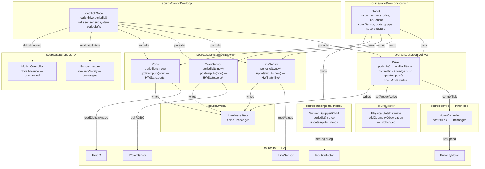
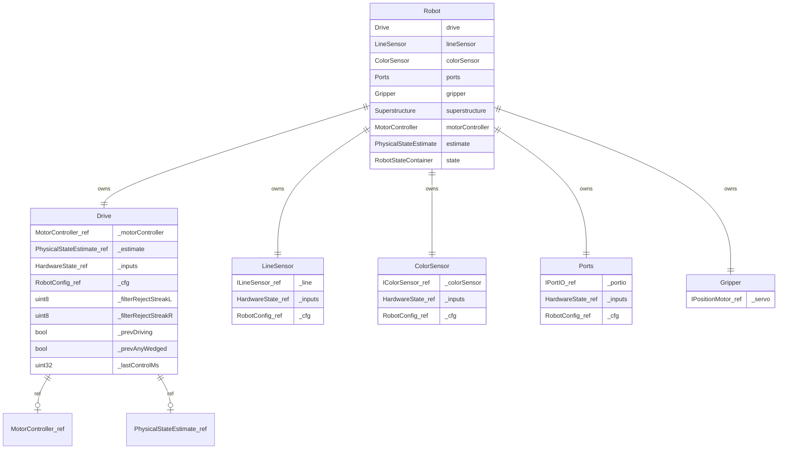

<!-- CLASI: Before changing code or making plans, review the SE process in CLAUDE.md -->

# Architecture Update — Sprint 043: Phase E — Subsystem and periodic wrapping

## Sprint Changes

### Summary

Phase E introduces **thin subsystem objects** under `source/subsystems/` — the §5
directory layout entry for Drive, Gripper, and sensors. Each subsystem wraps one
device concern, exposes `updateInputs()` (writes its slice of `HardwareState`) and
`periodic()` (runs the per-cycle work), and is called from `loopTickOnce` **in the
same order** the inline code runs today. Bodies move verbatim; no numerics change.

Three concrete changes:

1. **`source/subsystems/sensors/{LineSensor,ColorSensor,Ports}.{h,cpp}`** — wraps the
   timed I2C reads for line, color, and port sensors. Each subsystem's `periodic()`
   owns the lag-gate + timer update + `updateInputs()` call that was previously an
   inline timed block in `loopTickOnce` calling `robot.lineRead()` / `robot.colorRead()`
   / `robot.portsRead()`.

2. **`source/subsystems/drive/Drive.{h,cpp}`** — wraps the per-wheel velocity control +
   encoder-filter concern. `Drive::periodic()` contains the CONTROL COLLECT block
   (outlier filter → `motorController.controlTick()` → wedge push into `estimate`)
   verbatim. `Drive::updateInputs()` is called inside `periodic()` at the same
   positions the encoder writes occur today.

3. **`source/subsystems/gripper/Gripper.{h,cpp}`** — wraps the optional servo actuator.
   `GripperIONull` is the null-object for `has_gripper = false`. Gripper is command-
   driven (not polled from `loopTickOnce`); this ticket creates the structural seam for
   Phase F without wiring it into the poll sequence.

`loopTickOnce` is updated to call `robot.drive.periodic()` (replaces the inline
CONTROL COLLECT block) and each sensor subsystem's `periodic()` (replaces
`robot.lineRead()` / `robot.colorRead()` / `robot.portsRead()`) in the same positions.
OTOS, telemetry, driveAdvance, estimator, and safety calls are unchanged.

### Files Created

- `source/subsystems/drive/Drive.h`
- `source/subsystems/drive/Drive.cpp`
- `source/subsystems/gripper/Gripper.h`
- `source/subsystems/gripper/Gripper.cpp`
- `source/subsystems/sensors/LineSensor.h`
- `source/subsystems/sensors/LineSensor.cpp`
- `source/subsystems/sensors/ColorSensor.h`
- `source/subsystems/sensors/ColorSensor.cpp`
- `source/subsystems/sensors/Ports.h`
- `source/subsystems/sensors/Ports.cpp`

### Files Modified

- `source/control/LoopTickOnce.cpp` — CONTROL COLLECT block replaced by
  `robot.drive.periodic()`; LINE/COLOUR/PORTS timed blocks replaced by
  `robot.lineSensor.periodic(ts, now)` / `robot.colorSensor.periodic(ts, now)` /
  `robot.ports.periodic(ts, now)`. All other calls unchanged. No reordering.
- `source/robot/Robot.h` — adds `Drive drive`, `LineSensor lineSensor`,
  `ColorSensor colorSensor`, `Ports ports`, `Gripper gripper` value members.
  Declaration order: subsystems after the device-interface refs they bind.
- `source/robot/Robot.cpp` — constructor wires subsystem members with refs to their
  device interfaces and `HardwareState`.
- `tests/_infra/sim/CMakeLists.txt` — `source/subsystems/` added to source glob.
- `tests/_infra/vendor_baseline.txt` — `source/subsystems/` scoped in.

### No Changes To

- `source/control/LoopTickOnce.cpp` tick ORDER — calls happen in the same sequence.
- `source/control/MotorController.*` — zero changes. `Drive` holds a reference to it.
- `source/superstructure/Superstructure.*` — zero changes.
- `source/state/PhysicalStateEstimate.*` — zero changes.
- `source/io/` — zero device-layer changes.
- `source/types/RobotState.h` — `HardwareState` fields unchanged (Phase F).
- Any existing test file — zero edits.
- Safety behavior numerics and ordering — verbatim copies only.

---

## Why

Two concrete problems motivate this sprint:

**1. §5 directory layout unreachable without subsystem objects.** The target layout
(`source/subsystems/drive/`, `source/subsystems/gripper/`, `source/subsystems/sensors/`)
from §5 of the migration issue cannot be named or described until the subsystem objects
exist. Phase F's logging contract ("every subsystem writes its inputs slice in
`updateInputs`, no subsystem prints") requires an `updateInputs()` method on each
subsystem. Without Phase E, Phase F has no structural hook.

**2. Scattered device reads with no named owner.** `robot.lineRead()`,
`robot.colorRead()`, `robot.portsRead()`, and the inline CONTROL COLLECT block are
responsibility-free functions scattered across `Robot` and `loopTickOnce`. There is
no module boundary that says "the line sensor concern lives here." The subsystem
wrapper names that boundary explicitly.

---

## Module Definitions

### Drive (source/subsystems/drive/Drive.{h,cpp})

**Purpose:** Owns the per-wheel velocity control and encoder-filter concern for the
drive base.

**Boundary (in):**
- `periodic()` — runs the outlier-filter pass, calls `_motorController.controlTick()`,
  and pushes wedge state into `_estimate`; called once per tick from `loopTickOnce`.
- `updateInputs()` — writes `encLMm`, `encRMm`, and the filter-streak state into the
  `HardwareState` inputs slice; called internally within `periodic()` at the same
  positions the encoder writes occur today.

**Boundary (out):** None beyond what `MotorController::controlTick()` already writes
into `HardwareState.commands` (unchanged).

**Dependencies:** holds `MotorController&`, `PhysicalStateEstimate&`, `HardwareState&`,
`const RobotConfig&`, and the filter-streak members (`_filterRejectStreakL/R`,
`_prevDriving`, `_prevAnyWedged`, `_lastControlMs`). These are currently fields on
`Robot`; they move to `Drive` value members.

**Use cases:** SUC-002, SUC-004.

---

### LineSensor (source/subsystems/sensors/LineSensor.{h,cpp})

**Purpose:** Owns the timed I2C read of the 4-channel line sensor into `HardwareState`.

**Boundary (in):**
- `periodic(LoopTickState& ts, uint32_t now)` — checks `lagLineMs` gate and
  `ts.lastLine`; calls `updateInputs(now)`; updates `ts.lastLine`. Verbatim from the
  LINE timed block.
- `updateInputs(uint32_t now)` — executes the former `robot.lineRead()` body: checks
  `is_initialized()`, calls `line.readValues(state.inputs.line)`, sets `lineVS`.

**Dependencies:** holds `ILineSensor&`, `HardwareState&`, `const RobotConfig&`.

**Use cases:** SUC-001, SUC-004.

---

### ColorSensor (source/subsystems/sensors/ColorSensor.{h,cpp})

**Purpose:** Owns the timed RGBC poll into `HardwareState`.

**Boundary (in):**
- `periodic(LoopTickState& ts, uint32_t now)` — checks `lagColorMs` gate; calls
  `updateInputs(now)`; updates `ts.lastColor`. Verbatim from the COLOUR timed block.
- `updateInputs(uint32_t now)` — executes the former `robot.colorRead()` body.

**Dependencies:** holds `IColorSensor&`, `HardwareState&`, `const RobotConfig&`.

**Use cases:** SUC-001, SUC-004.

---

### Ports (source/subsystems/sensors/Ports.{h,cpp})

**Purpose:** Owns the timed GPIO read of digital/analogue ports into `HardwareState`.

**Boundary (in):**
- `periodic(LoopTickState& ts, uint32_t now)` — checks `lagPortsMs` gate; calls
  `updateInputs(now)`; updates `ts.lastPorts`. Verbatim from the PORTS timed block.
- `updateInputs(uint32_t now)` — executes the former `robot.portsRead()` body.

**Dependencies:** holds `IPortIO&`, `HardwareState&`, `const RobotConfig&`.

**Use cases:** SUC-001, SUC-004.

---

### Gripper (source/subsystems/gripper/Gripper.{h,cpp})

**Purpose:** Named seam for the optional servo actuator. Structural wrapper only;
actuation is command-driven, not polled.

**Boundary (in):**
- `periodic()` — no-op in this sprint (servo is not polled each tick).
- `updateInputs()` — no-op (no gripper state in `HardwareState` inputs today).

**GripperIONull:** a concrete `Gripper` variant whose `periodic()` and `updateInputs()`
are no-ops; used when `has_gripper = false`. Avoids `if (has_gripper)` guards at the
call site.

**Dependencies:** holds `IPositionMotor&` (the gripper servo via the existing
`IServo` alias).

**Use cases:** SUC-003.

---

### loopTickOnce (source/control/LoopTickOnce.cpp) — simplified

**Purpose:** Shared firmware-sim loop orchestrator. The CONTROL COLLECT inline block
(~100 lines) and the LINE/COLOUR/PORTS timed blocks are replaced by single-line
subsystem calls. OTOS, safety, driveAdvance, estimator, HAL tick, and TLM are
unchanged. Tick order:

```
[robot.drive.periodic()]                      <- was: inline CONTROL COLLECT block
cmd.dequeueOne(queue)
robot.superstructure.evaluateSafety(...)
robot.motionController.driveAdvance(...)
robot.estimate.addOdometryObservation(...)
robot.hal.tick(now, robot.state.commands)
[OTOS timed block — robot.otosCorrect()]
[robot.lineSensor.periodic(ts, now)]          <- was: inline LINE block
[robot.colorSensor.periodic(ts, now)]         <- was: inline COLOUR block
[robot.ports.periodic(ts, now)]               <- was: inline PORTS block
[TLM timed block — robot.telemetryEmit()]
```

**Use cases:** SUC-004.

---

## Component / Module Diagram





---

## Impact on Existing Components

| Component | Before | After |
|---|---|---|
| `loopTickOnce` — CONTROL COLLECT block (~100 lines) | Inline block | `robot.drive.periodic()` one-liner |
| `loopTickOnce` — LINE timed block | Inline lag gate + `robot.lineRead()` | `robot.lineSensor.periodic(ts, now)` |
| `loopTickOnce` — COLOUR timed block | Inline lag gate + `robot.colorRead()` | `robot.colorSensor.periodic(ts, now)` |
| `loopTickOnce` — PORTS timed block | Inline lag gate + `robot.portsRead()` | `robot.ports.periodic(ts, now)` |
| `Robot` struct filter-streak members | `_filterRejectStreakL/R`, `_prevDriving`, `_prevAnyWedged`, `_lastControlMs` | Moved to `Drive` value members |
| `Robot::lineRead()` / `colorRead()` / `portsRead()` | Live methods | Bodies moved to subsystem `updateInputs()`; declarations deleted (if no external callers) |
| `source/subsystems/` | Does not exist | Created: `drive/`, `gripper/`, `sensors/` |
| Vendor-confinement baseline | No `source/subsystems/` entries | `source/subsystems/` scoped in; zero vendor/CODAL types allowed |
| Golden-TLM canary | Byte-exact baseline | Must remain byte-exact after every ticket |

---

## Migration Concerns

### 1. Filter-streak state ownership transfer

The outlier filter uses five members on `Robot`: `_filterRejectStreakL`,
`_filterRejectStreakR`, `_prevDriving`, `_prevAnyWedged`, `_lastControlMs`. When
`Drive` absorbs the CONTROL COLLECT body, these move to `Drive` value members. The
programmer must verify no test or command handler accesses them directly on `Robot`
before deleting the `Robot` declarations.

**Risk:** Low — any missed access is a compile error.

### 2. Ordering constraint — OTOS block stays where it is

The OTOS block must run AFTER `robot.hal.tick(now, robot.state.commands)` and BEFORE
the LINE/COLOUR/PORTS blocks. Phase E does not touch the OTOS block. The programmer
must not reorder the OTOS call while editing `loopTickOnce`.

**Risk:** Low — OTOS is not in scope for Phase E.

### 3. systemTime() inside lineRead/colorRead/portsRead

`Robot::lineRead()` and `colorRead()` write `state.inputs.lineVS.lastUpdMs =
systemTime()`. When bodies move to `updateInputs(uint32_t now)`, the `now` parameter
(already flowing through `loopTickOnce`) replaces the `systemTime()` call. The
programmer must confirm the `now` value is the same as the one `loopTickOnce` uses
for the `ts.lastLine` update (it is — same `now` parameter throughout the tick).

**Risk:** Medium — incorrect time source would silently skew validity timestamps.

### 4. Robot.h declaration order — subsystems after refs

Drive, LineSensor, ColorSensor, and Ports hold references into `Robot`'s own
device-interface refs (`motorL`, `motorR`, `line`, `colorSensor`, `portio`) and into
`state`. These subsystem value members must be declared AFTER the refs they bind.
C++ initializes members in declaration order.

**Risk:** Low — compile-time enforcement via reference binding in constructor.

### 5. ARM firmware build gate

`source/subsystems/` must be added to the firmware CMakeLists glob and to
`tests/_infra/sim/CMakeLists.txt`. Missing file causes an immediate linker error.
After the ARM build, run `git checkout -- source/robot/DefaultConfig.cpp`.

**Risk:** Low but load-bearing.

### 6. No subsystem prints — Phase E pre-cut

Each subsystem's `updateInputs()` writes to `HardwareState` and returns. No `printf`
or `telemetryEmit` calls inside any subsystem method. This is the Phase F logging
contract pre-cut; the bodies being moved do not call `telemetryEmit` today, so this
constraint is automatically satisfied by verbatim copy.

**Risk:** None if bodies are copied verbatim.

---

## Design Rationale

### Decision: Subsystem holds references, not pointers

- **Context**: Subsystems could take `*` pointers or `&` references.
- **Why (references)**: Subsystems are value members of `Robot` and are always
  constructed with a live device ref. References make nullability impossible and
  eliminate null checks. Consistent with `MotorController`, `Superstructure`.
- **Consequences**: Subsystems cannot be default-constructed without a device.

### Decision: periodic() takes LoopTickState& for sensor subsystems

- **Context**: The lag gate logic (`cfg.lagLineMs`, `ts.lastLine`, `now`) must live
  inside the subsystem's `periodic()` to keep it self-contained. Two options: (a)
  inlining the gate in `loopTickOnce` and calling only `updateInputs()` from the
  loop; (b) passing `LoopTickState&` into `periodic()`.
- **Why (LoopTickState& in periodic)**: Putting the lag gate inside `periodic()`
  makes the subsystem self-describing — "I know when to run." Splitting the gate back
  into `loopTickOnce` would be a leaky abstraction (caller knows internals of when
  the subsystem should fire).
- **Consequences**: `periodic(LoopTickState& ts, uint32_t now)` signature for the
  three sensor subsystems. `Drive::periodic()` has no lag gate and takes no extra args.

### Decision: Gripper periodic() is a no-op — not wired into the loop poll sequence

- **Context**: The gripper is command-driven. Wiring `gripper.periodic()` into
  `loopTickOnce` with no body is speculative generality.
- **Why**: The null-object `GripperIONull` exists for the `has_gripper = false` case.
  The structural seam is established; Phase F can wire the poll if needed.
- **Consequences**: `robot.gripper.periodic()` is not called from `loopTickOnce`.

### Decision: No SubsystemBase / virtual dispatch

- **Context**: The issue §4 / "What does NOT apply" prohibits `CommandScheduler/SubsystemBase`.
  A virtual base for `periodic()` / `updateInputs()` would add vtable overhead on nRF52.
- **Why**: `loopTickOnce` calls subsystems by name in a fixed order — no dynamic
  registration is needed. A base class adds dispatch cost with no benefit.
- **Consequences**: Each subsystem is a standalone value-type class. No inheritance.

---

## Open Questions

### OQ-1: Filter-streak members — move to Drive or leave on Robot with refs?

`_filterRejectStreakL/R`, `_prevDriving`, `_prevAnyWedged`, `_lastControlMs` are
currently on `Robot`. Moving them to `Drive` is cleanest. The programmer must verify
no other code path reads them before removing from `Robot`.

**Recommendation:** Move to `Drive` value members.

### OQ-2: systemTime() replacement in updateInputs — pass now_ms or call hal?

`Robot::lineRead()` calls `systemTime()` for `lineVS.lastUpdMs`. The `now` parameter
in `loopTickOnce` is the same value. Passing it as `updateInputs(uint32_t now)` is
zero-cost and deterministic.

**Recommendation:** `updateInputs(uint32_t now)` — use the `now` already in scope.

### OQ-3: Retain Robot::lineRead/colorRead/portsRead as shims or delete?

After the bodies move, these methods have no callers outside `loopTickOnce`.

**Recommendation:** Grep for callers; delete if none. Reduces dead code.
