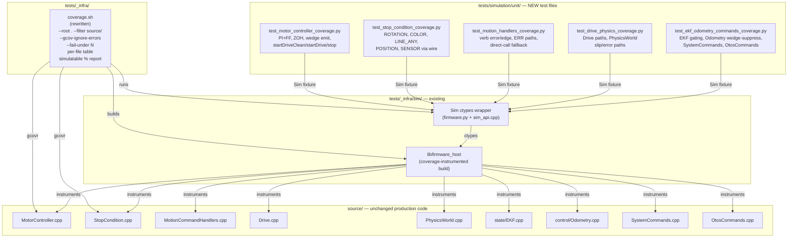

<!-- CLASI: Before changing code or making plans, review the SE process in CLAUDE.md -->

# Architecture Update — Sprint 045: Simulation coverage to 85% and coverage-harness fix

## What Changed

This is a **test-additive sprint**. No production source files (`source/`) are added,
modified, or deleted. All changes are in `tests/` and `tests/_infra/`.

### 1. `tests/_infra/coverage.sh` — harness rewrite

The existing script (Sprint 038 vintage) is replaced with a corrected version that:

- Uses a fresh build directory (`tests/_infra/sim/build_coverage/`) distinct from the
  normal build dir.
- Invokes `gcovr` with `--root .` (repo root), `--filter 'source/'`, and
  `--gcov-ignore-errors=source_not_found`. The old `--root source` was the root cause
  of stale-path errors after EKF moved from `source/control/` to `source/state/` in
  Sprint 041.
- Prints overall `source/` line coverage percentage.
- Prints a per-file coverage table (`--txt` or similar gcovr output).
- Prints a "simulatable-code" coverage percentage computed by re-running gcovr with
  `--exclude` flags for each CODAL-only file in the documented exclusion set.
- Accepts an optional `--fail-under N` argument: exits non-zero when overall coverage
  is below N%.
- Uses `cmake --build <covdir> --parallel` (not `-- -j4`) for portability.

### 2. New simulation test modules

Five new pytest files in `tests/simulation/unit/`:

| File | Coverage target |
|------|----------------|
| `test_motor_controller_coverage.py` | `source/control/MotorController.cpp` — PI+FF inner loop, ZOH velocity differentiation, wedge-detector emit path, `startDriveClean`/`startDrive`/`stop`/`resetIntegrators`/`updateVelGains` |
| `test_stop_condition_coverage.py` | `source/control/StopCondition.cpp` — C++ binary paths for ROTATION, COLOR, LINE_ANY, POSITION, SENSOR GE/LE, HEADING via wire protocol |
| `test_motion_handlers_coverage.py` | `source/app/MotionCommandHandlers.cpp` — verb error/edge branches, malformed-arg ERR paths, direct-call fallback (queue==nullptr) |
| `test_drive_physics_coverage.py` | `source/subsystems/drive/Drive.cpp`, `source/io/sim/PhysicsWorld.cpp` — drive command paths, dynamics-error/slip paths via sim API |
| `test_ekf_odometry_commands_coverage.py` | `source/state/EKF.cpp` correction/gating branches; `source/control/Odometry.cpp` wedge-suppression predict path; testable `source/app/SystemCommands.cpp` paths (SNAP, ZERO, HALT, GET VEL, GET, SET, HELP, VER, ECHO, SAFE, SI); `source/app/OtosCommands.cpp` |

These files **exercise the C++ binary through the ctypes `Sim` wrapper** — they
contribute to gcovr line coverage, unlike the existing pure-Python mirrors in
`test_stop_condition.py` and `test_ekf.py`.

### 3. CODAL-only exclusion set (simulatable-code denominator)

The following files are excluded from the "simulatable-code" coverage denominator.
They are either compiled only into the CODAL firmware (absent from the host lib) or
implement hardware I/O that cannot be exercised in simulation without real hardware.

| File | Reason for exclusion |
|------|---------------------|
| `source/app/DebugCommandable.cpp` | `#ifndef HOST_BUILD` guards over all I2C handlers; the ~150 uncovered lines are hardware-only. The HOST_BUILD stub is already covered. |
| `source/control/PortController.cpp` | Hardware servo/port I/O — `NezhaHAL` PortIO implementation not exercisable without real hardware. ~73 uncovered lines. |
| `source/control/ServoController.cpp` | Hardware servo PWM output — same rationale as PortController. ~28 uncovered lines. |
| `source/app/SystemCommands.cpp` (RESET / hardware-query paths only) | `#ifndef HOST_BUILD` paths for `microbit_reset`, `microbit_serial_number` hardware queries. Testable paths (SNAP, ZERO, HALT, GET, SET, HELP, VER, ECHO) are covered by SUC-005. |
| `source/io/real/BenchOtosSensor.cpp` | Bench-only; requires physical OTOS sensor over I2C. |
| `source/io/real/*` (all real device drivers) | Compiled into firmware only; absent from `libfirmware_host`. Already absent from current coverage denominator. |
| `main.cpp` | CODAL entry point; not compiled into host lib. |
| `source/control/LoopScheduler.cpp` | CODAL-only; scheduler uses MicroBit fiber APIs. |
| `source/app/WedgeTest.cpp` | CODAL-only diagnostic; `#ifndef HOST_BUILD` throughout. |
| `source/app/Icons.h` | CODAL-only LED icon data. |

The "simulatable-code" percentage is computed as:
```
gcovr --root . --filter 'source/' --gcov-ignore-errors=source_not_found \
      --exclude 'source/app/DebugCommandable\.cpp' \
      --exclude 'source/control/PortController\.cpp' \
      --exclude 'source/control/ServoController\.cpp' \
      --exclude 'source/io/real/.*' \
      <covdir>
```
(SystemCommands RESET paths cannot be excluded at file granularity without
splitting the file; the simulatable percentage is therefore a lower bound
for that file — its non-CODAL lines are included in the denominator, and the
CODAL-only lines are counted as uncovered.)

---

## Why

**SUC-001 (harness fix):** The old `--root source` caused gcovr to look for `.gcno`
files relative to `source/` as root. After the Phase C EKF move, the `.gcno` files
for `source/state/EKF.cpp` do not exist under any `source/control/` path, producing
`source_not_found` errors that abort the run. The confirmed-working invocation uses
`--root .` (repo root) + `--filter 'source/'` + `--gcov-ignore-errors=source_not_found`.

**SUC-002–005 (coverage tests):** The existing `test_motor_controller.py`,
`test_stop_condition.py`, and `test_ekf.py` leave large blocks uncovered:
- `test_motor_controller.py` has 4 tests covering only basic PWM/encoder/stop.
  The PI inner loop, ZOH logic, and wedge detector have zero test-side stimulus.
- `test_stop_condition.py` is a pure-Python mirror — it does not invoke the C++
  binary, contributing zero gcovr coverage.
- `test_ekf.py` is a pure-Python mirror — same issue.
New tests drive the C++ binary through the existing `Sim` ctypes interface, which
is the only way to contribute gcovr lines.

**SUC-006 (85% gate):** Final-verification requirement for the FRC Elite migration.

---

## Component/Module Diagram



---

## Impact on Existing Components

| Component | Before Sprint 045 | After Sprint 045 |
|-----------|-------------------|-----------------|
| `tests/_infra/coverage.sh` | Stale: `--root source`, EKF path wrong, aborts with gcovr errors | Rewritten: `--root .`, `--filter 'source/'`, per-file table, simulatable-% report, `--fail-under` flag |
| `tests/simulation/unit/test_motor_controller.py` | 4 tests — PWM/encoder/stop basics | Unchanged; new file `test_motor_controller_coverage.py` adds wedge/inner-loop paths |
| `tests/simulation/unit/test_stop_condition.py` | Pure-Python mirror only | Unchanged; new file `test_stop_condition_coverage.py` exercises C++ binary |
| `tests/simulation/unit/test_ekf.py` | Pure-Python mirror only | Unchanged; new file `test_ekf_odometry_commands_coverage.py` exercises C++ binary |
| All other `tests/simulation/` files | Unchanged | Unchanged |
| All `source/` files | Unchanged | Unchanged |

---

## Migration Concerns

None — this sprint makes no production source changes. The test suite passes or fails
independently of the harness fix. The new test files are additive; the `sim` fixture
is already established. The coverage build dir is separate from the normal build dir
and does not affect CI.

---

## Design Rationale

### Decision: New test files rather than extending existing ones

**Context:** Five existing test files partially cover the same modules. Options: (a)
extend existing files, (b) create new focused files per coverage gap.

**Why (b):** The existing `test_motor_controller.py`, `test_stop_condition.py`, and
`test_ekf.py` use distinct contracts — the first uses the `sim` fixture, the latter
two are pure-Python mirrors with no `sim` fixture. Adding C++ binary tests into
pure-Python mirror files would violate the single-concern principle for those files
(they document algorithm correctness in Python; adding ctypes calls is a different
concern). Naming the new files `*_coverage.py` makes the intent explicit in the test
tree.

**Consequences:** Test tree grows by five files. The `*_coverage.py` suffix signals
"these tests exist to exercise the C++ binary for coverage, not to document the
algorithm in Python."

### Decision: `--gcov-ignore-errors=source_not_found` rather than suppressing the full exclusion set

**Context:** Some files in `source/` have no gcda/gcno data in the host build
(CODAL-only paths not compiled into the host lib). gcovr's default behavior is to
error on missing files. Options: (a) ignore the error flag, (b) enumerate all missing
files in `--exclude`.

**Why (a):** The set of CODAL-only files absent from the host build is not perfectly
enumerable from the script — it changes as the codebase evolves. `source_not_found`
is a benign condition (the file was not compiled into this build). The per-file table
will naturally show 0% for any file gcovr can reach but finds no hits for.

**Consequences:** Stray `.gcno`-missing warnings are suppressed. True errors (e.g., a
build failure leaving no `.gcno` at all) would manifest differently (cmake errors
upstream of gcovr).

---

## Open Questions

### OQ-1: Is RatioPidController reachable from sim?

`MotorController.h` notes (N13/030-010): "RatioPidController removed — its update()
was never called in controlTick." The `pid.*` config keys are retained for wire
compatibility but have no live controller effect. The class has 0% coverage.

If `RatioPidController` is dead code in the current control loop, its lines should
be excluded from the simulatable denominator (or noted as dead code). If it IS
reachable via some code path (e.g., a command handler that calls it directly), a
test can cover it. The programmer must grep `MotorController.cpp` for any call to
`RatioPidController::update()` or `RatioPidController::reset()` to confirm before
writing a test. If dead, note in ticket T2 — do not write a fake test to hit dead
code.

### OQ-2: What sim API accessors exist for sensor injection?

The `test_stop_condition_coverage.py` ticket needs to inject `line[]`, `colorRGBC`,
and `analogIn[]` values via sim setters. Confirm that `sim_set_line_*`,
`sim_set_color_*`, and/or `sim_set_analog_*` setters exist in `sim_api.cpp` before
writing the tests. If they don't exist, the ticket must add sim API stubs as part of
its scope (still test-additive — `sim_api.cpp` is `tests/_infra/`, not production
source). Programmer checks `tests/_infra/sim/sim_api.cpp` for existing setters.

### OQ-3: `ctx->queue == nullptr` fallback — RESOLVED (compile check done)

Confirmed during planning: `MotionCommandHandlers.cpp` has no `#ifndef HOST_BUILD`
guards. The `if (ctx->queue != nullptr) { ... }` branches and their corresponding
else/fallback paths (e.g., `beginStream()` direct call in `handleS`) ARE compiled
into the host lib. In the normal sim fixture, the queue is wired (`sim_get_queue_wired`
returns true), so the `queue != nullptr` path is always taken and the fallback branch
is never hit. Ticket T3 should either (a) construct a `MotionCtx` with `queue = nullptr`
directly in a unit test (bypassing the sim fixture), or (b) verify the fallback is
trivially unreachable in HOST_BUILD practice and note it as dead-in-practice (not
dead-in-principle). Programmer decides — no CODAL-only exclusion needed here.
