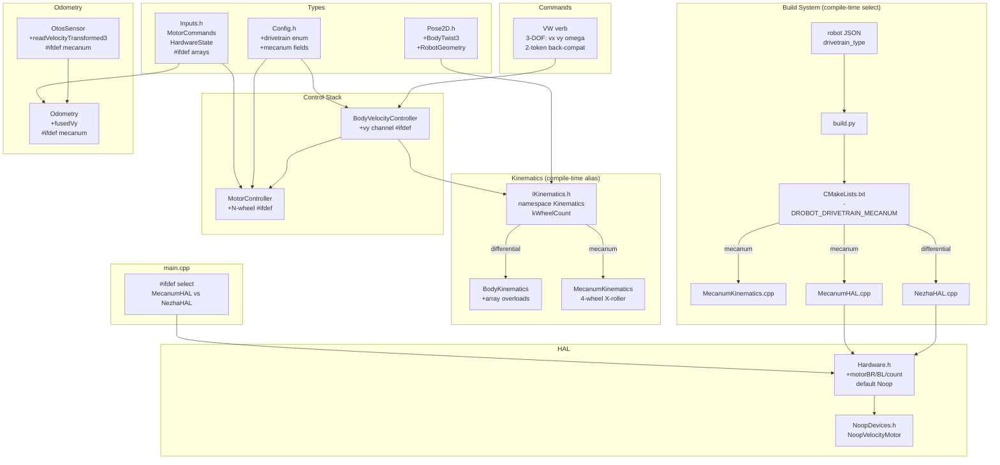
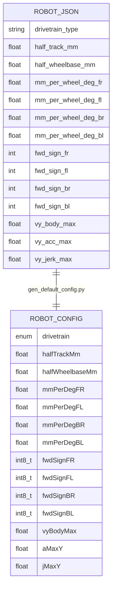
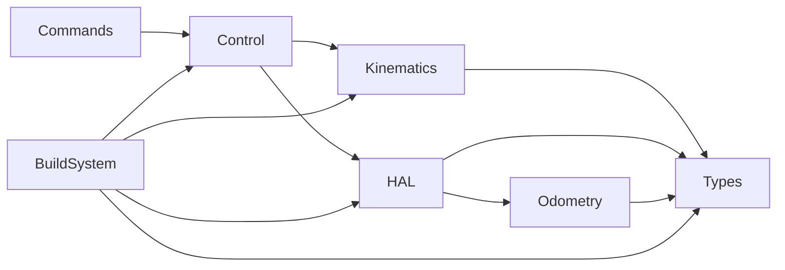

<!-- CLASI: Before changing code or making plans, review the SE process in CLAUDE.md -->

# Architecture Update — Sprint 046: Mecanum drivetrain (omnidirectional)

## What Changed

This sprint introduces a compile-time drivetrain select that gates seven
mutually exclusive code layers behind `#ifdef ROBOT_DRIVETRAIN_MECANUM`.
In the differential build (`#ifndef ROBOT_DRIVETRAIN_MECANUM` effectively,
by absence of the define) every existing file is byte-identical — no
differential code is touched.

### A. Build system: compile-time drivetrain select

**Files changed:** `data/robots/robot_config.schema.json`,
`scripts/gen_default_config.py`, `source/types/Config.h`,
`CMakeLists.txt`, `tests/_infra/sim/CMakeLists.txt`, `build.py`,
`host/robot_radio/config/robot_config.py`.

The drivetrain variant is determined by `identity.drivetrain_type` in the
robot JSON (`"differential"` default | `"mecanum"`). `build.py` reads this
field from the resolved active robot and passes `-DROBOT_DRIVETRAIN=mecanum`
(or `=differential`) to CMake. CMake mirrors the existing `ROBOT_RUN_MODE`
block (lines 270–299):

```
if ("${ROBOT_DRIVETRAIN}" STREQUAL "mecanum")
    message("ROBOT_DRIVETRAIN: mecanum")
    add_definitions(-DROBOT_DRIVETRAIN_MECANUM)
    list(FILTER SOURCE_FILES EXCLUDE REGEX ".*/io/real/NezhaHAL\\.cpp$")
else()
    message("ROBOT_DRIVETRAIN: differential (default)")
    list(FILTER SOURCE_FILES EXCLUDE REGEX ".*/io/real/MecanumHAL\\.cpp$")
    list(FILTER SOURCE_FILES EXCLUDE REGEX ".*/control/MecanumKinematics\\.cpp$")
endif()
```

The sim `CMakeLists.txt` gets the same block (defaulting to differential so
all existing sim tests remain unaffected). Source guards always use
`#ifdef ROBOT_DRIVETRAIN_MECANUM` (not `#ifndef`), per the in-repo convention
at CMakeLists.txt:293.

`RobotConfig` gains a read-only enum field `drivetrain` (`DIFFERENTIAL=0`,
`MECANUM=1`) baked by `gen_default_config.py` from `drivetrain_type`; it is
used for boot assertions and `ID` telemetry only — no live `SET` key. The
schema `additionalProperties: false` constraint is relaxed for the
`identity` section to allow `drivetrain_type`, and two new optional schema
sections are added for mecanum geometry and per-wheel calibration.

New schema sections (all optional with defaults; absent fields yield the
differential default so `tovez.json` produces an additive-only diff):

- `identity.drivetrain_type`: `"differential"` | `"mecanum"` (default
  `"differential"`).
- `mecanum_geometry`: `half_track_mm`, `half_wheelbase_mm` (MEASURE placeholders
  in the robot JSON; these feed `RobotGeometry` in firmware).
- `mecanum_calibration`: `mm_per_wheel_deg_fr/fl/br/bl`, `fwd_sign_fr/fl/br/bl`
  (bench-calibrated; FL=+1 primary ref), `vy_body_max`, `vy_acc_max`,
  `vy_jerk_max`.

`gen_default_config.py` adds new `kind: enum_drivetrain` handler and
constant-default lines for all new fields, structured so the differential
output is additive-constant only.

`host/robot_radio/config/robot_config.py` adds `drivetrain_type` as an
optional string field (stays drivetrain-agnostic for motion commands).

### B. Kinematics abstraction: compile-time namespace alias

**Files added:** `source/control/IKinematics.h`,
`source/control/MecanumKinematics.h`, `source/control/MecanumKinematics.cpp`.

**Files changed:** `source/control/BodyKinematics.h`,
`source/control/BodyKinematics.cpp`, `source/io/capability/Pose2D.h`.

`Pose2D.h` gains two new POD types (mecanum build and documentation use only;
no impact on differential consumers of `BodyTwist`/`Pose2D`):

```cpp
struct BodyTwist3   { float vx_mmps, vy_mmps, omega_rads; };  // 3-DOF body twist
struct RobotGeometry { float halfTrackMm, halfWheelbaseMm; };  // mecanum geometry
```

`IKinematics.h` provides the compile-time namespace alias and wheel count:

```cpp
#ifdef ROBOT_DRIVETRAIN_MECANUM
  namespace Kinematics = MecanumKinematics;
  constexpr int kWheelCount = 4;
#else
  namespace Kinematics = BodyKinematics;   // array-form overloads (see below)
  constexpr int kWheelCount = 2;
#endif
```

`BodyKinematics.{h,cpp}` gains **array-form overloads** alongside the existing
scalar forms (kept verbatim; differential callers unchanged):

```cpp
// Array overloads — differential adapter that ignores vy (always 0).
void inverse(BodyTwist3 t, float b, float wheels[2]);
void forward(const float wheels[2], float b, BodyTwist3& t);
void saturate(float wheels[2], float vWheelMax, float steerHeadroom, float out[2]);
```

`MecanumKinematics.{h,cpp}` implements the 4-wheel X-roller map. Wheel order
is canonical `[FR=0, FL=1, BR=2, BL=3]` matching Nezha ports 1,2,3,4. The
combined geometry constant `k = halfTrackMm + halfWheelbaseMm`.

```
inverse:  FR = (vx - vy - k*omega) * signFR
          FL = (vx + vy + k*omega) * signFL
          BR = (vx + vy - k*omega) * signBR
          BL = (vx - vy + k*omega) * signBL

forward:  vx    = (FR + FL + BR + BL) / 4
          vy    = (-FR + FL + BR - BL) / 4
          omega = (-FR + FL - BR + BL) / (4k)

saturate: uniform scale s = (vWheelMax / max(|wi|)); applied when max > vWheelMax.
          Preserves twist direction (no per-wheel clipping).
```

`fwd_sign_*` multipliers (from config) are applied inside `MecanumKinematics`
so the signs baked from the bench calibration propagate cleanly.

### C. 3-DOF threading through control and command stacks

**Files changed:** `source/control/BodyVelocityController.{h,cpp}`,
`source/control/MotorController.{h,cpp}`, `source/types/Inputs.h`,
`source/app/MotionCommandHandlers.cpp`.

**BodyVelocityController** gains a third profiled channel `_vy`/`_vyTgt` under
`#ifdef ROBOT_DRIVETRAIN_MECANUM`, using the same trapezoid/S-curve infrastructure
as the existing `_v` channel (`vyBodyMax`, `aMaxY`, `jMaxY` config fields). The
`advance()` method replaces the `BodyKinematics::inverse / saturate` scalar calls
with `Kinematics::inverse(BodyTwist3{_v, _vy, _omega}, _geom, _wheels)` +
`Kinematics::saturate(_wheels, ...)`. A `_geom` member (type `RobotGeometry`) is
built once from config at construction. Anti-windup back-calculation
(`BodyKinematics::forward` / `MecanumKinematics::forward`) uses the array form.
`setTarget` grows an optional `vy_mms` parameter (defaulting to 0 so all existing
callers compile unchanged).

**MotorController** changes are macro-gated:

- In the **differential build**: the class is byte-identical. The constructor,
  `_motorL`/`_motorR` members, `setTarget(float, float)`, and `controlTick`
  remain unchanged. Array shim `setTarget(const float*, int)` is added but
  calls through to the existing `setTarget(float, float)`.
- In the **mecanum build**: holds `IMotor* _motor[4]` and
  `VelocityController _vc[4]`; `controlTick` iterates over N wheels. The
  2-wheel sync-coupling block is disabled (gated out under
  `#ifndef ROBOT_DRIVETRAIN_MECANUM`) because there is no clean 4-wheel
  analog; each wheel runs its independent PI+FF loop.

**MotorCommands / HardwareState** (`source/types/Inputs.h`) gain array-widened
fields under the mecanum guard:

```cpp
#ifdef ROBOT_DRIVETRAIN_MECANUM
    float tgtMms[4];   // [FR, FL, BR, BL]
    int16_t pwm[4];
    float encMm[4];
    float velMms[4];
    // L/R scalar aliases for shared code that still names tgtLMms/tgtRMms:
    float& tgtLMms = tgtMms[1];   // FL
    float& tgtRMms = tgtMms[0];   // FR
    ...
#else
    // Existing scalar fields unchanged — byte-identical differential layout.
    float tgtLMms; float tgtRMms;
    int16_t pwmL;  int16_t pwmR;
    float encLMm;  float encRMm;
    float velLMms; float velRMms;
#endif
```

**Command grammar** (`MotionCommandHandlers.cpp`): `VW` is extended to 3-DOF.
No new command verbs are introduced; `VW` remains the single unified body-twist
primitive:

```
VW <vx> <omega>           — existing 2-token form; vy=0 (back-compatible, both builds)
VW <vx> <vy> <omega>      — 3-token form (mecanum build only, #ifdef-gated)
```

The parser checks for a third token under `#ifdef ROBOT_DRIVETRAIN_MECANUM`; if
absent `vy` defaults to `0.0f`. Both forms call
`BodyVelocityController::setTarget(vx, omega_rad, vy)`. For mecanum the body
velocity simply becomes 2-D: `vy` was always architecturally present (defaulting
to zero) and now carries a real lateral component.

### D. OTOS-led odometry + lateral velocity

**Files changed:** `source/io/real/OtosSensor.cpp`,
`source/control/Odometry.{h,cpp}`.

**OtosSensor.cpp**: `readVelocityTransformed()` currently collapses the OTOS
velocity to `{v_mmps, omega_rads}` (a `BodyTwist`). Under the mecanum build,
the OTOS velocity registers already contain the full `(vx, vy, omega)` triplet
in the chip's body frame (the in-chip mounting-offset transform already handles
the `odomOffX=-51.5 mm` shift). A new accessor
`readVelocityTransformed3(BodyTwist3& out)` is added (mecanum build only); it
reads the same registers but returns all three components.

**Odometry.cpp**: The differential `predict` / `correctEKF` paths are
completely untouched. Under `#ifdef ROBOT_DRIVETRAIN_MECANUM`:

- A `_fusedVy` field is added to `Odometry` (alongside `fusedV`/`fusedOmega`).
- `correctEKF` is extended to fuse `vy` from OTOS as a direct observation
  (`_fusedVy = alpha * vy_otos + (1-alpha) * _fusedVy` — a simple
  complementary filter, not a new EKF state). The differential 5-state EKF
  is entirely unchanged.
- `s.fusedVy` is written back to `HardwareState` (new field, mecanum guard).

The rationale for the simple complementary channel over a new EKF state: the
OTOS directly observes the full planar velocity. A 6th EKF state would be a
random walk with the OTOS as the only update — mathematically equivalent to the
complementary filter but with higher code complexity and no accuracy gain.
Deferred to a future sprint if bench data shows the simple filter is inadequate.

### E. HAL: MecanumHAL + NoopDevices refactor

**Files added:** `source/io/real/MecanumHAL.{h,cpp}`,
`source/io/NoopDevices.h`.

**Files changed:** `source/io/Hardware.h`, `source/main/main.cpp`.

`MecanumHAL` is a sibling of `NezhaHAL`: same base class (`Hardware`), same
non-motor devices (OTOS, color sensor, portIO, gripper, bus diagnostics, raw
bus access). Motor members: four `Motor` instances constructed with Nezha ports
1–4 and the `fwd_sign_{fr,fl,br,bl}` values from config.

```
_motorFR  (_bus, 1, fwdSignFR)   // port 1
_motorFL  (_bus, 2, fwdSignFL)   // port 2
_motorBR  (_bus, 3, fwdSignBR)   // port 3
_motorBL  (_bus, 4, fwdSignBL)   // port 4
```

`motorL()` / `motorR()` return `_motorFL` / `_motorFR` (front pair, same
semantic as the differential HAL's left/right). New accessors `motorBR()` /
`motorBL()` return the rear pair. `motorCount()` returns 4.

`Hardware.h` gains additive default-Noop virtual methods:

```cpp
virtual IVelocityMotor& motorBR()  { return _noopMotor; }
virtual IVelocityMotor& motorBL()  { return _noopMotor; }
virtual int             motorCount() const { return 2; }
```

These default to Noop so all existing `Hardware` subclasses (MockHAL,
ReplayHAL, NezhaHAL) compile unchanged without modification.

`NoopVelocityMotor` is factored out of `ReplayHAL.h` into
`source/io/NoopDevices.h` and reused by `Hardware.h`'s default accessors and
`MecanumHAL`'s unused-port stubs.

`main.cpp` gains one `#ifdef` select:

```cpp
#ifdef ROBOT_DRIVETRAIN_MECANUM
    MecanumHAL hw(i2c, io, cfg);
#else
    NezhaHAL   hw(i2c, io, cfg);
#endif
```

`Robot` binding is unchanged (still takes `Hardware&`).

`MecanumHAL::tick()` drives the split-phase encoder read for four motors
(using the same `RIGHT-BEFORE-LEFT` ordering convention, extended: FR, BR,
FL, BL to match the Nezha bus layout). `tick(now_ms, cmds)` integrates
all four commanded velocities into the bench OTOS plant when bench mode is on.

Line sensor: `MecanumHAL` constructs a `LineSensor` member (same as
`NezhaHAL`) but the mecanum robot has no physical line sensor. The `begin()`
probe will fail gracefully — already handled by the existing
`LineSensor::begin()` absence logic — and no drive logic consumes it.

### F. New robot JSON + config scaffold

**Files added:** `data/robots/<5-char-name>.json`.
**Files changed:** `data/robots/active_robot.json`.

The mecanum robot JSON includes:

- `identity.drivetrain_type: "mecanum"`
- `geometry.odometry_offset_mm: {x: -51.5, y: 0, yaw_rad: 0}`
- `calibration.fwd_sign_fr: -1`, `fwd_sign_fl: +1`, `fwd_sign_br: -1`,
  `fwd_sign_bl: +1` (FL is the primary reference; right-side motors are −1).
- MEASURE/CALIBRATE placeholders for `half_track_mm`, `half_wheelbase_mm`,
  `mm_per_wheel_deg_*`.
- `encoders.encoder_count: 4` (updated after bench verification of which
  wheels are encodered).
- Color sensor present; line sensor absent (graceful absence).

The 5-char micro:bit announcement name (read from first-flash) becomes the
JSON filename and `identity.robot_name`. `active_robot.json` is a one-line
pointer; switching robots is a single edit.

### G. Telemetry extensions

**Files changed:** `source/app/TelemetryHandler.cpp` (or equivalent).

Under `#ifdef ROBOT_DRIVETRAIN_MECANUM`:

- `twist=` field gains `vy=<value>` (e.g. `twist= vx=123.4 vy=-12.1
  omega=0.34`).
- `vel=` field is extended from 2 wheels to 4 (e.g. `vel=vFR,vFL,vBR,vBL`).
  In the differential build `vel=` remains `vel=vL,vR` (unchanged format).

---

## Component / Module Diagram



## Entity-Relationship: Config additions



## Dependency graph



No cycles. Direction: Commands → Control → Kinematics/HAL → Types.
Build system is orthogonal (compile-time only, no runtime dependency).

---

## Why

The firmware's hard-coded 2-wheel differential assumption prevents supporting
a second robot without forking the repo. Compile-time selection (mirroring
the existing `ROBOT_RUN_MODE` / `PRODUCTION_BUILD` pattern already in the
codebase) is the minimal change that:

1. Keeps the differential build byte-identical (no risk to the production robot).
2. Avoids a vtable on the per-tick kinematics path (Cortex-M4 latency budget).
3. Uses a pattern already understood by the codebase maintainer.

OTOS-led lateral velocity avoids extending the differential 5-state EKF
(non-holonomic) to a 6-state holonomic form, which would be a significant
risk to the already-calibrated differential odometry.

---

## Impact on Existing Components

| Component | Impact |
|---|---|
| `NezhaHAL.{h,cpp}` | None — unchanged. Excluded from mecanum build. |
| `BodyKinematics.{h,cpp}` | Additive: array-form overloads added; scalar forms untouched. |
| `BodyVelocityController` | Additive `#ifdef` block for `vy` channel; differential path byte-identical. |
| `MotorController` | Sync-coupling block gated out in mecanum build; differential path unchanged. |
| `Inputs.h` | Struct layout diverges under macro; `L/R` aliases preserve differential callers. |
| `Hardware.h` | Additive default-Noop virtual methods; existing subclasses need no changes. |
| `Odometry.cpp` | Additive `#ifdef` lateral channel; differential EKF path untouched. |
| `OtosSensor.cpp` | Additive `readVelocityTransformed3` method; existing method unchanged. |
| `ReplayHAL.h` | `NoopVelocityMotor` refactored out to `NoopDevices.h` (included back, so no API change). |
| `MockHAL` (host sim) | `motorBR`/`motorBL`/`motorCount` default Noops inherited from `Hardware.h`; no override needed unless sim tests exercise 4-wheel path. |
| `Pose2D.h` | Additive: `BodyTwist3` and `RobotGeometry` structs added; existing `BodyTwist` unchanged. |
| `robot_config.schema.json` | Additive optional sections; `additionalProperties: false` relaxed for `identity`. |
| Sim test suite | Zero regressions expected: no differential code changed; mecanum code excluded from differential sim build. |

---

## Migration Concerns

1. **`tovez.json` is unchanged.** No migration needed for the differential robot.
2. **`active_robot.json` pointer** must be updated to select the mecanum JSON
   before a mecanum build; switching back restores the differential build.
3. **`ReplayHAL.h` refactor**: `NoopVelocityMotor` moves to `NoopDevices.h`.
   `ReplayHAL.h` will `#include "NoopDevices.h"` to preserve its existing
   behaviour. Any other file that imported `NoopVelocityMotor` from
   `ReplayHAL.h` needs a one-line include update (search: none known).
4. **`MotorCommands` / `HardwareState` struct layout** diverges between builds
   under the macro. Binary-incompatibility is intentional and contained to the
   single-binary firmware image; no cross-build serialisation occurs.

---

## Design Rationale

### DR-1: Compile-time select vs runtime polymorphism

**Decision:** Compile-time `#ifdef` + namespace alias; no vtable.
**Context:** Per-tick kinematics runs on Cortex-M4 inside the cooperative
control loop at ~40 Hz; an indirect call per tick adds ~10 ns but more
importantly prevents inlining of the trivial 4-multiply inverse/forward.
**Alternatives:** `virtual IKinematics` interface (vtable per call); template
policy class (heavier syntax); runtime enum switch.
**Why this:** Mirrors the existing `ROBOT_RUN_MODE` and `PRODUCTION_BUILD`
patterns already in the repo; zero runtime cost; no new dependency direction.
**Consequences:** Both drivetrains cannot be linked into the same binary.
This is acceptable: the robot is flashed for a specific chassis.

### DR-2: OTOS-trusting lateral channel vs 6-state EKF

**Decision:** Simple complementary filter for `vy` in the mecanum build;
differential 5-state EKF untouched.
**Context:** The OTOS chip directly observes `(vx, vy, omega)` in body frame
including the lever-arm compensation for the -51.5 mm offset. A 6th EKF
state (`vy`) would be a random-walk process updated only by OTOS — the filter
gain would converge to ~1 (OTOS dominates), making it equivalent to the
simpler direct assignment.
**Alternatives:** Extend EKF to 6 states (holonomic); 4-wheel encoder
forward-kinematics-derived vy (complex, sensitive to per-wheel sign errors).
**Why this:** Minimal change; no risk to the differential EKF which is
already calibrated and green; can be upgraded to a full EKF state in a later
sprint if bench data justifies it.
**Consequences:** `fusedVy` lags OTOS by one complementary-filter time constant.
No impact on the forward/omega EKF path.

### DR-3: Sync-coupling disabled in mecanum build

**Decision:** The 2-wheel sync-coupling ("slowest wheel governs") in
`MotorController` is disabled for the mecanum build via `#ifndef`.
**Context:** The sync-coupling formula computes a target ratio from 2 wheels.
There is no clean 4-wheel generalization without defining which pairs to
couple, and the mecanum wheels are intentionally driven at different speeds
to achieve the commanded body twist.
**Consequences:** Each wheel runs an independent PI+FF loop. Cross-wheel
interactions (load sharing, slip) are not compensated. This is the standard
approach for mecanum controllers; the OTOS provides the ground-truth feedback
to compensate drift.

### DR-4: `MotorCommands`/`HardwareState` layout divergence

**Decision:** Array-form fields gated by `#ifdef`; `L/R` scalar references
alias `[1]`/`[0]` (FL/FR).
**Context:** Widening the structs unconditionally would add unused fields to
the differential build and risk padding changes affecting the golden-TLM oracle.
**Alternatives:** Always-4-element arrays with unused slots (simpler headers but
wastes RAM and risks oracle diff); separate mecanum-only types.
**Why this:** Keeps the differential struct identical; the alias references
let shared code (`startDrive`, `stop`, `setTarget(L,R)`) compile unchanged.
**Consequences:** The header is harder to read; the aliases must be carefully
declared as references in an `#ifdef` block.

---

## Open Questions

1. **5-char micro:bit announcement name**: Not yet known. T4 reads it from
   the first-flash output. The JSON filename and `robot_name` field are
   finalized at that point. The stub JSON created in T4 uses a placeholder
   name (e.g. `mecanum-proto.json`) until the name is known.

2. **Which wheels are encodered?** The issue states all 4 Nezha motors but
   should be confirmed on the bench during T4. If only 2 wheels are encodered
   the `forward` kinematics path for encoder-derived forward velocity needs
   to handle the partial observation (OTOS-led anyway, so secondary concern).

3. **6-state EKF deferred decision point**: if bench data from T6/T8 shows
   `fusedVy` lag is unacceptable for closed-loop lateral control, a follow-on
   sprint can add the 6th state. The simple complementary filter in T6 is
   the correct first-pass.

4. **Distance-bounded lateral motion**: if a future sprint adds distance-bounded
   lateral commands (e.g. via `VW` with a duration/distance flag), the OTOS
   y-pose delta is the natural stop condition; this requires OTOS to be healthy.
   Deferred — not in scope for sprint 046.
