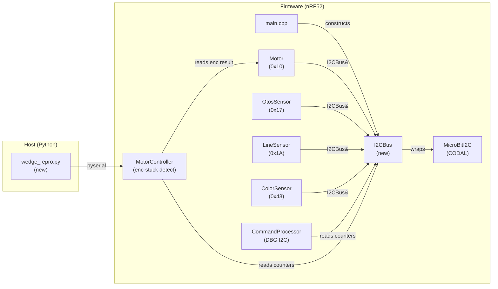

<!-- CLASI: Before changing code or making plans, review the SE process in CLAUDE.md -->

# Architecture Update -- Sprint 015: Encoder/I2C Wedge Diagnosis and Fix

## Sprint-Scope Note

This is a **diagnostic sprint**. The scope is Phase 0 (headless repro harness)
and Phase 1 (instrumentation) from the issue plan. Phase 2 (experiment
discrimination) and Phase 3 (fix implementation) are explicitly out of scope.
No fix is implemented here. The architecture changes below add observability
infrastructure only.

---

## What Changed

### New: `I2CBus` wrapper (`source/hal/I2CBus.h`, `source/hal/I2CBus.cpp`)

A thin class wrapping `MicroBitI2C&` that intercepts every `write()` and
`read()` call. It provides:

- **Per-device counters**: transaction count and error count, keyed by I2C
  address.
- **Last error code**: per device, the most recent non-OK CODAL return value.
- **Re-entrancy guard**: a `bool _inUse` flag set at transaction entry and
  cleared at exit; the check/set is atomic via
  `target_disable_irq()`/`target_enable_irq()`. A re-entrancy violation counter
  and the in-flight address pair are captured if a second entry occurs while
  `_inUse` is set.
- **Stuck encoder counter**: a "consecutive identical 0x10 reads while
  commanded PWM != 0" counter, maintained by the Motor class using the
  I2CBus read return value; the bus wrapper itself does not know encoder
  semantics.

The wrapper is intentionally NOT a lock. It is a diagnostic. Adding a plain
mutex here would be a no-op in the single-loop architecture (no second context
to exclude), and the re-entrancy guard turns the concurrency assumption into a
measured fact.

### Modified: `Motor`, `OtosSensor`, `LineSensor`, `ColorSensor` constructors

Each device class currently takes `MicroBitI2C&`. After this sprint they take
`I2CBus&`. Only the constructor signature and stored reference type change;
all `_i2c.write()` / `_i2c.read()` call sites are unchanged except that they
now go through `I2CBus` instead of `MicroBitI2C` directly.

### Modified: `source/main.cpp`

One `static I2CBus bus(uBit.i2c)` constructed from `uBit.i2c` before device
construction. All four device constructors receive `bus` instead of `uBit.i2c`.
The `I2CBus` instance is accessible to `CommandProcessor` via `Robot` or passed
directly — see Design Rationale below.

### Modified: `source/app/CommandProcessor.cpp`

New `DBG I2C` sub-command. Emits a single line (fits in ≤255 bytes):

```
I2C txn=N0/N1/N2/N3 err=E0/E1/E2/E3 lastErr=X0/X1/X2/X3 reentry=R stuck=S
```

where indices correspond to devices 0x10/0x17/0x1A/0x43 respectively.

### Modified: `source/control/MotorController.cpp` (or `source/robot/Robot.cpp`)

Encoder-stuck detection: after collecting encoder values each tick, if N
consecutive identical reads occur while commanded velocity is non-zero, emit
`EVT enc_wedged txn=... err=... reentry=... lastErr=...` once and reset the
consecutive counter. The `I2CBus` reference is threaded to wherever this
detection lives.

### New: `tests/bench/wedge_repro.py`

Pure-pyserial (no matplotlib) bench harness. Connection pattern mirrors
`tests/bench/drive_raw.py`: dtr=False, dsrdtr=False, PING liveness check,
`SET sTimeout=2000`, `STREAM 40`, S keepalive at ~150 ms interval.

Modes:
- `--clean-stop`: sends `STOP` command explicitly after each drive phase.
- `--watchdog-stop`: lets keepalive lapse for `sTimeout + margin` ms so the
  firmware S-watchdog fires the stop.
- `--cycles N`: number of drive→stop→drive cycles (default 50).
- `--speed V`: wheel speed for the S command (default 200).

Wedge detection: after each stop→restart, reads streaming lines for 1.5 s and
checks whether any `enc=L,R` line shows |L| or |R| growing (clean) vs both
staying ≈ 0 (wedged). Reports per-cycle result and final wedge rate.

---

## Why

The encoder wedge is intermittent and micro:bit-reset-recoverable, which means
the TWIM peripheral or CODAL driver state is corrupted. Every I2C return code
is currently discarded, so the failure is invisible. The leading theories are:

- T1: a sensor-read NACK/timeout leaves CODAL's TWIM recovery incomplete before
  the next Nezha encoder read.
- T2: the firmware `fullStop` watchdog path provokes a different bus sequence
  than a clean `STOP`, wedging the TWIM.
- T3: an overlapping I2C caller (ruled out by analysis but unconfirmed by
  measurement).

This sprint makes all three theories testable by measurement rather than
analysis:
- `I2CBus` makes T1 and T3 visible (error codes + re-entrancy counter).
- `wedge_repro.py` discriminates T1/T2 by comparing clean-stop vs watchdog-stop
  wedge rates.
- `EVT enc_wedged` gives the exact bus state at the moment of failure.

---

## Impact on Existing Components

| Component | Change | Impact |
|-----------|--------|--------|
| `Motor` | Constructor sig: `MicroBitI2C&` → `I2CBus&` | Call sites in `main.cpp` only; no behavioral change. |
| `OtosSensor` | Constructor sig: `MicroBitI2C&` → `I2CBus&` | Call site in `main.cpp` only. |
| `LineSensor` | Constructor sig: `MicroBitI2C&` → `I2CBus&` | Call site in `main.cpp` only. |
| `ColorSensor` | Constructor sig: `MicroBitI2C&` → `I2CBus&` | Call site in `main.cpp` only. |
| `main.cpp` | One new `I2CBus bus(uBit.i2c)` object; four constructor call sites updated. | Build only; no runtime behavior change. |
| `CommandProcessor` | New `DBG I2C` branch; needs access to `I2CBus`. | Existing `DBG` dispatch expanded; no existing commands affected. |
| `MotorController` (or `Robot`) | Encoder-stuck detection + EVT emission. | Adds ~5 lines in the control tick; no effect when no wedge. |

`I2CBus` wraps `MicroBitI2C` by reference; its `write()`/`read()` methods
forward to the underlying CODAL API with the same signature. The forwarding is
synchronous and adds only the atomic bool check overhead (negligible at 100 Hz).

---

## Component Diagram



---

## Migration Concerns

No data migration. This sprint introduces no persistent state.

The constructor signature change for `Motor`, `OtosSensor`, `LineSensor`, and
`ColorSensor` is a breaking compile-time change: all four call sites in
`main.cpp` must be updated in the same ticket as the class changes (Ticket 2).
There is no runtime backward-compatibility concern because these objects are
constructed once in `main()`.

The `I2CBus` wrapper must be constructed and destroyed in the same scope as
`uBit.i2c` — both are `static` in `main()`, so destruction order is LIFO and
safe.

---

## Design Rationale

### Decision: `I2CBus` is a diagnostic guard, not a lock

**Context**: T3 (concurrency) was ruled out by analysis (single cooperative
loop, non-yielding busy-waits in encoder reads, no ISR I2C). However, the
analysis is untested.

**Alternatives considered**:
1. Add a real mutex/critical section around I2C calls.
2. Add only return-code capture, no re-entrancy guard.
3. Add re-entrancy guard + return-code capture (chosen).

**Why this choice**: A real mutex would be a runtime no-op in the current
architecture (nothing to exclude) and would obscure the real cause. Return-code
capture alone is the highest single-value step but leaves T3 unconfirmed.
Option 3 turns both T1 and T3 into measurable facts in one wrapper without
changing behavior.

**Consequences**: If the re-entrancy counter never trips, T3 is ruled out by
data and the wrapper remains as a diagnostic. Sprint 016 (the fix sprint) can
then add real recovery logic to `I2CBus` if T1 is confirmed.

### Decision: `I2CBus` passed by reference, not a singleton

**Context**: Multiple device classes need access; `CommandProcessor` needs read
access to counters.

**Why**: A reference parameter keeps the dependency explicit and testable.
A global singleton would be easier but introduces implicit coupling and makes
unit testing harder. The number of call sites (five: four device constructors +
one `CommandProcessor`) is small enough that explicit threading is tractable.

### Decision: Encoder-stuck detection in `MotorController`, not `Motor`

**Context**: `Motor` knows raw I2C values; `MotorController` knows commanded
velocity.

**Why**: The wedge condition requires both facts: identical encoder value AND
non-zero commanded velocity. `Motor` cannot see commanded velocity.
`MotorController` has both and already processes encoder deltas each tick.

---

## Open Questions

1. **Access path for `I2CBus` in `CommandProcessor`**: The cleanest route is to
   pass the `I2CBus&` reference through `Robot` and expose a `i2cBus()` getter,
   or to pass it directly to `CommandProcessor`'s constructor. This is a
   contained wiring decision for Ticket 3; either approach is acceptable.

2. **Consecutive-read threshold for `EVT enc_wedged`**: The issue suggests "N
   consecutive reads". A value of 5 consecutive identical reads while PWM != 0
   is a reasonable starting point (one per ticket: confirm or adjust during
   implementation).

3. **`DBG I2C` line format**: The format above fits 255 bytes for the expected
   counter magnitudes. If counters exceed 5 digits per device the line may
   overflow. Implementation should use `snprintf` with a length check and
   truncate safely.
