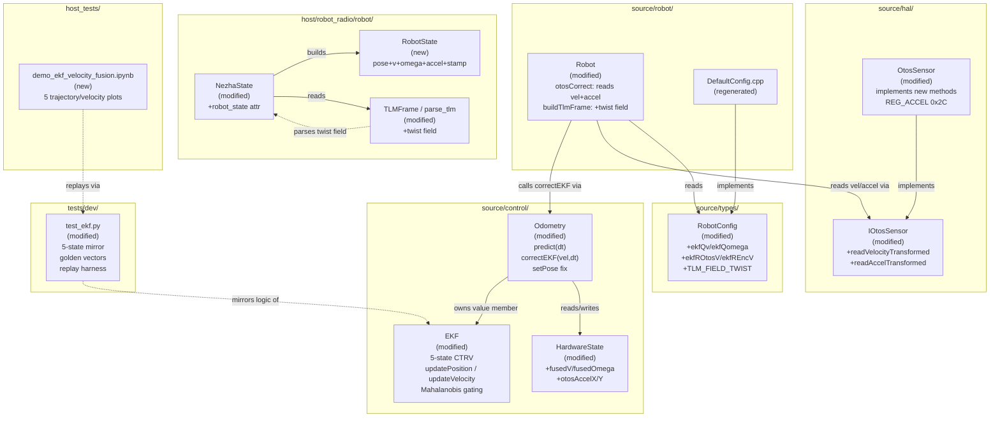
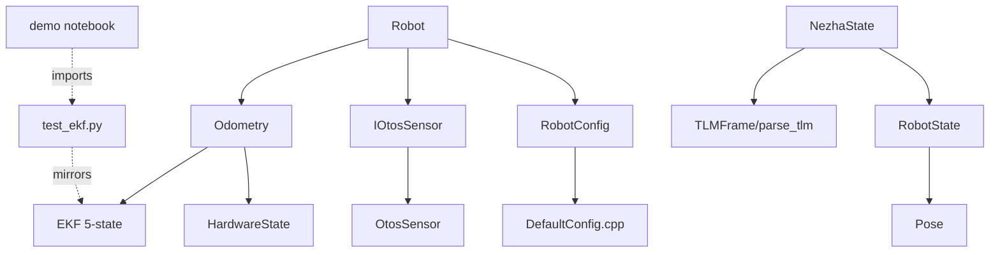
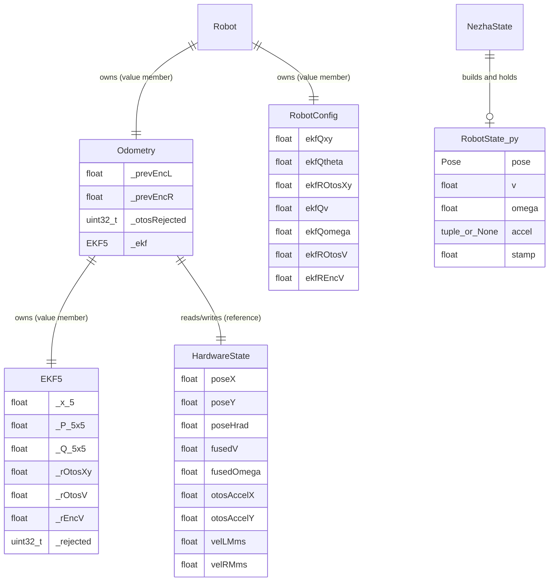

# Architecture Update — Sprint 023: EKF Velocity Fusion and Robot Motion State

## What Changed

Sprint 023 extends the 3-state EKF from sprint 022 to a 5-state CTRV model, adds
an OTOS velocity/acceleration read path, introduces Mahalanobis outlier gating on
all update channels, fixes a latent `setPose` encoder re-baseline bug, adds a
`twist=` telemetry field, and builds a unified `RobotState` composite dataclass
on the host side.

1. **`EKF`** (modified, `source/control/EKF.h/.cpp`) — state grows from
   `[x,y,theta]` to `[x,y,theta,v,omega]`; covariance from 3x3 to 5x5.
   `predict()` gains a `dt` argument; the velocity block uses a random-walk model
   (`v` and `omega` are carried with process noise but not coupled into x,y in the
   Jacobian). New `updateVelocity(v_meas, omega_meas, r_v, r_omega)` method fuses
   a single (v, omega) measurement pair. The existing `update(x_otos, y_otos)`
   becomes `updatePosition(x, y)`. All three update methods apply Mahalanobis
   gating before modifying state or covariance. New accessors: `v()`, `omega()`.
   New init signature: `init(q_xy, q_theta, q_v, q_omega, r_otos_xy, r_otos_v, r_enc_v)`.
   All operations fully unrolled; no heap allocation; no STL.

2. **`IOtosSensor`** (modified, `source/hal/IOtosSensor.h`) — two new pure-virtual
   methods: `readVelocityTransformed(const RobotConfig&)` returning an
   `OtosVelocity { float v_mmps; float omega_rads; }` struct, and
   `readAccelTransformed(const RobotConfig&)` returning an
   `OtosAccel { float ax_mmps2; float ay_mmps2; }` struct.

3. **`OtosSensor`** (modified, `source/hal/OtosSensor.h/.cpp`) — implements the
   two new interface methods. Uses the existing `readXYH()` helper on
   `REG_VELOCITY_XL (0x26)` and a new `REG_ACCELERATION_XL (0x2C)` constant.
   Scale factors and frame transforms follow `readTransformed()`.

4. **`RobotConfig`** (modified, `source/types/Config.h`) — four new float fields
   after `ekfROtosXy`: `ekfQv`, `ekfQomega`, `ekfROtosV`, `ekfREncV`. New
   bitmask constant `TLM_FIELD_TWIST = (1u << 5)` alongside the existing field
   constants.

5. **`HardwareState`** (modified, `source/control/RobotState.h`) — four new float
   fields in `HardwareState`: `fusedV` (body linear speed, mm/s), `fusedOmega`
   (yaw rate, rad/s), `otosAccelX` (mm/s^2), `otosAccelY` (mm/s^2).

6. **`Odometry`** (modified, `source/control/Odometry.h/.cpp`) — `initEKF()`
   signature extends to include four new noise params. `predict()` gains a
   `dt_ms` argument (signed int32 to avoid uint32 underflow); passes `dt` to
   `_ekf.predict()` and writes `fusedV`/`fusedOmega` back to `HardwareState`.
   `correctEKF()` signature extends to receive OTOS velocity and encoder velocity
   measurements and `dt`; calls `_ekf.updatePosition()`, `_ekf.updateVelocity()`
   (twice — once for OTOS vel, once for encoder vel). The `setPose` bug is fixed:
   `_prevEncL = s.encLMm; _prevEncR = s.encRMm` (was `= 0.0f`).

7. **`Robot`** (modified, `source/robot/Robot.cpp`) — `otosCorrect()` is extended
   to call `otos.readVelocityTransformed(config)` and `otos.readAccelTransformed(config)`,
   store accel in `state.inputs.otosAccelX/Y`, and pass velocity measurements to
   `odometry.correctEKF()`. `buildTlmFrame()` gains a `twist=v,omega` field when
   `TLM_FIELD_TWIST` is set in `config.tlmFields`. The `STREAM fields=` parser
   recognises the `twist` token.

8. **`DefaultConfig.cpp`** (modified, `source/robot/DefaultConfig.cpp`) — four
   new EKF fields added; regenerated by `gen_default_config.py`.

9. **`RobotState` (Python)** (new, `host/robot_radio/robot/robot_state.py`) —
   frozen dataclass `RobotState { pose: Pose, v: float, omega: float,
   accel: tuple[float,float] | None, stamp: float }`. Imported by `NezhaState`;
   `Pose` is unchanged (pure position+heading, frozen, no velocity).

10. **`TLMFrame`** (modified, `host/robot_radio/robot/protocol.py`) — new optional
    field `twist: tuple[int, int] | None` (v_mmps, omega_mradps). `parse_tlm()`
    parses the `twist=` key-value pair.

11. **`NezhaState`** (modified, `host/robot_radio/robot/nezha_state.py`) — new
    `robot_state: RobotState | None` attribute. `_process_line()` constructs a
    `RobotState` from each TLM frame that carries both `pose=` and `twist=`.

12. **`tests/dev/test_ekf.py`** (modified) — Python EKF mirror extended to
    5-state. New test classes: `TestPredictVelocity`, `TestUpdateVelocity`,
    `TestMahalanobisGating`, `TestSetPoseRebaseline`. New golden-vector tests for
    Python/C++ parity. New replay harness function `replay_tlm_log()`.

13. **`host_tests/demo_ekf_velocity_fusion.ipynb`** (new) — demonstration
    notebook with five plots per the SUC-007 acceptance criteria.

---

## Why

After sprint 022, the EKF tracks pose (`x`,`y`,`theta`) but produces no
body-frame velocity. The raw per-wheel speeds `velLMms`/`velRMms` are noisy
(quantised at the encoder resolution, sub-200 ms updates) and uncombined.
Fusing velocity from two complementary sources — encoder-derived rate (high
update frequency, sensitive to quantisation noise) and OTOS native velocity (the
chip runs its own Kalman filter; smoother but has its own drift) — gives a better
velocity estimate than either source alone without adding a state-machine or
separate observer.

The 5-state CTRV model is a minimal extension: the position block is unchanged,
so the sprint-022 performance improvement to pose accuracy is preserved exactly.
Adding v,omega as random-walk states makes the filter aware of how fast the robot
is moving, which enables the "am I stopped?" guard on camera fixes and gives the
host a clean velocity signal for trajectory planning.

The `setPose` bug has been latent since sprint 014 (struct-based API). Every
camera fix injects a spurious encoder jump on the next predict step, corrupting
the EKF's position estimate for one tick and polluting the covariance. The fix is
a one-line change.

Mahalanobis gating replaces the fixed-distance `otosGate` with a statistically
principled rejection threshold that scales automatically as the covariance P
evolves — meaning it is tight when the filter is confident and loose when it is
uncertain.

---

## Module Definitions

### `EKF` (modified, `source/control/`)

**Purpose:** Implement a 5-state CTRV Extended Kalman Filter for differential-drive
motion estimation.

**Boundary (inside):** State vector `_x[5] = [x_mm, y_mm, theta_rad, v_mmps, omega_rads]`;
covariance `_P[5][5]`; diagonal process noise `_Q[5][5]`; noise scalars
`_rOtosXy`, `_rOtosV`, `_rEncV`. `predict(dCenter, dTheta, theta_before, dt)`:
position block uses arc-segment Jacobian unchanged; velocity block uses
random-walk (identity Jacobian). `updatePosition(x, y)`: 2D observation, same as
sprint 022 `update()` plus Mahalanobis gate. `updateVelocity(v, omega, r_v, r_omega)`:
1D + 1D scalar observations with separate Mahalanobis gates. `setPose()` also
zeroes the velocity states. Accessors: `v()`, `omega()`. All operations unrolled.

**Boundary (outside):** No HAL dependency, no I/O, no dynamic allocation. Input
units: mm, rad, mm/s, rad/s. Rejection counter (`_rejected`) incremented on gated
updates; readable via `rejectedCount()`.

**Use cases:** SUC-001, SUC-002, SUC-004, SUC-005

---

### `IOtosSensor` + `OtosSensor` (modified, `source/hal/`)

**Purpose:** Expose OTOS velocity and acceleration measurements in the same
transformed frame as position.

**Boundary (inside):** `OtosSensor` adds `REG_ACCELERATION_XL = 0x2C`. The
concrete `readVelocityTransformed()` implementation reads `REG_VELOCITY_XL` via
`readXYH()` and applies the same flip+rotation as `readTransformed()`. Body-frame
v/omega derivation: `v = sqrt(vx^2 + vy^2)` with sign from vx when heading is
near 0; `omega = h_lsb * lsb_per_rad`. `readAccelTransformed()` follows the same
pattern from `REG_ACCELERATION_XL`.

**Boundary (outside):** `IOtosSensor` declares both new methods as pure virtual.
`MockOtosSensor` (in `tests/`) must implement them; existing mock can return zeros
safely. `readVelocityTransformed()` and `readAccelTransformed()` never modify
`HardwareState` — they return value structs, following the `readTransformed()`
pattern.

**Use cases:** SUC-002, SUC-003

---

### `RobotConfig` (modified, `source/types/`)

**Purpose:** Carry the four new EKF velocity noise parameters and the `twist`
telemetry bitmask to `Robot::Robot()`.

**Boundary (inside):** Four new float fields (`ekfQv`, `ekfQomega`, `ekfROtosV`,
`ekfREncV`) after the existing `ekfROtosXy`. One new bitmask constant
`TLM_FIELD_TWIST = (1u << 5)`. No other changes.

**Boundary (outside):** `defaultRobotConfig()` supplies defaults. SET command
registry is not extended in this sprint.

**Use cases:** SUC-001, SUC-002

---

### `HardwareState` (modified, `source/control/`)

**Purpose:** Carry fused velocity and OTOS acceleration as first-class fields so
`buildTlmFrame()` and future controllers can read them without recomputing.

**Boundary (inside):** Four new float fields: `fusedV`, `fusedOmega`,
`otosAccelX`, `otosAccelY`. Written by `Odometry::predict()` and
`Odometry::correctEKF()`. No new `ValueSet` freshness envelope (velocity is
always co-updated with pose).

**Boundary (outside):** All existing fields unchanged. `defaultInputs()` zero-
initialises new fields automatically (they are plain floats in a zero-initialised
struct).

**Use cases:** SUC-001, SUC-002, SUC-006

---

### `Odometry` (modified, `source/control/`)

**Purpose:** Differential-drive pose and velocity tracker; drives the 5-state EKF.

**Boundary (inside):** `initEKF()` signature extended to accept four new noise
params. `predict()` gains `dt_ms` (signed int32) argument; computes encoder-rate
velocity and passes to `_ekf.predict()`; writes `fusedV`/`fusedOmega` to
`HardwareState`. `correctEKF()` signature extended to accept OTOS velocity,
encoder velocity, and `dt_ms`; calls `_ekf.updatePosition()` (Mahalanobis-gated),
`_ekf.updateVelocity()` for OTOS vel, and `_ekf.updateVelocity()` for encoder
vel. `setPose()` fix: `_prevEncL = s.encLMm; _prevEncR = s.encRMm`.

**Boundary (outside):** `Robot` is the only caller of `initEKF()`, `predict()`,
and `correctEKF()`. The `correct()` method (complementary filter) is preserved
unchanged. All existing Commandable handlers (OI/OZ/OR/OP/OV/OL/OA) unchanged.

**Use cases:** SUC-001, SUC-002, SUC-004, SUC-005

---

### `Robot` (modified, `source/robot/`)

**Purpose:** Wire the OTOS velocity/accel read path and `twist=` TLM emission.

**Boundary (inside):** `otosCorrect()` extended: calls
`otos.readVelocityTransformed(config)` and `otos.readAccelTransformed(config)`;
stores accel in `state.inputs.otosAccelX/Y`; passes velocity and `dt_ms` to
`odometry.correctEKF()`. `buildTlmFrame()` appends `twist=v,omega` when
`TLM_FIELD_TWIST` is set (v in mm/s integer, omega in mrad/s integer). `STREAM
fields=` parser recognises the `twist` token. Constructor `initEKF()` call
updated to pass four new params.

**Boundary (outside):** No new public methods on `Robot`. All other tasks
(control loop, line, color, ports) unchanged.

**Use cases:** SUC-001, SUC-002, SUC-003, SUC-006

---

### `RobotState` (new, `host/robot_radio/robot/`)

**Purpose:** Composite frozen dataclass carrying pose, velocity, acceleration, and
timestamp as one coherent motion state for host-side consumers.

**Boundary (inside):** `@dataclass(frozen=True) class RobotState: pose: Pose;
v: float; omega: float; accel: tuple[float,float] | None; stamp: float`. Imports
`Pose` from `nav.pose`. No logic — pure data container.

**Boundary (outside):** `Pose` is unchanged. `NezhaState` builds `RobotState`
and exposes it as `robot_state`. Navigation and path-following code that currently
reads `state.otos_pose` and `state.heading_rad` separately should migrate to
`state.robot_state.pose` over time (out of scope for this sprint).

**Use cases:** SUC-006

---

### `TLMFrame` + `parse_tlm` (modified, `host/robot_radio/robot/protocol.py`)

**Purpose:** Parse the new `twist=v,omega` TLM field and expose it as a typed
optional tuple.

**Boundary (inside):** `TLMFrame` gains `twist: tuple[int, int] | None = None`
(v_mmps, omega_mradps as integers, matching firmware snprintf formatting). 
`parse_tlm()` gains a `twist` case parallel to the existing `vel` case.

**Boundary (outside):** All existing `TLMFrame` fields and parse behavior
unchanged. Old clients that ignore `twist` are unaffected.

**Use cases:** SUC-006

---

### `NezhaState` (modified, `host/robot_radio/robot/`)

**Purpose:** Maintain `robot_state: RobotState | None` alongside existing sensor
attributes, built from each TLM frame.

**Boundary (inside):** New attribute `robot_state: RobotState | None = None`.
`_process_line()` extended: when `tlm.pose` and `tlm.twist` are both present,
construct `Pose` and `RobotState` and update `self.robot_state` under the lock.
When only `pose=` is present (no `twist=`), `robot_state` is updated with
`v=0.0`, `omega=0.0`, `accel=None`.

**Boundary (outside):** All existing attributes (`otos_pose`, `heading_rad`,
`encoders`, etc.) preserved unchanged for backward compatibility.

**Use cases:** SUC-006

---

## Architecture Diagrams

### Component Diagram (Sprint 023 additions and modifications)

### Dependency Graph

No cycles. Dependency direction: `Robot` → `Odometry` → `EKF` (pure math leaf).
`IOtosSensor` is an interface leaf. `RobotState` → `Pose` is a pure data
dependency. No production firmware component depends on the test or host layers.

### Entity-Relationship: EKF 5-state and HardwareState

---

## Impact on Existing Components

| Component | Change |
|-----------|--------|
| `source/control/EKF.h` | Extended: 5-state; new init/predict/updatePosition/updateVelocity/v/omega API |
| `source/control/EKF.cpp` | Rewritten: 5x5 covariance; block-decoupled Jacobian; Mahalanobis gating |
| `source/hal/IOtosSensor.h` | Add `OtosVelocity`, `OtosAccel` structs; add two pure-virtual methods |
| `source/hal/OtosSensor.h` | Add `REG_ACCELERATION_XL`; declare two new methods |
| `source/hal/OtosSensor.cpp` | Implement `readVelocityTransformed()` and `readAccelTransformed()` |
| `source/types/Config.h` | Add `ekfQv`, `ekfQomega`, `ekfROtosV`, `ekfREncV`; add `TLM_FIELD_TWIST` |
| `source/control/RobotState.h` | Add `fusedV`, `fusedOmega`, `otosAccelX`, `otosAccelY` to `HardwareState` |
| `source/control/Odometry.h` | Update `initEKF()`, `predict()`, `correctEKF()` signatures |
| `source/control/Odometry.cpp` | Fix `setPose` re-baseline; extend predict/correctEKF; update EKF init |
| `source/robot/Robot.cpp` | Extend `otosCorrect()`, `buildTlmFrame()`, STREAM parser, constructor |
| `scripts/gen_default_config.py` | Add four new EKF fields to template |
| `source/robot/DefaultConfig.cpp` | Regenerated |
| `host/robot_radio/robot/robot_state.py` | New file |
| `host/robot_radio/robot/protocol.py` | Add `twist` to `TLMFrame`; extend `parse_tlm()` |
| `host/robot_radio/robot/nezha_state.py` | Add `robot_state` attribute and build logic |
| `tests/dev/test_ekf.py` | Extended with 5-state mirror and new test classes |
| `host_tests/demo_ekf_velocity_fusion.ipynb` | New file |

Unchanged: `Robot.h`, `MotorController`, `MotionController`, `CommandProcessor`,
all other HAL files, `test_otos_fusion.py` and all other existing test files,
existing notebooks, `NezhaKinematic`, `Pose`, `Waypoint`.

---

## Migration Concerns

### EKF API change is a breaking signature change

`EKF::init()`, `EKF::predict()`, and the update method rename require matching
updates in all callers. The only callers are inside `Odometry.cpp`. The sprint-022
test file `test_ekf.py` will fail until the Python mirror is extended to the new
5-state API (T006 fixes this). The C++ unit tests are contained within
`host_tests/` which exercises `Odometry` via `sim_api`, so the `sim_api.cpp`
interface to `Odometry::predict()` may need updating if it passes `dt_ms`
directly.

### `Odometry::predict()` gains a `dt_ms` argument

`dt_ms` is a signed int32 (not uint32) to avoid the uint32 underflow bug
documented in the `watchdog-uint32-underflow` finding. The caller must compute
`dt_ms = (int32_t)(now_ms - _lastPredictMs)` using a signed cast before passing
it. `_lastPredictMs` must be initialised to `now_ms` at the first `predict()` call
(or to 0, treating the first tick as dt=0). The encoder-rate velocity
`enc_v = dCenter / (dt_ms * 0.001f)` must guard against `dt_ms == 0` (use a small
epsilon or skip the velocity update on the first tick).

### `correctEKF()` signature extends

All callers of `Odometry::correctEKF()` must pass velocity and dt arguments.
Currently only `Robot::otosCorrect()` calls it. The host-test suite's mock path
through `sim_api.cpp` does not call `correctEKF()` directly; only the firmware
path does.

### MockOtosSensor in tests

The mock OTOS sensor used by `host_tests/` must implement the two new
`IOtosSensor` pure-virtual methods (`readVelocityTransformed`, `readAccelTransformed`).
The simplest implementation returns `{0.0f, 0.0f}` for both. The test suite will
fail to link until the mock is updated.

### EKF state vector size increase: embedded SRAM

The EKF state goes from `_x[3]`, `_P[3][3]`, `_Q[3][3]` (3+9+9 = 21 floats =
84 bytes) to `_x[5]`, `_P[5][5]`, `_Q[5][5]` plus `_rOtosV`/`_rEncV`
(5+25+25+2 = 57 floats = 228 bytes). Delta: +144 bytes on the nRF52 BSS. This is
negligible on the nRF52840 (512 KB RAM).

### `setPose` fix changes existing behaviour

The current `_prevEncL = 0.0f` behaviour has been in production since sprint 014.
The fix (`_prevEncL = s.encLMm`) causes the first predict after any pose set to
produce a delta of ~0 instead of a jump. This is the correct behaviour. The
regression test in T006 confirms both the bug and the fix.

### Python host backward compatibility

`NezhaState` preserves all existing attributes (`otos_pose`, `heading_rad`,
`encoders`, etc.). The new `robot_state` attribute is additive. `TLMFrame.twist`
defaults to `None`, so existing code that iterates `TLMFrame` fields is
unaffected.

---

## Design Rationale

### Decision: Block-decoupled 5-state model (v,omega not coupled into x,y in predict)

**Context:** A full CTRV model would use `v*dt*cos(theta)` to propagate x and
`v*dt*sin(theta)` to propagate y, making the Jacobian's off-diagonal terms
F[0][3] and F[1][3] non-zero.

**Alternatives considered:**
- Full CTRV coupling — more accurate when encoder distance measurement is poor;
  but removes the strong encoder-distance signal that sprint 022 showed gives
  ~19 mm RMS error on figure-eights.
- Block-decoupled (this choice) — position block unchanged from sprint 022;
  velocity block is a separate random-walk.

**Why this choice:** The encoder arc-segment is the most trustworthy distance
signal on this robot. Replacing it with `v*dt` integration would degrade position
accuracy, especially during turns. The block-decoupled design preserves sprint-022
accuracy while adding velocity estimation as a new capability.

**Consequences:** The velocity states v,omega improve in accuracy through their
own update channels but do not feed back into the position estimate. This is
explicitly documented as "v1 block-decoupled" — full coupling is a possible
follow-on enhancement once velocity accuracy is verified.

### Decision: Mahalanobis gating replaces fixed-distance otosGate

**Context:** `otosGate` in `Odometry::correct()` was a fixed 50 mm distance
threshold. It worked for the complementary filter but is inappropriate for the
EKF, which already tracks uncertainty in S.

**Alternatives considered:**
- Keep fixed gate alongside EKF — two separate rejection mechanisms, duplicated
  config params.
- Remove gate entirely — vulnerable to OTOS glitches during fast motion.
- Mahalanobis gate (this choice) — uses the innovation covariance S that the EKF
  already computes.

**Why this choice:** The Mahalanobis distance is the statistically correct measure
of how surprising an observation is given the filter's current uncertainty. It is
computed from S which is already available at the update step. Chi-square
thresholds at p=0.05 are standard (2 DOF position: 5.99; 1 DOF velocity: 3.84).

**Consequences:** The `otosGate` config field remains in `RobotConfig` for
backward compatibility (used by the legacy `Odometry::correct()`). The EKF
update path ignores it.

### Decision: v and omega as scalar random-walk states (not derived from wheel velocities)

**Context:** An alternative design derives v and omega algebraically from
`(velLMms + velRMms)/2` and `(velRMms - velLMms)/trackwidth` at each tick.
Sprint 022 showed these are noisy at ~20 mm/s quantisation.

**Alternatives considered:**
- Algebraic derivation — no filter state needed; simple but noisy.
- EKF random-walk states with encoder+OTOS updates (this choice) — filtered
  estimates, but requires more bookkeeping.

**Why this choice:** The EKF framework is already present. Adding v,omega as
random-walk states costs 2 extra state dimensions and 2 additional update calls.
The return is a Kalman-filtered estimate that combines the low-noise OTOS velocity
measurement with the high-frequency encoder rate.

**Consequences:** The `fusedV`/`fusedOmega` fields in `HardwareState` carry
filtered velocity. The raw `velLMms`/`velRMms` are preserved unchanged.

### Decision: Acceleration as passthrough field, not EKF state

**Context:** The OTOS chip measures acceleration directly via its IMU. Adding
acceleration as an EKF state would require a higher-order motion model.

**Alternatives considered:**
- EKF state `[x,y,theta,v,omega,ax,ay]` — more complete model; significantly more
  complex Jacobian; 7x7 covariance.
- Passthrough (this choice) — raw OTOS accel stored in `HardwareState`; exposed
  in `RobotState`; available for future filter promotion.

**Why this choice:** No current consumer needs filtered acceleration. Passthrough
is sufficient, adds no filter complexity, and keeps the door open for promotion.

---

## Open Questions

1. **OTOS velocity LSB scale factor:** The OTOS chip's `REG_VELOCITY_XL (0x26)`
   register uses the same LSB resolution as position (the chip documentation
   states velocity units match position units per time). Programmer must verify
   the correct scale factor (mm/s per LSB) against the chip datasheet and confirm
   it matches the scale used in `readTransformed()` for position.

2. **Body-frame v derivation from OTOS velocity:** The OTOS reports `vx_lsb`
   and `vy_lsb` in the sensor frame. After applying the mounting rotation, the
   programmer should confirm whether the scalar body speed is `sqrt(vx^2 + vy^2)`
   (magnitude) or the forward-axis projection. For a differential-drive robot
   with a correctly calibrated mount, `vx` (forward) should dominate and `vy`
   (lateral) should be near zero; using `vx` alone after rotation is simpler and
   may be more reliable.

3. **dt_ms on the first predict() call:** The first call has no prior timestamp.
   The programmer must decide: use `dt_ms = 0` and skip velocity updates on the
   first tick, or seed `_lastPredictMs = now_ms` in the constructor and accept a
   0 dt on the first call. The latter is cleaner.

4. **MockOtosSensor update scope:** The mock needs the two new interface methods
   before the host test suite can link. Confirm the mock is in `host_tests/` and
   not in `tests/dev/` to avoid scope confusion.

5. **Heading drift plot in notebook (SUC-007):** The heading drift visualization
   requires camera fix timestamps from the log. Confirm the TLM log format
   captures SI command timestamps or camera fix events; if not, the plot may need
   to be approximated from the gap between large theta corrections.
