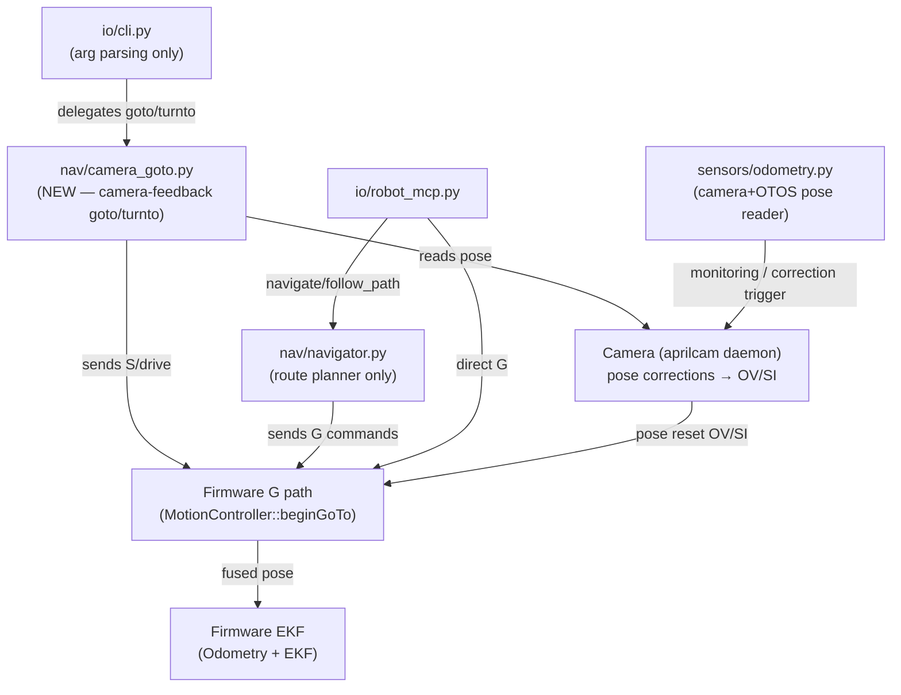
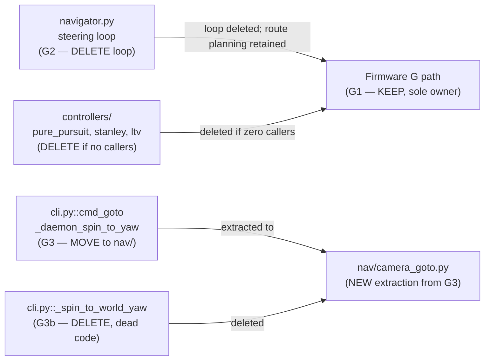

<!-- CLASI: Before changing code or making plans, review the SE process in CLAUDE.md -->

# Architecture Update — Sprint 029: Navigation ownership

## Step 1: Problem Statement

Three independent closed-loop go-to-point implementations and three pose estimators
coexist with no defined authority or reconciliation protocol. Every navigation bug
must be hunted in three stacks. Firmware fixes (sprints 024–027) have no effect on
an agent using the host-side navigator or the CLI inline controller.

This sprint resolves the redundancy by decision first, then deletion. The decision
itself is the first deliverable.

---

## Step 2: Redundancy Inventory

This inventory is derived from reading the actual source files. It is the concrete
input to the pose-authority design document (Ticket 001).

### Go-to-point implementations

| # | Location | File | Approx lines | Pose source | Status |
|---|----------|------|-------------|-------------|--------|
| G1 | Firmware | `source/control/MotionController.cpp` | ~150 (beginGoTo + driveAdvance PURSUE) | Firmware EKF (OTOS + encoders) | Field-proven after S026–S027 |
| G2 | Host library | `host/robot_radio/nav/navigator.py` | 1349 total; navigate/follow_path/follow_pose_path are the steering loops | Camera via `sensors/odometry.py` | Active, used by robot_mcp.py |
| G3 | CLI inline | `host/robot_radio/io/cli.py::cmd_goto` | ~160 lines | Camera via aprilcam daemon | Active, used by `rogo goto` |
| G3a | CLI inline | `cli.py::_daemon_spin_to_yaw` | ~50 lines | Camera via aprilcam daemon | Called by cmd_goto and cmd_turnto |
| G3b | CLI inline | `cli.py::_spin_to_world_yaw` | ~80 lines | Camera via local Playfield (legacy) | Called by nothing visible — dead or near-dead |
| G4 | Host library | `host/robot_radio/robot/nezha_kinematic.py::go_to_world` | ~40 lines | OdomTracker (TLM integration) | Thin wrapper around firmware G; different pose source |

**Notes:**
- G1 is the target: it runs at 10 ms on the firmware, uses the hardware EKF, and
  is the path proven by sprints 024–027.
- G2 is the largest: navigator.py runs a host-side pure-pursuit / stanley / ltv
  control loop, sending S/T commands to the firmware at ~30 ms ticks. It is the
  path used by `robot_mcp.py` (the MCP server's navigation tools).
- G3/G3a are the "first casualty" per the a1 issue: they live in argument-parsing
  code and have their own gain constants duplicated from calibrate.py.
- G3b (`_spin_to_world_yaw`) uses the local `Playfield` / `Camera` object path
  (not the daemon), and is only called by `cmd_turnto` via a code path that has
  since been superseded by `_daemon_spin_to_yaw`. It appears to be dead code.
- G4 (`NezhaKinematic.go_to_world`) wraps firmware G but tracks pose via
  OdomTracker (TLM integration). Its pose state is separate from the EKF.

### Controllers (host-side steering, all inside G2)

| File | Type | Used by |
|------|------|---------|
| `controllers/pure_pursuit.py` | Pure Pursuit Tracker | navigator.py |
| `controllers/stanley.py` | Stanley Controller | navigator.py |
| `controllers/ltv.py` | LTV (Linear Time-Varying) | navigator.py |
| `controllers/pid.py` | PID (speed/steer) | navigator.py |

All four have zero callers outside `navigator.py`.

### Pose estimators

| # | Location | File | Source | Used by |
|---|----------|------|--------|---------|
| P1 | Firmware | `source/odometry/Odometry.cpp` + `source/ekf/EKF.cpp` | OTOS + encoders, fused via EKF | G1 (firmware G path) |
| P2 | Host library | `host/robot_radio/sensors/odometry.py` | Camera (AprilTag) + OTOS fallback | G2 (navigator.py via `Odometry`) |
| P3 | Host library | `host/robot_radio/sensors/odom_tracker.py` | Firmware TLM (dead-reckoning) | G4 (NezhaKinematic) |
| P4 | CLI inline | `cli.py` (via daemon) | aprilcam daemon | G3 (cmd_goto / turnto) |

No defined reconciliation between P1–P4. OV / SI commands exist to seed P1 from
an external pose, but they are called manually (via `rogo sync pose`) rather than
automatically from P2 or P4.

---

## Step 3: Module Responsibilities After This Sprint

### Modules that change

**`nav/camera_goto.py`** (new, extracted from cli.py)
- Purpose: camera-feedback go-to-point and turn-to-heading for the CLI path.
- Boundary: accepts a pose-reader callable and a drive callable; no argparse; no
  global state. Inside: control loop, convergence logic, heading math. Outside:
  serial connection handling, argument parsing.
- Use cases: SUC-002.

**`io/cli.py`** (reduced)
- Purpose: argument parsing and dispatch only.
- Boundary: no `while` loops driving motors after this sprint. All navigation
  work delegated to `nav/`. Inside: argparse setup, command dispatch. Outside:
  control math, calibration logic.
- Use cases: SUC-002.

**`nav/navigator.py`** (demoted — scope TBD by design doc)
- Purpose under the suggested ownership split: route planning (waypoint list →
  sequence of G commands to firmware). Steering loops deleted or disabled.
- Boundary: issues firmware G commands via `robot.go_to()`. Does not send S/T
  velocity commands in a host-side loop. Camera corrections arrive as pose resets
  (OV / SI commands), not as steering inputs.
- Use cases: SUC-003.

**`nav/controllers/`** (candidates for deletion)
- pure_pursuit.py, stanley.py, ltv.py have no callers outside navigator.py.
  If navigator.py's steering loop is deleted, these become dead code.
- Use cases: SUC-003.

**`docs/architecture.md`** (updated)
- A "Pose Authority" section is added documenting the ownership split.
- Use cases: SUC-004.

### Modules that do not change in this sprint

- `source/control/MotionController.cpp` — no firmware changes.
- `sensors/odometry.py` — retained as pose reader for camera-based monitoring;
  no longer a steering-loop input.
- `sensors/odom_tracker.py` — retained; NezhaKinematic uses it for world-frame
  tracking; not in scope to delete.
- `robot/nezha_kinematic.py` — not in scope; G4 remains unchanged.

---

## Step 4: Diagrams

### Component diagram after this sprint (suggested ownership split)

### Deletion/demotion map

---

## Step 5: Document Sections

### What Changed

1. **`nav/camera_goto.py`** — new module extracted from `cli.py`. Contains
   `go_to_world_camera()` and `turn_to_heading_camera()`: the closed-loop
   camera-feedback controller that was `cmd_goto` / `_daemon_spin_to_yaw` in
   cli.py. Accepts protocol and pose-reader callables; no argparse.

2. **`io/cli.py`** — `cmd_goto`, `_daemon_spin_to_yaw`, `_spin_to_world_yaw`,
   and `_crawl_drive_distance` are removed. The `goto` and `turnto` subcommands
   delegate to `nav/camera_goto.py`. Line count reduced from 2262 (contributes
   to A6 target of <800 lines total across all sprints).

3. **`nav/navigator.py`** — steering loop (`navigate`, `follow_path`, host-side
   pure-pursuit/stanley/ltv calls) is deleted or disabled per the signed-off
   design doc. Navigator retains route-planning functions that issue G commands.

4. **`nav/controllers/`** — pure_pursuit.py, stanley.py, ltv.py deleted if they
   have zero callers after the navigator change. pid.py retained (used by speed
   loop primitives if still needed).

5. **`docs/architecture.md`** — new "Pose Authority" section added. Statement:
   firmware EKF is the authoritative pose source for short-horizon motion;
   camera corrections arrive as OV/SI pose resets; host does not run a
   parallel steering loop.

### Why

Three independent go-to-point implementations and pose estimators make every
navigation bug a three-stack hunt. The firmware G path (G1) is now field-proven
after sprints 024–027; consolidating onto it eliminates the duplication without
regressing capability. The camera remains essential as a correction source (pose
resets via OV) — it is not removed, only demoted from "steering loop input" to
"pose correction trigger".

The cmd_goto fold-in (G3 → nav/) is independent of the ownership decision and
provides immediate A6 progress regardless of the stakeholder decision outcome.

### Impact on Existing Components

- `robot_mcp.py`: `navigate` and `follow_path` MCP tools will either be removed
  or reimplemented to issue firmware G commands. This is a breaking change to
  the MCP API if agents rely on `navigate`. The design doc must call this out.
- `rogo goto` / `rogo turnto`: behaviour is preserved after the cli.py fold-in;
  only the implementation location changes.
- `NezhaKinematic.go_to_world` (G4): not changed in this sprint; its OdomTracker
  pose path is independent and not touched here.

### Migration Concerns

- `robot_mcp.py` callers of `navigate` / `follow_path` must be updated if those
  MCP tools are removed. The design doc must inventory all callers before the
  deletion ticket executes.
- `nav/controllers/` deletion: confirm zero callers with a grep before deleting.
  Any test importing these modules must be updated or removed.

---

## Step 6: Design Rationale

### Decision: cmd_goto → nav/ regardless of ownership decision

**Context**: The ownership decision (firmware vs. host for short-horizon control)
requires stakeholder sign-off. The cmd_goto fold-in does not — it is pure
refactoring (same control law, new file).

**Alternatives**: Wait for the full decision before moving any code. Rejected:
the fold-in reduces A6 debt immediately and is risk-free since it moves code
without changing it.

**Why this choice**: Decouple the risk-free refactor from the stakeholder decision.
The fold-in is the "first casualty" regardless of which ownership model wins.

**Consequences**: cli.py shrinks before the deletion phase. nav/ gains a new
module. The new module is a dependency of cli.py (import), not the reverse.

### Decision: firmware G path as the target for consolidation

**Context**: Three host-side steering implementations exist (G2, G3, G4).
The firmware G path (G1) runs at 10 ms with hardware EKF, safety watchdog,
and all the sprint 024–027 fixes.

**Alternatives considered**:
- Keep host-side navigator, delete firmware path. Rejected: firmware path is
  the proven, safety-bounded implementation; host-side lacks watchdog and runs
  at 30 ms.
- Keep both (status quo). Rejected: navigation bugs must be chased in three
  stacks; calibration of gains must be done three times.

**Why this choice**: G1 is the correct long-term owner; sprints 024–027 were
explicitly sequenced to prove it before this consolidation.

**Consequences**: `navigator.py` steering loops (G2) are deleted. MCP navigation
tools change their implementation. The host retains camera-correction capability
via OV/SI pose resets.

---

## Step 7: Open Questions (for the design document)

These must be answered in the stakeholder-approved design doc before any deletion
ticket executes.

**OQ-1 (High)**: What happens to the MCP tools `navigate` and `follow_path`?
Options: (a) remove them; (b) reimplement as thin wrappers that issue G commands
to firmware and poll for completion; (c) retain as-is for multi-waypoint cases.
The decision affects robot_mcp.py and any agents that call these tools.

**OQ-2 (High)**: Is `navigator.py`'s route-planning logic (waypoint sequencing,
`visit_tags`, `follow_pose_path`) still needed after the steering loop is deleted?
If yes, how does it issue motion — one G per waypoint? If no, should the file be
deleted entirely?

**OQ-3 (Medium)**: Does `NezhaKinematic.go_to_world` (G4) overlap with the
consolidated path? It wraps firmware G but tracks pose via OdomTracker (TLM
dead-reckoning). After this sprint, is there a use case for it, or should it be
demoted / removed?

**OQ-4 (Medium)**: Camera correction mechanism: are the existing `rogo sync pose`
/ OV command sufficient for the "camera corrections as pose resets" model, or
does a tighter automatic correction loop need to be specified here?

**OQ-5 (Low)**: `_spin_to_world_yaw` appears to be dead code (uses local Playfield,
superseded by `_daemon_spin_to_yaw`). Confirm deletion is safe before the
fold-in ticket executes.

**OQ-6 (Dependency)**: This sprint is explicitly gated on sprints 026–027 proving
the firmware G path trustworthy on the field. Confirm that gate before any ticket
enters execution.

---

## Sprint Changes Summary

| Module | Change | Reason |
|--------|--------|--------|
| `nav/camera_goto.py` | NEW — extracted from cli.py | Fold-in of cmd_goto controller |
| `io/cli.py` | Remove goto/turnto inline control loops | A6 + no control loops in CLI |
| `nav/navigator.py` | Delete steering loop (keep route planner) | A1 consolidation |
| `nav/controllers/*.py` | Delete (zero callers after navigator change) | A1 consolidation |
| `docs/architecture.md` | Add pose-authority section | A1 documentation |
