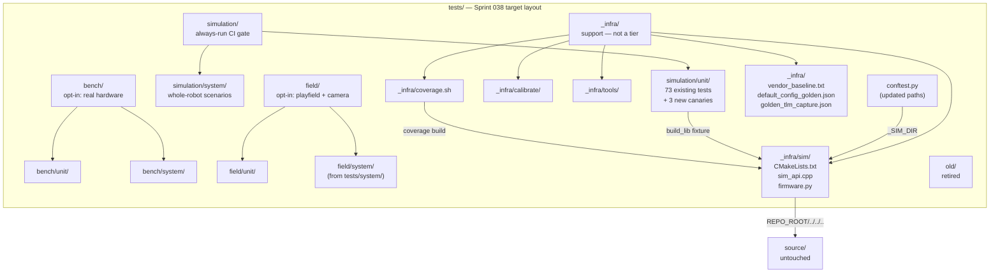
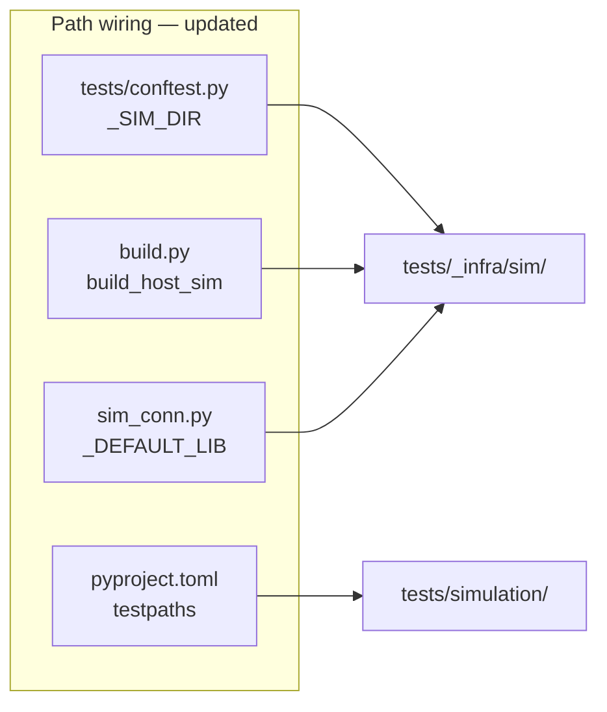

<!-- CLASI: Before changing code or making plans, review the SE process in CLAUDE.md -->

# Architecture Update — Sprint 038: Phase 0 — Test Tiers and Safety-Net Canaries

## What Changed

### 1. `tests/` tree: three-tier directory structure

The flat Sprint 037 `tests/` layout is reorganized into tiers **by how much hardware is real**
(issue §7). No files under `source/` change.

**Before (Sprint 037 state):**
```
tests/
  sim/              # build infra: CMakeLists.txt, sim_api.cpp, firmware.py
  unit/             # all maintained pytest (73 test_*.py files, ~1954 tests)
  bench/            # real-robot bench scripts
  system/           # field navigation scripts (goto_world, tours)
  calibrate/        # calibration routines
  tools/            # interactive tools (playfield_tour.py)
  old/              # retired scripts
  conftest.py       # root fixtures
  CLAUDE.md
```

**After (Sprint 038):**
```
tests/
  simulation/
    unit/           # pure-logic + subsystem-sim tests (no hardware)
    system/         # whole-robot sim scenarios (drive square, GOTO, estimate-vs-truth)
  bench/
    unit/           # real-device units (motor drive, I2C, OTOS — needs hardware)
    system/         # bench end-to-end on the stand
  field/
    unit/           # (minimal — no playfield currently)
    system/         # field navigation / tours (needs playfield + camera)
  _infra/
    sim/            # build infra: CMakeLists.txt, sim_api.cpp, firmware.py
    calibrate/      # calibration routines (moved from tests/calibrate/)
    tools/          # interactive tools (moved from tests/tools/)
    coverage.sh     # NEW: coverage harness script
    vendor_baseline.txt           # NEW: vendor-confinement allowed hit-set
    default_config_golden.json    # NEW: defaultRobotConfig() field snapshot
    golden_tlm_capture.json       # NEW: golden TLM frame bytes
  old/              # retired scripts (unchanged)
  conftest.py       # updated: _SIM_DIR, _BUILD_DIR paths updated
  CLAUDE.md         # updated: describes new tier layout
```

**File moves (all `git mv` — history preserved):**

| From | To | Notes |
|------|----|-------|
| `tests/sim/CMakeLists.txt` | `tests/_infra/sim/CMakeLists.txt` | REPO_ROOT depth fix |
| `tests/sim/sim_api.cpp` | `tests/_infra/sim/sim_api.cpp` | No content change |
| `tests/sim/firmware.py` | `tests/_infra/sim/firmware.py` | No content change |
| `tests/sim/conftest.py` | Deleted (or kept as stub) | Root conftest covers all fixtures |
| `tests/unit/*.py` (73 test files + helpers) | `tests/simulation/unit/` | All 73; programmer may split some to `simulation/system/` |
| `tests/system/` scripts | `tests/field/system/` | goto_world.py, world_tour.py, etc. |
| `tests/bench/` scripts | `tests/bench/` (gains `unit/` + `system/` subdirs) | Scripts stay at bench/ level |
| `tests/calibrate/` | `tests/_infra/calibrate/` | Moved into infra |
| `tests/tools/` | `tests/_infra/tools/` | Moved into infra |

### 2. CMakeLists.txt: REPO_ROOT depth fix

Moving `CMakeLists.txt` from `tests/sim/` (2 levels below repo root) to
`tests/_infra/sim/` (3 levels below repo root) breaks the existing:

```cmake
get_filename_component(REPO_ROOT "${CMAKE_SOURCE_DIR}/../.." ABSOLUTE)
```

Fix: change to three `..` hops:

```cmake
get_filename_component(REPO_ROOT "${CMAKE_SOURCE_DIR}/../../.." ABSOLUTE)
```

### 3. conftest.py: path constants updated

`tests/conftest.py` path constants are updated for the new layout:

```python
_SIM_DIR   = _TESTS_DIR / "_infra" / "sim"   # was: _TESTS_DIR / "sim"
_BUILD_DIR = _SIM_DIR / "build"               # unchanged relative to _SIM_DIR
```

The `build_lib` fixture cmake `-S` / `-B` paths change accordingly.

### 4. pyproject.toml: testpaths and norecursedirs

`testpaths` is narrowed to `["tests/simulation"]` so only the always-run simulation tier is
collected by default. `norecursedirs` is updated:

```toml
testpaths = ["tests/simulation"]
norecursedirs = [
    "tests/old",
    "tests/_infra/sim/build",
    "tests/bench",
    "tests/field",
    "tests/_infra/calibrate",
    "tests/_infra/tools",
    "vendor", "build", ".venv", "node_modules",
    "*.egg", ".*", "dist", "{arch}", "__pycache__",
]
```

`bench/` and `field/` are excluded from default collection. Running them explicitly
requires `pytest tests/bench/` or `pytest tests/field/`.

### 5. New canary tests (under `tests/simulation/unit/`)

Three new test files:

**`test_vendor_confinement.py`** — vendor-confinement grep gate.
- Greps `source/app/`, `source/control/`, `source/robot/`, `source/types/` (everything
  above `source/hal/`) for forbidden tokens.
- Forbidden tokens: `MicroBit.h` (include directive), `I2CBus` (type reference),
  `microbit_random`, OTOS int16 raw register access patterns (`*Raw` suffix in the
  context of OTOS register access), Nezha split-phase I2C register patterns.
- Compares the hit-set against committed baseline `tests/_infra/vendor_baseline.txt`.
- Test passes if current hits are a subset of the baseline (baseline may shrink in later
  phases). Fails if any new file/line appears outside the baseline.

**`test_default_config_pin.py`** — `defaultRobotConfig()` field-pin.
- Uses the `build_lib` + `sim` fixtures. Calls `defaultRobotConfig()` through the
  ctypes Sim wrapper (via a `sim_api.cpp` export or equivalent).
- Serializes all config fields to a canonical dict.
- Compares against committed golden `tests/_infra/default_config_golden.json`.
- Any changed field fails with a diff.

**`test_golden_tlm.py`** — golden-TLM frame canary.
- Uses `build_lib` + `sim` fixtures. Drives the sim through a fixed deterministic
  command sequence (stepped time, fixed seed, no wall-clock).
- Captures the resulting TLM frame(s) as a structured dict.
- Compares against committed `tests/_infra/golden_tlm_capture.json`.
- Any difference fails with a diff.

### 6. Coverage harness (`tests/_infra/coverage.sh`)

Shell script (or justfile target) that:
1. Configures a separate coverage build dir (`tests/_infra/sim/build_coverage/`):
   `cmake -S tests/_infra/sim -B <covdir> -DCMAKE_CXX_FLAGS="--coverage -O0 -g" -DCMAKE_SHARED_LINKER_FLAGS="--coverage"`
2. Builds the instrumented lib.
3. Runs the simulation tier with the instrumented lib via
   `FIRMWARE_HOST_LIB=<covdir>/libfirmware_host.* uv run --with pytest python -m pytest tests/simulation -q`.
4. Runs `uv run --with gcovr gcovr --root source --print-summary <covdir>`.
5. Prints overall `source/` line coverage percentage.

---

## Why

The seven-phase migration needs a safety net before any `source/` files move. The canaries
provide regression detection at three distinct levels:

- **Structural (vendor-confinement)**: catches if a migration step re-introduces a vendor
  dependency above the IO boundary.
- **Calibration (field-pin)**: catches if code generation or config carry-through silently
  changes a baked calibration value.
- **Behavioral (golden-TLM)**: catches if a source move accidentally changes motion output,
  even when all unit tests still pass individually.

The tier restructure provides clarity: `simulation/` is the always-run gate; `bench/` and
`field/` are opt-in. Every subsequent phase drops tests into the right tier without further
restructuring.

---

## Impact on Existing Components

| Component | Before | After |
|-----------|--------|-------|
| `tests/sim/CMakeLists.txt` | `REPO_ROOT = CMAKE_SOURCE_DIR/../..` (2 hops) | Moved to `tests/_infra/sim/`; `REPO_ROOT = CMAKE_SOURCE_DIR/../../..` (3 hops) |
| `tests/conftest.py` | `_SIM_DIR = tests/sim/` | `_SIM_DIR = tests/_infra/sim/` |
| `build.py` `build_host_sim()` | `cmake -S tests/sim -B tests/sim/build` | `cmake -S tests/_infra/sim -B tests/_infra/sim/build` |
| `host/robot_radio/io/sim_conn.py` `_DEFAULT_LIB` | resolves to `tests/sim/build/` | resolves to `tests/_infra/sim/build/` |
| Root `pyproject.toml` | `testpaths = ["tests"]`; excludes `tests/sim/build` | `testpaths = ["tests/simulation"]`; excludes `tests/_infra/sim/build`, `tests/bench`, `tests/field` |
| `tests/unit/*.py` (73 files + helpers) | At `tests/unit/` | Moved to `tests/simulation/unit/` (and optionally `simulation/system/`) |
| `tests/system/` scripts | Excluded from collection at `tests/system/` | Moved to `tests/field/system/`; still excluded |
| `tests/bench/` | At `tests/bench/`; excluded | Gains `unit/`+`system/` subdirs; still excluded by default |
| `tests/calibrate/`, `tests/tools/` | At respective paths; excluded | Moved to `tests/_infra/calibrate/`, `tests/_infra/tools/` |
| `source/` | Unchanged | Unchanged — zero modifications |

---

## Component/Module Diagram





---

## Migration Concerns

1. **Atomic five-file update**: `pyproject.toml`, `build.py`, `tests/conftest.py`,
   `tests/_infra/sim/CMakeLists.txt` (path fix), and `host/robot_radio/io/sim_conn.py`
   must all be updated together. Any one stale file produces a suite failure. The ticket
   that moves the sim infra is gated on the full suite being green after all five are
   updated.

2. **`from firmware import Sim` import chain**: This import appears in ~25 sim test files.
   It works via `sys.path.insert(0, str(_SIM_DIR))` in `tests/conftest.py`. After the
   move, `_SIM_DIR = tests/_infra/sim/`, so `firmware.py` is at
   `tests/_infra/sim/firmware.py`. The import continues to work as long as `conftest.py`
   is updated atomically with the file move.

3. **`tests/sim/conftest.py` status**: Sprint 037 scaffolded a `tests/sim/conftest.py`.
   The programmer must inspect it before the move to confirm it is empty or redundant
   before deleting (to avoid silently dropping a fixture).

4. **`bench/unit/` and `bench/system/` scaffold**: Current `tests/bench/` scripts have
   no `test_` prefix and are not pytest files. They move as-is and remain uncollected.
   `bench/unit/` and `bench/system/` are scaffolded empty (with `.gitkeep`) for future
   bench tests.

5. **Golden-TLM baseline generation**: The golden capture must be generated by running the
   canary once with a `--update-baseline` flag (or by running a generation script), then
   committed. Subsequent runs assert against the committed capture.

6. **Coverage build directory isolation**: The coverage harness uses a separate build dir
   (`build_coverage/`) to avoid overwriting the standard `build/`. The `build_lib`
   fixture must not pick up the coverage build dir.

---

## Design Rationale

### Decision: `tests/_infra/` for sim build, calibrate/, and tools/

- **Context**: The sim build infrastructure, calibration routines, and interactive tools
  need a home that is clearly "support" rather than a test tier.
- **Alternatives**: (a) Keep `tests/sim/` as a special non-tier dir (inconsistent with §7
  layout). (b) `tests/infra/` (no visual distinction from tier dirs). (c) `tests/_infra/`
  (chosen — matches §7 spec label exactly).
- **Why**: The `_` prefix is a conventional Python/filesystem signal for internal/support
  content. It matches the §7 spec's `_infra/` label exactly and causes pytest to skip
  it without an explicit `norecursedirs` entry.
- **Consequences**: All path references must use `_infra`; the underscore prefix provides
  automatic pytest exclusion for non-test content within `_infra/`.

### Decision: `testpaths = ["tests/simulation"]` rather than `["tests"]` with exclusions

- **Context**: Sprint 037 used `testpaths = ["tests"]` plus `norecursedirs` to exclude
  non-sim dirs. After the tier split, the non-sim dirs are `bench/` and `field/`.
- **Alternatives**: (a) Keep `testpaths = ["tests"]` and add `bench/` and `field/` to
  `norecursedirs`. (b) Use `testpaths = ["tests/simulation"]` (chosen).
- **Why**: Pointing `testpaths` directly at `tests/simulation/` is unambiguous and
  self-documenting. It is impossible to accidentally collect bench or field tests.
- **Consequences**: Running `pytest` from the repo root always collects only the simulation
  tier. Bench and field require an explicit path argument.

### Decision: Vendor-confinement baseline allows Phase 0 known leaks

- **Context**: `MotorController.h` currently includes `MicroBit.h`; `DebugCommandable.cpp`
  references `I2CBus` directly. These are Phase A's job to seal.
- **Why**: Failing Phase 0 on leaks that Phase A will seal makes the gate adversarial.
  The baseline freezes the current known-bad set; Phase A reduces it and commits an updated
  baseline. The gate ratchets tighter with each subsequent phase.
- **Consequences**: The baseline file must match the actual grep output on the Phase 0
  tree exactly. Any accidental new leak shows up as an addition to the baseline and fails
  the gate.

---

## Open Questions

1. **`tests/sim/conftest.py` content**: The programmer should inspect the actual
   `tests/sim/conftest.py` to confirm it is empty or redundant before deleting it during
   the move.

2. **`simulation/unit/` vs `simulation/system/` split boundary**: The 73 existing
   `test_*.py` files default to `simulation/unit/`. The programmer may elect to move
   whole-robot scenario tests (e.g., `test_incident_scenarios.py`, `test_goto_bounds.py`)
   to `simulation/system/` at move time. This is organizational and does not affect Phase 0
   green status either way.

3. **`defaultRobotConfig()` ctypes exposure**: The field-pin test needs to read individual
   config fields from the Sim. The programmer should check whether `sim_api.cpp` already
   exports `defaultRobotConfig()` fields, or whether a new export function is needed.
