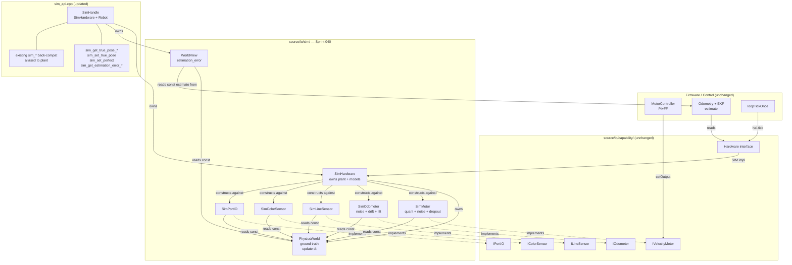
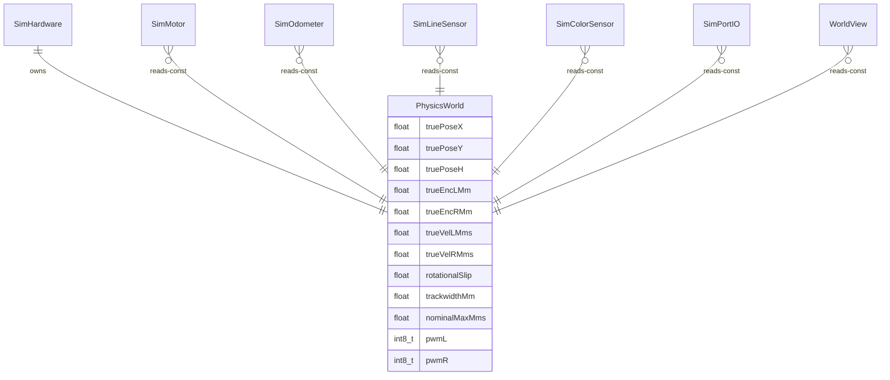

<!-- CLASI: Before changing code or making plans, review the SE process in CLAUDE.md -->

# Architecture Update — Sprint 040: Phase B — Physical-plant simulation

## Sprint Changes

### Summary

Phase B untangles the three currently-fused simulation models — `MockMotor`
(plant + slip + noise), `ExactPoseTracker` (pre-slip oracle), `MockOtosSensor`
(with an embedded midpoint-arc integrator) — into a clean architectural split:

1. **`PhysicsWorld`** — the single source of ground truth; integrates one canonical
   midpoint-arc step per `update(dt)` call.
2. **Observation models** (`SimMotor`, `SimOdometer`, `SimLineSensor`,
   `SimColorSensor`, `SimPortIO`) — own the error, read `const PhysicsWorld&`,
   implement the capability interfaces.
3. **`SimHardware`** — replaces `MockHAL`; owns the plant and constructs each
   observation model against it.
4. **`WorldView` adapter** — bridges `PhysicsWorld` truth into the `sim_api.cpp`
   C ABI, providing `sim_get_true_*` accessors and `sim.estimation_error()`.
5. **ABI back-compat layer** — all existing `sim_*` entry points kept; re-pointed
   to the plant. `sim_set_enc_l/r` corrected to set true travel. `sim_get_exact_pose_*`
   aliased to `sim_get_true_pose_*`.
6. **New isolation tests** — `tests/simulation/{unit,system}/` coverage for
   plant-only, observation-only, estimator-only, and whole-robot scenarios.

### Files Created (source/io/sim/)

- `PhysicsWorld.h` / `PhysicsWorld.cpp`
- `SimMotor.h` / `SimMotor.cpp`
- `SimOdometer.h` / `SimOdometer.cpp`
- `SimLineSensor.h` / `SimLineSensor.cpp`
- `SimColorSensor.h` / `SimColorSensor.cpp`
- `SimPortIO.h` / `SimPortIO.cpp`
- `SimHardware.h` / `SimHardware.cpp`
- `WorldView.h` / `WorldView.cpp`

### Files Modified

- `tests/_infra/sim/sim_api.cpp` — `SimHandle` uses `SimHardware`; new
  `sim_get_true_pose_*`, `sim_set_true_pose`, `sim_set_perfect`,
  `sim_get_estimation_error_*` entry points; `sim_set_enc_l/r` corrected;
  `sim_get_exact_pose_*` aliased to plant.
- `tests/_infra/sim/firmware.py` — Python wrappers for new ABI entry points;
  `estimation_error()` method added to `Sim`.

### Files Retired (after T4)

- `source/io/sim/MockMotor.h` / `.cpp`
- `source/io/sim/MockHAL.h` / `.cpp` (which contains `ExactPoseTracker`)
- `source/io/sim/MockOtosSensor.h` / `.cpp`
- `source/io/sim/MockLineSensor.h` / `.cpp`
- `source/io/sim/MockColorSensor.h` / `.cpp`
- `source/io/sim/MockPortIO.h` / `.cpp`
- `source/io/sim/MockServo.h` / `.cpp` (or renamed `SimServo` if kept)

### No Changes To

- `source/io/real/` — zero firmware device-logic changes
- `source/io/capability/` — capability interfaces unchanged
- `source/control/`, `source/app/`, `source/robot/` — firmware untouched
- `source/io/real/BenchOtosSensor.*` — bench sensor untouched
- Existing `tests/simulation/unit/` and `tests/simulation/system/` test files

---

## Why

The three fused models create four concrete problems that block the §7 test matrix:

**1. Untestable seams.** `MockMotor::integrate` applies slip at the encoder step,
making the encoder both "true travel" and "slip-reduced travel" simultaneously.
There is no way to assert "true pose = X, EKF estimate = X ± noise" without a
clean plant/observation split.

**2. `sim_set_enc_l/r` lies.** It writes to `state.inputs.encLMm` but not to
`MockMotor::_encoderMm`. The next `tick()` overwrites the injected value with the
integrated value. Tests that inject encoder values get incorrect results (see
sim_api.cpp lines 363–385 for the comment acknowledging this).

**3. Triplicated midpoint-arc integration.** `MockMotor::integrate`,
`ExactPoseTracker::update`, and `MockOtosSensor::tick` each contain a variant of
the midpoint-arc formula. `BenchOtosSensor` integrates commanded velocity while
`ExactPoseTracker` uses true velocity — the two oracles can disagree.

**4. No estimate-vs-truth assertion.** Tests can read EKF pose but have no
mechanism to compare it against ground truth. `ExactPoseTracker` is a struct
on `MockHAL`; it is not wired into any test interface for `estimation_error()`.

---

## Module Definitions

### PhysicsWorld (source/io/sim/PhysicsWorld.{h,cpp})

**Purpose:** The single source of ground truth for the simulated chassis; integrates
one ordered `update(dt)` per tick.

**Boundary (in):** Owns true chassis pose `(x, y, h)`, true per-wheel travel
`(encL, encR)`, true per-wheel velocity `(velL, velR)`, true auxiliary sensor values,
and the dynamics-error parameters (`trackwidthMm`, `nominalMaxMms`, `rotationalSlip`).
No observation error of any kind lives here.

**Boundary (out):** Read-only `const PhysicsWorld&` access for observation models and
`WorldView`. `PhysicsWorld` never reads from the `Robot` or `EKF` state.

**Two input modes:**
- `setActuators(pwmL, pwmR)` + `update(dt_ms)` — evolves chassis from PWM.
- `setTruePose(x, y, h)`, `setTrueWheelTravel(encL, encR)`, `setTrueVelocity(velL, velR)`,
  `setTrueSensorValues(...)` — sets ground truth directly for isolation tests.

**Canonical midpoint-arc integration (one copy, replaces three):**

The `update(dt_ms)` body has two sub-steps kept structurally separate for
golden-TLM bit-exactness (see Design Rationale):

```
// Sub-step A: encoder accumulation — MUST match MockMotor::integrate bit-exactly
velL = (pwmL / 100.0f) * nominalMaxMms * offsetFactorL;
velR = (pwmR / 100.0f) * nominalMaxMms * offsetFactorR;
float dt_s = dt_ms / 1000.0f;
encL += velL * dt_s;     // true wheel travel; no slip here
encR += velR * dt_s;

// Sub-step B: chassis pose integration — can use clean formula; not in TLM path
float dL   = velL * dt_s;
float dR   = velR * dt_s;
float slip = effectiveSlip(rotationalSlip);
float dTh  = ((dR - dL) / trackwidthMm) * slip;
float hMid = h + dTh * 0.5f;
x += ((dL + dR) * 0.5f) * cosf(hMid);
y += ((dL + dR) * 0.5f) * sinf(hMid);
h += dTh;
```

`effectiveSlip` is the same helper function used by `Odometry::predict`.
`slip = 0` in the golden-TLM fixture (no `sim_set_motor_slip` call),
so sub-step B is invisible to the canary.

**Use cases:** SUC-001, SUC-005, SUC-006.

---

### SimMotor (source/io/sim/SimMotor.{h,cpp})

**Purpose:** Observation model for one drive wheel; implements `IVelocityMotor`;
reads true travel and velocity from `PhysicsWorld`; applies encoder error.

**Boundary (in):** `const PhysicsWorld&` (true `encL` or `encR`, `velL` or `velR`
for the assigned side).

**Boundary (out):** Implements `IVelocityMotor` — `setOutput(pwm)` forwards PWM
to `plant.setActuators`; `tick(now_ms)` promotes plant values to accessor cache;
`positionMm()` / `velocityMmps()` return (optionally errored) encoder reading.
`asPositionMotor()` returns `nullptr` (drive wheel only).

**Error setters (all default no-op → fresh sensor is perfect):**
- `setQuantizationMm(float)` — rounds `positionMm()` to nearest bucket.
- `setNoiseSigma(float)` — Gaussian noise per `tick()`.
- `setFrozen(bool)` — frozen encoder (simulates wedge dropout).

**Use cases:** SUC-002, SUC-004.

---

### SimOdometer (source/io/sim/SimOdometer.{h,cpp})

**Purpose:** Observation model for the OTOS odometer; implements `IOdometer`;
reads true chassis pose from `PhysicsWorld`; applies sensor error. Replaces BOTH
`MockOtosSensor`'s chassis-integrator and `BenchOtosSensor`'s role in SIM mode.

**Boundary (in):** `const PhysicsWorld&` (true pose, true body-frame velocity).

**Boundary (out):** Implements `IOdometer` — `readTransformed()`, `readVelocityTransformed()`,
`readAccelTransformed()`, `readStatus()`, `lastReadOk()`, and calibration/raw-register
accessors (delegated to stored values for test injection).

**Error setters (all default no-op):**
- `setLinearNoiseSigma(float)` — Gaussian noise on position reading.
- `setYawDriftRadsPerSec(float)` — slow additive heading drift.
- `setReadFailureProbability(float)` — random per-tick read failure.
- `setLift(bool)` — OTOS LIFT status (robot lifted; sensor returns INVALID).
- `setReadFailure(bool)` — deterministic read failure (back-compat for `sim_set_otos_read_failure`).

**Pose injection (back-compat):** `setInjectedPose(x, y, h)` overrides the plant-truth
read; used by `sim_set_otos_pose` re-point.

**Use cases:** SUC-002, SUC-003, SUC-004.

---

### SimLineSensor / SimColorSensor / SimPortIO (source/io/sim/)

**Purpose:** Observation models for non-drive sensors; implement their respective
capability interfaces; read true values from `PhysicsWorld`.

**Boundary:** Each reads `const PhysicsWorld&` for its truth values. Exposes
`setFrozen(bool)` and `begin()` with the same semantics as the retired `Mock*`
counterparts, so existing test code that calls `sim_init_line_sensor()` /
`sim_set_line_frozen()` compiles unchanged.

**Use cases:** SUC-004.

---

### SimHardware (source/io/sim/SimHardware.{h,cpp})

**Purpose:** Replaces `MockHAL` as the SIM-mode `Hardware` implementation; owns
`PhysicsWorld` and constructs each observation model against it; its `tick(now_ms, cmds)`
is the single ordered integration step.

**Boundary (in):** `Hardware` abstract interface (capability-typed accessors, `begin()`,
`tick(now_ms)`, `tick(now_ms, cmds)`). Receives `const RobotConfig&` at construction.

**Boundary (out):** Returns capability interface refs pointing to sim observation models.
`SimHardware::plant()` returns `PhysicsWorld&` for `WorldView` and `sim_api.cpp`.

**Tick ordering (identical to NezhaHAL semantic):**
```
SimHardware::tick(now_ms, cmds):   // actuator-state tick (from loopTickOnce)
  plant.setActuators(cmds.pwmL, cmds.pwmR)
  plant.update(dt_ms)              // ONE integration step

SimHardware::tick(now_ms):         // sensor-read tick (from sim_tick before loopTickOnce)
  simMotorR.tick(now_ms)
  simMotorL.tick(now_ms)
```

No second PI+FF controller in `SimHardware`. Control law stays in `MotorController`
above the device line (Case B). `SimMotor::setOutput` records PWM only.

**`setOtosBench(bool)`:** No-op in `SimHardware` — there is no bench OTOS in SIM mode.

**Value-member ownership (zero heap):**
```cpp
PhysicsWorld  _plant;
SimMotor      _motorL, _motorR;
SimOdometer   _odom;
SimLineSensor _line;
SimColorSensor _color;
SimPortIO     _portIO;
MockServo     _servo;    // or SimServo; no plant dependency; kept as-is
```

**Test accessors:** `plant()`, `simMotorL()`, `simMotorR()`, `simOdometer()`, etc.
for error injection from `sim_api.cpp`.

**Use cases:** SUC-001, SUC-002, SUC-003, SUC-004.

---

### WorldView (source/io/sim/WorldView.{h,cpp})

**Purpose:** Bridges `PhysicsWorld` truth into the `sim_api.cpp` C ABI; computes
`estimation_error()` by comparing `PhysicsWorld` true pose against EKF pose from
`robot.state.inputs`.

**Boundary (in):** `const PhysicsWorld&` + `const HardwareState&` (read-only).

**Boundary (out):**
- `truePoseX()`, `truePoseY()`, `truePoseH()` — for `sim_get_true_pose_*` ABI.
- `estimationErrorXY()` — Euclidean distance between true pose and EKF pose (mm).
- `estimationErrorH()` — heading error (rad, wrapped to [-π, π]).

**Use cases:** SUC-003.

---

## Component/Module Diagram





---

## Impact on Existing Components

| Component | Before | After |
|---|---|---|
| `MockHAL` | SIM-mode `Hardware` impl; owns plant + oracle | **Replaced by `SimHardware`**; deleted in T4 |
| `MockMotor` | Fuses plant integration + slip + noise | **Replaced by `SimMotor`** (observation only); deleted in T4 |
| `ExactPoseTracker` | Pre-slip oracle struct in `MockHAL.h` | **Replaced by `PhysicsWorld::truePose*()`**; deleted with `MockHAL` |
| `MockOtosSensor` | Dual-accumulator OTOS + injected pose | **Replaced by `SimOdometer`**; deleted in T4 |
| `MockLineSensor`, `MockColorSensor`, `MockPortIO` | Existing mock impls | Replaced by `Sim*` counterparts (API-compatible); deleted in T4 |
| `MockServo` | Retained; no plant dependency | Retained as-is (or renamed `SimServo`) |
| `sim_set_enc_l/r` | BUG: writes `state.inputs.encL/R` directly; overwritten next tick | **Fixed**: writes `PhysicsWorld::trueEncL/R` directly |
| `sim_get_exact_pose_*` | Reads `ExactPoseTracker.x/y/h` | **Aliased**: reads `PhysicsWorld::truePoseX/Y/H()` |
| `sim_field_profile` fixture | Sets `MockMotor` slip at encoder step | Re-pointed to `plant.setSlipTurnExtra()` at chassis-rotation step (validated against field-024) |
| `BenchOtosSensor` (`source/io/real/`) | `IOdometer` for bench hardware; integrates commanded velocity | **Untouched** — stays in `io/real/`, gated by `BENCH_OTOS_ENABLED`; `NezhaHAL` owns it |
| `sim_bench_otos_*` ABI | Drives standalone `SimHandle::benchOtos` directly | **Unchanged** — `SimHandle` retains the standalone `BenchOtosSensor benchOtos` member |
| `sim_api.cpp` | Uses `MockHAL` in `SimHandle` | Uses `SimHardware`; new ABI entry points added |
| `firmware.py` | No `estimation_error()`, no `set_true_*` | Adds Python wrappers for all new ABI entry points |

---

## Migration Concerns

### 1. Golden-TLM bit-exactness — primary risk

The golden-TLM canary (`test_golden_tlm.py`) asserts TLM frames byte-for-byte.
TLM fields include EKF state derived from `positionMm()` → `MotorController` → `Odometry`.
`positionMm()` is derived from the encoder accumulator. If `PhysicsWorld::update`
produces even a 1 ULP difference in `encL/encR` vs. `MockMotor::integrate`, the
downstream EKF and TLM frame will differ.

**The risk is eliminable** because the golden-TLM fixture uses:
- Zero slip (`sim_set_motor_slip` not called → `_slipStraight = 0, _slipTurnExtra = 0`).
- Zero noise (`_encoderNoiseSigma = 0`).
- Default offset factor (`_offsetFactor = 1.0`).

So the effective formula that the canary depends on is simply:
```cpp
encL += (pwmL / 100.0f) * kNominalMaxMms * (dt_ms / 1000.0f);
encR += (pwmR / 100.0f) * kNominalMaxMms * (dt_ms / 1000.0f);
```

`PhysicsWorld::update` sub-step A MUST use this exact expression. No algebraic
simplification. The chassis-pose sub-step B (truePoseX/Y/H) is NOT on the TLM path
and can use any numerically equivalent formula.

**The `ExactPoseTracker` and `MockOtosSensor::tick`** are NOT on the golden-TLM path
at all (they are test-only read paths). Their consolidation into `PhysicsWorld`
does not affect the canary.

**Programmer instruction for T1:** Preserve the encoder sub-step expression verbatim
from `MockMotor::integrate`. Add a code comment noting it must not be simplified.
Run `test_golden_tlm.py` immediately after T1 is wired into `sim_api.cpp`.

### 2. Slip model relocation — field-024 fixture

The `sim_field_profile` fixture applies `slip_turn_extra = -0.26` to `MockMotor`.
The formula is `enc = vel * (1 - slip) = vel * 1.26` (encoder over-reports arc
by 26%). After the move to `PhysicsWorld`, slip applies to `dTh` in sub-step B,
not to the encoder in sub-step A.

These two models differ architecturally: the old model makes the ENCODER read more
than the wheel physically traveled; the new model makes the BODY ROTATE less than
the wheel differential implies. The heading effect may differ in combination with
OTOS fusion because `SimOdometer` now reads true plant pose (not slip-inflated
encoder-derived pose).

**Programmer instruction for T2:** Run `test_rt_slip.py` and the `sim_field_profile`
fence tests before declaring T2 done. If the heading outcomes differ from the
pre-T2 baseline, use Option A: `PhysicsWorld` tracks BOTH `trueEncL/R` (unslipped,
used for `sim_set_enc_l/r` and `setTrueWheelTravel`) AND `reportedEncL/R`
(optionally slipped, returned by `SimMotor::positionMm()`). `sim_set_motor_slip`
configures the `reported` path only. Escalate to stakeholder if Option A is
insufficient (see OQ-1).

### 3. Incremental migration — green between tickets

Suggested sequence:
- **T1:** Add `PhysicsWorld` (no `sim_api.cpp` changes); it compiles but is unused.
- **T2:** Add `Sim*` models + `SimHardware`; swap `SimHandle::hal` to `SimHardware`;
  re-point all back-compat `sim_*` entry points to plant. All existing tests must pass.
- **T3:** Add `WorldView`; add `sim_get_true_*`, `sim_set_true_*`, `sim_set_perfect`,
  `sim_get_estimation_error_*` to ABI and `firmware.py`. Fix `sim_set_enc_l/r`;
  alias `sim_get_exact_pose_*`.
- **T4:** Delete `MockMotor`, `MockHAL`, `ExactPoseTracker`, `MockOtosSensor`, and
  `Mock{Line,Color,Port}Sensor` files. Verify host sim still builds clean.
- **T5:** Add isolation tests under `tests/simulation/{unit,system}/`.

At every step: `uv run --with pytest python -m pytest -q` must return ≥ 1957 passed, 0 errors.

### 4. sim_bench_otos ABI preserved unchanged

`SimHandle` in `sim_api.cpp` retains a standalone `BenchOtosSensor benchOtos` member,
driven by `sim_bench_otos_tick()`. This is separate from `SimHardware` (which has no
bench sensor). `test_bench_otos.py` passes unchanged through all five tickets.

---

## Design Rationale

### Decision: PhysicsWorld encoder sub-step preserves MockMotor::integrate expression

- **Context**: Consolidating the triplicated midpoint-arc formula into `PhysicsWorld`
  risks a 1 ULP difference in the encoder accumulator, which would break the golden-TLM
  canary byte-exact assertion.
- **Alternatives**: (a) Clean refactoring of the formula. (b) Preserve the exact
  sub-expression (chosen). (c) Accept golden-TLM regeneration (rejected by default).
- **Why**: The encoder formula is `vel * dt_s` — trivially short. Preserving it costs
  nothing and eliminates the canary risk completely. The chassis-pose formula (sub-step B)
  is invisible to the canary and can be cleaner.
- **Consequences**: Sub-step A in `PhysicsWorld::update` must not be simplified.
  The clean formula lives only in sub-step B.

### Decision: Slip moves to chassis body-rotation step

- **Context**: Current slip is applied at the encoder step (`enc = vel * (1-slip)`).
  The canonical physical model (issue §2 and `Odometry::predict`) applies slip at `dTh`.
- **Alternatives**: (a) Keep slip at encoder step. (b) Move to body-rotation step (chosen).
  (c) Apply slip to both steps (overcounts).
- **Why**: Placing slip at the body-rotation step makes `PhysicsWorld` structurally
  parallel to `Odometry::predict` (same `effectiveSlip` helper, same application point).
  Encoder readings become true wheel travel, fixing the semantic bug that `sim_set_enc_l/r`
  exploits. The golden-TLM canary is unaffected because the golden-TLM fixture uses
  zero slip.
- **Consequences**: The field-024 fixture numerical outcome must be validated (OQ-1).
  If the `sim_field_profile` fence tests fail, Option A (dual-path `reported` encoder)
  is available.

### Decision: SimHardware uses value-member ownership, zero heap

- **Context**: Zero-heap constraint; `NezhaHAL` pattern is value-member ownership.
- **Why**: Matches the established HAL pattern. Host-only `SimHardware` is not
  subject to nRF52 RAM limits; value-member layout is still appropriate for
  determinism and single-threaded correctness.
- **Consequences**: `SimHandle::hal` field type changes from `MockHAL` to `SimHardware`.
  All other `SimHandle` fields (`Robot`, `CommandProcessor`, etc.) are unchanged.

### Decision: BenchOtosSensor untouched; it is not a sim component

- **Context**: `BenchOtosSensor` synthesizes a plausible OTOS reading from commanded
  velocity for `NezhaHAL` on real hardware at the bench. It lives in `source/io/real/`.
  Phase B is about SIM-mode ground-truth split.
- **Why**: `BenchOtosSensor` serves a hardware-bench purpose (robot on stand, OTOS
  cannot read real motion). Modifying it is out of scope and risks the bench tier.
  The `sim_bench_otos_*` ABI tests the bench sensor behavior directly — orthogonal
  to the plant split.
- **Consequences**: `SimHandle` retains the standalone `BenchOtosSensor benchOtos` member
  independent of `SimHardware`. No ABI or test behavior change.

### Decision: WorldView is a separate module, not embedded in SimHardware or sim_api.cpp

- **Context**: `estimation_error()` needs access to both `PhysicsWorld` (truth) and
  `robot.state.inputs` (EKF estimate). Both are available in `SimHandle`.
- **Alternatives**: (a) Compute in `sim_api.cpp` directly. (b) Put on `SimHardware`.
  (c) Separate `WorldView` class (chosen).
- **Why**: Separating this into `WorldView` keeps `SimHardware` focused on being a
  `Hardware` implementation and keeps `sim_api.cpp` as a thin ABI wrapper. `WorldView`
  is the only component that crosses the plant/estimate boundary — exactly one crossing
  point, narrow interface.
- **Consequences**: `WorldView` is owned by `SimHandle` alongside (not inside)
  `SimHardware`. `SimHandle` passes `&hal.plant()` and `&robot.state.inputs` to
  `WorldView`'s constructor or update method.

---

## Open Questions

### OQ-1: Slip relocation — field-024 numerical validation (resolve in T2)

The `sim_field_profile` fixture (`slip_turn_extra = 0.26`) currently applies slip
at the encoder step via `MockMotor`. After relocation to the body-rotation step in
`PhysicsWorld`, the heading output may differ because:
- Old model: encoder over-reports arc; `Odometry::predict` sees inflated `(dR - dL)`
  and corrects via EKF+OTOS fusion.
- New model: encoder reports true arc; `PhysicsWorld::truePoseH` has reduced rotation;
  `SimOdometer` reads reduced heading from plant (not inflated encoder).

**Resolution path:**
- Default: programmer validates `test_rt_slip.py` + behavior-fence tests after T2.
  If they pass within tolerance, OQ-1 is closed.
- If they fail: use Option A — `PhysicsWorld` tracks `reportedEncL/R` separately
  from `trueEncL/R`; `SimMotor::positionMm()` returns the reported (optionally slipped)
  value; `sim_set_enc_l/r` sets the true value; `sim_get_true_*` reads the true value.
  This preserves the old encoder-step slip model for backward compat while fixing
  the `sim_set_enc_l/r` bug.
- If Option A is also insufficient, escalate to stakeholder before T2 merges.

### OQ-2: MockServo / SimServo — keep or rename

`Hardware::gripper()` returns `IPositionMotor&`. `SimHardware` needs a gripper impl.
`MockServo` has no plant dependency (position-store only). Recommendation: retain
`MockServo` as `SimServo` (simple rename); it is the only `Mock*` that does not
need a chassis-physics split. Programmer may elect to rename during T4 cleanup.

### OQ-3: Coverage target — 85% is aspirational, not a hard gate

The sprint goal references 85% simulatable-code coverage. The current baseline is ~73%
lines (from `tests/_infra/coverage.sh`). The T5 isolation tests will add new paths;
the exact lift depends on which untested firmware branches they exercise. The hard gate
is ≥ 1957 tests passed, 0 errors. Coverage improvement is a quality metric but not a
blocking criterion for sprint close.
