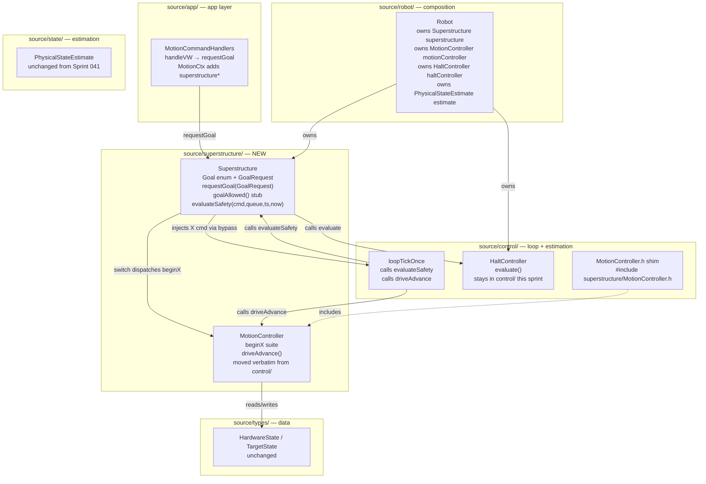
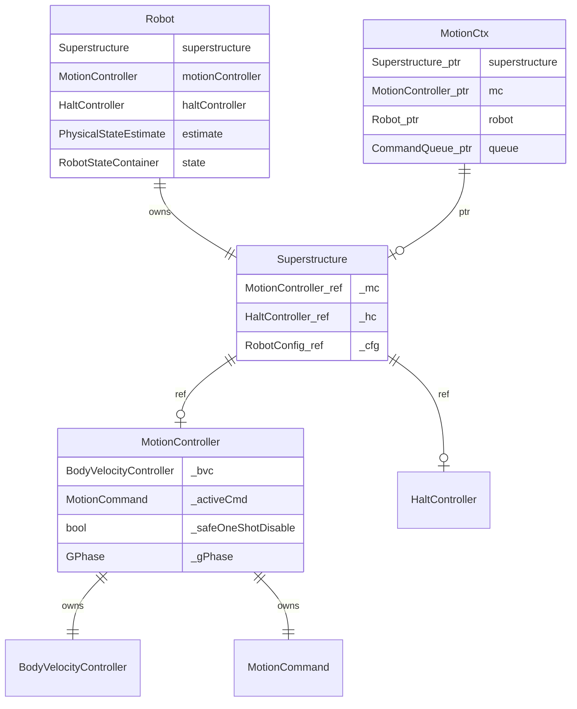

<!-- CLASI: Before changing code or making plans, review the SE process in CLAUDE.md -->

# Architecture Update — Sprint 042: Phase D — Thin Superstructure seam

## Sprint Changes

### Summary

Phase D introduces **`Superstructure`** — Seam 3 of the FRC Elite Architecture
adaptation — as a thin, `switch`-over-`Goal` coordinator. Three concrete changes:

1. **`source/superstructure/Superstructure.{h,cpp}`** — new class with `Goal` enum,
   `GoalRequest` POD, `requestGoal(GoalRequest)` single guarded entry point, and
   `goalAllowed()` stub (returns `true`). Safety method `evaluateSafety(...)` centralizes
   the three inline blocks from `loopTickOnce` — verbatim bodies, same order.
2. **`source/superstructure/MotionController.{h,cpp}`** — `MotionController` moved from
   `source/control/` using `git mv`; bodies verbatim. Alias shim left at
   `source/control/MotionController.h`.
3. **`source/app/MotionCommandHandlers.cpp` (repointed)** — `handleVW` and all
   fallback direct-call paths replace `ctx->mc->beginX(...)` with
   `ctx->superstructure->requestGoal(GoalRequest{...})`. The `MotionCtx` struct gains
   a `Superstructure*` pointer alongside the existing `MotionController*`.

`loopTickOnce` calls `robot.superstructure.evaluateSafety(cmd, queue, ts, now)` in the
same position as the three former inline blocks. No reordering.

### Files Created

- `source/superstructure/Superstructure.h`
- `source/superstructure/Superstructure.cpp`
- `source/superstructure/MotionController.h` (moved from `source/control/`)
- `source/superstructure/MotionController.cpp` (moved from `source/control/`)

### Files Modified

- `source/control/MotionController.h` — becomes an alias shim:
  `#include "../superstructure/MotionController.h"` (deleted in Phase F)
- `source/control/LoopTickOnce.cpp` — the three safety blocks
  (watchdog, halt-controller, ESTOP injection) replaced by a single call:
  `robot.superstructure.evaluateSafety(cmd, queue, ts, now)` in the same position.
  The `robot.motionController.driveAdvance(...)` line below it is unchanged.
- `source/robot/Robot.h` — `motionController` member type remains `MotionController`;
  new `Superstructure superstructure` value member added (holds references to
  `motionController` and `haltController`); `#include "Superstructure.h"` added.
- `source/robot/Robot.cpp` — constructor wires `superstructure` with references to
  `motionController` and `haltController`.
- `source/app/MotionCommandHandlers.cpp` — `handleVW` and direct-call fallback paths
  replace `ctx->mc->beginX(...)` with `ctx->superstructure->requestGoal(GoalRequest{...})`.
- `source/app/MotionCommandHandlers.h` — `MotionCtx` struct gains
  `Superstructure* superstructure`.
- `tests/_infra/sim/CMakeLists.txt` — `source/superstructure/` added to source glob.
- `tests/_infra/vendor_baseline.txt` — updated: `source/superstructure/` scoped in;
  MotionController entries under `source/control/` replaced with `source/superstructure/`.

### No Changes To

- `source/control/MotionController.{h,cpp}` bodies — verbatim move only.
- `source/control/HaltController.{h,cpp}` — stays in `source/control/`; `Superstructure`
  holds a reference to it (no move this sprint; Phase E or F may relocate it).
- `source/state/PhysicalStateEstimate.{h,cpp}` — zero changes.
- `source/io/` — zero device-layer changes.
- `source/types/RobotState.h` — `HardwareState` fields unchanged.
- `tests/simulation/` test files — zero edits to any existing test.
- Safety behavior numerics and ordering — verbatim copies only.

---

## Why

Three concrete problems motivate this seam (from §4 of the issue):

**1. No single guarded transition point.** Every motion verb handler calls
`motionController.beginX()` directly. When the off-table fence or any future
pre-condition check is added, it must touch every call site independently. There is
no canonical "one place where a goal is approved before execution starts."

**2. Safety logic scattered in loopTickOnce.** The keepalive watchdog decision,
the ESTOP/X injection, and the halt-condition check are three separate inline blocks
in `loopTickOnce`. There is no structural boundary that owns "the safety evaluation
for a goal transition." This makes it easy to accidentally reorder or skip a check
during future edits.

**3. MotionController in the wrong layer.** `MotionController` is the goal executor
for Seam 3. Having it under `source/control/` leaves the Superstructure seam
incomplete. Moving it to `source/superstructure/` names the seam correctly and
groups the goal executor with its coordinator.

---

## Module Definitions

### Superstructure (source/superstructure/Superstructure.{h,cpp})

**Purpose:** Single coordinator for goal transitions and safety evaluation; holds the
`Goal` enum, `GoalRequest` POD, `requestGoal(GoalRequest)`, `goalAllowed()` stub, and
`evaluateSafety(...)`.

**Boundary (in):**
- `requestGoal(GoalRequest gr)` — the only external entry point for goal starts.
  Calls `goalAllowed(gr)` (stub: returns `true`), then dispatches via
  `switch(gr.goal)` to `_mc.beginX(gr.params...)`. A denied goal (future use) returns
  without calling `beginX`.
- `evaluateSafety(CommandProcessor& cmd, CommandQueue& queue, LoopTickState& ts,
  uint32_t now)` — called once per tick from `loopTickOnce`, in the same position as
  the three former inline blocks. Internal order verbatim: keepalive watchdog first,
  then halt-controller. Drive advance is NOT called here — it remains in
  `loopTickOnce` immediately after the `evaluateSafety` call.

**Boundary (out):**
- `MotionController& mc()` — exposes the wrapped `MotionController` for the
  `loopTickOnce` `driveAdvance` call (drive advance stays in `loopTickOnce`).
- No new outputs. `MotionController` state, reply sinks, and EVT routing are
  unchanged.

**Dependency rule:** `Superstructure.h` includes `MotionController.h`,
`HaltController.h`, `CommandProcessor.h`, `CommandQueue.h`, `Protocol.h`, and
the `LoopTickState` type. It does NOT include any device headers (`MicroBit.h`,
`I2CBus.h`) or `io/` headers. Vendor-confinement grep gate must see zero hits
in `source/superstructure/`.

**Use cases:** SUC-001, SUC-002, SUC-003, SUC-005.

---

### MotionController (source/superstructure/MotionController.{h,cpp})

**Purpose:** Goal executor for all drive state machines (S/T/D/G/VW/R/TURN/RT).
Moved from `source/control/` verbatim; no body changes.

**Boundary:** Identical to the pre-move `MotionController`. The only change is the
physical location and include path. A shim at `source/control/MotionController.h`
(`#include "../superstructure/MotionController.h"`) provides backward compatibility
until Phase F.

**Use cases:** SUC-001, SUC-002, SUC-004.

---

### MotionCommandHandlers (source/app/MotionCommandHandlers.cpp) — modified

**Purpose:** Motion verb parse/dispatch layer. Repointed from `beginX()` direct calls
to `requestGoal(GoalRequest{...})`.

**Boundary change:** `MotionCtx` gains `Superstructure* superstructure`. All
`ctx->mc->beginX(...)` calls in `handleVW` and the direct-call fallback paths become
`ctx->superstructure->requestGoal(GoalRequest{Goal::X, ...})`. The existing
`MotionController* mc` is retained for any fallback paths that are not repointed
(see OQ-2).

**Use cases:** SUC-001.

---

### loopTickOnce (source/control/LoopTickOnce.cpp) — simplified

**Purpose:** Shared firmware-sim loop body. The three safety inline blocks replaced
with one call to `robot.superstructure.evaluateSafety(cmd, queue, ts, now)`.
`robot.motionController.driveAdvance(...)` remains immediately after, in the same
relative position. Tick order:

```
[control collect]
cmd.dequeueOne(queue)
robot.superstructure.evaluateSafety(...)   ← was: watchdog + halt + ESTOP injection
robot.motionController.driveAdvance(...)   ← unchanged
robot.estimate.addOdometryObservation(...) ← unchanged
robot.hal.tick(...)                        ← unchanged
...
```

**Use cases:** SUC-002, SUC-005.

---

## Component / Module Diagram





---

## Impact on Existing Components

| Component | Before | After |
|---|---|---|
| `source/control/MotionController.h/.cpp` | Real definition | Alias shim (`.h`); `.cpp` deleted; bodies at `source/superstructure/` |
| `source/superstructure/MotionController.h/.cpp` | Does not exist | Real definition (moved verbatim) |
| `Robot` struct | No `Superstructure` member | Adds `Superstructure superstructure` value member |
| `loopTickOnce` — watchdog + halt + ESTOP blocks | Three inline blocks (~50 lines) | One call: `robot.superstructure.evaluateSafety(...)` |
| `MotionCommandHandlers::handleVW` and fallback paths | `ctx->mc->beginX(...)` direct | `ctx->superstructure->requestGoal(GoalRequest{...})` |
| `MotionCtx` struct | `MotionController* mc` only | Adds `Superstructure* superstructure` |
| `HaltController` location | `source/control/` | Unchanged; `Superstructure` holds reference |
| `tests/_infra/sim/CMakeLists.txt` | No `source/superstructure/` glob | Adds `source/superstructure/` glob |
| Vendor-confinement baseline | `source/control/` for MotionController | `source/superstructure/` added; MotionController entries repointed |
| Golden-TLM canary | Byte-exact baseline | Must remain byte-exact after every ticket |

---

## Migration Concerns

### 1. Safety ordering — verbatim move is the contract

The watchdog block, halt-controller block, and ESTOP/X injection currently occupy
three consecutive positions in `loopTickOnce` between `cmd.dequeueOne(queue)` and
`robot.motionController.driveAdvance(...)`. The move into `Superstructure::evaluateSafety`
must preserve this exact ordering. The `evaluateSafety` method body is:

```
(1) watchdog block   — needsWatchdog logic + X injection via cmd bypass
(2) halt-controller  — haltController.evaluate() + X/X soft injection
```

Drive advance remains in `loopTickOnce` after the `evaluateSafety` call. The
golden-TLM canary and the safety-fence tests (`test_watchdog_exemption.py`,
`test_incident_scenarios.py`) catch any ordering regression immediately.

**Risk:** Low if the move is textual.

### 2. GoalRequest parameter faithfulness

`requestGoal(GoalRequest)` must pass ALL parameters that the existing `beginX()` calls
pass — `now_ms`, `target`, `replyFn`, `replyCtx`, `corrId`, and goal-specific fields
(heading, speed, target mm, etc.). A `GoalRequest` that drops a parameter will
produce wrong behavior with no compile error (zero-initialization of missing fields).
Programmer must audit every `ctx->mc->beginX(...)` call site in `handleVW` and verify
that the corresponding `requestGoal(GoalRequest{...})` carries identical arguments.

**Risk:** Medium. Caught by simulation tests on first run.

### 3. SAFE one-shot re-arm timing

`MotionController::_checkSafeOneShot()` is called at the start of every `beginX()`.
It remains there — `requestGoal` calls `beginX`, which calls `_checkSafeOneShot`.
Do not add a `_checkSafeOneShot` call in `requestGoal` itself — that would
double-trigger.

**Risk:** Low if `requestGoal` is a thin dispatch only.

### 4. ARM firmware build gate

Moving `MotionController.cpp` to `source/superstructure/` must be reflected in the
firmware build. If the build system uses a glob of `source/control/*.cpp`, the move
will silently drop `MotionController.cpp` (linker error). Programmer must update both
firmware and sim build entry points. After building, run `git checkout --
source/robot/DefaultConfig.cpp` to discard cosmetic regen.

**Risk:** Low but load-bearing. Linker error is immediate.

### 5. Robot member declaration order

`Superstructure` holds `MotionController&` and `HaltController&` — references into
`Robot`'s own value members. In `Robot.h`, `motionController` and `haltController`
must be declared BEFORE `superstructure` (construction order matches declaration
order in C++). Do not reorder.

**Risk:** Low — same pattern as existing `MotionController` holding `MotorController&`.

### 6. driveAdvance stays in loopTickOnce

`Superstructure::evaluateSafety` does NOT call `driveAdvance`. The
`robot.motionController.driveAdvance(...)` call in `loopTickOnce` is unchanged and
stays where it is. Phase E (subsystem/periodic) will consolidate it.

---

## Design Rationale

### Decision: Thin switch — no state-graph

- **Context**: The issue §4 explicitly prohibits building a state-graph or
  transition-table (D2 L3–4). The only needed guarantee is one guarded entry point.
- **Alternatives**: (a) State-graph with explicit allowed predecessor states. Rich
  interlock but speculative generality for a diff-drive robot with no
  mechanism-vs-mechanism conflicts. (b) Flat `switch` in `requestGoal`.
- **Why (flat switch)**: Minimal code. `requestGoal` is a dispatcher, not a machine.
  The `goalAllowed()` hook is the seam for future pre-conditions; the switch body
  is just the existing `beginX()` call. Extending to a state-graph later is
  additive, not a rewrite.
- **Consequences**: No interlock between goals this sprint. Future pre-conditions
  live in `goalAllowed()`.

### Decision: evaluateSafety is a method call, not inline in loopTickOnce

- **Context**: The three inline blocks could stay in `loopTickOnce`.
- **Why (method)**: Gives safety logic one named home. Future engineers find the
  watchdog logic in `Superstructure`, not scattered in a loop body. The call in
  `loopTickOnce` is a one-liner; ordering is documented by the call sequence.
- **Consequences**: One extra function call per tick (no measurable overhead on the
  nRF52 cooperative loop).

### Decision: HaltController stays in source/control/ this sprint

- **Context**: `HaltController` is referenced by `LoopScheduler` (exposed to command
  handlers via `sched->haltController`). Moving it to `source/superstructure/` would
  require updating `LoopScheduler.h` and all handler code that reaches it through
  the scheduler.
- **Why (defer)**: Blast radius exceeds Phase D scope. `Superstructure` holds a
  `HaltController&` reference — this is sufficient. Phase E or F cleans up.
- **Consequences**: `HaltController` header stays in `source/control/`.

### Decision: driveAdvance remains in loopTickOnce, not called from evaluateSafety

- **Context**: Phase E (subsystem/periodic) is the planned home for `periodic()`-style
  wrappers. Adding `periodic()` now is premature.
- **Why (defer)**: Phase D is "foundation tier only." Keeping `driveAdvance` in
  `loopTickOnce` makes tick ordering fully visible in one place.
- **Consequences**: Two Superstructure-related calls remain in `loopTickOnce`
  (`evaluateSafety` then `driveAdvance`). Phase E consolidates them.

---

## Open Questions

### OQ-1: GoalRequest struct field set

`GoalRequest` must carry all parameters needed by any `beginX()` variant. The union of
parameters across all nine motion begin-methods is wide: `now_ms`, `replyFn`,
`replyCtx`, `corrId`, plus goal-specific fields (`leftMms/rightMms` for S/T,
`durationMs` for T, `targetMm` for D, `tx/ty/speedMms` for G, `headingCdeg/epsCdeg`
for TURN, `relCdeg` for RT, `v_mms/omega_rads` for VW, `speedMms/radiusMm` for
R/ARC).

A flat union struct (all fields present; unused ones zero-initialized) is recommended
for Phase D. Programmer confirms which fields are required by each `beginX()` and
sizes the struct accordingly.

### OQ-2: MotionCtx — retain mc* alongside superstructure* or drop it?

After repointing verb handlers to `requestGoal`, the `MotionController* mc` in
`MotionCtx` is used only by direct-call fallback paths (sim fallback — when
`ctx->queue == nullptr`). Two options:
- **Retain `mc*`** alongside `superstructure*`: fallback paths keep calling
  `ctx->mc->beginX(...)` directly (lower risk, less churn).
- **Repoint fallback paths too**: all paths go through `requestGoal`.

Retaining `mc*` is the lower-risk choice for Phase D. Programmer decides.

### OQ-3: Build system approach for source/superstructure/

If the firmware build uses `file(GLOB ...)` over `source/control/*.cpp`, moving
`MotionController.cpp` removes it from the build silently. Programmer must verify
and update before the ARM gate. If an explicit file list is used, the new path must
be added explicitly.
