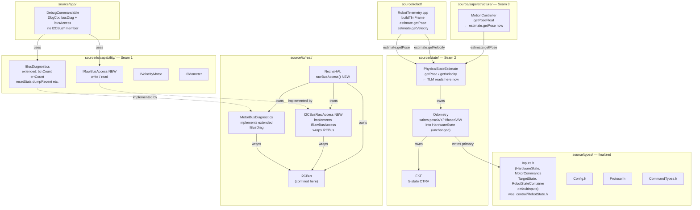
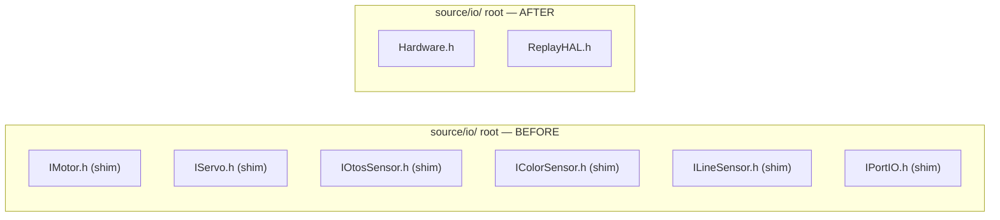
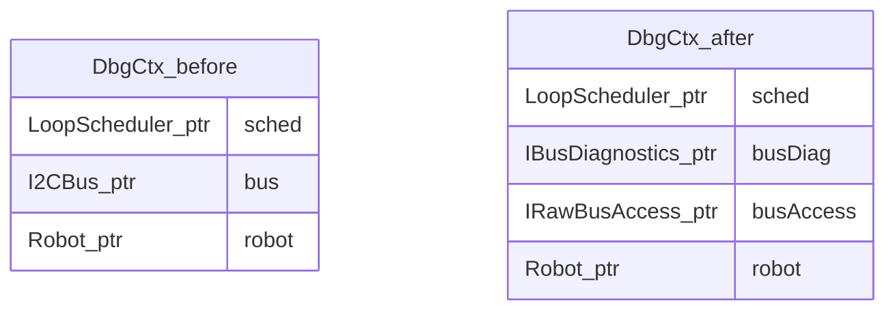

<!-- CLASI: Before changing code or making plans, review the SE process in CLAUDE.md -->

# Architecture Update — Sprint 044: Phase F — Logging and rename/cleanup

## What Changed

### 1. TLM readers repointed to PhysicalStateEstimate seam

`buildTlmFrame` (`source/robot/RobotTelemetry.cpp`) and
`MotionController::getPoseFloat` (`source/superstructure/MotionController.cpp`)
previously called `Odometry::getPose(state.inputs, ...)` and read
`state.inputs.fusedV` / `state.inputs.fusedOmega` directly. After this sprint:

- `buildTlmFrame` calls `estimate.getPose(state.inputs, pose_x, pose_y, pose_h)`.
- `buildTlmFrame` calls `estimate.getVelocity(state.inputs, v, omega)`.
- `MotionController::getPoseFloat` calls `PhysicalStateEstimate::getPose(*_hwState, xi, yi, hi)`.

The `HardwareState` fields `poseX`, `poseY`, `poseHrad`, `fusedV`, `fusedOmega`
**remain in the struct as the primary store** — `Odometry::predict` and
`correctEKF` continue to write them. `PhysicalStateEstimate::getPose` and
`getVelocity` are static forwarders that read those same fields. No byte-value
change; the golden-TLM canary is unaffected.

The "Phase C back-compat mirroring" note in `PhysicalStateEstimate.h` referred
to the WRITE path: Phase C kept writing fused pose into `HardwareState` (which
was already happening in `Odometry`). There is no separate redundant write to
remove. The action in this sprint is solely repointing the READ path through the
seam object.

### 2. source/types/Inputs.h — RobotState.h rename/move

`source/control/RobotState.h` is deleted. Its full content — `ValueSet`,
`MotorCommands`, `HardwareState`, `TargetState`, `RobotStateContainer`,
`defaultInputs` — moves verbatim to `source/types/Inputs.h`.

All `#include "RobotState.h"` and `#include "control/RobotState.h"` occurrences
in maintained source (approximately 12+ files) are rewritten to the new path.
The struct layouts and all field names are unchanged. The name "RobotState" is
retired from the source tree (remaining occurrences are comments describing
history).

`source/types/` is now complete:
```
source/types/
  Config.h          (RobotConfig, DriveMode, TLM flags)
  Protocol.h        (wire-protocol v2 strings)
  CommandTypes.h    (Commandable, CommandDescriptor, ParsedCommand)
  Inputs.h          (HardwareState, MotorCommands, TargetState,
                     RobotStateContainer, defaultInputs)
```

### 3. Alias shim headers deleted

Eight transitional alias shims introduced in Phases A–D are deleted:

| Shim | Canonical replacement |
|------|----------------------|
| `source/io/IMotor.h` | `source/io/capability/IVelocityMotor.h` |
| `source/io/IServo.h` | `source/io/capability/IPositionMotor.h` |
| `source/io/IOtosSensor.h` | `source/io/capability/IOdometer.h` |
| `source/io/IColorSensor.h` | `source/io/capability/IColorSensor.h` |
| `source/io/ILineSensor.h` | `source/io/capability/ILineSensor.h` |
| `source/io/IPortIO.h` | `source/io/capability/IPortIO.h` |
| `source/control/EKF.h` | `source/state/EKF.h` |
| `source/control/MotionController.h` | `source/superstructure/MotionController.h` |

Every file that included a shim is updated to the canonical path. The `source/io/`
root is left with only `Hardware.h`, `ReplayHAL.h`, and the `capability/`,
`real/`, and `sim/` subdirectories.

### 4. DebugCommandable I2CBus leak resolved

**Chosen approach: extend IBusDiagnostics with all needed I2C diagnostics methods,
replace I2CW/I2CR with a new IRawBusAccess interface at io/real/.**

The `DbgCtx` struct in `source/app/DebugCommandable.h` currently holds `I2CBus* bus`,
a forward-declared `class I2CBus`, and `DebugCommandable.cpp` `#include "I2CBus.h"`
inside `#ifndef HOST_BUILD`. This is the sole remaining vendor leak above
`source/io/`.

**What the handlers actually need from I2CBus:**
- `DBG I2CLOG ARM`: `bus->resetStats()`, `bus->setLogging(true)`
- `DBG I2CLOG` (dump): `bus->dumpRecent(replyFn, replyCtx)`
- `DBG I2C`: `bus->txnCount(addr)`, `bus->errCount(addr)`, `bus->lastErr(addr)`,
  `bus->reentryViolations()`
- `DBG I2C RESET`: `bus->resetStats()` + `robot->motorController.resetStuckCounters()`
- `DBG IRQGUARD`: `bus->setIrqGuard(bool)`, `bus->irqGuard()`
- `I2CW`: `bus->write(addr, data, len)`
- `I2CR`: `bus->write(addr, &reg, 1, true)` (repeated-start), `bus->read(addr, buf, n)`

**Design decision: two interfaces.**

**`IBusDiagnostics`** (already at `source/io/capability/IBusDiagnostics.h`) is
extended with the full diagnostic surface:

```
IBusDiagnostics (extended):
  uint32_t txnCount(uint8_t addr7) const
  uint32_t errCount(uint8_t addr7) const
  int8_t   lastErr(uint8_t addr7) const
  uint32_t reentryViolations() const
  void     resetStats()
  void     setLogging(bool on)
  void     dumpRecent(ReplyFn fn, void* ctx) const
  bool     irqGuard() const
  void     setIrqGuard(bool on)
```

**`IRawBusAccess`** (new, `source/io/capability/IRawBusAccess.h`) exposes raw
read/write for I2CW/I2CR:

```
IRawBusAccess:
  int write(uint16_t addr8, const uint8_t* data, int len, bool repeated = false)
  int read(uint16_t addr8, uint8_t* buf, int len)
```

`DbgCtx` becomes:
```cpp
struct DbgCtx {
    LoopScheduler*   sched;
    IBusDiagnostics* busDiag;
    IRawBusAccess*   busAccess;
    Robot*           robot;
};
```

`NezhaHAL` exposes `IBusDiagnostics& busDiagnostics()` (already exists from
Phase A) and a new `IRawBusAccess& rawBusAccess()`. The `MotorBusDiagnostics`
adapter (`source/io/real/MotorBusDiagnostics`) is extended to implement the
full `IBusDiagnostics` surface. A new `I2CBusRawAccess` adapter
(`source/io/real/I2CBusRawAccess.h/.cpp`) wraps `I2CBus&` and implements
`IRawBusAccess`.

`main.cpp` passes `&hardware.busDiagnostics()` and `&hardware.rawBusAccess()`
when constructing `DbgCtx`.

`DebugCommandable.h` — `class I2CBus` forward declaration removed; `I2CBus* bus`
replaced with `IBusDiagnostics* busDiag` + `IRawBusAccess* busAccess`.
`DebugCommandable.cpp` — `#include "I2CBus.h"` removed; handlers use the two
interface pointers.

Both new adapters live in `source/io/real/` — below the `source/io/` boundary.
`DebugCommandable.cpp` and `.h` contain zero `I2CBus` or `MicroBit` references.

**Why this over "move I2CW/I2CR into io/real/":** Moving handlers into `io/real/`
as a "debug device" would require the app-layer command table to reach into `io/`
for handler registration, reversing the dependency direction (`app/` → `io/`).
That is worse than the current leak. The interface approach keeps handler code in
`app/`, the vendor type in `io/real/` behind an interface, and the dependency
direction correct.

**Why not extend `IBusDiagnostics` to also cover raw read/write:** Raw bus access
is qualitatively different from diagnostics (it mutates the bus). Keeping them in
two narrow interfaces satisfies the cohesion test better than one omnibus interface.

### 5. ReplayHAL stub exercised by test; seam-presence test added

A new test file `tests/simulation/unit/test_architecture_seams.py` contains:

1. **Seam-presence test**: asserts `source/io/capability/`, `source/state/PhysicalStateEstimate.h`,
   and `source/superstructure/Superstructure.h` exist, and that the four-file device
   quartet pattern holds for each capability (at least one capability header, one
   real impl, one sim impl).

2. **REPLAY stub test**: imports a helper that compiles a minimal REPLAY-mode binary
   or directly verifies `ReplayHAL.h` + `ReplayHAL.cpp` exist and contain the
   `RobotMode::REPLAY` static_assert.

Both tests are pure filesystem/text checks — no hardware, no ctypes build required.

### 6. Logging contract lint test added

`tests/simulation/unit/test_logging_contract.py` (or added to the vendor confinement
test) greps `source/subsystems/` for forbidden output calls (`printf`, `telemetryEmit`,
`snprintf.*replyFn`, `replyFn(`). Asserts zero hits.

---

## Why

**SUC-001 (TLM reader repoint):** Phase C explicitly deferred reader repoint to
Phase F. The back-compat mirroring comment exists precisely so this sprint can
close the seam cleanly. The change is zero-behavior because the seam's static
forwarders read the same `HardwareState` fields that `Odometry` already writes.

**SUC-002 (Inputs.h rename):** `source/control/RobotState.h` is a legacy name
(the FRC Elite Architecture calls this the Inputs struct). The rename finalizes
`source/types/` and retires the "RobotState" blob name per the migration issue's
Phase F definition.

**SUC-003 (shim deletion):** The alias shims were a transition device to keep
the codebase green during the Phase A capability rename. All callers are now in
canonical form; the shims add confusion. Deleting them makes the include graph
explicit.

**SUC-004 (DebugCommandable):** This is the LAST vendor leak above `source/io/`.
`DebugCommandable.h` is in `source/app/` and is included in the host build
(excluding `#ifndef HOST_BUILD` guards). The `I2CBus*` in `DbgCtx` appears in the
header, making it visible to every file that includes `DebugCommandable.h`. The
fix seals the final leak and empties `vendor_baseline.txt`.

**SUC-005/006 (REPLAY + seam tests):** The migration's "Final" verification
criteria require REPLAY to be exercised and three seams to be findable. Tests
machine-verify these invariants so future edits that accidentally remove a seam or
break REPLAY are caught immediately in CI.

**SUC-007 (logging contract):** §6 mandates "no subsystem prints." Phase E moved
bodies verbatim so no prints were introduced, but there is no gate. Adding a grep
test makes the contract permanent.

---

## Impact on Existing Components

| Component | Before Sprint 044 | After Sprint 044 |
|-----------|-------------------|------------------|
| `RobotTelemetry.cpp` (`buildTlmFrame`) | Calls `Odometry::getPose(s, ...)`, reads `s.fusedV`/`s.fusedOmega` directly | Calls `estimate.getPose(s, ...)`, `estimate.getVelocity(s, ...)` |
| `MotionController::getPoseFloat` | Calls `Odometry::getPose(*_hwState, ...)` | Calls `PhysicalStateEstimate::getPose(*_hwState, ...)` |
| `HardwareState` fields `poseX/Y/poseHrad/fusedV/fusedOmega` | Written by `Odometry`; read by TLM and MotionController directly | Written by `Odometry` (unchanged); read through `estimate.*` seam |
| `source/control/RobotState.h` | Defines all input/state structs | Deleted; content at `source/types/Inputs.h` |
| `source/types/Inputs.h` | Does not exist | Created; canonical location of `HardwareState` et al. |
| `source/io/I*.h` (six shims) | Alias shims for transition | Deleted |
| `source/control/EKF.h` | Alias shim: `#include "../state/EKF.h"` | Deleted |
| `source/control/MotionController.h` | Alias shim: `#include "../superstructure/MotionController.h"` | Deleted |
| `source/app/DebugCommandable.h` | `DbgCtx` has `I2CBus* bus` + `class I2CBus` forward | `DbgCtx` has `IBusDiagnostics* busDiag` + `IRawBusAccess* busAccess` |
| `source/app/DebugCommandable.cpp` | `#include "I2CBus.h"` inside `#ifndef HOST_BUILD` | No `I2CBus.h` include; uses `IBusDiagnostics*` + `IRawBusAccess*` |
| `source/io/capability/IBusDiagnostics.h` | Three methods: `errorCount`, `reentryViolations`, `lastError` | Extended: adds `txnCount`, `errCount`, `lastErr`, `resetStats`, `setLogging`, `dumpRecent`, `irqGuard`, `setIrqGuard` |
| `source/io/capability/IRawBusAccess.h` | Does not exist | Created: two methods `write`, `read` |
| `source/io/real/MotorBusDiagnostics.h/.cpp` | Implements original 3-method `IBusDiagnostics` | Implements extended `IBusDiagnostics` |
| `source/io/real/I2CBusRawAccess.h/.cpp` | Does not exist | Created: wraps `I2CBus&`, implements `IRawBusAccess` |
| `NezhaHAL` | `busDiagnostics()` exposes 3-method interface | `busDiagnostics()` same accessor (now covers extended interface); `rawBusAccess()` added |
| `main.cpp` | Passes `&hardware.busDiagnostics()` to `MotorController`, `&hardware.bus()` to `DbgCtx` | Passes `&hardware.busDiagnostics()` + `&hardware.rawBusAccess()` to `DbgCtx`; no `bus()` call in `DbgCtx` wiring |
| `tests/_infra/vendor_baseline.txt` | Four DebugCommandable entries | Empty |
| `tests/simulation/unit/test_architecture_seams.py` | Does not exist | Created: seam-presence test + REPLAY stub confirmation |
| `tests/simulation/unit/test_logging_contract.py` (or existing vendor test) | No subsystems print check | Grep-based assertion added |

---

## Component/Module Diagram







---

## Migration Concerns

### 1. TLM reader repoint — byte-exactness is guaranteed, not assumed

`PhysicalStateEstimate::getPose` is already a static forwarder to `Odometry::getPose`,
which reads `s.poseX`, `s.poseY`, `s.poseHrad`. `PhysicalStateEstimate::getVelocity`
reads `s.fusedV`, `s.fusedOmega`. These are the same memory locations as before.
The only difference is the call goes through the seam object's static methods rather
than `Odometry::getPose` directly. **The values are provably identical.** The golden-TLM
canary will confirm this at ticket green.

There is no "stop mirroring" write-path change in this sprint. The Phase C comment
about "back-compat mirroring" described WRITING back into `HardwareState` — which
`Odometry::predict` has always done and continues to do. No write-path changes here.

### 2. RobotState.h rename — include path update is mechanical, all callers must be caught

Approximately 12–15 files include `RobotState.h`. The programmer must grep for all
occurrences and update them before deleting the file. A stale include produces an
immediate compile error (no silent behavior change). The ARM firmware build is a hard
gate; if any CODAL-only file still includes the old path, the build fails.

Files expected to need updating include:
`source/control/Odometry.h`, `source/control/StopCondition.h`,
`source/control/MotionCommand.h`, `source/control/MotorController.h`,
`source/state/PhysicalStateEstimate.h`, `source/robot/Robot.h`,
`source/robot/RobotTelemetry.cpp`, `source/superstructure/Superstructure.h`,
`source/superstructure/MotionController.h`, `source/control/LoopTickOnce.cpp`,
`tests/_infra/sim/sim_api.cpp`, and others. Programmer greps before deleting.

### 3. Shim deletion — include updates must be complete before deletion

The six `source/io/I*.h` shims are included by at least `Robot.h`, `MotorController.h`,
`Odometry.h`, `StopCondition.h`, `ServoController.h`, `PortController.h`, and
firmware-specific files. Each must be updated to use the `io/capability/` path
before the shim is deleted. `source/control/EKF.h` shim is included by `Odometry.h`
(likely the only remaining user after Phase C). `source/control/MotionController.h`
shim is included by files that reference `MotionController` from `control/`.

The programmer must grep for all shim users, update them, then delete. Immediate
compile errors will catch any miss.

### 4. IBusDiagnostics extension — MotorBusDiagnostics must implement new methods

Phase A created `MotorBusDiagnostics` with three methods matching the original
`IBusDiagnostics` interface. Adding eight more methods to the interface requires
implementing them all in `MotorBusDiagnostics`. The implementations are trivial
forwarders to `_bus.txnCount(addr)`, etc. — `I2CBus` already exposes all of these.

The MockHAL / SimHardware `IBusDiagnostics` stub (null or zero-return) must also
be extended if it implements the interface. Since `MockHAL` was retired in Phase B
and `SimHardware` holds `IBusDiagnostics*` as a null pointer (accepted by
`MotorController` which null-guards `_busDiag`), the extension may only need a
concrete implementation in `NezhaHAL`. Check for any stub implementations in test
helpers.

### 5. IRawBusAccess — main.cpp wiring update

`main.cpp` currently passes `&hardware.bus()` to `DbgCtx`. After this sprint, it
passes `&hardware.busDiagnostics()` and `&hardware.rawBusAccess()`. The `bus()`
accessor on `NezhaHAL` may be retained for historical reasons but is no longer
used above `source/io/`. If no other caller uses `bus()`, it can be kept
`protected` or removed. Its use in `DbgCtx` was always the purpose.

### 6. ARM firmware build gate applies at every ticket

`DebugCommandable.cpp` and `I2CBusRawAccess.cpp` are firmware-only (excluded from
HOST_BUILD). `NezhaHAL.cpp` changes must compile with the ARM toolchain. After the
ARM build, run `git checkout -- source/robot/DefaultConfig.cpp`.

---

## Design Rationale

### Decision: Extend IBusDiagnostics rather than move I2CW/I2CR handlers to io/real/

**Context:** `I2CW` and `I2CR` handlers in `DebugCommandable.cpp` call `bus->write()`
and `bus->read()` directly. They could be moved to a "debug device" in `source/io/real/`.

**Alternatives:**
1. Move `I2CW`/`I2CR` handler logic to `source/io/real/I2CDebugDevice.cpp` (a debug
   device Commandable registered from `io/real/`). This inverts the dependency: a
   device impl now implements `Commandable` from `types/CommandTypes.h` — the same
   coupling that was removed from `Odometry` in Phase C.
2. Introduce a separate `IRawBusAccess` interface covering only `write`/`read`; keep
   the 9 diagnostic methods on `IBusDiagnostics` (chosen).

**Why option 2:** `IRawBusAccess` is narrow (two methods). The diagnostic methods
are genuinely diagnostic (read-only statistics). Splitting them keeps both interfaces
cohesive. `app/` code (DebugCommandable) depends on two capability interfaces; both
are implemented by adapters in `io/real/`. Dependency direction: `app/ → capability/`.
Vendor types (`I2CBus`) stay in `io/real/`. This is the correct layering.

**Consequences:** `IBusDiagnostics` grows from 3 to 11 methods. `MotorBusDiagnostics`
must implement all 11. `I2CBusRawAccess` is a new 2-method adapter. `NezhaHAL` gains
one new accessor. `DbgCtx` gains one pointer.

### Decision: HardwareState pose fields remain; only the READ path is repointed

**Context:** The sprint description mentioned "stop mirroring the fused pose into
`HardwareState.pose*`/`fused*`." Close reading of the code shows there is no
redundant mirror write: `Odometry::predict` and `correctEKF` have ALWAYS written
into `HardwareState.poseX/Y/poseHrad/fusedV/fusedOmega` as the primary write path.
Phase C did not add a second write; it added a comment saying "keep doing this
for transition safety." The fields are the primary store, not a mirror.

**Decision:** Keep all five fields in `HardwareState` (they remain the primary store).
Repoint only the READ path (TLM and MotionController) through `PhysicalStateEstimate`
static methods. No write-path changes. This preserves byte-exact TLM with zero risk.

**Consequences:** The sprint is simpler than originally described. "Stop mirroring"
was a mischaracterization; the correct action is "repoint readers." Golden-TLM
byte-exactness is guaranteed.

### Decision: source/types/Inputs.h uses verbatim content from RobotState.h

**Context:** The rename could be accompanied by layout cleanup (e.g., splitting
`TargetState` out, renaming `HardwareState` to `Inputs`). The issue §6 says
"`Inputs.h` (= HardwareState)" — i.e., the type alias or rename, not a structural
change.

**Decision:** Move verbatim; keep the struct names `HardwareState`, `MotorCommands`,
`TargetState`, `RobotStateContainer`. The file is `Inputs.h` (matching the §5 layout),
but the type names inside are not renamed this sprint (too many callsites; deferred
to a future structural cleanup if desired). The §6 intent is met by the file name.

**Consequences:** Callers continue to use `HardwareState` by name (no callsite churn
beyond the include path update). The "RobotState" file name is retired; the struct
names are not.

---

## Open Questions

### OQ-1: Does MockHAL's IBusDiagnostics stub need extending?

Phase B retired `MockHAL` and replaced it with `SimHardware`. `SimHardware` does not
appear to expose a real `IBusDiagnostics` (it is not a firmware component and
`DebugCommandable` is excluded from HOST_BUILD). The `MotorController::_busDiag`
is passed from `main.cpp` (firmware only) and stays null in the host build
(null-guarded in `MotorController`). So the extended `IBusDiagnostics` interface
needs only one concrete implementation (`MotorBusDiagnostics`).

**Programmer must confirm:** does any sim-build or test-build code construct a stub
`IBusDiagnostics` that must implement new methods? If so, a null-stub impl in
`source/io/sim/` or `tests/_infra/` must be extended.

### OQ-2: Which files include source/control/EKF.h (the shim) besides Odometry.h?

The shim at `source/control/EKF.h` was added in Phase C (Sprint 041). If any file
other than `source/control/Odometry.h` still includes `"control/EKF.h"` or `"EKF.h"`,
it must be updated before deletion. Programmer should grep for `"EKF.h"` and `<EKF.h>`
in `source/` before deleting the shim.

### OQ-3: Does source/control/MotionController.h shim have include users outside Robot.h?

`source/control/MotionController.h` was the canonical path before Phase D. It became
an alias shim in Sprint 042. Users in `source/control/` (e.g., `LoopScheduler.cpp`,
`LoopTickOnce.cpp`, `HaltController.cpp`) may still include it via the `control/`
path. Programmer greps for `#include.*MotionController.h` before deleting the shim.

### OQ-4: `setOutput` vs `setSpeed` — IVelocityMotor method name

Looking at `ReplayHAL.h` line 43, `NoopVelocityMotor::setSpeed(int8_t pct)` is
defined, but `IVelocityMotor` from Phase A defines `setOutput(int8_t pct)`. If the
interface method is `setOutput` and the shim uses `setSpeed`, the ReplayHAL no-op
impl may have a mismatched override. Programmer verifies that `ReplayHAL::NoopVelocityMotor`
compiles cleanly against the current `IVelocityMotor` interface and fixes the method
name if needed (pure housekeeping, no behavior change).
