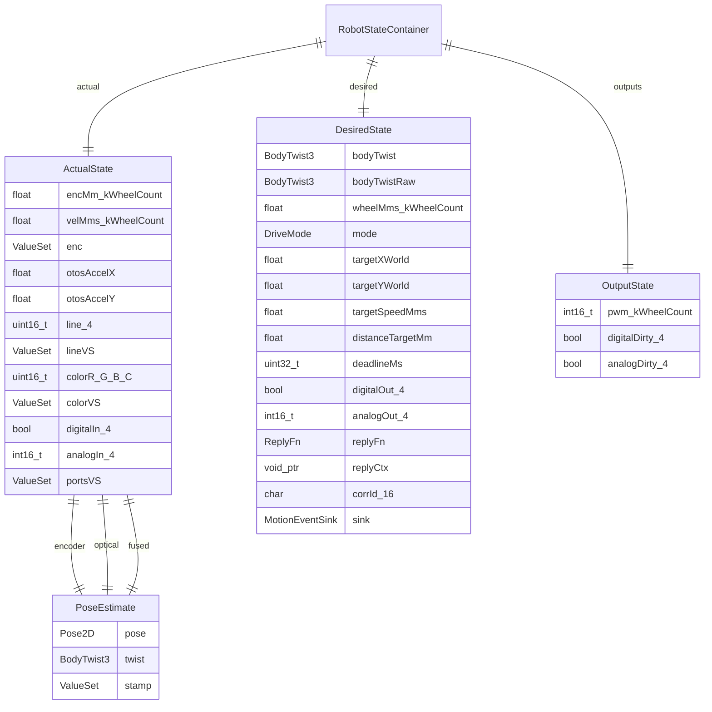
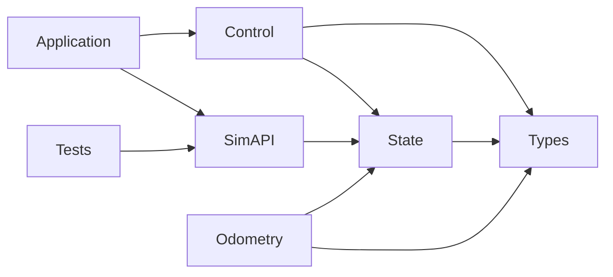

<!-- CLASI: Before changing code or making plans, review the SE process in CLAUDE.md -->

# Architecture Update — Sprint 047: Robust robot state object: actual/desired/outputs with encoder/optical/fused estimates

## What Changed

### A. New state type layer (`source/state/`)

Three new header-only POD types are added. They are purely additive — no existing
file is modified in this phase.

**`source/state/PoseEstimate.h`** (new):

```
struct PoseEstimate {
    Pose2D     pose  = {0,0,0};   // x mm, y mm, h rad
    BodyTwist3 twist = {0,0,0};   // vx mm/s, vy mm/s, omega rad/s (body frame)
    ValueSet   stamp = {};        // lagMs / lastUpdMs / valid  (per-source freshness)
};
```

`BodyTwist3` is used uniformly — `vy` is always present and written as 0 on
differential builds. This makes all consumers and the dump surface `#ifdef`-free.
`ValueSet` is reused from `source/types/Inputs.h`.

**`source/state/ActualState.h`** (new):

```
struct ActualState {
    PoseEstimate encoder;   // dead-reckoned from wheel deltas only — fusion never writes here
    PoseEstimate optical;   // raw OTOS pose + twist as reported before correction
    PoseEstimate fused;     // EKF output — authoritative belief

    float    encMm [Kinematics::kWheelCount] = {};  // cumulative distance, mm
    float    velMms[Kinematics::kWheelCount] = {};  // per-wheel velocity, mm/s
    ValueSet enc = {};

    float    otosAccelX = 0, otosAccelY = 0;        // mm/s^2 passthrough
    uint16_t line[4] = {};     ValueSet lineVS  = {};
    uint16_t colorR=0, colorG=0, colorB=0, colorC=0; ValueSet colorVS = {};
    bool     digitalIn[4] = {}; int16_t analogIn[4] = {}; ValueSet portsVS = {};
};
```

Array sizing via `Kinematics::kWheelCount` — 2 on differential, 4 on mecanum.
No `#ifdef` inside the struct body.

**`source/state/DesiredState.h`** (new):

```
struct DesiredState {
    BodyTwist3 bodyTwist    = {0,0,0};  // profiled live setpoint (BVC publishes here)
    BodyTwist3 bodyTwistRaw = {0,0,0};  // commanded target before clamp/profile

    float wheelMms[Kinematics::kWheelCount] = {};  // target wheel speeds, mm/s

    DriveMode mode = DriveMode::IDLE;
    float targetXWorld = 0, targetYWorld = 0;       // mm
    float targetSpeedMms = 0, distanceTargetMm = 0;
    uint32_t deadlineMs = 0;

    bool    digitalOut[4] = {};
    int16_t analogOut[4]  = {};

    ReplyFn replyFn = nullptr; void* replyCtx = nullptr;
    char corrId[16] = {}; MotionEventSink sink = {};
};
```

`TargetState` fields are absorbed directly; no nested sub-struct. PWM and
dirty-flags are excluded — they belong to `OutputState`.

**`source/state/OutputState.h`** (new):

```
struct OutputState {
    int16_t pwm[Kinematics::kWheelCount] = {};
    bool digitalDirty[4] = {};
    bool analogDirty[4]  = {};
};
```

**Updated `RobotStateContainer` (`source/types/Inputs.h`):**

The container is restructured from `{commands, inputs, target}` to:

```
struct RobotStateContainer {
    ActualState  actual;
    DesiredState desired;
    OutputState  outputs;
};
```

Legacy accessors (inline free functions) are added inside `Inputs.h` or a
companion `source/state/StateShims.h` so all current field names
(`poseX`, `encLMm`, `pwmL`, `tgtLMms`, `mode`, `replyFn`, …) continue to resolve
during migration Phases A–C. Reference-member aliasing is not used (breaks `= {}`
aggregate init, documented in `Inputs.h`).

The `defaultInputs()` factory is updated to seed `ValueSet::lagMs` fields via
`actual.enc.lagMs`, `actual.lineVS.lagMs`, etc.

---

### B. Odometry behavioral change — retaining three estimates

**`source/control/Odometry.{h,cpp}`** and
**`source/state/PhysicalStateEstimate.{h,cpp}`** are updated.

**New private state in `Odometry`:**

```
float _encPoseX, _encPoseY, _encPoseH;   // encoder-only dead-reckoning accumulator
float _encVx, _encVy, _encOmega;          // encoder-derived twist (pre-fusion)
```

These are never touched by EKF fusion. They are zeroed in the constructor.

**`predict()` — dual-write:**

The existing midpoint arc integration now writes both:
1. `_encPose*` / `_encV*` — the private encoder-only accumulator (new).
2. `actual.encoder.{pose,twist,stamp}` — exported to state (new).
3. Runs EKF predict as before, then writes `actual.fused.{pose,twist,stamp}` (renamed
   from writing `s.poseX/Y/Hrad/fusedV/fusedOmega`).

The existing writes to `s.poseX`, `s.fusedV`, etc. are kept as mirror writes
during Phase B to maintain backward compatibility until Phase C/D.

The signature changes to take `ActualState&` instead of `HardwareState&`.
Back-compat: `PhysicalStateEstimate::addOdometryObservation()` is the call-site
wrapper and its signature is updated in lockstep so no Robot.cpp call-site changes.

**`correctEKF()` — optical preservation:**

Before running the EKF update, the raw OTOS observations are persisted:

```
actual.optical.pose   = { x_otos, y_otos, theta_otos_rad }
actual.optical.twist  = { v_otos_mmps, vy_otos_mmps, omega_otos_rads }
actual.optical.stamp.lastUpdMs = now_ms;  actual.optical.stamp.valid = true;
```

The existing EKF update sequence (updatePosition → updateHeading → updateVelocity)
is unchanged. The EKF result writes `actual.fused.*` (and mirror-writes the legacy
fields during migration).

The `vy_otos_mmps` complementary filter (`_fusedVy`) continues to operate in the
mecanum build; its result writes `actual.fused.twist.vy`.

**`setPose()` / `zero()`** — reset encoder accumulator alongside EKF state:

```
_encPoseX = x; _encPoseY = y; _encPoseH = h_rad;
_encVx = _encVy = _encOmega = 0.0f;
```

This ensures a camera re-anchor invalidates the dead-reckoned integral too.

**`source/state/PhysicalStateEstimate.h`** gains three new forwarder methods:

```cpp
const PoseEstimate& encoderEstimate() const;
const PoseEstimate& opticalEstimate() const;
const PoseEstimate& fusedEstimate()   const;
```

These read directly from `actual.encoder`, `actual.optical`, `actual.fused`
(passed via the state reference held in the wrapper).

---

### C. Dump / diagnostic surface

**`source/state/EstimateDump.h`** (new — header only, no allocation):

```cpp
struct EstimateDump { const char* source; Pose2D pose; BodyTwist3 twist;
                      uint32_t ageMs; bool valid; };

void dumpEstimates(const ActualState& a, uint32_t now_ms, EstimateDump out[3]);
```

The function fills `out[0]` = encoder, `out[1]` = optical, `out[2]` = fused.
`ageMs = now_ms - stamp.lastUpdMs` (safe: both are uint32_t; guard against
`!stamp.valid` with `ageMs = UINT32_MAX`).

Telemetry form (build-agnostic — `vy` always present):

```
EST enc   x=.. y=.. h=.. vx=.. vy=.. w=.. age=.. v=1
EST otos  x=.. y=.. h=.. vx=.. vy=.. w=.. age=.. v=1
EST fuse  x=.. y=.. h=.. vx=.. vy=.. w=.. age=.. v=1
```

A new `DBG EST` command (or inline telemetry trigger) calls `dumpEstimates()` and
emits the three lines.

---

### D. BodyVelocityController — published read-model copy

**`source/control/BodyVelocityController.{h,cpp}`** gains a `DesiredState*`
write-back pointer (optional; null-safe):

```cpp
void setStateRef(DesiredState* ds);  // called once at wiring time (Robot::init)
```

At the end of each `advance()` call:

```cpp
if (_ds) {
    _ds->bodyTwist    = { _v, _vy, _omega };
    _ds->bodyTwistRaw = { _vTgt, _vyTgt, _omegaTgt };
}
```

BVC remains the single source of truth for profiler dynamics. The pointer
introduces a single outward dependency from Control → State which is acceptable
(State is a leaf layer below Control).

BVC's `currentV()`, `currentOmega()`, `currentVy()`, `targetV()`, `targetOmega()`
accessors are kept unchanged (back-compat).

---

### E. Consumer migration — file-by-file (Phases C and D)

Each consumer is migrated off the legacy shim names to the new paths:

| Consumer | Key changes |
|---|---|
| `RobotTelemetry` / `TelemetryHandler` | Read from `actual.fused.*`, emit `EST` dump via `dumpEstimates()` |
| `MotionCommand` / `MotionCommandHandlers` | Read `desired.mode`, `desired.targetXWorld`, write `desired.bodyTwist` via BVC publish |
| `StopCondition` | Read `actual.fused.pose`, `actual.enc.valid`, `actual.line[]`, etc. |
| `WorldView` | Read `actual.fused.pose` for estimation error |
| `DebugCommandable` | Read / write via new paths |
| `Robot` | Wire BVC `setStateRef(&state.desired)`; update `defaultInputs()` call |

---

### F. `sim_api.cpp` ABI migration (Phase D)

C-ABI function bodies are re-pointed to the new struct paths. Signatures are unchanged:

| Function | New body |
|---|---|
| `sim_get_pose_x/y/h` | `robot.state.actual.fused.pose.x/y/h` |
| `sim_get_enc_l/r` | `robot.state.actual.encMm[1/0]` (FL=1, FR=0) |
| `sim_get_vel_l/r` | `robot.state.actual.velMms[1/0]` |
| `sim_get_pwm_l/r` | `robot.state.actual.outputs.pwm[1/0]` (cast to float) |
| `sim_get_fused_v` | `robot.state.actual.fused.twist.vx_mmps` |
| `sim_get_fused_omega` | `robot.state.actual.fused.twist.omega_rads` |
| `sim_set_pose` | write `actual.fused.pose.x/y/h` |

New ABI functions added (no existing function removed):

```c
float sim_get_enc_pose_x(void* h);   // actual.encoder.pose.x
float sim_get_enc_pose_y(void* h);   // actual.encoder.pose.y
float sim_get_enc_pose_h(void* h);   // actual.encoder.pose.h
float sim_get_otos_pose_x(void* h);  // actual.optical.pose.x
float sim_get_otos_pose_y(void* h);  // actual.optical.pose.y
float sim_get_otos_pose_h(void* h);  // actual.optical.pose.h
float sim_get_fused_pose_x(void* h); // actual.fused.pose.x  (alias of sim_get_pose_x)
float sim_get_fused_pose_y(void* h); // actual.fused.pose.y
float sim_get_fused_pose_h(void* h); // actual.fused.pose.h
```

Python tests call `sim_get_pose_x` etc. (unchanged) so no Python edits are needed.
Fusion-validation tests use the new `sim_get_enc_pose_*` / `sim_get_otos_pose_*` ABI.

---

## Component / Module Diagram

```mermaid
graph TD
    subgraph StateLayer["State Layer (source/state/ — new)"]
        PE[PoseEstimate.h\npose + twist + stamp]
        AS[ActualState.h\nencoder / optical / fused\n+ raw wheel + sensors]
        DS[DesiredState.h\nbodyTwist / wheelMms\nmode / target / reply]
        OS[OutputState.h\npwm[] / dirty[]]
        ED[EstimateDump.h\ndumpEstimates()]
        PE --> AS
        AS --> ED
    end

    subgraph Container["Container (source/types/Inputs.h)"]
        RSC[RobotStateContainer\nactual / desired / outputs]
        SH[StateShims.h\nposeX → actual.fused.pose.x\nencLMm → actual.encMm\[1\]\npwmL → outputs.pwm\[1\]]
        AS --> RSC
        DS --> RSC
        OS --> RSC
    end

    subgraph Odometry["Odometry (source/control/)"]
        ODO[Odometry\n+_encPoseX/Y/H\n+_encVx/Vy/Omega\npredict → dual-write\ncorrectEKF → optical preserve]
        PSE[PhysicalStateEstimate\n+encoderEstimate()\n+opticalEstimate()\n+fusedEstimate()]
        ODO --> AS
        PSE --> ODO
    end

    subgraph Control["Control (source/control/)"]
        BVC[BodyVelocityController\n+setStateRef(DesiredState*)\nadvance() → write bodyTwist]
        BVC --> DS
    end

    subgraph SimAPI["sim_api.cpp (tests/_infra/sim/)"]
        SAPI[sim_api.cpp\n+sim_get_enc_pose_*\n+sim_get_otos_pose_*\n+sim_get_fused_pose_*\nbodies re-pointed]
        SAPI --> RSC
    end

    subgraph Tests["tests/simulation/unit/"]
        FVT[test_fusion_validation.py\nnew — asserts encoder != fused\nunder OTOS offset]
        FVT --> SAPI
    end

    subgraph Types["Types (existing)"]
        P2D[Pose2D.h\nBodyTwist3 — existing]
        INP[Inputs.h\nValueSet — existing]
        KIN[IKinematics.h\nkWheelCount]
    end

    P2D --> PE
    INP --> PE
    KIN --> AS
    KIN --> DS
    KIN --> OS
```

## Entity-Relationship: State structure



## Dependency graph



No cycles. Direction: Application → Control → State → Types.
Odometry writes to State; State does not depend on Odometry.
SimAPI reads State; Tests drive SimAPI.

---

## Why

The current `HardwareState` combines three conceptually distinct beliefs — the
encoder-only dead-reckoned pose, raw OTOS readings, and the EKF-fused result — in
a single flat blob with misleading field names (`poseX` is actually the fused pose;
the pre-fusion encoder pose is discarded). This prevents any side-by-side comparison
of estimates to validate whether fusion is working.

The `actual / desired / outputs` split mirrors the control-theory structure
(measure → plan → actuate), making it immediately clear where each value belongs
and eliminating the risk of mixing commanded and measured state.

The incremental Phase A→D migration strategy avoids an atomic change to ~140
references across 10+ files. Each phase is independently compilable and testable.

---

## Impact on Existing Components

| Component | Impact |
|---|---|
| `source/types/Inputs.h` | `RobotStateContainer` restructured; `HardwareState`/`MotorCommands`/`TargetState` replaced by `ActualState`/`DesiredState`/`OutputState`; legacy names via shims in Phase A–C |
| `source/control/Odometry.{h,cpp}` | New private encoder accumulator; `predict()` dual-writes; `correctEKF()` captures optical; `setPose()`/`zero()` reset accumulator; signature takes `ActualState&` |
| `source/state/PhysicalStateEstimate.{h,cpp}` | `addOdometryObservation()`/`addOtosObservation()` take `ActualState&`; new `encoderEstimate()`/`opticalEstimate()`/`fusedEstimate()` forwarders |
| `source/control/BodyVelocityController.{h,cpp}` | Gains `setStateRef(DesiredState*)` and write-back in `advance()`; all existing accessors unchanged |
| `source/app/TelemetryHandler.cpp` (or `RobotTelemetry`) | Reads from `actual.fused.*`; emits `EST` dump lines via `dumpEstimates()` |
| `source/app/commands/MotionCommand` | Reads/writes `desired.*` fields; migrated in Phase C |
| `source/control/StopCondition.{h,cpp}` | Reads `actual.fused.pose`, `actual.line[]`, etc.; migrated in Phase C |
| `source/io/sim/WorldView.{h,cpp}` | Reads `actual.fused.pose` for estimation error; migrated in Phase C |
| `source/app/commands/DebugCommandable` | Reads/writes state fields; migrated in Phase C |
| `source/robot/Robot.{h,cpp}` | Wires BVC `setStateRef`; updates `defaultInputs()`; migrated in Phase C |
| `tests/_infra/sim/sim_api.cpp` | C-ABI bodies re-pointed; new enc/otos/fused ABI added; Phase D |
| `tests/simulation/unit/*.py` | No edits required (ABI signatures unchanged) |
| `docs/architecture/architecture-034.md` | Consolidated architecture; updated in consolidate-architecture sprint after 047 closes |

---

## Migration Concerns

### Phase A — Types and shims (no behavior change)
Add `PoseEstimate.h`, `ActualState.h`, `DesiredState.h`, `OutputState.h`,
`EstimateDump.h`, and `StateShims.h`. Update `RobotStateContainer` in `Inputs.h`.
Provide inline accessor shims so all current names resolve. Both builds compile.
No behavior changes; tests stay green without rebuilding `sim_api`.

### Phase B — Wire three estimates (behavioral)
Update `Odometry.cpp`: private encoder accumulator + dual-write in `predict()` +
optical capture in `correctEKF()` + reset in `setPose()`/`zero()`. Update
`PhysicalStateEstimate` to forward `ActualState&`. Mirror-write legacy fields
(e.g. `s.poseX = actual.fused.pose.x`) to keep all consumers working. `EST`
dump now works. Tests rebuild with new `sim_api` that re-points function bodies.

### Phase C — Consumer migration (file-by-file)
Migrate `RobotTelemetry`, `MotionCommand`, `StopCondition`, `WorldView`,
`DebugCommandable`, `Robot` off the shim names to direct new-path accesses.
Each file is migrated and tested independently. BVC gains `setStateRef` and
is wired in `Robot::init()`.

### Phase D — sim_api + tests + drop shims
Re-point all `sim_api.cpp` bodies; add new `sim_get_enc_pose_*` /
`sim_get_otos_pose_*` functions. Run full simulation suite. Drop mirror writes
and shims once all consumers are migrated. Add fusion-validation pytest.

### Mecanum compatibility
All new struct bodies use `Kinematics::kWheelCount` for array sizing and
`BodyTwist3` uniformly. No `#ifdef` inside the struct bodies is introduced.
The mecanum-only `_fusedVy` complementary filter in `Odometry` continues to
write `actual.fused.twist.vy` (unconditional field, always present).

### Reference-member aliasing not used
As documented in the existing `Inputs.h` comment, reference members break
`= {}` aggregate initialization. All shims are inline free functions returning
references to scalar fields (`inline float& poseX(RobotStateContainer& s) { return
s.actual.fused.pose.x; }`). This matches the documented decision in the issue.

---

## Design Rationale

### DR-1: Three-way actual/desired/outputs split

**Decision:** `RobotStateContainer { ActualState actual; DesiredState desired;
OutputState outputs; }` replacing `{ HardwareState inputs; MotorCommands commands;
TargetState target; }`.
**Context:** `commands` mixed commanded wheel targets (desired), PWM (output),
and port-direction flags (output). `target` and the BVC profiler state were the
same "desired body motion" split across two locations.
**Alternatives:** Two-way `actual/command` (collapses desired and outputs); keep
flat (status quo).
**Why this:** Mirrors measure→plan→actuate. PWM is an output, not a desire.
Collapsing desired and outputs would mean `desired.pwm` — conceptually wrong.
**Consequences:** Migration overhead proportional to reference count; justified by
the clarity gain for all future consumers.

### DR-2: Encoder-only private accumulator in Odometry

**Decision:** Odometry keeps `_encPoseX/Y/H` private; fusion never touches them.
**Context:** Today `predict()` feeds the arc integral directly into the EKF and
overwrites the shared pose with the fused result, discarding the pre-fusion encoder pose.
**Alternatives:** Store encoder pose in a separate module; derive it post-hoc.
**Why this:** Odometry already owns the arc integration logic and the previous encoder
snapshot. Adding private float members costs 12 bytes and requires no new dependency.
The private accumulator is the simplest extension of the existing pattern.
**Consequences:** `setPose()`/`zero()` must also reset the encoder accumulator, or the
next `predict()` will see a spurious encoder-delta jump identical to the pre-023 bug.

### DR-3: BodyTwist3 used uniformly (vy always present)

**Decision:** `vy` is unconditional in `PoseEstimate` and `DesiredState`.
**Context:** The alternative is `#ifdef ROBOT_DRIVETRAIN_MECANUM float vy` in
every struct that touches twist, propagating `#ifdef` into every consumer.
**Why this:** Costs 4 bytes per `PoseEstimate` instance (12 bytes total for three
estimates in `ActualState`) on the differential build. In exchange, the dump,
telemetry, sim_api, and fusion-validation code are all `#ifdef`-free.
**Consequences:** Differential build writes `vy = 0` everywhere; acceptable.

### DR-4: Inline shim functions (not reference members)

**Decision:** `inline float& poseX(RobotStateContainer& s) { return s.actual.fused.pose.x; }`
**Context:** Reference-member aliases inside the struct would break `= {}` aggregate
init, which is the zero-initialisation pattern used throughout the codebase.
**Alternatives:** Reference members (rejected); macro aliases (opaque); no shims (breaking change).
**Why this:** Inline free functions are transparent, greppable, and zero-overhead.

### DR-5: BVC publishes a write-back copy into DesiredState

**Decision:** BVC holds a `DesiredState*` pointer set via `setStateRef()` and
writes the profiled state each `advance()`.
**Context:** BVC is the single owner of profiler dynamics (S-curve integrator state);
we want `desired.bodyTwist` to reflect BVC's current state without a BVC→Robot
dependency inversion.
**Alternatives:** Robot reads BVC getters and writes DesiredState (extra coupling in
Robot); BVC owns DesiredState outright (violates layer ordering).
**Why this:** One null-safe write at the end of `advance()` is the minimal addition.
The `DesiredState*` dependency direction is Control→State (existing direction).
**Consequences:** `setStateRef()` must be called before the first `advance()`. Robot
wires this in `init()`.

---

## Open Questions

None. All five design questions (Q1–Q5) have been resolved by the stakeholder
(2026-06-27) and are baked into this architecture.
