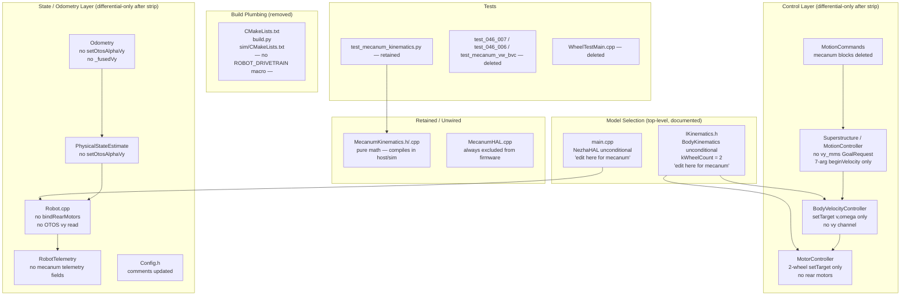
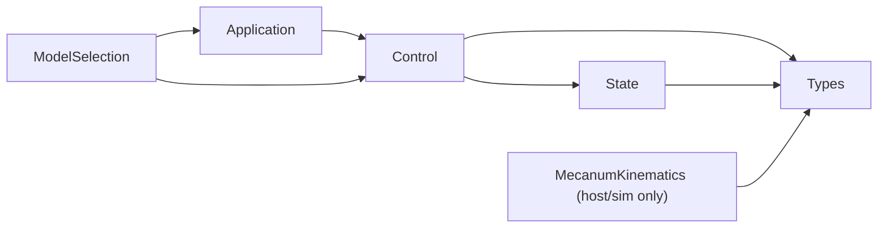

<!-- CLASI: Before changing code or making plans, review the SE process in CLAUDE.md -->

# Architecture Update — Sprint 048: Eliminate `#ifdef ROBOT_DRIVETRAIN_MECANUM` (differential-only)

## What Changed

### A. Build plumbing — macro removed entirely

**`CMakeLists.txt`** (root, ~302–329):
- Delete the `ROBOT_DRIVETRAIN` variable block and the `add_definitions(-DROBOT_DRIVETRAIN_MECANUM)` call.
- `MecanumHAL.cpp` is excluded from the firmware build unconditionally (it was only ever compiled under the mecanum flag; the exclusion is now explicit rather than conditional).
- `MecanumKinematics.cpp` continues to be compiled — it is pure math with no `#ifdef`, and stays in-tree for future mecanum re-use.

**`tests/_infra/sim/CMakeLists.txt`** (~32–43):
- Delete the mecanum macro definition and the dual-config logic that built `build_mecanum/`.
- The `build_mecanum/` output directory is removed. Only the single differential sim build remains.

**`build.py`**:
- Remove `_read_drivetrain_type()` (lines 79–103) and every `-DROBOT_DRIVETRAIN=` argument injection (lines 197–201, 229).
- Build invocations always produce the differential binary; no JSON-derived flag.

### B. Model-selection consolidation — two documented top-level points

**`source/kinematics/IKinematics.h`**:
- Collapse the `#ifdef ROBOT_DRIVETRAIN_MECANUM / #else / #endif` block to the
  unconditional differential form:
  ```cpp
  // To build for a mecanum robot, replace these two lines with:
  //   #include "MecanumKinematics.h"
  //   namespace Kinematics = MecanumKinematics;
  //   constexpr int kWheelCount = 4;
  #include "BodyKinematics.h"
  namespace Kinematics = BodyKinematics;
  constexpr int kWheelCount = 2;
  ```
- No `#ifdef` remains. All consumers (`ActualState.h`, `DesiredState.h`,
  `OutputState.h`) continue to include this header unchanged.

**`source/main.cpp`** (lines 3–7, 167–171, 179–186):
- Remove the HAL `#ifdef ROBOT_DRIVETRAIN_MECANUM` include guard; keep only
  `#include "NezhaHAL.h"`.
- HAL instantiation becomes unconditional: `static NezhaHAL hardware(...)`.
- Delete the `WHEEL_TEST_MAIN` block and `#define WHEEL_TEST_MAIN 0`.
- Add a comment on the HAL line: "To build for mecanum, replace NezhaHAL with
  MecanumHAL and update IKinematics.h."

### C. Control / superstructure strip — differential branch kept, mecanum branch deleted

**`source/control/BodyVelocityController.h` / `.cpp`**:
- Remove the `#ifdef ROBOT_DRIVETRAIN_MECANUM` include guard for `Pose2D.h`.
- Remove the `setTarget(v, omega, vy)` overload; only `setTarget(v, omega)` remains.
- Remove `currentVy()`, `targetVy()` accessors.
- Remove `_vy`, `_vyTgt`, `_vyALive`, `_geom` private members.
- In `advance()`: remove the mecanum `vy` ramp branch and the mecanum
  `DesiredState` publish form (`{_v, _vy, _omega}`); keep the unconditional
  `{_v, 0.0f, _omega}` form for `bodyTwist`.

**`source/control/MotorController.h` / `.cpp`**:
- Remove `_motorBR`, `_motorBL`, `_vcBR`, `_vcBL` rear-motor pointers and their
  associated velocity-controller state.
- Remove `bindRearMotors()`.
- Remove the 4-wheel `setTarget(vFL, vFR, vBL, vBR)` overload; keep only
  `setTarget(vL, vR)`.
- Remove `getEncoderPositions(float[4])` — keep `getEncoderPositions(float[2])`.
- Remove BR/BL encoder-state fields.

**`source/superstructure/MotionController.h`**:
- Remove the `vy_mms` field from `GoalRequest`.
- Remove the 8-argument `beginVelocity` overload; keep only the 7-argument form.

**`source/superstructure/Superstructure.h` / `.cpp`**:
- Remove any call sites for the 8-arg `beginVelocity` overload and the `vy_mms`
  path, keeping the 7-arg differential path.

**`source/commands/MotionCommands.cpp`** (~808–873, 885, 1120, 1151):
- Delete the mecanum `#ifdef` blocks at those lines wholesale.
- Keep the differential bodies at each site.

### D. State / odometry / telemetry / robot wiring strip

**`source/control/Odometry.h`** (222–228, 277–284):
- Remove `setOtosAlphaVy()`, `fusedVy()`, `_fusedVy`, `_otosAlphaVy` members.
- The `vy` field in `actual.fused.twist` continues to exist (from the Sprint 047
  `BodyTwist3` design) and is written as `0.0f` on the differential path —
  no `#ifdef` inside the struct.

**`source/state/PhysicalStateEstimate.h` / `.cpp`**:
- Remove the `setOtosAlphaVy()` forwarder declaration and implementation.

**`source/robot/Robot.cpp`** (98–103, 124–127, ~284–296):
- Remove `bindRearMotors()` call.
- Remove `setOtosAlphaVy()` initialization.
- Remove the OTOS 3-DOF `vy` read path — the 2-DOF read (vx, omega) remains.

**`source/robot/RobotTelemetry.cpp`** (53, 85, 105):
- Remove mecanum telemetry field emissions (rear-motor PWM/velocity, `vy` fusion
  telemetry field).

**`source/types/Config.h`** (~48):
- Update comments that reference the macro (e.g. "set by CMake from
  `drivetrain_type`") to reflect the differential-only reality. Leave the
  mecanum config fields (`halfTrackMm`, `halfWheelbaseMm`, `vyBodyMax`, etc.)
  in place — they are read from JSON, harmless, and useful for future mecanum.

### E. Tests cleanup

**Delete:**
- `tests/simulation/unit/test_046_007_mecanum_tlm_format.py`
- `tests/simulation/unit/test_046_006_otos_lateral_vy.py`
- `tests/simulation/unit/test_mecanum_vw_bvc.py`
- `tests/WheelTestMain.cpp`

**Retain:**
- `tests/simulation/unit/test_mecanum_kinematics.py` — exercises `MecanumKinematics`
  pure math only; no `#ifdef` dependency; continues to pass.

**Bench scripts** (`tests/bench/{wheel_test,teleop,playfield_camera_run}.py`):
- Audited: each branches on robot config (differential vs mecanum). No edits are
  expected to be needed; if any hard-require mecanum, adjust to differential only.

---

## Why

`#ifdef ROBOT_DRIVETRAIN_MECANUM` metastasized from a localized kinematics switch
(introduced in Sprint 046) to 81+ sites across ~15 files. The abstraction intended
to contain the drivetrain difference leaked into the HAL, rear-motor wiring, the
entire lateral `vy` channel, OTOS fusion, telemetry, and method arities. Every
future sprint that touches these files must navigate dual branches.

The stakeholder decision (captured in the issue
`eliminate-ifdef-robot-drivetrain-mecanum-everywhere.md`) is to compile
**differential-only now** and preserve the mecanum math classes in-tree but
unwired. Re-introducing a mecanum robot is a deliberate future edit at two
documented top-level points; git history preserves the deleted integration.

This sprint also supersedes the original 048 plan ("namespace alias → concrete
classes") which was a partial removal that retained the macro in `IKinematics.h`
and the BVC constructor.

---

## Impact on Existing Components

| Component | Impact |
|---|---|
| `CMakeLists.txt` | `ROBOT_DRIVETRAIN` block removed; `MecanumHAL.cpp` always excluded from firmware; `MecanumKinematics.cpp` still compiled |
| `tests/_infra/sim/CMakeLists.txt` | Mecanum macro def + dual-config + `build_mecanum/` removed |
| `build.py` | `_read_drivetrain_type()` removed; no `-DROBOT_DRIVETRAIN=` arg |
| `source/kinematics/IKinematics.h` | Unconditional `BodyKinematics` alias + `kWheelCount = 2`; "edit here for mecanum" comment |
| `source/main.cpp` | Unconditional `NezhaHAL`; no `#ifdef`; `WHEEL_TEST_MAIN` block deleted |
| `source/control/BodyVelocityController.{h,cpp}` | `vy` overload, accessors, members removed; `advance()` simplified |
| `source/control/MotorController.{h,cpp}` | Rear-motor pointers/methods removed; 2-wheel interface only |
| `source/superstructure/MotionController.h` | `vy_mms` field + 8-arg overload removed |
| `source/superstructure/Superstructure.{h,cpp}` | Mecanum call sites removed |
| `source/commands/MotionCommands.cpp` | Mecanum `#ifdef` blocks deleted |
| `source/control/Odometry.h` | `setOtosAlphaVy`/`fusedVy`/`_fusedVy`/`_otosAlphaVy` removed |
| `source/state/PhysicalStateEstimate.{h,cpp}` | `setOtosAlphaVy` forwarder removed |
| `source/robot/Robot.cpp` | `bindRearMotors`, `setOtosAlphaVy` init, OTOS `vy` read removed |
| `source/robot/RobotTelemetry.cpp` | Mecanum telemetry field emissions removed |
| `source/types/Config.h` | Macro-referencing comments updated; config fields left in place |
| `tests/simulation/unit/` | Three mecanum-integration tests deleted; `test_mecanum_kinematics.py` retained |
| `tests/WheelTestMain.cpp` | Deleted |
| `source/kinematics/MecanumKinematics.{h,cpp}` | Retained; untouched; compiles in host/sim |
| `source/io/real/MecanumHAL.cpp` | Retained; unwired; always excluded from firmware build |

---

## Migration Concerns

### Compilation order matters

`IKinematics.h` is included by `ActualState.h`, `DesiredState.h`, and
`OutputState.h` for `kWheelCount`. If the `#ifdef` is removed from `IKinematics.h`
before the mecanum `#ifdef` branches are stripped from `BodyVelocityController`,
`MotorController`, etc., those files will fail to compile (they reference mecanum
members that exist only under the macro).

**Chosen sequencing:** Strip source `#ifdef` branches (Tickets B, C, D) keeping
the macro defined as a CMake flag until Ticket A removes it from the build. This
ensures the tree compiles at each ticket boundary:

- **Ticket A (build plumbing):** Removes the macro from CMake. After this ticket,
  `ROBOT_DRIVETRAIN_MECANUM` is never defined — all `#ifdef` branches evaluate
  false. Code must already be clean at this point. **Therefore Ticket A is placed
  last among A–D**, after the branch-stripping tickets. The suggested A/B/C/D/E
  ordering in the issue is reordered to **B → C → D → A → E** for compile safety.
  - **Ticket B** (IKinematics.h + main.cpp): These two files have the macro only
    at the top-level selector. After stripping, `kWheelCount = 2` unconditionally.
    Consumers already used the `#else` (differential) path, so they still compile.
  - **Ticket C** (BVC + MotorController + Superstructure + MotionCommands): Strip
    mecanum branches from control layer. Build still uses the CMake macro to gate
    the mecanum blocks — but since we removed the `#ifdef` branches ourselves, the
    result is clean.
  - **Ticket D** (Odometry + PhysicalStateEstimate + Robot + Telemetry + Config):
    Strip from state/robot layer. Same rationale.
  - **Ticket A** (CMake + build.py): Now safe to remove the macro definition
    entirely — all `#ifdef` sites are already gone.
  - **Ticket E** (tests): Final cleanup and verification gate.

### `BodyTwist3.vy` is retained (not removed)

Sprint 047 introduced `BodyTwist3` with `vy` as an unconditional field; the struct
is written with `vy = 0.0f` on the differential path. This sprint does not change
`BodyTwist3`. The `vy` field in `actual.fused.twist`, `desired.bodyTwist`, etc.
remains present and zeroed on the differential build. This is intentional — it
avoids re-introducing `#ifdef` into the Sprint 047 state layer.

### `RobotConfig` mecanum fields retained

`halfTrackMm`, `halfWheelbaseMm`, `vyBodyMax`, `aMaxY`, `jMaxY`,
`fwdSign{FR,FL,BR,BL}`, `otosAlphaVy` are left in `RobotConfig`. They are read
from JSON, consume no firmware logic, and will be needed when mecanum returns.
Config cleanup is explicitly out of scope.

### MecanumKinematics host-build

`MecanumKinematics.cpp` has no `#ifdef` guards and is a pure math translation
unit. It is included in the CMake `SOURCES` list for the host/sim build. This is
confirmed to compile cleanly (validated in sprint 046 architecture review).

---

## Component Diagram



## Dependency Graph (post-sprint)



No cycles. `MecanumKinematics` depends only on `Types`; it is never pulled into
the control or application layer in the differential build.

---

## Design Rationale

### DR-048-1: Source branch stripping before build-macro removal

**Decision:** Strip all `#ifdef ROBOT_DRIVETRAIN_MECANUM` source branches in
Tickets B, C, D before removing the macro from the build in Ticket A.

**Context:** If the CMake macro is removed first, every translation unit that still
contains a mecanum `#ifdef` branch becomes an unreachable-code unit that may or may
not compile correctly (the `#ifdef` body might reference identifiers that no longer
exist once the macro is gone). Strip first → remove last guarantees each ticket
leaves the tree in a compilable state.

**Alternatives:** Remove macro first and fix compilation errors; do everything
atomically. Both require an unbounded number of compilation failures to navigate.

**Why this:** Ordered strip keeps each ticket boundary green for `pytest` and the
firmware build. The additional discipline also makes code review easier: each
ticket's diff is a clean deletion rather than a deletion + compilation fix.

**Consequences:** Tickets B–D are written against the still-present (but always-false)
macro. The compiler will warn about unreachable code in some toolchains; those
warnings disappear after Ticket A.

### DR-048-2: Retain `BodyTwist3.vy` (do not strip to 2-DOF struct)

**Decision:** Keep `vy` as a zero-initialized field in `BodyTwist3`,
`PoseEstimate`, `DesiredState`, and `OutputState` rather than removing it.

**Context:** Sprint 047 explicitly made `vy` unconditional to eliminate `#ifdef`
from the state layer (DR-3 in architecture-update-047.md). Reverting that decision
in 048 would conflict with the 047 architecture.

**Why this:** Costs 4 bytes per `PoseEstimate` on the differential build. The
alternative (removing it) would require re-introducing `#ifdef` or a separate
differential-only struct — worse than the cost.

**Consequences:** `vy = 0.0f` everywhere in the differential build. Consumers
that read `actual.fused.twist.vy` get zero — correct differential behavior.

### DR-048-3: `MecanumHAL.cpp` explicitly excluded from firmware CMakeLists

**Decision:** Add an explicit exclusion of `MecanumHAL.cpp` from the firmware
`SOURCES` list rather than relying on "it was only included under the macro."

**Why this:** Makes the in-tree retention intent unambiguous. A developer adding
source files won't accidentally include it via glob. The exclusion comment documents
the "retained but unwired" status.

**Consequences:** `MecanumHAL.cpp` remains in the sim/host build (which includes
all source files via its own CMakeLists). This is acceptable — it compiles cleanly.

---

## Open Questions

None. All design decisions are locked by the stakeholder. The elimination pattern,
retain/delete decisions, scope boundaries, and verification gate are fully specified
in `clasi/issues/eliminate-ifdef-robot-drivetrain-mecanum-everywhere.md`.
