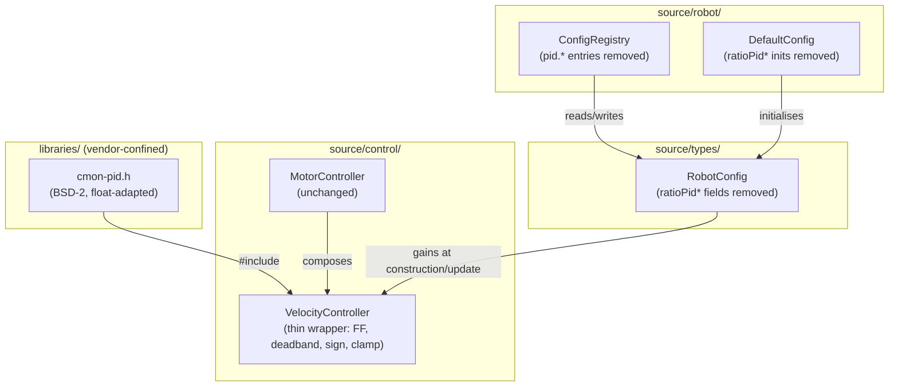
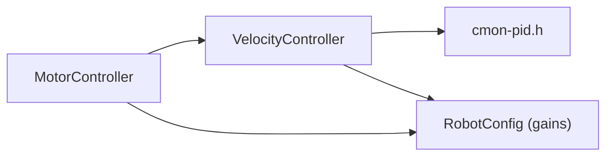

# Architecture Update — Sprint 049: Consolidate PID onto cmon-pid (Phase A)

## What Changed

### New: libraries/cmon-pid/ — vendored PID library

A new top-level directory `libraries/cmon-pid/` is introduced to hold the
vendored cmon-pid header (BSD-2-Clause). This is a float-adapted copy of the
upstream header-only C++ library (https://github.com/corraid/cmon-pid). The
only modification from upstream is a mechanical substitution of all `double`
occurrences with `float` to match the Cortex-M4F single-precision FPU
(avoiding soft-emulated double arithmetic on-device). No logic is changed.

**Boundary**: `libraries/cmon-pid/` contains exactly `cmon-pid.h` and
`LICENSE`. It has no CODAL deps, no STL, no heap, no exceptions, and no RTTI.
It is a pure math header. Nothing from `source/` bleeds into this directory.

**Use cases served**: SUC-001.

### Modified: source/control/VelocityController — compose cmon-pid core

`VelocityController` is refactored to hold a
`cmon_pid::backcalculation_t<cmon_pid::pid_bwe>` instance that owns the
integral accumulation, derivative (if any), and back-calculation anti-windup.
The thin `VelocityController` wrapper retains sole ownership of:

- Feed-forward: `kFF * |setpoint|`, signed by setpoint direction
- Deadband gate: integrator not advanced when `|setpoint| < minWheelMms`
- Output sign: `sign(setpoint)` applied to the unsigned-magnitude path
- PWM clamp: output clamped to `[-100, +100]`

The public API of `VelocityController` (constructor, `update()`, `reset()`,
and the six public fields `kFF`, `kP`, `kI`, `iMax`, `minWheelMms`, `kAw`)
is **unchanged**. `MotorController` and all callers continue to use the same
interface. Gain mapping: `velKp` -> Kp, `velKi` -> Ki, `velKaw` -> back-
calculation coefficient, `velIMax` -> integral clamp. `velKff` stays in the
wrapper and is not passed to cmon-pid.

**Use cases served**: SUC-002.

### Deleted: source/control/RatioPidController.{h,cpp}

`RatioPidController` is confirmed dead code: its `update()` method has never
been called from `MotorController::controlTick()` since sprint 013 replaced
the ratio-PID inner loop with two independent `VelocityController` instances.
Only `pid.*` config key registry entries kept it alive in name. Both files are
deleted.

**Use cases served**: SUC-003.

### Deleted: pid.* config keys from Config.h, ConfigRegistry.cpp, DefaultConfig.cpp

The four struct fields `ratioPidKp`, `ratioPidKi`, `ratioPidKd`, `ratioPidMax`
are removed from `RobotConfig`. The corresponding `kRegistry[]` entries
(`pid.kp`, `pid.ki`, `pid.kd`, `pid.max`) are removed from `ConfigRegistry.cpp`.
The initializer lines are removed from `DefaultConfig.cpp`.

The N13 note in `MotorController.h` (explaining why `pid.*` keys were retained)
is updated or removed. Test code in `test_n12_n13_get_chunking_dead_code.py`,
`test_config_set.py`, `test_config_registry.py`, and `test_protocol_v2.py` that
references `pid.*` keys for N13 retention verification is updated to remove those
assertions.

**Use cases served**: SUC-003.

### Deleted: tests/simulation/unit/test_ratio_pid.py

This file is a bench-style interactive script that connects to real hardware via
a serial port. It is not a pytest test and cannot be collected by the sim suite.
It references the dead `RatioPidController` logic (the ratio-tracking approach
it validated was replaced in sprint 013). It is deleted.

**Use cases served**: SUC-003.

### Modified: Build system — include path wiring

Both build paths gain a `libraries/cmon-pid/` include directory:

- **CODAL firmware build** (`CMakeLists.txt`): The `RECURSIVE_FIND_DIR` macro
  already scans `libraries/` for headers in CODAL dependency subdirectories that
  are added via `add_subdirectory`. For our vendored-in-place header (not a CODAL
  dependency), an explicit `include_directories(${PROJECT_SOURCE_DIR}/libraries/cmon-pid)`
  line is added for clarity and resilience.
- **Host sim build** (`tests/_infra/sim/CMakeLists.txt`): A
  `target_include_directories` entry for `${REPO_ROOT}/libraries/cmon-pid` is
  added to the `firmware_host` target.

**Use cases served**: SUC-001.

## Why

cmon-pid replaces ~25 lines of hand-rolled PI arithmetic in `VelocityController`
with a vetted, documented, header-only implementation. The primary benefit is
reducing the maintenance burden of owning integrator/anti-windup math. The
secondary benefit is establishing the `libraries/` vendoring pattern and dual-
build include wiring that Sprint 050 (TinyEKF) will reuse.

Deleting `RatioPidController` and its config keys eliminates dead code that was
kept only for host-side test compatibility (N13 note). Removing it reduces
confusion for future maintainers and shrinks the GET key dump.

## Impact on Existing Components

| Component | Impact |
|---|---|
| `VelocityController.{h,cpp}` | Internal implementation changed; public API unchanged |
| `MotorController` | No change; calls `VelocityController::update()` as before |
| `RobotConfig` | Four `ratioPid*` fields removed; struct shrinks by 16 bytes |
| `ConfigRegistry.cpp` | Four `pid.*` entries removed; key count drops by 4 |
| `DefaultConfig.cpp` | Four `ratioPid*` initializer lines removed |
| `test_config_registry.py` | Update: remove `pid.*` key assertions |
| `test_config_set.py` | Update: remove N13 `pid.*` SET/GET assertions |
| `test_n12_n13_get_chunking_dead_code.py` | Update: remove N13 `pid.*` presence assertions |
| `test_protocol_v2.py` | Check and update: remove any `pid.*` key references |
| `test_imports_smoke.py` | Check: may reference dead-code N13 keys |
| `test_ratio_pid.py` | Deleted |
| `test_velocity_controller.py` | Must pass green (no change expected) |
| `test_motor_controller.py` | Must pass green (no change expected) |
| `test_body_velocity_controller.py` | Must pass green (no change expected) |
| `test_vendor_confinement.py` | Must pass: `libraries/cmon-pid/` is outside scanned dirs |

## Component / Module Diagram

## Dependency Graph

No cycles. Dependency direction: application layer (MotorController) ->
domain logic (VelocityController) -> vendored math (cmon-pid.h). Vendored
code has no outward dependencies. Fan-out is 2 from VC; well within the 4-5
limit.

## Migration Concerns

### RobotConfig struct size change

Removing four `float` fields shrinks `RobotConfig` by 16 bytes. The struct is
used by value (copies, not pointers across a wire), so no binary compatibility
concern exists for firmware. The host sim builds fresh from source. The robot
JSON config files do not embed `RobotConfig` directly — they drive
`DefaultConfig.cpp` via code generation. No migration is needed.

### Test N13 reference cleanup

Several test files contain assertions that verify `pid.*` keys are accepted by
`SET`/`GET` (the N13 dead-code retention note). These assertions will break once
the keys are removed. Each affected file must be updated in the same ticket that
removes the registry entries — leaving the tree green is a hard exit condition
for that ticket.

The known pre-existing baseline failures (2 failures in
`test_default_config_pin.py` and `test_robot_config.py`) are config-schema drift
unrelated to this sprint. They must NOT be fixed here. After this sprint the
expected failure count remains exactly 2.

### vendor_baseline.txt

The confinement test scans only `source/` subdirectories (commands, control,
robot, state, subsystems, superstructure, types) for CODAL-specific tokens.
`libraries/cmon-pid/` is completely outside the scanned scope. The baseline file
is currently empty (sealed in sprint 044) and must remain empty after this sprint.
No update to `vendor_baseline.txt` is needed.

## Design Rationale

### Decision: Float-adapt the vendored header rather than keeping upstream double

**Context**: cmon-pid hard-codes `double` throughout. On the Cortex-M4F the FPU
handles only single-precision; `double` arithmetic is soft-emulated and roughly
4-10x slower than `float` at comparable operations. The velocity controller runs
at ~100 Hz so the cost matters.

**Alternatives considered**:
1. Keep upstream `double` — simpler vendoring (less divergence), but pays the
   soft-emulation cost on every control tick.
2. Wrap with a float-to-double-to-float conversion adapter — adds overhead and
   complexity with no benefit.
3. Mechanically substitute `double` -> `float` in the vendored copy (chosen).

**Why this choice**: The substitution is a one-time cost with no ongoing
maintenance burden. The upstream source is ~9 KB header-only; the diff is a
single-type rename with no logic change. If a future bench A/B shows the
double-vs-float loop cost is negligible, the unmodified upstream header can be
swapped back with minimal risk.

**Consequences**: Our vendored copy diverges from upstream by exactly one type
name. Any future upstream patch must be reviewed for `double` -> `float`
carry-over. This is documented in the vendored header's preamble comment.

### Decision: Keep the VelocityController public API unchanged

**Context**: `MotorController` constructs and calls `VelocityController`; the
six public gain fields are updated at runtime by `updateVelGains`. Changing the
API would require updating `MotorController` and all sim tests.

**Why**: Minimising the blast radius of this sprint. The internal-only refactor
is sufficient to achieve the goal; the public surface gives no information about
the internal implementation.

**Consequences**: `VelocityController` retains its six public fields even though
cmon-pid owns the state internally. These fields serve as the config-to-controller
bridge. The wrapper re-configures the cmon-pid instance when `updateVelGains` is
called.

### Decision: Delete pid.* keys outright rather than keeping as no-ops

**Context**: The N13 note retained `pid.*` keys for "host compatibility". No
active host tooling requires them — the note was conservative and the issue doc
explicitly calls for deletion.

**Why**: Dead config keys create confusion and inflate the GET dump. Removing
them is clean. An `ERR badkey` response is immediately diagnosable if any tool
unexpectedly uses them.

**Consequences**: Any robot JSON config file that contains `pid.*` SET calls
(none are known) would get `ERR badkey` after flashing. This is acceptable per
the issue decision.

## Open Questions

None. All scope decisions were made in the issue planning phase. This sprint is
Phase A only; no EKF/TinyEKF work is in scope.
