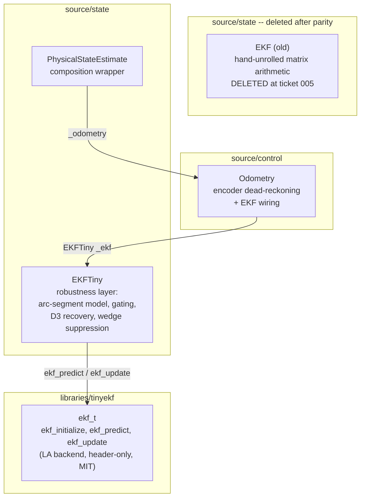
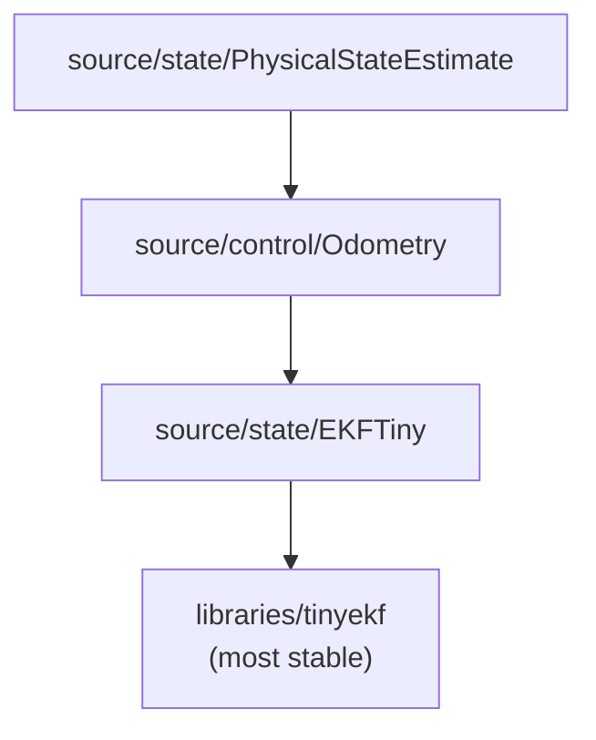

# Architecture Update -- Sprint 050: Replace EKF with TinyEKF (Phase B, parity-gated)

## What Changed

Sprint 050 replaces the hand-unrolled matrix arithmetic inside `source/state/EKF.{h,cpp}`
with a thin C++ layer (`EKFTiny`) that delegates all linear-algebra operations to
`ekf_t` from TinyEKF (MIT, header-only, commit `ba0d2a90e22f2f4e4120a91cb05ca2ca6a8e8da3`).
The switch is parity-gated: the TinyEKF-backed class must pass the existing
`tests/simulation/unit/test_ekf.py` oracle before production call-sites are moved
and the old hand-unrolled code is deleted.

### Sprint Changes Summary

| Change | Where |
|--------|-------|
| Add `libraries/tinyekf/tinyekf.h` (+ LICENSE) with provenance preamble | `libraries/tinyekf/` |
| Wire `libraries/tinyekf` include into firmware CMakeLists | Root `CMakeLists.txt` |
| Wire `libraries/tinyekf` include into sim CMakeLists | `tests/_infra/sim/CMakeLists.txt` |
| Add `EKFTiny.{h,cpp}` — thin layer over `ekf_t` keeping all robustness layers | `source/state/` |
| Swap `Odometry._ekf` from `EKF` to `EKFTiny` after parity passes | `source/control/Odometry.h` |
| Delete `source/state/EKF.h` and `source/state/EKF.cpp` | `source/state/` |

## Why

The existing `EKF.cpp` implements all matrix operations (5x5 P covariance update,
5x2 Kalman gain, 2x2 S inversion) as fully hand-unrolled float arithmetic — roughly
500 lines that are hard to audit against the mathematical spec and are a maintenance
burden for future state-vector changes. TinyEKF provides the same operations
generically via compile-time-dimensioned matrices, while remaining heap-free,
STL-free, and float-default. The robustness layers (Mahalanobis gating, D3 gate
recovery, wedge suppression, arc-segment motion model) are not in TinyEKF and must
be preserved in the wrapper layer.

Phase A (Sprint 049) established the `libraries/` vendoring infrastructure and dual-build
CMake wiring pattern with `cmon-pid`. Sprint 050 reuses that exact pattern.

## Impact on Existing Components

### `source/state/EKF.{h,cpp}` (replaced, then deleted)

Replaced by `EKFTiny` with an identical public API:

- `init()`, `setPose()`, `predict()`, `updatePosition()`, `updateVelocity()`, `updateHeading()`
- `x()`, `y()`, `theta()`, `v()`, `omega()`
- `rejectedCount()`, `getRejectCount()`, `rejHeadStreak()`, `rejPosStreak()`, `pDiag()`

No callers need API changes. `Odometry.h` changes only the declared type of `_ekf`
and the `#include` directive; no method bodies in `Odometry.cpp` require edits.

### `source/control/Odometry.{h,cpp}`

Minimal changes at the swap ticket only:
- `Odometry.h`: `EKF _ekf` becomes `EKFTiny _ekf`; `#include "state/EKF.h"` becomes `#include "state/EKFTiny.h"`.
- `Odometry.cpp`: no changes (all EKF call sites use the same method names).

### `source/state/PhysicalStateEstimate.{h,cpp}`

No changes. `PhysicalStateEstimate` delegates entirely to `Odometry` and does not
reference the EKF class directly.

### Build system (both paths)

**Root `CMakeLists.txt`**: add one `include_directories(${PROJECT_SOURCE_DIR}/libraries/tinyekf)`
line following the cmon-pid entry at line 213. No other changes.

**`tests/_infra/sim/CMakeLists.txt`**: add `"${REPO_ROOT}/libraries/tinyekf"` to
`target_include_directories(firmware_host PRIVATE ...)` following the cmon-pid entry
at line 131. No other changes.

Both changes are additive. `EKFTiny.cpp` is picked up automatically by the existing
`file(GLOB STATE_SOURCES ...)` in the sim CMakeLists (line 51) and by CODAL's
`RECURSIVE_FIND_FILE` in the firmware build.

### `tests/simulation/unit/test_ekf.py` (parity oracle — unchanged)

The Python EKF mirror already exercises all five state channels, all three update
channels, Mahalanobis gating, D3 recovery, and the `setPose` P-prior. It is the
parity gate: `EKFTiny` must produce numerically identical results (within float
tolerance) against this oracle. The test file itself is not modified.

## Module Diagram

### Parity-Gated Ticket Sequence

### Dependency Graph

No cycles. Dependency direction is stable toward unstable:
`libraries/tinyekf` (most stable) <- `EKFTiny` <- `Odometry` <- `PhysicalStateEstimate`.

## Design Rationale

### Decision: thin-wrapper rather than direct substitution into Odometry

**Context**: TinyEKF's `ekf_update` applies the full EKF correction step
(gain computation + state update + covariance update) but does not gate. All
gating, D3 recovery, and wedge suppression logic in the current code must be
preserved.

**Decision**: Introduce `EKFTiny` as a drop-in API replacement for `EKF` that
owns the robustness policy and delegates only the LA operations to `ekf_t`.
This isolates the TinyEKF dependency to one file and keeps Odometry, the caller,
unchanged apart from the type swap.

**Consequence**: Public API of `EKFTiny` is identical to `EKF`. Test oracle
(`test_ekf.py`) is the arbiter of correctness.

### Decision: Mahalanobis gating computed in EKFTiny, not delegated to ekf_update

**Context**: TinyEKF's `ekf_update` does not support pre-update gating. The
current EKF computes `y = z - hx` and `S = H P Hᵀ + R` before deciding whether
to apply the update.

**Decision**: `EKFTiny` computes S and the Mahalanobis distance itself (using
TinyEKF's internal `_mulmat`/`_addmat` helpers, which are accessible because
tinyekf.h is included in `EKFTiny.cpp`), applies the gate, and only calls
`ekf_update` on acceptance. D3 P-inflation writes directly to `ekf.P[]`, which
is a public field of `ekf_t`.

**Consequence**: `EKF_N=5` and `EKF_M=2` must be `#define`d before each
`#include <tinyekf.h>`. EKF_M=2 is the widest channel (position update);
scalar channels (heading M=1, velocity M=1) call `ekf_update` with 1-element
H and R arrays. The Cholesky-based `invert()` in tinyekf.h uses `EKF_M` for its
stack allocation — at EKF_M=2 it allocates `_float_t tmp[2]` on the stack, which
is correct for the position channel. For scalar channels the H/R arrays are
1-element but EKF_M=2, so either the scalar channels bypass `ekf_update` and
apply the 1-DOF gain manually (as the current code does), or they pass zero-padded
2-element arrays. The simpler path is to apply scalar updates manually (same code
path as the current implementation, retaining exact numerical match with the oracle).

### Decision: EKF_M=2 global constant, scalar channels applied manually

**Context**: tinyekf.h has a single global `EKF_M` used for the `invert()` stack
array. Three channels have different observation dimensions.

**Decision**: Define `EKF_M=2` (the widest channel). For scalar channels (M=1),
compute the Kalman gain and state update manually using the scalar formulae already
in the current code — these are only 5 multiplies each and are not the maintenance
burden being removed. Only the 5x5 and 5x2 matrix operations (predict's `F*P*Fᵀ`
and position update's `P*Hᵀ*S⁻¹`) are delegated to TinyEKF.

**Alternative**: Two ekf_t instances at EKF_M=1 and EKF_M=2. Rejected: requires two
compilation units with different defines, complicates the architecture, and gains
nothing since scalar channel arithmetic is trivial.

**Consequence**: For `ekf_predict`, the wrapper passes the full 5-element `fx` and
5x5 `F` and `Q` arrays to `ekf_predict`. For `updatePosition`, the wrapper passes
the 2-element `z`, `hx`, 2x5 `H`, and 2x2 `R` to `ekf_update`. Scalar channels use
manual K computation. This is the cleanest path to numerical parity.

### Decision: parity gate as a hard ticket dependency

**Context**: EKF numerical behaviour is safety-critical for navigation. A silent
regression would appear as pose drift only under certain sensor conditions.

**Decision**: The ticket that swaps Odometry and deletes `EKF.{h,cpp}` carries a
hard `depends-on` on the parity ticket. A programmer cannot execute the swap until
the parity ticket is accepted.

**Alternative**: Combine into one ticket. Rejected: combining makes the parity
verification harder to isolate and obscures the acceptance criterion.

**Consequence**: Both `EKF.{h,cpp}` and `EKFTiny.{h,cpp}` coexist in `source/state/`
during tickets 003 and 004. This is intentional and temporary.

## Open Questions

One known risk: if TinyEKF's Cholesky-based `invert()` for the 2x2 position
innovation covariance S produces a slightly different result from the current analytic
inverse (current code uses the exact formula `det = s00*s11 - s01*s10`), `test_ekf.py`
will catch it. If this occurs, the resolution is to keep the analytic 2x2 inverse in
`EKFTiny::updatePosition()` and use `ekf_update` only for the state and P update
steps (the gain is then computed with the analytic inverse rather than through
`ekf_update`'s Cholesky path). This does not affect the architecture; it is an
implementation detail to resolve in ticket 003.

## Migration Concerns

- **Sprint 048 dependency**: Sprint 048 eliminates `vy` from `PhysicalStateEstimate`
  and `Odometry`. Sprint 050 touches `Odometry.h`; the sprint ordering (048 -> 049 -> 050)
  is the mitigation. Sprint 050 must not execute before 048 is merged to master.
- **No data migration**: EKF state is volatile (computed from sensor stream). No
  stored state requires migration.
- **Build flag compatibility**: TinyEKF uses only `<math.h>`, `<string.h>`, `<stdbool.h>`.
  It is compatible with `-fno-exceptions -fno-rtti` and requires no additional compiler flags.

## Hard Constraints

These must be satisfied throughout the sprint and are verified in the final validation ticket:

1. **No heap**: `ekf_t` is a plain C struct; all arrays are fixed-size by EKF_N/EKF_M compile-time constants. `EKFTiny` must allocate nothing dynamically.
2. **No STL**: tinyekf.h and EKFTiny.{h,cpp} must not include `<vector>`, `<string>`, or any STL header.
3. **No exceptions / RTTI**: compatible with `-fno-exceptions -fno-rtti`; tinyekf.h uses neither.
4. **Float only**: `_float_t` must not be redefined to `double`; single-precision only for the Cortex-M4F FPU.
5. **Dual-build**: `EKFTiny.cpp` is globbed by `STATE_SOURCES` in the sim CMakeLists and by RECURSIVE_FIND_FILE in the firmware build. No explicit file registration needed.
6. **Vendor-confined**: `EKFTiny.{h,cpp}` must not include CODAL headers. `test_vendor_confinement.py` must stay green.
7. **Parity before swap**: ticket 005 (swap + delete) carries `depends-on: [050-004]`.
