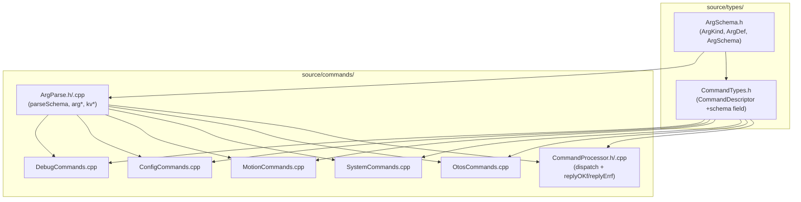

<!-- CLASI: Before changing code or making plans, review the SE process in CLAUDE.md -->

# Architecture Update -- Sprint 051: Declarative argument-schema layer for source/commands

## What Changed

### New: `source/types/ArgSchema.h`

Declares three new plain-data types:

```
ArgKind  { INT, FLOAT, STR }
ArgDef   { name, kind, ranged, lo, hi }
ArgSchema{ defs, ndefs, minTokens, variadic, packKv }
```

`ArgDef.ranged` is the opt-in range gate for INT args: when `false`, the value
is accepted as-is (preserving the existing `atoi` truncation for `OV`/`SI`).
`packKv` is a nullable key name; when set, `parseSchema` appends the value of
that KV pair as a trailing STR arg (reproduces `packSensorArg` for T/D/TURN).

### New: `source/commands/ArgParse.h` + `ArgParse.cpp`

Provides:

- `parseSchema(tokens, ntokens, kvs, nkv, schema)` — the single generic parser
  implementing all three common shapes (no-arg, positional, variadic).
- Inline helpers for custom parsers and handlers:
  - `argStr(Argument&, src)` — bounded `sval[32]` copy; the one true copy routine.
  - `argInt(Argument&, v)`, `argFloat(Argument&, v)` — typed arg setters.
  - `kvFind(kvs, nkv, key)` — returns pointer to matching KVPair or nullptr.
  - `kvInt(kvs, nkv, key, def)`, `kvFloat(kvs, nkv, key, def)` — typed KV lookups.
  - `kvHas(kvs, nkv, key)` — presence check.

### Modified: `source/types/CommandTypes.h`

- Adds `#include "ArgSchema.h"`.
- Adds one field `const ArgSchema* schema` to `CommandDescriptor` (default `nullptr`).
  Aggregate size increases by one pointer; the existing `makeCmd` factory is unchanged
  and zero-initialises the new field.
- Adds `makeSchemaCmd(prefix, schema, handlerFn, ctx, errFmt, forceReply, flags)`
  inline factory for schema-driven commands.

### Modified: `source/commands/CommandProcessor.cpp` (dispatch)

In `dispatchTable()`, the `parseFn` dispatch block gains a prior branch:

```
if (desc.schema != nullptr)
    result = parseSchema(argTokens, argNtok, kvs, nkv, *desc.schema);
else if (desc.parseFn != nullptr)
    result = desc.parseFn(argTokens, argNtok, kvs, nkv);
// else: empty ArgList (no-arg path; unchanged)
```

No change to `ParseFn`, `ArgList`, `ParsedCommand`, or the queue path.

### Modified: `source/commands/CommandProcessor.h` + `.cpp` (reply helpers)

Adds variadic `replyOKf` and `replyErrf` static methods:

```cpp
static void replyOKf(char* buf, int size, const char* verb,
                     const char* id, ReplyFn fn, void* ctx,
                     const char* fmt, ...);
static void replyErrf(char* buf, int size, const char* code,
                      const char* id, ReplyFn fn, void* ctx,
                      const char* fmt, ...);
```

These collapse the ubiquitous `char body[N]; snprintf(body,…); replyOK(…, body)` triple
into a single call. Applied opportunistically during migration, not exhaustively.

### Modified: `source/commands/OtosCommands.cpp`

- No-arg commands (OI, OZ, OR, OP): `parseFn` set to `nullptr`.
- OV: `makeSchemaCmd` with schema `{ndefs=3, minTokens=3, ranged=false}` (no range
  check on any field; `int16_t` cast preserved in handler).
- OL, OA: `makeSchemaCmd` with `{ndefs=1, minTokens=0}` (optional int arg).
- Factor repeated `nodev` guard into one inline `otosReady(ctx, verb, rbuf, corrId,
  replyFn, replyCtx)` returning `bool`. Each of the 6 hardware handlers becomes
  `if (!otosReady(...)) return;`.

### Modified: `source/commands/SystemCommands.cpp`

- No-arg stubs (HELLO, PING, ID, VER, HELP, SNAP, +/keepalive): `parseFn = nullptr`.
- ECHO, STREAM, SAFE: `makeSchemaCmd` with `variadic=true` schemas.
- ZERO: retains custom `parseFn` (multi-keyword validation); body rewritten with
  `argStr` helpers.
- HALT, BAUD: retain custom `parseFn` (sub-verb dispatch, complex multi-arity).
- SI: `makeSchemaCmd` with `{ndefs=3, minTokens=3, ranged=false}` (silent int truncation;
  no range check on `h_cdeg` or `x_mm`/`y_mm`).
- RF: `makeSchemaCmd` with `{ndefs=1, minTokens=0}` (optional int; no range check in
  schema — handler validates against radio channel bounds and replies `ERR range chan`).

### Modified: `source/commands/MotionCommands.cpp`

- S: `makeSchemaCmd` with `{ndefs=2, minTokens=2, ranged=true, lo=-1000, hi=1000}`.
  Names "l" and "r" match the existing ERR detail strings.
- T, D: `makeSchemaCmd` with positional schema + `packKv="sensor"`. Third arg ranges
  ([1,30000] for ms; [1,10000] for mm). The `sensor=` kv is appended as args[3].
- G: `makeSchemaCmd` with `{ndefs=3, minTokens=3}` and appropriate ranges.
- R: `makeSchemaCmd` with `{ndefs=2, minTokens=2}` and appropriate ranges.
- TURN: `makeSchemaCmd` with `{ndefs=1, minTokens=1, packKv="sensor"}` plus `eps=`
  handled in the handler (kept in custom parseFn since eps is a KV, not positional —
  see Design Rationale).
- RT: `makeSchemaCmd` with `{ndefs=1, minTokens=1, ranged=true, lo=-180000, hi=180000}`.
- X: `makeSchemaCmd` with `variadic=true` (optional "soft" token).
- STOP: `parseFn = nullptr`.
- VW, _VW: retain custom `parseFn` (multi-arity range check).
- `setIntArg` replaced by `argInt` from ArgParse; `packSensorArg`, `vwScanKV`,
  `vwHasKey` replaced by `kvFind/kvInt/kvHas`.

### Modified: `source/commands/ConfigCommands.cpp`

- GET VEL: `parseFn = nullptr` (no args; handler reads cached state).
- GET: `makeSchemaCmd` with `variadic=true` (tokens become STR key names).
- SET: retains custom `parseFn` (KV-to-"k=v" encoding); body rewritten with helpers.

### Modified: `source/commands/DebugCommands.cpp`

- DBG LOOP RESET, DBG OTOS (no-arg): `parseFn = nullptr`.
- DBG LOOP, DBG I2CLOG, DBG I2C: `makeSchemaCmd` with `variadic=true`.
- DBG IRQGUARD: `makeSchemaCmd` with `{ndefs=1, minTokens=0}` optional INT.
- DBG WEDGE: retains custom `parseFn` (up to 7 optional INT args; variadic INT not
  directly supported in schema).
- DBG OTOS BENCH: retains custom `parseFn` (mixed INT + FLOAT KV args).
- DBG EST: `parseFn = nullptr`.
- I2CW, I2CR: retain custom `parseFn` (hex-token validation, count range check).
- Inline kv loops in handler bodies replaced by `kvFind/kvInt`.

### Modified: `tests/_infra/sim/CMakeLists.txt` (if needed)

Adds `ArgParse.cpp` to the sim build target if the generic parser TU is not
already pulled in transitively.

---

## Why

~48 bespoke parse functions across five files implement the same four shapes. The
duplication raises maintenance cost and drift risk — any new command must
hand-implement one of the shapes correctly. Local one-off helpers (`setIntArg`,
`packSensorArg`, `vwScanKV`) proved the pattern wants factoring, but the
refactor has not been done framework-wide. This sprint eliminates the redundancy
while the framework dispatch model is otherwise stable.

---

## Impact on Existing Components

- `CommandDescriptor` grows by one pointer field (8 bytes on 64-bit host, 4 on
  Cortex-M0+). The static command table is BSS; no heap impact. `makeCmd` zero-
  initialises the new field via default parameter.
- All existing `parseFn`-based commands continue to compile and execute unchanged;
  the schema branch is checked first but falls through to the existing `parseFn`
  path whenever `schema == nullptr`.
- `ArgParse.cpp` is a new translation unit; must be added to both firmware and sim
  build targets.
- No change to wire protocol, reply formats, or host-side Python libraries.

---

## Module Dependency Graph



---

## Migration Concerns

**Behaviour preservation is the primary constraint.** The Python sim suites assert
exact `OK`/`ERR` reply strings. Every schema declaration must reproduce the old
parse function's output byte-for-byte.

Key traps (encoded in each migration ticket):

| Trap | Rule |
|------|------|
| OV and SI have no range check | `ranged=false` on all fields; int16 cast preserved in handler |
| S, T, D, G, R, TURN, RT have exact [lo,hi]+detail | `ranged=true` with matching lo/hi; `name` matches the existing detail string |
| variadic path must init ival=0, fval=0 | `parseSchema` variadic branch zeroes both before copying sval |
| MAX_ARGS cap | `parseSchema` clamps to MAX_ARGS exactly as old parsers do |
| packKv must match packSensorArg byte-for-byte | key `"sensor"`, trailing STR position; same bounded copy |
| minTokens reproduces badarg guards | set to match the old `ntokens < N` guard in each parser |

**No migration alters any handler logic** — only the parse-layer registration changes.

**Incremental deployment:** each command file is an independent ticket. After
ticket 003 (framework wiring), the schema dispatch branch is live but no command
uses it yet. Tickets 004–008 migrate one file each. The tree is compilable and
tests pass after every ticket.

---

## Design Rationale

### Decision: ArgSchema in `source/types/`, not `source/commands/`

Context: `CommandDescriptor` (in `CommandTypes.h`) needs to hold a `const ArgSchema*`
pointer. `CommandTypes.h` is included by every command file. If `ArgSchema` were in
`source/commands/`, the include would create a circular dependency
(`commands/ -> types/ -> commands/`).

Alternatives considered: putting `ArgSchema` inline in `CommandTypes.h` (monolithic
header growth), or making `ArgSchema` opaque (adds complexity).

Why this choice: placing a pure-data header in `types/` matches the existing pattern
(`CommandTypes.h`, `Protocol.h` are already there). Zero coupling change.

Consequences: `ArgParse.h` and `ArgParse.cpp` in `commands/` include `ArgSchema.h`
from `types/` (correct direction).

### Decision: Schema branch checked BEFORE parseFn branch

Context: A command can have either `schema` or `parseFn` set, not both. Checking
schema first means new commands never accidentally fall through to an old parseFn
left as a stale non-null pointer.

Alternatives: separate boolean flag, or union of schema/parseFn pointers.

Why this choice: lowest risk — additive, no structural change. `makeSchemaCmd` always
sets `parseFn = nullptr`; `makeCmd` always sets `schema = nullptr`. Both remain valid.

Consequences: one extra null-pointer check per dispatch. Negligible on any platform.

### Decision: TURN retains custom parseFn despite partial ArgSchema fit

Context: TURN accepts one positional INT (heading_cdeg) and one optional KV (eps=<cdeg>
with a range check [10, 1800]) plus an optional `sensor=` KV. The `eps` KV has its own
range check and a default, making it materially different from the `packKv` mechanism
(which only copies a KV value as a trailing STR).

Alternatives: extend `ArgSchema` to support optional-KV-with-range; use variadic and
parse eps in the handler.

Why this choice: the schema design is intentionally minimal — TURN is one of only
a few commands with this exact shape. Extending `ArgSchema` for one command creates
speculative generality. The custom parseFn is small and already well-tested; keeping
it avoids adding `ArgSchema` complexity for marginal benefit.

Consequences: parseTURN remains; it is rewritten to use `argInt` and `kvInt` helpers
for consistency, eliminating its inline loops.

### Decision: `replyOKf/replyErrf` applied opportunistically, not exhaustively

Context: The ubiquitous `char body[N]; snprintf(body,…); replyOK(…, body)` triple
appears ~30 times across the handler layer. Replacing all instances in one sprint
alongside the parse-layer migration risks mixing two refactors, making review harder.

Why this choice: opportunistic adoption (during migration of each file) gives immediate
coverage of the new API without creating a separate, cross-cutting ticket.

Consequences: some handlers still use the three-line triple after the sprint; future
cleanup is low-risk since `replyOK/replyErr` remain valid.

---

## Open Questions

1. **DBG WEDGE variadic-INT shape**: the schema currently supports `variadic` as
   tokens-as-STR. DBG WEDGE takes up to 7 optional INT positional args. The custom
   parseFn handles this cleanly today. If a second command needs this shape, extend
   `ArgSchema` with an `optionalInts` flag. No action needed this sprint.

2. **sim CMakeLists.txt**: confirm whether `ArgParse.cpp` must be explicitly added
   or whether it is pulled in transitively by an existing glob/wildcard rule. The
   programmer should check before creating the TU.
