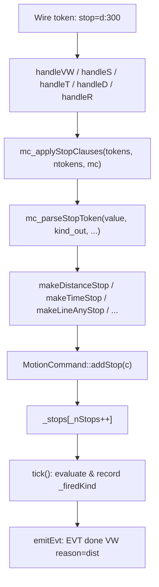
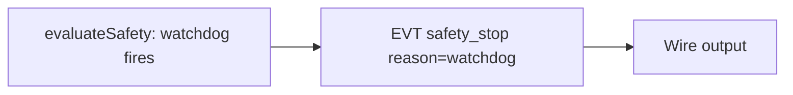
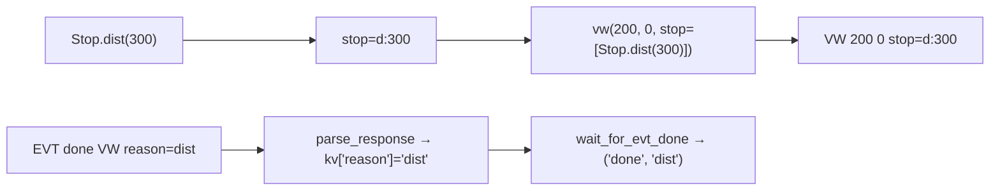
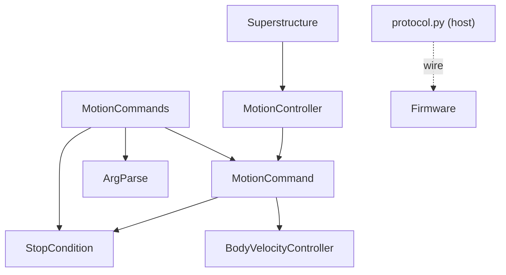

<!-- CLASI: Before changing code or making plans, review the SE process in CLAUDE.md -->

# Architecture Update — Sprint 052: Stop Conditions First-Class (Phase 1)

## What Changed

Sprint 052 extends four components additively:

1. **MotionCommands (source/commands/MotionCommands.cpp)** — Adds a unified
   `mc_parseStopToken` helper and a `mc_applyStopClauses` loop helper that
   calls `mc.addStop(...)` for each `stop=` clause found in the raw token
   list. The existing `mc_parseSensorToken` and all `sensor=` forwarding code
   is preserved as a back-compat alias.

2. **MotionCommand (source/commands/MotionCommand.h/.cpp)** — Adds two new
   private fields (`_firedKind`, `_firedChannel`), reset in `configure()` and
   set in `tick()` when a stop condition fires. Extends `emitEvt` to append
   `reason=<token>` after the existing base string. Buffer grows from 48 to
   80 bytes.

3. **Superstructure (source/superstructure/Superstructure.cpp)** — Adds
   `reason=watchdog` to the `EVT safety_stop` emit in `evaluateSafety`.

4. **NezhaProtocol (host/robot_radio/robot/protocol.py)** — Adds a `Stop`
   builder class with class methods for all 7 stop kinds. Extends `vw()`,
   `drive()`, `arc()`, `timed()`, `distance()`, and `turn()` with an optional
   `stop: list[str] | None = None` parameter. Updates `wait_for_evt_done` to
   return `tuple[str, str | None]` (outcome, reason).

No module is removed. No routing logic changes. No Goal variants change.

## Why

The `StopCondition` abstraction (9 kinds, OR-combined, factory helpers) and
`MotionCommand.addStop()` already exist. The wire interface exposes them only
partially: `sensor=` works on T, D, and TURN; VW, S, and R have no stop-clause
grammar; no completion reason is reported back. Phase 1 makes these uniformly
accessible without touching the internal Goal/routing architecture (Phase 2
scope in sprint 053).

SUC-001, SUC-002, SUC-003, SUC-004 are fully covered by these changes.

## Impact on Existing Components

| Component | Change | Backward Compatible |
|---|---|---|
| `MotionCommands.cpp` | New `mc_parseStopToken` and `mc_applyStopClauses` static helpers; `stop=` loop in handleVW, handleS, handleT, handleD, handleR; `sensor=` forwarding unchanged | Yes |
| `MotionCommand.h` | Two new private fields; no public API change except `emitEvt` output | Yes |
| `MotionCommand.cpp` | `emitEvt` buffer 48→80 bytes; `reason=` appended; `_firedKind/_firedChannel` set in tick | Yes — trailing additive token |
| `Superstructure.cpp` | `reason=watchdog` in one EVT string | Yes — trailing additive token |
| `protocol.py` | `Stop` class added; `stop` param added to 6 methods; `wait_for_evt_done` return type changes | Breaking for single-value unpack — all call sites in-repo must be updated |
| `StopCondition.h` | No change | Yes |
| `ArgParse.h` | No change | Yes |
| Golden-TLM canary | Unaffected — captures TLM lines only, not EVT lines | Yes |
| `test_motion_command.py` | New test cases for stop= kinds and reason= tokens; existing tests add `reason=` to expected EVT strings | Must update expected strings |
| `test_protocol_v2.py` | New tests for Stop builder; `wait_for_evt_done` unpack updated | Must update call sites |

## Migration Concerns

### 1. Python wait_for_evt_done return type

`wait_for_evt_done` currently returns `str`. Sprint 052 changes it to
`tuple[str, str | None]` — the second element is the reason token or `None`
when absent (e.g. if connected to older firmware).

All call sites within the repository must be updated in ticket 003. The
programmer must audit `tests/simulation/`, `tests/bench/`, and any scripts
in `tests/` that call `wait_for_evt_done`. The issue notes this is an
in-repo-only change; no external callers are known.

### 2. Firmware EVT lines gain trailing reason= token

All `EVT done …` lines now carry `reason=<token>`. Existing host code that
matches by `r.tokens[0] == "done"` or by prefix continues to work. Simulation
test assertions that use exact EVT string equality (e.g.
`assert "EVT done T" == some_line`) will fail if the line now reads
`"EVT done T reason=time"`. The programmer must audit and update these in
ticket 002.

### 3. emitEvt buffer size

The 48-byte buffer is stack-local in `emitEvt`. Growing it to 80 bytes is safe
on ARM Cortex-M4 (Micro:bit v2). No heap involved.

## Diagrams

### stop= parse and dispatch (firmware)

### Watchdog reason path

### Host Stop builder

### Dependency graph (unchanged by this sprint)

No new edges are introduced. The `Stop` class in `protocol.py` is a plain
data builder with no firmware dependency.

## Design Rationale

### mc_parseStopToken: generalize rather than duplicate

The existing `mc_parseSensorToken` already handles `<ch>:<op>:<thr>` parsing.
Seven stop kinds need to be dispatched from `stop=<kind>:<rest>` tokens.
A single `mc_parseStopToken` that dispatches on the kind prefix and delegates
to the existing channel-lookup logic for SENSOR is the minimal extension.
Per-kind parsers would multiply boilerplate; adding new ArgSchema variant
complexity would contaminate the post-051 schema migration.

### mc_applyStopClauses: DRY across five handlers

Without a shared helper, the `stop=` iteration loop would appear in handleVW,
handleS, handleT, handleD, and handleR identically. A `static void
mc_applyStopClauses(const char* const* tokens, int ntokens, MotionCommand& mc)`
helper (or equivalent over the raw token list available in each call site)
removes that duplication. Its implementation is one `for` loop and a
`mc_parseStopToken` call.

### ArgSchema.packKv not used for stop=

`packKv` supports one key/value pair per command. `stop=` is repeatable up to
kMaxStopConds = 4 times. Using packKv would silently drop all but the first
clause. Iterating the raw token array is explicit and correct.

### emitEvt buffer 80 bytes

Longest anticipated EVT: `EVT done TURN #abc123456789012 reason=colorC\0` is
approximately 50 chars. 80 bytes gives 30 chars of headroom; ARM stack cost
is 32 additional bytes per call invocation, acceptable on Cortex-M4.

### wait_for_evt_done: tuple return vs. keyword flag

A `return_reason=False` compat flag would preserve the old `str` return for
callers that do not update — but it adds a permanent API wart and delays
correctness. Since all callers are in-repo and the programmer audits them in
ticket 003, the clean tuple return is preferred. The programmer documents this
as a minor breaking change.

## Open Questions

1. **TURN stop= support**: The issue specifies VW, S, R, T, D. TURN already
   has `sensor=` forwarding that calls `addStop`. Should `stop=` be accepted on
   TURN in sprint 052 for consistency? The ticket plan includes it as a natural
   extension of the existing TURN sensor= path, adding zero structural risk.

2. **analogIn[0..3] channels in stop=sensor**: The `mc_parseSensorToken`
   channel map currently covers line0-3 and colorR/G/B/C (indices 0-7). The
   spec mentions analogIn[0..3] (indices 8-11) as valid sensor channels. Should
   `mc_parseStopToken` extend the channel map to include these? The ticket
   should include them for completeness since the `StopCondition` SENSOR kind
   already supports them.
