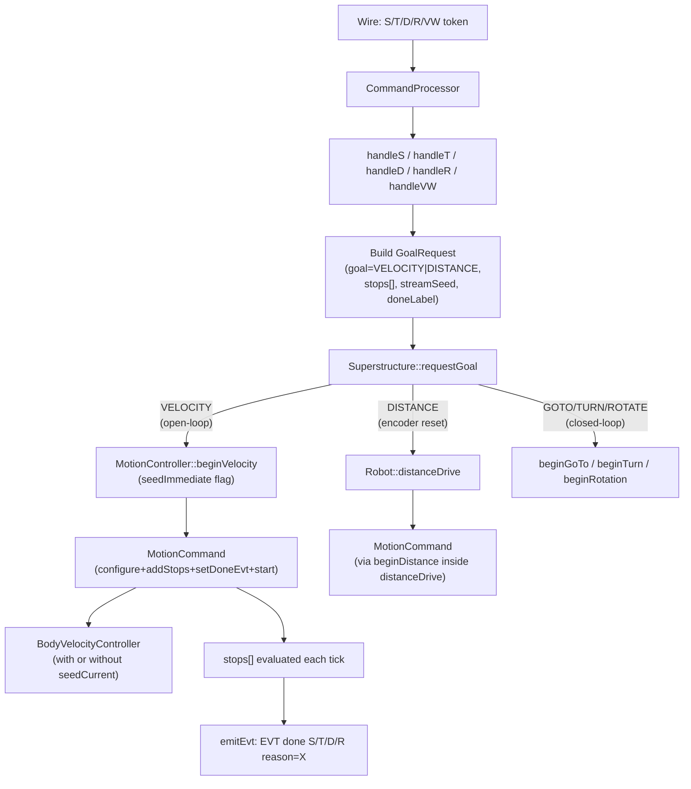
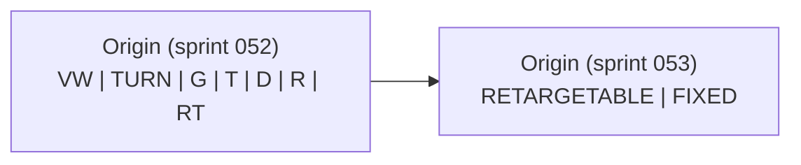
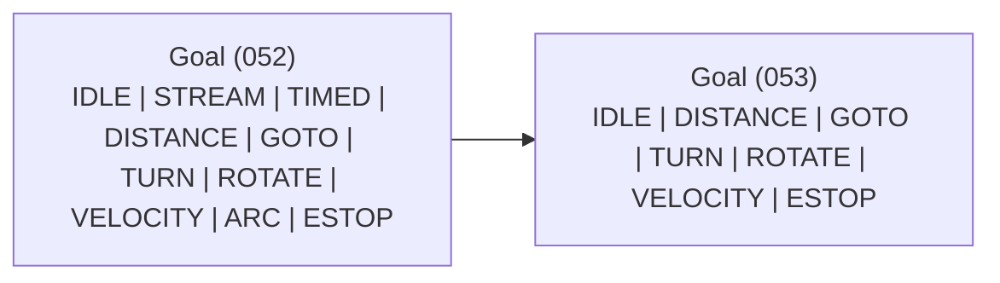
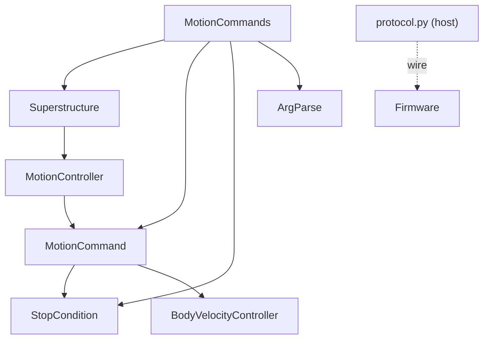

<!-- CLASI: Before changing code or making plans, review the SE process in CLAUDE.md -->

# Architecture Update — Sprint 053: Stop conditions Phase 2

## What Changed

Sprint 053 makes four structural changes to the firmware motion pipeline:

### 1. GoalRequest extended with stops, streamSeed, and doneLabel

`GoalRequest` (source/superstructure/Superstructure.h) gains four fields:

```
StopCondition stops[4];   // stop conditions to attach after begin
uint8_t       nStops;     // how many entries in stops[] are valid
bool          streamSeed; // true → seed BVC immediately (no ramp); S-command semantics
const char*   doneLabel;  // EVT string to pass to setDoneEvt (e.g. "EVT done T")
```

These are zero-initialized in aggregate initializers so all existing callers
(handleVW's G/TURN/RT branches) compile unchanged.

### 2. Goal enum collapsed: STREAM/TIMED/DISTANCE/ARC/VELOCITY → VELOCITY

`Goal::STREAM`, `Goal::TIMED`, `Goal::DISTANCE`, `Goal::ARC` are removed.
`Goal::VELOCITY` is the single open-loop goal variant. `Goal::GOTO`,
`Goal::TURN`, and `Goal::ROTATE` are retained unchanged (closed-loop
controllers). `Goal::IDLE` and `Goal::ESTOP` are retained.

`Superstructure::requestGoal` collapses the five former cases into one
VELOCITY case that:
1. Applies the `doneLabel` via `mc.setDoneEvt(gr.doneLabel)` when non-null.
2. Calls the appropriate begin path based on `streamSeed`:
   - `streamSeed=true` → `beginVelocity` variant that seeds BVC immediately.
   - `streamSeed=false` → standard `beginVelocity` with profiler ramp.
3. Applies `gr.stops[0..nStops-1]` via `mc.addStop(gr.stops[i])` after begin.
4. For DISTANCE, still calls `robot->distanceDrive` (not `beginVelocity`) to
   preserve the atomic encoder reset. The `doneLabel` and `stops[]` are applied
   to `mc.activeCmd()` after the call, identical to the Phase 1 pattern.

### 3. Origin enum shrunk: 7 variants → 2

`MotionCommand::Origin` is reduced to:

```cpp
enum class Origin : uint8_t { RETARGETABLE, FIXED };
```

`RETARGETABLE` replaces the former `VW`. `FIXED` replaces `TURN, G, T, D, R, RT`.
The keepalive guard in handleVW checks `origin() == Origin::RETARGETABLE`;
behavior is identical. The `kOriginNames` busy-reply table is updated to emit
`"FIXED"` for non-retargetable active commands.

### 4. Stringify/re-parse round-trip removed from handleVW and verb handlers

The following are **removed** from `MotionCommands.cpp`:
- `packKVArg` static helper.
- `argsHasKey` / `argsScanKV` for the keys: `t`, `dist`, `stream`, `radius`.
  (The `h` and `rot` scan for TURN and RT remain because those are still
  closed-loop and route via their own Goal variants.)
- The T-branch inverse() round-trip in handleVW (lines converting `v, omega_rads`
  back to `vL, vR` for `beginTimed`).
- The D-branch inverse() round-trip in handleVW.
- The `stream=` branch in handleVW.
- The `t=`, `dist=`, `radius=` check blocks in handleVW.

Verb handlers are updated:
- **handleS**: builds GoalRequest with `Goal::VELOCITY`, `streamSeed=true`,
  `doneLabel="EVT done S"`, and any `stop=` from `args[2..]` packed into
  `gr.stops[]`. Calls `requestGoal` directly. No more `pushVW`.
- **handleT**: builds GoalRequest with `Goal::VELOCITY`, `streamSeed=false`,
  `doneLabel="EVT done T"`, time stop from `args[2].ival` in `gr.stops[0]`,
  and any additional `stop=` from `args[3..]`. Calls `requestGoal` directly.
  No more `packKVArg(vwArgs, 2, "t", ms)` or `pushVW`.
- **handleD**: builds GoalRequest with `Goal::DISTANCE` (preserved for encoder
  reset), `doneLabel="EVT done D"`, distance stop from `args[2].ival`, plus
  any `stop=` from `args[3..]`. Calls `requestGoal` directly.
- **handleR**: builds GoalRequest with `Goal::VELOCITY`, `streamSeed=false`,
  `doneLabel="EVT done R"`, and any `stop=` from `args[2..]`. Computes
  `omega = speed / radius` inline (same as before). Calls `requestGoal` directly.
  No more `packKVArg(vwArgs, 2, "speed", ...)` or `pushVW`.

The TURN, RT, and G handlers continue to push VW ParsedCommands (no change):
they are closed-loop goals and their KV encoding (h=, rot=, x=/y=) stays.

### 5. `beginStream` reworked; `beginVelocity` gains a `seedImmediate` flag

`MotionController::beginVelocity` gains an overloaded or flagged path:

```cpp
void beginVelocity(float v_mms, float omega_rads, uint32_t now_ms,
                   TargetState& target, ReplyFn fn, void* ctx,
                   const char* corr_id,
                   bool seedImmediate = false);
```

When `seedImmediate=true` (S path): `_bvc.seedCurrent(v, omega)` is called
before `_bvc.setTarget(v, omega)`, matching the former `beginStream` behavior.
`DriveMode` is set to `VELOCITY` (not `STREAMING`) so the MotionCommand tick
path runs and stop conditions fire.

`beginStream` is either removed or reduced to a thin wrapper calling
`beginVelocity(..., seedImmediate=true)` for any legacy caller, then deprecated.
`DriveMode::STREAMING` is retained as a mode label but is no longer the mode
set by S-command dispatch — it is only set by `_VW` / `beginRawVelocity`.

## Why

Phase 1 (sprint 052) delivered the stop= grammar and reason= reporting additively
— but the internal routing for S/T/D/R still relies on a stringify/re-parse
round-trip through handleVW. This has three concrete costs:

1. **S stop= clauses cannot fire.** `handleS` packs `stream=1` and pushes a VW
   ParsedCommand. handleVW sees `stream=1` and calls `beginStream`, which bypasses
   MotionCommand entirely (STREAMING mode has no activeCmd). The stop= tokens
   forwarded from handleS into the VW args land in `mc_applyStopClauses` after
   `requestGoal`, but `mc.activeCmd()` is not active (beginStream never starts
   one), so `addStop` does nothing. This breaks SUC-001.

2. **T/D round-trip through inverse() is fragile.** handleT computes `(v, ω)` via
   forward kinematics, packs `v, omega_int` as VW args, then handleVW reads them
   and recomputes `(vL, vR) = v ± omega*(b/2)` for `beginTimed`. Any trackwidth
   mismatch or integer truncation in the mrad/s encoding accumulates silently.

3. **Origin has 7 variants but only 1 bit of information is used.** The keepalive
   guard needs only "was this started by a direct VW command" (retargetable) or not.

SUC-001 through SUC-005 are covered by this sprint.

## Impact on Existing Components

| Component | Change | Backward Compatible |
|---|---|---|
| `Superstructure.h` | GoalRequest gains 4 fields (zero-init in aggregate); Goal enum loses 4 variants | Yes — existing callers use aggregate init |
| `Superstructure.cpp` | requestGoal VELOCITY case handles all open-loop; STREAM/TIMED/ARC cases removed | Yes — wire behavior identical |
| `MotionCommand.h` | Origin enum: 7 → 2 variants | Internal only; wire unaffected |
| `MotionCommand.cpp` | Origin enum update in busy-reply name table | Internal only |
| `MotionCommands.cpp` | packKVArg, argsHasKey/argsScanKV (t/dist/stream/radius) removed; handleS/T/D/R call requestGoal directly | Internal only |
| `MotionControllerBegin.cpp` | beginVelocity gains seedImmediate flag; beginStream deprecated/thinned | Internal only |
| `DriveMode::STREAMING` | No longer set by S command; set only by _VW (beginRawVelocity) | Internal only |
| Golden-TLM canary | WILL CHANGE — timing of begin calls shifts from queue-drain hop | Intentional re-baseline |
| `test_052_stop_parser.py` | No change | Yes |
| `test_052_stop_reason.py` | No change | Yes |
| Sim tests asserting S behavior | Update to expect stop= to fire on S | Test update required |

## Migration Concerns

### 1. Distance encoder reset (MUST PRESERVE)

`Robot::distanceDrive` performs an atomic `beginDistance + resetEncoders`. This
sprint preserves `Goal::DISTANCE` in the Goal enum precisely so the
`Superstructure::requestGoal` DISTANCE case can still call
`robot->distanceDrive(...)` unchanged. The extended GoalRequest carries
`doneLabel` and `stops[]` for the D handler to pass additional conditions, which
are applied via `mc_applyStopClauses` after the call. The encoder-reset timing
is unchanged.

The `MotionController::beginDistance` implementation and `Robot::distanceDrive`
wrappers are **not modified** in this sprint.

### 2. Stream-seed vs. ramp (MUST PRESERVE)

The original `beginStream` seeds the BVC immediately (`_bvc.seedCurrent`), giving
no ramp-up. VW uses `beginVelocity` which does not seed — the BVC ramps from its
current state. This distinction is preserved via `seedImmediate=true` on the S
path. Removing this distinction would change S-command motion profiles.

### 3. Keepalive guard (MUST PRESERVE)

The D6 guard in handleVW checks `activeCmd().origin() == MotionCommand::Origin::VW`
(old) or `== Origin::RETARGETABLE` (new) and calls `setTarget` for keepalive. The
check value changes but the semantic is identical. Non-retargetable commands still
reply `busy=`. Test coverage must verify both paths after the enum rename.

### 4. Golden-TLM canary (INTENTIONAL RE-BASELINE)

Phase 1 left the golden-TLM canary byte-exact because it captures TLM lines
(not EVT lines) and the routing was unchanged. Phase 2 changes how begin* calls
are sequenced relative to the queue-drain hop: S/T/D/R now call `requestGoal`
directly from their verb handlers rather than pushing a VW ParsedCommand and
calling `requestGoal` from the queue-drain dispatch.

This means the begin* call now happens one main-loop tick earlier than before
for S/T/D/R commands. TLM packets that include mode or drive-state fields may
appear one tick earlier in the stream. The canary diff is expected to show shifted
timestamps or tick-index offsets, NOT different final motion values.

The re-baseline ticket (006) regenerates the golden capture and must:
- Run the canary test before changes to record the old baseline.
- Run it after changes to record the new baseline.
- Document the diff in the ticket as "tick-shifted, not behaviorally regressed."
- Commit the new baseline file.

### 5. TURN/RT/G KV push path is unchanged

The `h=`, `rot=`, and `x=/y=` KV packing and the `argsHasKey/argsScanKV` scans
for those keys in handleVW are retained. TURN, RT, and G remain closed-loop and
are unaffected by this sprint.

## Diagrams

### Component diagram (after sprint 053)



### Origin enum before and after



### Goal enum before and after



### Dependency graph (unchanged topology)



No new edges. The `Stop` class in `protocol.py` is unchanged from Phase 1.

## Design Rationale

### GoalRequest extension vs. separate begin* signatures

The alternative to extending GoalRequest is to add a new `beginVelocityWithStops`
member on MotionController. This would require a new virtual or non-virtual
signature, updating the Superstructure switch, and adding overloads for each
open-loop variant. GoalRequest is already a flat POD union of all begin*
parameter sets; adding four new fields (zero-initialized, aggregate-compatible)
is the minimal and least-invasive path. No new ABI edges are introduced.

### DISTANCE preserved as a separate Goal variant

`Robot::distanceDrive` is an atomic wrapper that calls `beginDistance +
resetEncoders`. Moving the encoder reset into `beginVelocity` would require
either embedding robot-level concerns into MotionController, or splitting the
reset into a separate GoalRequest field. Both options carry risk. Since
`distanceDrive` is already called via GoalRequest, keeping `Goal::DISTANCE`
as a pass-through to `robot->distanceDrive` is zero-risk and preserves the
proven encoder-reset timing.

### Origin: 2 values rather than 1 bool

A `bool retargetable` field on MotionCommand could replace the enum. The
enum name `Origin` remains because the concept ("which kind of command started
this") is meaningful even with only two categories, and extending to three
values in a future sprint is O(1) with an enum but requires a field rename
with a bool. The enum is renamed to be honest: the old name `VW` implied
"this was started by VW" — the new `RETARGETABLE` names the property that is
actually tested.

### streamSeed flag rather than a separate beginStream

Keeping `beginVelocity(... seedImmediate=false)` as the single entry point
and adding a flag is simpler than maintaining two entry points with similar
bodies. `beginStream` can be retained as a thin wrapper for any legacy
simulation paths, deprecated in the doc comment, and removed in a future sprint.

## Open Questions

1. **TURN and RT in handleVW**: After removing the t=/dist=/stream=/radius=
   demux from handleVW, the `argsHasKey(args, "h")` and `argsHasKey(args, "rot")`
   checks remain for TURN and RT. These are closed-loop goals and their KV push
   is intentional. No change is needed — confirming this is in scope.

2. **_VW / beginRawVelocity and STREAMING mode**: After this sprint,
   `DriveMode::STREAMING` is set only by `beginRawVelocity`. If any code path
   checks `mode == DriveMode::STREAMING` to detect the S command (rather than
   checking `activeCmd().origin()`), that logic would need to be reviewed.
   The programmer should audit `driveAdvance` for any mode==STREAMING branches
   that formerly guarded S-specific behavior.

3. **EVT done for VW with explicit stop=**: When a user sends `VW 300 0
   stop=d:400` (direct VW with a stop), the completion emits `EVT done` (the
   default doneLabel for beginVelocity). This matches Phase 1 behavior. No change
   needed, but the programmer should confirm the sim test covers this case.
