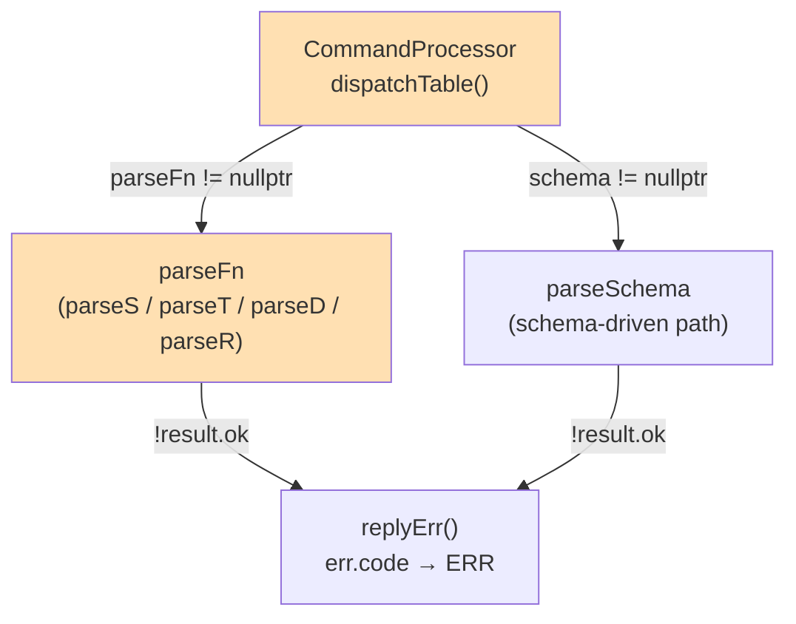

<!-- CLASI: Before changing code or making plans, review the SE process in CLAUDE.md -->

# Architecture Update — Sprint 054: Motion verbs ERR range vs badarg fix

## What Changed

### Sprint Changes Summary

Two targeted bug fixes in the command dispatch pipeline, plus test hardening.
No new modules, no API surface changes, no data model changes.

**`CommandProcessor` — dispatcher `parseFn` branch (`dispatchTable`)**

The `parseFn` error-formatting path is changed to honor `result.err.code` when
it is non-null, falling back to `desc.errFmt` only when `result.err.code` is
null. This is the minimal guard clause that fixes the regression without
touching the schema branch (which is already correct for all schema-driven
commands).

Before:
```
const char* code = (desc.errFmt != nullptr) ? desc.errFmt : "badarg";
```
After:
```
const char* code = (result.err.code != nullptr) ? result.err.code
                 : (desc.errFmt    != nullptr) ? desc.errFmt
                 : "badarg";
```

**`MotionCommands` — `parseS`, `parseT`, `parseD`, `parseR` parse functions**

Each ranged-value failure path is changed to set `res.err.code = "range"`.
Arg-count failure paths continue to leave `res.err.code = nullptr` (they then
fall through to `desc.errFmt = "badarg"` in the dispatcher, preserving the
existing behavior for missing-argument errors).

**Test files**

- `tests/simulation/unit/test_protocol_v2.py`: new live-sim test class
  `TestMotionVerbRangeErrors` that drives the `Sim` fixture and asserts the
  exact `ERR range <field>` / `ERR badarg` string for each acceptance case.
- `tests/simulation/unit/test_motion_verbs_v2.py`: range-error test methods
  that were previously static string assertions (testing nothing against the
  real firmware) are converted to live `Sim` calls. The assertions are tightened
  to `assert resp == "ERR range <field>"` rather than loose membership checks.

## Why

The regression was introduced in sprint 051 when S/T/D/R were converted from
schema-based to custom `parseFn` registrations (to support stop-condition
forwarding). The existing dispatcher did not distinguish `result.err.code` from
`desc.errFmt`; the parse functions left `err.code = nullptr` on range failures,
so the dispatcher always used `desc.errFmt` ("badarg"). The existing test suite
used static string literals, not live firmware calls, so the regression passed
CI silently.

The fix is localized to the single code path that was broken. The schema branch
(`desc.schema != nullptr`) is unaffected because it has its own error-formatting
logic and was not part of the regression.

## Structural Diagram



Orange nodes are the two files modified in this sprint.

## Impact on Existing Components

**`CommandProcessor.cpp`**: The change is one guard clause in the `parseFn`
error-formatting block. No interface change; all callers are unaffected. The
schema branch is untouched.

**`MotionCommands.cpp`**: Four parse functions (`parseS`, `parseT`, `parseD`,
`parseR`) gain `res.err.code = "range"` on their ranged-value failure returns.
Handler functions (`handleS`, `handleT`, `handleD`, `handleR`) are unchanged.

**`parseTURN` / `parseVW`**: These already set `res.err.code` correctly
(`"range"` on range fail, `"badarg"` on count fail). They are unaffected by
this sprint and serve as the reference pattern.

**Test suite**: Two existing test files gain new test cases. No existing passing
test cases are removed or changed.

## Design Rationale

**Decision**: Honor `res.err.code` in the dispatcher rather than having each
parse function force a specific `errFmt` at registration time.

**Context**: The `errFmt` field on `CommandDescriptor` was designed as a
default, not an override. The `ParseResult.err.code` field exists precisely to
allow parse functions to specify the code at parse time.

**Alternatives considered**:
- Register S/T/D/R with `errFmt="range"` — rejected because then arg-count
  failures would also reply `ERR range`, which is wrong. The two failure modes
  (arg-count vs. value-range) need to produce different codes.
- Add a separate `errFmt_range` field to `CommandDescriptor` — rejected as
  over-engineering; `ParseResult.err.code` already carries this information.

**Why this choice**: Minimal change, correct semantics, consistent with how
`parseTURN` and `parseVW` already work.

**Consequences**: `ParseResult.err.code`, when set, now takes precedence over
`desc.errFmt` in the `parseFn` branch. Any future parse function that sets
`err.code` explicitly will have its code honored. This is the intended behavior.

## Open Questions

None. The root cause is understood, the fix is local, and the acceptance
criteria are unambiguous.

## Migration Concerns

None. This is a wire-protocol bug fix. The corrected response (`ERR range l`)
matches the documented spec. Existing host code that already checks for
`ERR range` will benefit; host code that was accidentally matching `ERR badarg`
for range errors will now see the correct response (which is a bug fix, not a
breaking change).
