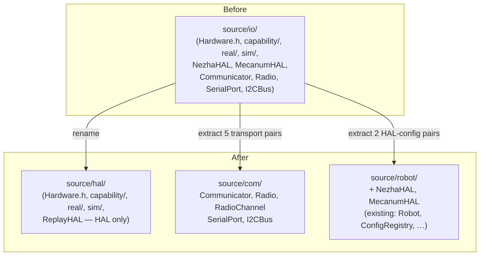
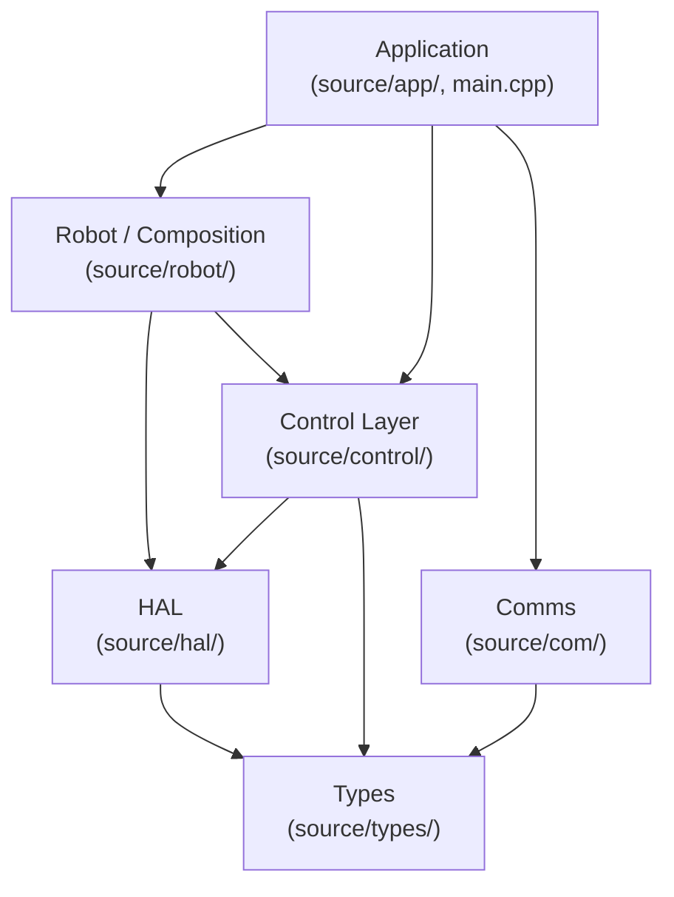

<!-- CLASI: Before changing code or making plans, review the SE process in CLAUDE.md -->

# Architecture Update — Sprint 055: Phase 0 — Reorganize source/io into hal, com, robot

## What Changed

### Sprint Changes Summary

Pure structural rename and module extraction. No behavior changes, no interface
changes, no new logic. Three directories are affected:

**`source/io/` → `source/hal/`**

The `source/io/` directory is renamed to `source/hal/`. All files it contained
that are neither robot-config classes nor communication transports remain in
place under the new name:

- `Hardware.h`, `NoopDevices.h`, `Sensor.h`, `ReplayHAL.{h,cpp}` — HAL root
- `capability/` — all `I*.h` device interfaces and `Pose2D.h` — unchanged
- `real/` — `Motor`, `OtosSensor`, `ColorSensor`, `LineSensor`, `Servo`,
  `PortIO`, `MotorBusDiagnostics`, `I2CBusRawAccess`, `BenchOtosSensor`
- `sim/` — `SimHardware`, `SimMotor`, `SimOtosSensor`, `SimColorSensor`,
  `SimLineSensor`, `SimPortIO`, `SimServo`, `PhysicsWorld`, `WorldView`

**New `source/com/`**

Created to hold communication transports that have no robot dependency (they
depend only on `MicroBit.h`). Moved from `source/io/real/`:

- `Communicator.{h,cpp}` — owns serial + radio, begins a named channel
- `Radio.{h,cpp}` — micro:bit radio with channel persistence and reassembly
- `RadioChannel.{h,cpp}` — channel abstraction over radio
- `SerialPort.{h,cpp}` — line-buffered 115200 baud, no-heap `sendf`
- `I2CBus.{h,cpp}` — wraps `MicroBitI2C&`; IRQ-mask re-entrancy guard

**`source/robot/` — addition**

Two CODAL-dependent concrete `Hardware` subclasses (robot configurations) moved
from `source/io/real/`:

- `NezhaHAL.{h,cpp}` — physical differential-drive robot HAL
- `MecanumHAL.{h,cpp}` — physical mecanum-drive robot HAL

**Include sweep**

All ~52 path-prefixed `#include "io/..."` lines across `source/` are rewritten
to `#include "hal/..."`. Bare-filename includes are unaffected.

**`CMakeLists.txt` (device firmware build)**

Three `FILTER EXCLUDE` regex strings updated:

| Old | New |
|-----|-----|
| `.*/io/sim/.*` | `.*/hal/sim/.*` |
| `.*/io/ReplayHAL\.cpp$` | `.*/hal/ReplayHAL\.cpp$` |
| `.*/io/real/MecanumHAL\.cpp$` | `.*/robot/MecanumHAL\.cpp$` |

**`tests/_infra/sim/CMakeLists.txt` (host/sim build)**

- Glob `source/io/sim/*.cpp` → `source/hal/sim/*.cpp`
- Explicit path `source/io/ReplayHAL.cpp` → `source/hal/ReplayHAL.cpp`
- Explicit path `source/io/real/BenchOtosSensor.cpp` → `source/hal/real/BenchOtosSensor.cpp`
- Include dir `source/io` → `source/hal`
- Include dir `source/io/capability` → `source/hal/capability`
- Include dir `source/io/real` → `source/hal/real`
- Include dir `source/io/sim` → `source/hal/sim`
- **Add** include dir `source/com` (so `I2CBus.h` and transport headers resolve
  transitively for `MotorBusDiagnostics` and friends)
- **Add two new FILTER EXCLUDE lines** (NezhaHAL.cpp and MecanumHAL.cpp moved
  into `source/robot/*.cpp` which is already globbed by `ROBOT_SOURCES`; both
  are CODAL-dependent and must not compile host-side):
  - `list(FILTER ROBOT_SOURCES EXCLUDE REGEX ".*/NezhaHAL\\.cpp$")`
  - `list(FILTER ROBOT_SOURCES EXCLUDE REGEX ".*/MecanumHAL\\.cpp$")`

## Why

**Cohesion failure in `source/io/`**: the directory conflated three independent
concerns — a Hardware Abstraction Layer, concrete robot configurations, and
communication transports. Each should be separately locatable, separately
compilable against, and separately scoped.

**Name mismatch with docs**: `architecture-034.md` already describes the target
layout using `source/hal/`, `source/com/`, and `source/robot/`. The code was
using `source/io/` — this sprint closes the gap.

**Foundation for Phase 1+**: the message-based subsystem architecture
(`plan-message-based-subsystem-interface-drivetrain-sensors-config.md`) assumes
`source/hal/`, `source/com/`, `source/robot/`, and `source/subsystems/` as its
starting layout. Phase 0 must land before Phase 1 begins.

## Structural Diagram

The dependency direction is unchanged from before. `source/com/` is a new leaf
node: the transport classes have no robot or control dependencies (they depend
only on `MicroBit.h` and `source/types/`).

## Impact on Existing Components

**No behavior, interface, or API changes.** Every component that compiled before
will compile after with only `#include` path string changes.

**`DebugCommands.cpp` and `main.cpp`**: both use bare `#include "NezhaHAL.h"`.
Because `source/robot/` is already on the include path in both builds, these
resolve after the move with no edits beyond the `io/`→`hal/` sweep (neither file
uses an `io/`-prefixed include for the HALs).

**`MotorBusDiagnostics.cpp` and `I2CBusRawAccess.cpp`**: both stay in
`hal/real/`. Their `#include "I2CBus.h"` bare includes continue to resolve once
`source/com/` is on the include path (added to both builds by this sprint).

**`source/io/sim/*.cpp`** files use relative includes (`../Hardware.h`). The
`hal/sim/` → `hal/` relationship is identical to the old `io/sim/` → `io/`
relationship, so these are unaffected.

## Migration Concerns

None. This is a source-tree-only rename with no runtime, protocol, or data
model changes. No stored state, no migration scripts, no backward compatibility
concerns. Firmware flashed before and after this sprint is functionally
identical.

## Design Rationale

**Decision**: Extract comms transports to `source/com/` rather than leaving them
in `hal/real/` under the new name.

**Context**: `Communicator`, `Radio`, `RadioChannel`, `SerialPort`, and `I2CBus`
have zero robot or HAL dependency beyond `MicroBit.h`. They are communication
infrastructure, not hardware abstraction.

**Alternatives considered**:
- Leave them in `hal/real/` — rejected: the HAL's job is abstracting device
  hardware behind interfaces; line-protocol transports are not device hardware.
  The cohesion test fails (the HAL purpose sentence would need "and").
- Move to `source/types/` — rejected: they are not value types or
  configuration; they have `.cpp` implementations and runtime state.

**Why this choice**: A dedicated `source/com/` directory passes the cohesion
test ("communication transports"), has no circular dependency with HAL or
control, and prepares the tree for the message-based subsystem architecture
where the comms layer will grow independently.

**Decision**: `I2CBus` goes to `source/com/` (not stays in `hal/real/`).

**Context**: The user explicitly included `I2CBus` in the comms extraction, even
though device drivers in `hal/real/` sit on top of it. The bus is a transport
primitive, not a device abstraction.

**Consequences**: `MotorBusDiagnostics` and `I2CBusRawAccess` in `hal/real/`
keep their bare `#include "I2CBus.h"` includes, which resolve transitively once
`source/com/` is on the include path.

## Open Questions

None. The issue is a step-by-step plan with exact line numbers. The architecture
is aligned with the existing consolidated baseline. No ambiguity or stakeholder
input required before implementation.
