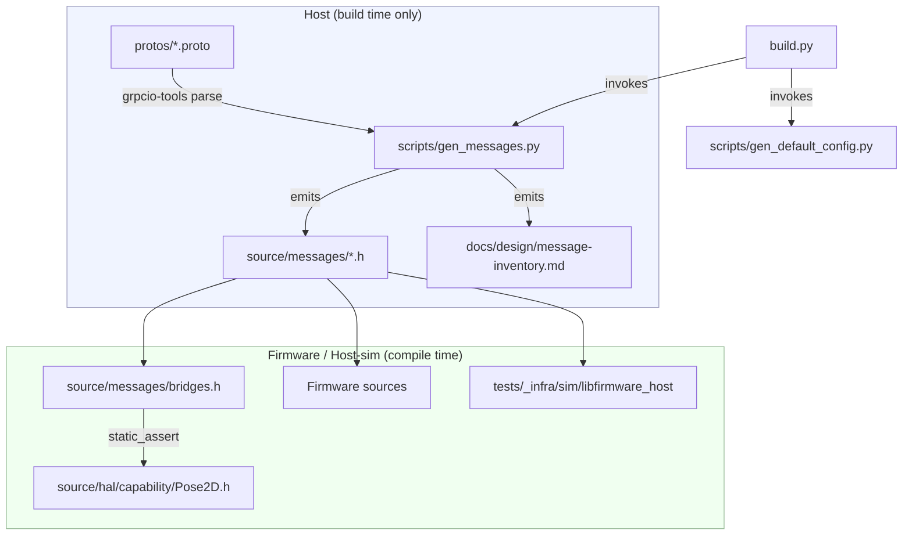
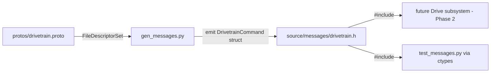

<!-- CLASI: Before changing code or making plans, review the SE process in CLAUDE.md -->

# Architecture Update — Sprint 056: Phase 1 - Proto message definitions and C++ codegen

## What Changed

Sprint 056 introduces two new modules and modifies two build files:

### New: `protos/` — message schema directory

Seven proto3 files define the canonical message vocabulary for all physical
subsystems and the Planner. These files are the SSOT; nothing else defines the
message shapes.

```
protos/
  common.proto      — shared value types (Pose2D, BodyTwist3, ValueSet, etc.)
  motor.proto       — MotorCommand, MotorState, MotorConfig, MotorCapabilities
  drivetrain.proto  — DrivetrainCommand, DrivetrainState, DrivetrainConfig, DrivetrainCapabilities
  sensors.proto     — LineSensorState/Config, ColorSensorState/Config
  gripper.proto     — GripperCommand, GripperState, GripperConfig
  ports.proto       — PortCommand, PortState, PortConfig
  planner.proto     — PlannerCommand, PlannerState, PlannerConfig, enums
```

Custom options `(units)` (metadata only, no C++ output) and `(max_count)=N`
(dictates fixed-array size in generated C++) are defined in `protos/options.proto`
and imported by each file.

### New: `source/messages/` — generated C++11 POD headers

One header per `.proto` is emitted by `scripts/gen_messages.py`:

```
source/messages/
  common.h       — Opt<T> template + value types
  motor.h
  drivetrain.h
  sensors.h
  gripper.h
  ports.h
  planner.h
  bridges.h      — using-aliases + static_assert layout checks vs. hand types
```

All headers are header-only (no `.cpp`). No heap, no STL, no RTTI, no exceptions.

Generation rules:
- Scalar proto field → plain `type member_name;` struct member.
- `message Foo` nested → embedded struct `Foo member_name;`.
- `oneof control { ... }` → `enum class Kind { ... } kind;` tag + anonymous
  `union { ... };` members (no RTTI discriminant — caller reads `kind`).
- `optional`/nullable field → `Opt<T> field_name;` where
  `template<class T> struct Opt { bool has = false; T val{}; };`.
- `repeated Foo bar = N [(max_count) = K]` → `Foo bar[K]; uint8_t bar_count;`.
- Getters: `const T& field() const;` on all message types.
- Chainable setters: `Msg& setField(T v);` on Command/Config types only
  (enables `newCommand().setTwist(vx,vy,omega).apply()`).

### New: `scripts/gen_messages.py`

Host-side code generator. Pattern mirrors `scripts/gen_default_config.py`:

1. Uses `grpcio-tools` `protoc` Python API (not subprocess) to parse `protos/*.proto`
   into a `FileDescriptorSet`.
2. Walks the descriptor tree to emit C++11 POD headers to `source/messages/`.
3. Accepts `--emit-inventory` flag to also write
   `docs/design/message-inventory.md` (the traceability table).
4. Idempotent: output is deterministic given the same inputs.

### Modified: `build.py`

A second `_sp.run([sys.executable, _gen_msgs], check=True)` call is added
directly after the existing `gen_default_config.py` invocation. This ensures
`source/messages/*.h` are always fresh before the compiler runs.

### Modified: `tests/_infra/sim/CMakeLists.txt`

`source/messages/` is added to the `target_include_directories` list for
`firmware_host`. The device CMakeLists uses `RECURSIVE_FIND_FILE`/`RECURSIVE_FIND_DIR`
over `source/`, so it picks up `source/messages/` automatically with no edit.

### New (dev dependency): `grpcio-tools` in `pyproject.toml`

Added as a host-only dev dependency. The device never sees it. If `protoc` binary
is not on `PATH`, `grpcio-tools` provides it through its Python package.

---

## Why

Phase 1 of the message-based subsystem architecture (issue:
`message-based-subsystem-architecture.md`) requires a shared type vocabulary that:

1. Has a human-readable SSOT that is not hand-maintained C++.
2. Generates embedded-safe C++11 POD structs with no heap/RTTI/STL.
3. Follows the existing `gen_default_config.py` precedent so the pattern
   is familiar and fits naturally into the build flow.
4. Provides the types that Phase 2 (subsystem wiring) and Phase 3 (integration)
   depend on.

The traceability table closes the loop by proving every generated field has a
corresponding home in the current codebase, de-risking Phase 2.

---

## Impact on Existing Components

| Component | Impact |
|---|---|
| `scripts/gen_default_config.py` | No change. Gen_messages.py is a sibling, not a modification. |
| `build.py` | One new `_sp.run` call added immediately after the existing codegen call. |
| `tests/_infra/sim/CMakeLists.txt` | One new include-path entry for `source/messages/`. |
| `source/hal/capability/Pose2D.h` | No change. The generated `bridges.h` imports it and adds `static_assert` checks only. |
| `source/state/ActualState.h` | No change. The traceability table references it but Phase 1 does not alter it. |
| `source/types/Config.h` | No change. Referenced only in the traceability table. |
| `source/subsystems/drive/Drive.h` | No change in this sprint; Phase 2 will wire it. |
| All existing tests | No change expected. Generated headers are new include paths; nothing existing includes them yet. |

The `source/messages/` directory and `protos/` directory are net-new; no existing
file includes them. Risk of breaking existing code is very low.

---

## Module Diagram



---

## Data-Flow: proto → generated header → firmware



---

## Design Rationale

### Decision 1: proto3 as schema, not full protobuf on device

**Context:** The device is micro:bit v2 (CODAL, C++11, `-fno-rtti -fno-exceptions`,
128 KB SRAM). `libprotobuf` and nanopb are infeasible at runtime.

**Alternatives considered:**
- Hand-authored C++ headers only (no schema) — drift risk, no traceability.
- nanopb (runtime) — adds runtime overhead and a serialize/deserialize layer
  we do not need (wire is ASCII).
- Custom DSL — more work with no advantage over proto3.

**Choice:** Use proto3 as a pure schema and parse it only on the host at build
time. The device sees only the generated C++ POD structs.

**Consequences:** The device build has zero protobuf dependency. The host build
needs `grpcio-tools` (dev dependency). Generated headers are standalone C++11.

### Decision 2: `Opt<T>` template, not `std::optional`

**Context:** `std::optional` requires C++17 and is not available in the
`-std=c++11` firmware build.

**Choice:** Generate a bespoke `template<class T> struct Opt { bool has; T val; }`
in `source/messages/common.h`. This is the minimal nullable wrapper compatible
with the firmware's C++11 / no-heap / no-exceptions constraints.

**Consequences:** Callers use `field.has` and `field.val` instead of `has_value()`
/ `value()`. This is a minor ergonomic difference; the generated setters hide it
for Command/Config types (`setFeedforward(f)` sets both `has=true` and `val=f`).

### Decision 3: `using` aliases + `static_assert` bridges rather than replacing hand types

**Context:** Phase 1 must not break existing code. `Pose2D`, `BodyTwist3`, and
`RobotGeometry` are used throughout the codebase from `source/hal/capability/Pose2D.h`.

**Choice:** The generator emits structurally identical types (same fields, same
order, same sizes) and then emits `bridges.h` with `using Generated_Pose2D = ::Pose2D;`
and `static_assert(sizeof(Generated_Pose2D) == sizeof(::Pose2D), ...)`. Phase 2
will fold the generated types into the hand types; Phase 1 just proves they are
byte-compatible.

**Consequences:** No existing file needs to change in this sprint. Phase 2 can
do the aliasing refactor with compile-time safety nets already in place.

### Decision 4: header-only generated output (no `.cpp`)

**Context:** The generated message structs are POD types with inline getter/setter
bodies. No non-trivial static state, no non-trivial constructors.

**Choice:** All generated code goes into `*.h` files. No `.cpp` files are generated.

**Consequences:** The device CMakeLists picks up new `.h` files via
`RECURSIVE_FIND_DIR` (include-path scan). The sim CMakeLists needs only one new
`target_include_directories` line — no new glob for sources. Link units are unchanged.

---

## Open Questions

1. **`(units)` custom option proto definition.** Proto3 custom options require
   importing `google/protobuf/descriptor.proto`. The device never sees this import,
   but the host-side codegen needs it available. Confirm that `grpcio-tools` ships
   `descriptor.proto` in its include path (it does as of grpcio-tools 1.x; verify
   the installed version in CI).

2. **`kWheelCount` in generated headers.** `DrivetrainState` has per-wheel arrays
   sized by `kWheelCount` (2 differential, 4 mecanum). The proto schema uses
   `(max_count)=4` (the maximum). The generator should emit `float encMm[4]` always;
   the firmware-side differential build simply ignores indices 2–3. Confirm this
   is acceptable to the stakeholder (alternative: two separate drivetrain protos).

3. **Inventory generation as a build-time side effect.** Writing
   `docs/design/message-inventory.md` during `build.py` would touch a docs file on
   every clean build. Recommend gating behind `--emit-inventory` flag (run once by
   the ticket implementer, then checked in). Confirm preferred workflow.

4. **`grpcio-tools` version pin.** The `grpcio-tools` Python package version should
   be pinned in `pyproject.toml` to ensure deterministic proto parsing across
   developer machines and CI. Propose pinning to `>=1.60,<2.0`.
