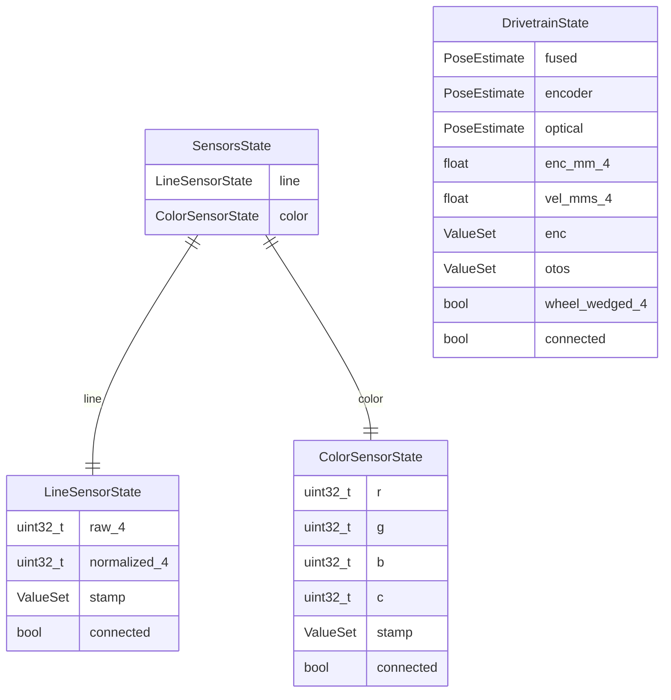

<!-- CLASI: Before changing code or making plans, review the SE process in CLAUDE.md -->

# Architecture Update — Sprint 057: Phase 2 - Subsystem contract, Drive and Sensors with sim tests

## What Changed

### Sprint Changes Summary

Sprint 057 introduces five distinct changes:

1. **`msg::` namespace on all generated messages** — all types in `source/messages/*.h`
   move from global scope into `namespace msg`. `gen_messages.py` is updated; all
   callers and `bridges.h` are updated. HAL types (`::Pose2D`, `::BodyTwist3`)
   remain at global scope, resolving the Phase 1 known collision.

2. **`source/subsystems/SubsystemContract.h`** — new header documenting the
   3-message / 4-verb structural convention (no virtual base, no C++20 concept).
   Provides the `newCommand()` / `newConfig()` fluent-builder documentation and the
   `CommandBatch`-return tick pattern. Inert at link time — documentation only.

3. **`subsystems::Sensors`** — new class in `source/subsystems/sensors/Sensors.h/.cpp`
   aggregating the existing `subsystems::LineSensor` and `subsystems::ColorSensor`
   behind a single facade: `tick(now)` / `state() -> const SensorsState&` /
   `configure(LineSensorConfig, ColorSensorConfig)`. A new `SensorsState` type holds
   both `LineSensorState` and `ColorSensorState` using the generated `msg::` types.
   Also adds `toSensorsConfig(const RobotConfig&)` projection function in
   `source/subsystems/sensors/SensorsConfig.cpp`.

4. **`subsystems::Drive2`** — new class in `source/subsystems/drive/Drive2.h/.cpp`
   implementing the full 4-verb + capabilities contract by composing existing
   `MotorController`, `BodyVelocityController`, `PhysicalStateEstimate`, `Odometry`,
   and the `IOdometer` / `IVelocityMotor` device interfaces. Exposes
   `apply(msg::DrivetrainCommand)` / `tickUpdate(uint32_t now)` /
   `tickAction(uint32_t now) -> msg::CommandBatch` / `state() -> const msg::DrivetrainState&` /
   `configure(msg::DrivetrainConfig)` / `capabilities() -> msg::DrivetrainCapabilities`.
   Also adds `toDriveConfig(const RobotConfig&) -> msg::DrivetrainConfig` in
   `source/subsystems/drive/DriveConfig.cpp`. The existing `Drive::periodic()` is
   untouched.

5. **Sim error-model extension and subsystem isolation tests** — `SimOdometer` gains
   `setDriftPerTickMm(float)`, `setDriftPerTickRad(float)`, and
   `setScaleError(float linear, float angular)` knobs. `PhysicsWorld` and `SimHardware`
   gain `groundTruthX/Y/H()` and `idealX/Y/H()` accessors. C-ABI shim files
   `drive2_api.cpp` and `sensors_api.cpp` added to `tests/_infra/sim/` with
   `CMakeLists.txt` additions. New test files `tests/simulation/unit/test_drive2_subsystem.py`
   and `tests/simulation/unit/test_sensors_subsystem.py`.

---

## Module Diagram

```mermaid
graph TD
    subgraph Messages["source/messages/ (msg:: namespace)"]
        MCOMMON[msg::common.h<br/>Opt T, CommandBatch,<br/>Capabilities, Pose2D...]
        MDRV[msg::drivetrain.h<br/>DrivetrainCommand/State/Config]
        MSEN[msg::sensors.h<br/>LineSensorState/Config<br/>ColorSensorState/Config]
        MDRV --> MCOMMON
        MSEN --> MCOMMON
    end

    subgraph HAL["source/hal/"]
        POSE2D[hal/capability/Pose2D.h<br/>::Pose2D, ::BodyTwist3]
        IVMOT[IVelocityMotor]
        IODOM[IOdometer]
        ILINE[ILineSensor]
        ICOLOR[IColorSensor]
        SIMHW[hal/sim/SimHardware<br/>+groundTruthX/Y/H]
        SIMODOM[hal/sim/SimOdometer<br/>+drift/scale knobs]
        SIMHW --> SIMODOM
    end

    subgraph Control["source/control/"]
        MC[MotorController]
        BVC[BodyVelocityController]
        PSE[PhysicalStateEstimate<br/>EKF]
        ODO[Odometry]
    end

    subgraph SubsystemContract["source/subsystems/SubsystemContract.h (doc)"]
        CONTRACT[Structural convention:<br/>apply tick state configure capabilities]
    end

    subgraph Subsystems["source/subsystems/ (NEW this sprint)"]
        SENSORS[Sensors facade<br/>tick state configure]
        LINESUB[LineSensor periodic wrapper]
        COLORSUB[ColorSensor periodic wrapper]
        DRV2[Drive2<br/>apply tickUpdate tickAction<br/>state configure capabilities]
        SENSORS --> LINESUB
        SENSORS --> COLORSUB
    end

    subgraph Projections["Projection functions (NEW)"]
        TDRIVE[toDriveConfig<br/>RobotConfig → DrivetrainConfig]
        TSENS[toSensorsConfig<br/>RobotConfig → LineSensorConfig+ColorSensorConfig]
    end

    subgraph Tests["tests/simulation/unit/ (NEW)"]
        T1[test_drive2_subsystem.py]
        T2[test_sensors_subsystem.py]
        TMSGS[test_messages.py extended]
    end

    DRV2 --> MDRV
    DRV2 --> MC
    DRV2 --> BVC
    DRV2 --> PSE
    DRV2 --> ODO
    DRV2 --> IVMOT
    DRV2 --> IODOM
    SENSORS --> MSEN
    LINESUB --> ILINE
    COLORSUB --> ICOLOR
    TDRIVE --> MDRV
    TSENS --> MSEN
    T1 --> DRV2
    T1 --> SIMHW
    T2 --> SENSORS
    T2 --> SIMHW
```

---

## Entity-Relationship: State types introduced

---

## Why

Phase 1 produced the typed message vocabulary in `source/messages/*.h`. Phase 2
realizes the contract: wraps the existing imperative control components (`MotorController`,
`BodyVelocityController`, `PhysicalStateEstimate`, etc.) behind the structured
`apply/tick/state/configure/capabilities` interface, enabling:

- **Testability**: a subsystem can be constructed on `SimHardware` devices alone and
  exercised without the full robot or comms stack. The message contract makes the
  boundary explicit and checkable.
- **EKF coverage**: the Drive2 sim isolation tests are the first time the encoder+OTOS
  EKF fusion path is exercised in an automated test without a full robot scenario.
- **Phase 3 readiness**: Phase 3 rewires `loopTickOnce` to call `tickUpdate`/`tickAction`
  on `Drive2` and `tick` on `Sensors`. That rewire is a mechanical substitution;
  the subsystem behavior is already validated here.
- **Name-collision fix**: the `msg::` namespace migration is a prerequisite for any
  TU that includes both generated messages and HAL headers — required for `Drive2.h`.

---

## Impact on Existing Components

| Component | Impact |
|---|---|
| `source/messages/*.h` | All types move into `namespace msg`. Generated by `gen_messages.py`. |
| `source/messages/bridges.h` | Updated: HAL static_assert unchanged, but `msg::` prefix used in comments. No functional change to the layout checks. |
| `scripts/gen_messages.py` | Modified to emit `namespace msg { ... }` wrapping all generated types. |
| `tests/_infra/sim/message_test_api.cpp` | Updated: all generated-type references gain `msg::` prefix. Static_asserts updated accordingly. |
| `tests/simulation/unit/test_messages.py` | Extended with `msg::` namespace round-trip test. No existing test deleted. |
| `source/subsystems/drive/Drive.h/.cpp` | No change. `Drive::periodic()` untouched. |
| `source/subsystems/sensors/LineSensor.h/.cpp` | No change. `periodic()` untouched. |
| `source/subsystems/sensors/ColorSensor.h/.cpp` | No change. `periodic()` untouched. |
| `source/control/MotorController.*` | No change. Used by reference inside `Drive2`. |
| `source/control/BodyVelocityController.*` | No change. Used by reference inside `Drive2`. |
| `source/state/PhysicalStateEstimate.*` | No change. Used by reference inside `Drive2`. |
| `source/control/Odometry.*` | No change. Used by reference inside `Drive2`. |
| `source/hal/sim/SimOdometer.*` | Extended with drift/scale knobs. Existing interface and behavior preserved. |
| `source/hal/sim/PhysicsWorld.*` | Extended with `groundTruthX/Y/H()` / `idealX/Y/H()` accessors. Existing behavior preserved. |
| `source/hal/sim/SimHardware.*` | Delegation pass-through to `PhysicsWorld` accessors added. Existing interface unchanged. |
| `tests/_infra/sim/CMakeLists.txt` | New source files `drive2_api.cpp` and `sensors_api.cpp` added. |
| All existing simulation tests | No change expected. Generated headers are now in `msg::` namespace; existing code that didn't include them is unaffected. |

---

## Migration Concerns

**`msg::` namespace migration** — any existing firmware code that already includes
`source/messages/*.h` (currently only `message_test_api.cpp` per sprint 056) must add
the `msg::` prefix. The sprint 056 work was scoped to test shims only; no
production firmware TU includes the generated headers yet. Risk is low and
mechanically verifiable: the compiler will error on unqualified uses.

**Additive strategy** — `Drive2` is a new class; `Drive` remains. Both can coexist
in `Robot` during this sprint. The live wiring still calls `Drive::periodic()`; the
test harness calls `Drive2::tickUpdate/tickAction`. This avoids a big-bang risk.

**No data migration** — all new state types are stack-allocated POD. No persistent
state, no config schema changes.

---

## Design Rationale

### Decision 1: `msg::` namespace (not type aliases or `using`)

**Context:** The `Pose2D` and `BodyTwist3` name collision between `source/messages/common.h`
(global scope) and `source/hal/capability/Pose2D.h` (global scope) was flagged in
`bridges.h` Phase 1 as "resolved in Phase 2 via namespace migration." Any TU that
includes `Drive2.h` will naturally need both generated message types and HAL types.

**Alternatives considered:**
- Type aliases / `using generated_Pose2D = msg::Pose2D` at global scope — still
  requires resolving which `Pose2D` a caller gets; adds confusion.
- Rename HAL types (`Pose2D` → `HalPose2D`) — breaks every existing TU that uses
  the HAL types (hundreds of references). High risk, Phase 3 work.
- Rename generated types (`msg_Pose2D`) — ugly; defeats the schema-SSOT purpose.

**Choice:** Put all generated types in `namespace msg`. HAL types stay at `::Pose2D`.
`msg::Pose2D` and `::Pose2D` are distinct names; both can appear in the same TU.
The existing `static_assert` size-compatibility bridges remain valid.

**Consequences:** Every reference to a generated type gains a `msg::` prefix.
Currently only `message_test_api.cpp` needs updating (sprint 056 scope was
test-shims only). All new code written this sprint uses `msg::` naturally.

### Decision 2: `Drive2` as a new class alongside `Drive`

**Context:** The existing `Drive::periodic()` is live wiring; `Robot` calls it every
tick. Replacing it in-place would require simultaneously rewiring the loop — that is
Phase 3 scope. The issue mandates "build new subsystem classes that COMPOSE/wrap
existing components rather than deleting the current wiring."

**Choice:** New class `Drive2` in a new file. Both `Drive` and `Drive2` exist in
`source/subsystems/drive/`. `Drive2` holds refs to the same `MotorController` etc.
that `Drive` holds, but wires them behind the message-contract API. Phase 3 replaces
the `Drive::periodic()` call in `loopTickOnce` with `Drive2::tickUpdate/tickAction`.

**Consequences:** Two classes temporarily. Code is slightly larger; the period of
coexistence is bounded to this sprint. No behavior changes to the live robot.

### Decision 3: `SensorsState` as a new aggregate POD (not using `HardwareState`)

**Context:** The existing `HardwareState` struct holds line/color data but is a
catch-all for all hardware inputs and is mutated by `subsystems::LineSensor` /
`subsystems::ColorSensor` `updateInputs()` calls. `Sensors::state()` must return a
const ref to a typed, boundary-crossing state slice.

**Choice:** New `SensorsState { LineSensorState line; ColorSensorState color; }` POD
held inside `Sensors`. `Sensors::tick()` calls the existing `periodic()` methods
(which still update `HardwareState`) and then copies the relevant fields into its own
`SensorsState`. The copy is one struct per tick — negligible cost.

**Consequences:** `HardwareState` continues to be updated (for the live loop and
telemetry). `Sensors::state()` provides the typed, message-aligned view. In Phase 3,
`HardwareState` usage can be reduced as the subsystem API becomes authoritative.

### Decision 4: `tickAction()` returns `msg::CommandBatch` by value (stack)

**Context:** The issue resolves the RETURN model: `tick()` returns a `CommandBatch`
by value. `CommandBatch` is `OutCommand cmds_[8]; uint8_t cmds_count; uint32_t count`
— 8 × (4 floats + 2 ints + 1 bool) + 2 overhead = ~164 bytes on 32-bit ARM. Stack
depth is acceptable for a single tick call frame.

**Choice:** Return by value. `Drive2::tickAction()` returns `msg::CommandBatch`. The
scheduler (in Phase 3) drains the returned batch. In this sprint the test harness
inspects the return value directly.

**Consequences:** No dynamic allocation. Compiler may elide the copy (NRVO). The
`CommandBatch` in this sprint is almost always empty (Drive is a leaf actuator);
the test harness verifies the structure exists and is inspectable.

---

## Open Questions

1. **`Drive2` constructor signature**: `Drive2` needs refs to `MotorController`,
   `BodyVelocityController`, `PhysicalStateEstimate`, `Odometry`, `IVelocityMotor` (x2),
   and `IOdometer`. That is 7 references. This is acceptable for a value-type class
   assembled in `Robot`'s constructor, but the implementer should verify the include
   graph does not create cycles (all are existing types with established headers).

2. **`groundTruthX/Y/H()` vs `groundTruthPose()`**: `PhysicsWorld` already tracks
   position internally. The implementer should expose either three float accessors or
   a `Pose2D`-shaped struct (using `::Pose2D`, not `msg::Pose2D` to avoid pulling
   in the messages header from inside `PhysicsWorld`).

3. **`toSensorsConfig` return shape**: The function projects `RobotConfig` to both
   `LineSensorConfig` and `ColorSensorConfig`. Since C++11 has no structured bindings,
   the implementer should use either an output-parameter pair or a small aggregate
   `SensorsConfigSlice { LineSensorConfig line; ColorSensorConfig color; }`.

4. **EKF noise thresholds in tests**: The acceptance criterion "fused < 20 mm,
   raw > 10 mm after 50 ticks" should be calibrated against the existing
   `SimOdometer` noise model (default `linearNoiseSigma=0` — the new error knobs
   must be set explicitly in the test). The implementer should choose noise values
   that produce a visibly separable raw-vs-fused gap without making the test flaky.

