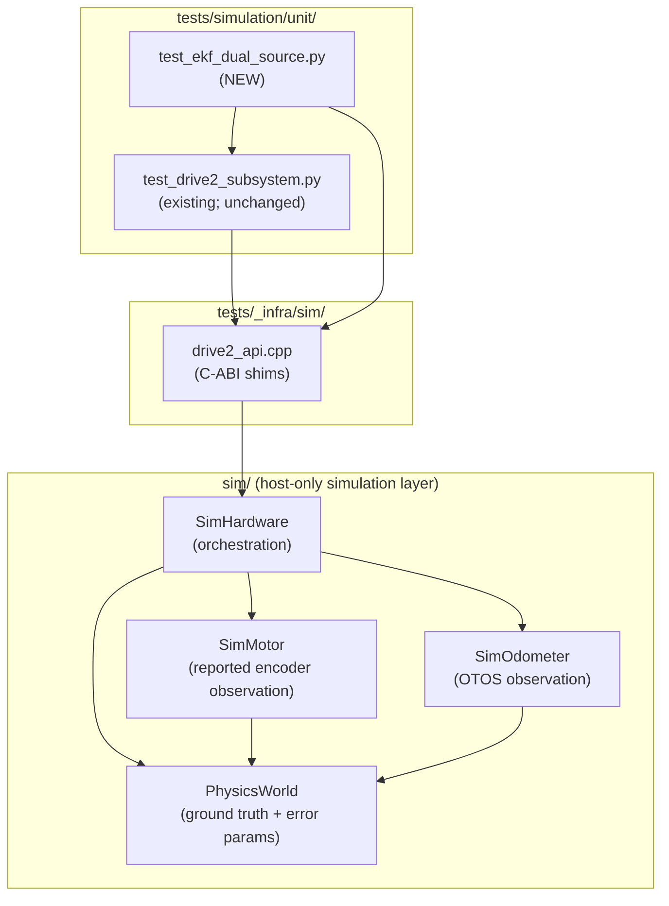

<!-- CLASI: Before changing code or making plans, review the SE process in CLAUDE.md -->

# Architecture Update — Sprint 058: Sim encoder-error injection and dual-source EKF fusion test

## What Changed

### New: Encoder error model in `PhysicsWorld` and `SimMotor`

`PhysicsWorld` gains two new per-wheel error parameters on the
**reported-encoder accumulator path**: `encScaleErrL/R` (fractional scale
error; 0.0 = perfect, 0.05 = 5% over-report) and `encSlipL/R` (fractional
slip; 0.0 = perfect, 0.03 = 3% of motion not registered). These are applied
in `PhysicsWorld::update()` to the per-tick delta before it is accumulated into
`_reportedEncLMm` / `_reportedEncRMm`. The true encoder accumulators
(`_trueEncLMm`, `_trueEncRMm`) and the chassis pose (`_truePoseX/Y/H`) are
not touched.

`SimMotor` gains two new setter methods:

```
void setScaleError(float err);   // fractional; 0 = perfect
void setSlip(float fraction);    // fractional; 0 = perfect
```

These forward to new `PhysicsWorld::setEncoderScaleError(int side, float err)`
and `PhysicsWorld::setEncoderSlip(int side, float fraction)` setters. All
default to zero — a freshly constructed `SimMotor` remains perfect.

### New: C-ABI shim `drive2_api_enable_encoder_sim_model`

`tests/_infra/sim/drive2_api.cpp` gains one new shim:

```c
void drive2_api_enable_encoder_sim_model(
    void* h,
    float slip_l,
    float slip_r,
    float scale_err_l,
    float scale_err_r
);
```

This mirrors `drive2_api_enable_otos_sim_model` (added in 057-005). It
configures both `SimMotor` instances on the `Drive2Handle`'s `SimHardware`.

### New: Dual-source EKF fusion test

`tests/simulation/unit/test_ekf_dual_source.py` (new file) contains:

- `test_ekf_dual_source_fusion` — injects non-trivial error into both encoder
  and OTOS paths, commands 50–100 ticks of forward motion, and asserts
  `fused_err < encoder_only_err` AND `fused_err < optical_only_err`.
- `test_encoder_error_injection_only` — verifies that calling only the encoder
  shim (no OTOS error) causes the encoder-only pose to diverge while fused pose
  stays close to ground truth.
- `test_otos_bad_encoder_good` — preserves the 057-005 scenario (OTOS noisy,
  encoder clean) so both regimes are exercised.

The new test file reuses `Drive2Ctx` and `_load_lib()` from
`test_drive2_subsystem.py` by importing them directly (both files are in the
same `tests/simulation/unit/` directory on `sys.path`).

## Why

Sprint 057's `test_ekf_fusion_beats_noise` proved the EKF can discard a
noisy OTOS when the encoder is clean. It does not prove genuine dual-source
fusion — the harder and more realistic scenario where both sensors are
imperfect and the EKF must blend them. The stakeholder explicitly requested
error injection for both sensor paths. This sprint closes that gap.

The encoder error model is intentionally kept at the `reportedEncMm()` level
(not the true accumulator), matching the architectural boundary established in
040-002: observation error belongs to the `Sim*` observation models, not
`PhysicsWorld` ground truth.

## Impact on Existing Components

| Component | Impact |
|-----------|--------|
| `PhysicsWorld` | New private fields `_encScaleErrL/R`, `_encSlipL/R`; new setters; `update()` applies them on the reported-encoder delta. Existing golden-TLM path: zero default → no change. |
| `SimMotor` | Two new public setters (`setScaleError`, `setSlip`); no interface change. |
| `drive2_api.cpp` | One new `extern "C"` function. No existing functions change. |
| `test_drive2_subsystem.py` | No changes. Existing tests are unaffected; new test file imports helpers from this module. |
| `SimOdometer` | No changes. |
| `PhysicsWorld::update()` sub-step A | The reported-encoder accumulation loop gains two multiplicative terms. Zero-default guarantees the OQ-1 golden-TLM canary and all existing slip-fence tests remain bit-identical. |

## Migration Concerns

None. All new parameters default to zero. No existing behaviour changes. No
data model or message schema changes. The firmware (device) build is unaffected
— the encoder error model lives entirely in `#ifdef HOST_BUILD` paths or in
headers/sources that are sim-only.

## Subsystem and Module Diagram



## Design Rationale

**Decision**: Apply encoder error at the `reportedEncMm()` delta level in
`PhysicsWorld::update()`, not in `SimMotor::tick()`.

**Context**: `SimMotor::tick()` only copies the already-computed reported
accumulator into `_lastPositionMm`. Applying error there would require
storing a separate "errored position" alongside the plant's reported
accumulator, creating two sources of truth.

**Alternatives considered**:
1. Apply error in `SimMotor::tick()` by perturbing `_lastPositionMm` after
   the copy. Simple, but splits error state across `SimMotor` and
   `PhysicsWorld`; harder to reason about and breaks the "all observation
   error in the observation model" principle.
2. Introduce a new `SimEncoder` observation model separate from `SimMotor`.
   Architecturally cleaner long-term, but disproportionate for the small knobs
   needed here; deferred to a future refactor.

**Why this choice**: Applying the error inside `PhysicsWorld::update()` keeps
all encoder error parameters in one place, consistent with how `setEncoderNoise`
already works. The observation model (`SimMotor`) remains a thin reader.

**Consequences**: The `_encScaleErrL/R` and `_encSlipL/R` fields live in
`PhysicsWorld` (not `SimMotor`), which is a slight violation of "observation
error belongs to the observation model." This is accepted as a pragmatic
continuation of the existing `setEncoderNoise` pattern.

## Open Questions

None. The design is fully determined by the existing 040-002/057-005 patterns.
