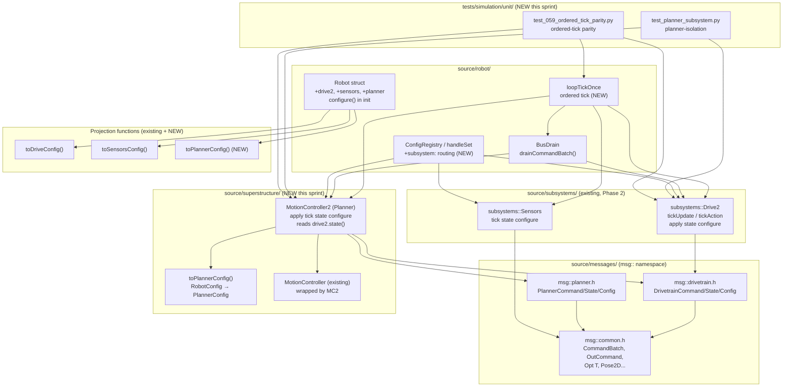
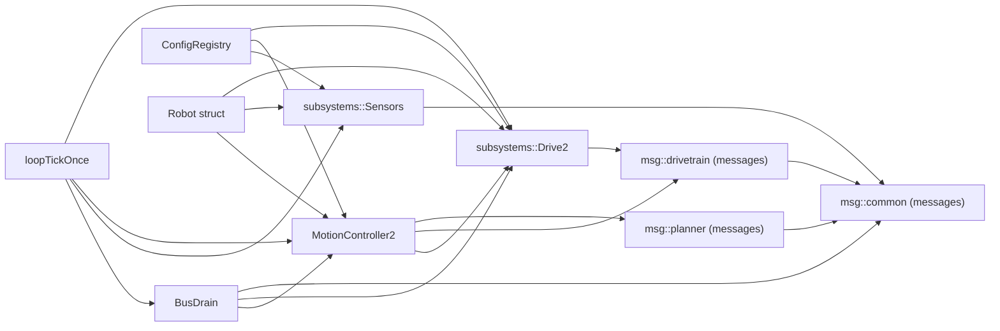

<!-- CLASI: Before changing code or making plans, review the SE process in CLAUDE.md -->

# Architecture Update — Sprint 059: Phase 3 - System integration, command bus, planner, and bottom-up config

## What Changed

### Sprint Changes Summary

Sprint 059 introduces five distinct changes that complete the Phase 3 integration:

1. **`MotionController2` (Planner subsystem)** — New class in
   `source/superstructure/MotionController2.h/.cpp` implementing the 4-verb
   message-contract on top of the existing `MotionController` logic: `apply(msg::PlannerCommand)`,
   `tick(uint32_t now) -> msg::CommandBatch`, `state() -> const msg::PlannerState&`, and
   `configure(msg::PlannerConfig)`. The returned `CommandBatch` contains one
   `DrivetrainCommand{twist}` per tick when a goal is active (RETURN model, not a sink).
   The Planner reads `Drive2::state()` for pose/twist — it never touches hardware or the
   motor stack. `toPlannerConfig(RobotConfig)` projection function added in
   `source/superstructure/PlannerConfig.cpp`.

2. **Command-queue bus drain+route** — New free function (or inline helper)
   `drainCommandBatch(batch, ...)` in `source/robot/BusDrain.h/.cpp`. Iterates over a
   returned `CommandBatch`, routes each `OutCommand` to the appropriate subsystem `apply()`
   or `CommandProcessor` verb handler, enforces a bounded cascade (`max_iters=8` per tick),
   and routes `OutCommand`s with `priority=true` via `CommandQueue::push_front`.

3. **Bottom-up config and live SET routing** — `robot_config.schema.json` gains a per-field
   `"subsystem"` annotation (`"drive"`, `"planner"`, `"sensors"`, or `"motor"`). The
   `handleSet` path in `ConfigRegistry.cpp` reads this annotation and calls
   `drive2.configure(delta)` / `planner.configure(delta)` / `sensors.configure(delta)` for
   the changed field, generalizing the existing `MotorController::updateVelGains` hook.
   `Robot`'s init sequence calls `configure()` on each subsystem after construction using
   `toDriveConfig()` / `toSensorsConfig()` / `toPlannerConfig()` projections.

4. **`loopTickOnce` ordered-tick cutover** — `loopTickOnce` is rewired to call subsystems
   in the eight-step ordered sequence (comms drain → `Drive2::tickUpdate` → bus drain →
   `Planner::tick` → bus drain → `Drive2::tickAction` → `Sensors::tick` → telemetry),
   replacing the old `Drive::periodic()` / `MotionController::driveAdvance()` / `robot.estimate` /
   `robot.otosCorrect()` / sensor-subsystem `periodic()` calls. The existing `Drive`,
   `MotionController`, and sensor periodic paths are retired from `loopTickOnce` (they
   remain in the codebase until cleanup, but are no longer called).

5. **Planner-isolation and parity sim tests** — New files
   `tests/simulation/unit/test_planner_subsystem.py` (planner-isolation: pure function of
   goal + injected pose, asserts returned `CommandBatch` twist sequence) and
   `tests/simulation/unit/test_059_ordered_tick_parity.py` (walk VW + TURN end-to-end
   through the new tick, assert byte-plausible parity against the golden-TLM baseline).

---

## Module Diagram

---

## Dependency Graph

Direction: Presentation/loop → Business logic (subsystems/planner) → Infrastructure (HAL/messages). No cycles.

---

## Why

Phase 2 proved the subsystem contract by building `Drive2` and `Sensors` as
standalone testable units. Phase 3 is the integration layer: connecting those units
to each other through a message bus, adding the goal-closure Planner, making config
flow bottom-up from projections rather than top-down via scattered assignments, and
finally making `loopTickOnce` call through the message-driven path.

The ordered tick is the payoff: it gives the firmware a uniform, inspectable
execution model where every inter-subsystem communication is a message in the
`CommandBatch` return value — loggable, replayable, and testable without a full
robot. The Planner isolation test is the litmus: if you can feed a goal and assert
the returned twist sequence, the architecture is working.

---

## Impact on Existing Components

| Component | Impact |
|-----------|--------|
| `source/superstructure/MotionController.h/.cpp` | No change. `MotionController2` wraps it by reference; existing interface is untouched. |
| `source/superstructure/Superstructure.*` | `evaluateSafety()` stays; STOP/ESTOP paths routed through `push_front` bus mechanism in the new tick. Kept unchanged this sprint. |
| `source/robot/Robot.h/.cpp` | Gains `drive2`, `sensors` (already there from Phase 2 as test-only members; now promoted to live members), and `planner` (`MotionController2`). Init sequence calls `configure()` on each after construction. |
| `source/robot/LoopTickOnce.cpp` | Rewired to eight-step ordered tick. Old `Drive::periodic()`, `MotionController::driveAdvance()`, `robot.estimate.*`, `robot.otosCorrect()`, `lineSensor.periodic()`, `colorSensor_.periodic()` calls replaced by `Drive2`/`Planner`/`Sensors` calls. |
| `source/robot/ConfigRegistry.cpp` | `handleSet` gains subsystem-routing branch: looks up `"subsystem"` field in schema and calls `configure(delta)` on the matching subsystem. |
| `data/robots/robot_config.schema.json` | Gains `"subsystem"` annotation per firmware field (drive, planner, sensors, motor). Schema is SSOT; annotation is metadata only. |
| `source/subsystems/drive/Drive.h/.cpp` | No change. `Drive::periodic()` still exists but is no longer called from `loopTickOnce` after cutover. |
| `source/subsystems/sensors/LineSensor.*`, `ColorSensor.*` | No change. `Sensors::tick()` now calls them via the `Sensors` facade rather than `loopTickOnce` calling them directly. |
| `source/subsystems/drive/Drive2.*` | No change to the class contract from Phase 2. Now wired into `Robot` as a live member and called from `loopTickOnce`. |
| `source/subsystems/sensors/Sensors.*` | No change to the class contract. Now wired into `Robot` as a live member and called from `loopTickOnce`. |
| Existing golden-TLM tests | Must pass unchanged. The parity ticket explicitly verifies this before cutover. |
| `main.cpp` | Init sequence gains `configure()` calls on each subsystem using projection functions. `Robot` construction order documented. |

---

## Migration Concerns

**Additive until the cutover ticket.** The first four tickets (Planner, planner tests,
bus drain, bottom-up config) are all additive: they add new classes and functions
without changing `loopTickOnce`. The existing robot behavior is byte-identical until
ticket 005 (ordered-tick cutover). This means:

- Tickets 001–004 can be merged and tested individually without risking regression.
- Ticket 005 (the cutover) is gated by the parity test (`test_059_ordered_tick_parity.py`)
  which must confirm byte-plausible parity for VW and TURN before the ticket is
  considered done.
- If parity is not achievable in ticket 005, the outcome is a feature-flagged
  parallel integration: both `loopTickOnce` paths coexist under a compile-time
  `#ifdef USE_ORDERED_TICK` flag until the discrepancy is debugged. This is an
  honest outcome and does not block the bench smoke (ticket 006) if the flag is set.

**SetPose / SI routing.** The old `handleSI` calls `estimate.resetPose()` directly.
In ticket 004, this is routed to `drive2.apply(DrivetrainCommand{SetPose{...}})`.
The mapping is one-to-one (no behavior change), but it must be audited against the
golden-TLM test for the SI verb.

**`MotorController::updateVelGains` generalization.** In ticket 004, the existing
`updateVelGains` hook in `handleSet` is superseded by the generic `subsystem:`
routing path. `updateVelGains` is kept as a private helper called by
`drive2.configure()` internally — it is not deleted.

---

## Design Rationale

### Decision 1: `MotionController2` wraps `MotionController` (not a rewrite)

**Context**: `MotionController` is the existing imperative goal-closure engine with
~500 lines of well-tested trapezoid/heading/stop logic. Sprint 057 validated the
Drive2 additive strategy (new class alongside old). The same pattern applies here.

**Choice**: `MotionController2` holds a reference to `MotionController` and delegates
`apply()` → the appropriate `begin*()` entry point, `tick()` → `driveAdvance()`,
`state()` → extract `PlannerState` from existing `TargetState`/`DesiredState`, and
`configure()` → update `_cfg` fields.

**Consequences**: No behavioral change to goal closure. The planner-isolation test
exercises the wrapper; the wrapped `MotionController` logic is unchanged. Phase 4
(future) can thin the wrapper or delete `MotionController` once `MotionController2`
is proven.

### Decision 2: Bus drain as a free function in `BusDrain.h`

**Context**: The bus drain logic needs to be called in two places per tick (once
after user-command processing, once after Planner tick). It needs access to `Drive2`,
`Planner`, and `CommandProcessor`. Making it a member of any one of these would
create cross-coupling.

**Choice**: Free function `drainCommandBatch(batch, drive2, planner, sensors,
cmd_proc, queue)`. Declared in `source/robot/BusDrain.h`. The function is
stateless; all routing context is passed by reference.

**Consequences**: No new dependencies introduced at the class level. The function is
easily tested in isolation by constructing mock subsystems. Bounded cascade (8 iters)
is enforced inside the function.

### Decision 3: `subsystem:` annotation in schema, not a separate routing table

**Context**: Two alternatives: (a) hand-maintain a `kSubsystemRouting[]` table
alongside `kRegistry[]`; (b) annotate the JSON schema and generate / read at runtime.

**Choice**: Add `"subsystem": "drive"` to each field entry in
`robot_config.schema.json`. `handleSet` reads the annotation via the existing schema
reader or a parallel lookup table generated from the schema (same pattern as
`gen_default_config.py`). The schema is the single source of truth.

**Consequences**: The annotation is metadata; no firmware behavior changes unless
SET is called. Adding a new subsystem field later requires only a schema annotation,
not a code change in `handleSet`.

### Decision 4: Parity gate before cutover (not after)

**Context**: The cutover in ticket 005 is the highest-risk change. The alternative
is to cut over first and debug parity failures after.

**Choice**: `test_059_ordered_tick_parity.py` is written and run against the OLD
`loopTickOnce` first (to capture the golden baseline), then run against the NEW path.
The ticket is considered DONE only when both baselines match within tolerance.

**Consequences**: The cutover ticket may take more iteration but cannot be silently
wrong. If parity cannot be achieved, a `#ifdef USE_ORDERED_TICK` flag preserves both
paths and the investigation can continue without blocking the bench smoke.

---

## Open Questions

1. **`MotionController2` constructor signature**: It needs refs to `MotionController`,
   `Drive2` (to read `state()`), and `RobotConfig`. The implementer should verify that
   the `MotionController` ref can safely be held alongside the existing `Robot::motionController`
   member without creating a second owner of the same state.

2. **`driveAdvance` reply channel in `MotionController2::tick()`**: `MotionController::driveAdvance()`
   takes `HardwareState& inputs, MotorCommands& cmds, TargetState& target, uint32_t now_ms`.
   `MotionController2` must supply these from `drive2.state()` and its own internal copies.
   The implementer should decide whether `MotionController2` owns internal `HardwareState` /
   `MotorCommands` / `TargetState` copies or holds references into `Robot`.

3. **`SET` routing for composite fields** (e.g., `SET vel.kP`): The `kRegistry[]` key
   is a dot-string like `"vel.kP"`. The schema annotation must match this key exactly.
   The implementer should verify the key format is consistent between `kRegistry` and the
   schema before generating the routing table.

4. **`push_front` capacity in the bus drain**: `CommandQueue` capacity is 4. If the bus
   drain routes a `priority=true` command to `push_front` when the queue is full, the
   command is silently dropped (current `push_front` returns `false`). The implementer
   should decide whether overflow of a safety command warrants an EVT or a hard assertion.
